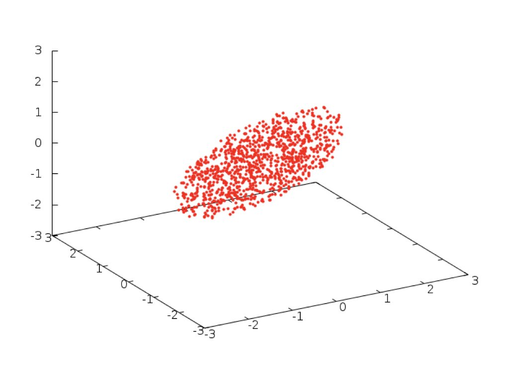
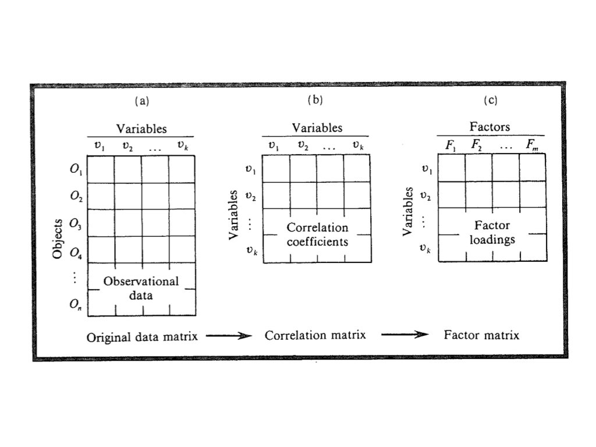
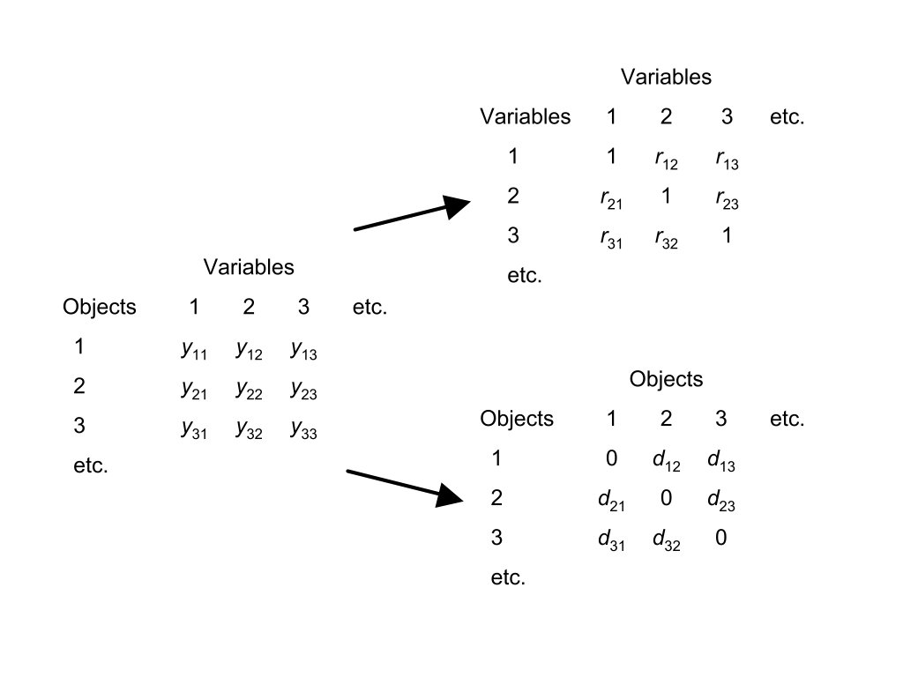
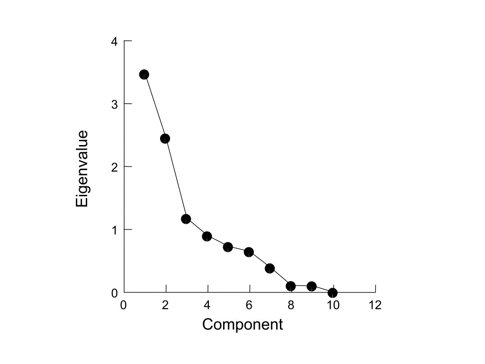
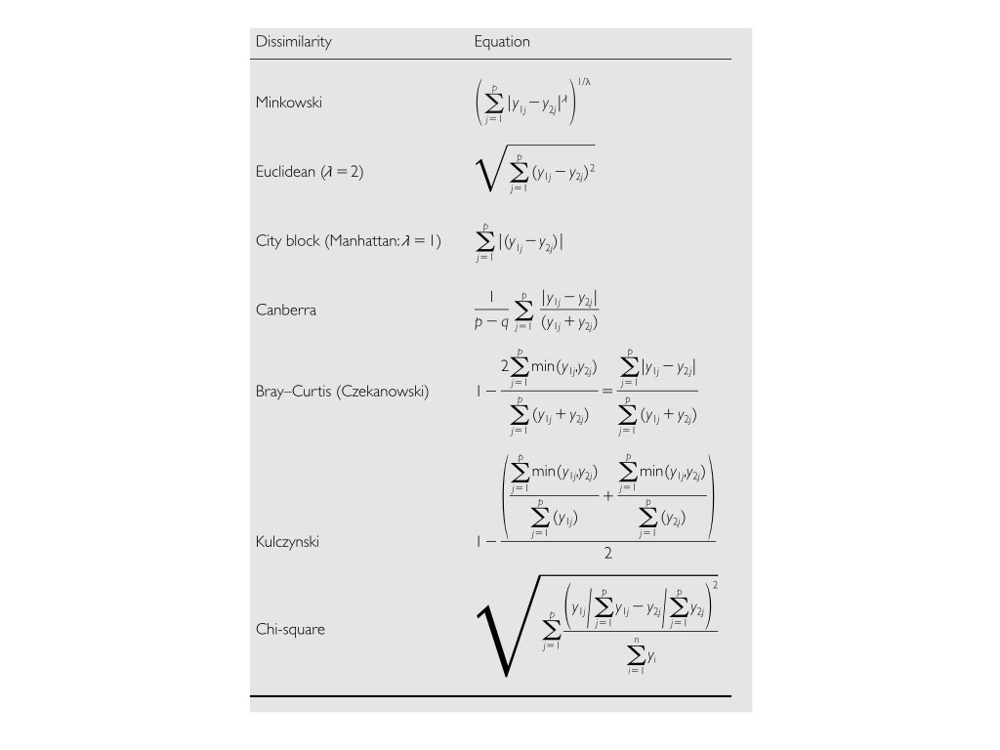
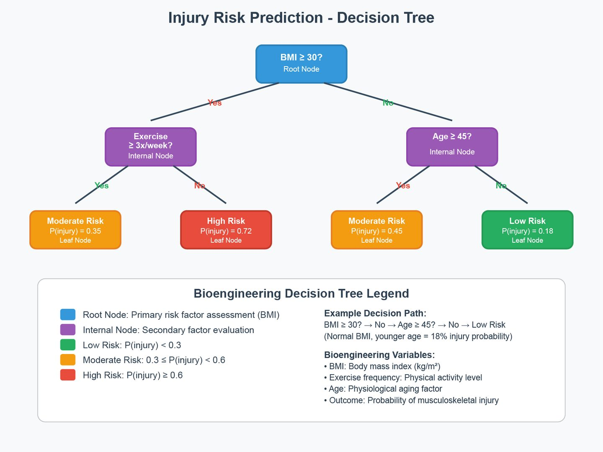

```{r}
#| label: setup
#| include: false

# Core data manipulation and visualization
library(tidyverse)
library(knitr)
library(readxl)

# Statistical analysis packages
library(MASS)        # LDA, robust regression
library(pwr)         # Power analysis
library(boot)        # Bootstrap methods
library(car)         # Companion to Applied Regression
library(survival)    # Survival analysis
library(nlme)        # Mixed effects models
library(broom)       # Tidy model output
library(emmeans)     # Estimated marginal means
library(vegan)       # Ecological ordination (PCoA, NMDS, PERMANOVA)
library(rpart)       # Decision trees
library(randomForest) # Random forests
library(e1071)       # SVM

# Set consistent theme for all plots
theme_set(theme_minimal(base_size = 14))

# Set seed for reproducibility
set.seed(2026)
```

# Week 10: Multivariate Methods {background-color="#2c3e50"}

## Week 10 Topics

::: incremental
-   Multivariate statistics overview
-   MANOVA
-   Discriminant Function Analysis (DFA / LDA)
-   Principal Component Analysis (PCA)
-   PCoA and NMDS
-   t-SNE and UMAP
-   Decision trees and random forests
:::

::: callout-note
**Readings:** Chapters 38–39
:::

## Packages for This Week {.smaller}

::: panel-tabset
### Install

```{r}
#| eval: false
#| echo: true

# Install new packages (run once)
install.packages(c("MASS", "Rtsne", "umap", "vegan",
                   "mvnormtest", "mvoutlier", "rpart", "randomForest"))
```

### Load

```{r}
#| eval: false
#| echo: true

library(tidyverse)      # Data manipulation & visualization
library(MASS)           # Linear discriminant analysis (LDA)
library(car)            # Multivariate tests
library(Rtsne)          # t-SNE dimensionality reduction
library(umap)           # UMAP dimensionality reduction
library(vegan)          # NMDS and ecological ordination
library(mvnormtest)     # Multivariate normality tests
library(rpart)          # Decision trees
library(randomForest)   # Random forests
```
:::

**Built-in datasets:** `iris` (PCA, LDA, t-SNE, UMAP examples)

## Experimental Design Overview {.smaller}

{fig-align="center" width="80%"}

------------------------------------------------------------------------

# Introduction to Multivariate Statistics {background-color="#2c3e50"}

## Multivariate Data {.smaller}

{fig-align="center" width="90%"}

## DRAFT: 3D Multivariate Data Cloud {.smaller}

```{r}
#| echo: false
#| eval: true
#| fig-width: 8
#| fig-height: 6

# Simulate correlated 3D data
set.seed(42)
n <- 500
# Correlated data: elongated ellipsoid
z1 <- rnorm(n)
z2 <- rnorm(n) * 0.6
z3 <- rnorm(n) * 0.3

# Rotate to create correlation structure
x <- z1 + 0.5 * z2
y <- 0.3 * z1 + z2 + 0.2 * z3
z <- 0.1 * z1 + 0.2 * z2 + z3

# 3D scatter plot using persp-like approach
par(mar = c(1, 1, 2, 1))
# Sort by depth for 3D effect
order_idx <- order(z)

# Simple perspective projection
theta <- 30; phi <- 20
theta_r <- theta * pi / 180
phi_r <- phi * pi / 180

x_proj <- x * cos(theta_r) - y * sin(theta_r)
y_proj <- -(x * sin(theta_r) + y * cos(theta_r)) * sin(phi_r) + z * cos(phi_r)

plot(x_proj[order_idx], y_proj[order_idx], pch = 16, cex = 0.5, col = "red",
     xlab = "", ylab = "", main = "Multivariate Data in 3D",
     axes = FALSE, cex.main = 1.5)
box()
```

## Multivariate Approach {.smaller}

{fig-align="center" width="90%"}

## DRAFT: PCA Matrix Transformation {.smaller}

**The PCA pipeline transforms data through matrix operations:**

::::: columns
::: {.column width="33%"}
**(a) Original Data Matrix**

|         | $v_1$ | $v_2$ | $\ldots$ | $v_k$ |
|:--------|:------|:------|:---------|:------|
| $O_1$   |       |       |          |       |
| $O_2$   |       |       |          |       |
| $O_3$   |       |       |          |       |
| $\vdots$|       |       |          |       |
| $O_n$   |       |       |          |       |

*Objects × Variables*
*Observational data*
:::

::: {.column width="33%"}
**(b) Correlation Matrix**

|         | $v_1$ | $v_2$ | $\ldots$ | $v_k$ |
|:--------|:------|:------|:---------|:------|
| $v_1$   |       |       |          |       |
| $v_2$   |       |       |          |       |
| $\vdots$|       |       |          |       |
| $v_k$   |       |       |          |       |

*Variables × Variables*
*Correlation coefficients*
:::

::: {.column width="33%"}
**(c) Factor Matrix**

|         | $F_1$ | $F_2$ | $\ldots$ | $F_m$ |
|:--------|:------|:------|:---------|:------|
| $v_1$   |       |       |          |       |
| $v_2$   |       |       |          |       |
| $\vdots$|       |       |          |       |
| $v_k$   |       |       |          |       |

*Variables × Factors*
*Factor loadings*
:::
:::::

**Original data matrix → Correlation matrix → Factor matrix**

## Multivariate Methods Overview {.smaller}

{fig-align="center" width="90%"}

## DRAFT: Data → Correlation and Distance Matrices {.smaller}

::::: columns
::: {.column width="33%"}
**Data Matrix** (Objects × Variables)

|         | 1       | 2       | 3       |
|:--------|:--------|:--------|:--------|
| 1       | $y_{11}$| $y_{12}$| $y_{13}$|
| 2       | $y_{21}$| $y_{22}$| $y_{23}$|
| 3       | $y_{31}$| $y_{32}$| $y_{33}$|
:::

::: {.column width="33%"}
**↗ Correlation Matrix** (Variables × Variables)

|   | 1       | 2       | 3       |
|:--|:--------|:--------|:--------|
| 1 | 1       | $r_{12}$| $r_{13}$|
| 2 | $r_{21}$| 1       | $r_{23}$|
| 3 | $r_{31}$| $r_{32}$| 1       |
:::

::: {.column width="33%"}
**↘ Distance Matrix** (Objects × Objects)

|   | 1       | 2       | 3       |
|:--|:--------|:--------|:--------|
| 1 | 0       | $d_{12}$| $d_{13}$|
| 2 | $d_{21}$| 0       | $d_{23}$|
| 3 | $d_{31}$| $d_{32}$| 0       |
:::
:::::

- **Correlation matrix** → used for PCA, factor analysis (relationships among *variables*)
- **Distance matrix** → used for clustering, ordination (relationships among *objects*)

## Variance-Covariance and Eigenvalues {.smaller}

{fig-align="center" width="90%"}

## DRAFT: PCA Scree Plot {.smaller}

```{r}
#| echo: false
#| eval: true
#| fig-width: 8
#| fig-height: 6

# Simulated eigenvalues that decay
eigenvalues <- c(3.5, 2.5, 1.2, 0.95, 0.78, 0.7, 0.65, 0.4, 0.12, 0.1, 0.08, 0.02)

par(mar = c(5, 5, 3, 2))
plot(1:length(eigenvalues), eigenvalues, type = "b",
     pch = 16, cex = 2, lwd = 1.5,
     xlab = "Component", ylab = "Eigenvalue",
     main = "Scree Plot",
     xlim = c(0, 12), ylim = c(0, 4),
     cex.lab = 1.4, cex.main = 1.5, cex.axis = 1.2)
```

## Dissimilarity and Distance {.smaller}

{fig-align="center" width="90%"}

## DRAFT: Dissimilarity / Distance Formulas {.smaller}

| Dissimilarity | Equation |
|:--------------|:---------|
| **Minkowski** | $\left(\displaystyle\sum_{j=1}^{p} \lvert y_{1j} - y_{2j} \rvert^{\lambda}\right)^{1/\lambda}$ |
| **Euclidean** ($\lambda = 2$) | $\sqrt{\displaystyle\sum_{j=1}^{p}(y_{1j} - y_{2j})^2}$ |
| **City block / Manhattan** ($\lambda = 1$) | $\displaystyle\sum_{j=1}^{p}\lvert y_{1j} - y_{2j}\rvert$ |
| **Canberra** | $\dfrac{1}{p-q}\displaystyle\sum_{j=1}^{p}\dfrac{\lvert y_{1j} - y_{2j}\rvert}{y_{1j} + y_{2j}}$ |
| **Bray–Curtis** | $\dfrac{\displaystyle\sum_{j=1}^{p}\lvert y_{1j} - y_{2j}\rvert}{\displaystyle\sum_{j=1}^{p}(y_{1j} + y_{2j})}$ |
| **Chi-square** | $\sqrt{\displaystyle\sum_{j=1}^{p}\dfrac{\left(y_{1j}\dfrac{\sum y_{1j} - y_{2j}}{\sum y_{2j}}\right)^2}{\sum y_j}}$ |

## Handling Missing Data in Multivariate Analysis {.smaller}

| Type     | Description                  | Problem Severity  |
|:---------|:-----------------------------|:------------------|
| **MCAR** | Missing Completely At Random | Least problematic |
| **MAR**  | Missing At Random            | Moderate concern  |
| **MBC**  | Missing But Correlated       | Most problematic  |

::: callout-tip
## Three Main Approaches

1.  **Deletion** — remove observations with missing values (simple but loses information)
2.  **Imputation** — infer missing values (mean/median or multiple imputation)
3.  **Maximum Likelihood / EM** — use all available data (most sophisticated)
:::

------------------------------------------------------------------------

# MANOVA — Multivariate Analysis of Variance {background-color="#2c3e50"}

## Why Use MANOVA? {.smaller}

-   When interested in the relationship of **two or more response variables** and one or more predictor variables
-   Tests whether **group centroids** differ across multiple variables simultaneously
-   More powerful than running separate univariate ANOVAs when response variables are correlated

::: panel-tabset
### Equation

$$H_0: \boldsymbol{\mu}_1 = \boldsymbol{\mu}_2 = \ldots = \boldsymbol{\mu}_k$$

### LaTeX

``` text
H_0: \boldsymbol{\mu}_1 = \boldsymbol{\mu}_2 = \ldots = \boldsymbol{\mu}_k
```
:::

## MANOVA Linear Model {.smaller}

Single Factor MANOVA uses a linear combination of p response variables:

::: panel-tabset
### Equation

$$z_{ik} = c_1 y_{i1} + c_2 y_{i2} + c_3 y_{i3} + \ldots + c_p y_{ip}$$

### Key Matrices

-   **H matrix**: Between-groups sums of squares and cross-products
-   **E matrix**: Within-groups sums of squares and cross-products
-   **T matrix**: Total sums of squares and cross-products
-   The ratio H/E is decomposed into eigenvalues and eigenvectors
:::

## MANOVA Test Statistics {.smaller}

| Statistic              | Description               | Use When               |
|:-----------------------|:--------------------------|:-----------------------|
| **Wilk's Lambda**      | Most commonly used        | General purpose        |
| **Pillai's Trace**     | Most robust               | Assumption violations  |
| **Hotelling-Lawley**   | Most powerful             | Assumptions met        |
| **Roy's Largest Root** | Examines first eigenvalue | Few response variables |

## MANOVA in R {.smaller}

::: panel-tabset
### Output

```{r}
#| echo: false
#| eval: true

iris_manova <- manova(cbind(Sepal.Length, Sepal.Width,
                            Petal.Length, Petal.Width) ~ Species,
                      data = iris)
summary(iris_manova, test = "Pillai")
```

### Code

```{r}
#| eval: false
#| echo: true

iris_manova <- manova(cbind(Sepal.Length, Sepal.Width,
                            Petal.Length, Petal.Width) ~ Species,
                      data = iris)

# Different test statistics
summary(iris_manova, test = "Pillai")
summary(iris_manova, test = "Wilks")
summary(iris_manova, test = "Hotelling-Lawley")

# Follow up with univariate ANOVAs
summary.aov(iris_manova)
```
:::

## MANOVA Assumptions {.smaller}

1.  **Multivariate Normality** — less critical for Pillai's trace
2.  **Homogeneity of Variance-Covariance** — test with Box's M
3.  **Independence** of observations
4.  **No Multicollinearity** among response variables

::: callout-warning
## Outliers

MANOVA is very sensitive to multivariate outliers. Use **Mahalanobis distance** to detect them.
:::

## Detecting Multivariate Outliers {.smaller}

::: panel-tabset
### Output

```{r}
#| label: mahal-outliers-output
#| echo: false
#| eval: true
#| fig-width: 8
#| fig-height: 4

iris_numeric <- iris[, 1:4]
center <- colMeans(iris_numeric)
cov_matrix <- cov(iris_numeric)
mahal_dist <- mahalanobis(iris_numeric, center, cov_matrix)

plot(mahal_dist, pch = 19, main = "Mahalanobis Distances",
     ylab = "Mahalanobis Distance", xlab = "Observation")
abline(h = qchisq(0.975, df = 4), col = "red", lwd = 2)
```

### Code

```{r}
#| label: mahal-outliers-code
#| echo: true
#| eval: false

iris_numeric <- iris[, 1:4]
center <- colMeans(iris_numeric)
cov_matrix <- cov(iris_numeric)
mahal_dist <- mahalanobis(iris_numeric, center, cov_matrix)

plot(mahal_dist, pch = 19, main = "Mahalanobis Distances",
     ylab = "Mahalanobis Distance", xlab = "Observation")
abline(h = qchisq(0.975, df = 4), col = "red", lwd = 2)
```
:::

## MANOVA Follow-Up Workflow {.smaller}

After a significant MANOVA, determine **which variables** drive the group differences:

::: panel-tabset
### Code

```{r}
#| echo: true
#| eval: false

# Step 1: MANOVA
manova_result <- manova(cbind(Sepal.Length, Sepal.Width,
                               Petal.Length, Petal.Width) ~ Species,
                         data = iris)
summary(manova_result, test = "Pillai")

# Step 2: Univariate follow-up ANOVAs
summary.aov(manova_result)

# Step 3: Post-hoc pairwise comparisons for each response
library(emmeans)
for (var in c("Sepal.Length", "Sepal.Width",
              "Petal.Length", "Petal.Width")) {
  cat("\n---", var, "---\n")
  fit <- lm(as.formula(paste(var, "~ Species")), data = iris)
  em <- emmeans(fit, pairwise ~ Species, adjust = "bonferroni")
  print(em$contrasts)
}

# Step 4: Effect sizes (eta-squared for each variable)
library(car)
for (var in c("Sepal.Length", "Sepal.Width",
              "Petal.Length", "Petal.Width")) {
  fit <- lm(as.formula(paste(var, "~ Species")), data = iris)
  aov_table <- Anova(fit, type = "II")
  ss_group <- aov_table$`Sum Sq`[1]
  ss_total <- sum(aov_table$`Sum Sq`)
  cat(var, "eta² =", round(ss_group / ss_total, 3), "\n")
}
```

### Workflow Summary

1.  **MANOVA**: Test overall multivariate difference → significant?
2.  **Univariate ANOVAs**: Which response variables differ?
3.  **Post-hoc tests**: Which groups differ on each variable?
4.  **Effect sizes**: How large are the differences?
5.  **DFA/LDA**: Which combinations of variables best discriminate groups?
:::

------------------------------------------------------------------------

# Discriminant Function Analysis (DFA / LDA) {background-color="#2c3e50"}

## MANOVA vs DFA {.smaller}

| Aspect | MANOVA | DFA |
|:---|:---|:---|
| **Purpose** | Hypothesis testing | Classification & prediction |
| **Question** | Do groups differ? | Which group does a new observation belong to? |
| **Output** | F-statistic, p-value | Discriminant functions, predictions |
| **Focus** | First discriminant function | All discriminant functions |

Both methods use the same underlying mathematics (eigendecomposition of H/E) but for different purposes.

## DFA Steps {.smaller}

1.  **Run MANOVA** to test for group differences
    -   If not significant, DFA won't be useful
2.  **Calculate Linear Discriminant Functions (LDF)**
    -   Evaluate distributions of LDF scores
    -   Do groups have separate distributions?
3.  **Classify observations**
    -   Generate conditional (posterior) probabilities
    -   Determine percentage of correct assignments
    -   Can train on one dataset and predict on new data

## Linear Discriminant Analysis in R {.smaller}

::: panel-tabset
### Output

```{r}
#| echo: false
#| eval: true

library(MASS)
iris_lda <- lda(Species ~ Sepal.Length + Sepal.Width +
                         Petal.Length + Petal.Width,
               data = iris)
iris_lda$scaling
```

### Code

```{r}
#| echo: true
#| eval: false

library(MASS)

# Fit LDA model
iris_lda <- lda(Species ~ Sepal.Length + Sepal.Width +
                         Petal.Length + Petal.Width,
               data = iris)

# View discriminant function coefficients
iris_lda$scaling
```
:::

## LDA Predictions and Classification {.smaller}

::: panel-tabset
### Output

```{r}
#| echo: false
#| eval: true

iris_pred <- predict(iris_lda)
table(Predicted = iris_pred$class, Actual = iris$Species)
```

### Code

```{r}
#| echo: true
#| eval: false

# Make predictions
iris_pred <- predict(iris_lda)

# Confusion matrix
table(Predicted = iris_pred$class, Actual = iris$Species)
```
:::

## Visualizing Discriminant Functions {.smaller}

::: panel-tabset
### Output

```{r}
#| label: lda-viz-output
#| echo: false
#| eval: true
#| fig-width: 10
#| fig-height: 5

lda_scores <- predict(iris_lda)$x
plot(lda_scores[, 1], lda_scores[, 2],
     col = as.numeric(iris$Species), pch = 19,
     xlab = "LD1", ylab = "LD2",
     main = "Linear Discriminant Analysis — Iris Data")
legend("topright", levels(iris$Species),
       col = 1:3, pch = 19)
```

### Code

```{r}
#| label: lda-viz-code
#| echo: true
#| eval: false

lda_scores <- predict(iris_lda)$x
plot(lda_scores[, 1], lda_scores[, 2],
     col = as.numeric(iris$Species), pch = 19,
     xlab = "LD1", ylab = "LD2",
     main = "Linear Discriminant Analysis — Iris Data")
legend("topright", levels(iris$Species),
       col = 1:3, pch = 19)
```
:::

## LDA for New Predictions {.smaller}

::: panel-tabset
### Output

```{r}
#| echo: false
#| eval: true

new_flowers <- data.frame(
  Sepal.Length = c(5.0, 6.5, 7.0),
  Sepal.Width  = c(3.5, 3.0, 3.2),
  Petal.Length  = c(1.4, 4.5, 6.0),
  Petal.Width   = c(0.2, 1.5, 2.0)
)

predict(iris_lda, new_flowers)$class
round(predict(iris_lda, new_flowers)$posterior, 3)
```

### Code

```{r}
#| echo: true
#| eval: false

# Create new observations
new_flowers <- data.frame(
  Sepal.Length = c(5.0, 6.5, 7.0),
  Sepal.Width  = c(3.5, 3.0, 3.2),
  Petal.Length  = c(1.4, 4.5, 6.0),
  Petal.Width   = c(0.2, 1.5, 2.0)
)

# Predict species
predict(iris_lda, new_flowers)$class

# Get posterior probabilities
round(predict(iris_lda, new_flowers)$posterior, 3)
```
:::

## Logistic Regression as Classification {.smaller}

Recall from Week 8 that logistic regression can also be used for classification. The key differences from LDA:

| Aspect | LDA | Logistic Regression |
|:---|:---|:---|
| **Assumption** | Multivariate normal predictors | No distributional assumption |
| **Output** | Discriminant scores + classes | Log-odds + probabilities |
| **Best for** | Well-separated groups, normal data | Binary outcomes, mixed data types |
| **Multi-class** | Natural extension | Requires one-vs-rest |

::: callout-tip
Use LDA when you believe the predictors are approximately multivariate normal within each group. Use logistic regression when you have binary outcomes or non-normal predictors.
:::

## LDA Cross-Validation for Honest Accuracy {.smaller}

Training and testing on the same data gives **overly optimistic** accuracy estimates. Use leave-one-out CV:

::: panel-tabset
### Code

```{r}
#| echo: true
#| eval: false

library(MASS)

# LOOCV for LDA (built into MASS::lda!)
lda_cv <- lda(Species ~ ., data = iris, CV = TRUE)

# Honest classification accuracy
cv_accuracy <- mean(lda_cv$class == iris$Species)
cat("LDA LOOCV Accuracy:", round(cv_accuracy, 3))

# Confusion matrix from CV
table(Predicted = lda_cv$class, Actual = iris$Species)

# Compare with resubstitution (training accuracy — optimistic!)
lda_train <- lda(Species ~ ., data = iris)
train_pred <- predict(lda_train, iris)$class
train_accuracy <- mean(train_pred == iris$Species)
cat("\nTraining Accuracy:", round(train_accuracy, 3))
cat("\nCV Accuracy:     ", round(cv_accuracy, 3))
cat("\nDifference:      ", round(train_accuracy - cv_accuracy, 3))
```

### Classifier Comparison

```{r}
#| echo: true
#| eval: false

# Compare LDA vs. KNN vs. SVM via 10-fold CV
library(caret)
set.seed(42)
ctrl <- trainControl(method = "cv", number = 10)

# LDA
lda_cv_fit <- train(Species ~ ., data = iris, method = "lda",
                    trControl = ctrl)
# KNN
knn_cv_fit <- train(Species ~ ., data = iris, method = "knn",
                    trControl = ctrl, tuneGrid = data.frame(k = 1:15))
# SVM
svm_cv_fit <- train(Species ~ ., data = iris, method = "svmRadial",
                    trControl = ctrl)

# Compare results
results <- resamples(list(LDA = lda_cv_fit, KNN = knn_cv_fit, SVM = svm_cv_fit))
summary(results)
dotplot(results)
```
:::

# BREAK {background-color="#e74c3c"}

# Principal Component Analysis (PCA) {background-color="#2c3e50"}

## What is PCA? {.smaller}

-   **Dimensionality reduction** technique for continuous data
-   Finds orthogonal directions (principal components) of **maximum variance**
-   Transforms correlated variables into uncorrelated components
-   First PC explains the most variance, second PC the next most, etc.

::: callout-tip
## Key Concepts

-   **Principal components**: new axes that maximize variance
-   **Eigenvalues**: amount of variance explained by each PC
-   **Loadings**: contribution of original variables to each PC
-   **Scores**: coordinates of observations in PC space
:::

## PCA in R {.smaller}

::: panel-tabset
### Output

```{r}
#| echo: false
#| eval: true

pca_result <- prcomp(iris[, 1:4], scale. = TRUE)
summary(pca_result)
```

### Code

```{r}
#| echo: true
#| eval: false

# PCA on iris data (excluding species)
pca_result <- prcomp(iris[, 1:4], scale. = TRUE)

# Variance explained
summary(pca_result)
```
:::

## PCA Biplot {.smaller}

::: panel-tabset
### Output

```{r}
#| label: pca-biplot-output
#| echo: false
#| eval: true
#| fig-width: 8
#| fig-height: 5

biplot(pca_result, col = c("gray", "red"))
```

### Code

```{r}
#| label: pca-biplot-code
#| echo: true
#| eval: false

biplot(pca_result, col = c("gray", "red"))
```
:::

## Scree Plot {.smaller}

::: panel-tabset
### Output

```{r}
#| label: scree-plot-output
#| echo: false
#| eval: true
#| fig-width: 8
#| fig-height: 4

var_explained <- pca_result$sdev^2 / sum(pca_result$sdev^2)

plot(var_explained, type = "b", pch = 19,
     xlab = "Principal Component", ylab = "Proportion of Variance",
     main = "Scree Plot")
```

### Code

```{r}
#| label: scree-plot-code
#| echo: true
#| eval: false

var_explained <- pca_result$sdev^2 / sum(pca_result$sdev^2)

plot(var_explained, type = "b", pch = 19,
     xlab = "Principal Component", ylab = "Proportion of Variance",
     main = "Scree Plot")
```
:::

## Interpreting PCA Loadings {.smaller}

The loadings (rotation matrix) tell you **which original variables contribute most** to each PC:

::: panel-tabset
### Output

```{r}
#| label: pca-loadings-output
#| echo: false
#| eval: true
#| fig-width: 10
#| fig-height: 4

par(mfrow = c(1, 2), mar = c(5, 8, 3, 1))

# Loadings barplot for PC1
loadings_pc1 <- pca_result$rotation[, 1]
barplot(sort(loadings_pc1), horiz = TRUE, las = 1,
        main = "PC1 Loadings", col = "steelblue",
        xlab = "Loading")

# Loadings barplot for PC2
loadings_pc2 <- pca_result$rotation[, 2]
barplot(sort(loadings_pc2), horiz = TRUE, las = 1,
        main = "PC2 Loadings", col = "coral",
        xlab = "Loading")
```

### Code

```{r}
#| label: pca-loadings-code
#| echo: true
#| eval: false

# View the rotation (loadings) matrix
pca_result$rotation

# Loadings barplot
par(mfrow = c(1, 2), mar = c(5, 8, 3, 1))
barplot(sort(pca_result$rotation[, 1]), horiz = TRUE, las = 1,
        main = "PC1 Loadings", col = "steelblue")
barplot(sort(pca_result$rotation[, 2]), horiz = TRUE, las = 1,
        main = "PC2 Loadings", col = "coral")

# For many variables, use a heatmap of loadings
heatmap(pca_result$rotation, scale = "column",
        col = hcl.colors(50, "RdBu"),
        main = "PCA Loadings Heatmap")
```

### Interpretation

-   **Large positive loading**: variable increases along that PC direction
-   **Large negative loading**: variable decreases
-   **Near zero loading**: variable contributes little to that PC
-   PC1 often represents overall size; PC2 often represents shape contrasts
:::

## Publication-Quality PCA with ggplot2 {.smaller}

::: panel-tabset
### Output

```{r}
#| label: pca-ggplot-output
#| echo: false
#| eval: true
#| fig-width: 8
#| fig-height: 5

library(ggplot2)
pca_scores <- as.data.frame(pca_result$x)
pca_scores$Species <- iris$Species
var_exp <- round(100 * pca_result$sdev^2 / sum(pca_result$sdev^2), 1)

ggplot(pca_scores, aes(x = PC1, y = PC2, color = Species)) +
  geom_point(size = 2, alpha = 0.7) +
  stat_ellipse(level = 0.95, linewidth = 0.8) +
  labs(x = paste0("PC1 (", var_exp[1], "%)"),
       y = paste0("PC2 (", var_exp[2], "%)"),
       title = "PCA of Iris Data with 95% Confidence Ellipses") +
  scale_color_manual(values = c("steelblue", "coral", "forestgreen")) +
  theme_minimal(base_size = 14) +
  theme(legend.position = "bottom")
```

### Code

```{r}
#| label: pca-ggplot-code
#| echo: true
#| eval: false

library(ggplot2)

# Extract scores and add grouping variable
pca_scores <- as.data.frame(pca_result$x)
pca_scores$Species <- iris$Species
var_exp <- round(100 * pca_result$sdev^2 / sum(pca_result$sdev^2), 1)

# ggplot PCA with 95% confidence ellipses
ggplot(pca_scores, aes(x = PC1, y = PC2, color = Species)) +
  geom_point(size = 2, alpha = 0.7) +
  stat_ellipse(level = 0.95, linewidth = 0.8) +
  labs(x = paste0("PC1 (", var_exp[1], "%)"),
       y = paste0("PC2 (", var_exp[2], "%)"),
       title = "PCA with 95% Confidence Ellipses") +
  scale_color_manual(values = c("steelblue", "coral", "forestgreen")) +
  theme_minimal(base_size = 14) +
  theme(legend.position = "bottom")
```
:::

------------------------------------------------------------------------

# PCoA and NMDS {background-color="#2c3e50"}

## PCoA — Principal Coordinates Analysis {.smaller}

PCoA (also called classical multidimensional scaling) is similar to PCA but works on a **dissimilarity matrix** rather than raw data:

-   Can use any distance metric (Bray-Curtis, Jaccard, UniFrac, etc.)
-   Metric ordination: preserves actual distances
-   Scores can be used in downstream linear models

::: panel-tabset
### Code

```{r}
#| eval: false
#| echo: true

library(vegan)

# Calculate distance matrix
dist_matrix <- vegdist(my_data, method = "bray")

# Run PCoA
pcoa_result <- cmdscale(dist_matrix, k = 2, eig = TRUE)

# Plot
plot(pcoa_result$points, col = group_factor, pch = 19,
     xlab = "PCoA1", ylab = "PCoA2",
     main = "Principal Coordinates Analysis")
```

### When to Use

-   When your dissimilarity metric matters (e.g., ecological data with Bray-Curtis)
-   When you want metric ordination scores for downstream analysis
-   When data are not suited for PCA (e.g., count data, presence/absence)
:::

## PCoA: Community Data Example {.smaller}

::: panel-tabset
### Output

```{r}
#| label: pcoa-community-output
#| echo: false
#| eval: true
#| fig-width: 8
#| fig-height: 5

library(vegan)
set.seed(42)
# Simulated microbiome-style community data
n_samples <- 40
n_species <- 20
treatment <- factor(rep(c("Control", "Treatment"), each = 20))
community <- matrix(rpois(n_samples * n_species, lambda = 5), n_samples, n_species)
# Treatment effect: shift abundance of some species
community[treatment == "Treatment", 1:5] <- community[treatment == "Treatment", 1:5] + rpois(5 * 20, 8)

dist_bc <- vegdist(community, method = "bray")
pcoa_res <- cmdscale(dist_bc, k = 2, eig = TRUE)
var_exp <- round(100 * pcoa_res$eig[1:2] / sum(pcoa_res$eig[pcoa_res$eig > 0]), 1)

plot(pcoa_res$points, col = c("steelblue", "coral")[treatment],
     pch = 19, cex = 1.5,
     xlab = paste0("PCoA1 (", var_exp[1], "%)"),
     ylab = paste0("PCoA2 (", var_exp[2], "%)"),
     main = "PCoA of Microbial Community Data (Bray-Curtis)")
legend("topright", levels(treatment), col = c("steelblue", "coral"), pch = 19)
```

### Code

```{r}
#| label: pcoa-community-code
#| echo: true
#| eval: false

library(vegan)

# Calculate Bray-Curtis dissimilarity
dist_bc <- vegdist(community_data, method = "bray")

# Run PCoA
pcoa_res <- cmdscale(dist_bc, k = 2, eig = TRUE)

# Percent variance explained
var_exp <- round(100 * pcoa_res$eig[1:2] /
                 sum(pcoa_res$eig[pcoa_res$eig > 0]), 1)

# Plot with group labels
plot(pcoa_res$points, col = treatment, pch = 19,
     xlab = paste0("PCoA1 (", var_exp[1], "%)"),
     ylab = paste0("PCoA2 (", var_exp[2], "%)"),
     main = "PCoA (Bray-Curtis)")

# PERMANOVA: test if groups differ in multivariate space
adonis_result <- adonis2(dist_bc ~ treatment, permutations = 999)
print(adonis_result)

# Effect size: R² from PERMANOVA
cat("R² =", round(adonis_result$R2[1], 3))
```

### PERMANOVA Notes

-   **PERMANOVA** (`adonis2()`) tests whether group centroids differ in multivariate space
-   Works on any distance matrix (doesn't require normality)
-   R² gives the proportion of variation explained by the grouping
-   Check **betadisper()** for homogeneity of dispersions (analogous to Levene's test)
:::

## NMDS — Non-metric Multidimensional Scaling {.smaller}

**NMDS** is a form of nonparametric ordination:

-   Uses **rank-order** of dissimilarities rather than exact values
-   Relaxes distributional assumptions
-   Excellent for ecological, expression, and phenotypic data
-   Works well when relationships are non-linear

## NMDS Algorithm {.smaller}

1.  Calculate dissimilarity matrix between samples
2.  Place points in reduced dimensional space (usually 2D)
3.  Iteratively adjust positions to minimize **stress**
4.  Stress measures how well ordination distances match dissimilarities

| Stress Value | Interpretation |
|:-------------|:---------------|
| \< 0.05      | Excellent      |
| 0.05–0.10    | Good           |
| 0.10–0.20    | Acceptable     |
| \> 0.20      | Poor fit       |

## NMDS in R with vegan {.smaller}

::: panel-tabset
### Code

```{r}
#| eval: false
#| echo: true

library(vegan)

# Run NMDS
nmds_result <- metaMDS(my_data, distance = "bray", k = 2, trace = FALSE)

# Check stress value
print(nmds_result$stress)

# Stress plot: visualize fit between ordination and original distances
stressplot(nmds_result)
```

### Visualization

```{r}
#| eval: false
#| echo: true

# Color by grouping variable
plot(nmds_result$points, col = group_factor, pch = 19,
     xlab = "NMDS1", ylab = "NMDS2",
     main = "NMDS Ordination")
legend("topright", levels(group_factor),
       col = 1:nlevels(group_factor), pch = 19)
```
:::

## PCA vs PCoA vs NMDS {.smaller}

| Aspect | PCA | PCoA | NMDS |
|:---|:---|:---|:---|
| **Input** | Covariance/Correlation | Dissimilarity matrix | Dissimilarity matrix |
| **Scaling** | Metric | Metric | Non-metric (ordinal) |
| **Assumptions** | Linear relationships | Any distance metric | Rank-order preservation |
| **Downstream** | Scores usable in linear models | Scores usable in linear models | **Cannot use in linear models** |

::: callout-warning
NMDS scores preserve only rank-order relationships, so they should **not** be used directly in regression or ANOVA!
:::

## NMDS: Hypothesis Testing with PERMANOVA {.smaller}

::: panel-tabset
### Code

```{r}
#| echo: true
#| eval: false

library(vegan)

# Fit NMDS
nmds <- metaMDS(community_data, distance = "bray", k = 2, trymax = 100)

# PERMANOVA — test group differences on the distance matrix
dist_bc <- vegdist(community_data, method = "bray")
perm_result <- adonis2(dist_bc ~ treatment, permutations = 999)
print(perm_result)

# Check dispersion homogeneity (assumption of PERMANOVA)
disp <- betadisper(dist_bc, treatment)
permutest(disp, permutations = 999)

# envfit — fit environmental variables onto ordination
env_data <- data.frame(pH = rnorm(nrow(community_data), 7, 0.5),
                       temperature = rnorm(nrow(community_data), 37, 2))
ef <- envfit(nmds, env_data, permutations = 999)
print(ef)

# Plot NMDS with envfit vectors
plot(nmds, type = "n", main = "NMDS with Environmental Vectors")
points(nmds, col = treatment, pch = 19)
plot(ef, p.max = 0.05, col = "red", lwd = 2)
```

### Interpretation

-   **PERMANOVA** (adonis2): Tests whether group centroids differ; report R² and p-value
-   **betadisper**: Checks if groups have similar spread (a PERMANOVA assumption)
-   **envfit**: Fits continuous environmental variables as vectors onto the ordination; arrow direction and length show correlation strength
-   Only plot envfit vectors that are significant (p \< 0.05)
:::

------------------------------------------------------------------------

# t-SNE and UMAP {background-color="#2c3e50"}

## What is t-SNE? {.smaller}

**t-Distributed Stochastic Neighbor Embedding** — a non-linear dimensionality reduction method:

-   Preserves **local structure** (nearby points stay nearby)
-   Excellent for visualization of high-dimensional clusters
-   Not for inference or preserving global structure

| Parameter     | Description                            | Typical Values |
|:--------------|:---------------------------------------|:---------------|
| perplexity    | Balance between local/global structure | 5–50           |
| iterations    | Number of optimization steps           | 1000+          |
| learning_rate | Step size for optimization             | 100–1000       |

## t-SNE in R {.smaller}

::: panel-tabset
### Code

```{r}
#| eval: false
#| echo: true

library(Rtsne)

# Run t-SNE
tsne_result <- Rtsne(iris[, 1:4],
                     perplexity = 30,
                     dims = 2,
                     verbose = TRUE)

# Plot
plot(tsne_result$Y, col = iris$Species, pch = 19,
     xlab = "t-SNE 1", ylab = "t-SNE 2",
     main = "t-SNE of Iris Data")
legend("topright", levels(iris$Species), col = 1:3, pch = 19)
```

### Important Notes

-   Results depend on random initialization — set a seed!
-   Perplexity affects results significantly
-   **Don't interpret distances between clusters** — only within-cluster structure is meaningful
-   Not deterministic — run multiple times and compare
:::

## What is UMAP? {.smaller}

**Uniform Manifold Approximation and Projection** — similar goals to t-SNE but with key advantages:

-   Faster computation (scales better to large datasets)
-   Better preserves **global structure** (relative cluster positions are meaningful)
-   More reproducible
-   Can project new data onto an existing embedding

| Parameter    | Description                     | Typical Values |
|:-------------|:--------------------------------|:---------------|
| n_neighbors  | Size of local neighborhood      | 5–50           |
| min_dist     | Minimum distance between points | 0.001–0.5      |
| n_components | Number of output dimensions     | 2–3            |

## UMAP in R {.smaller}

::: panel-tabset
### Code

```{r}
#| eval: false
#| echo: true

library(umap)

# Run UMAP
umap_result <- umap(iris[, 1:4])

# Plot
plot(umap_result$layout, col = iris$Species, pch = 19,
     xlab = "UMAP 1", ylab = "UMAP 2",
     main = "UMAP of Iris Data")
legend("topright", levels(iris$Species), col = 1:3, pch = 19)
```

### Comparing Methods

| Method | Speed  | Global Structure | Local Structure | Reproducible |
|:-------|:-------|:-----------------|:----------------|:-------------|
| PCA    | Fast   | Preserved        | Less accurate   | Yes          |
| t-SNE  | Slow   | Lost             | Excellent       | No           |
| UMAP   | Medium | Good             | Excellent       | Mostly       |
:::

## When to Use Each Dimensionality Reduction Method {.smaller}

::: callout-tip
## Recommendations

-   **PCA**: Initial exploration, feature extraction, preprocessing, when you need interpretable axes
-   **PCoA**: When your distance metric matters (ecology, microbiome data)
-   **NMDS**: When rank-order relationships are more meaningful than exact distances
-   **t-SNE**: Publication-quality visualization of clusters in high-dimensional data
-   **UMAP**: Large datasets, when you need both global and local structure preserved
:::

# BREAK {background-color="#e74c3c"}

# Decision Trees and Random Forests {background-color="#2c3e50"}

## Decision Trees {.smaller}

-   Supervised learning using tree-like decision structure
-   Easy to interpret and visualize
-   Handle both numerical and categorical data
-   No assumptions about data distribution

{fig-align="center" width="70%"}

## Decision Tree Example: Injury Risk {.smaller}

{fig-align="center" width="85%"}

## How Decision Trees Work {.smaller}

1.  Start with entire dataset at root
2.  Find best feature and split point (minimize impurity)
3.  Create branches for each outcome
4.  Repeat until stopping criteria met
5.  Assign predictions to leaf nodes

## Splitting Criteria {.smaller}

::: panel-tabset
### Equations

**Gini Impurity (classification):** $$Gini = 1 - \sum_{i=1}^{n} p_i^2$$

**Entropy (classification):** $$Entropy = -\sum_{i=1}^{n} p_i \log_2(p_i)$$

**MSE (regression trees):** $$MSE = \frac{1}{n}\sum_{i=1}^{n}(y_i - \bar{y})^2$$

### LaTeX

``` text
Gini = 1 - \sum_{i=1}^{n} p_i^2

Entropy = -\sum_{i=1}^{n} p_i \log_2(p_i)

MSE = \frac{1}{n}\sum_{i=1}^{n}(y_i - \bar{y})^2
```
:::

## Decision Trees in R {.smaller}

::: panel-tabset
### Code

```{r}
#| eval: false
#| echo: true

library(rpart)

# Fit a classification tree
tree_model <- rpart(Species ~ ., data = iris, method = "class")

# Plot the tree
plot(tree_model, margin = 0.1)
text(tree_model, use.n = TRUE, cex = 0.8)

# Predict
tree_pred <- predict(tree_model, test_data, type = "class")
table(Predicted = tree_pred, Actual = test_data$Species)
```

### Pruning

```{r}
#| eval: false
#| echo: true

# View complexity parameter table
printcp(tree_model)

# Prune to optimal tree (minimize cross-validated error)
optimal_cp <- tree_model$cptable[which.min(tree_model$cptable[, "xerror"]), "CP"]
pruned_tree <- prune(tree_model, cp = optimal_cp)
```
:::

## Decision Tree: Complete Pruning Workflow {.smaller}

::: panel-tabset
### Output

```{r}
#| label: tree-pruning-output
#| echo: false
#| eval: true
#| fig-width: 10
#| fig-height: 4

library(rpart)
tree_full <- rpart(Species ~ ., data = iris, method = "class",
                   control = rpart.control(cp = 0.001))
par(mfrow = c(1, 2))
plotcp(tree_full, main = "CP Plot: Cross-Validation Error")
optimal_cp <- tree_full$cptable[which.min(tree_full$cptable[, "xerror"]), "CP"]
pruned <- prune(tree_full, cp = optimal_cp)
plot(pruned, margin = 0.15)
text(pruned, use.n = TRUE, cex = 0.8)
title("Pruned Decision Tree")
```

### Code

```{r}
#| label: tree-pruning-code
#| echo: true
#| eval: false

library(rpart)

# Step 1: Grow a complex tree (low cp)
tree_full <- rpart(Species ~ ., data = iris, method = "class",
                   control = rpart.control(cp = 0.001))

# Step 2: Plot CV error by complexity parameter
plotcp(tree_full)

# Step 3: Find optimal cp (1-SE rule)
cp_table <- tree_full$cptable
optimal_cp <- cp_table[which.min(cp_table[, "xerror"]), "CP"]

# Step 4: Prune
pruned_tree <- prune(tree_full, cp = optimal_cp)

# Step 5: Better visualization with rpart.plot
# install.packages("rpart.plot")
library(rpart.plot)
rpart.plot(pruned_tree, type = 4, extra = 104,
           box.palette = "BuGn",
           main = "Pruned Classification Tree")
```
:::

## Random Forests {.smaller}

Address decision tree limitations through **ensemble learning**:

-   Build many trees on **bootstrap samples** of the data
-   Randomly select a subset of **features at each split**
-   Average predictions across all trees (reduces variance)

**Advantages:** Reduces overfitting, more stable predictions, handles high-dimensional data, provides variable importance measures

## Random Forests in R {.smaller}

::: panel-tabset
### Code

```{r}
#| eval: false
#| echo: true

library(randomForest)

# Fit random forest
rf_model <- randomForest(Species ~ ., data = iris,
                         ntree = 500, mtry = 2, importance = TRUE)

# View confusion matrix
print(rf_model)

# Variable importance
importance(rf_model)
varImpPlot(rf_model, main = "Variable Importance")
```

### Key Parameters

| Parameter | Description                | Default             |
|:----------|:---------------------------|:--------------------|
| ntree     | Number of trees            | 500                 |
| mtry      | Features sampled per split | √p (classification) |
| nodesize  | Minimum terminal node size | 1 (classification)  |
:::

## Random Forest: Variable Importance {.smaller}

::: panel-tabset
### Output

```{r}
#| label: rf-varimp-output
#| echo: false
#| eval: true
#| fig-width: 10
#| fig-height: 4

library(randomForest)
set.seed(42)
rf_model <- randomForest(Species ~ ., data = iris,
                         ntree = 500, mtry = 2, importance = TRUE)
par(mfrow = c(1, 2))
varImpPlot(rf_model, main = "Variable Importance")
```

### Code

```{r}
#| label: rf-varimp-code
#| echo: true
#| eval: false

# Variable importance — two measures
varImpPlot(rf_model)

# MeanDecreaseAccuracy: how much accuracy drops when variable is permuted
# MeanDecreaseGini: total decrease in Gini impurity from that variable

# Extract numerical importance
importance(rf_model)

# Partial dependence plots — effect of one variable on prediction
# install.packages("pdp")
library(pdp)
partial(rf_model, pred.var = "Petal.Length", plot = TRUE,
        rug = TRUE, plot.engine = "ggplot2")

partial(rf_model, pred.var = "Petal.Width", plot = TRUE,
        rug = TRUE, plot.engine = "ggplot2")
```

### Interpreting Importance

-   **Mean Decrease Accuracy**: More reliable; measures prediction degradation when variable is shuffled
-   **Mean Decrease Gini**: Biased toward variables with many categories; faster to compute
-   **Partial dependence**: Shows the marginal effect of a variable, averaging over all other variables
-   Use importance to identify key drivers, not for formal hypothesis testing
:::

## ROC Curves and AUC {.smaller}

**ROC** (Receiver Operating Characteristic) curves summarize classifier performance across all thresholds:

-   Plots True Positive Rate vs. False Positive Rate
-   **AUC** (Area Under Curve) is a single-number summary
-   0.5 = random guessing, 1.0 = perfect classification

| AUC     | Interpretation |
|:--------|:---------------|
| 0.5–0.7 | Poor           |
| 0.7–0.8 | Fair           |
| 0.8–0.9 | Good           |
| \> 0.9  | Excellent      |

## Brief Introduction to Neural Networks {.smaller}

Neural networks extend the ideas of linear regression and classification into highly flexible models:

-   **Layers** of interconnected nodes (neurons) transform inputs
-   Each connection has a learned **weight**
-   Non-linear **activation functions** (ReLU, sigmoid) allow complex decision boundaries
-   Trained by **backpropagation** — iteratively adjusting weights to minimize a loss function

::: callout-note
Neural networks are powerful but require large datasets, careful tuning, and are often "black boxes" that are difficult to interpret. For most bioengineering applications with moderate sample sizes, methods like random forests, SVM, or regularized regression are more appropriate starting points.
:::

## Simple Neural Network in R {.smaller}

::: panel-tabset
### Code

```{r}
#| echo: true
#| eval: false

library(nnet)

# Scale predictors for neural network
iris_scaled <- iris
iris_scaled[, 1:4] <- scale(iris[, 1:4])

# Train/test split
set.seed(42)
train_idx <- sample(nrow(iris_scaled), 0.7 * nrow(iris_scaled))
train <- iris_scaled[train_idx, ]
test  <- iris_scaled[-train_idx, ]

# Fit single hidden layer neural network
nn_model <- nnet(Species ~ ., data = train,
                 size = 5,       # 5 hidden neurons
                 decay = 0.01,   # weight decay (regularization)
                 maxit = 500,
                 trace = FALSE)

# Predictions and accuracy
nn_pred <- predict(nn_model, test, type = "class")
accuracy <- mean(nn_pred == test$Species)
cat("Neural Network Accuracy:", round(accuracy, 3))
table(Predicted = nn_pred, Actual = test$Species)

# Compare with random forest
library(randomForest)
rf_model <- randomForest(Species ~ ., data = train)
rf_pred <- predict(rf_model, test)
cat("\nRandom Forest Accuracy:", round(mean(rf_pred == test$Species), 3))
```

### Key Points

-   `nnet` implements a single hidden layer — sufficient for many problems
-   `size`: number of hidden neurons (start small, increase if underfitting)
-   `decay`: L2 regularization to prevent overfitting
-   Always scale inputs before training a neural network
-   For deep learning, explore `keras` and `tensorflow` packages
-   This is a brief introduction — take a dedicated ML course for depth
:::

## In-Class Exercise: PCA and Ordination {.smaller}

::: callout-tip
## Exercise

**Dataset**: Built-in `iris` data

**Tasks**:

1.  Perform PCA on the four numeric variables
2.  Determine how many components to retain using a scree plot
3.  Create a biplot showing samples colored by species
4.  Interpret which variables drive the separation
5.  Compare PCA results with an LDA — do the same variables dominate?

```{r}
#| echo: true
#| eval: false

# Starter code
data(iris)
iris_pca <- prcomp(iris[, 1:4], center = TRUE, scale. = TRUE)
summary(iris_pca)

# Scree plot
var_explained <- iris_pca$sdev^2 / sum(iris_pca$sdev^2)
barplot(var_explained, names.arg = paste0("PC", 1:4),
        ylab = "Proportion of Variance", main = "Scree Plot")

# PCA plot colored by species
plot(iris_pca$x[, 1:2],
     col = as.numeric(iris$Species) + 1, pch = 19,
     xlab = paste0("PC1 (", round(var_explained[1] * 100, 1), "%)"),
     ylab = paste0("PC2 (", round(var_explained[2] * 100, 1), "%)"),
     main = "PCA of Iris Dataset")
legend("topright", levels(iris$Species), col = 2:4, pch = 19)

# Examine loadings
print(iris_pca$rotation)
```
:::

------------------------------------------------------------------------

# Course Summary: Choosing the Right Method {background-color="#2c3e50"}

## Which Method Should I Use? {.smaller}

**Start by asking these questions:**

1.  **What is your goal?** Inference (understanding) vs. Prediction
2.  **What type is your response variable?** Continuous, binary, count, time-to-event, multivariate
3.  **How many predictors?** Few vs. many; continuous vs. categorical vs. mixed
4.  **Sample size?** Small (n \< 30), moderate (30–200), large (200+)

## Method Selection: Inference {.smaller}

| Response | Predictors | Method | Week |
|:---|:---|:---|:---|
| Continuous | 1 continuous | Simple regression | 6 |
| Continuous | Multiple continuous | Multiple regression | 7 |
| Continuous | Continuous + categorical | ANCOVA | 7 |
| Continuous | 1 categorical (2 groups) | t-test / ANOVA | 6 |
| Continuous | Multiple categorical | Multifactor ANOVA | 7 |
| Continuous | Categorical (repeated) | Repeated measures / mixed model | 7 |
| Binary | Continuous/mixed | Logistic regression | 8 |
| Count | Continuous/mixed | Poisson / negative binomial regression | 8 |
| Time-to-event | Continuous/mixed | Cox proportional hazards | 8 |
| Multiple continuous | Categorical | MANOVA → DFA | 10 |

## Method Selection: Prediction & Exploration {.smaller}

| Goal | Data Type | Method | Week |
|:---|:---|:---|:---|
| Classify | Labeled, few features | LDA, logistic regression | 8, 10 |
| Classify | Labeled, complex boundaries | KNN, SVM, random forest | 9, 10 |
| Classify | Labeled, many features | Regularized regression, random forest | 8, 10 |
| Reduce dimensions | Continuous | PCA | 10 |
| Reduce dimensions | Distance/dissimilarity | PCoA, NMDS | 10 |
| Visualize clusters | High-dimensional | t-SNE, UMAP | 10 |
| Find groups | No labels | K-means, hierarchical clustering | 9 |
| Test group differences | Distance matrix | PERMANOVA | 10 |

## The Modeling Progression {.smaller}

How methods connect across weeks — each row builds on the previous:

| Flexibility | Method                   | Key Addition                     |
|:------------|:-------------------------|:---------------------------------|
| Lowest      | Simple linear regression | One predictor, straight line     |
| ↓           | Multiple regression      | Multiple predictors              |
| ↓           | Polynomial regression    | Non-linear terms                 |
| ↓           | Natural splines          | Piecewise flexibility            |
| ↓           | GAMs                     | Automatic smoothing              |
| ↓           | Random forests           | Non-parametric, ensemble         |
| Highest     | Neural networks          | Universal function approximation |

::: callout-tip
Start simple. Only increase complexity when diagnostic plots show the simpler model is inadequate.
:::

## Reporting Effect Sizes {.smaller}

P-values tell you **whether** an effect exists; effect sizes tell you **how large** it is. Always report both.

| Method | Effect Size Measure | R Code |
|:---|:---|:---|
| t-test | Cohen's d | `effectsize::cohens_d()` |
| ANOVA | η² (eta-squared), ω² | `effectsize::eta_squared()` |
| Regression | R², partial R² | `summary(model)$r.squared` |
| ANCOVA | Partial η² | `effectsize::eta_squared(type = "partial")` |
| Logistic regression | Odds ratio | `exp(coef(model))` |
| Cox PH | Hazard ratio | `exp(coef(model))` |
| MANOVA | Pillai's trace, η² | `effectsize::eta_squared()` |
| PERMANOVA | R² | `adonis2()` output |

::: callout-important
"Statistical significance does not imply practical importance." A tiny effect can be highly significant with a large enough sample. Effect sizes help you assess whether the difference matters in your bioengineering application.
:::

## Reproducibility Checklist {.smaller}

For every analysis in this course and beyond:

1.  **Set a seed** (`set.seed()`) for any analysis involving randomness
2.  **Report package versions** (`sessionInfo()` or `renv::snapshot()`)
3.  **Use relative paths** and organized project directories
4.  **Document your analysis** in Quarto/R Markdown (literate programming)
5.  **Report effect sizes** alongside p-values
6.  **Share your code** — reproducibility requires transparency

#  {background-color="#2c3e50"}
