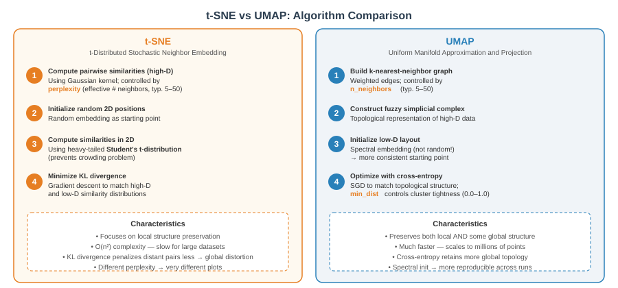
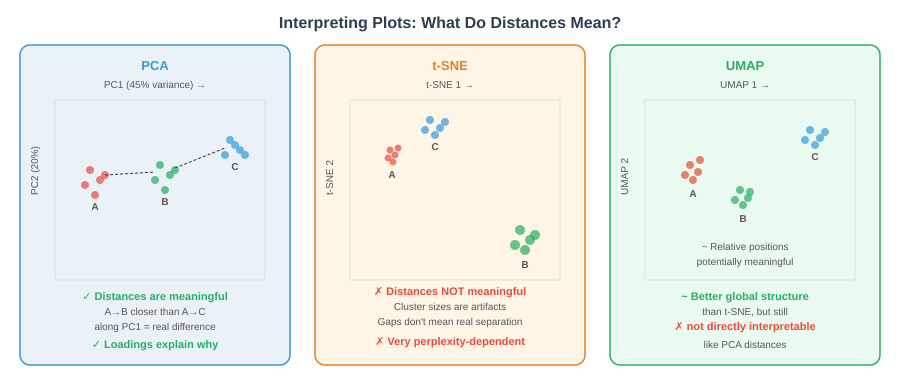
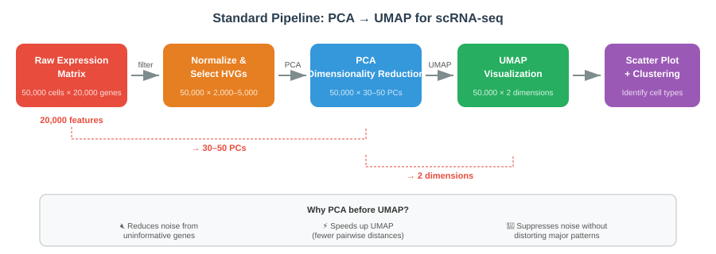

```{r}
#| label: setup
#| include: false

# Core packages
library(tidyverse)
library(knitr)
library(readxl)

# Multivariate and ordination
library(MASS)         # LDA
library(vegan)        # Community ecology ordination
library(Rtsne)        # t-SNE
library(umap)         # UMAP
library(ape)          # PCoA

# Clustering
library(cluster)      # Clustering algorithms
library(dendextend)   # Dendrogram visualization

# Classification
library(nnet)         # Neural networks

# Set consistent theme
theme_set(theme_minimal(base_size = 14))
set.seed(2026)
```

# Week 10: Multivariate Methods {background-color="#2c3e50"}

## Week 10 Topics

::: incremental
-   Introduction to multivariate statistics
-   MANOVA: multivariate analysis of variance
-   Discriminant Function Analysis (DFA / LDA)
-   Principal Component Analysis (PCA)
-   PCoA and NMDS ordination
-   Comparing dimensionality reduction methods (t-SNE, UMAP)
-   Hierarchical and K-means clustering
-   Brief introduction to neural networks
-   Course summary and method selection guide
:::

::: callout-note
**Readings:** Chapters 36--40

**Final project due next week**
:::

## Packages for This Week

::: panel-tabset
### Install

```{r}
#| eval: false
#| echo: true

# Install new packages (run once)
install.packages(c("vegan", "Rtsne", "umap", "ape",
                    "cluster", "dendextend", "nnet"))
```

### Load

```{r}
#| eval: false
#| echo: true

library(tidyverse)    # Data manipulation & visualization
library(MASS)         # LDA and discriminant analysis
library(vegan)        # Community ecology ordination
library(Rtsne)        # t-SNE implementation
library(umap)         # UMAP implementation
library(ape)          # PCoA
library(cluster)      # Clustering algorithms (silhouette, etc.)
library(dendextend)   # Enhanced dendrogram visualization
library(nnet)         # Single-layer neural networks
```
:::

## Experimental Design Overview

{fig-align="center" width="80%"}

------------------------------------------------------------------------

# Introduction to Multivariate Statistics {background-color="#2c3e50"}

## Multivariate Data

{fig-align="center" width="90%"}

## DRAFT: 3D Multivariate Data Cloud

```{r}
#| echo: false
#| eval: true
#| fig-width: 8
#| fig-height: 6

# Simulate correlated 3D data
set.seed(42)
n <- 500
# Correlated data: elongated ellipsoid
z1 <- rnorm(n)
z2 <- rnorm(n) * 0.6
z3 <- rnorm(n) * 0.3

# Rotate to create correlation structure
x <- z1 + 0.5 * z2
y <- 0.3 * z1 + z2 + 0.2 * z3
z <- 0.1 * z1 + 0.2 * z2 + z3

# 3D scatter plot using persp-like approach
par(mar = c(1, 1, 2, 1))
# Sort by depth for 3D effect
order_idx <- order(z)

# Simple perspective projection
theta <- 30; phi <- 20
theta_r <- theta * pi / 180
phi_r <- phi * pi / 180

x_proj <- x * cos(theta_r) - y * sin(theta_r)
y_proj <- -(x * sin(theta_r) + y * cos(theta_r)) * sin(phi_r) + z * cos(phi_r)

plot(x_proj[order_idx], y_proj[order_idx], pch = 16, cex = 0.5, col = "red",
     xlab = "", ylab = "", main = "Multivariate Data in 3D",
     axes = FALSE, cex.main = 1.5)
box()
```

## Multivariate Approach

{fig-align="center" width="90%"}

## DRAFT: PCA Matrix Transformation

**The PCA pipeline transforms data through matrix operations:**

:::::: columns
::: {.column width="33%"}
**(a) Original Data Matrix**

|          | $v_1$ | $v_2$ | $\ldots$ | $v_k$ |
|:---------|:------|:------|:---------|:------|
| $O_1$    |       |       |          |       |
| $O_2$    |       |       |          |       |
| $O_3$    |       |       |          |       |
| $\vdots$ |       |       |          |       |
| $O_n$    |       |       |          |       |

*Objects × Variables* *Observational data*
:::

::: {.column width="33%"}
**(b) Correlation Matrix**

|          | $v_1$ | $v_2$ | $\ldots$ | $v_k$ |
|:---------|:------|:------|:---------|:------|
| $v_1$    |       |       |          |       |
| $v_2$    |       |       |          |       |
| $\vdots$ |       |       |          |       |
| $v_k$    |       |       |          |       |

*Variables × Variables* *Correlation coefficients*
:::

::: {.column width="33%"}
**(c) Factor Matrix**

|          | $F_1$ | $F_2$ | $\ldots$ | $F_m$ |
|:---------|:------|:------|:---------|:------|
| $v_1$    |       |       |          |       |
| $v_2$    |       |       |          |       |
| $\vdots$ |       |       |          |       |
| $v_k$    |       |       |          |       |

*Variables × Factors* *Factor loadings*
:::
::::::

**Original data matrix → Correlation matrix → Factor matrix**

## Multivariate Methods Overview

{fig-align="center" width="90%"}

## DRAFT: Data → Correlation and Distance Matrices

:::::: columns
::: {.column width="33%"}
**Data Matrix** (Objects × Variables)

|     | 1        | 2        | 3        |
|:----|:---------|:---------|:---------|
| 1   | $y_{11}$ | $y_{12}$ | $y_{13}$ |
| 2   | $y_{21}$ | $y_{22}$ | $y_{23}$ |
| 3   | $y_{31}$ | $y_{32}$ | $y_{33}$ |
:::

::: {.column width="33%"}
**↗ Correlation Matrix** (Variables × Variables)

|     | 1        | 2        | 3        |
|:----|:---------|:---------|:---------|
| 1   | 1        | $r_{12}$ | $r_{13}$ |
| 2   | $r_{21}$ | 1        | $r_{23}$ |
| 3   | $r_{31}$ | $r_{32}$ | 1        |
:::

::: {.column width="33%"}
**↘ Distance Matrix** (Objects × Objects)

|     | 1        | 2        | 3        |
|:----|:---------|:---------|:---------|
| 1   | 0        | $d_{12}$ | $d_{13}$ |
| 2   | $d_{21}$ | 0        | $d_{23}$ |
| 3   | $d_{31}$ | $d_{32}$ | 0        |
:::
::::::

-   **Correlation matrix** → used for PCA, factor analysis (relationships among *variables*)
-   **Distance matrix** → used for clustering, ordination (relationships among *objects*)

## Variance-Covariance and Eigenvalues

{fig-align="center" width="90%"}

## DRAFT: PCA Scree Plot

```{r}
#| echo: false
#| eval: true
#| fig-width: 8
#| fig-height: 6

# Simulated eigenvalues that decay
eigenvalues <- c(3.5, 2.5, 1.2, 0.95, 0.78, 0.7, 0.65, 0.4, 0.12, 0.1, 0.08, 0.02)

par(mar = c(5, 5, 3, 2))
plot(1:length(eigenvalues), eigenvalues, type = "b",
     pch = 16, cex = 2, lwd = 1.5,
     xlab = "Component", ylab = "Eigenvalue",
     main = "Scree Plot",
     xlim = c(0, 12), ylim = c(0, 4),
     cex.lab = 1.4, cex.main = 1.5, cex.axis = 1.2)
```

## Dissimilarity and Distance

{fig-align="center" width="90%"}

## DRAFT: Dissimilarity / Distance Formulas

| Dissimilarity | Equation |
|:---|:---|
| **Minkowski** | $\left(\displaystyle\sum_{j=1}^{p} \lvert y_{1j} - y_{2j} \rvert^{\lambda}\right)^{1/\lambda}$ |
| **Euclidean** ($\lambda = 2$) | $\sqrt{\displaystyle\sum_{j=1}^{p}(y_{1j} - y_{2j})^2}$ |
| **City block / Manhattan** ($\lambda = 1$) | $\displaystyle\sum_{j=1}^{p}\lvert y_{1j} - y_{2j}\rvert$ |
| **Canberra** | $\dfrac{1}{p-q}\displaystyle\sum_{j=1}^{p}\dfrac{\lvert y_{1j} - y_{2j}\rvert}{y_{1j} + y_{2j}}$ |
| **Bray–Curtis** | $\dfrac{\displaystyle\sum_{j=1}^{p}\lvert y_{1j} - y_{2j}\rvert}{\displaystyle\sum_{j=1}^{p}(y_{1j} + y_{2j})}$ |
| **Chi-square** | $\sqrt{\displaystyle\sum_{j=1}^{p}\dfrac{\left(y_{1j}\dfrac{\sum y_{1j} - y_{2j}}{\sum y_{2j}}\right)^2}{\sum y_j}}$ |

## Handling Missing Data in Multivariate Analysis

| Type     | Description                  | Problem Severity  |
|:---------|:-----------------------------|:------------------|
| **MCAR** | Missing Completely At Random | Least problematic |
| **MAR**  | Missing At Random            | Moderate concern  |
| **MBC**  | Missing But Correlated       | Most problematic  |

::: callout-tip
## Three Main Approaches

1.  **Deletion** — remove observations with missing values (simple but loses information)
2.  **Imputation** — infer missing values (mean/median or multiple imputation)
3.  **Maximum Likelihood / EM** — use all available data (most sophisticated)
:::

------------------------------------------------------------------------

# MANOVA — Multivariate Analysis of Variance {background-color="#2c3e50"}

## Why Use MANOVA?

-   When interested in the relationship of **two or more response variables** and one or more predictor variables
-   Tests whether **group centroids** differ across multiple variables simultaneously
-   More powerful than running separate univariate ANOVAs when response variables are correlated

::: panel-tabset
### Equation

$$H_0: \boldsymbol{\mu}_1 = \boldsymbol{\mu}_2 = \ldots = \boldsymbol{\mu}_k$$

### LaTeX

``` text
H_0: \boldsymbol{\mu}_1 = \boldsymbol{\mu}_2 = \ldots = \boldsymbol{\mu}_k
```
:::

## MANOVA Linear Model

Single Factor MANOVA uses a linear combination of p response variables:

::: panel-tabset
### Equation

$$z_{ik} = c_1 y_{i1} + c_2 y_{i2} + c_3 y_{i3} + \ldots + c_p y_{ip}$$

### Key Matrices

-   **H matrix**: Between-groups sums of squares and cross-products
-   **E matrix**: Within-groups sums of squares and cross-products
-   **T matrix**: Total sums of squares and cross-products
-   The ratio H/E is decomposed into eigenvalues and eigenvectors
:::

## MANOVA Test Statistics

| Statistic              | Description               | Use When               |
|:-----------------------|:--------------------------|:-----------------------|
| **Wilk's Lambda**      | Most commonly used        | General purpose        |
| **Pillai's Trace**     | Most robust               | Assumption violations  |
| **Hotelling-Lawley**   | Most powerful             | Assumptions met        |
| **Roy's Largest Root** | Examines first eigenvalue | Few response variables |

## MANOVA in R

::: panel-tabset
### Output

```{r}
#| echo: false
#| eval: true

iris_manova <- manova(cbind(Sepal.Length, Sepal.Width,
                            Petal.Length, Petal.Width) ~ Species,
                      data = iris)
summary(iris_manova, test = "Pillai")
```

### Code

```{r}
#| eval: false
#| echo: true

iris_manova <- manova(cbind(Sepal.Length, Sepal.Width,
                            Petal.Length, Petal.Width) ~ Species,
                      data = iris)

# Different test statistics
summary(iris_manova, test = "Pillai")
summary(iris_manova, test = "Wilks")
summary(iris_manova, test = "Hotelling-Lawley")

# Follow up with univariate ANOVAs
summary.aov(iris_manova)
```
:::

## MANOVA Assumptions

1.  **Multivariate Normality** — less critical for Pillai's trace
2.  **Homogeneity of Variance-Covariance** — test with Box's M
3.  **Independence** of observations
4.  **No Multicollinearity** among response variables

::: callout-warning
## Outliers

MANOVA is very sensitive to multivariate outliers. Use **Mahalanobis distance** to detect them.
:::

## Detecting Multivariate Outliers

::: panel-tabset
### Output

```{r}
#| label: mahal-outliers-output
#| echo: false
#| eval: true
#| fig-width: 8
#| fig-height: 4

iris_numeric <- iris[, 1:4]
center <- colMeans(iris_numeric)
cov_matrix <- cov(iris_numeric)
mahal_dist <- mahalanobis(iris_numeric, center, cov_matrix)

plot(mahal_dist, pch = 19, main = "Mahalanobis Distances",
     ylab = "Mahalanobis Distance", xlab = "Observation")
abline(h = qchisq(0.975, df = 4), col = "red", lwd = 2)
```

### Code

```{r}
#| label: mahal-outliers-code
#| echo: true
#| eval: false

iris_numeric <- iris[, 1:4]
center <- colMeans(iris_numeric)
cov_matrix <- cov(iris_numeric)
mahal_dist <- mahalanobis(iris_numeric, center, cov_matrix)

plot(mahal_dist, pch = 19, main = "Mahalanobis Distances",
     ylab = "Mahalanobis Distance", xlab = "Observation")
abline(h = qchisq(0.975, df = 4), col = "red", lwd = 2)
```
:::

## MANOVA Follow-Up Workflow

After a significant MANOVA, determine **which variables** drive the group differences:

::: panel-tabset
### Code

```{r}
#| echo: true
#| eval: false

# Step 1: MANOVA
manova_result <- manova(cbind(Sepal.Length, Sepal.Width,
                               Petal.Length, Petal.Width) ~ Species,
                         data = iris)
summary(manova_result, test = "Pillai")

# Step 2: Univariate follow-up ANOVAs
summary.aov(manova_result)

# Step 3: Post-hoc pairwise comparisons for each response
library(emmeans)
for (var in c("Sepal.Length", "Sepal.Width",
              "Petal.Length", "Petal.Width")) {
  cat("\n---", var, "---\n")
  fit <- lm(as.formula(paste(var, "~ Species")), data = iris)
  em <- emmeans(fit, pairwise ~ Species, adjust = "bonferroni")
  print(em$contrasts)
}

# Step 4: Effect sizes (eta-squared for each variable)
library(car)
for (var in c("Sepal.Length", "Sepal.Width",
              "Petal.Length", "Petal.Width")) {
  fit <- lm(as.formula(paste(var, "~ Species")), data = iris)
  aov_table <- Anova(fit, type = "II")
  ss_group <- aov_table$`Sum Sq`[1]
  ss_total <- sum(aov_table$`Sum Sq`)
  cat(var, "eta² =", round(ss_group / ss_total, 3), "\n")
}
```

### Workflow Summary

1.  **MANOVA**: Test overall multivariate difference → significant?
2.  **Univariate ANOVAs**: Which response variables differ?
3.  **Post-hoc tests**: Which groups differ on each variable?
4.  **Effect sizes**: How large are the differences?
5.  **DFA/LDA**: Which combinations of variables best discriminate groups?
:::

------------------------------------------------------------------------

# Discriminant Function Analysis (DFA / LDA) {background-color="#2c3e50"}

## MANOVA vs DFA

| Aspect | MANOVA | DFA |
|:---|:---|:---|
| **Purpose** | Hypothesis testing | Classification & prediction |
| **Question** | Do groups differ? | Which group does a new observation belong to? |
| **Output** | F-statistic, p-value | Discriminant functions, predictions |
| **Focus** | First discriminant function | All discriminant functions |

Both methods use the same underlying mathematics (eigendecomposition of H/E) but for different purposes.

## DFA Steps

1.  **Run MANOVA** to test for group differences
    -   If not significant, DFA won't be useful
2.  **Calculate Linear Discriminant Functions (LDF)**
    -   Evaluate distributions of LDF scores
    -   Do groups have separate distributions?
3.  **Classify observations**
    -   Generate conditional (posterior) probabilities
    -   Determine percentage of correct assignments
    -   Can train on one dataset and predict on new data

## Linear Discriminant Analysis in R

::: panel-tabset
### Output

```{r}
#| echo: false
#| eval: true

library(MASS)
iris_lda <- lda(Species ~ Sepal.Length + Sepal.Width +
                         Petal.Length + Petal.Width,
               data = iris)
iris_lda$scaling
```

### Code

```{r}
#| echo: true
#| eval: false

library(MASS)

# Fit LDA model
iris_lda <- lda(Species ~ Sepal.Length + Sepal.Width +
                         Petal.Length + Petal.Width,
               data = iris)

# View discriminant function coefficients
iris_lda$scaling
```
:::

## LDA Predictions and Classification

::: panel-tabset
### Output

```{r}
#| echo: false
#| eval: true

iris_pred <- predict(iris_lda)
table(Predicted = iris_pred$class, Actual = iris$Species)
```

### Code

```{r}
#| echo: true
#| eval: false

# Make predictions
iris_pred <- predict(iris_lda)

# Confusion matrix
table(Predicted = iris_pred$class, Actual = iris$Species)
```
:::

## Visualizing Discriminant Functions

::: panel-tabset
### Output

```{r}
#| label: lda-viz-output
#| echo: false
#| eval: true
#| fig-width: 10
#| fig-height: 5

lda_scores <- predict(iris_lda)$x
plot(lda_scores[, 1], lda_scores[, 2],
     col = as.numeric(iris$Species), pch = 19,
     xlab = "LD1", ylab = "LD2",
     main = "Linear Discriminant Analysis — Iris Data")
legend("topright", levels(iris$Species),
       col = 1:3, pch = 19)
```

### Code

```{r}
#| label: lda-viz-code
#| echo: true
#| eval: false

lda_scores <- predict(iris_lda)$x
plot(lda_scores[, 1], lda_scores[, 2],
     col = as.numeric(iris$Species), pch = 19,
     xlab = "LD1", ylab = "LD2",
     main = "Linear Discriminant Analysis — Iris Data")
legend("topright", levels(iris$Species),
       col = 1:3, pch = 19)
```
:::

## LDA for New Predictions

::: panel-tabset
### Output

```{r}
#| echo: false
#| eval: true

new_flowers <- data.frame(
  Sepal.Length = c(5.0, 6.5, 7.0),
  Sepal.Width  = c(3.5, 3.0, 3.2),
  Petal.Length  = c(1.4, 4.5, 6.0),
  Petal.Width   = c(0.2, 1.5, 2.0)
)

predict(iris_lda, new_flowers)$class
round(predict(iris_lda, new_flowers)$posterior, 3)
```

### Code

```{r}
#| echo: true
#| eval: false

# Create new observations
new_flowers <- data.frame(
  Sepal.Length = c(5.0, 6.5, 7.0),
  Sepal.Width  = c(3.5, 3.0, 3.2),
  Petal.Length  = c(1.4, 4.5, 6.0),
  Petal.Width   = c(0.2, 1.5, 2.0)
)

# Predict species
predict(iris_lda, new_flowers)$class

# Get posterior probabilities
round(predict(iris_lda, new_flowers)$posterior, 3)
```
:::

## Logistic Regression as Classification

Recall from Week 8 that logistic regression can also be used for classification. The key differences from LDA:

| Aspect | LDA | Logistic Regression |
|:---|:---|:---|
| **Assumption** | Multivariate normal predictors | No distributional assumption |
| **Output** | Discriminant scores + classes | Log-odds + probabilities |
| **Best for** | Well-separated groups, normal data | Binary outcomes, mixed data types |
| **Multi-class** | Natural extension | Requires one-vs-rest |

::: callout-tip
Use LDA when you believe the predictors are approximately multivariate normal within each group. Use logistic regression when you have binary outcomes or non-normal predictors.
:::

## LDA Cross-Validation for Honest Accuracy

Training and testing on the same data gives **overly optimistic** accuracy estimates. Use leave-one-out CV:

::: panel-tabset
### Code

```{r}
#| echo: true
#| eval: false

library(MASS)

# LOOCV for LDA (built into MASS::lda!)
lda_cv <- lda(Species ~ ., data = iris, CV = TRUE)

# Honest classification accuracy
cv_accuracy <- mean(lda_cv$class == iris$Species)
cat("LDA LOOCV Accuracy:", round(cv_accuracy, 3))

# Confusion matrix from CV
table(Predicted = lda_cv$class, Actual = iris$Species)

# Compare with resubstitution (training accuracy — optimistic!)
lda_train <- lda(Species ~ ., data = iris)
train_pred <- predict(lda_train, iris)$class
train_accuracy <- mean(train_pred == iris$Species)
cat("\nTraining Accuracy:", round(train_accuracy, 3))
cat("\nCV Accuracy:     ", round(cv_accuracy, 3))
cat("\nDifference:      ", round(train_accuracy - cv_accuracy, 3))
```

### Classifier Comparison

```{r}
#| echo: true
#| eval: false

# Compare LDA vs. KNN vs. SVM via 10-fold CV
library(caret)
set.seed(42)
ctrl <- trainControl(method = "cv", number = 10)

# LDA
lda_cv_fit <- train(Species ~ ., data = iris, method = "lda",
                    trControl = ctrl)
# KNN
knn_cv_fit <- train(Species ~ ., data = iris, method = "knn",
                    trControl = ctrl, tuneGrid = data.frame(k = 1:15))
# SVM
svm_cv_fit <- train(Species ~ ., data = iris, method = "svmRadial",
                    trControl = ctrl)

# Compare results
results <- resamples(list(LDA = lda_cv_fit, KNN = knn_cv_fit, SVM = svm_cv_fit))
summary(results)
dotplot(results)
```
:::

# BREAK {background-color="#e74c3c"}

# Principal Component Analysis (PCA) {background-color="#2c3e50"}

## What is PCA?

-   **Dimensionality reduction** technique for continuous data
-   Finds orthogonal directions (principal components) of **maximum variance**
-   Transforms correlated variables into uncorrelated components
-   First PC explains the most variance, second PC the next most, etc.

::: callout-tip
## Key Concepts

-   **Principal components**: new axes that maximize variance
-   **Eigenvalues**: amount of variance explained by each PC
-   **Loadings**: contribution of original variables to each PC
-   **Scores**: coordinates of observations in PC space
:::

## PCA in R

::: panel-tabset
### Output

```{r}
#| echo: false
#| eval: true

pca_result <- prcomp(iris[, 1:4], scale. = TRUE)
summary(pca_result)
```

### Code

```{r}
#| echo: true
#| eval: false

# PCA on iris data (excluding species)
pca_result <- prcomp(iris[, 1:4], scale. = TRUE)

# Variance explained
summary(pca_result)
```
:::

## PCA Biplot

::: panel-tabset
### Output

```{r}
#| label: pca-biplot-output
#| echo: false
#| eval: true
#| fig-width: 8
#| fig-height: 5

biplot(pca_result, col = c("gray", "red"))
```

### Code

```{r}
#| label: pca-biplot-code
#| echo: true
#| eval: false

biplot(pca_result, col = c("gray", "red"))
```
:::

## Scree Plot

::: panel-tabset
### Output

```{r}
#| label: scree-plot-output
#| echo: false
#| eval: true
#| fig-width: 8
#| fig-height: 4

var_explained <- pca_result$sdev^2 / sum(pca_result$sdev^2)

plot(var_explained, type = "b", pch = 19,
     xlab = "Principal Component", ylab = "Proportion of Variance",
     main = "Scree Plot")
```

### Code

```{r}
#| label: scree-plot-code
#| echo: true
#| eval: false

var_explained <- pca_result$sdev^2 / sum(pca_result$sdev^2)

plot(var_explained, type = "b", pch = 19,
     xlab = "Principal Component", ylab = "Proportion of Variance",
     main = "Scree Plot")
```
:::

## Interpreting PCA Loadings

The loadings (rotation matrix) tell you **which original variables contribute most** to each PC:

::: panel-tabset
### Output

```{r}
#| label: pca-loadings-output
#| echo: false
#| eval: true
#| fig-width: 10
#| fig-height: 4

par(mfrow = c(1, 2), mar = c(5, 8, 3, 1))

# Loadings barplot for PC1
loadings_pc1 <- pca_result$rotation[, 1]
barplot(sort(loadings_pc1), horiz = TRUE, las = 1,
        main = "PC1 Loadings", col = "steelblue",
        xlab = "Loading")

# Loadings barplot for PC2
loadings_pc2 <- pca_result$rotation[, 2]
barplot(sort(loadings_pc2), horiz = TRUE, las = 1,
        main = "PC2 Loadings", col = "coral",
        xlab = "Loading")
```

### Code

```{r}
#| label: pca-loadings-code
#| echo: true
#| eval: false

# View the rotation (loadings) matrix
pca_result$rotation

# Loadings barplot
par(mfrow = c(1, 2), mar = c(5, 8, 3, 1))
barplot(sort(pca_result$rotation[, 1]), horiz = TRUE, las = 1,
        main = "PC1 Loadings", col = "steelblue")
barplot(sort(pca_result$rotation[, 2]), horiz = TRUE, las = 1,
        main = "PC2 Loadings", col = "coral")

# For many variables, use a heatmap of loadings
heatmap(pca_result$rotation, scale = "column",
        col = hcl.colors(50, "RdBu"),
        main = "PCA Loadings Heatmap")
```

### Interpretation

-   **Large positive loading**: variable increases along that PC direction
-   **Large negative loading**: variable decreases
-   **Near zero loading**: variable contributes little to that PC
-   PC1 often represents overall size; PC2 often represents shape contrasts
:::

## Publication-Quality PCA with ggplot2

::: panel-tabset
### Output

```{r}
#| label: pca-ggplot-output
#| echo: false
#| eval: true
#| fig-width: 8
#| fig-height: 5

library(ggplot2)
pca_scores <- as.data.frame(pca_result$x)
pca_scores$Species <- iris$Species
var_exp <- round(100 * pca_result$sdev^2 / sum(pca_result$sdev^2), 1)

ggplot(pca_scores, aes(x = PC1, y = PC2, color = Species)) +
  geom_point(size = 2, alpha = 0.7) +
  stat_ellipse(level = 0.95, linewidth = 0.8) +
  labs(x = paste0("PC1 (", var_exp[1], "%)"),
       y = paste0("PC2 (", var_exp[2], "%)"),
       title = "PCA of Iris Data with 95% Confidence Ellipses") +
  scale_color_manual(values = c("steelblue", "coral", "forestgreen")) +
  theme_minimal(base_size = 14) +
  theme(legend.position = "bottom")
```

### Code

```{r}
#| label: pca-ggplot-code
#| echo: true
#| eval: false

library(ggplot2)

# Extract scores and add grouping variable
pca_scores <- as.data.frame(pca_result$x)
pca_scores$Species <- iris$Species
var_exp <- round(100 * pca_result$sdev^2 / sum(pca_result$sdev^2), 1)

# ggplot PCA with 95% confidence ellipses
ggplot(pca_scores, aes(x = PC1, y = PC2, color = Species)) +
  geom_point(size = 2, alpha = 0.7) +
  stat_ellipse(level = 0.95, linewidth = 0.8) +
  labs(x = paste0("PC1 (", var_exp[1], "%)"),
       y = paste0("PC2 (", var_exp[2], "%)"),
       title = "PCA with 95% Confidence Ellipses") +
  scale_color_manual(values = c("steelblue", "coral", "forestgreen")) +
  theme_minimal(base_size = 14) +
  theme(legend.position = "bottom")
```
:::

------------------------------------------------------------------------

# PCoA and NMDS {background-color="#2c3e50"}

## PCoA — Principal Coordinates Analysis

PCoA (also called classical multidimensional scaling) is similar to PCA but works on a **dissimilarity matrix** rather than raw data:

-   Can use any distance metric (Bray-Curtis, Jaccard, UniFrac, etc.)
-   Metric ordination: preserves actual distances
-   Scores can be used in downstream linear models

::: panel-tabset
### Code

```{r}
#| eval: false
#| echo: true

library(vegan)

# Calculate distance matrix
dist_matrix <- vegdist(my_data, method = "bray")

# Run PCoA
pcoa_result <- cmdscale(dist_matrix, k = 2, eig = TRUE)

# Plot
plot(pcoa_result$points, col = group_factor, pch = 19,
     xlab = "PCoA1", ylab = "PCoA2",
     main = "Principal Coordinates Analysis")
```

### When to Use

-   When your dissimilarity metric matters (e.g., ecological data with Bray-Curtis)
-   When you want metric ordination scores for downstream analysis
-   When data are not suited for PCA (e.g., count data, presence/absence)
:::

## PCoA: Community Data Example

::: panel-tabset
### Output

```{r}
#| label: pcoa-community-output
#| echo: false
#| eval: true
#| fig-width: 8
#| fig-height: 5

library(vegan)
set.seed(42)
# Simulated microbiome-style community data
n_samples <- 40
n_species <- 20
treatment <- factor(rep(c("Control", "Treatment"), each = 20))
community <- matrix(rpois(n_samples * n_species, lambda = 5), n_samples, n_species)
# Treatment effect: shift abundance of some species
community[treatment == "Treatment", 1:5] <- community[treatment == "Treatment", 1:5] + rpois(5 * 20, 8)

dist_bc <- vegdist(community, method = "bray")
pcoa_res <- cmdscale(dist_bc, k = 2, eig = TRUE)
var_exp <- round(100 * pcoa_res$eig[1:2] / sum(pcoa_res$eig[pcoa_res$eig > 0]), 1)

plot(pcoa_res$points, col = c("steelblue", "coral")[treatment],
     pch = 19, cex = 1.5,
     xlab = paste0("PCoA1 (", var_exp[1], "%)"),
     ylab = paste0("PCoA2 (", var_exp[2], "%)"),
     main = "PCoA of Microbial Community Data (Bray-Curtis)")
legend("topright", levels(treatment), col = c("steelblue", "coral"), pch = 19)
```

### Code

```{r}
#| label: pcoa-community-code
#| echo: true
#| eval: false

library(vegan)

# Calculate Bray-Curtis dissimilarity
dist_bc <- vegdist(community_data, method = "bray")

# Run PCoA
pcoa_res <- cmdscale(dist_bc, k = 2, eig = TRUE)

# Percent variance explained
var_exp <- round(100 * pcoa_res$eig[1:2] /
                 sum(pcoa_res$eig[pcoa_res$eig > 0]), 1)

# Plot with group labels
plot(pcoa_res$points, col = treatment, pch = 19,
     xlab = paste0("PCoA1 (", var_exp[1], "%)"),
     ylab = paste0("PCoA2 (", var_exp[2], "%)"),
     main = "PCoA (Bray-Curtis)")

# PERMANOVA: test if groups differ in multivariate space
adonis_result <- adonis2(dist_bc ~ treatment, permutations = 999)
print(adonis_result)

# Effect size: R² from PERMANOVA
cat("R² =", round(adonis_result$R2[1], 3))
```

### PERMANOVA Notes

-   **PERMANOVA** (`adonis2()`) tests whether group centroids differ in multivariate space
-   Works on any distance matrix (doesn't require normality)
-   R² gives the proportion of variation explained by the grouping
-   Check **betadisper()** for homogeneity of dispersions (analogous to Levene's test)
:::

## NMDS — Non-metric Multidimensional Scaling

**NMDS** is a form of nonparametric ordination:

-   Uses **rank-order** of dissimilarities rather than exact values
-   Relaxes distributional assumptions
-   Excellent for ecological, expression, and phenotypic data
-   Works well when relationships are non-linear

## NMDS Algorithm

1.  Calculate dissimilarity matrix between samples
2.  Place points in reduced dimensional space (usually 2D)
3.  Iteratively adjust positions to minimize **stress**
4.  Stress measures how well ordination distances match dissimilarities

| Stress Value | Interpretation |
|:-------------|:---------------|
| \< 0.05      | Excellent      |
| 0.05–0.10    | Good           |
| 0.10–0.20    | Acceptable     |
| \> 0.20      | Poor fit       |

## NMDS in R with vegan

::: panel-tabset
### Code

```{r}
#| eval: false
#| echo: true

library(vegan)

# Run NMDS
nmds_result <- metaMDS(my_data, distance = "bray", k = 2, trace = FALSE)

# Check stress value
print(nmds_result$stress)

# Stress plot: visualize fit between ordination and original distances
stressplot(nmds_result)
```

### Visualization

```{r}
#| eval: false
#| echo: true

# Color by grouping variable
plot(nmds_result$points, col = group_factor, pch = 19,
     xlab = "NMDS1", ylab = "NMDS2",
     main = "NMDS Ordination")
legend("topright", levels(group_factor),
       col = 1:nlevels(group_factor), pch = 19)
```
:::

## PCA vs PCoA vs NMDS

| Aspect | PCA | PCoA | NMDS |
|:---|:---|:---|:---|
| **Input** | Covariance/Correlation | Dissimilarity matrix | Dissimilarity matrix |
| **Scaling** | Metric | Metric | Non-metric (ordinal) |
| **Assumptions** | Linear relationships | Any distance metric | Rank-order preservation |
| **Downstream** | Scores usable in linear models | Scores usable in linear models | **Cannot use in linear models** |

::: callout-warning
NMDS scores preserve only rank-order relationships, so they should **not** be used directly in regression or ANOVA!
:::

## NMDS: Hypothesis Testing with PERMANOVA

::: panel-tabset
### Code

```{r}
#| echo: true
#| eval: false

library(vegan)

# Fit NMDS
nmds <- metaMDS(community_data, distance = "bray", k = 2, trymax = 100)

# PERMANOVA — test group differences on the distance matrix
dist_bc <- vegdist(community_data, method = "bray")
perm_result <- adonis2(dist_bc ~ treatment, permutations = 999)
print(perm_result)

# Check dispersion homogeneity (assumption of PERMANOVA)
disp <- betadisper(dist_bc, treatment)
permutest(disp, permutations = 999)

# envfit — fit environmental variables onto ordination
env_data <- data.frame(pH = rnorm(nrow(community_data), 7, 0.5),
                       temperature = rnorm(nrow(community_data), 37, 2))
ef <- envfit(nmds, env_data, permutations = 999)
print(ef)

# Plot NMDS with envfit vectors
plot(nmds, type = "n", main = "NMDS with Environmental Vectors")
points(nmds, col = treatment, pch = 19)
plot(ef, p.max = 0.05, col = "red", lwd = 2)
```

### Interpretation

-   **PERMANOVA** (adonis2): Tests whether group centroids differ; report R² and p-value
-   **betadisper**: Checks if groups have similar spread (a PERMANOVA assumption)
-   **envfit**: Fits continuous environmental variables as vectors onto the ordination; arrow direction and length show correlation strength
-   Only plot envfit vectors that are significant (p \< 0.05)
:::

------------------------------------------------------------------------

# Expanded: t-SNE and UMAP {background-color="#2c3e50"}

## Simulated data: Creating our example dataset

::: panel-tabset
### Code

```{r}
#| label: sim-data
#| eval: true

# Simulate 4 clusters in 10-dimensional space
# (think: 4 cell types measured across 10 genes)
set.seed(42)
n_per_cluster <- 75
n_dims <- 10

# Cluster centers in 10D space
centers <- matrix(c(
  rep(0, n_dims),                        # Cluster 1: origin
  c(5, 5, rep(0, n_dims - 2)),           # Cluster 2: shifted in dims 1-2
  c(0, 0, 5, 5, rep(0, n_dims - 4)),     # Cluster 3: shifted in dims 3-4
  c(3, 3, 3, 3, 3, rep(0, n_dims - 5))   # Cluster 4: shifted in dims 1-5
), nrow = 4, byrow = TRUE)

# Generate data with noise
sim_data <- do.call(rbind, lapply(1:4, function(i) {
  sweep(matrix(rnorm(n_per_cluster * n_dims, sd = 1.2), ncol = n_dims),
        2, centers[i, ], "+")
}))

# Create labels and data frame
cluster_labels <- factor(rep(paste("Type", LETTERS[1:4]), each = n_per_cluster))
sim_df <- as.data.frame(sim_data)
colnames(sim_df) <- paste0("Gene_", 1:n_dims)
sim_df$CellType <- cluster_labels

cat("Simulated dataset:", nrow(sim_df), "cells x", n_dims, "genes\n")
cat("Cell types:", levels(cluster_labels), "\n")
cat("Cells per type:", n_per_cluster, "\n")
```

### Output

```{r}
#| label: sim-data-summary
#| echo: false

# Show a summary of the data structure
sim_df |>
  group_by(CellType) |>
  summarise(
    n = n(),
    across(Gene_1:Gene_3, \(x) round(mean(x), 2), .names = "mean_{.col}")
  ) |>
  knitr::kable(caption = "Summary: mean expression for first 3 genes by cell type")
```

### Interpretation

**What we simulated:**

-   300 "cells" from 4 cell types, each measured across 10 genes
-   Clusters are separated by **different subsets of genes** — this mimics real biology where cell types differ in specific gene modules
-   Added Gaussian noise (sd = 1.2) — realistic measurement noise
-   The clusters overlap somewhat, especially Types A and D

**Why this is a good teaching example:**

-   10 dimensions is too many to visualize directly, but few enough to understand
-   The cluster structure has both linear and non-linear separability
-   Different methods will reveal different aspects of this structure
:::

# t-SNE {background-color="#2c3e50"}

## t-SNE vs UMAP: Algorithm comparison

{fig-align="center" width="95%"}

## t-SNE on simulated data

::: panel-tabset
### Code

```{r}
#| label: tsne-code
#| eval: true

library(Rtsne)

# Run t-SNE with default perplexity
tsne_result <- Rtsne(sim_df[, 1:n_dims], 
                     perplexity = 30, 
                     dims = 2, 
                     verbose = FALSE,
                     check_duplicates = FALSE)

# Store results
tsne_df <- data.frame(
  tSNE1 = tsne_result$Y[, 1],
  tSNE2 = tsne_result$Y[, 2],
  CellType = sim_df$CellType
)
head(tsne_df)
```

### Output

```{r}
#| label: tsne-plot
#| echo: false
#| fig-width: 10
#| fig-height: 5

par(mfrow = c(1, 2), mar = c(4, 4, 3, 1))

# t-SNE scatter
colors <- c("#e74c3c", "#27ae60", "#3498db", "#9b59b6")
plot(tsne_df$tSNE1, tsne_df$tSNE2, 
     col = colors[tsne_df$CellType], pch = 19, cex = 0.8,
     xlab = "t-SNE 1", ylab = "t-SNE 2",
     main = "t-SNE (perplexity = 30)")
legend("topright", levels(cluster_labels), col = colors, pch = 19, cex = 0.8)

# Compare with lower perplexity
tsne_low <- Rtsne(sim_df[, 1:n_dims], perplexity = 5, dims = 2, 
                  verbose = FALSE, check_duplicates = FALSE)
plot(tsne_low$Y[, 1], tsne_low$Y[, 2], 
     col = colors[sim_df$CellType], pch = 19, cex = 0.8,
     xlab = "t-SNE 1", ylab = "t-SNE 2",
     main = "t-SNE (perplexity = 5)")
legend("topright", levels(cluster_labels), col = colors, pch = 19, cex = 0.8)
```

### Interpretation

**What t-SNE reveals:**

-   The clusters are well-separated visually — t-SNE excels at pulling apart groups
-   **Perplexity = 30** gives a balanced view of local structure
-   **Perplexity = 5** focuses on very local neighborhoods — may fragment clusters or create spurious sub-groups

**Critical warnings:**

-   The **distances between clusters are NOT meaningful** — don't conclude Type A is "closer to" Type B based on the plot
-   **Cluster sizes** don't reflect the number of points — all groups have 75 cells but may appear different sizes
-   Re-running without `set.seed()` will produce a **different layout** (stochastic algorithm)
:::

## t-SNE: Effect of perplexity

::: panel-tabset
### Code

```{r}
#| label: tsne-perplexity
#| eval: true

# Run t-SNE at multiple perplexity values
perplexities <- c(5, 15, 30, 50)
tsne_multi <- lapply(perplexities, function(p) {
  res <- Rtsne(sim_df[, 1:n_dims], perplexity = p, dims = 2, 
               verbose = FALSE, check_duplicates = FALSE)
  data.frame(tSNE1 = res$Y[, 1], tSNE2 = res$Y[, 2], 
             CellType = sim_df$CellType, 
             Perplexity = paste("perplexity =", p))
})
tsne_compare <- do.call(rbind, tsne_multi)
```

### Output

```{r}
#| label: tsne-perplexity-plot
#| echo: false
#| fig-width: 12
#| fig-height: 4

par(mfrow = c(1, 4), mar = c(4, 4, 3, 1))
colors <- c("#e74c3c", "#27ae60", "#3498db", "#9b59b6")
for (p in perplexities) {
  sub <- tsne_compare[tsne_compare$Perplexity == paste("perplexity =", p), ]
  plot(sub$tSNE1, sub$tSNE2, col = colors[sub$CellType], pch = 19, cex = 0.7,
       xlab = "t-SNE 1", ylab = "t-SNE 2",
       main = paste("Perplexity =", p))
  if (p == 5) legend("topright", levels(cluster_labels), col = colors, pch = 19, cex = 0.6)
}
```

### Interpretation

**Perplexity dramatically changes the output:**

-   **Perplexity = 5**: Very local — may over-fragment real groups
-   **Perplexity = 15**: Starts to show coherent clusters
-   **Perplexity = 30**: Balanced view — typical default choice
-   **Perplexity = 50**: Broader view — clusters may start merging

**Best practice:** Always run t-SNE at multiple perplexity values and compare. No single setting tells the full story. A good rule of thumb is perplexity between sqrt(n)/2 to sqrt(n), but always explore.
:::

# UMAP {background-color="#2c3e50"}

## UMAP on simulated data

::: panel-tabset
### Code

```{r}
#| label: umap-code
#| eval: true

library(umap)

# Run UMAP with default settings
umap_config <- umap.defaults
umap_config$n_neighbors <- 15
umap_config$min_dist <- 0.1
umap_config$random_state <- 42

umap_result <- umap(sim_df[, 1:n_dims], config = umap_config)

# Store results
umap_df <- data.frame(
  UMAP1 = umap_result$layout[, 1],
  UMAP2 = umap_result$layout[, 2],
  CellType = sim_df$CellType
)
head(umap_df)
```

### Output

```{r}
#| label: umap-plot
#| echo: false
#| fig-width: 10
#| fig-height: 5

par(mfrow = c(1, 2), mar = c(4, 4, 3, 1))
colors <- c("#e74c3c", "#27ae60", "#3498db", "#9b59b6")

# Default UMAP
plot(umap_df$UMAP1, umap_df$UMAP2, 
     col = colors[umap_df$CellType], pch = 19, cex = 0.8,
     xlab = "UMAP 1", ylab = "UMAP 2",
     main = "UMAP (n_neighbors=15, min_dist=0.1)")
legend("topright", levels(cluster_labels), col = colors, pch = 19, cex = 0.8)

# UMAP with different settings
umap_config2 <- umap_config
umap_config2$n_neighbors <- 50
umap_config2$min_dist <- 0.5
umap_result2 <- umap(sim_df[, 1:n_dims], config = umap_config2)
plot(umap_result2$layout[, 1], umap_result2$layout[, 2], 
     col = colors[sim_df$CellType], pch = 19, cex = 0.8,
     xlab = "UMAP 1", ylab = "UMAP 2",
     main = "UMAP (n_neighbors=50, min_dist=0.5)")
legend("topright", levels(cluster_labels), col = colors, pch = 19, cex = 0.8)
```

### Interpretation

**What UMAP shows:**

-   Clusters are clearly separated with good visual structure
-   **n_neighbors = 15, min_dist = 0.1** (left): Tighter clusters, emphasizes local structure
-   **n_neighbors = 50, min_dist = 0.5** (right): More spread out, emphasizes broader topology

**Compared to t-SNE:**

-   UMAP tends to preserve more of the **global structure** — relative positions of clusters are more consistent across runs
-   UMAP is **much faster** — scales better to large datasets
-   Still stochastic — set a random seed!
-   Inter-cluster distances are still **not directly interpretable** like PCA
:::

## UMAP: Varying n_neighbors

::: panel-tabset
### Code

```{r}
#| label: umap-neighbors
#| eval: true

# UMAP at different n_neighbors values
neighbors <- c(5, 15, 30, 50)
umap_multi <- lapply(neighbors, function(nn) {
  cfg <- umap.defaults
  cfg$n_neighbors <- nn
  cfg$min_dist <- 0.1
  cfg$random_state <- 42
  res <- umap(sim_df[, 1:n_dims], config = cfg)
  data.frame(UMAP1 = res$layout[, 1], UMAP2 = res$layout[, 2], 
             CellType = sim_df$CellType,
             n_neighbors = paste("n_neighbors =", nn))
})
umap_compare <- do.call(rbind, umap_multi)
```

### Output

```{r}
#| label: umap-neighbors-plot
#| echo: false
#| fig-width: 12
#| fig-height: 4

par(mfrow = c(1, 4), mar = c(4, 4, 3, 1))
colors <- c("#e74c3c", "#27ae60", "#3498db", "#9b59b6")
for (nn in neighbors) {
  sub <- umap_compare[umap_compare$n_neighbors == paste("n_neighbors =", nn), ]
  plot(sub$UMAP1, sub$UMAP2, col = colors[sub$CellType], pch = 19, cex = 0.7,
       xlab = "UMAP 1", ylab = "UMAP 2",
       main = paste("n_neighbors =", nn))
  if (nn == 5) legend("topright", levels(cluster_labels), col = colors, pch = 19, cex = 0.6)
}
```

### Interpretation

**n_neighbors controls the local-global trade-off:**

-   **n_neighbors = 5**: Very local — clusters may fragment
-   **n_neighbors = 15**: Good balance — typical default
-   **n_neighbors = 30**: More global context incorporated
-   **n_neighbors = 50**: Broad topology preserved, clusters may begin to merge

**min_dist** (held constant at 0.1 here) controls how tightly points pack together — lower values create denser clusters, higher values spread points out.
:::

# Comparing All Three {background-color="#2c3e50"}

## Side-by-side comparison

::: panel-tabset
### Code

```{r}
#| label: side-by-side
#| eval: true

# Run PCA on sim_df (the same dataset used for t-SNE and UMAP)
pca_sim <- prcomp(sim_df[, 1:n_dims], center = TRUE, scale. = TRUE)
pca_sim_scores <- as.data.frame(pca_sim$x)
var_prop <- pca_sim$sdev^2 / sum(pca_sim$sdev^2)

# Combine all three for comparison
comparison <- data.frame(
  Method = rep(c("PCA", "t-SNE", "UMAP"), each = nrow(sim_df)),
  Dim1 = c(pca_sim_scores$PC1, tsne_df$tSNE1, umap_df$UMAP1),
  Dim2 = c(pca_sim_scores$PC2, tsne_df$tSNE2, umap_df$UMAP2),
  CellType = rep(sim_df$CellType, 3)
)
```

### Output

```{r}
#| label: side-by-side-plot
#| echo: false
#| fig-width: 14
#| fig-height: 5

par(mfrow = c(1, 3), mar = c(4, 4, 3, 1))
colors <- c("#e74c3c", "#27ae60", "#3498db", "#9b59b6")

# PCA
sub <- comparison[comparison$Method == "PCA", ]
plot(sub$Dim1, sub$Dim2, col = colors[sub$CellType], pch = 19, cex = 0.9,
     xlab = paste0("PC1 (", round(var_prop[1]*100, 1), "%)"),
     ylab = paste0("PC2 (", round(var_prop[2]*100, 1), "%)"),
     main = "PCA")
legend("topright", levels(cluster_labels), col = colors, pch = 19, cex = 0.7)

# t-SNE
sub <- comparison[comparison$Method == "t-SNE", ]
plot(sub$Dim1, sub$Dim2, col = colors[sub$CellType], pch = 19, cex = 0.9,
     xlab = "t-SNE 1", ylab = "t-SNE 2",
     main = "t-SNE (perplexity = 30)")
legend("topright", levels(cluster_labels), col = colors, pch = 19, cex = 0.7)

# UMAP
sub <- comparison[comparison$Method == "UMAP", ]
plot(sub$Dim1, sub$Dim2, col = colors[sub$CellType], pch = 19, cex = 0.9,
     xlab = "UMAP 1", ylab = "UMAP 2",
     main = "UMAP (n_neighbors = 15)")
legend("topright", levels(cluster_labels), col = colors, pch = 19, cex = 0.7)
```

### Interpretation

**All three methods identify the same 4 clusters, but with different visual characteristics:**

-   **PCA**: Clusters partially overlap because it projects along linear axes of maximum variance. PC1 vs PC2 captures only part of total variance — remaining structure is in higher PCs. Distances are directly interpretable.

-   **t-SNE**: Clusters are pulled apart into well-separated "islands." Visually dramatic, but inter-cluster distances are meaningless. Cluster sizes may not reflect true group sizes.

-   **UMAP**: Similar to t-SNE but tends to preserve more of the relative positioning between clusters. The overall topology is more consistent across runs.

**Key takeaway:** These methods are *complementary*, not competing. Use PCA for quantitative analysis and feature selection, t-SNE/UMAP for visualization.
:::

# Interpreting Plots {background-color="#2c3e50"}

## What do distances mean?

{fig-align="center" width="95%"}

## Reproducibility: Stochastic methods

::: panel-tabset
### Code

```{r}
#| label: reproducibility
#| eval: true

# Demonstrate stochastic nature of t-SNE
# Run t-SNE 3 times WITHOUT setting seed
tsne_runs <- lapply(1:3, function(i) {
  res <- Rtsne(sim_df[, 1:n_dims], perplexity = 30, dims = 2, 
               verbose = FALSE, check_duplicates = FALSE)
  data.frame(tSNE1 = res$Y[, 1], tSNE2 = res$Y[, 2], 
             CellType = sim_df$CellType, Run = paste("Run", i))
})
tsne_runs_df <- do.call(rbind, tsne_runs)
```

### Output

```{r}
#| label: reproducibility-plot
#| echo: false
#| fig-width: 14
#| fig-height: 4

par(mfrow = c(1, 3), mar = c(4, 4, 3, 1))
colors <- c("#e74c3c", "#27ae60", "#3498db", "#9b59b6")
for (r in paste("Run", 1:3)) {
  sub <- tsne_runs_df[tsne_runs_df$Run == r, ]
  plot(sub$tSNE1, sub$tSNE2, col = colors[sub$CellType], pch = 19, cex = 0.7,
       xlab = "t-SNE 1", ylab = "t-SNE 2", main = r)
  if (r == "Run 1") legend("topright", levels(cluster_labels), col = colors, pch = 19, cex = 0.6)
}
```

### Interpretation

**Same data, same parameters, different results!**

Each run produces a different spatial arrangement because t-SNE (and UMAP) use random initialization and stochastic optimization. The clusters are the same, but their positions and orientations change.

**Solution — always set a random seed:**

``` r
set.seed(42)
tsne_result <- Rtsne(data, perplexity = 30)
```

For UMAP in R:

``` r
umap_config$random_state <- 42
umap_result <- umap(data, config = umap_config)
```

PCA does **not** have this issue — it is fully deterministic.
:::

# Combining Methods {background-color="#2c3e50"}

## The standard scRNA-seq pipeline

{fig-align="center" width="95%"}

## PCA then UMAP in practice

::: panel-tabset
### Code

```{r}
#| label: pipeline-code
#| eval: true

# Standard workflow: PCA first, then UMAP on top PCs
# Step 1: PCA on sim_df (10-dimensional cell type data)
n_pcs <- 5  # Keep top 5 PCs (our data only has 10 dims)
pca_input <- pca_sim$x[, 1:n_pcs]

# Step 2: UMAP on PC space
umap_config_pipe <- umap.defaults
umap_config_pipe$n_neighbors <- 15
umap_config_pipe$min_dist <- 0.1
umap_config_pipe$random_state <- 42

umap_on_pca <- umap(pca_input, config = umap_config_pipe)

# Compare: UMAP on raw data vs UMAP on PCA
umap_raw_df <- umap_df  # already computed
umap_pca_df <- data.frame(
  UMAP1 = umap_on_pca$layout[, 1],
  UMAP2 = umap_on_pca$layout[, 2],
  CellType = sim_df$CellType
)
```

### Output

```{r}
#| label: pipeline-plot
#| echo: false
#| fig-width: 10
#| fig-height: 5

par(mfrow = c(1, 2), mar = c(4, 4, 3, 1))
colors <- c("#e74c3c", "#27ae60", "#3498db", "#9b59b6")

plot(umap_raw_df$UMAP1, umap_raw_df$UMAP2, 
     col = colors[umap_raw_df$CellType], pch = 19, cex = 0.8,
     xlab = "UMAP 1", ylab = "UMAP 2",
     main = "UMAP on Raw Data (10 dims)")
legend("topright", levels(cluster_labels), col = colors, pch = 19, cex = 0.7)

plot(umap_pca_df$UMAP1, umap_pca_df$UMAP2, 
     col = colors[umap_pca_df$CellType], pch = 19, cex = 0.8,
     xlab = "UMAP 1", ylab = "UMAP 2",
     main = "UMAP on PCA (5 PCs)")
legend("topright", levels(cluster_labels), col = colors, pch = 19, cex = 0.7)
```

### Interpretation

**Why PCA before UMAP?**

-   **Noise reduction**: PCA removes uninformative variance (noise in genes that don't distinguish cell types)
-   **Speed**: UMAP runs faster on 30-50 PCs than on 20,000 genes
-   **Denoising**: Suppresses technical noise without distorting major biological patterns

In our 10-dimensional example, the difference is subtle. But with real scRNA-seq data (20,000+ genes), the PCA preprocessing step dramatically improves both speed and quality.

**This is standard in tools like Seurat and Scanpy:**

``` r
# Seurat workflow
obj <- RunPCA(obj, npcs = 50)
obj <- RunUMAP(obj, dims = 1:30)  # UMAP on first 30 PCs
```
:::

# When to Use Each Method {background-color="#2c3e50"}

## Decision guide

:::::: columns
::: {.column width="33%"}
### PCA

-   Linear relationships dominate
-   Need interpretable axes
-   Preprocessing / noise reduction
-   Feature selection via loadings
-   Very large datasets
-   Full reproducibility required
-   **Always run first**
:::

::: {.column width="33%"}
### t-SNE

-   Small to medium datasets
-   Focus on local / fine-grained cluster structure
-   Exploring results of complex models
-   When local relationships matter most
-   Have time to explore perplexity settings
:::

::: {.column width="34%"}
### UMAP

-   Large datasets
-   Balance of local and global structure
-   General-purpose visualization
-   Default choice for scRNA-seq
-   Need faster computation than t-SNE
-   Want more consistent global topology
:::
::::::

# Summary {background-color="#2c3e50"}

## Summary table

|   | PCA | t-SNE | UMAP |
|:---|:---|:---|:---|
| **Linear/Non-linear** | Linear | Non-linear | Non-linear |
| **Global vs Local** | Global | Local | Local + Global |
| **Scalability** | Excellent | Limited | Good |
| **Reproducibility** | Deterministic | Stochastic | Stochastic |
| **Interpretability** | High (loadings, variance) | Low | Low |
| **Distances meaningful?** | Yes | No | Partially |
| **Hyperparameters** | \# of PCs | Perplexity, LR, iterations | n_neighbors, min_dist |
| **Typical use** | Preprocessing + analysis | Visualization | Visualization |

## Key takeaways

1.  **PCA** is your workhorse for dimensionality reduction as a preprocessing step — fast, interpretable, and reproducible
2.  **t-SNE** and **UMAP** excel at visualization of complex, non-linear structure
3.  **UMAP** has largely replaced t-SNE in practice due to better scalability and global structure preservation
4.  **Don't over-interpret** distances between clusters in t-SNE/UMAP plots
5.  **Always set a random seed** when using stochastic methods
6.  **Combine methods** — use PCA first, then UMAP/t-SNE for visualization
7.  **Explore hyperparameters** — a single embedding is never the full story

## Scalability and Performance

| Feature | PCA | t-SNE | UMAP |
|:---|:---|:---|:---|
| **Time complexity** | O(min(p3, n3)) | O(n2) or O(n log n) | O(n1.14) |
| **Memory** | Low | High | Moderate |
| **10K cells** | Seconds | Minutes | Seconds |
| **100K cells** | Seconds | Hours/impractical | Minutes |
| **1M cells** | Minutes | Impractical | \~30 min |
| **New data projection** | Yes (rotation matrix) | No (must refit) | Yes (transform) |

::: callout-tip
For large datasets (\>50K observations), always run PCA first to reduce dimensions, then apply t-SNE or UMAP on the top PCs. This is standard practice in single-cell genomics.
:::

## When to Use Each Dimensionality Reduction Method

::: callout-tip
## Recommendations

-   **PCA**: Initial exploration, feature extraction, preprocessing, when you need interpretable axes
-   **PCoA**: When your distance metric matters (ecology, microbiome data)
-   **NMDS**: When rank-order relationships are more meaningful than exact distances
-   **t-SNE**: Publication-quality visualization of clusters in high-dimensional data
-   **UMAP**: Large datasets, when you need both global and local structure preserved
:::

------------------------------------------------------------------------

## From Dimensionality Reduction to Clustering

We have seen how **PCA, t-SNE, and UMAP** help us visualize structure in high-dimensional data. But visualization alone does not tell us **how many groups** exist or **which observations belong together**.

**Clustering** methods formalize this by assigning observations to groups based on similarity. These unsupervised methods complement dimensionality reduction:

-   Use **PCA/UMAP** to visualize, then **clustering** to assign group labels
-   Use clustering on original high-dimensional data, then **project** clusters into reduced space
-   Common in bioengineering for cell population identification, biomaterial formulation grouping, and patient stratification

------------------------------------------------------------------------

## Hydrogel Formulation Dataset

::: callout-note
### Study Description

A biomaterials lab synthesized 250 hydrogel formulations for wound healing applications, varying polymer concentration, crosslinker ratio, growth factor loading, swelling ratio, degradation rate, and compressive modulus. The goal is to identify natural groupings among formulations that might correspond to distinct performance profiles --- without using any predefined labels.
:::

| Variable           | Type       | Description                  | Units       |
|:-------------------|:-----------|:-----------------------------|:------------|
| `polymer_conc`     | Continuous | Polymer concentration        | \% w/v      |
| `crosslinker`      | Continuous | Crosslinker-to-polymer ratio | molar ratio |
| `growth_factor`    | Continuous | Growth factor loading        | ng/mL       |
| `swelling`         | Continuous | Equilibrium swelling ratio   | ---         |
| `degradation_rate` | Continuous | Mass loss rate constant      | day⁻¹       |
| `compressive_mod`  | Continuous | Compressive modulus          | kPa         |

```{r}
#| label: hydrogel-load
#| eval: false
#| echo: true

# Load the hydrogel formulation dataset
hydrogel <- read_csv("data/hydrogel_formulations.csv")
glimpse(hydrogel)
```

# Hierarchical Clustering {background-color="#2c3e50"}

## What is Hierarchical Clustering?

Creates a tree-like structure (**dendrogram**) of nested clusters.

**Two main types:**

1.  **Agglomerative (Bottom-up):** Start with each point as its own cluster, merge closest clusters iteratively
2.  **Divisive (Top-down):** Start with all points in one cluster, split iteratively

## Dendrogram Example

{fig-align="center" width="80%"}

## DRAFT: Hierarchical Clustering Dendrogram

```{r}
#| echo: false
#| eval: true
#| fig-width: 10
#| fig-height: 6

# Generate clustered data
set.seed(123)
n <- 100
x <- rbind(
  matrix(rnorm(n * 2, mean = 0, sd = 1), ncol = 2),
  matrix(rnorm(n * 2, mean = 4, sd = 1.2), ncol = 2),
  matrix(rnorm(n/2 * 2, mean = c(8, 0), sd = 1), ncol = 2)
)

# Hierarchical clustering with complete linkage
d <- dist(x)
hc <- hclust(d, method = "complete")

par(mar = c(2, 5, 3, 1))
plot(hc, main = "Cluster Dendrogram", xlab = "", sub = "",
     cex = 0.5, cex.main = 1.5, cex.lab = 1.2)
```

Cut the tree at different heights to get different numbers of clusters.

## Linkage Methods

::: panel-tabset
### Equations

**Single Linkage (Minimum):** $$d(C_i, C_j) = \min_{x \in C_i, y \in C_j} d(x, y)$$

**Complete Linkage (Maximum):** $$d(C_i, C_j) = \max_{x \in C_i, y \in C_j} d(x, y)$$

**Average Linkage:** $$d(C_i, C_j) = \frac{1}{|C_i||C_j|} \sum_{x \in C_i} \sum_{y \in C_j} d(x, y)$$

**Ward's Method:** Minimizes within-cluster sum of squares

### LaTeX

``` text
d_{single}(C_i, C_j) = \min_{x \in C_i, y \in C_j} d(x, y)

d_{complete}(C_i, C_j) = \max_{x \in C_i, y \in C_j} d(x, y)

d_{average}(C_i, C_j) = \frac{1}{|C_i||C_j|} \sum \sum d(x, y)
```
:::

## Hierarchical Clustering in R: Hydrogel Formulations

::: panel-tabset
### Code

```{r}
#| eval: false
#| echo: true

# Scale the hydrogel features
hydrogel_scaled <- hydrogel |>
  select(polymer_conc, crosslinker, growth_factor,
         swelling, degradation_rate, compressive_mod) |>
  scale()

# Calculate distance matrix
dist_matrix <- dist(hydrogel_scaled, method = "euclidean")

# Hierarchical clustering with Ward's method
hclust_ward <- hclust(dist_matrix, method = "ward.D2")

# Plot dendrogram
plot(hclust_ward, main = "Hydrogel Formulation Dendrogram",
     xlab = "", sub = "", cex = 0.5)

# Cut tree to get clusters
clusters <- cutree(hclust_ward, k = 3)
hydrogel$cluster <- factor(clusters)
```

### Enhanced Dendrograms

```{r}
#| eval: false
#| echo: true

library(dendextend)

dend <- as.dendrogram(hclust_ward)

dend |>
  color_branches(k = 3) |>
  color_labels(k = 3) |>
  plot(main = "Hydrogel Clusters (k = 3)")

rect.dendrogram(dend, k = 3, border = "red")
```
:::

## Silhouette Analysis and Cophenetic Correlation

::: panel-tabset
### Silhouette

```{r}
#| eval: false
#| echo: true

library(cluster)

# Silhouette scores for different k
silhouette_scores <- numeric(9)
for (k in 2:10) {
  clust <- cutree(hclust_ward, k = k)
  sil <- silhouette(clust, dist_matrix)
  silhouette_scores[k - 1] <- mean(sil[, "sil_width"])
}

plot(2:10, silhouette_scores, type = "b",
     xlab = "Number of Clusters",
     ylab = "Average Silhouette Score",
     main = "Optimal Cluster Count for Hydrogel Data")
```

### Cophenetic Correlation

```{r}
#| eval: false
#| echo: true

# Cophenetic correlation: how well does the dendrogram
# preserve original pairwise distances?
cophenetic_dist <- cophenetic(hclust_ward)
coph_corr <- cor(dist_matrix, cophenetic_dist)
cat("Cophenetic correlation:", round(coph_corr, 3))
# Values closer to 1 = better preservation
```
:::

## Clustered Heatmap: Hydrogel Properties

Clustered heatmaps show both the data and the hierarchical clustering simultaneously --- ubiquitous in genomics and biomaterials research.

::: panel-tabset
### Output

```{r}
#| label: heatmap-output
#| echo: false
#| eval: true
#| fig-width: 8
#| fig-height: 6

# Generate hydrogel data for rendering
set.seed(2026)
hydrogel_sim <- data.frame(
  polymer_conc = c(rnorm(80, 8, 1.5), rnorm(90, 15, 2), rnorm(80, 22, 1.5)),
  crosslinker = c(rnorm(80, 0.3, 0.05), rnorm(90, 0.6, 0.08), rnorm(80, 0.4, 0.06)),
  growth_factor = c(rnorm(80, 50, 10), rnorm(90, 100, 15), rnorm(80, 200, 30)),
  swelling = c(rnorm(80, 15, 2), rnorm(90, 8, 1.5), rnorm(80, 12, 2)),
  degradation_rate = c(rnorm(80, 0.05, 0.01), rnorm(90, 0.02, 0.005), rnorm(80, 0.08, 0.015)),
  compressive_mod = c(rnorm(80, 10, 2), rnorm(90, 50, 8), rnorm(80, 25, 5))
)
hydrogel_mat <- as.matrix(hydrogel_sim)
heatmap(hydrogel_mat, scale = "column",
        col = hcl.colors(50, "RdYlBu"),
        main = "Clustered Heatmap: Hydrogel Formulations",
        labRow = NA)
```

### Code

```{r}
#| label: heatmap-code
#| echo: true
#| eval: false

# Create matrix from hydrogel features
hydrogel_mat <- hydrogel |>
  select(polymer_conc, crosslinker, growth_factor,
         swelling, degradation_rate, compressive_mod) |>
  as.matrix()

# Base R heatmap
heatmap(hydrogel_mat, scale = "column",
        col = hcl.colors(50, "RdYlBu"),
        main = "Clustered Heatmap: Hydrogel Formulations",
        labRow = NA)
```

### When to Use

-   **Gene expression** across samples and conditions
-   **Biomaterial properties** across formulations
-   **Multi-analyte assays** (cytokine panels, metabolomics)
-   Any matrix where you want to see patterns in both rows and columns
:::

------------------------------------------------------------------------

# K-Means Clustering {background-color="#2c3e50"}

## What is K-Means?

K-means partitions data into **k clusters** by minimizing within-cluster variance:

::: panel-tabset
### Algorithm

1.  **Initialize** k cluster centers (randomly or with k-means++)
2.  **Assign** each point to its nearest center
3.  **Update** each center to the mean of its assigned points
4.  **Repeat** steps 2–3 until convergence

### Equation

$$\min_{C_1, \ldots, C_k} \sum_{j=1}^{k} \sum_{x_i \in C_j} ||x_i - \mu_j||^2$$

Where $\mu_j$ is the centroid of cluster $C_j$.

### LaTeX

``` text
\min_{C_1, \ldots, C_k} \sum_{j=1}^{k} \sum_{x_i \in C_j} ||x_i - \mu_j||^2
```
:::

## K-Means in R: Hydrogel Formulations

::: panel-tabset
### Output

```{r}
#| label: kmeans-output
#| echo: false
#| eval: true
#| fig-width: 10
#| fig-height: 4

set.seed(2026)
hydrogel_km <- data.frame(
  polymer_conc = c(rnorm(80, 8, 1.5), rnorm(90, 15, 2), rnorm(80, 22, 1.5)),
  crosslinker = c(rnorm(80, 0.3, 0.05), rnorm(90, 0.6, 0.08), rnorm(80, 0.4, 0.06)),
  growth_factor = c(rnorm(80, 50, 10), rnorm(90, 100, 15), rnorm(80, 200, 30)),
  swelling = c(rnorm(80, 15, 2), rnorm(90, 8, 1.5), rnorm(80, 12, 2)),
  degradation_rate = c(rnorm(80, 0.05, 0.01), rnorm(90, 0.02, 0.005), rnorm(80, 0.08, 0.015)),
  compressive_mod = c(rnorm(80, 10, 2), rnorm(90, 50, 8), rnorm(80, 25, 5))
)
hydrogel_scaled <- scale(hydrogel_km)

par(mfrow = c(1, 2))
# Elbow method
wss <- sapply(1:10, function(k) kmeans(hydrogel_scaled, k, nstart = 25)$tot.withinss)
plot(1:10, wss, type = "b", pch = 19, col = "steelblue",
     xlab = "Number of Clusters (k)", ylab = "Total Within-Cluster SS",
     main = "Elbow Method")

# K-means k=3
km_fit <- kmeans(hydrogel_scaled, 3, nstart = 25)
plot(hydrogel_km$polymer_conc, hydrogel_km$compressive_mod,
     col = c("steelblue", "coral", "forestgreen")[km_fit$cluster],
     pch = 19, xlab = "Polymer Concentration (% w/v)",
     ylab = "Compressive Modulus (kPa)",
     main = "K-Means Clusters (k = 3)")
```

### Code

```{r}
#| label: kmeans-code
#| echo: true
#| eval: false

# Scale features
hydrogel_scaled <- hydrogel |>
  select(polymer_conc, crosslinker, growth_factor,
         swelling, degradation_rate, compressive_mod) |>
  scale()

# Elbow method
wss <- sapply(1:10, function(k) {
  kmeans(hydrogel_scaled, k, nstart = 25)$tot.withinss
})
plot(1:10, wss, type = "b", pch = 19,
     xlab = "k", ylab = "Total Within-SS", main = "Elbow Method")

# Fit k-means
set.seed(2026)
km_fit <- kmeans(hydrogel_scaled, centers = 3, nstart = 25)

# Visualize
plot(hydrogel$polymer_conc, hydrogel$compressive_mod,
     col = km_fit$cluster, pch = 19,
     xlab = "Polymer Concentration (% w/v)",
     ylab = "Compressive Modulus (kPa)")

# Examine cluster characteristics
hydrogel |>
  mutate(cluster = km_fit$cluster) |>
  group_by(cluster) |>
  summarise(across(where(is.numeric), \(x) round(mean(x), 2)))
```
:::

## K-Means vs. Hierarchical Clustering

| Feature             | K-Means               | Hierarchical          |
|:--------------------|:----------------------|:----------------------|
| **Must specify k?** | Yes (in advance)      | No (cut tree later)   |
| **Cluster shape**   | Spherical             | Any shape             |
| **Scalability**     | Fast (large datasets) | Slow (O(n²) or O(n³)) |
| **Deterministic?**  | No (random init)      | Yes                   |
| **Visualization**   | Scatter plots         | Dendrograms           |

::: callout-tip
Use the **elbow method** or **silhouette scores** to choose k for k-means. Consider running both methods and comparing results for robustness.
:::

------------------------------------------------------------------------

## Brief Introduction to Neural Networks

Neural networks extend the ideas of linear regression and classification into highly flexible models:

-   **Layers** of interconnected nodes (neurons) transform inputs
-   Each connection has a learned **weight**
-   Non-linear **activation functions** (ReLU, sigmoid) allow complex decision boundaries
-   Trained by **backpropagation** — iteratively adjusting weights to minimize a loss function

::: callout-note
Neural networks are powerful but require large datasets, careful tuning, and are often "black boxes" that are difficult to interpret. For most bioengineering applications with moderate sample sizes, methods like random forests, SVM, or regularized regression are more appropriate starting points.
:::

## Simple Neural Network in R

::: panel-tabset
### Code

```{r}
#| echo: true
#| eval: false

library(nnet)

# Scale predictors for neural network
iris_scaled <- iris
iris_scaled[, 1:4] <- scale(iris[, 1:4])

# Train/test split
set.seed(42)
train_idx <- sample(nrow(iris_scaled), 0.7 * nrow(iris_scaled))
train <- iris_scaled[train_idx, ]
test  <- iris_scaled[-train_idx, ]

# Fit single hidden layer neural network
nn_model <- nnet(Species ~ ., data = train,
                 size = 5,       # 5 hidden neurons
                 decay = 0.01,   # weight decay (regularization)
                 maxit = 500,
                 trace = FALSE)

# Predictions and accuracy
nn_pred <- predict(nn_model, test, type = "class")
accuracy <- mean(nn_pred == test$Species)
cat("Neural Network Accuracy:", round(accuracy, 3))
table(Predicted = nn_pred, Actual = test$Species)

# Compare with random forest
library(randomForest)
rf_model <- randomForest(Species ~ ., data = train)
rf_pred <- predict(rf_model, test)
cat("\nRandom Forest Accuracy:", round(mean(rf_pred == test$Species), 3))
```

### Key Points

-   `nnet` implements a single hidden layer — sufficient for many problems
-   `size`: number of hidden neurons (start small, increase if underfitting)
-   `decay`: L2 regularization to prevent overfitting
-   Always scale inputs before training a neural network
-   For deep learning, explore `keras` and `tensorflow` packages
-   This is a brief introduction — take a dedicated ML course for depth
:::

## In-Class Exercise: PCA and Ordination

::: callout-tip
## Exercise

**Dataset**: Built-in `iris` data

**Tasks**:

1.  Perform PCA on the four numeric variables
2.  Determine how many components to retain using a scree plot
3.  Create a biplot showing samples colored by species
4.  Interpret which variables drive the separation
5.  Compare PCA results with an LDA — do the same variables dominate?

```{r}
#| echo: true
#| eval: false

# Starter code
data(iris)
iris_pca <- prcomp(iris[, 1:4], center = TRUE, scale. = TRUE)
summary(iris_pca)

# Scree plot
var_explained <- iris_pca$sdev^2 / sum(iris_pca$sdev^2)
barplot(var_explained, names.arg = paste0("PC", 1:4),
        ylab = "Proportion of Variance", main = "Scree Plot")

# PCA plot colored by species
plot(iris_pca$x[, 1:2],
     col = as.numeric(iris$Species) + 1, pch = 19,
     xlab = paste0("PC1 (", round(var_explained[1] * 100, 1), "%)"),
     ylab = paste0("PC2 (", round(var_explained[2] * 100, 1), "%)"),
     main = "PCA of Iris Dataset")
legend("topright", levels(iris$Species), col = 2:4, pch = 19)

# Examine loadings
print(iris_pca$rotation)
```
:::

------------------------------------------------------------------------

# Course Summary: Choosing the Right Method {background-color="#2c3e50"}

## Which Method Should I Use?

**Start by asking these questions:**

1.  **What is your goal?** Inference (understanding) vs. Prediction
2.  **What type is your response variable?** Continuous, binary, count, time-to-event, multivariate
3.  **How many predictors?** Few vs. many; continuous vs. categorical vs. mixed
4.  **Sample size?** Small (n \< 30), moderate (30–200), large (200+)

## Method Selection: Inference

| Response | Predictors | Method | Week |
|:---|:---|:---|:---|
| Continuous | 1 continuous | Simple regression | 6 |
| Continuous | Multiple continuous | Multiple regression | 7 |
| Continuous | Continuous + categorical | ANCOVA | 7 |
| Continuous | 1 categorical (2 groups) | t-test / ANOVA | 6 |
| Continuous | Multiple categorical | Multifactor ANOVA | 7 |
| Continuous | Categorical (repeated) | Repeated measures / mixed model | 7 |
| Binary | Continuous/mixed | Logistic regression | 8 |
| Count | Continuous/mixed | Poisson / negative binomial regression | 8 |
| Time-to-event | Continuous/mixed | Cox proportional hazards | 8 |
| Multiple continuous | Categorical | MANOVA → DFA | 10 |

## Method Selection: Prediction & Exploration

| Goal | Data Type | Method | Week |
|:---|:---|:---|:---|
| Classify | Labeled, few features | LDA, logistic regression | 8, 10 |
| Classify | Labeled, complex boundaries | KNN, SVM, random forest | 9, 10 |
| Classify | Labeled, many features | Regularized regression, random forest | 8, 10 |
| Reduce dimensions | Continuous | PCA | 10 |
| Reduce dimensions | Distance/dissimilarity | PCoA, NMDS | 10 |
| Visualize clusters | High-dimensional | t-SNE, UMAP | 10 |
| Find groups | No labels | K-means, hierarchical clustering | 9 |
| Test group differences | Distance matrix | PERMANOVA | 10 |

## The Modeling Progression

How methods connect across weeks — each row builds on the previous:

| Flexibility | Method                   | Key Addition                     |
|:------------|:-------------------------|:---------------------------------|
| Lowest      | Simple linear regression | One predictor, straight line     |
| ↓           | Multiple regression      | Multiple predictors              |
| ↓           | Polynomial regression    | Non-linear terms                 |
| ↓           | Natural splines          | Piecewise flexibility            |
| ↓           | GAMs                     | Automatic smoothing              |
| ↓           | Random forests           | Non-parametric, ensemble         |
| Highest     | Neural networks          | Universal function approximation |

::: callout-tip
Start simple. Only increase complexity when diagnostic plots show the simpler model is inadequate.
:::

## Reporting Effect Sizes

P-values tell you **whether** an effect exists; effect sizes tell you **how large** it is. Always report both.

| Method | Effect Size Measure | R Code |
|:---|:---|:---|
| t-test | Cohen's d | `effectsize::cohens_d()` |
| ANOVA | η² (eta-squared), ω² | `effectsize::eta_squared()` |
| Regression | R², partial R² | `summary(model)$r.squared` |
| ANCOVA | Partial η² | `effectsize::eta_squared(type = "partial")` |
| Logistic regression | Odds ratio | `exp(coef(model))` |
| Cox PH | Hazard ratio | `exp(coef(model))` |
| MANOVA | Pillai's trace, η² | `effectsize::eta_squared()` |
| PERMANOVA | R² | `adonis2()` output |

::: callout-important
"Statistical significance does not imply practical importance." A tiny effect can be highly significant with a large enough sample. Effect sizes help you assess whether the difference matters in your bioengineering application.
:::

## Reproducibility Checklist

For every analysis in this course and beyond:

1.  **Set a seed** (`set.seed()`) for any analysis involving randomness
2.  **Report package versions** (`sessionInfo()` or `renv::snapshot()`)
3.  **Use relative paths** and organized project directories
4.  **Document your analysis** in Quarto/R Markdown (literate programming)
5.  **Report effect sizes** alongside p-values
6.  **Share your code** — reproducibility requires transparency

#  {background-color="#2c3e50"}
