```{r}
#| label: setup
#| include: false

# Core data manipulation and visualization
library(tidyverse)
library(knitr)
library(readxl)

# Statistical analysis packages
library(MASS)        # LDA, robust regression
library(pwr)         # Power analysis
library(boot)        # Bootstrap methods
library(car)         # Companion to Applied Regression
library(survival)    # Survival analysis
library(nlme)        # Mixed effects models
library(broom)       # Tidy model output
library(emmeans)     # Estimated marginal means

# Set consistent theme for all plots
theme_set(theme_minimal(base_size = 14))

# Set seed for reproducibility
set.seed(2026)
```

# Week 2: EDA, Probability, and Experimental Design {background-color="#2c3e50"}

## Week 2 Topics

::: incremental
-   Exploratory data analysis
-   Data visualization
-   Parameters & statistics
-   Probability distributions
-   Estimates & confidence intervals
:::

::: callout-note
**Readings:** Chapters 9-15
:::

## Packages for This Week

```{r}
#| label: week2-packages-install
#| eval: false
#| echo: true

# Install new packages (run once)
install.packages("nycflights13")

# Load packages
library(tidyverse)    # ggplot2, dplyr, tidyr for data wrangling & visualization
library(nycflights13) # NYC flights data for dplyr examples
```

::: callout-note
**Dataset from package:** `flights` (336,776 flights departing NYC in 2013) - used for dplyr practice
:::

# Exploratory Data Analysis {background-color="#2c3e50"}

## What is EDA?

-   First step in any data analysis
-   Understand structure and patterns in your data
-   Identify outliers, missing values, errors
-   Generate hypotheses for formal testing

::: callout-tip
## Always visualize your data before running statistical tests!
:::

# Data Wrangling with Tidyverse {background-color="#2c3e50"}

## Tidyverse Family of Packages

{#fig-week2-tidyverse fig-align="center" width="90%"}

```{r}
#| label: load-tidyverse
#| echo: true
#| output: false

library(tidyverse)
```

## A tibble - a tidyverse dataframe

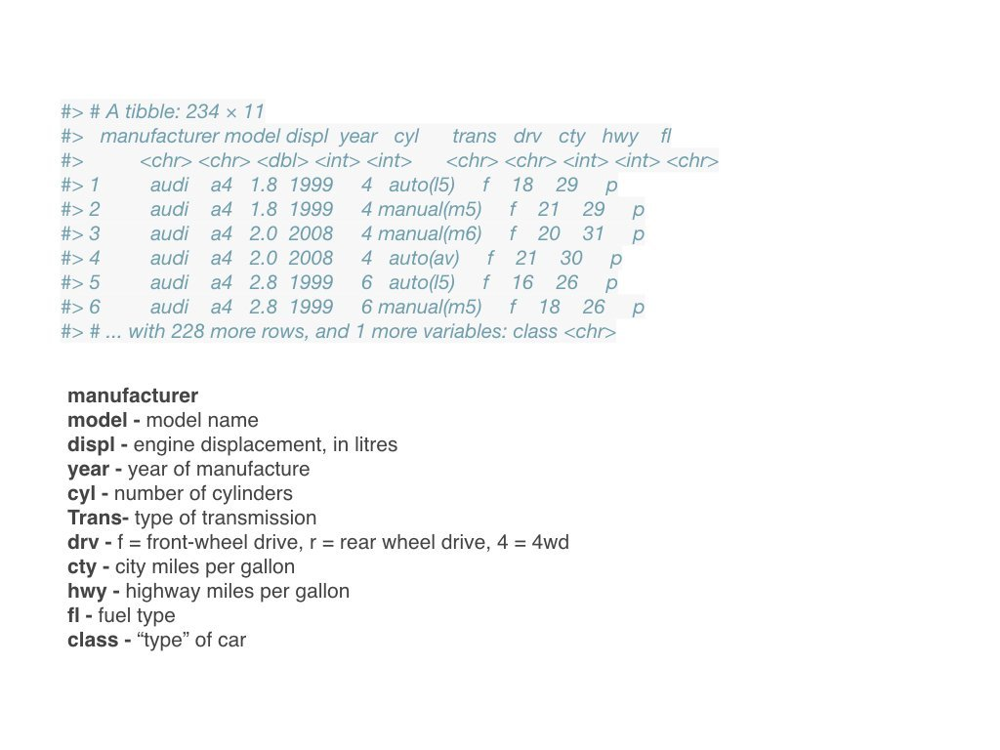{fig-align="center" width="90%"}

## DRAFT: A tibble - mpg dataset

::: panel-tabset
### Output

```{r}
#| echo: false
#| eval: true

library(tidyverse)
mpg
```

### Variable definitions

| Variable | Description |
|:---------|:------------|
| `manufacturer` | Manufacturer name |
| `model` | Model name |
| `displ` | Engine displacement, in litres |
| `year` | Year of manufacture |
| `cyl` | Number of cylinders |
| `trans` | Type of transmission |
| `drv` | f = front-wheel, r = rear wheel, 4 = 4wd |
| `cty` | City miles per gallon |
| `hwy` | Highway miles per gallon |
| `fl` | Fuel type |
| `class` | "Type" of car |
:::

## A tibble - a tidyverse dataframe

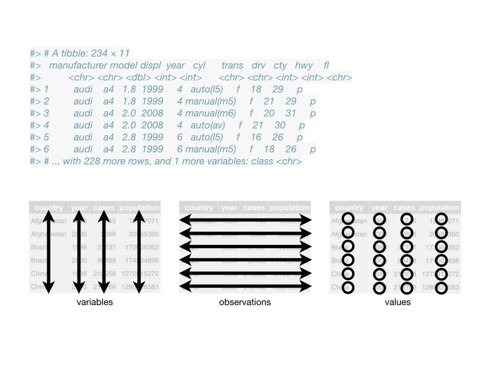{fig-align="center" width="90%"}

## Types of variables in a tibble

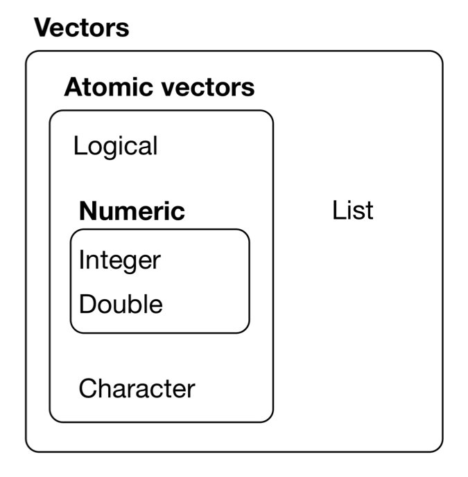{#fig-week2-dplyr-functions fig-align="center" width="90%"}

## Key dplyr Verbs

-   `dpylr` is a package in the `tidyverse` that gives you functions (aka verbs) to wrangle data.

| Verb          | Purpose                | Example                         |
|:--------------|:-----------------------|:--------------------------------|
| `filter()`    | Subset rows by values  | `filter(df, x > 5)`             |
| `select()`    | Subset columns by name | `select(df, col1, col2)`        |
| `arrange()`   | Reorder rows           | `arrange(df, x)`                |
| `mutate()`    | Create new columns     | `mutate(df, z = x + y)`         |
| `summarise()` | Collapse to summary    | `summarise(df, mean = mean(x))` |

## Filter, Arrange, and Select

```{r}
#| label: week2-filter-arrange-select
#| eval: false
#| echo: true

# Filter rows
filter(flights, month == 11 | month == 12)

# Arrange rows
arrange(flights, year, month, day)

# Select columns
select(flights, year, month, day)
```

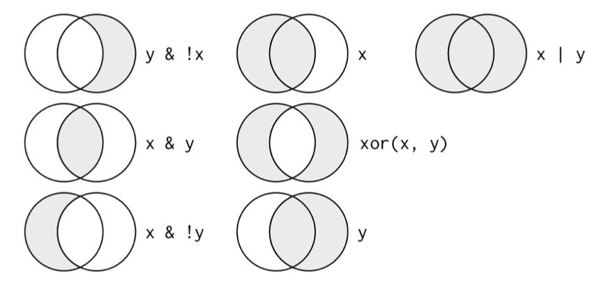{fig-align="center" width="50%"}

## Conditional Operators

| Operator  | Meaning                 |
|:----------|:------------------------|
| `==`      | Equals exactly          |
| `<`, `<=` | Less than (or equal)    |
| `>`, `>=` | Greater than (or equal) |
| `!=`      | Not equal to            |
| `!`       | NOT operator            |
| `&`       | AND operator            |
| `|`       | OR operator             |
| `%in%`    | Belongs to set          |

## Mutate and Transmute

```{r}
#| label: week2-mutate-example
#| eval: false
#| echo: true

# Add new columns based on existing ones
mutate(flights,
  gain = arr_delay - dep_delay,
  hours = air_time / 60,
  gain_per_hour = gain / hours
)

# Using pipes
flights |>
  mutate(
    gain = arr_delay - dep_delay,
    speed = distance / air_time * 60
  )
```

## Group By and Summarise

```{r}
#| label: week2-groupby-summarise
#| eval: false
#| echo: true

# Group by categorical variable
by_day <- group_by(flights, year, month, day)

# Summarise within groups
summarise(by_day, delay = mean(dep_delay, na.rm = TRUE))
```

::: callout-warning
Aggregation functions return NA if any input value is NA. Use `na.rm = TRUE` to remove missing values.
:::

## Other Useful dplyr Functions

| Function     | Purpose                  |
|:-------------|:-------------------------|
| `slice()`    | Subset rows by position  |
| `pull()`     | Extract column as vector |
| `count()`    | Count observations       |
| `distinct()` | Unique observations      |

## R Exercise: Data Wrangling

::: callout-tip
## Exercise

1.  Read in `Week1b_Stickle_RNAseq.tsv` or `knee_injury.csv` dataset
2.  `Select` a subset of categorical variables + quantitative variables
3.  `Mutate` to create square root transformed versions
4.  `Summarise` mean and SD `grouped by` categories (such as sex, population, treatment)
5.  Write results to a `.csv` file
:::

# Data Visualization with `ggplot2` {background-color="#2c3e50"}

## Introduction to `ggplot2`

-   Part of the `tidyverse` suite of packages
-   GG stands for "Grammar of Graphics"
-   Start with `ggplot()`, supply dataset and aesthetic mapping with `aes()`
-   Add geometry layers with `geom_*()` functions

::: callout-tip
More info: <https://ggplot2.tidyverse.org/>
:::

## Grammar of Graphics

{fig-align="center" width="90%"}

## Scatterplots

::: panel-tabset
### Output

```{r}
#| label: ggplot-scatter-output
#| echo: false
#| eval: true
#| fig-width: 8
#| fig-height: 4

ggplot(mpg, aes(displ, hwy, color = class)) +
  geom_point(size = 4, alpha = 0.6)
```

### Code

```{r}
#| label: ggplot-scatter-code
#| echo: true
#| eval: false

ggplot(mpg, aes(displ, hwy, color = class)) +
  geom_point(size = 4, alpha = 0.6)
```
:::

## Boxplots

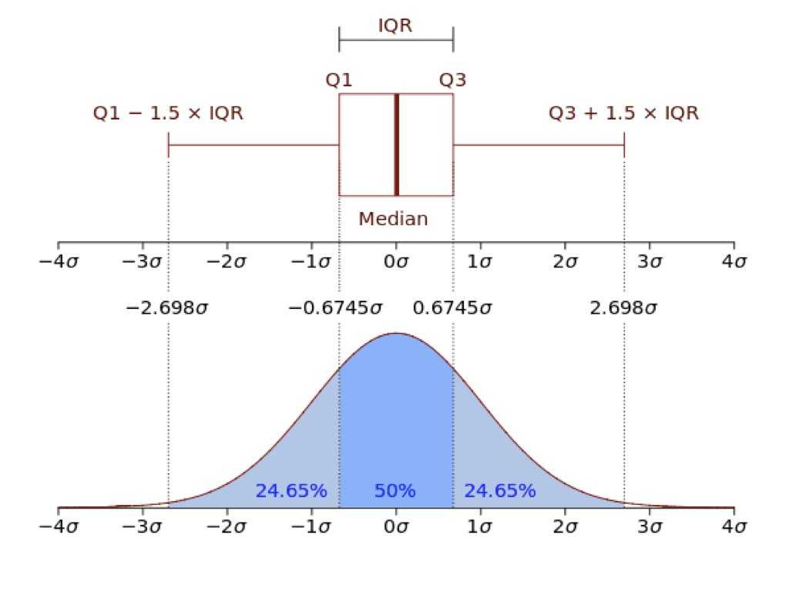{fig-align="center" width="90%"}

## DRAFT: Boxplot Anatomy with Normal Distribution

```{r}
#| echo: false
#| eval: true
#| fig-width: 10
#| fig-height: 6

library(ggplot2)

# Generate normal data
set.seed(42)
x <- seq(-4, 4, length.out = 1000)
y <- dnorm(x)

# Key quantiles
q1 <- qnorm(0.25)
q3 <- qnorm(0.75)
iqr <- q3 - q1
lower_whisker <- q1 - 1.5 * iqr
upper_whisker <- q3 + 1.5 * iqr

par(mar = c(4, 1, 1, 1))
layout(matrix(c(1, 2), nrow = 2), heights = c(1, 2))

# Top panel: boxplot
par(mar = c(0, 4, 2, 4))
boxplot(rnorm(10000), horizontal = TRUE, ylim = c(-4, 4),
        col = "white", border = "darkred", lwd = 2, axes = FALSE,
        outline = FALSE, boxwex = 0.6)
text(0, 1.35, "Median", cex = 1.1, col = "darkred")
text(q1, 1.35, "Q1", cex = 1.1, col = "darkred")
text(q3, 1.35, "Q3", cex = 1.1, col = "darkred")
text((q1 + q3) / 2, 0.55, "IQR", cex = 1.1, col = "darkred")
text(lower_whisker, 1.35, "Q1 − 1.5×IQR", cex = 0.9, col = "darkred")
text(upper_whisker, 1.35, "Q3 + 1.5×IQR", cex = 0.9, col = "darkred")

# Bottom panel: normal curve with shading
par(mar = c(4, 4, 0, 4))
plot(x, y, type = "n", axes = FALSE, xlab = "", ylab = "",
     xlim = c(-4, 4), ylim = c(0, max(y) * 1.15))

# Shade the IQR (50%)
x_iqr <- x[x >= q1 & x <= q3]
polygon(c(q1, x_iqr, q3), c(0, dnorm(x_iqr), 0),
        col = rgb(0.4, 0.5, 0.8, 0.5), border = NA)
# Shade Q1-1σ to Q1 and Q3 to Q3+1σ
x_left <- x[x >= q1 - 1.5 * iqr & x < q1]
polygon(c(min(x_left), x_left, q1), c(0, dnorm(x_left), 0),
        col = rgb(0.6, 0.7, 0.9, 0.4), border = NA)
x_right <- x[x > q3 & x <= q3 + 1.5 * iqr]
polygon(c(q3, x_right, max(x_right)), c(0, dnorm(x_right), 0),
        col = rgb(0.6, 0.7, 0.9, 0.4), border = NA)

lines(x, y, lwd = 3, col = "darkred")

# Sigma labels on x-axis
axis(1, at = -4:4, labels = paste0(c("-4σ","-3σ","-2σ","-1σ","0σ",
                                      "1σ","2σ","3σ","4σ")), cex.axis = 1.1)

# Percentage labels
text(0, 0.15, "50%", cex = 1.3, col = "darkred", font = 2)
text(-1.35, 0.06, "24.65%", cex = 1.1, col = "darkred")
text(1.35, 0.06, "24.65%", cex = 1.1, col = "darkred")

# Sigma boundary labels
abline(v = c(q1, q3, lower_whisker, upper_whisker),
       lty = 3, col = "gray50")
text(q1, max(y) * 1.1, expression(-0.6745*sigma), cex = 0.9)
text(q3, max(y) * 1.1, expression(0.6745*sigma), cex = 0.9)
text(lower_whisker, max(y) * 1.1, expression(-2.698*sigma), cex = 0.9)
text(upper_whisker, max(y) * 1.1, expression(2.698*sigma), cex = 0.9)
```

## Boxplots

::: panel-tabset
### Output

```{r}
#| label: ggplot-boxplot-output
#| echo: false
#| eval: true
#| fig-width: 10
#| fig-height: 4

ggplot(mpg, aes(manufacturer, hwy, colour = class)) +
  geom_boxplot() +
  theme_classic() +
  theme(axis.text.x = element_text(angle = 45, hjust=1))
```

### Code

```{r}
#| label: ggplot-boxplot-code
#| echo: true
#| eval: false

ggplot(mpg, aes(manufacturer, hwy, colour = class)) +
  geom_boxplot() +
  theme_classic() +
  theme(axis.text.x = element_text(angle = 45, hjust=1))
```
:::

## Common ggplot Geoms

| Geom               | Purpose      | Data Type               |
|:-------------------|:-------------|:------------------------|
| `geom_point()`     | Scatterplots | Two continuous          |
| `geom_line()`      | Line plots   | Continuous over ordered |
| `geom_bar()`       | Bar charts   | Categorical counts      |
| `geom_histogram()` | Histograms   | Single continuous       |
| `geom_boxplot()`   | Boxplots     | Continuous by category  |
| `geom_smooth()`    | Trend lines  | Two continuous          |

## Combining Geoms

::: panel-tabset
### Output

```{r}
#| label: combine-geoms-output
#| echo: false
#| eval: true
#| fig-width: 8
#| fig-height: 4

ggplot(data=mpg, aes(x=displ, y=hwy)) +
  geom_point() +
  geom_smooth() +
  labs(title = "Fuel efficiency decreases with engine size",
       caption = "Data from fueleconomy.gov")
```

### Code

```{r}
#| label: combine-geoms-code
#| echo: true
#| eval: false

ggplot(data=mpg, aes(x=displ, y=hwy)) +
  geom_point() +
  geom_smooth() +
  labs(title = "Fuel efficiency decreases with engine size",
       caption = "Data from fueleconomy.gov")
```
:::

## Faceting

::: panel-tabset
### Output

```{r}
#| label: facet-example-output
#| echo: false
#| eval: true
#| fig-width: 10
#| fig-height: 4

ggplot(data=mpg) +
  geom_point(mapping=aes(x=displ, y=hwy)) +
  facet_wrap(~class, nrow=2)
```

### Code

```{r}
#| label: facet-example-code
#| echo: true
#| eval: false

ggplot(data=mpg) +
  geom_point(mapping=aes(x=displ, y=hwy)) +
  facet_wrap(~class, nrow=2)
```
:::

## Three-Dimensional Data

::: panel-tabset
### Output

```{r}
#| label: 3d-contour-output
#| echo: false
#| eval: true
#| fig-width: 6
#| fig-height: 5

set.seed(345)
d <- data.frame(a = rnorm(100, 10, 10), b = rnorm(100, 5, 5))
ggplot(d, aes(x=a, y=b)) +
  geom_density2d_filled() +
  theme_minimal()
```

### Code

```{r}
#| label: 3d-contour-code
#| echo: true
#| eval: false

set.seed(345)
d <- data.frame(a = rnorm(100, 10, 10), b = rnorm(100, 5, 5))
ggplot(d, aes(x=a, y=b)) +
  geom_density2d_filled() +
  theme_minimal()
```
:::

## Choosing the Right Plot

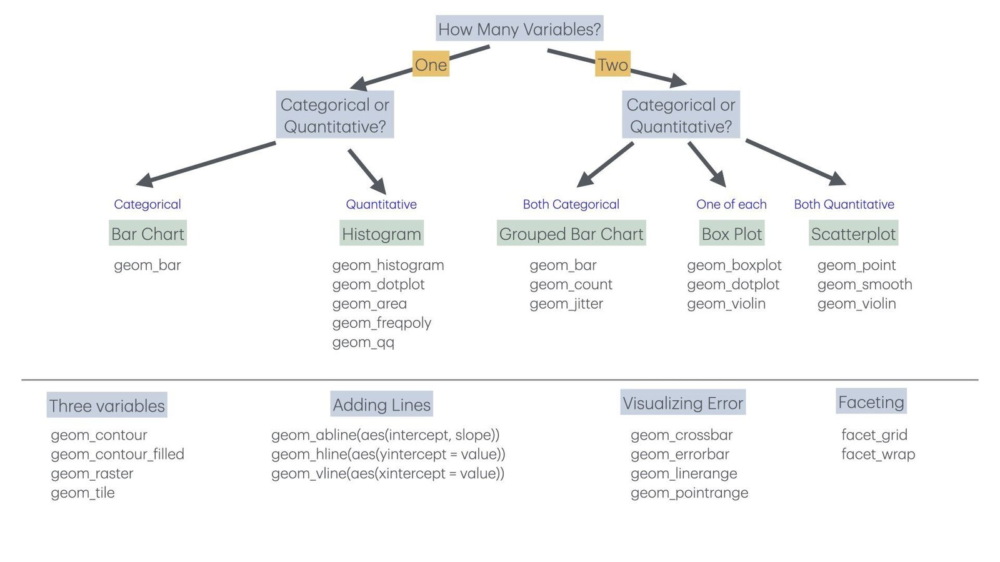{fig-align="center" width="90%"}

## R Exercise: Data Visualization

::: callout-tip
## Exercise

1.  Read in `Week1b_Stickle_RNAseq.tsv` or `knee_injury.csv` dataset
2.  Create `histograms` of data
3.  Create histograms on a `faceted` figure for different levels of a category
4.  Repeat steps 2 and 3 but create `boxplots`
5.  Write plots to a `.pdf` file
:::

# Best Practices in Data Visualization {background-color="#2c3e50"}

## Good, Bad, and Ugly

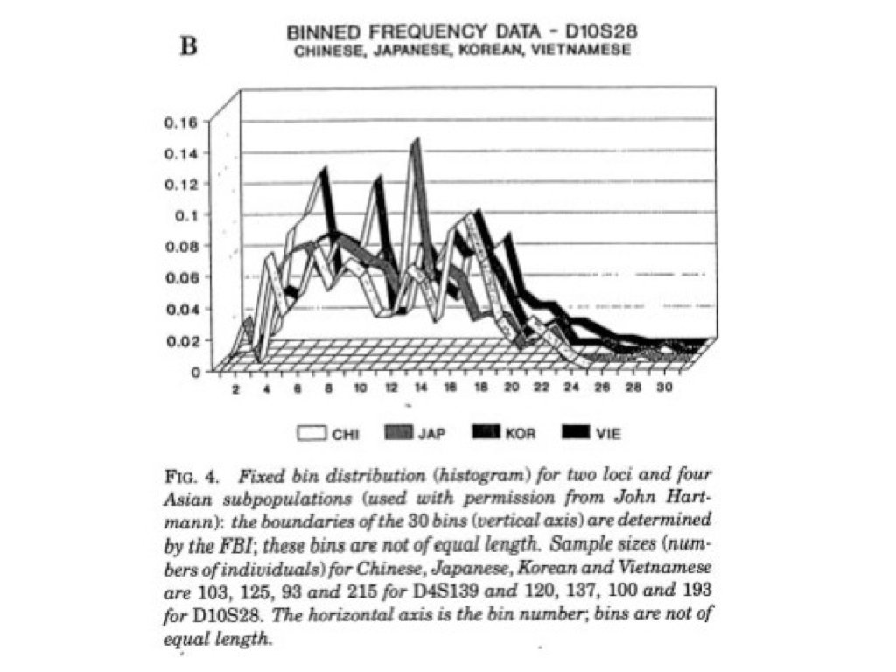{fig-align="center" width="75%"}

## A line to no understanding

{fig-align="center" width="75%"}

## Wack a mole

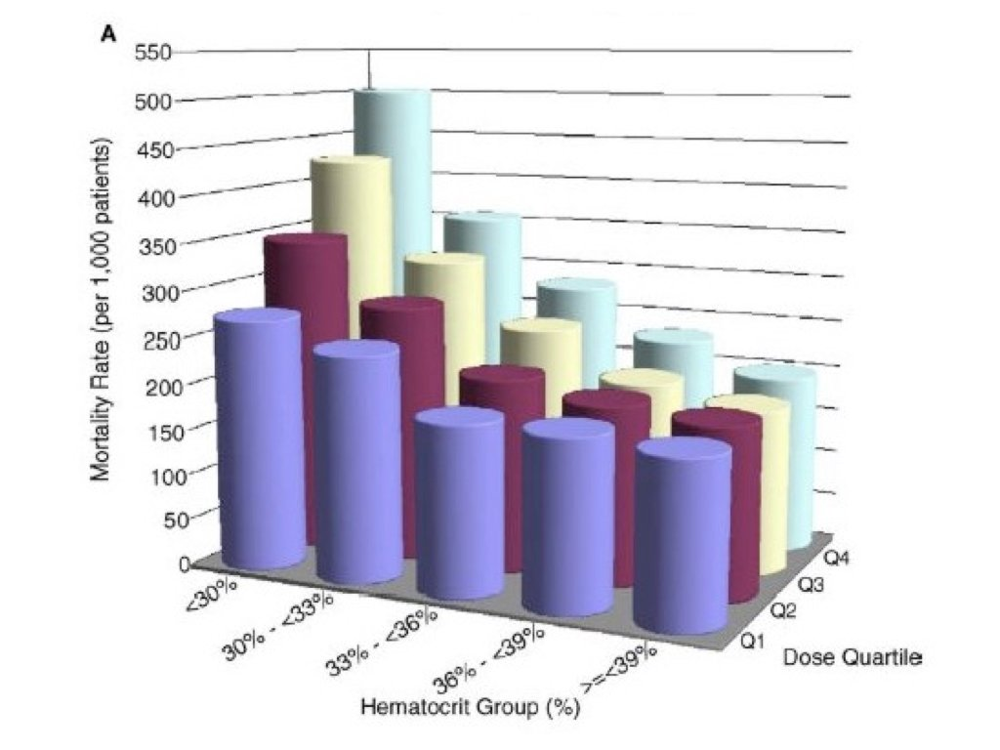{fig-align="center" width="80%"}

## Disk of disinformation

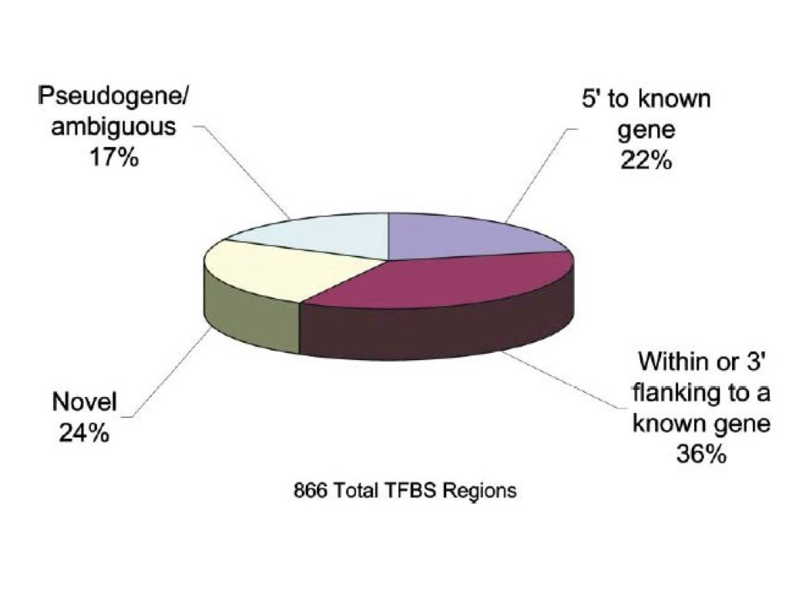{fig-align="center" width="80%"}

## Steaming pie chart mess

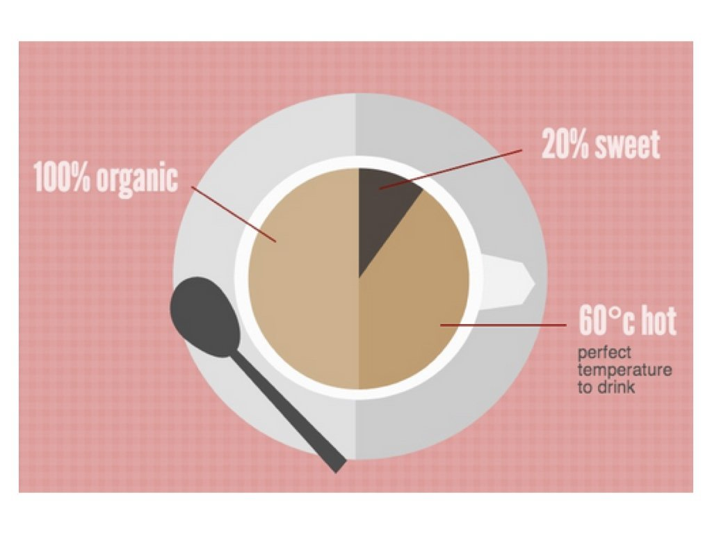{fig-align="center" width="80%"}

## A bake sale of pie charts

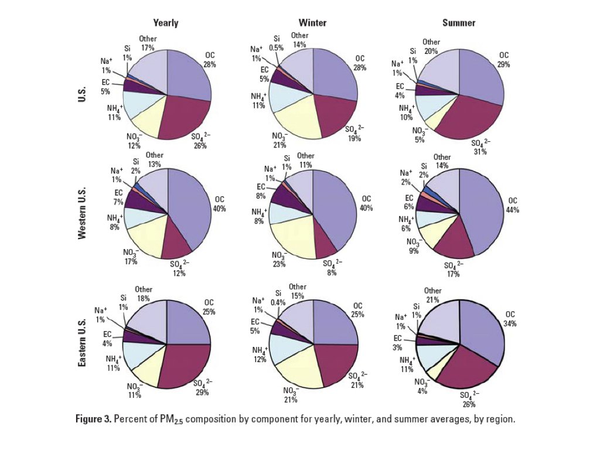{fig-align="center" width="75%"}

## 

{fig-align="center" width="80%"}

## 

{fig-align="center" width="80%"}

## Principles of Effective Display

> "Graphical excellence is that which gives to the viewer the greatest number of ideas in the shortest time with the least ink in the smallest space"
>
> --- Edward Tufte

-   Show the data
-   Encourage the eye to compare differences
-   Represent magnitudes honestly and accurately
-   Draw graphical elements clearly, minimizing clutter
-   Make displays easy to interpret

## "Above All Else Show the Data"

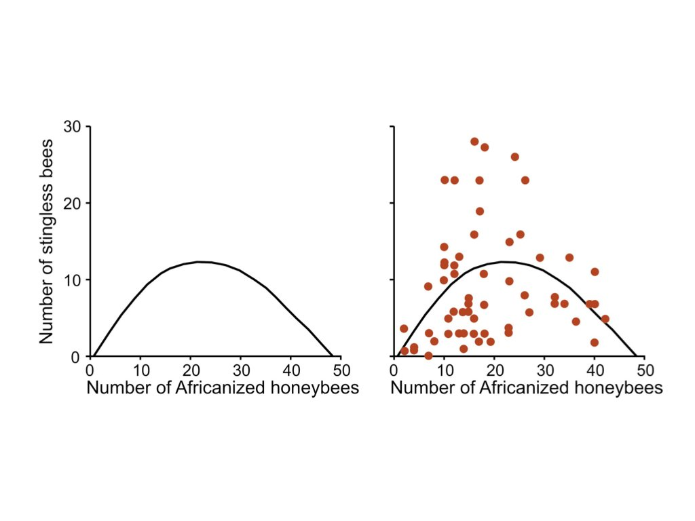{#fig-align="center" width="80%"}

## "Maximize the Data to Ink Ratio"

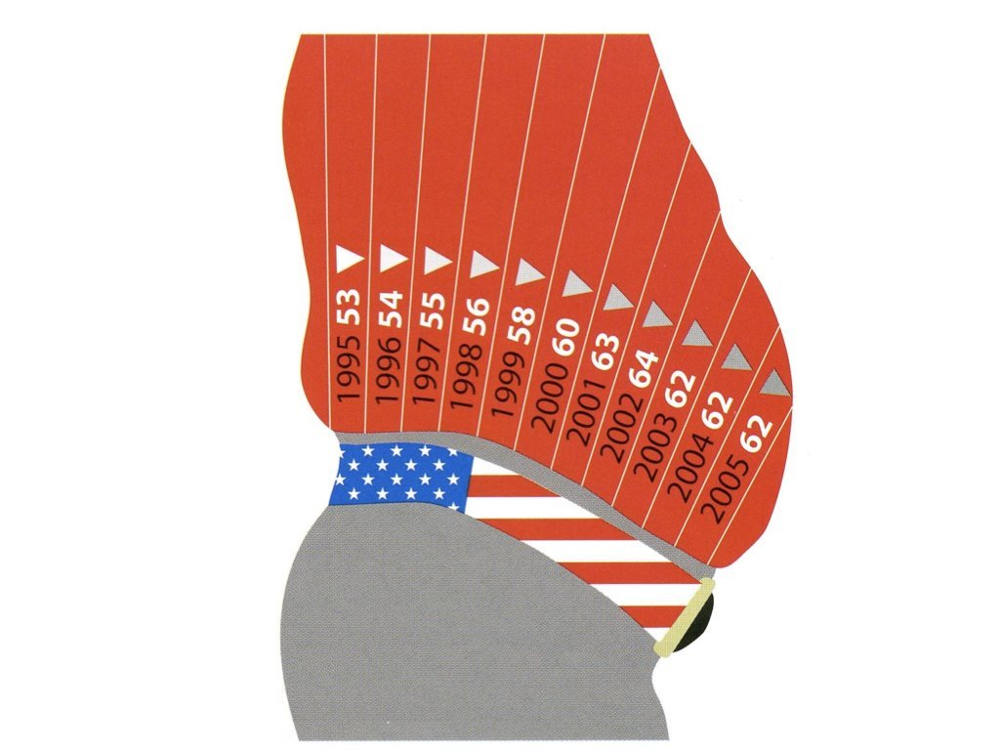{fig-align="center" width="80%"}

## Represent Magnitudes Honestly

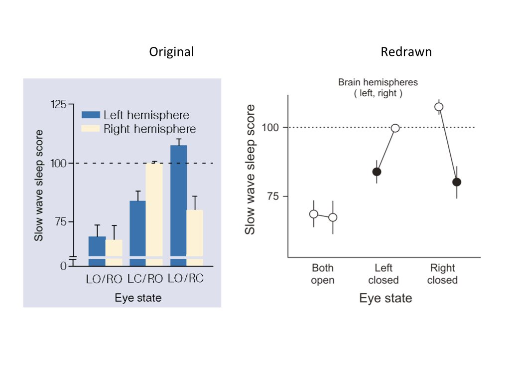{fig-align="center" width="70%"}

## How NOT to Make a Figure

::::: columns
::: {.column width="50%"}
{fig-align="center"}
:::

::: {.column width="50%"}
{fig-align="center"}
:::
:::::

"Graphical excellence begins with telling the truth about the data" – Tufte 1983

# Parameters and Statistics {background-color="#2c3e50"}

## Population vs. Sample

| Concept    | Population           | Sample               |
|:-----------|:---------------------|:---------------------|
| Definition | All individuals      | Subset of population |
| Parameters | μ (mean), σ (SD)     | x̄ (mean), s (SD)     |
| Goal       | What we want to know | What we can measure  |

::: callout-important
We use sample statistics to **estimate** population parameters
:::

## Accuracy vs. Precision

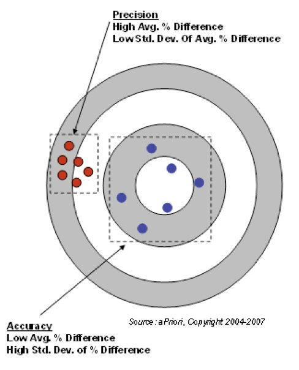{fig-align="center" width="50%"}

-   **Accuracy**: closeness to true value
-   **Precision**: closeness of repeated estimates to each other
-   **Replication** quantifies variation
-   **Randomization** avoids bias

## Stochastic Processes in Statistics

-   We often want to know truths about the world, but can only estimate them
-   Uncertainty in those estimates is a given
-   Statistics is largely about quantifying and managing uncertainty
-   Random variables are products of stochastic processes
-   Expectations are based on theoretical probability distributions

## Two Interpretations of Probability

**Frequency interpretation:**

"Probabilities are mathematically convenient approximations to long run relative frequencies."

**Subjective (Bayesian) interpretation:**

"A probability statement expresses the opinion of some individual regarding how certain an event is to occur."

## Random Variables and Probability

-   **Probability** is the expression of belief in some future outcome
-   A **random variable** can take on different values with different probabilities
-   The **sample space** is the universe of all possible values
-   Sample space represented by:
    -   **Probability mass distribution** (discrete)
    -   **Probability density function** (continuous)

::: callout-important
Probabilities of a sample space **always sum to 1.0**
:::

## Probability Rules

**'And' rule (multiplication):**

::: panel-tabset
### Equation

$$Pr(X \text{ and } Y) = Pr(X) \times Pr(Y)$$

### LaTeX

``` text
Pr(X \text{ and } Y) = Pr(X) \times Pr(Y)
```
:::

**'Or' rule (addition):**

::: panel-tabset
### Equation

$$Pr(X \text{ or } Y) = Pr(X) + Pr(Y)$$

### LaTeX

``` text
Pr(X \text{ or } Y) = Pr(X) + Pr(Y)
```
:::

::: callout-note
The 'and' rule assumes independent events. For non-independent events, we need conditional probabilities.
:::

## Joint and Conditional Probability

**Joint probability (independent events):**

::: panel-tabset
### Equation

$$Pr(X,Y) = Pr(X) \times Pr(Y)$$

### LaTeX

``` text
Pr(X,Y) = Pr(X) \times Pr(Y)
```
:::

**Conditional probability (independent):**

$$Pr(Y|X) = Pr(Y) \text{ and } Pr(X|Y) = Pr(X)$$

**Conditional probability (non-independent):**

$$Pr(Y|X) \neq Pr(Y) \text{ and } Pr(X|Y) \neq Pr(X)$$

## Likelihood vs. Probability

-   **Probability**: proportion of times an event would occur over many trials
-   **Likelihood**: conditional probability of a parameter value given data

::: panel-tabset
### Equation

$$L[\text{parameter}|\text{data}] = Pr[\text{data}|\text{parameter}]$$

### LaTeX

``` text
L[\text{parameter}|\text{data}] = Pr[\text{data}|\text{parameter}]
```
:::

-   **Maximum likelihood**: highest value of the likelihood function
-   **Bayesian estimate**: uses prior distribution to update posterior distribution

## Moments of Distributions

**1st moment (mean/expectation):**

::: panel-tabset
### Equation

$$E[X] = \sum_{\text{all x}}xP(X=x) = \mu$$

### LaTeX

``` text
E[X] = \sum_{\text{all x}}xP(X=x) = \mu
```
:::

**2nd moment (variance):**

::: panel-tabset
### Equation

$$Var(X) = E[(X-\mu)^2] = \sigma^2$$

### LaTeX

``` text
Var(X) = E[(X-\mu)^2] = \sigma^2
```
:::

**Standard deviation:** $$SD = \sqrt{\sigma^2} = \sigma$$

Higher moments include skewness (3rd) and kurtosis (4th).

# Discrete Probability Distributions {background-color="#2c3e50"}

## PMF, PDF, and CDF in R

::: panel-tabset
### Output

```{r}
#| label: fig-pmf-pdf-cdf-output
#| fig-cap: "Comparing discrete (Poisson) and continuous (Normal) distributions (probability mass function, probability density function, and cumulative density function)"
#| fig-width: 10
#| fig-height: 5
#| echo: false
#| eval: true

par(mfrow = c(2, 2))

# Discrete (Poisson) PMF
x_disc <- 0:15
plot(x_disc, dpois(x_disc, lambda = 5), type = "h", lwd = 3, col = "steelblue",
     main = "PMF: Poisson(λ=5)", xlab = "x", ylab = "P(X = x)")
points(x_disc, dpois(x_disc, lambda = 5), pch = 19, col = "steelblue")

# Continuous (Normal) PDF
x_cont <- seq(-4, 4, length.out = 200)
plot(x_cont, dnorm(x_cont), type = "l", lwd = 2, col = "coral",
     main = "PDF: Normal(0, 1)", xlab = "x", ylab = "f(x)")

# Poisson CDF
plot(x_disc, ppois(x_disc, lambda = 5), type = "s", lwd = 2, col = "steelblue",
     main = "CDF: Poisson(λ=5)", xlab = "x", ylab = "F(x)")

# Normal CDF
plot(x_cont, pnorm(x_cont), type = "l", lwd = 2, col = "forestgreen",
     main = "CDF: Normal(0, 1)", xlab = "x", ylab = "F(x) = P(X ≤ x)")
abline(h = c(0.025, 0.975), lty = 2, col = "gray")
```

### Code

```{r}
#| label: fig-pmf-pdf-cdf-code
#| echo: true
#| eval: false

par(mfrow = c(2, 2))

# Discrete (Poisson) PMF
x_disc <- 0:15
plot(x_disc, dpois(x_disc, lambda = 5), type = "h", lwd = 3, col = "steelblue",
     main = "PMF: Poisson(λ=5)", xlab = "x", ylab = "P(X = x)")
points(x_disc, dpois(x_disc, lambda = 5), pch = 19, col = "steelblue")

# Continuous (Normal) PDF
x_cont <- seq(-4, 4, length.out = 200)
plot(x_cont, dnorm(x_cont), type = "l", lwd = 2, col = "coral",
     main = "PDF: Normal(0, 1)", xlab = "x", ylab = "f(x)")

# Poisson CDF
plot(x_disc, ppois(x_disc, lambda = 5), type = "s", lwd = 2, col = "steelblue",
     main = "CDF: Poisson(λ=5)", xlab = "x", ylab = "F(x)")

# Normal CDF
plot(x_cont, pnorm(x_cont), type = "l", lwd = 2, col = "forestgreen",
     main = "CDF: Normal(0, 1)", xlab = "x", ylab = "F(x) = P(X ≤ x)")
abline(h = c(0.025, 0.975), lty = 2, col = "gray")
```
:::

## Common moments of distributions

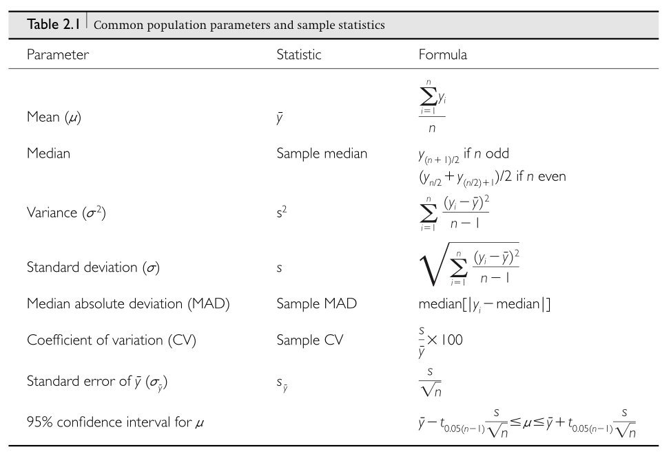{fig-align="center" width="90%"}

## DRAFT: Common moments of distributions

**Table 2.1** Common population parameters and sample statistics

| Parameter | Statistic | Formula |
|:----------|:----------|:--------|
| Mean ($\mu$) | $\bar{y}$ | $\frac{\sum_{i=1}^{n} y_i}{n}$ |
| Median | Sample median | $y_{(n+1)/2}$ if $n$ odd; $(y_{n/2} + y_{(n/2)+1})/2$ if $n$ even |
| Variance ($\sigma^2$) | $s^2$ | $\sum_{i=1}^{n} \frac{(y_i - \bar{y})^2}{n-1}$ |
| Standard deviation ($\sigma$) | $s$ | $\sqrt{\sum_{i=1}^{n} \frac{(y_i - \bar{y})^2}{n-1}}$ |
| Median absolute deviation (MAD) | Sample MAD | $\text{median}[\lvert y_i - \text{median} \rvert]$ |
| Coefficient of variation (CV) | Sample CV | $\frac{s}{\bar{y}} \times 100$ |
| Standard error of $\bar{y}$ ($\sigma_{\bar{y}}$) | $s_{\bar{y}}$ | $\frac{s}{\sqrt{n}}$ |
| 95% confidence interval for $\mu$ | | $\bar{y} - t_{0.05(n-1)}\frac{s}{\sqrt{n}} \leq \mu \leq \bar{y} + t_{0.05(n-1)}\frac{s}{\sqrt{n}}$ |

# Common Probability Distributions

## A Bernouli Trial

{fig-align="center" width="60%"}

## Probability of Independent Events

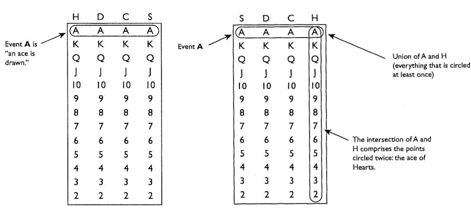{fig-align="center" width="100%"}

## Bernoulli Distribution

Describes the expected outcome of a single event with probability $p$.

**Example: Flipping a fair coin once**

$$Pr(X=\text{Head}) = \frac{1}{2} = 0.5 = p$$

$$Pr(X=\text{Tails}) = \frac{1}{2} = 0.5 = 1 - p = q$$

Probabilities always sum to 1: $p + q = 1$

## Let's Simulate Coin Flips

::: panel-tabset
### Output

```{r}
#| label: coin-flip-output
#| echo: false
#| eval: true
#| fig-width: 6
#| fig-height: 4

coin <- c("heads", "tails")
flips <- sample(coin, prob = c(0.5, 0.5), size = 100, replace = TRUE)
barplot(table(flips), col = c("steelblue", "coral"))
```

### Code

```{r}
#| label: coin-flip-code
#| echo: true
#| eval: false

coin <- c("heads", "tails")
flips <- sample(coin, prob = c(0.5, 0.5), size = 100, replace = TRUE)
barplot(table(flips), col = c("steelblue", "coral"))
```
:::

## In-Class Demo: Law of Large Numbers with Coin Flips

Watch how the proportion of heads converges to 0.5 as we flip more coins:

::: panel-tabset
### Output

```{r}
#| label: lln-coins-output
#| echo: false
#| eval: true
#| fig-width: 10
#| fig-height: 4

set.seed(344)
par(mfrow = c(2, 3))

# Different sample sizes
for(n in c(1, 8, 16, 32, 400, 1000)) {
  flips <- rbinom(n = n, size = 1, prob = 0.5)  # 0 = heads, 1 = tails
  prop_heads <- sum(flips == 0) / length(flips)
  prop_tails <- 1 - prop_heads

  barplot(height = c(prop_heads, prop_tails),
          names.arg = c("heads", "tails"),
          col = c("steelblue", "coral"),
          ylim = c(0, 1),
          main = paste("n =", n, "flips"),
          ylab = "Proportion")
  abline(h = 0.5, lty = 2, col = "gray")
}
```

### Code

```{r}
#| label: lln-coins-code
#| echo: true
#| eval: false

set.seed(344)
par(mfrow = c(2, 3))

# Different sample sizes
for(n in c(1, 8, 16, 32, 400, 1000)) {
  flips <- rbinom(n = n, size = 1, prob = 0.5)  # 0 = heads, 1 = tails
  prop_heads <- sum(flips == 0) / length(flips)
  prop_tails <- 1 - prop_heads

  barplot(height = c(prop_heads, prop_tails),
          names.arg = c("heads", "tails"),
          col = c("steelblue", "coral"),
          ylim = c(0, 1),
          main = paste("n =", n, "flips"),
          ylab = "Proportion")
  abline(h = 0.5, lty = 2, col = "gray")
}
```
:::

::: callout-tip
As sample size increases, observed proportions converge to true probability (0.5).
:::

## Law of Large Numbers in R

::: panel-tabset
### Output

```{r}
#| label: fig-lln-output
#| fig-cap: "Sample means converge to population mean as sample size increases"
#| fig-width: 9
#| fig-height: 4
#| echo: false
#| eval: true

# Simulate cumulative means from a Normal(10, 2) population
set.seed(123)
n <- 1000
samples <- rnorm(n, mean = 10, sd = 2)
cumulative_means <- cumsum(samples) / 1:n

plot(1:n, cumulative_means, type = "l", col = "steelblue", lwd = 2,
     xlab = "Sample Size (n)", ylab = "Cumulative Mean",
     main = "Law of Large Numbers: Mean Converges to μ = 10")
abline(h = 10, col = "red", lwd = 2, lty = 2)
legend("topright", c("Cumulative Mean", "True Mean (μ = 10)"),
       col = c("steelblue", "red"), lwd = 2, lty = c(1, 2))
```

### Code

```{r}
#| label: fig-lln-code
#| echo: true
#| eval: false

# Simulate cumulative means from a Normal(10, 2) population
set.seed(123)
n <- 1000
samples <- rnorm(n, mean = 10, sd = 2)
cumulative_means <- cumsum(samples) / 1:n

plot(1:n, cumulative_means, type = "l", col = "steelblue", lwd = 2,
     xlab = "Sample Size (n)", ylab = "Cumulative Mean",
     main = "Law of Large Numbers: Mean Converges to μ = 10")
abline(h = 10, col = "red", lwd = 2, lty = 2)
legend("topright", c("Cumulative Mean", "True Mean (μ = 10)"),
       col = c("steelblue", "red"), lwd = 2, lty = c(1, 2))
```
:::

## Binomial Distribution

Results from combining several independent Bernoulli events.

::: panel-tabset
### Equation

$$\large f(k) = {n \choose k} p^{k} (1-p)^{n-k}$$

### LaTeX

``` text
\large f(k) = {n \choose k} p^{k} (1-p)^{n-k}
```
:::

Where:

-   $n$ = total number of trials
-   $k$ = number of successes
-   $p$ = probability of success

## Binomial Distribution

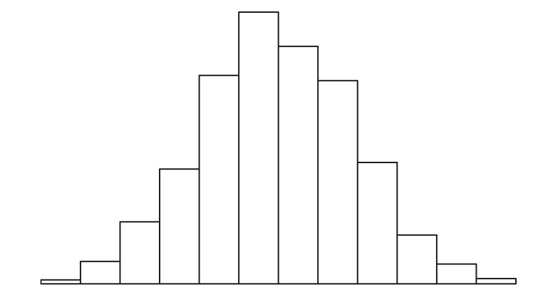{fig-align="center" width="100%"}

## DRAFT: Binomial Distribution - Bell Shape

```{r}
#| echo: false
#| eval: true
#| fig-width: 8
#| fig-height: 5

# Binomial distribution that produces a bell shape
n <- 20
p <- 0.5
x <- 0:n
probs <- dbinom(x, size = n, prob = p)

barplot(probs, names.arg = x, col = "white", border = "black",
        xlab = "Number of Successes", ylab = "Probability",
        main = "", las = 1, space = 0)
```

## Creating a Binomial Distributions

::: panel-tabset
### Output

```{r}
#| label: binom-test-output
#| echo: false
#| eval: true
#| fig-width: 7
#| fig-height: 4

# Plot distribution
plot(0:10, dbinom(x = 0:10, size = 10, prob = 0.5),
     type = "h", lwd = 3, col = "steelblue",
     xlab = "Number of Successes", ylab = "Probability")
```

### Code

```{r}
#| label: binom-test-code
#| echo: true
#| eval: false

# Probability of exactly 5 successes in 10 trials
dbinom(x = 5, size = 10, prob = 0.5)

# Plot distribution
plot(0:10, dbinom(x = 0:10, size = 10, prob = 0.5),
     type = "h", lwd = 3, col = "steelblue",
     xlab = "Number of Successes", ylab = "Probability")
```
:::

## Poisson Distribution

For discrete counts (e.g., snails per plot, neuron firings per second).

::: panel-tabset
### Equation

$$Pr(Y=r) = \frac{e^{-\lambda}\lambda^r}{r!}$$

### LaTeX

``` text
Pr(Y=r) = \frac{e^{-\lambda}\lambda^r}{r!}
```
:::

::: callout-note
The Poisson is a single-parameter distribution: $\mu = \sigma^2 = \lambda$

Variables with variance \> mean are called "overdispersed" (common in RNA-seq data).
:::

## Poisson Distribution Examples

::::: columns
::: {.column width="50%"}
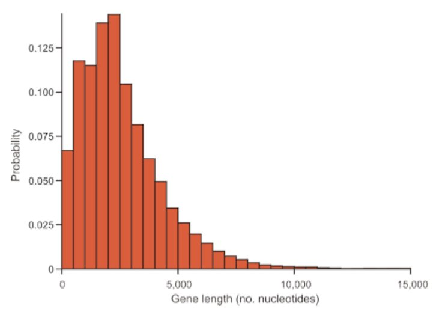{fig-align="center"}
:::

::: {.column width="50%"}
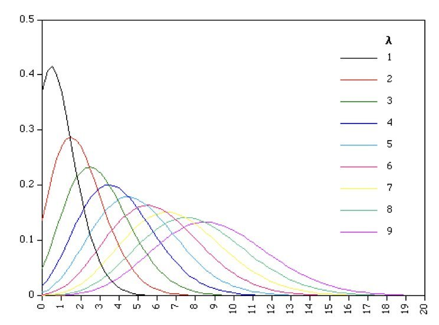{fig-align="center"}
:::
:::::

## DRAFT: Poisson Distribution Examples

::::: columns
::: {.column width="50%"}

```{r}
#| echo: false
#| eval: true
#| fig-width: 5
#| fig-height: 4

# Simulate right-skewed gene length data (gamma distribution)
set.seed(42)
gene_lengths <- rgamma(10000, shape = 2.5, rate = 0.001)
gene_lengths <- gene_lengths[gene_lengths <= 15000]

library(ggplot2)
ggplot(data.frame(length = gene_lengths), aes(x = length)) +
  geom_histogram(aes(y = after_stat(count) / sum(after_stat(count))),
                 binwidth = 500, fill = "#CC6633", color = "#CC6633",
                 boundary = 0) +
  scale_x_continuous(labels = scales::comma,
                     breaks = seq(0, 15000, 5000)) +
  labs(x = "Gene length (no. nucleotides)", y = "Probability") +
  theme_classic(base_size = 14)
```

:::

::: {.column width="50%"}

```{r}
#| echo: false
#| eval: true
#| fig-width: 5
#| fig-height: 4

# Poisson distributions with increasing lambda
x <- 0:20
colors <- c("black","red","green3","blue","cyan","magenta",
            "yellow3","darkgreen","purple")
lambdas <- 1:9

plot(x, dpois(x, lambda = 1), type = "l", lwd = 2,
     ylim = c(0, 0.45), xlab = "", ylab = "",
     col = colors[1], las = 1)
for (i in 2:length(lambdas)) {
  lines(x, dpois(x, lambda = lambdas[i]),
        col = colors[i], lwd = 2)
}
legend("topright", legend = paste("λ =", lambdas),
       col = colors, lwd = 2, cex = 0.8, title = expression(lambda))
```

:::
:::::

## Creating Poisson Distributions

::: panel-tabset
### Output

```{r}
#| label: pois-test-output
#| echo: false
#| eval: true
#| fig-width: 7
#| fig-height: 4

# Plot distribution
plot(0:15, dpois(x = 0:15, lambda = 3),
     type = "h", lwd = 3, col = "darkgreen",
     xlab = "Count", ylab = "Probability")
```

### Code

```{r}
#| label: pois-test-code
#| echo: true
#| eval: false

# Probability of 2 counts given lambda = 1
dpois(x = 2, lambda = 1)

# Plot distribution
plot(0:15, dpois(x = 0:15, lambda = 3),
     type = "h", lwd = 3, col = "darkgreen",
     xlab = "Count", ylab = "Probability")
```
:::

## Geometric Distribution

Probability of observing $k$ trials before the first success:

$$P(X=k)=(1-p)^{k-1}p$$

-   Mean = $\frac{1}{p}$
-   Variance = $\frac{(1-p)}{p^2}$

**Example:** If extinction probability is 0.1 per year, expected time to extinction?

## Negative Binomial Distribution

Probability of the $r^{th}$ success on the $k^{th}$ trial:

$$P(X=k)=\binom{k-1}{r-1}p^{r}(1-p)^{k-r}$$

-   Mean = $\frac{r}{p}$
-   Variance = $\frac{r(1-p)}{p^2}$

# Continuous Probability Distributions {background-color="#2c3e50"}

## Continuous Probability Distributions

$$P(a\leq X \leq b) = \int_{a}^{b} f(x) dx$$

The indefinite integral sums to one:

$$\int_{-\infty}^{\infty} f(x) dx = 1$$

**Expectation:** $$E[X] = \int_{-\infty}^{\infty} xf(x) dx$$

## Uniform Distribution

All outcomes equally probable.

$$E[X] = \frac{(a+b)}{2}$$

::: panel-tabset
### Output

```{r}
#| label: unif-dist-output
#| echo: false
#| eval: true
#| fig-width: 6
#| fig-height: 3

x <- seq(0, 10, 0.1)
plot(x, dunif(x, 0, 10), type = "l", lwd = 2, col = "purple",
     ylab = "Density", main = "Uniform Distribution (0, 10)")
```

### Code

```{r}
#| label: unif-dist-code
#| echo: true
#| eval: false

x <- seq(0, 10, 0.1)
plot(x, dunif(x, 0, 10), type = "l", lwd = 2, col = "purple",
     ylab = "Density", main = "Uniform Distribution (0, 10)")
```
:::

## Exponential Distribution

::: panel-tabset
### Equation

$$f(x)=\lambda e^{-\lambda x}$$

### LaTeX

``` text
f(x)=\lambda e^{-\lambda x}
```
:::

-   $E[X] = \frac{1}{\lambda}$
-   $Var(X) = \frac{1}{\lambda^2}$

**Example:** If λ equals the instantaneous death rate, the lifespan follows an exponential distribution.

## Exponential Distribution

::: panel-tabset
### Output

```{r}
#| label: exp-dist-output
#| echo: false
#| eval: true
#| fig-width: 7
#| fig-height: 4

x <- seq(0, 50, 0.5)
plot(x, dexp(x, rate = 0.1), type = "l", lwd = 2, col = "red",
     ylab = "Density", main = "Exponential Distribution (λ = 0.1)")
```

### Code

```{r}
#| label: exp-dist-code
#| echo: true
#| eval: false

x <- seq(0, 50, 0.5)
plot(x, dexp(x, rate = 0.1), type = "l", lwd = 2, col = "red",
     ylab = "Density", main = "Exponential Distribution (λ = 0.1)")
```
:::

## Gamma Distribution

Waiting time until the $r^{th}$ event at rate $\lambda$:

$$f(x) = \frac{\lambda^r x^{r-1} e^{-\lambda x}}{(r-1)!}$$

-   Mean = $\frac{r}{\lambda}$
-   Variance = $\frac{r}{\lambda^2}$

**Example:** Time until 1000 DNA strands synthesized at rate 1/ms.

# The Normal or Gaussian Distribution

## Normal (Gaussian) Distribution

::: panel-tabset
### Equation

$$f(x) = \frac{1}{\sqrt{2\pi\sigma^2}} \, \mathrm{e}^{-\frac{(x - \mu)^2}{2\sigma^2}}$$

### LaTeX

``` text
f(x) = \frac{1}{\sqrt{2\pi\sigma^2}} \, \mathrm{e}^{-\frac{(x - \mu)^2}{2\sigma^2}}
```
:::

Notation: $v \sim \mathcal{N}(\mu, \sigma^2)$

## Normal Distribution

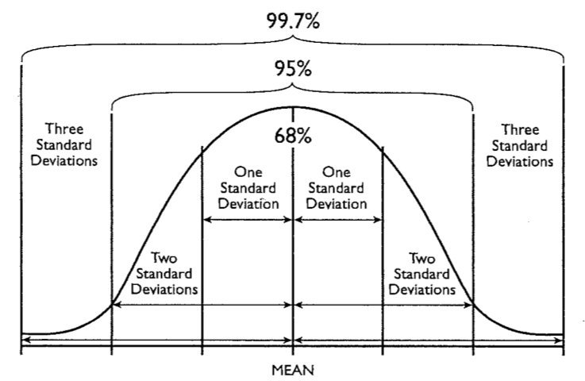{fig-align="center" width="90%"}

## DRAFT: Normal Distribution - 68-95-99.7 Rule

```{r}
#| echo: false
#| eval: true
#| fig-width: 10
#| fig-height: 6

x <- seq(-4, 4, length.out = 1000)
y <- dnorm(x)

plot(x, y, type = "l", lwd = 3, axes = FALSE,
     xlab = "", ylab = "", ylim = c(-0.02, max(y) * 1.35))

# Shade regions
# 99.7% region
x_99 <- x[x >= -3 & x <= 3]
polygon(c(-3, x_99, 3), c(0, dnorm(x_99), 0),
        col = rgb(0.85, 0.85, 0.95, 0.5), border = NA)
# 95% region
x_95 <- x[x >= -2 & x <= 2]
polygon(c(-2, x_95, 2), c(0, dnorm(x_95), 0),
        col = rgb(0.7, 0.7, 0.9, 0.5), border = NA)
# 68% region
x_68 <- x[x >= -1 & x <= 1]
polygon(c(-1, x_68, 1), c(0, dnorm(x_68), 0),
        col = rgb(0.5, 0.5, 0.85, 0.6), border = NA)

lines(x, y, lwd = 3)

# Axis
axis(1, at = -3:3, labels = FALSE)
text(0, -0.02, "MEAN", cex = 1.2, font = 2)

# Bracket labels
arrows(-1, 0.32, 1, 0.32, code = 3, length = 0.1, lwd = 2)
text(0, 0.34, "68%", cex = 1.5, font = 2)
text(-0.5, 0.28, "One Standard\nDeviation", cex = 0.9)
text(0.5, 0.28, "One Standard\nDeviation", cex = 0.9)

arrows(-2, 0.40, 2, 0.40, code = 3, length = 0.1, lwd = 2)
text(0, 0.42, "95%", cex = 1.5, font = 2)

arrows(-3, 0.48, 3, 0.48, code = 3, length = 0.1, lwd = 2)
text(0, 0.50, "99.7%", cex = 1.5, font = 2)
```

## Normal Distribution

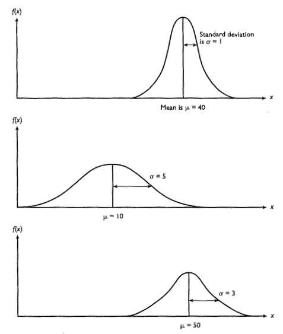{fig-align="center" width="50%"}

## DRAFT: Normal Distributions - Varying Parameters

```{r}
#| echo: false
#| eval: true
#| fig-width: 6
#| fig-height: 9

par(mfrow = c(3, 1), mar = c(4, 4, 2, 1))

# Plot 1: mu = 40, sigma = 1
x1 <- seq(35, 45, length.out = 300)
y1 <- dnorm(x1, mean = 40, sd = 1)
plot(x1, y1, type = "l", lwd = 2, xlab = "x", ylab = "f(x)",
     main = "", las = 1)
polygon(c(min(x1), x1, max(x1)), c(0, y1, 0),
        col = rgb(0, 0, 0, 0.2), border = NA)
lines(x1, y1, lwd = 2)
text(41, max(y1) * 0.7, expression("Standard deviation\nis " * sigma * " = 1"), cex = 1.1)
mtext(expression("Mean is " * mu * " = 40"), side = 1, line = 2.5, cex = 1)

# Plot 2: mu = 10, sigma = 5
x2 <- seq(-10, 30, length.out = 300)
y2 <- dnorm(x2, mean = 10, sd = 5)
plot(x2, y2, type = "l", lwd = 2, xlab = "x", ylab = "f(x)",
     main = "", las = 1)
polygon(c(min(x2), x2, max(x2)), c(0, y2, 0),
        col = rgb(0, 0, 0, 0.2), border = NA)
lines(x2, y2, lwd = 2)
arrows(5, max(y2) * 0.6, 15, max(y2) * 0.6, code = 3, length = 0.1, lwd = 2)
text(10, max(y2) * 0.7, expression(sigma * " = 5"), cex = 1.2)
mtext(expression(mu * " = 10"), side = 1, line = 2.5, cex = 1)

# Plot 3: mu = 50, sigma = 3
x3 <- seq(38, 62, length.out = 300)
y3 <- dnorm(x3, mean = 50, sd = 3)
plot(x3, y3, type = "l", lwd = 2, xlab = "x", ylab = "f(x)",
     main = "", las = 1)
polygon(c(min(x3), x3, max(x3)), c(0, y3, 0),
        col = rgb(0, 0, 0, 0.2), border = NA)
lines(x3, y3, lwd = 2)
arrows(47, max(y3) * 0.6, 53, max(y3) * 0.6, code = 3, length = 0.1, lwd = 2)
text(50, max(y3) * 0.7, expression(sigma * " = 3"), cex = 1.2)
mtext(expression(mu * " = 50"), side = 1, line = 2.5, cex = 1)
```

## Why is the Normal Distribution Special?

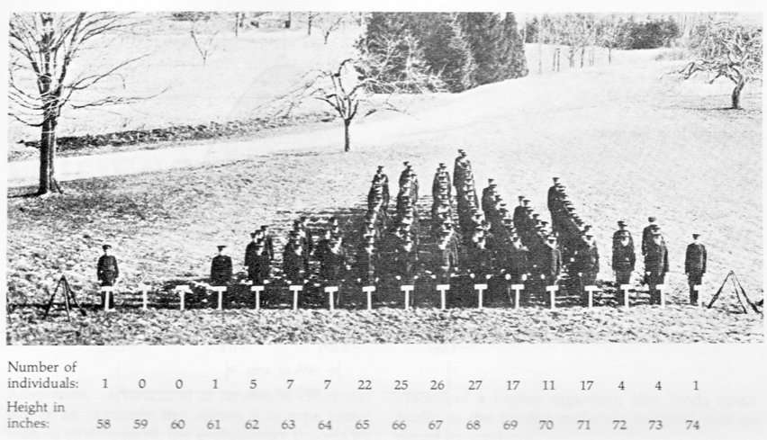{fig-align="center" width="100%"}

## Why Normal is Special in Biology

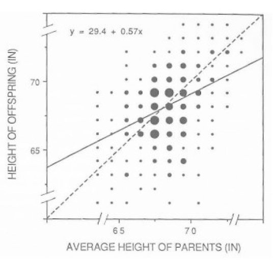{fig-align="center" width="70%"}

## DRAFT: Galton's Regression to the Mean

```{r}
#| echo: false
#| eval: true
#| fig-width: 6
#| fig-height: 6

# Recreate Galton's parent-offspring height data (approximate)
set.seed(1885)
n <- 200
parent_height <- rnorm(n, mean = 68, sd = 2)
offspring_height <- 29.4 + 0.57 * parent_height + rnorm(n, 0, 1.5)

# Create bubble-like effect by rounding
parent_r <- round(parent_height)
offspring_r <- round(offspring_height)

# Count duplicates for point sizing
df <- data.frame(parent = parent_r, offspring = offspring_r)
df_counts <- as.data.frame(table(df$parent, df$offspring))
names(df_counts) <- c("parent", "offspring", "count")
df_counts$parent <- as.numeric(as.character(df_counts$parent))
df_counts$offspring <- as.numeric(as.character(df_counts$offspring))
df_counts <- df_counts[df_counts$count > 0, ]

plot(df_counts$parent, df_counts$offspring,
     cex = sqrt(df_counts$count) * 1.2,
     pch = 16, col = rgb(0.3, 0.3, 0.3, 0.7),
     xlab = "AVERAGE HEIGHT OF PARENTS (IN)",
     ylab = "HEIGHT OF OFFSPRING (IN)",
     xlim = c(63, 73), ylim = c(62, 73),
     las = 1)

# Regression line
abline(a = 29.4, b = 0.57, lwd = 2)
# 1:1 line (dashed)
abline(a = 0, b = 1, lwd = 2, lty = 2)

text(64, 72, "y = 29.4 + 0.57x", cex = 1.1)
```

## Why Normal is Special in Biology

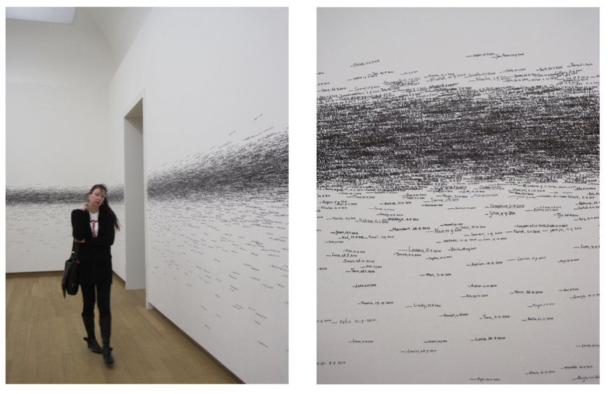{fig-align="center" width="100%"}

## Z-Scores of Normal distributions

Standardize variables to mean = 0, SD = 1:

::: panel-tabset
### Equation

$$\huge z_i = \frac{(x_i - \bar{x})}{s}$$

### LaTeX

``` text
\huge z_i = \frac{(x_i - \bar{x})}{s}
```
:::

This is the **standard normal distribution**.

# Sampling from distributions in R

## Distribution Functions in R

| Prefix | Function                 | Example              |
|:-------|:-------------------------|:---------------------|
| `d`    | Probability density/mass | `dnorm(0, 0, 1)`     |
| `p`    | Cumulative distribution  | `pnorm(1.96, 0, 1)`  |
| `q`    | Quantile function        | `qnorm(0.975, 0, 1)` |
| `r`    | Random number generator  | `rnorm(100, 0, 1)`   |

Works for: `binom`, `pois`, `exp`, `norm`, `geom`, `nbinom`, `unif`, `gamma`

# Estimates and Confidence Intervals {background-color="#2c3e50"}

## Parameter Estimation

-   Estimation infers population parameters from sample data
-   Sample estimates rarely equal population parameters exactly
-   **Sampling distribution**: all values we might obtain from samples
-   **Standard error**: standard deviation of sampling distribution

::: callout-important
NO ESTIMATE IS USEFUL WITHOUT A STANDARD ERROR!
:::

## Estimation Approaches

| Approach | Description |
|:---|:---|
| **Parametric** | Assumes specific distributions |
| **Resampling** | Bootstrap/randomization for empirical distributions |
| **OLS** | Ordinary Least Squares optimization |
| **Maximum Likelihood** | Model-based estimates with confidence |
| **Bayesian** | Incorporates prior information |

## The Central Limit Theorem

For most data, we can't determine sampling distributions empirically.

The CLT tells us that the sampling distribution of the mean approaches normal as sample size increases, regardless of the underlying distribution.

## Visualizing the Central Limit Theorem

::: panel-tabset
### Output

```{r}
#| label: fig-clt-figure
#| fig-cap: "CLT: Sample means become normal even from non-normal populations"
#| fig-width: 10
#| fig-height: 5
#| echo: false
#| eval: true

par(mfrow = c(2, 4))

# Exponential distribution (skewed)
set.seed(42)
exp_pop <- rexp(10000, rate = 1)
hist(exp_pop, main = "Population\n(Exponential)", col = "lightgray",
     border = "white", xlab = "Value", breaks = 30)

# Sample means for different n
for(n in c(5, 30, 100)) {
  means <- replicate(1000, mean(sample(exp_pop, n, replace = TRUE)))
  hist(means, main = paste("Sample Means\n(n =", n, ")"),
       col = "steelblue", border = "white", xlab = "Mean", breaks = 25)
}

# Uniform distribution
unif_pop <- runif(10000, 0, 1)
hist(unif_pop, main = "Population\n(Uniform)", col = "lightgray",
     border = "white", xlab = "Value", breaks = 30)

for(n in c(5, 30, 100)) {
  means <- replicate(1000, mean(sample(unif_pop, n, replace = TRUE)))
  hist(means, main = paste("Sample Means\n(n =", n, ")"),
       col = "coral", border = "white", xlab = "Mean", breaks = 25)
}
```

### Code

```{r}
#| label: fig-clt-code
#| fig-cap: "CLT: Sample means become normal even from non-normal populations"
#| fig-width: 10
#| fig-height: 5
#| echo: true
#| eval: false

par(mfrow = c(2, 4))

# Exponential distribution (skewed)
set.seed(42)
exp_pop <- rexp(10000, rate = 1)
hist(exp_pop, main = "Population\n(Exponential)", col = "lightgray",
     border = "white", xlab = "Value", breaks = 30)

# Sample means for different n
for(n in c(5, 30, 100)) {
  means <- replicate(1000, mean(sample(exp_pop, n, replace = TRUE)))
  hist(means, main = paste("Sample Means\n(n =", n, ")"),
       col = "steelblue", border = "white", xlab = "Mean", breaks = 25)
}

# Uniform distribution
unif_pop <- runif(10000, 0, 1)
hist(unif_pop, main = "Population\n(Uniform)", col = "lightgray",
     border = "white", xlab = "Value", breaks = 30)

for(n in c(5, 30, 100)) {
  means <- replicate(1000, mean(sample(unif_pop, n, replace = TRUE)))
  hist(means, main = paste("Sample Means\n(n =", n, ")"),
       col = "coral", border = "white", xlab = "Mean", breaks = 25)
}
```
:::

## CLT in Quantitative Genetics

**Why are complex traits normally distributed?**

Simulate a trait controlled by 5 genes, each with additive effects:

::: panel-tabset
### Output

```{r}
#| label: clt-genetics-output
#| echo: false
#| eval: true
#| fig-width: 10
#| fig-height: 4

set.seed(245)
n_individuals <- 100

# Each locus contributes -1, 0, or +1 to phenotype (diploid genotypes)
contributions <- matrix(0, nrow = n_individuals, ncol = 5)
for(locus in 1:5) {
  genotype <- rbinom(n_individuals, size = 2, prob = 0.5)  # 0, 1, or 2 copies
  contributions[, locus] <- ifelse(genotype == 2, 1,
                                    ifelse(genotype == 1, 0, -1))
}

# Sum across loci to get phenotype
phenotype <- rowSums(contributions)

par(mfrow = c(1, 2))
hist(phenotype, col = "steelblue", border = "white",
     main = "5-Locus Trait Distribution",
     xlab = "Phenotype Value", breaks = seq(-6, 6, 1))

# Add environmental noise to make continuous
phenotype_continuous <- phenotype + rnorm(n_individuals, 0, 0.5)
hist(phenotype_continuous, col = "coral", border = "white",
     main = "With Environmental Variation",
     xlab = "Phenotype Value", breaks = 20)
```

### Code

```{r}
#| label: clt-genetics-code
#| echo: true
#| eval: false

set.seed(245)
n_individuals <- 100

# Each locus contributes -1, 0, or +1 to phenotype (diploid genotypes)
contributions <- matrix(0, nrow = n_individuals, ncol = 5)
for(locus in 1:5) {
  genotype <- rbinom(n_individuals, size = 2, prob = 0.5)  # 0, 1, or 2 copies
  contributions[, locus] <- ifelse(genotype == 2, 1,
                                    ifelse(genotype == 1, 0, -1))
}

# Sum across loci to get phenotype
phenotype <- rowSums(contributions)

par(mfrow = c(1, 2))
hist(phenotype, col = "steelblue", border = "white",
     main = "5-Locus Trait Distribution",
     xlab = "Phenotype Value", breaks = seq(-6, 6, 1))

# Add environmental noise to make continuous
phenotype_continuous <- phenotype + rnorm(n_individuals, 0, 0.5)
hist(phenotype_continuous, col = "coral", border = "white",
     main = "With Environmental Variation",
     xlab = "Phenotype Value", breaks = 20)
```
:::

::: callout-note
This is why quantitative traits (height, weight, blood pressure) are approximately normal!
:::

# Sampling variation of a parameter estimate

## Sampling Variation of a Parameter

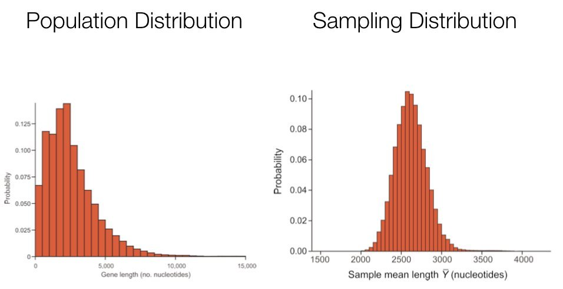{fig-align="center" width="100%"}

## DRAFT: Population vs Sampling Distribution

```{r}
#| echo: false
#| eval: true
#| fig-width: 10
#| fig-height: 5

# Simulate gene length data (right-skewed gamma)
set.seed(42)
pop_data <- rgamma(100000, shape = 2.5, rate = 0.001)
pop_data <- pop_data[pop_data <= 15000]
pop_mean <- mean(pop_data)

# Sampling distribution: means of samples of n=100
sample_means <- replicate(10000, mean(sample(pop_data, 100)))

par(mfrow = c(1, 2), mar = c(5, 4, 3, 1))

# Left: Population distribution
hist(pop_data, breaks = seq(0, 15000, by = 500),
     col = "#CC6633", border = "#CC6633",
     main = "Population Distribution",
     xlab = "Gene length (no. nucleotides)", ylab = "Probability",
     freq = FALSE, las = 1)

# Right: Sampling distribution
hist(sample_means, breaks = 40,
     col = "#CC6633", border = "#CC6633",
     main = "Sampling Distribution",
     xlab = expression("Sample mean length " * bar(Y) * " (nucleotides)"),
     ylab = "Probability", freq = FALSE, las = 1)
```

##

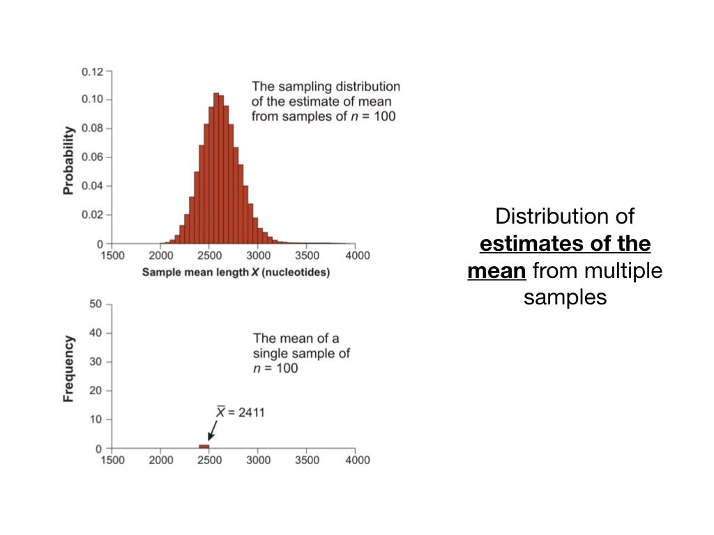{fig-align="center" width="100%"}

## DRAFT: Sampling Distribution of Means

```{r}
#| echo: false
#| eval: true
#| fig-width: 10
#| fig-height: 7

set.seed(42)
pop_data <- rgamma(100000, shape = 2.5, rate = 0.001)
pop_data <- pop_data[pop_data <= 15000]
sample_means <- replicate(10000, mean(sample(pop_data, 100)))

par(mfrow = c(2, 1), mar = c(5, 5, 3, 8))

# Top: Sampling distribution
hist(sample_means, breaks = 40,
     col = "#CC6633", border = "#CC6633",
     main = "", xlim = c(1500, 4000),
     xlab = expression("Sample mean length " * bar(X) * " (nucleotides)"),
     ylab = "Probability", freq = FALSE, las = 1)
text(3500, 0.008, "The sampling distribution\nof the estimate of mean\nfrom samples of n = 100",
     cex = 1.0)

# Bottom: Single sample mean
plot(1, 1, type = "n", xlim = c(1500, 4000), ylim = c(0, 50),
     xlab = expression("Sample mean length " * bar(X) * " (nucleotides)"),
     ylab = "Frequency", las = 1, main = "")
segments(2411, 0, 2411, 1, lwd = 8, col = "#CC6633")
text(2600, 35, "The mean of a\nsingle sample of\nn = 100", cex = 1.0)
arrows(2450, 5, 2415, 1.5, length = 0.1)
text(2450, 7, expression(bar(X) * " = 2411"), cex = 1.0)

mtext("Distribution of estimates of the\nmean from multiple samples",
      side = 4, line = 2, at = 35, outer = FALSE, cex = 0.9, las = 0,
      adj = 0.5)
```

## Estimation and Confidence Intervals

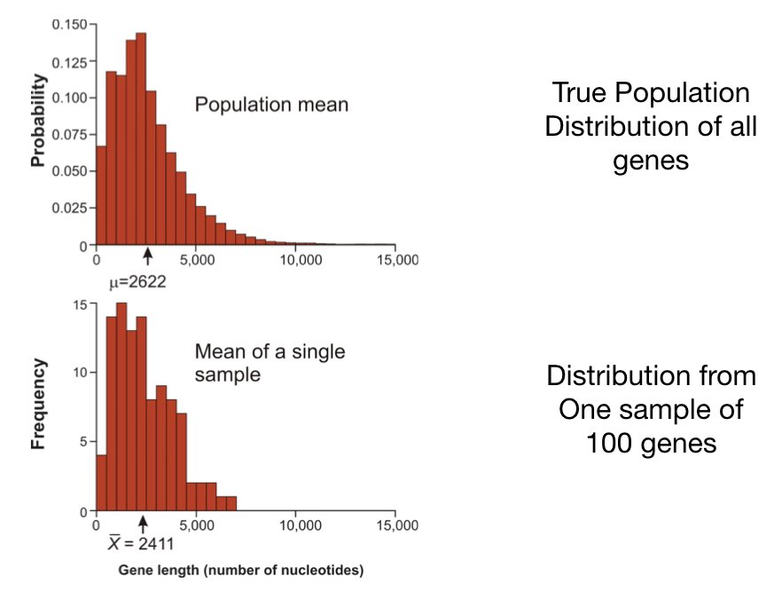{fig-align="center" width="90%"}

## DRAFT: Population vs Single Sample

```{r}
#| echo: false
#| eval: true
#| fig-width: 10
#| fig-height: 7

set.seed(42)
pop_data <- rgamma(100000, shape = 2.5, rate = 0.001)
pop_data <- pop_data[pop_data <= 15000]
pop_mean <- mean(pop_data)

# Single sample
single_sample <- sample(pop_data, 100)
sample_mean <- round(mean(single_sample))

par(mfrow = c(2, 1), mar = c(5, 5, 3, 10))

# Top: Population distribution
hist(pop_data, breaks = seq(0, 15000, by = 500),
     col = "#CC6633", border = "#CC6633",
     main = "", xlab = "Gene length (number of nucleotides)",
     ylab = "Probability", freq = FALSE, las = 1)
arrows(pop_mean, 0.00005, pop_mean, -0.00002, length = 0.1, lwd = 2)
text(pop_mean, 0.00008, bquote(mu == .(round(pop_mean))), cex = 1.1)
text(4000, 0.00012, "Population mean", cex = 1.1, font = 2)
mtext("True Population\nDistribution of all\ngenes",
      side = 4, line = 1, cex = 1.0)

# Bottom: Single sample
hist(single_sample, breaks = seq(0, 15000, by = 500),
     col = "#CC6633", border = "#CC6633",
     main = "", xlim = c(0, 15000),
     xlab = "Gene length (number of nucleotides)",
     ylab = "Frequency", las = 1)
arrows(sample_mean, -0.3, sample_mean, 0, length = 0.1, lwd = 2)
text(sample_mean, -1, bquote(bar(X) == .(sample_mean)), cex = 1.1)
text(4000, 12, "Mean of a single\nsample", cex = 1.1)
mtext("Distribution from\nOne sample of\n100 genes",
      side = 4, line = 1, cex = 1.0)
```

##

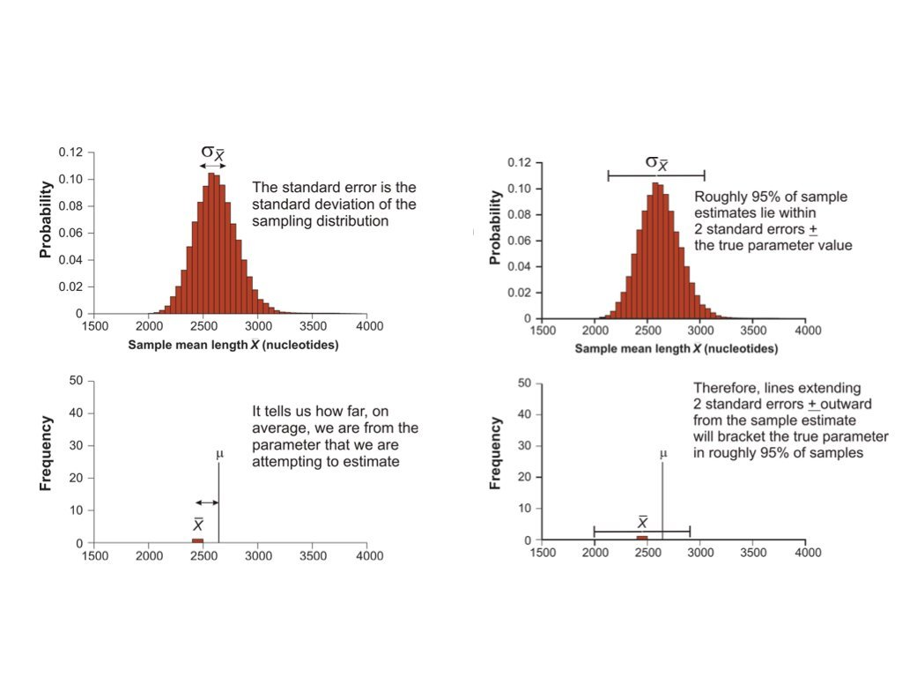{fig-align="center" width="100%"}

## DRAFT: Standard Error and Confidence Intervals

```{r}
#| echo: false
#| eval: true
#| fig-width: 10
#| fig-height: 8

set.seed(42)
pop_data <- rgamma(100000, shape = 2.5, rate = 0.001)
pop_data <- pop_data[pop_data <= 15000]
pop_mean <- mean(pop_data)
sample_means <- replicate(10000, mean(sample(pop_data, 100)))
se <- sd(sample_means)

par(mfrow = c(2, 2), mar = c(5, 4, 3, 1))

# Top-left: sampling distribution + SE arrow
hist(sample_means, breaks = 40, col = "#CC6633", border = "#CC6633",
     main = "", xlim = c(1500, 4000),
     xlab = expression("Sample mean length " * bar(X) * " (nucleotides)"),
     ylab = "Probability", freq = FALSE, las = 1)
arrows(pop_mean - se, 0.012, pop_mean + se, 0.012,
       code = 3, length = 0.1, lwd = 2)
text(pop_mean, 0.0135, expression(sigma[bar(X)]), cex = 1.3)
text(3200, 0.008, "The standard error is the\nstandard deviation of the\nsampling distribution", cex = 0.9)

# Top-right: sampling distribution + 2SE bracket
hist(sample_means, breaks = 40, col = "#CC6633", border = "#CC6633",
     main = "", xlim = c(1500, 4000),
     xlab = expression("Sample mean length " * bar(X) * " (nucleotides)"),
     ylab = "Probability", freq = FALSE, las = 1)
arrows(pop_mean - 2*se, 0.012, pop_mean + 2*se, 0.012,
       code = 3, length = 0.1, lwd = 2)
text(pop_mean, 0.0135, expression(sigma[bar(X)]), cex = 1.3)
text(3200, 0.008, "Roughly 95% of sample\nestimates lie within\n2 standard errors of\nthe true parameter value",
     cex = 0.9)

# Bottom-left: single sample + arrow to mu
plot(1, 1, type = "n", xlim = c(1500, 4000), ylim = c(0, 50),
     xlab = expression("Sample mean length " * bar(X) * " (nucleotides)"),
     ylab = "Frequency", las = 1, main = "")
segments(2411, 0, 2411, 1, lwd = 8, col = "#CC6633")
arrows(2411, 15, pop_mean, 15, code = 3, length = 0.1, lwd = 2)
abline(v = pop_mean, lty = 2)
text(pop_mean, 18, expression(mu), cex = 1.3)
text(2411, -3, expression(bar(X)), cex = 1.3)
text(3000, 35, "It tells us how far, on\naverage, we are from the\nparameter that we are\nattempting to estimate",
     cex = 0.9)

# Bottom-right: single sample + CI brackets
plot(1, 1, type = "n", xlim = c(1500, 4000), ylim = c(0, 50),
     xlab = expression("Sample mean length " * bar(X) * " (nucleotides)"),
     ylab = "Frequency", las = 1, main = "")
segments(2411, 0, 2411, 1, lwd = 8, col = "#CC6633")
abline(v = pop_mean, lty = 2)
text(pop_mean, 18, expression(mu), cex = 1.3)
text(2411, -3, expression(bar(X)), cex = 1.3)
# CI brackets
segments(2411 - 2*se, 5, 2411 + 2*se, 5, lwd = 2)
segments(2411 - 2*se, 3, 2411 - 2*se, 7, lwd = 2)
segments(2411 + 2*se, 3, 2411 + 2*se, 7, lwd = 2)
text(3200, 35, "Therefore, lines extending\n2 standard errors outward\nfrom the sample estimate\nwill bracket the true parameter\nin roughly 95% of samples",
     cex = 0.85)
```

## Standard Error of the Mean

::: panel-tabset
### Equation

$$\huge \sigma_{\bar{x}} \approx s_{\bar{x}} = \frac{s}{\sqrt{n}}$$

### LaTeX

``` text
\huge \sigma_{\bar{x}} \approx s_{\bar{x}} = \frac{s}{\sqrt{n}}
```
:::

::: callout-note
-   SEM is NOT the standard deviation of the original distribution
-   SEM decreases as sample size increases
:::

## Calculating SEM

::: panel-tabset
### Output

```{r}
#| label: sem-calc-output
#| echo: false
#| eval: true

set.seed(32)
true_pop <- rnorm(n = 1000, mean = 2, sd = 5)

# Small sample
samps_5 <- replicate(n = 50, sample(true_pop, size = 5))
sem_5 <- sd(apply(samps_5, 2, mean)) / sqrt(50)

# Larger sample
samps_50 <- replicate(n = 50, sample(true_pop, size = 50))
sem_50 <- sd(apply(samps_50, 2, mean)) / sqrt(50)

cat("SEM (n=5):", round(sem_5, 4), "\nSEM (n=50):", round(sem_50, 4))
```

### Code

```{r}
#| label: sem-calc-code
#| echo: true
#| eval: false

set.seed(32)
true_pop <- rnorm(n = 1000, mean = 2, sd = 5)

# Small sample
samps_5 <- replicate(n = 50, sample(true_pop, size = 5))
sem_5 <- sd(apply(samps_5, 2, mean)) / sqrt(50)

# Larger sample
samps_50 <- replicate(n = 50, sample(true_pop, size = 50))
sem_50 <- sd(apply(samps_50, 2, mean)) / sqrt(50)

cat("SEM (n=5):", round(sem_5, 4), "\nSEM (n=50):", round(sem_50, 4))
```
:::

## Confidence Intervals

A confidence interval is a range of values about a parameter estimate such that we are X% certain the true population parameter lies within.

::: panel-tabset
### Output

```{r}
#| label: conf-int-output
#| echo: false
#| eval: true

# 95% CI using t.test
sample_data <- rnorm(30, mean = 10, sd = 2)
t.test(sample_data)$conf.int
```

### Code

```{r}
#| label: conf-int-code
#| echo: true
#| eval: false

# 95% CI using t.test
sample_data <- rnorm(30, mean = 10, sd = 2)
t.test(sample_data)$conf.int
```
:::

## Visualizing What "95% Confidence" Means

::: panel-tabset
### Output

```{r}
#| label: fig-ci-demo-code
#| fig-cap: "95% of CIs from repeated sampling contain the true mean (μ = 10)"
#| fig-width: 9
#| fig-height: 5
#| echo: false
#| eval: true

true_mean <- 10
n_samples <- 50

# Take 50 samples and calculate CIs
results <- t(replicate(n_samples, {
  samp <- rnorm(20, mean = true_mean, sd = 2)
  ci <- t.test(samp)$conf.int
  c(mean = mean(samp), lower = ci[1], upper = ci[2])
}))

# Plot CIs - color red if they miss the true mean
contains_true <- results[, "lower"] <= true_mean & results[, "upper"] >= true_mean
colors <- ifelse(contains_true, "steelblue", "red")

plot(NULL, xlim = c(8, 12), ylim = c(0, n_samples + 1),
     xlab = "Value", ylab = "Sample Number", main = "50 Confidence Intervals")
abline(v = true_mean, col = "darkgreen", lwd = 2)
for(i in 1:n_samples) {
  segments(results[i, "lower"], i, results[i, "upper"], i, col = colors[i], lwd = 2)
  points(results[i, "mean"], i, pch = 19, cex = 0.6, col = colors[i])
}
legend("topright", c(paste(sum(contains_true), "contain μ"),
       paste(sum(!contains_true), "miss μ")), col = c("steelblue", "red"), lwd = 2)
```

### Code

```{r}
#| label: fig-ci-demo-figure
#| fig-cap: "95% of CIs from repeated sampling contain the true mean (μ = 10)"
#| fig-width: 9
#| fig-height: 5
#| echo: true
#| eval: false

true_mean <- 10
n_samples <- 50

# Take 50 samples and calculate CIs
results <- t(replicate(n_samples, {
  samp <- rnorm(20, mean = true_mean, sd = 2)
  ci <- t.test(samp)$conf.int
  c(mean = mean(samp), lower = ci[1], upper = ci[2])
}))

# Plot CIs - color red if they miss the true mean
contains_true <- results[, "lower"] <= true_mean & results[, "upper"] >= true_mean
colors <- ifelse(contains_true, "steelblue", "red")

plot(NULL, xlim = c(8, 12), ylim = c(0, n_samples + 1),
     xlab = "Value", ylab = "Sample Number", main = "50 Confidence Intervals")
abline(v = true_mean, col = "darkgreen", lwd = 2)
for(i in 1:n_samples) {
  segments(results[i, "lower"], i, results[i, "upper"], i, col = colors[i], lwd = 2)
  points(results[i, "mean"], i, pch = 19, cex = 0.6, col = colors[i])
}
legend("topright", c(paste(sum(contains_true), "contain μ"),
       paste(sum(!contains_true), "miss μ")), col = c("steelblue", "red"), lwd = 2)
```
:::

## Coefficient of Variation

To compare standard deviations across populations with different means:

::: panel-tabset
### Equation

$$CV = \frac{s}{\bar{x}} \times 100\%$$

### LaTeX

``` text
CV = \frac{s}{\bar{x}} \times 100\%
```
:::
