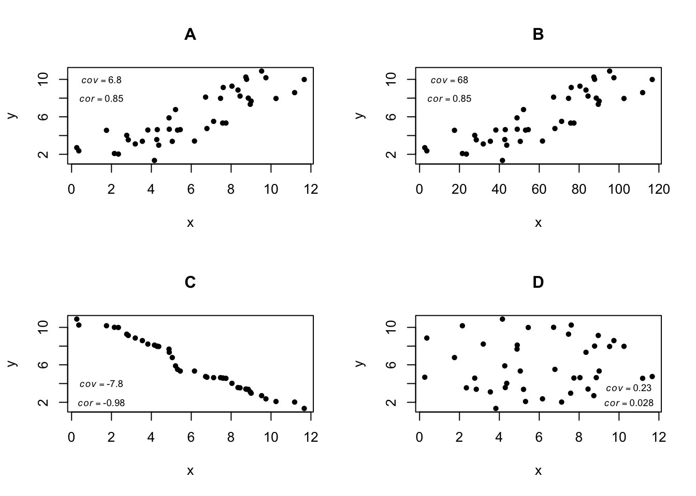
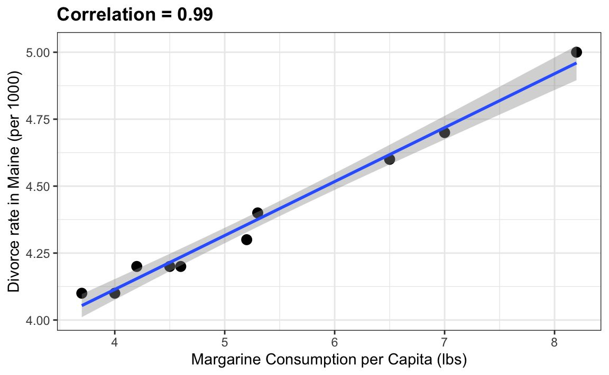
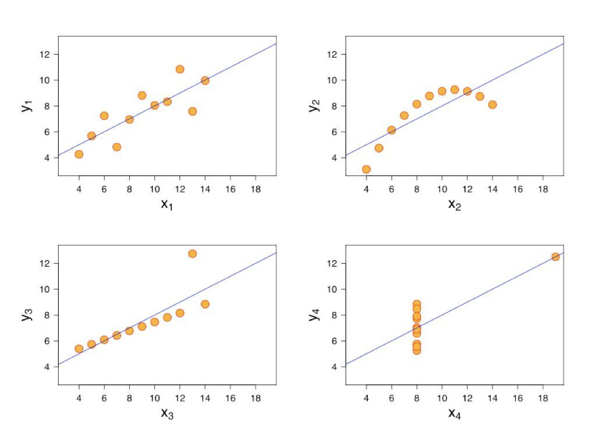
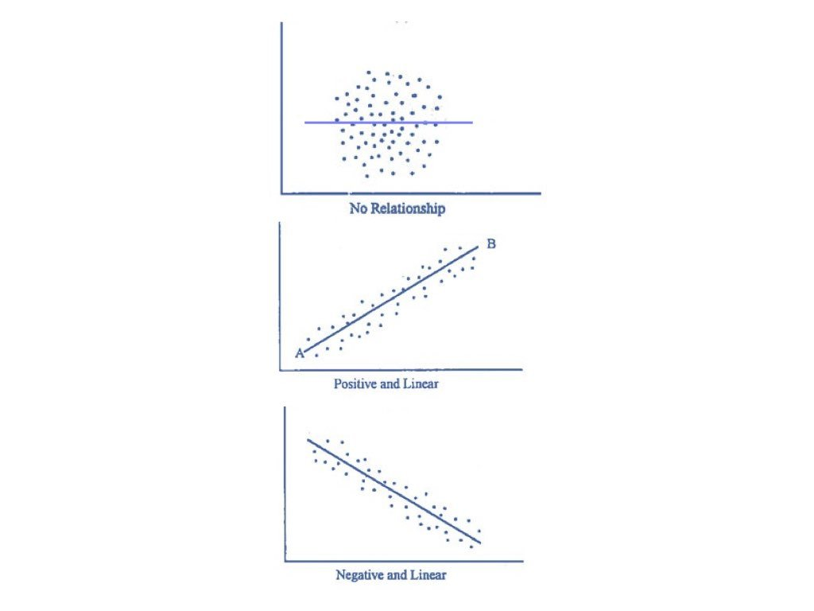
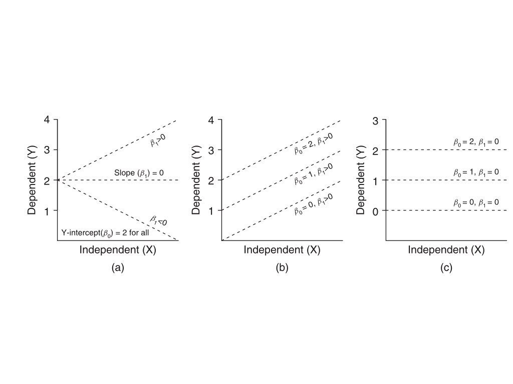

```{r}
#| label: setup
#| include: false

# Core data manipulation and visualization
library(tidyverse)
library(knitr)
library(readxl)

# Statistical analysis packages
library(MASS)        # LDA, robust regression
library(pwr)         # Power analysis
library(boot)        # Bootstrap methods
library(car)         # Companion to Applied Regression
library(survival)    # Survival analysis
library(nlme)        # Mixed effects models
library(broom)       # Tidy model output
library(emmeans)     # Estimated marginal means

# Set consistent theme for all plots
theme_set(theme_minimal(base_size = 14))

# Set seed for reproducibility
set.seed(2026)
```

# Week 4: Frequency and Contingency Analyses, Correlation and Covariance {background-color="#2c3e50"}

## Week 4 Topics

::: incremental
-   Frequency analyses
-   Contingency tests
-   Non-parametric tests
-   Correlation and Covariance
-   Next week - linear models!
:::

::: callout-note
**Readings:** Chapters 18-19 **HW2 Assigned on Wednesday, due next week**
:::

## Packages for This Week

```{r}
#| eval: false
#| echo: true

# Install new packages (run once)
install.packages(c("epitools", "DescTools", "pwr"))

# Load packages
library(tidyverse)    # Data manipulation & visualization
library(epitools)     # Epidemiological tools (odds ratios, risk ratios)
library(DescTools)    # Descriptive statistics & tests (G-test, Cramer's V)
library(pwr)          # Power analysis for study design
```

::: callout-tip
**epitools** is essential for 2×2 contingency table analyses in epidemiology and clinical research.
:::

# Chi-Square Tests {background-color="#2c3e50"}

## The Chi-Square Distribution

If $Z_1, Z_2, ..., Z_k$ are independent standard normal variables:

:::: panel-tabset
### Equation

$$\chi^2_k = \sum_{i=1}^k Z_i^2$$

### LaTeX

``` text
\chi^2_k = \sum_{i=1}^k Z_i^2
```
:::

**Properties:**

-   Domain: $x \in [0, \infty)$
-   Mean: $k$
-   Variance: $2k$
-   Right-skewed

## Chi-Square Distribution

:::: panel-tabset
### Output

```{r}
#| label: chi-square-plot-output
#| echo: false
#| eval: true
#| fig-width: 8
#| fig-height: 4

df_vals <- c(1, 2, 5, 10)
x <- seq(0, 30, length.out = 300)
colors <- c("red", "blue", "green", "purple")

plot(x, dchisq(x, df = 1), type = "l", lwd = 2, col = colors[1],
     ylim = c(0, 0.5), ylab = "Density", main = "Chi-square Distribution")
for(i in 2:4) {
  lines(x, dchisq(x, df = df_vals[i]), lwd = 2, col = colors[i])
}
legend("topright", paste("df =", df_vals), col = colors, lwd = 2)
```

### Code

```{r}
#| label: chi-square-plot-code
#| echo: true
#| eval: false

df_vals <- c(1, 2, 5, 10)
x <- seq(0, 30, length.out = 300)
colors <- c("red", "blue", "green", "purple")

plot(x, dchisq(x, df = 1), type = "l", lwd = 2, col = colors[1],
     ylim = c(0, 0.5), ylab = "Density", main = "Chi-square Distribution")
for(i in 2:4) {
  lines(x, dchisq(x, df = df_vals[i]), lwd = 2, col = colors[i])
}
legend("topright", paste("df =", df_vals), col = colors, lwd = 2)
```
:::

## Chi-Square Test Statistic

:::: panel-tabset
### Equation

$$\chi^2 = \sum \frac{(O_i - E_i)^2}{E_i}$$

### LaTeX

``` text
\chi^2 = \sum \frac{(O_i - E_i)^2}{E_i}
```
:::

Where:

-   $O_i$ = Observed frequency
-   $E_i$ = Expected frequency

Degrees of freedom: $df = k - 1$ (goodness-of-fit)

## When to Use Chi-Square Tests

-   **Goodness-of-fit test**: Does observed data match expected proportions?
-   **Test of independence**: Are two categorical variables related?
-   **Test of homogeneity**: Do different groups have the same distribution?

## Assumptions

-   Data are **counts** (not percentages or proportions)
-   Categories are **mutually exclusive**
-   Expected count in each category **should be ≥ 5**

## Goodness-of-Fit Test

Tests whether observed frequencies match expected proportions.

:::: panel-tabset
### Output

```{r}
#| label: gof-test-output
#| echo: false
#| eval: true

# Mendelian 3:1 ratio
observed <- c(Dominant = 72, Recessive = 28)
expected_probs <- c(0.75, 0.25)

chisq.test(x = observed, p = expected_probs)
```

### Code

```{r}
#| label: gof-test-code
#| echo: true
#| eval: false

# Mendelian 3:1 ratio
observed <- c(Dominant = 72, Recessive = 28)
expected_probs <- c(0.75, 0.25)

chisq.test(x = observed, p = expected_probs)
```
:::

## Goodness-of-Fit: Dice Example

:::: panel-tabset
### Output

```{r}
#| label: dice-gof-output
#| echo: false
#| eval: true

# Rolling a six-sided die 60 times
observed <- c(8, 9, 10, 12, 11, 10)
expected_probs <- rep(1/6, 6)

chisq.test(x = observed, p = expected_probs)
```

### Code

```{r}
#| label: dice-gof-code
#| echo: true
#| eval: false

# Rolling a six-sided die 60 times
observed <- c(8, 9, 10, 12, 11, 10)
expected_probs <- rep(1/6, 6)

chisq.test(x = observed, p = expected_probs)
```
:::

## Test of Independence

Tests whether two categorical variables are related.

:::: panel-tabset
### Output

```{r}
#| label: independence-test-output
#| echo: false
#| eval: true

# Create contingency table
tbl <- matrix(c(50, 10, 20, 40), nrow = 2, byrow = TRUE)
rownames(tbl) <- c("Group1", "Group2")
colnames(tbl) <- c("Outcome1", "Outcome2")

chisq.test(tbl)
```

### Code

```{r}
#| label: independence-test-code
#| echo: true
#| eval: false

# Create contingency table
tbl <- matrix(c(50, 10, 20, 40), nrow = 2, byrow = TRUE)
rownames(tbl) <- c("Group1", "Group2")
colnames(tbl) <- c("Outcome1", "Outcome2")

chisq.test(tbl)
```
:::

## Mosaic Plot

:::: panel-tabset
### Output

```{r}
#| label: mosaic-plot-output
#| echo: false
#| eval: true
#| fig-width: 6
#| fig-height: 5

mosaicplot(tbl,
           main = "Mosaic Plot of Contingency Table",
           xlab = "Group",
           ylab = "Outcome",
           color = TRUE)
```

### Code

```{r}
#| label: mosaic-plot-code
#| echo: true
#| eval: false

mosaicplot(tbl,
           main = "Mosaic Plot of Contingency Table",
           xlab = "Group",
           ylab = "Outcome",
           color = TRUE)
```
:::

## Cramér's V

Effect size for chi-square test:

:::: panel-tabset
### Equation

$$V = \sqrt{\frac{\chi^2}{n(k-1)}}$$

### LaTeX

``` text
V = \sqrt{\frac{\chi^2}{n(k-1)}}
```
:::

| V   | Interpretation |
|:----|:---------------|
| 0.1 | Small effect   |
| 0.3 | Medium effect  |
| 0.5 | Large effect   |

## Calculating Cramér's V in R

:::: panel-tabset
### Output

```{r}
#| label: cramers-v-output
#| echo: false
#| eval: true

# Chi-square test of independence
test <- chisq.test(tbl)

# Extract test statistic
chisq_val <- test$statistic

# Total number of observations
n <- sum(tbl)

# Minimum of (rows, columns) for Cramér's V formula
k <- min(nrow(tbl), ncol(tbl))

# Cramér's V calculation
cramers_v <- sqrt(chisq_val / (n * (k - 1)))

cat("Cramér's V:", round(cramers_v, 3))
```

### Code

```{r}
#| label: cramers-v-code
#| echo: true
#| eval: false

# Chi-square test of independence
test <- chisq.test(tbl)

# Extract test statistic
chisq_val <- test$statistic

# Total number of observations
n <- sum(tbl)

# Minimum of (rows, columns) for Cramér's V formula
k <- min(nrow(tbl), ncol(tbl))

# Cramér's V calculation
cramers_v <- sqrt(chisq_val / (n * (k - 1)))

cat("Cramér's V:", round(cramers_v, 3))
```
:::

## Fisher's Exact Test

Use when:

-   Sample sizes are small
-   Expected frequencies \< 5

:::: panel-tabset
### Output

```{r}
#| label: fisher-test-output
#| echo: false
#| eval: true

beverage_table <- matrix(c(8, 2, 1, 9), nrow = 2, byrow = TRUE)
rownames(beverage_table) <- c("American", "English")
colnames(beverage_table) <- c("Coffee", "Tea")

fisher.test(beverage_table)
```

### Code

```{r}
#| label: fisher-test-code
#| echo: true
#| eval: false

beverage_table <- matrix(c(8, 2, 1, 9), nrow = 2, byrow = TRUE)
rownames(beverage_table) <- c("American", "English")
colnames(beverage_table) <- c("Coffee", "Tea")

fisher.test(beverage_table)
```
:::

## Odds Ratios

Compares odds of an event between two groups:

-   **OR = 1**: No association
-   **OR \> 1**: Group 1 has higher odds
-   **OR \< 1**: Group 1 has lower odds

**Example:**

-   Odds (Americans prefer Coffee) = $\frac{8}{2} = 4$

-   Odds (English prefer Coffee) = $\frac{1}{9} ≈ 0.111$

-   **Odds Ratio** = $\frac{4}{0.111} ≈ 36$

::: callout-note
The chi-square test tells us **whether** there is a difference, but the odds ratio tells us the **effect size** - how much more likely one outcome is compared to another.
:::

## Calculating Odds Ratio in R

```{r}
#| eval: false
#| echo: true

# Fisher's test returns odds ratio automatically
fisher_result <- fisher.test(beverage_table)
fisher_result$estimate  # Odds ratio

# 95% confidence interval for odds ratio
fisher_result$conf.int

# For larger tables, can use epitools package
# install.packages("epitools")
library(epitools)
oddsratio(beverage_table)
```

## G-Test (Log-Likelihood Ratio Test)

An alternative to chi-square based on log-likelihood ratios:

-   Better when sample sizes are small
-   Better when differences between observed & expected are small
-   Follows chi-square distribution

```{r}
#| eval: false
#| echo: true

library(DescTools)

# G-test for goodness of fit
observed <- c(161, 38, 53, 6)
expected_ratio <- c(9/16, 3/16, 3/16, 1/16)
GTest(observed, p = expected_ratio)

# G-test for independence
GTest(contingency_table)
```

## R Exercise: Chi-Square and Contingency Analysis

::: callout-tip
## Exercise

A researcher studies the relationship between antibiotic treatment and bacterial clearance:

|             | Cleared | Not Cleared |
|-------------|---------|-------------|
| Treatment A | 45      | 15          |
| Treatment B | 30      | 30          |
| Control     | 20      | 40          |

1.  Create the contingency table in R
2.  Perform chi-square test of independence
3.  Calculate Cramér's V effect size
4.  Interpret: Is treatment associated with clearance?

```{r}
#| eval: false
#| echo: true

# Starter code
bacteria <- matrix(c(45, 15, 30, 30, 20, 40),
                   nrow = 3, byrow = TRUE,
                   dimnames = list(
                     Treatment = c("A", "B", "Control"),
                     Outcome = c("Cleared", "Not Cleared")))

# Your analysis here...
```
:::

# Relationship between two continuous variables

## Covariance and Correlation

-   Simple but useful measures of association between two or more continuous variables
-   Covariance is the shared variance and scales with the variance of the variables
-   Correlcation is a standardized covariance to put the values on a common scale
-   Both are useful but suboptimal compared to linear models.

## Covariance and Correlation

**Covariance** Measures how two variables vary together:

:::: panel-tabset
### Equation

$$Cov(X,Y) = \frac{\sum(x_i - \bar{x})(y_i - \bar{y})}{n-1}$$

### LaTeX

``` text
Cov(X,Y) = \frac{\sum(x_i - \bar{x})(y_i - \bar{y})}{n-1}
```
:::

**Correlation** does the same thing but is a standardized covariance (ranges from -1 to 1):

:::: panel-tabset
### Equation

$$r = \frac{Cov(X,Y)}{s_x \cdot s_y}$$

### LaTeX

``` text
r = \frac{Cov(X,Y)}{s_x \cdot s_y}
```
:::

-   Positive: variables increase together
-   Negative: one increases as other decreases
-   Zero: no linear relationship

## Covariance and Correlation

{fig-align="center" width="60%"}

## Visualizing Different Correlations in R

:::: panel-tabset
### Output

```{r}
#| label: fig-correlation-examples-figure
#| fig-cap: "Different correlation strengths and directions"
#| fig-width: 10
#| fig-height: 4
#| echo: false
#| eval: true

par(mfrow = c(1, 4))
set.seed(123)
n <- 100

# Function to generate correlated data
make_corr_data <- function(r, n = 100) {
  x <- rnorm(n)
  y <- r * x + sqrt(1 - r^2) * rnorm(n)
  data.frame(x = x, y = y)
}

correlations <- c(-0.9, -0.3, 0.3, 0.9)
for(r in correlations) {
  d <- make_corr_data(r)
  plot(d$x, d$y, pch = 19, col = rgb(0.2, 0.4, 0.8, 0.5),
       main = paste("r =", r), xlab = "X", ylab = "Y")
  abline(lm(y ~ x, d), col = "red", lwd = 2)
}
```

### Code

```{r}
#| label: fig-correlation-examples-code
#| fig-cap: "Different correlation strengths and directions"
#| fig-width: 10
#| fig-height: 4
#| echo: true
#| eval: false

par(mfrow = c(1, 4))
set.seed(123)
n <- 100

# Function to generate correlated data
make_corr_data <- function(r, n = 100) {
  x <- rnorm(n)
  y <- r * x + sqrt(1 - r^2) * rnorm(n)
  data.frame(x = x, y = y)
}

correlations <- c(-0.9, -0.3, 0.3, 0.9)
for(r in correlations) {
  d <- make_corr_data(r)
  plot(d$x, d$y, pch = 19, col = rgb(0.2, 0.4, 0.8, 0.5),
       main = paste("r =", r), xlab = "X", ylab = "Y")
  abline(lm(y ~ x, d), col = "red", lwd = 2)
}
```
:::

## Calculating Correlations in R

### Pearson Correlation Value

:::: panel-tabset
### Output

```{r}
#| label: cor-example-1-output
#| echo: false
#| eval: true

# Using built-in mtcars dataset
cor(mtcars$mpg, mtcars$wt)  # Pearson correlation
```

### Code

```{r}
#| label: cor-example-1-code
#| echo: true
#| eval: false

# Using built-in mtcars dataset
cor(mtcars$mpg, mtcars$wt)  # Pearson correlation
```
:::

\
\
\

### Pearson Product-Moment Test of Correlation

:::: panel-tabset
### Output

```{r}
#| label: cor-example-2-output
#| echo: false
#| eval: true

# Test significance
cor.test(mtcars$mpg, mtcars$wt)
```

### Code

```{r}
#| label: cor-example-2-code
#| echo: true
#| eval: false

# Test significance
cor.test(mtcars$mpg, mtcars$wt)
```
:::

## Parametric vs. Nonparametric Correlation

| Test     | Use When                         | R Function                    |
|:---------|:---------------------------------|:------------------------------|
| Pearson  | Linear relationship, normal data | `cor.test(method="pearson")`  |
| Spearman | Monotonic relationship, n \< 30  | `cor.test(method="spearman")` |
| Kendall  | Monotonic relationship, n ≥ 30   | `cor.test(method="kendall")`  |

# Challenges of only using correlation

## Correlation vs. Causation

**Warning**: Correlation does NOT imply causation without randomization!

{fig-align="center" width="80%"}

## Anscombe's Quartet

{fig-align="center" width="90%"}

All four datasets have identical: mean of x (9), variance of x (11), mean of y (7.5), correlation (0.816), and regression line ($y = 3.00 + 0.50x$).

## In-Class Demo: Anscombe's Quartet in R

:::: panel-tabset
### Output

```{r}
#| label: anscombe-output
#| echo: false
#| eval: true
#| fig-width: 10
#| fig-height: 4

# Built-in anscombe dataset
data(anscombe)

par(mfrow = c(1, 4))
for(i in 1:4) {
  x <- anscombe[, i]; y <- anscombe[, i + 4]
  plot(x, y, pch = 19, col = "steelblue", main = paste("Dataset", i),
       xlim = c(3, 20), ylim = c(3, 13))
  abline(lm(y ~ x), col = "red", lwd = 2)
}
```

### Code

```{r}
#| label: anscombe-code
#| echo: true
#| eval: false

# Built-in anscombe dataset
data(anscombe)

# All four have identical summary statistics!
cat("Dataset 1 - cor:", round(cor(anscombe$x1, anscombe$y1), 3),
    "| Dataset 2 - cor:", round(cor(anscombe$x2, anscombe$y2), 3),
    "\nDataset 3 - cor:", round(cor(anscombe$x3, anscombe$y3), 3),
    "| Dataset 4 - cor:", round(cor(anscombe$x4, anscombe$y4), 3))

par(mfrow = c(1, 4))
for(i in 1:4) {
  x <- anscombe[, i]; y <- anscombe[, i + 4]
  plot(x, y, pch = 19, col = "steelblue", main = paste("Dataset", i),
       xlim = c(3, 20), ylim = c(3, 13))
  abline(lm(y ~ x), col = "red", lwd = 2)
}
```
:::

::: callout-warning
**Always visualize your data!** Summary statistics can hide important patterns.
:::

------------------------------------------------------------------------

# Simple Linear Regression {background-color="#2c3e50"}

## What is a Linear Model?

:::: panel-tabset
### Equation

$$y_i = \beta_0 + \beta_1 x_i + \epsilon_i$$

### LaTeX

``` text
y_i = \beta_0 + \beta_1 x_i + \epsilon_i
```
:::

-   $\beta_0$: intercept
-   $\beta_1$: slope
-   $\epsilon_i$: error/residual

## What is a Linear Model?

$$y_i = \beta_0 + \beta_1 x_i + \epsilon_i$$

-   $\beta_0$: intercept
-   $\beta_1$: slope
-   $\epsilon_i$: error/residual

{fig-align="center" width="100%"}

## 

{fig-align="center" width="90%"}

## 

{fig-align="center" width="90%"}

## Many Methods Are Linear Models

-   Simple linear regression
-   Multiple regression
-   ANOVA (single and multi-factor)
-   ANCOVA
-   Repeated-measures ANOVA

## Classes of Linear Models

| Abbreviation       | Name                       | Description                  |
|:-------------------|:---------------------------|:-----------------------------|
| **GLM**            | General Linear Model       | Continuous variables         |
| **GLMM**           | General Linear Mixed Model | Mixed continuous/categorical |
| **Generalized LM** | Generalized Linear Model   | Non-normal response          |
| **GAM**            | Generalized Additive Model | Non-linear relationships     |

## Linear Models in R

```{r}
#| eval: false
#| echo: true

# Include intercept (default)
Y ~ X
Y ~ 1 + X

# Exclude intercept
Y ~ -1 + X
Y ~ X - 1

# Fit and examine model
my_lm <- lm(Y ~ X, data = mydata)
summary(my_lm)
```

## Linear Regression Example

:::: panel-tabset
### Output

```{r}
#| label: lm-example-output
#| echo: false
#| eval: true
#| fig-width: 8
#| fig-height: 4

set.seed(123)
x <- runif(50, 0, 10)
y <- 2 + 1.5*x + rnorm(50, 0, 2)

my_lm <- lm(y ~ x)
plot(x, y, pch = 19, col = "steelblue")
abline(my_lm, col = "red", lwd = 2)
```

### Code

```{r}
#| label: lm-example-code
#| echo: true
#| eval: false

set.seed(123)
x <- runif(50, 0, 10)
y <- 2 + 1.5*x + rnorm(50, 0, 2)

my_lm <- lm(y ~ x)
plot(x, y, pch = 19, col = "steelblue")
abline(my_lm, col = "red", lwd = 2)
```
:::
