# Week 5: Linear Models {background-color="#2c3e50"}

## Week 5 Topics

::: incremental
-   Ordinary Linear Models (OLMs)
-   Simple linear regression
-   Loss function - sum of squared error (SSE and MSE)
-   Residual analysis to test assumptions
-   The eugenics origin of linear models
:::

::: callout-note
**Readings:** Chapters 21-24

**HW2 Due this week - on Thursday**
:::

## Packages for This Week

```{r}
#| eval: false
#| echo: true

# Install new packages (run once)
install.packages(c("ggfortify", "lmodel2"))

# Load packages
library(tidyverse)    # Data manipulation & visualization
library(ggfortify)    # ggplot2 extensions for model diagnostics
library(lmodel2)      # Model II regression (when X and Y both have error)
library(broom)
library(knitr)
```

# Linear Models {background-color="#2c3e50"}

## Classes of Linear Models

| Abbreviation       | Name                       | Description                  |
|:------------------|:-------------------------|:---------------------------|
| **GLM**            | General Linear Model       | Continuous variables         |
| **GLMM**           | General Linear Mixed Model | Mixed continuous/categorical |
| **Generalized LM** | Generalized Linear Model   | Non-normal response          |
| **GAM**            | Generalized Additive Model | Non-linear relationships     |

## What is a Ordinary Linear Model?

An ordinary linear model describes the relationship between a continuous response variable $y$ and one or more predictor variables $x$. In its simplest form with one predictor, the model is:

::: panel-tabset
### Equation

$$y_i = \beta_0 + \beta_1 x_i + \epsilon_i$$

### LaTeX

``` text
y_i = \beta_0 + \beta_1 x_i + \epsilon_i
```
:::

where:

-   $\beta_0$: intercept — the expected value of $y$ when $x = 0$
-   $\beta_1$: slope — the expected change in $y$ for a one-unit increase in $x$
-   $\epsilon_i$: error/residual — the deviation of observation $i$ from the fitted line

The goal of fitting a linear model is to estimate $\beta_0$ and $\beta_1$ from our data.

## Simple Linear Regression Example

::: panel-tabset
### Output

```{r}
#| label: lm-example-output
#| echo: false
#| eval: true
#| fig-width: 8
#| fig-height: 4

# This part of the code creates two variables, one with random error that is normally distributed
set.seed(123)
x <- runif(50, 0, 10)
y <- 2 + 1.5*x + rnorm(50, 0, 2)

# This part of the code is fitting the model, plotting the points and the best fit line
my_lm <- lm(y ~ x)
plot(x, y, pch = 19, col = "steelblue")
abline(my_lm, col = "red", lwd = 2)
```

### Code

```{r}
#| label: lm-example-code
#| echo: true
#| eval: false

# This part of the code creates two variables, one with random error that is normally distributed
set.seed(123)
x <- runif(50, 0, 10)
y <- 2 + 1.5*x + rnorm(50, 0, 2)

# This part of the code is fitting the model, plotting the points and the best fit line
my_lm <- lm(y ~ x)
plot(x, y, pch = 19, col = "steelblue")
abline(my_lm, col = "red", lwd = 2)
```
:::

## 

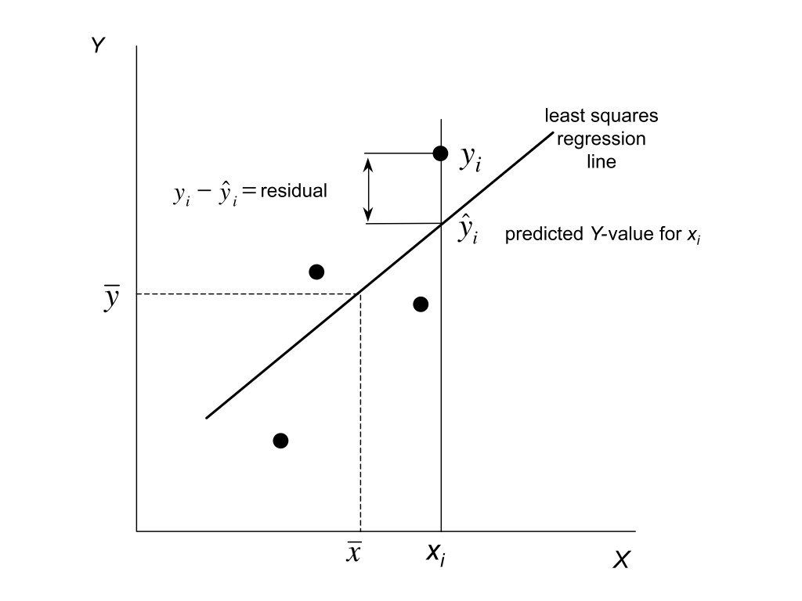{fig-align="center" width="90%"}

## DRAFT: Residuals and Least Squares

```{r}
#| echo: false
#| eval: true
#| fig-width: 7
#| fig-height: 6

set.seed(42)
x <- c(2, 3, 3.5, 5, 5.5)
y <- c(2, 4.5, 3, 5.5, 4.5)
fit <- lm(y ~ x)
pred <- predict(fit)
x_bar <- mean(x); y_bar <- mean(y)

plot(x, y, pch = 16, cex = 2, xlim = c(0, 7), ylim = c(0, 7),
     xlab = "X", ylab = "Y", las = 1, cex.lab = 1.5)
abline(fit, lwd = 3)

# Show residual for point 4
i <- 4
segments(x[i], pred[i], x[i], y[i], lwd = 3, col = "black")
rect(x[i] - 0.15, pred[i], x[i] + 0.15, pred[i] + 0.15, border = "black", lwd = 2)
text(x[i] + 0.6, y[i], bquote(y[i]), cex = 1.4, font = 3)
text(x[i] + 0.6, pred[i], bquote(hat(y)[i]), cex = 1.4, font = 3)
text(x[i] - 1.2, (y[i] + pred[i]) / 2,
     bquote(y[i] - hat(y)[i] == "residual"), cex = 1.1, font = 3)

# Show x_bar, y_bar
abline(h = y_bar, lty = 2, col = "gray50")
abline(v = x_bar, lty = 2, col = "gray50")
text(x_bar, 0.3, expression(bar(x)), cex = 1.3, font = 3)
text(0.3, y_bar, expression(bar(y)), cex = 1.3, font = 3)

# Label regression line
text(6.2, predict(fit, newdata = data.frame(x = 6.2)) + 0.5,
     "least squares\nregression\nline", cex = 1.0, adj = 0)
text(x[i] + 0.3, pred[i] - 0.3, expression("predicted Y-value for " * x[i]),
     cex = 0.9, adj = 0)
```

##

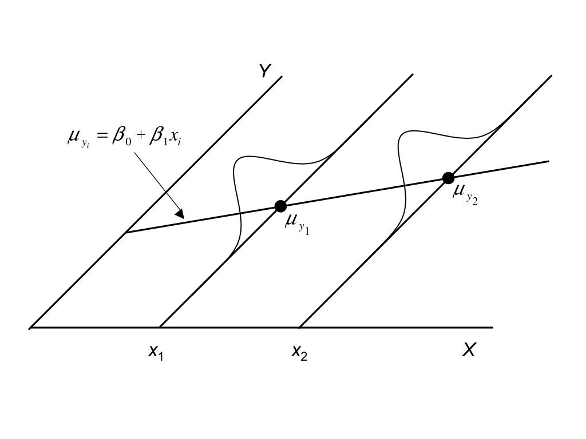{fig-align="center" width="90%"}

## DRAFT: Regression Conditional Distributions

```{r}
#| echo: false
#| eval: true
#| fig-width: 8
#| fig-height: 6

# Show regression line with normal distributions at two x values
plot(NULL, xlim = c(0, 10), ylim = c(0, 12),
     xlab = "X", ylab = "Y", las = 1, cex.lab = 1.5, axes = FALSE)
axis(1, at = c(3, 7), labels = c(expression(x[1]), expression(x[2])), cex.axis = 1.3)
axis(2, labels = FALSE)

# Regression line
abline(a = 2, b = 1, lwd = 3)
# Confidence band
abline(a = 0.5, b = 1, lwd = 1, lty = 1)
abline(a = 3.5, b = 1, lwd = 1, lty = 1)

# Normal distributions at x1 = 3 and x2 = 7
for (xi in c(3, 7)) {
  mu_y <- 2 + xi
  y_seq <- seq(mu_y - 3, mu_y + 3, length.out = 100)
  dens <- dnorm(y_seq, mean = mu_y, sd = 1)
  lines(xi + dens * 4, y_seq, lwd = 2)
  points(xi, mu_y, pch = 16, cex = 1.5)
}
text(3.5, 5, expression(mu[y[1]]), cex = 1.3)
text(7.5, 9, expression(mu[y[2]]), cex = 1.3)
text(2, 10, expression(mu[y[i]] == beta[0] + beta[1] * x[i]),
     cex = 1.3)
```

## Hypothesis Tests in Regression

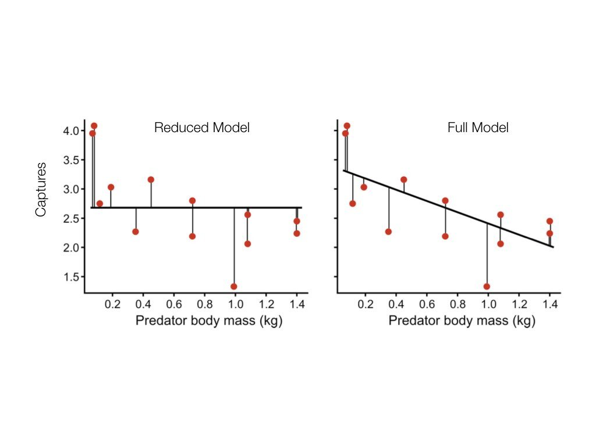{fig-align="center" width="90%"}

## DRAFT: Reduced vs Full Model Residuals

```{r}
#| echo: false
#| eval: true
#| fig-width: 10
#| fig-height: 5

set.seed(42)
x <- seq(0.1, 1.4, length.out = 15)
y <- 3.2 - 0.7 * x + rnorm(15, 0, 0.4)

par(mfrow = c(1, 2), mar = c(5, 4, 3, 1))

# Reduced model (mean only)
plot(x, y, pch = 16, col = "red", cex = 1.5,
     xlab = "Predator body mass (kg)", ylab = "Captures",
     main = "Reduced Model", ylim = c(1, 4.2), las = 1)
abline(h = mean(y), lwd = 2)
segments(x, mean(y), x, y, lwd = 1)

# Full model (regression)
plot(x, y, pch = 16, col = "red", cex = 1.5,
     xlab = "Predator body mass (kg)", ylab = "Captures",
     main = "Full Model", ylim = c(1, 4.2), las = 1)
fit <- lm(y ~ x)
abline(fit, lwd = 2)
segments(x, predict(fit), x, y, lwd = 1)
```

## Hypothesis Tests in Regression

::: panel-tabset
### Equation

$$H_0: \beta_1 = 0 \quad \text{(no relationship)}$$ $$H_A: \beta_1 \neq 0 \quad \text{(relationship exists)}$$

### LaTeX

``` text
H_0: \beta_1 = 0 \quad \text{(no relationship)}
H_A: \beta_1 \neq 0 \quad \text{(relationship exists)}
```
:::

Compares:

-   Reduced model: $y_i = \beta_0 + \epsilon_i$
-   Full model: $y_i = \beta_0 + \beta_1 x_i + \epsilon_i$

## Sum of Squares

| Term         | Description                    |
|:-------------|:-------------------------------|
| $SS_{Total}$ | Total variability in data      |
| $SS_{Model}$ | Variability explained by model |
| $SS_{Error}$ | Unexplained variability        |

::: panel-tabset
### Equation

$$SS_{Total} = SS_{Model} + SS_{Error}$$

### LaTeX

``` text
SS_{Total} = SS_{Model} + SS_{Error}
```
:::

## The Loss Function: Minimizing Error

Linear regression finds the line of best fit by minimizing the **sum of squared errors (SSE)**. For each observation, the residual is the difference between the observed and predicted value:

::: panel-tabset
### Equation

$$e_i = y_i - \hat{y}_i = y_i - (\hat{\beta}_0 + \hat{\beta}_1 x_i)$$

### LaTeX

``` text
e_i = y_i - \hat{y}_i = y_i - (\hat{\beta}_0 + \hat{\beta}_1 x_i)
```
:::

The SSE is the total squared deviation of all observations from the fitted line:

::: panel-tabset
### Equation

$$SSE = \sum_{i=1}^{n} e_i^2 = \sum_{i=1}^{n} (y_i - \hat{y}_i)^2$$

### LaTeX

``` text
SSE = \sum_{i=1}^{n} e_i^2 = \sum_{i=1}^{n} (y_i - \hat{y}_i)^2
```
:::

The **mean squared error (MSE)** normalizes by degrees of freedom:

::: panel-tabset
### Equation

$$MSE = \frac{SSE}{n - p}$$

### LaTeX

``` text
MSE = \frac{SSE}{n - p}
```
:::

where $p$ is the number of parameters estimated (2 for simple linear regression: intercept and slope). Ordinary Least Squares (OLS) is the method that finds the values of $\hat{\beta}_0$ and $\hat{\beta}_1$ that minimize the SSE.

## Hypothesis Tests in Regression

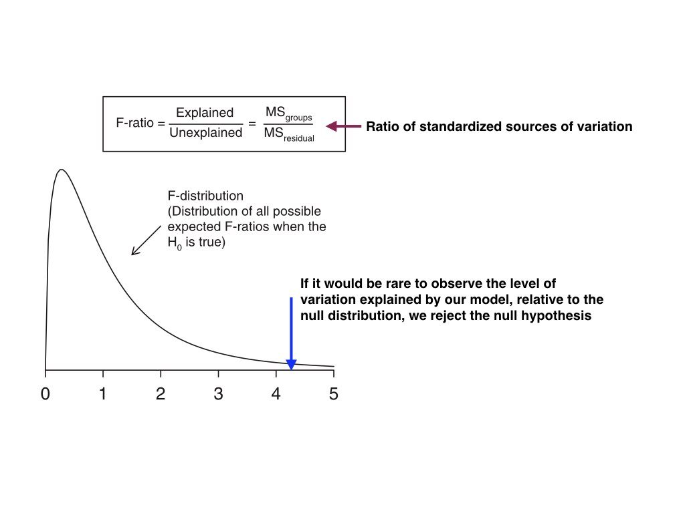{fig-align="center" width="90%"}

## DRAFT: F-Ratio and the F-Distribution

$$\text{F-ratio} = \frac{\text{Explained}}{\text{Unexplained}} = \frac{MS_{groups}}{MS_{residual}}$$

**Ratio of standardized sources of variation**

```{r}
#| echo: false
#| eval: true
#| fig-width: 7
#| fig-height: 4

x <- seq(0.01, 6, length.out = 500)
plot(x, df(x, df1 = 3, df2 = 20), type = "l", lwd = 3,
     xlab = "", ylab = "", axes = FALSE,
     ylim = c(0, 0.8))
axis(1, at = 0:5, cex.axis = 1.3)

# Mark observed F value
abline(v = 4.2, col = "blue", lwd = 3)
arrows(4.2, 0.35, 4.2, 0.02, col = "blue", lwd = 3, length = 0.15)

text(2, 0.5, "F-distribution\n(Distribution of all possible\nexpected F-ratios when the\nH₀ is true)", cex = 1.0)
text(4.8, 0.45, "If it would be rare to observe\nthe level of variation explained\nby our model, relative to the\nnull distribution, we reject\nthe null hypothesis",
     cex = 0.85, col = "blue", font = 2)
```

## R² as Measure of Fit (\~ effect size)

::: panel-tabset
### Equation

$$R^2 = \frac{SS_{Model}}{SS_{Total}} = 1 - \frac{SS_{Error}}{SS_{Total}}$$

### LaTeX

``` text
R^2 = \frac{SS_{Model}}{SS_{Total}} = 1 - \frac{SS_{Error}}{SS_{Total}}
```
:::

$R^2$ is the proportion of variance in Y explained by X. It ranges from 0 (model explains none of the variance) to 1 (model explains all of the variance). For simple linear regression, $R^2$ equals the square of the Pearson correlation coefficient $r$.

::: callout-note
A high $R^2$ does not necessarily mean the model is appropriate — always check residual diagnostics!
:::

## Components of an lm Object

When you fit a model with `lm()`, R stores many useful components in the returned object:

| Component | Description | Accessor Function |
|:-----------------------|:-----------------------|:-----------------------|
| `coefficients` | Estimated $\beta$ values | `coef()` |
| `residuals` | Observed minus fitted values ($y_i - \hat{y}_i$) | `residuals()` or `resid()` |
| `fitted.values` | Predicted values ($\hat{y}_i$) | `fitted()` |
| `rank` | Rank of the design matrix | — |
| `df.residual` | Residual degrees of freedom | `df.residual()` |
| `call` | The original function call | — |
| `terms` | The model formula terms | — |
| `model` | The data frame used for fitting | `model.frame()` |
| `qr` | QR decomposition of design matrix | — |
| `effects` | Orthogonal effects | — |

## Extracting Model Information

```{r}
#| label: lm-extract-1
#| echo: true

# View all components
names(my_lm)

# Access individual components
my_lm$coefficients
my_lm$residuals
```

## Extracting Model Information

```{r}
#| label: lm-extract-3
#| echo: true

# Confidence intervals
confint(my_lm)
```

## Extracting Model Information

```{r}
#| label: lm-extract-4
#| echo: true

# Make predictions
predict(my_lm, data.frame(x = c(2, 5, 8)), interval = "confidence")
```

------------------------------------------------------------------------

# Subgroups in simple linear regression

## Simpson's Paradox

A trend that appears in groups can disappear or reverse when groups are combined.

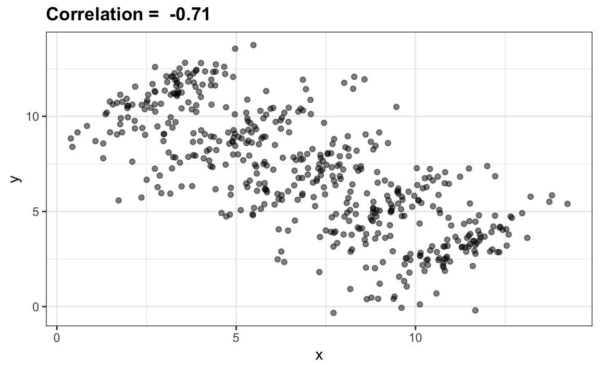{fig-align="center" width="80%"}

## DRAFT: Simpson's Paradox

```{r}
#| echo: false
#| eval: true
#| fig-width: 8
#| fig-height: 5

library(ggplot2)
set.seed(42)
groups <- 5
n_per <- 100
z <- rep(1:groups, each = n_per)
x <- z * 2.5 + rnorm(groups * n_per, 0, 1.2)
y <- -0.7 * x + z * 4 + rnorm(groups * n_per, 0, 1)

df <- data.frame(x = x, y = y, z = factor(z))

ggplot(df, aes(x, y)) +
  geom_point(alpha = 0.5, color = "gray40") +
  geom_smooth(method = "lm", se = FALSE, color = "black", linewidth = 1) +
  labs(title = paste("Correlation =", round(cor(x, y), 2)),
       x = "x", y = "y") +
  theme_bw(base_size = 16) +
  theme(plot.title = element_text(face = "bold", size = 18))
```

## Simpson's Paradox Explained

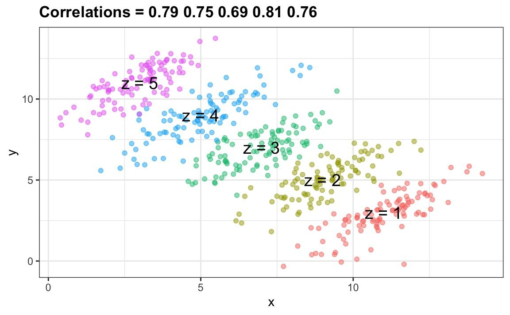{fig-align="center" width="80%"}

## DRAFT: Simpson's Paradox Explained

```{r}
#| echo: false
#| eval: true
#| fig-width: 8
#| fig-height: 5

library(ggplot2)
set.seed(42)
groups <- 5
n_per <- 100
z <- rep(1:groups, each = n_per)
x <- z * 2.5 + rnorm(groups * n_per, 0, 1.2)
y <- -0.7 * x + z * 4 + rnorm(groups * n_per, 0, 1)

df <- data.frame(x = x, y = y, z = factor(z))
cors <- sapply(split(df, df$z), function(d) round(cor(d$x, d$y), 2))

ggplot(df, aes(x, y, color = z)) +
  geom_point(alpha = 0.5) +
  geom_smooth(method = "lm", se = FALSE, linewidth = 1) +
  labs(title = paste("Correlations =", paste(cors, collapse = " ")),
       x = "x", y = "y") +
  scale_color_brewer(palette = "Set1", labels = paste("z =", 1:5)) +
  theme_bw(base_size = 16) +
  theme(plot.title = element_text(face = "bold", size = 16))
```

## In-Class Demo: Simpson's Paradox with Iris Data

::: panel-tabset
### Output

```{r}
#| label: simpsons-paradox-output
#| echo: false
#| eval: true
#| fig-width: 10
#| fig-height: 4

par(mfrow = c(1, 2))

# Overall: negative correlation
plot(iris$Sepal.Width, iris$Sepal.Length, pch = 19, col = "gray50",
     xlab = "Sepal Width", ylab = "Sepal Length",
     main = "All Species Combined")
abline(lm(Sepal.Length ~ Sepal.Width, iris), col = "black", lwd = 2)

# By species: positive correlation within each!
colors <- c("red", "green3", "blue")
plot(iris$Sepal.Width, iris$Sepal.Length, pch = 19,
     col = colors[as.numeric(iris$Species)],
     xlab = "Sepal Width", ylab = "Sepal Length",
     main = "By Species: Direction Reverses!")
for(i in 1:3) {
  sp_data <- iris[iris$Species == levels(iris$Species)[i], ]
  abline(lm(Sepal.Length ~ Sepal.Width, sp_data), col = colors[i], lwd = 2)
}
legend("topleft", levels(iris$Species), col = colors, pch = 19, cex = 0.8)
```

### Code

```{r}
#| label: simpsons-paradox-code
#| echo: true
#| eval: false

par(mfrow = c(1, 2))

# Overall: negative correlation
plot(iris$Sepal.Width, iris$Sepal.Length, pch = 19, col = "gray50",
     xlab = "Sepal Width", ylab = "Sepal Length",
     main = "All Species Combined")
abline(lm(Sepal.Length ~ Sepal.Width, iris), col = "black", lwd = 2)
cat("Overall correlation:", round(cor(iris$Sepal.Width, iris$Sepal.Length), 3))

# By species: positive correlation within each!
colors <- c("red", "green3", "blue")
plot(iris$Sepal.Width, iris$Sepal.Length, pch = 19,
     col = colors[as.numeric(iris$Species)],
     xlab = "Sepal Width", ylab = "Sepal Length",
     main = "By Species: Direction Reverses!")
for(i in 1:3) {
  sp_data <- iris[iris$Species == levels(iris$Species)[i], ]
  abline(lm(Sepal.Length ~ Sepal.Width, sp_data), col = colors[i], lwd = 2)
}
legend("topleft", levels(iris$Species), col = colors, pch = 19, cex = 0.8)
```
:::

::: callout-important
The overall negative trend reverses to positive within each species — a classic confounding variable problem!
:::

------------------------------------------------------------------------

## R Exercise: Linear Regression

-   Load the grip_strength.csv\` dataset
-   The data set has one reponse variable and two predictor variables:
    -   response: grip_strength
    -   predictor 1: bmp2_cream
    -   predictor 2: exercise_hours
-   Run appropriate correlation test
-   Create scatterplots and check the fit
-   Fit a linear model with `lm()`
-   Interpret coefficients and R²

## The Loss Function: Minimizing Error

Linear regression finds the line of best fit by minimizing the **sum of squared errors (SSE)**. For each observation, the residual is the difference between the observed and predicted value:

::: panel-tabset
### Equation

$$e_i = y_i - \hat{y}_i = y_i - (\hat{\beta}_0 + \hat{\beta}_1 x_i)$$

### LaTeX

``` text
e_i = y_i - \hat{y}_i = y_i - (\hat{\beta}_0 + \hat{\beta}_1 x_i)
```
:::

The SSE is the total squared deviation of all observations from the fitted line:

::: panel-tabset
### Equation

$$SSE = \sum_{i=1}^{n} e_i^2 = \sum_{i=1}^{n} (y_i - \hat{y}_i)^2$$

### LaTeX

``` text
SSE = \sum_{i=1}^{n} e_i^2 = \sum_{i=1}^{n} (y_i - \hat{y}_i)^2
```
:::

The **mean squared error (MSE)** normalizes by degrees of freedom:

::: panel-tabset
### Equation

$$MSE = \frac{SSE}{n - p}$$

### LaTeX

``` text
MSE = \frac{SSE}{n - p}
```
:::

where $p$ is the number of parameters estimated (2 for simple linear regression: intercept and slope). Ordinary Least Squares (OLS) is the method that finds the values of $\hat{\beta}_0$ and $\hat{\beta}_1$ that minimize the SSE.

## The Grip Strength Dataset

-   This dataset examines whether grip strength (in kg) in patients recovering from hand injury is predicted by two continuous variables:
    -   the concentration of a BMP2 cream applied topically (mg/ml), and
    -   hours of exercise per week. We have 200 patients.
-   We will fit separate simple linear regressions for each predictor, then explore which model is more appropriate by examining residual diagnostics.

## Importing and Exploring the Data

::: panel-tabset
### Output

```{r}
#| label: grip-import-output
#| echo: false
#| eval: true

library(tidyverse)
library(broom)
library(knitr)

grip <- read_csv("data/grip_strength_data.csv")

# Preview the data
head(grip, 8) |> kable(digits = 2)
```

### Code

```{r}
#| label: grip-import-code
#| echo: true
#| eval: false

library(tidyverse)
library(broom)
library(knitr)

grip <- read_csv("data/grip_strength_data.csv")

# Preview the data
head(grip, 8) |> kable(digits = 2)
```
:::

## Summary Statistics of the Data

::: panel-tabset
### Output

```{r}
#| label: grip-summary-output
#| echo: false
#| eval: true

summary(grip[, c("grip_strength_kg", "bmp2_cream_mg_ml", "exercise_hrs_week")])
```

### Code

```{r}
#| label: grip-summary-code
#| echo: true
#| eval: false

summary(grip[, c("grip_strength_kg", "bmp2_cream_mg_ml", "exercise_hrs_week")])
```
:::

## Grip Strength \~ BMP2 Cream

We hypothesize that BMP2 cream concentration is positively associated with grip strength. The model is:

$$\text{grip_strength}_i = \beta_0 + \beta_1 \cdot \text{bmp2_cream}_i + \epsilon_i$$

## Grip Strength \~ BMP2 Cream

The `summary()` output gives us the estimated coefficients, their standard errors, t-statistics, and p-values, plus the overall model $R^2$ and F-test.

::: panel-tabset
### Output

```{r}
#| label: lm-bmp2-output
#| echo: false
#| eval: true

lm_bmp2 <- lm(grip_strength_kg ~ bmp2_cream_mg_ml, data = grip)
summary(lm_bmp2)
```

### Code

```{r}
#| label: lm-bmp2-code
#| echo: true
#| eval: false

lm_bmp2 <- lm(grip_strength_kg ~ bmp2_cream_mg_ml, data = grip)
summary(lm_bmp2)
```
:::

## Interpreting the BMP2 Model Output

The `broom` package provides two useful functions: `tidy()` extracts coefficient-level information (estimates, standard errors, test statistics, and p-values), while `glance()` extracts model-level summaries ($R^2$, AIC, BIC, etc.).

::: panel-tabset
### Output

```{r}
#| label: lm-bmp2-tidy-output
#| echo: false
#| eval: true

tidy(lm_bmp2) |> kable(digits = 4)
```

### Code

```{r}
#| label: lm-bmp2-tidy-code
#| echo: true
#| eval: false

# Coefficient-level summary
tidy(lm_bmp2) |> kable(digits = 4)

# Model-level summary
glance(lm_bmp2) |> kable(digits = 4)
```
:::

# Visualizing Model Fits with ggplot2 {background-color="#2c3e50"}

## Why ggplot2 for Model Visualization?

-   Base R `plot()` and `abline()` work for quick diagnostics.

-   However, `ggplot2` provides publication-quality graphics with better control over aesthetics, annotations, and layering.

-   For presenting results in papers and talks, `ggplot2` is the standard in modern statistics.

-   Key advantages include built-in support for confidence intervals via `geom_smooth()`, faceting for multiple models, and consistent theming.

## Visualizing Grip Strength \~ BMP2 Cream

`geom_smooth(method = "lm", se = TRUE)` adds the fitted regression line with a 95% confidence interval ribbon for the mean response.

::: panel-tabset
### Output

```{r}
#| label: ggplot-bmp2-output
#| echo: false
#| eval: true
#| fig-width: 8
#| fig-height: 5

library(ggplot2)

ggplot(grip, aes(x = bmp2_cream_mg_ml, y = grip_strength_kg)) +
  geom_point(color = "steelblue", alpha = 0.6, size = 2) +
  geom_smooth(method = "lm", se = TRUE, color = "firebrick", fill = "firebrick", alpha = 0.2) +
  labs(
    x = "BMP2 Cream Concentration (mg/ml)",
    y = "Grip Strength (kg)",
    title = "Grip Strength vs. BMP2 Cream Concentration",
    subtitle = paste0("Linear fit: R² = ", round(summary(lm_bmp2)$r.squared, 3))
  ) +
  theme_minimal(base_size = 14)
```

### Code

```{r}
#| label: ggplot-bmp2-code
#| echo: true
#| eval: false

ggplot(grip, aes(x = bmp2_cream_mg_ml, y = grip_strength_kg)) +
  geom_point(color = "steelblue", alpha = 0.6, size = 2) +
  geom_smooth(method = "lm", se = TRUE, color = "firebrick",
              fill = "firebrick", alpha = 0.2) +
  labs(
    x = "BMP2 Cream Concentration (mg/ml)",
    y = "Grip Strength (kg)",
    title = "Grip Strength vs. BMP2 Cream Concentration",
    subtitle = paste0("Linear fit: R² = ", round(summary(lm_bmp2)$r.squared, 3))
  ) +
  theme_minimal(base_size = 14)
```
:::

# Exercise Hours

## Grip Strength \~ Exercise Hours

Now we test whether hours of exercise per week predict grip strength:

$$\text{grip_strength}_i = \beta_0 + \beta_1 \cdot \text{exercise_hrs}_i + \epsilon_i$$

::: panel-tabset
### Output

```{r}
#| label: lm-exercise-output
#| echo: false
#| eval: true

lm_exercise <- lm(grip_strength_kg ~ exercise_hrs_week, data = grip)
summary(lm_exercise)
```

### Code

```{r}
#| label: lm-exercise-code
#| echo: true
#| eval: false

lm_exercise <- lm(grip_strength_kg ~ exercise_hrs_week, data = grip)
summary(lm_exercise)
```
:::

## Interpreting the Model Output

```{r}
#| label: lm-exercise-tidy-output
#| echo: false
#| eval: true

tidy(lm_exercise) |> kable(digits = 4)
```

```{r}
#| label: lm-exercise-glance-output
#| echo: false
#| eval: true

glance(lm_exercise) |> kable(digits = 4)
```

\

-   Notice that the exercise model has a much lower $R^2$ than the BMP2 model.
-   This suggests that exercise hours alone explain very little of the variation in grip strength.
-   But we should check whether the relationship might be nonlinear before concluding.

## Visualizing Grip Strength \~ Exercise Hours

::: panel-tabset
### Output

```{r}
#| label: ggplot-exercise-output
#| echo: false
#| eval: true
#| fig-width: 8
#| fig-height: 5

ggplot(grip, aes(x = exercise_hrs_week, y = grip_strength_kg)) +
  geom_point(color = "darkorange", alpha = 0.6, size = 2) +
  geom_smooth(method = "lm", se = TRUE, color = "firebrick", fill = "firebrick", alpha = 0.2) +
  labs(
    x = "Exercise (hours/week)",
    y = "Grip Strength (kg)",
    title = "Grip Strength vs. Exercise Hours",
    subtitle = paste0("Linear fit: R² = ", round(summary(lm_exercise)$r.squared, 3))
  ) +
  theme_minimal(base_size = 14)
```

### Code

```{r}
#| label: ggplot-exercise-code
#| echo: true
#| eval: false

ggplot(grip, aes(x = exercise_hrs_week, y = grip_strength_kg)) +
  geom_point(color = "darkorange", alpha = 0.6, size = 2) +
  geom_smooth(method = "lm", se = TRUE, color = "firebrick",
              fill = "firebrick", alpha = 0.2) +
  labs(
    x = "Exercise (hours/week)",
    y = "Grip Strength (kg)",
    title = "Grip Strength vs. Exercise Hours",
    subtitle = paste0("Linear fit: R² = ", round(summary(lm_exercise)$r.squared, 3))
  ) +
  theme_minimal(base_size = 14)
```
:::

## Comparing Both Fits Side by Side

::: panel-tabset
### Output

```{r}
#| label: ggplot-both-output
#| echo: false
#| eval: true
#| fig-width: 12
#| fig-height: 5

library(patchwork)

p1 <- ggplot(grip, aes(x = bmp2_cream_mg_ml, y = grip_strength_kg)) +
  geom_point(color = "steelblue", alpha = 0.6, size = 2) +
  geom_smooth(method = "lm", se = TRUE, color = "firebrick", fill = "firebrick", alpha = 0.2) +
  labs(x = "BMP2 Cream (mg/ml)", y = "Grip Strength (kg)",
       title = "Model 1: BMP2 Cream") +
  theme_minimal(base_size = 13)

p2 <- ggplot(grip, aes(x = exercise_hrs_week, y = grip_strength_kg)) +
  geom_point(color = "darkorange", alpha = 0.6, size = 2) +
  geom_smooth(method = "lm", se = TRUE, color = "firebrick", fill = "firebrick", alpha = 0.2) +
  labs(x = "Exercise (hours/week)", y = "Grip Strength (kg)",
       title = "Model 2: Exercise Hours") +
  theme_minimal(base_size = 13)

p1 + p2
```

### Code

```{r}
#| label: ggplot-both-code
#| echo: true
#| eval: false

library(patchwork)

p1 <- ggplot(grip, aes(x = bmp2_cream_mg_ml, y = grip_strength_kg)) +
  geom_point(color = "steelblue", alpha = 0.6, size = 2) +
  geom_smooth(method = "lm", se = TRUE, color = "firebrick", fill = "firebrick", alpha = 0.2) +
  labs(x = "BMP2 Cream (mg/ml)", y = "Grip Strength (kg)",
       title = "Model 1: BMP2 Cream") +
  theme_minimal(base_size = 13)

p2 <- ggplot(grip, aes(x = exercise_hrs_week, y = grip_strength_kg)) +
  geom_point(color = "darkorange", alpha = 0.6, size = 2) +
  geom_smooth(method = "lm", se = TRUE, color = "firebrick", fill = "firebrick", alpha = 0.2) +
  labs(x = "Exercise (hours/week)", y = "Grip Strength (kg)",
       title = "Model 2: Exercise Hours") +
  theme_minimal(base_size = 13)

p1 + p2  # patchwork combines plots side-by-side
```
:::

------------------------------------------------------------------------

# Other R Packages for Fitting Linear Models {background-color="#2c3e50"}

## Using aov() for ANOVA-Style Output

-   The `aov()` function fits the same underlying model as `lm()`, but presents the results in an analysis of variance (ANOVA) table format.
-   This is useful when you want to focus on the partitioning of variance rather than individual coefficient estimates.

::: panel-tabset
### Output

```{r}
#| label: aov-bmp2-output
#| echo: false
#| eval: true

aov_bmp2 <- aov(grip_strength_kg ~ bmp2_cream_mg_ml, data = grip)
summary(aov_bmp2)
```

### Code

```{r}
#| label: aov-bmp2-code
#| echo: true
#| eval: false

# aov() gives ANOVA table output for the same model
aov_bmp2 <- aov(grip_strength_kg ~ bmp2_cream_mg_ml, data = grip)
summary(aov_bmp2)
```
:::

-   The ANOVA table decomposes variance into the model sum of squares ($SS_{Model}$) and residual sum of squares ($SS_{Error}$).
-   It also tests whether the model explains a significant proportion of variance via the F-statistic.

## Using anova() to Compare Models

The `anova()` function can also be applied to `lm` objects directly, and it is especially useful for comparing nested models:

::: panel-tabset
### Output

```{r}
#| label: anova-lm-output
#| echo: false
#| eval: true

# ANOVA table from an lm object
anova(lm_bmp2)
```

### Code

```{r}
#| label: anova-lm-code
#| echo: true
#| eval: false

# ANOVA table from an lm object
anova(lm_bmp2)
```
:::

## Overview of R Packages for Linear Models

R provides a rich ecosystem of packages for fitting models of increasing complexity:

| Package / Function | Use Case | Key Feature |
|:-----------------------|:-----------------------|:-----------------------|
| `lm()` | Simple/multiple linear regression | Coefficient estimates, $R^2$, F-test |
| `aov()` | ANOVA-style linear models | Variance partitioning, F-table |
| `glm()` | Generalized linear models | Non-normal response (logistic, Poisson) |
| `lme4::lmer()` | Linear mixed-effects models | Random effects for nested/grouped data |
| `nlme::lme()` | Linear mixed-effects models | Flexible correlation structures |
| `MASS::rlm()` | Robust linear regression | Resistant to outliers |
| `mgcv::gam()` | Generalized additive models | Smooth nonlinear relationships |

## Fitting with glm()

The `glm()` function fits generalized linear models. With the default `family = gaussian`, it is equivalent to `lm()`:

::: panel-tabset
### Output

```{r}
#| label: glm-bmp2-output
#| echo: false
#| eval: true

glm_bmp2 <- glm(grip_strength_kg ~ bmp2_cream_mg_ml, data = grip, family = gaussian)
summary(glm_bmp2)
```

### Code

```{r}
#| label: glm-bmp2-code
#| echo: true
#| eval: false

# glm() with family = gaussian is equivalent to lm()
glm_bmp2 <- glm(grip_strength_kg ~ bmp2_cream_mg_ml, data = grip, family = gaussian)
summary(glm_bmp2)
```
:::

## Fitting with glm()

-   The advantage of `glm()` is that it generalizes to non-normal responses by changing the `family` argument
-   `binomial` for logistic regression
-   `poisson` for count data
-   We will use this later in the course.

## How to report linear model statistics

-   Say what you found, and then put the statistics in parentheses.
-   Support the finding with the statistics, not the other way around.
-   Remember to include magnitude and direction of the finding.
-   Also, reference the figure that shows the relationship.\
    \
    \

::: callout-note
We found that topical application of a cream containing the signaling molecule bone morphogenetic protein 2 (bmp-2) significantly increased the grip strength of patients in a clinical trial ($F_{1,198} = 272.7; p<2e^{-16}; R^2 = 0.58$), Specifically, an increase of 1mg/ml of bmp-2 was correlated with an increase of 1.64 kg of grip strength (Fig. 1)
:::

------------------------------------------------------------------------

# Residual Analysis {background-color="#2c3e50"}

## Why Residual Analysis?

-   Fitting a linear model is only the first step.
-   Before we trust the model's coefficient estimates, p-values, and confidence intervals, we must verify that the **assumptions** underlying the model are reasonably met.
-   If assumptions are violated, the standard errors and p-values may be unreliable, and our conclusions could be misleading.
-   Residual analysis is the primary diagnostic tool for checking these assumptions.
-   By examining patterns in the residuals ($e_i = y_i - \hat{y}_i$), we can detect violations that aren't obvious from the raw data alone.

## Assumptions of Linear Regression

Linear regression makes four key assumptions, often remembered by the acronym **LINE**:

-   **L — Linearity**: The relationship between $x$ and $y$ is linear. The expected value of $y$ is a straight-line function of $x$.

-   **I — Independence**: The residuals are independent of each other. Knowing one residual gives no information about another. Violations often occur with time series or spatially structured data.

-   **N — Normality**: The residuals follow a normal distribution at each value of $x$: $\epsilon_i \sim N(0, \sigma^2)$. This assumption is most important for small sample sizes; with large $n$, the Central Limit Theorem makes inference robust to moderate departures.

-   **E — Equal variance (Homoscedasticity)**: The variance of the residuals is constant across all values of $x$: $\text{Var}(\epsilon_i) = \sigma^2$ for all $i$. When variance changes with $x$ (heteroscedasticity), standard errors become biased.

## Visualizing the Assumptions

The figure below illustrates what the conditional distributions of $y$ should look like at each value of $x$ under a well-specified linear model: each distribution is normal, centered on the regression line, and has equal spread.

{fig-align="center" width="80%"}

## Spotting Assumption Violations

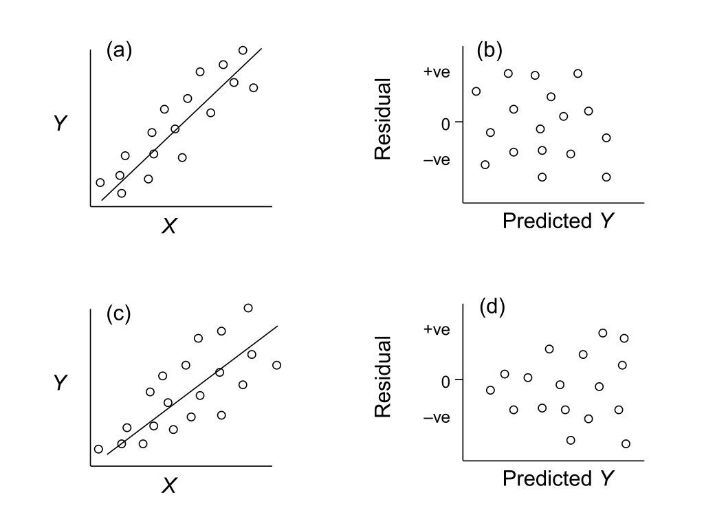{fig-align="center" width="90%"}

## DRAFT: Homoscedasticity vs Heteroscedasticity

```{r}
#| echo: false
#| eval: true
#| fig-width: 10
#| fig-height: 8

par(mfrow = c(2, 2), mar = c(4, 4, 3, 1))

set.seed(42)
n <- 20
x_good <- runif(n, 1, 10)
y_good <- 2 + 1.5 * x_good + rnorm(n, 0, 1.5)
fit_good <- lm(y_good ~ x_good)

# (a) Good fit - scatter with line
plot(x_good, y_good, pch = 1, cex = 1.5, xlab = "X", ylab = "Y",
     main = "(a)", las = 1)
abline(fit_good, lwd = 2)

# (b) Good residuals
plot(fitted(fit_good), residuals(fit_good), pch = 1, cex = 1.5,
     xlab = "Predicted Y", ylab = "Residual", main = "(b)", las = 1)
abline(h = 0, lty = 2)

# (c) Heteroscedastic fit
x_het <- runif(n, 1, 10)
y_het <- 2 + 1.5 * x_het + rnorm(n, 0, x_het * 0.5)
fit_het <- lm(y_het ~ x_het)
plot(x_het, y_het, pch = 1, cex = 1.5, xlab = "X", ylab = "Y",
     main = "(c)", las = 1)
abline(fit_het, lwd = 2)

# (d) Heteroscedastic residuals (funnel)
plot(fitted(fit_het), residuals(fit_het), pch = 1, cex = 1.5,
     xlab = "Predicted Y", ylab = "Residual", main = "(d)", las = 1)
abline(h = 0, lty = 2)
```

## Spotting Assumption Violations

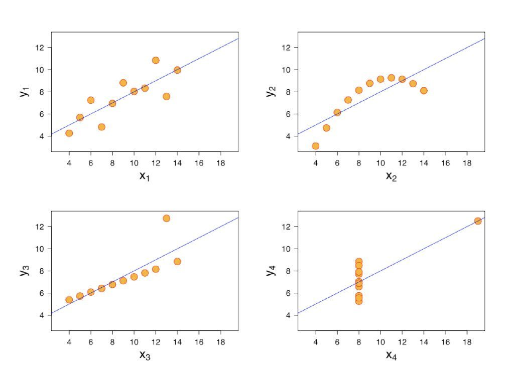{fig-align="center" width="90%"}

## DRAFT: Anscombe's Quartet

```{r}
#| echo: false
#| eval: true
#| fig-width: 10
#| fig-height: 8

library(datasets)
par(mfrow = c(2, 2), mar = c(4, 4, 2, 1))

for (i in 1:4) {
  xi <- anscombe[[paste0("x", i)]]
  yi <- anscombe[[paste0("y", i)]]
  plot(xi, yi, pch = 16, cex = 1.8, col = "darkorange",
       xlab = bquote(x[.(i)]), ylab = bquote(y[.(i)]),
       xlim = c(3, 19), ylim = c(3, 13), las = 1)
  abline(lm(yi ~ xi), col = "steelblue", lwd = 2)
}
```

All four datasets have nearly identical summary statistics ($\bar{x}=9$, $\bar{y} \approx 7.5$, $r \approx 0.82$, same regression line) but very different patterns.

## Spotting Assumption Violations

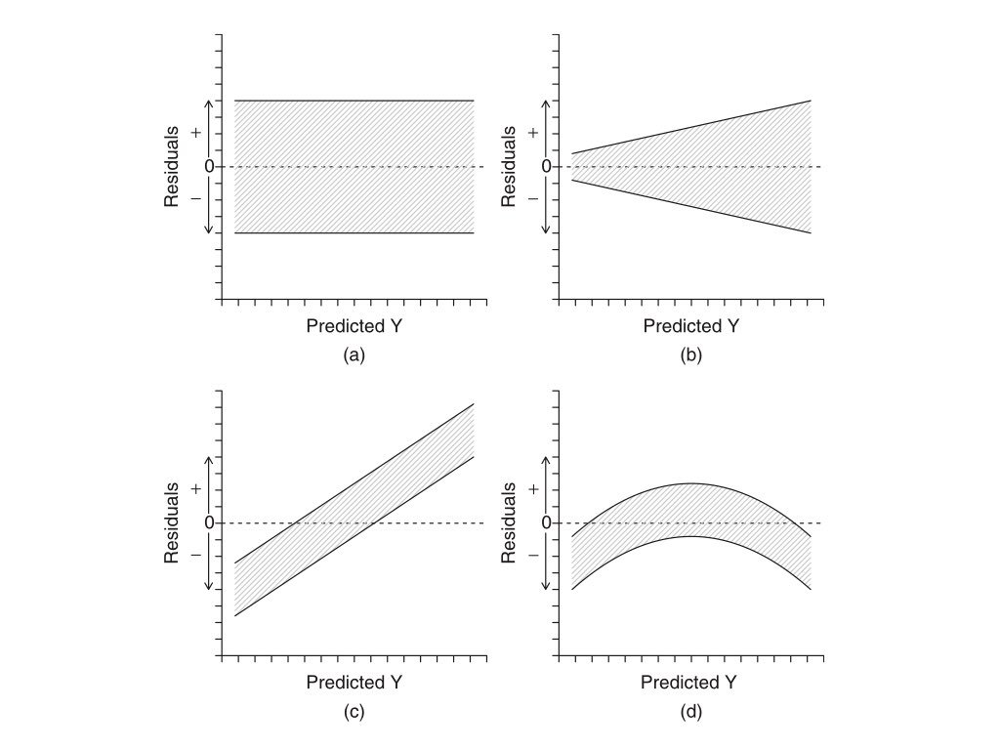{fig-align="center" width="90%"}

## DRAFT: Residual Patterns

```{r}
#| echo: false
#| eval: true
#| fig-width: 10
#| fig-height: 8

par(mfrow = c(2, 2), mar = c(4, 4, 3, 1))

# (a) Homoscedastic - good
set.seed(1)
x <- 1:50
resid_a <- rnorm(50, 0, 1)
plot(x, resid_a, pch = 1, xlab = "Predicted Y", ylab = "Residuals",
     main = "(a) Homoscedastic", ylim = c(-4, 4), las = 1)
abline(h = 0, lty = 2)
lines(c(1, 50), c(2, 2), lwd = 2)
lines(c(1, 50), c(-2, -2), lwd = 2)

# (b) Fan shape - increasing variance
resid_b <- rnorm(50, 0, x * 0.08)
plot(x, resid_b, pch = 1, xlab = "Predicted Y", ylab = "Residuals",
     main = "(b) Funnel (heteroscedastic)", ylim = c(-4, 4), las = 1)
abline(h = 0, lty = 2)
lines(x, x * 0.08 * 2, lwd = 2)
lines(x, -x * 0.08 * 2, lwd = 2)

# (c) Linear trend in residuals
resid_c <- rnorm(50, 0, 0.5) + (x - 25) * 0.06
plot(x, resid_c, pch = 1, xlab = "Predicted Y", ylab = "Residuals",
     main = "(c) Linear trend", ylim = c(-4, 4), las = 1)
abline(h = 0, lty = 2)
abline(lm(resid_c ~ x), lwd = 2)

# (d) Curved pattern
resid_d <- rnorm(50, 0, 0.5) + sin(x / 8) * 2
plot(x, resid_d, pch = 1, xlab = "Predicted Y", ylab = "Residuals",
     main = "(d) Curvilinear", ylim = c(-4, 4), las = 1)
abline(h = 0, lty = 2)
lines(x, sin(x / 8) * 2, lwd = 2)
```

## Common Residual Patterns and Causes

Understanding what different residual patterns mean helps you decide how to fix model problems:

-   **Funnel shape** (variance increases with fitted values): Heteroscedasticity. Consider a variance-stabilizing transformation (e.g., log) or use weighted least squares.

-   **Curved pattern** (U-shape or arch): The relationship is nonlinear. Consider adding polynomial terms (e.g., $x^2$) or using a different model.

-   **Clusters or groups**: There may be a missing categorical variable or subgroup structure in the data (recall Simpson's Paradox).

-   **Systematic pattern over time/order**: Autocorrelation among residuals. Consider time-series models or including a time covariate.

## What Each Residual Plot Tells You

The standard `plot(lm_object)` in R produces four diagnostic plots. Each one targets a specific assumption:

| Plot | Name | What It Checks | What to Look For |
|:-----------------|:-----------------|:-----------------|:-----------------|
| 1 | Residuals vs. Fitted | Linearity & equal variance | No pattern; random scatter around 0 |
| 2 | Normal Q-Q | Normality of residuals | Points follow the diagonal line |
| 3 | Scale-Location | Homoscedasticity | Flat trend line; no fan shape |
| 4 | Residuals vs. Leverage | Influential observations | No points beyond Cook's distance lines |

## Residual Diagnostic Plots

::: panel-tabset
### Output

```{r}
#| label: resid-plots-output
#| echo: false
#| eval: true
#| fig-width: 10
#| fig-height: 8

par(mfrow = c(2, 2))
plot(my_lm)
```

### Code

```{r}
#| label: resid-plots-code
#| echo: true
#| eval: false

par(mfrow = c(2, 2))
plot(my_lm)
```
:::

## Using ggfortify for Diagnostics

::: panel-tabset
### Output

```{r}
#| label: ggfortify-diag-output
#| echo: false
#| eval: true
#| fig-width: 10
#| fig-height: 6

library(ggfortify)
autoplot(my_lm, which = 1:4, ncol = 2)
```

### Code

```{r}
#| label: ggfortify-diag-code
#| echo: true
#| eval: false

library(ggfortify)
autoplot(my_lm, which = 1:4, ncol = 2)
```
:::

## Outlier Leverage and Influence

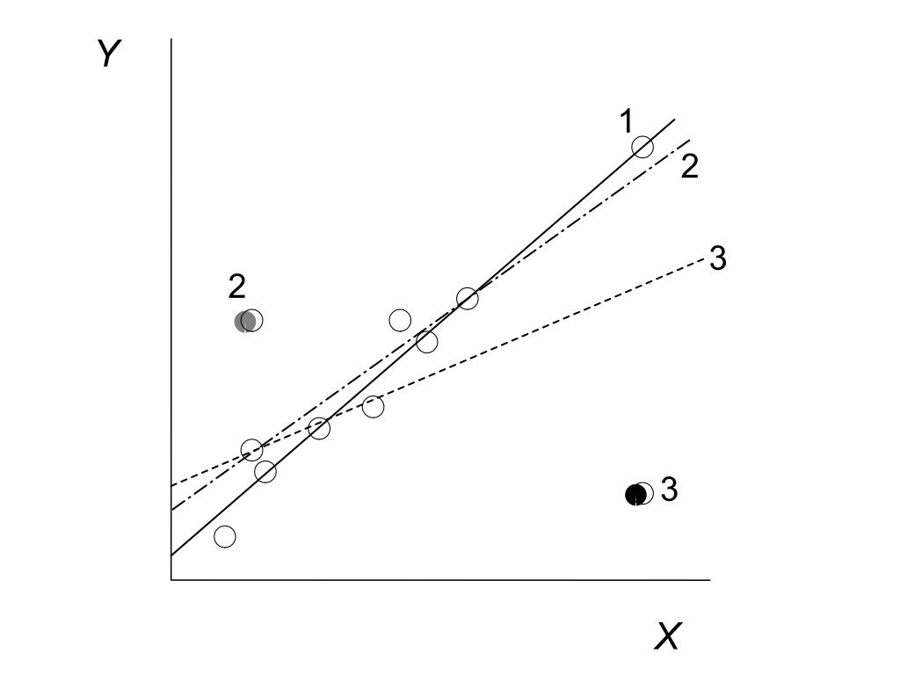{fig-align="center" width="90%"}

## DRAFT: Outlier Leverage and Influence

```{r}
#| echo: false
#| eval: true
#| fig-width: 7
#| fig-height: 6

set.seed(42)
x <- c(1, 2, 3, 4, 5, 6, 7, 8, 9, 10)
y <- c(0.5, 1, 1.8, 2.3, 3.5, 4, 4.2, 5, 5.5, 6.5)

# Outlier points
x_all <- c(x, 3, 9)
y_all <- c(y, 5, 2)

plot(x_all, y_all, pch = c(rep(1, 10), 16, 16), cex = c(rep(1.5, 10), 2.5, 2.5),
     col = c(rep("black", 10), "gray50", "gray20"),
     xlab = "X", ylab = "Y", las = 1, xlim = c(0, 11), ylim = c(0, 8))

# Fit 1: original data
fit1 <- lm(y ~ x)
abline(fit1, lwd = 2, lty = 1)

# Fit 2: with high-leverage non-influential outlier
fit2 <- lm(y_all[c(1:10, 11)] ~ x_all[c(1:10, 11)])
abline(fit2, lwd = 2, lty = 4)

# Fit 3: with high-leverage influential outlier
fit3 <- lm(y_all[c(1:10, 12)] ~ x_all[c(1:10, 12)])
abline(fit3, lwd = 2, lty = 2)

legend("topleft",
       c("1: Original fit", "2: + Low leverage outlier", "3: + High leverage outlier"),
       lty = c(1, 4, 2), lwd = 2, cex = 0.9)
text(3, 5.3, "2", cex = 1.5, col = "gray50", font = 2)
text(9, 1.7, "3", cex = 1.5, col = "gray20", font = 2)
```

## Outlier Leverage and Influence

-   **Leverage**: How much of an outlier in x-space

-   **Residual**: How much of an outlier in y-space

-   **Cook's D**: Overall influence on fitted model

-   A point with high leverage doesn't necessarily distort the model — only if it also has a large residual.

-   Cook's distance combines both: it measures how much all the fitted values would change if that single observation were removed.

::: callout-warning
Cook's D ≥ 1 indicates highly influential observations, and a rough rule of thumb is 4/n. Investigate these points — they may be data entry errors, measurement problems, or genuinely unusual cases.
:::

------------------------------------------------------------------------

# Residual Plots for the Grip Strength Models {background-color="#2c3e50"}

## BMP2 Model

-   The residuals vs. fitted values plot is our primary tool for checking linearity and homoscedasticity.
-   If the model is well-specified, we expect to see a random cloud of points centered around zero with no systematic pattern.

::: panel-tabset
### Output

```{r}
#| label: resid-bmp2-output
#| echo: false
#| eval: true
#| fig-width: 8
#| fig-height: 5

bmp2_diag <- data.frame(
  fitted = fitted(lm_bmp2),
  residuals = residuals(lm_bmp2)
)

ggplot(bmp2_diag, aes(x = fitted, y = residuals)) +
  geom_point(color = "steelblue", alpha = 0.6, size = 2) +
  geom_hline(yintercept = 0, linetype = "dashed", color = "red", linewidth = 0.8) +
  geom_smooth(method = "loess", se = FALSE, color = "darkorange", linewidth = 1) +
  labs(
    x = "Fitted Values (ŷ)",
    y = "Residuals (y - ŷ)",
    title = "Residuals vs. Fitted — BMP2 Model"
  ) +
  theme_minimal(base_size = 14)
```

### Code

```{r}
#| label: resid-bmp2-code
#| echo: true
#| eval: false

bmp2_diag <- data.frame(
  fitted = fitted(lm_bmp2),
  residuals = residuals(lm_bmp2)
)

ggplot(bmp2_diag, aes(x = fitted, y = residuals)) +
  geom_point(color = "steelblue", alpha = 0.6, size = 2) +
  geom_hline(yintercept = 0, linetype = "dashed", color = "red", linewidth = 0.8) +
  geom_smooth(method = "loess", se = FALSE, color = "darkorange", linewidth = 1) +
  labs(
    x = "Fitted Values (ŷ)",
    y = "Residuals (y - ŷ)",
    title = "Residuals vs. Fitted — BMP2 Model"
  ) +
  theme_minimal(base_size = 14)
```
:::

-   The loess smoother (orange line) helps visualize any systematic trend.
-   If it stays close to zero across the range of fitted values, linearity is satisfied.

## Exercise Model

::: panel-tabset
### Output

```{r}
#| label: resid-exercise-output
#| echo: false
#| eval: true
#| fig-width: 8
#| fig-height: 5

exercise_diag <- data.frame(
  fitted = fitted(lm_exercise),
  residuals = residuals(lm_exercise)
)

ggplot(exercise_diag, aes(x = fitted, y = residuals)) +
  geom_point(color = "darkorange", alpha = 0.6, size = 2) +
  geom_hline(yintercept = 0, linetype = "dashed", color = "red", linewidth = 0.8) +
  geom_smooth(method = "loess", se = FALSE, color = "purple", linewidth = 1) +
  labs(
    x = "Fitted Values (ŷ)",
    y = "Residuals (y - ŷ)",
    title = "Residuals vs. Fitted — Exercise Model (Linear)"
  ) +
  theme_minimal(base_size = 14)
```

### Code

```{r}
#| label: resid-exercise-code
#| echo: true
#| eval: false

exercise_diag <- data.frame(
  fitted = fitted(lm_exercise),
  residuals = residuals(lm_exercise)
)

ggplot(exercise_diag, aes(x = fitted, y = residuals)) +
  geom_point(color = "darkorange", alpha = 0.6, size = 2) +
  geom_hline(yintercept = 0, linetype = "dashed", color = "red", linewidth = 0.8) +
  geom_smooth(method = "loess", se = FALSE, color = "purple", linewidth = 1) +
  labs(
    x = "Fitted Values (ŷ)",
    y = "Residuals (y - ŷ)",
    title = "Residuals vs. Fitted — Exercise Model (Linear)"
  ) +
  theme_minimal(base_size = 14)
```
:::

::: callout-important
Look carefully at the loess smoother — does it show curvature? If the residuals show a systematic curved pattern, this suggests a nonlinear relationship that a straight line cannot capture.
:::

## Full Diagnostic Panel: BMP2 Model

::: panel-tabset
### Output

```{r}
#| label: ggfortify-bmp2-output
#| echo: false
#| eval: true
#| fig-width: 10
#| fig-height: 7

autoplot(lm_bmp2, which = 1:4, ncol = 2) +
  theme_minimal(base_size = 12)
```

### Code

```{r}
#| label: ggfortify-bmp2-code
#| echo: true
#| eval: false

autoplot(lm_bmp2, which = 1:4, ncol = 2) +
  theme_minimal(base_size = 12)
```
:::

## Full Diagnostic Panel: Exercise Model

::: panel-tabset
### Output

```{r}
#| label: ggfortify-exercise-output
#| echo: false
#| eval: true
#| fig-width: 10
#| fig-height: 7

autoplot(lm_exercise, which = 1:4, ncol = 2) +
  theme_minimal(base_size = 12)
```

### Code

```{r}
#| label: ggfortify-exercise-code
#| echo: true
#| eval: false

autoplot(lm_exercise, which = 1:4, ncol = 2) +
  theme_minimal(base_size = 12)
```
:::

------------------------------------------------------------------------

# Identifying and Removing Outliers {background-color="#2c3e50"}

## Fibroblast Cell Culture BMP/Sox9 Experiment

-   A colleague has shared data from a cell culture experiment measuring BMP4 and SOX9 gene expression (relative expression units from qPCR).

-   They want to model BMP4 expression as a function of SOX9 expression across 80 samples.

-   However, they suspect there may be some **data entry errors** and **outliers** in the dataset.

-   Your job is to fit a linear model, use diagnostic plots to identify the problematic observations, decide which to remove, and then refit the model.

-   Download the file `cell_culture_expression.csv` and move through the slides

## Types of Outliers to Watch For

Before we dive in, recall the different ways an observation can be unusual:

-   **Data entry errors**: Values that are off by an order of magnitude (e.g., someone typed 165 instead of 16.5). These are unambiguously wrong and should be corrected or removed.

-   **High leverage points**: Observations with extreme predictor ($x$) values. They have outsized *potential* to influence the fit, but may not actually distort it if they fall near the regression line.

-   **High residual points**: Observations far from the fitted line in the $y$ direction but with typical $x$ values. These inflate the residual variance but may not drastically shift the slope.

-   **High influence points**: The most dangerous — observations with *both* high leverage and a large residual. These can pull the entire regression line toward them, distorting slope and intercept estimates. Cook's distance captures this combined effect.

## Import and Plot the Raw Data

::: callout-tip
Always label your points with sample IDs when looking for outliers — you need to know *which* observations to investigate!
:::

::: panel-tabset
### Output

```{r}
#| label: outlier-import-output
#| echo: false
#| eval: true
#| fig-width: 8
#| fig-height: 5

expr <- read_csv("data/cell_culture_expression.csv")

ggplot(expr, aes(x = sox9_expression, y = bmp4_expression)) +
  geom_point(color = "steelblue", alpha = 0.7, size = 2.5) +
  geom_text(aes(label = sample_id), size = 2.2, nudge_y = 2, color = "gray40",
            check_overlap = TRUE) +
  labs(
    x = "SOX9 Expression (relative units)",
    y = "BMP4 Expression (relative units)",
    title = "BMP4 vs. SOX9 Expression — Raw Data"
  ) +
  theme_minimal(base_size = 14)
```

### Code

```{r}
#| label: outlier-import-code
#| echo: true
#| eval: false

expr <- read_csv("data/cell_culture_expression.csv")

ggplot(expr, aes(x = sox9_expression, y = bmp4_expression)) +
  geom_point(color = "steelblue", alpha = 0.7, size = 2.5) +
  geom_text(aes(label = sample_id), size = 2.2, nudge_y = 2, color = "gray40",
            check_overlap = TRUE) +
  labs(
    x = "SOX9 Expression (relative units)",
    y = "BMP4 Expression (relative units)",
    title = "BMP4 vs. SOX9 Expression — Raw Data"
  ) +
  theme_minimal(base_size = 14)
```
:::

## Fit the Initial Model

-   Notice that the $R^2$ is lower than we might expect for a direct regulatory relationship.
-   Some of the unexplained variance is likely due to the outliers pulling the fit.

::: panel-tabset
### Output

```{r}
#| label: outlier-lm-raw-output
#| echo: false
#| eval: true

lm_expr_raw <- lm(bmp4_expression ~ sox9_expression, data = expr)
tidy(lm_expr_raw) |> kable(digits = 4)
```

\

```{r}
#| label: outlier-lm-raw-glance-output
#| echo: false
#| eval: true

glance(lm_expr_raw) |> kable(digits = 4)
```

### Code

```{r}
#| label: outlier-lm-raw-code
#| echo: true
#| eval: false

lm_expr_raw <- lm(bmp4_expression ~ sox9_expression, data = expr)
tidy(lm_expr_raw) |> kable(digits = 4)
glance(lm_expr_raw) |> kable(digits = 4)
```
:::

## Visualize the Fit with Outliers Present

::: panel-tabset
### Output

```{r}
#| label: outlier-fit-raw-output
#| echo: false
#| eval: true
#| fig-width: 8
#| fig-height: 5

ggplot(expr, aes(x = sox9_expression, y = bmp4_expression)) +
  geom_point(color = "steelblue", alpha = 0.7, size = 2.5) +
  geom_smooth(method = "lm", se = TRUE, color = "firebrick", fill = "firebrick", alpha = 0.2) +
  labs(
    x = "SOX9 Expression (relative units)",
    y = "BMP4 Expression (relative units)",
    title = "Linear Fit with Outliers Present",
    subtitle = paste0("R² = ", round(summary(lm_expr_raw)$r.squared, 3))
  ) +
  theme_minimal(base_size = 14)
```

### Code

```{r}
#| label: outlier-fit-raw-code
#| echo: true
#| eval: false

ggplot(expr, aes(x = sox9_expression, y = bmp4_expression)) +
  geom_point(color = "steelblue", alpha = 0.7, size = 2.5) +
  geom_smooth(method = "lm", se = TRUE, color = "firebrick",
              fill = "firebrick", alpha = 0.2) +
  labs(
    x = "SOX9 Expression (relative units)",
    y = "BMP4 Expression (relative units)",
    title = "Linear Fit with Outliers Present",
    subtitle = paste0("R² = ", round(summary(lm_expr_raw)$r.squared, 3))
  ) +
  theme_minimal(base_size = 14)
```
:::

## Diagnostic Plots to Identify Outliers

-   Examine the four panels. Which observations are flagged by R with their row numbers?
-   Pay attention to the Residuals vs. Leverage plot — points near or beyond the Cook's distance contour lines are the most influential.

::: panel-tabset
### Output

```{r}
#| label: outlier-diag-output
#| echo: false
#| eval: true
#| fig-width: 10
#| fig-height: 7

autoplot(lm_expr_raw, which = 1:4, ncol = 2) +
  theme_minimal(base_size = 12)
```

### Code

```{r}
#| label: outlier-diag-code
#| echo: true
#| eval: false

autoplot(lm_expr_raw, which = 1:4, ncol = 2) +
  theme_minimal(base_size = 12)
```
:::

## Cook's Distance

-   We can extract Cook's distance values and identify the most influential observations programmatically.
-   A common threshold for Cook's distance is $4/n$. Values exceeding this warrant closer inspection.
-   Values approaching or exceeding 1 are almost certainly problematic.

::: panel-tabset
### Output

```{r}
#| label: outlier-cooks-output
#| echo: false
#| eval: true

expr_diag <- expr |>
  mutate(
    cooks_d = cooks.distance(lm_expr_raw),
    leverage = hatvalues(lm_expr_raw),
    std_resid = rstandard(lm_expr_raw)
  )

# Flag observations with Cook's D > 4/n (common threshold)
threshold <- 4 / nrow(expr)

expr_diag |>
  filter(cooks_d > threshold) |>
  select(sample_id, bmp4_expression, sox9_expression, std_resid, leverage, cooks_d) |>
  arrange(desc(cooks_d)) |>
  kable(digits = 4)
```

### Code

```{r}
#| label: outlier-cooks-code
#| echo: true
#| eval: false

expr_diag <- expr |>
  mutate(
    cooks_d = cooks.distance(lm_expr_raw),
    leverage = hatvalues(lm_expr_raw),
    std_resid = rstandard(lm_expr_raw)
  )

# Flag observations with Cook's D > 4/n (common threshold)
threshold <- 4 / nrow(expr)

expr_diag |>
  filter(cooks_d > threshold) |>
  select(sample_id, bmp4_expression, sox9_expression, std_resid, leverage, cooks_d) |>
  arrange(desc(cooks_d)) |>
  kable(digits = 4)
```
:::

## Visualizing Cook's Distance

::: panel-tabset
### Output

```{r}
#| label: outlier-cooks-plot-output
#| echo: false
#| eval: true
#| fig-width: 9
#| fig-height: 5

expr_diag <- expr_diag |>
  mutate(row_num = row_number())

ggplot(expr_diag, aes(x = row_num, y = cooks_d)) +
  geom_col(fill = ifelse(expr_diag$cooks_d > threshold, "firebrick", "steelblue"),
           alpha = 0.7) +
  geom_hline(yintercept = threshold, linetype = "dashed", color = "red", linewidth = 0.8) +
  geom_text(data = expr_diag |> filter(cooks_d > threshold),
            aes(label = sample_id), size = 2.8, nudge_y = 0.01, angle = 45) +
  labs(
    x = "Observation Index",
    y = "Cook's Distance",
    title = "Cook's Distance for Each Observation",
    subtitle = paste0("Dashed line = 4/n threshold (", round(threshold, 4), ")")
  ) +
  theme_minimal(base_size = 13)
```

### Code

```{r}
#| label: outlier-cooks-plot-code
#| echo: true
#| eval: false

expr_diag <- expr_diag |>
  mutate(row_num = row_number())

threshold <- 4 / nrow(expr)

ggplot(expr_diag, aes(x = row_num, y = cooks_d)) +
  geom_col(fill = ifelse(expr_diag$cooks_d > threshold, "firebrick", "steelblue"),
           alpha = 0.7) +
  geom_hline(yintercept = threshold, linetype = "dashed", color = "red", linewidth = 0.8) +
  geom_text(data = expr_diag |> filter(cooks_d > threshold),
            aes(label = sample_id), size = 2.8, nudge_y = 0.01, angle = 45) +
  labs(
    x = "Observation Index",
    y = "Cook's Distance",
    title = "Cook's Distance for Each Observation",
    subtitle = paste0("Dashed line = 4/n threshold (", round(threshold, 4), ")")
  ) +
  theme_minimal(base_size = 13)
```
:::

## Interpreting What We Found

Look at the flagged observations and think about what kind of outlier each one is:

-   **SC012** and **SC055**: BMP4 values around 100–165 when the rest of the data is in the 0–50 range. These are almost certainly **data entry errors** — values off by an order of magnitude (someone forgot a decimal point). These should be removed or corrected.

-   **SC037**: SOX9 value around 28 when the rest of the data is in the 0.5–8 range. Another likely **data entry error** with the same order-of-magnitude pattern.

-   **SC060**: High SOX9 (13.8) but very low BMP4 (8.5). This is a **high influence point** — extreme in x-space *and* far from the expected trend. It pulls the regression line down at the right end.

-   **SC045**: Moderate SOX9 (4.2) but very high BMP4 (25.5). A **high residual point** — not extreme in x-space, but far above the fitted line.

::: callout-important
Data entry errors should always be corrected or removed. For other outliers, the decision is more nuanced — document your reasoning!
:::

## Remove the Problematic Observations

-   We will remove the three clear data entry errors (SC012, SC037, SC055) and the high influence point (SC060).
-   We keep SC045 for now — it has a large residual but isn't clearly erroneous, and it doesn't have enough leverage to distort the fit badly.

::: panel-tabset
### Output

```{r}
#| label: outlier-remove-output
#| echo: false
#| eval: true

# Remove data entry errors and the high influence point
remove_ids <- c("SC012", "SC037", "SC055", "SC060")

expr_clean <- expr |>
  filter(!sample_id %in% remove_ids)

cat("Original observations:", nrow(expr), "\n")
cat("Removed:", length(remove_ids), "observations:", paste(remove_ids, collapse = ", "), "\n")
cat("Remaining observations:", nrow(expr_clean), "\n")
```

### Code

```{r}
#| label: outlier-remove-code
#| echo: true
#| eval: false

# Remove data entry errors and the high influence point
remove_ids <- c("SC012", "SC037", "SC055", "SC060")

expr_clean <- expr |>
  filter(!sample_id %in% remove_ids)

cat("Original observations:", nrow(expr), "\n")
cat("Removed:", length(remove_ids), "observations\n")
cat("Remaining observations:", nrow(expr_clean), "\n")
```
:::

::: callout-note
Always document which observations you removed and why. Never silently drop data points — your methods section should describe this.
:::

## Refit the Model on Clean Data

-   Compare the $R^2$ before and after cleaning.
-   The relationship between SOX9 and BMP4 should now be much clearer, and the coefficient estimates more trustworthy.

::: panel-tabset
### Output

```{r}
#| label: outlier-refit-output
#| echo: false
#| eval: true

lm_expr_clean <- lm(bmp4_expression ~ sox9_expression, data = expr_clean)
tidy(lm_expr_clean) |> kable(digits = 4)
```

\

```{r}
#| label: outlier-refit-glance-output
#| echo: false
#| eval: true

glance(lm_expr_clean) |> kable(digits = 4)
```

### Code

```{r}
#| label: outlier-refit-code
#| echo: true
#| eval: false

lm_expr_clean <- lm(bmp4_expression ~ sox9_expression, data = expr_clean)
tidy(lm_expr_clean) |> kable(digits = 4)
glance(lm_expr_clean) |> kable(digits = 4)
```
:::

## Compare Fits — Before and After

::: panel-tabset
### Output

```{r}
#| label: outlier-compare-output
#| echo: false
#| eval: true
#| fig-width: 12
#| fig-height: 5

p_raw <- ggplot(expr, aes(x = sox9_expression, y = bmp4_expression)) +
  geom_point(color = "steelblue", alpha = 0.6, size = 2) +
  geom_point(data = expr |> filter(sample_id %in% remove_ids),
             color = "firebrick", size = 3, shape = 1, stroke = 1.5) +
  geom_smooth(method = "lm", se = TRUE, color = "firebrick", fill = "firebrick", alpha = 0.15) +
  labs(x = "SOX9 Expression", y = "BMP4 Expression",
       title = "Before: With Outliers",
       subtitle = paste0("R² = ", round(summary(lm_expr_raw)$r.squared, 3))) +
  theme_minimal(base_size = 13)

p_clean <- ggplot(expr_clean, aes(x = sox9_expression, y = bmp4_expression)) +
  geom_point(color = "steelblue", alpha = 0.6, size = 2) +
  geom_smooth(method = "lm", se = TRUE, color = "darkgreen", fill = "darkgreen", alpha = 0.15) +
  labs(x = "SOX9 Expression", y = "BMP4 Expression",
       title = "After: Outliers Removed",
       subtitle = paste0("R² = ", round(summary(lm_expr_clean)$r.squared, 3))) +
  theme_minimal(base_size = 13)

p_raw + p_clean
```

### Code

```{r}
#| label: outlier-compare-code
#| echo: true
#| eval: false

p_raw <- ggplot(expr, aes(x = sox9_expression, y = bmp4_expression)) +
  geom_point(color = "steelblue", alpha = 0.6, size = 2) +
  geom_point(data = expr |> filter(sample_id %in% remove_ids),
             color = "firebrick", size = 3, shape = 1, stroke = 1.5) +
  geom_smooth(method = "lm", se = TRUE, color = "firebrick",
              fill = "firebrick", alpha = 0.15) +
  labs(x = "SOX9 Expression", y = "BMP4 Expression",
       title = "Before: With Outliers",
       subtitle = paste0("R² = ", round(summary(lm_expr_raw)$r.squared, 3))) +
  theme_minimal(base_size = 13)

p_clean <- ggplot(expr_clean, aes(x = sox9_expression, y = bmp4_expression)) +
  geom_point(color = "steelblue", alpha = 0.6, size = 2) +
  geom_smooth(method = "lm", se = TRUE, color = "darkgreen",
              fill = "darkgreen", alpha = 0.15) +
  labs(x = "SOX9 Expression", y = "BMP4 Expression",
       title = "After: Outliers Removed",
       subtitle = paste0("R² = ", round(summary(lm_expr_clean)$r.squared, 3))) +
  theme_minimal(base_size = 13)

p_raw + p_clean
```
:::

## Residual Diagnostics on Clean Data

::: panel-tabset
### Output

```{r}
#| label: outlier-resid-clean-output
#| echo: false
#| eval: true
#| fig-width: 10
#| fig-height: 7

autoplot(lm_expr_clean, which = 1:4, ncol = 2) +
  theme_minimal(base_size = 12)
```

### Code

```{r}
#| label: outlier-resid-clean-code
#| echo: true
#| eval: false

autoplot(lm_expr_clean, which = 1:4, ncol = 2) +
  theme_minimal(base_size = 12)
```
:::

## Outlier Exercise Summary

::: callout-tip
## What We Learned

1.  **Always visualize your data first.** A simple scatterplot with labeled points would have immediately revealed the order-of-magnitude entry errors.

2.  **Use multiple diagnostic tools.** Cook's distance, leverage, and standardized residuals each capture different aspects of "outlierness."

3.  **Distinguish error from biology.** Data entry errors (10x values) are unambiguously wrong. Biological outliers require more thought — they could represent real variation, subpopulations, or experimental artifacts.

4.  **Document everything.** Record which observations you removed, why, and how the results changed. Transparency is essential for reproducibility.

5.  **Outlier removal can dramatically improve** $R^2$ **and coefficient estimates**, but it must be justified by evidence, not by a desire for better-looking results.
:::

------------------------------------------------------------------------

# The Eugenics History of Statistics

## Galton's original data

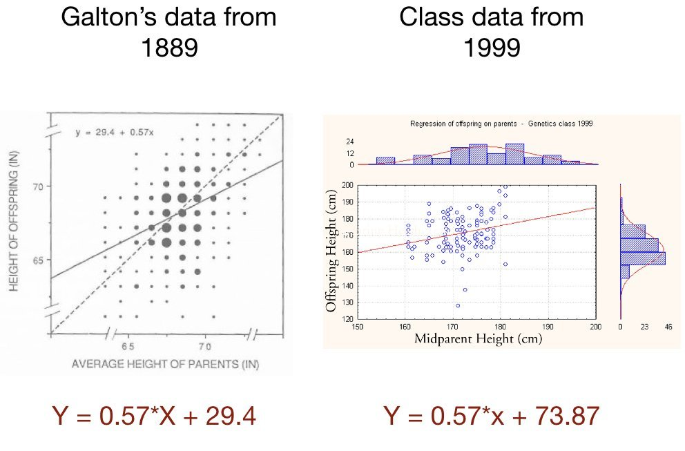{fig-align="center" width="100%"}

## DRAFT: Galton's Regression to the Mean

::::: columns
::: {.column width="50%"}
**Galton's data from 1889**

```{r}
#| echo: false
#| eval: true
#| fig-width: 5
#| fig-height: 5

set.seed(1889)
n <- 200
parent_height <- rnorm(n, mean = 68, sd = 2)
offspring_height <- 29.4 + 0.57 * parent_height + rnorm(n, 0, 1.5)

parent_r <- round(parent_height)
offspring_r <- round(offspring_height)
df <- data.frame(parent = parent_r, offspring = offspring_r)
df_counts <- as.data.frame(table(df$parent, df$offspring))
names(df_counts) <- c("parent", "offspring", "count")
df_counts$parent <- as.numeric(as.character(df_counts$parent))
df_counts$offspring <- as.numeric(as.character(df_counts$offspring))
df_counts <- df_counts[df_counts$count > 0, ]

plot(df_counts$parent, df_counts$offspring,
     cex = sqrt(df_counts$count) * 1.2,
     pch = 16, col = rgb(0.3, 0.3, 0.3, 0.7),
     xlab = "AVERAGE HEIGHT OF PARENTS (IN)",
     ylab = "HEIGHT OF OFFSPRING (IN)",
     xlim = c(63, 73), ylim = c(62, 73), las = 1)
abline(a = 29.4, b = 0.57, lwd = 2)
abline(a = 0, b = 1, lwd = 2, lty = 2)
```

$$Y = 0.57X + 29.4$$
:::

::: {.column width="50%"}
**Class data from 1999**

```{r}
#| echo: false
#| eval: true
#| fig-width: 5
#| fig-height: 5

set.seed(1999)
n <- 60
mid_parent <- rnorm(n, mean = 172, sd = 8)
offspring_cm <- 73.87 + 0.57 * mid_parent + rnorm(n, 0, 5)

plot(mid_parent, offspring_cm, pch = 1, cex = 1.2,
     col = "blue", xlab = "Midparent Height (cm)",
     ylab = "Offspring Height (cm)",
     xlim = c(150, 200), ylim = c(120, 200), las = 1)
abline(lm(offspring_cm ~ mid_parent), col = "red", lwd = 2)
```

$$Y = 0.57x + 73.87$$
:::
:::::

## Galton as the Father of Eugenics

{fig.align="center"}

-   Francis Galton: Darwin's half cousin
-   Studied human variation and genetic inheritance
    -   Human height, fingerprints, intelligence
    -   Correlation, regression toward the mean, and "nature versus nurture"
    -   Pioneered twin studies

## Galton as the Father of Eugenics

-   Believed that intelligence was hereditary based on surveying prominent academics in Europe
-   Used the ideas of **correlation** and **regression towards the mean** to argue that the upper class should breed amongst themselves to keep those "good genes" pure
-   Wanted to provide monetary incentives for "good" couples to marry and reproduce as a way to avoid the upper class being genetically muddied by the lower class

## A common sight at state fairs around the U.S. in the 1930s

-   Competitions for the "perfect family" to encourage public consciousness and support for eugenics

```{r, echo=FALSE, out.width='50%', fig.asp=.75, fig.align='center'}

```

## Galton, Charles Davenport & G. Stanley Hall

```{r, echo=FALSE, out.width='50%', fig.asp=.75, fig.align='center'}
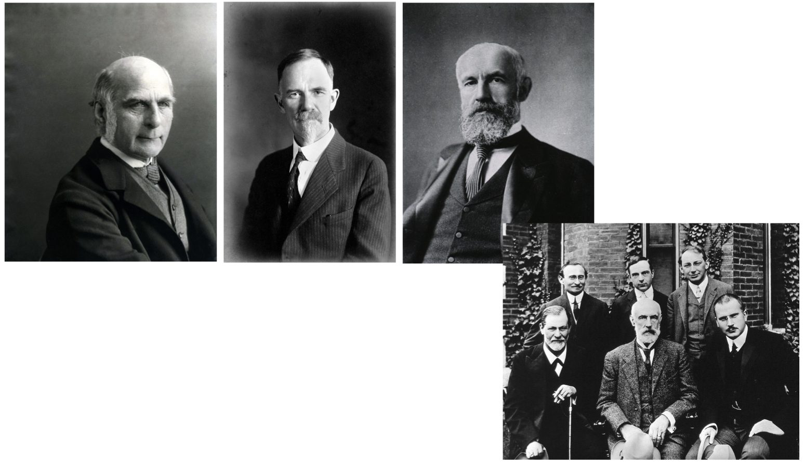
```

## Logo of the US eugenics society

```{r, echo=FALSE, out.width='80%', fig.asp=.75, fig.align='center'}

```

-   American Eugenics Record Office (ERO) founded in Cold Springs Harbor

## Eugenics societies in America

-   Advocated for state laws to ban interracial marriages and promote sterilization of "unfit" individuals (negative eugenics) - especially black, Latinx, and Native American women
-   30 states passed laws to force mental institution patients to be sterilized
-   Between 1907 and 1963, over 64,000 individuals were forcibly sterilized under eugenic legislation in the United States

## RA Fisher and Eugenics in London

-   Developer of Fishers exact test, analysis of variance (ANOVA), null hypothesis, p values, maximum likelihood, probability density functions
-   Founding Chairman of the University of Cambridge Eugenics Society

```{r, echo=FALSE, out.width='20%', fig.asp=.75, fig.align='center'}

```

## RA Fisher and Eugenics

-   1/3rd of his work "The Genetical Theory of Natural Selection" discussed eugenics and his theory that the fall of civilizations was due to the fertility of their upper classes being diminished
-   Used these statistical methods to test data on human variation to prove biological differences between human races
-   Eugenics and racism were the primary motivators for many of these statistical tests that we use today

## A direct line to Hitler and Nazism

-   Eugenics existed in America (and England) before it became popular in Germany.
-   By 1933, California had subjected more people to forceful sterilization than all other U.S. states combined.
-   The forced sterilization program engineered by the Nazis was partly inspired by California's.

```{r, echo=FALSE, out.width='70%', fig.asp=.75, fig.align='center'}
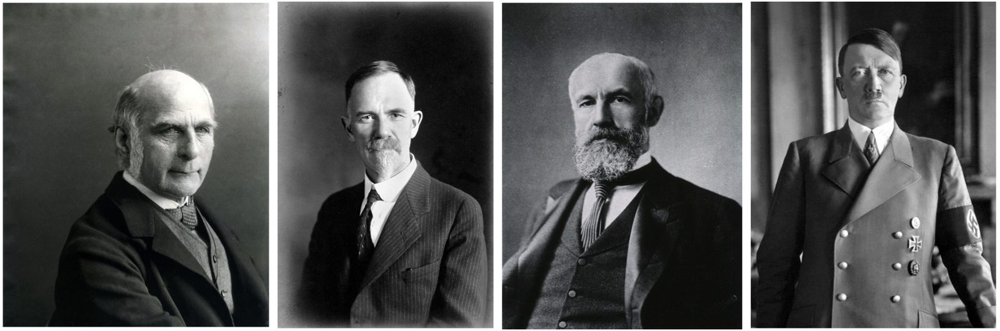
```

## Sterilizations continue in America

-   Our history books paint Nazi Germany as the primary evil of that time, while we try to cover up our significant role in eugenics
-   It wasn't until 1978 that the US passed regulations on sterilization procedures
-   California only passed a bill to outlaw sterilization of inmates in 2014
-   Certain members of the genetic engineering community threaten to bring back eugenics ideas
-   Our current President repeats eugenics talking points

## So, what do we do from here?

-   The statistical methods that Galton, Fisher, and others developed are useful science tools
-   Important to use these tools for good - improving our planet, human health, and technology
-   Important to acknowledge and not forget the history of science - educate others to avoid repeating history

## Interested in learning more?

```{r, echo=FALSE, out.width='20%', fig.asp=.75, fig.align='center'}

```

-   See also
    -   "The Gene" by Siddhartha Mukherjee
    -   "Control" by Adam Rutherford

------------------------------------------------------------------------

# Polynomial Regression: When Linear Isn't Enough {background-color="#2c3e50"}

## Motivation for Polynomial Regression

The residual plots for the exercise model may suggest curvature — the loess smoother deviates from zero in a systematic way. This is a signal that the true relationship between exercise hours and grip strength may be nonlinear.

A polynomial regression extends the linear model by adding powers of $x$ as additional predictors. For a quadratic (degree 2) polynomial:

::: panel-tabset
### Equation

$$y_i = \beta_0 + \beta_1 x_i + \beta_2 x_i^2 + \epsilon_i$$

### LaTeX

``` text
y_i = \beta_0 + \beta_1 x_i + \beta_2 x_i^2 + \epsilon_i
```
:::

This is still a **linear model** in the statistical sense (the parameters $\beta$ enter linearly), but the relationship between $y$ and $x$ is now curved. A quadratic term can capture a U-shape or inverted-U pattern that a straight line would miss.

## Power and Polynomial Relationships

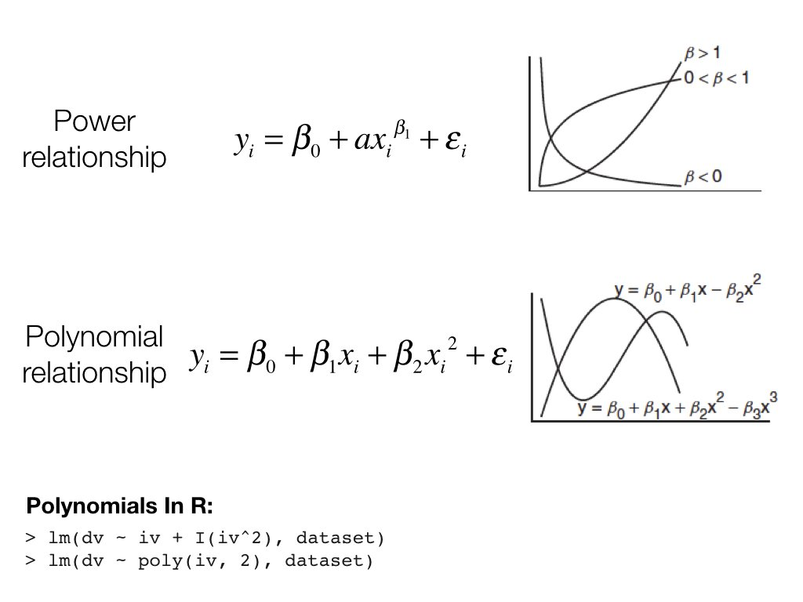{alt="Power and polynomial relationships in regression" fig-align="center" width="90%"}

## DRAFT: Power and Polynomial Relationships

::::: columns
::: {.column width="50%"}
**Power relationship:**

$$y_i = \beta_0 + ax_i^{\beta_1} + \varepsilon_i$$

```{r}
#| echo: false
#| eval: true
#| fig-width: 4
#| fig-height: 3

x <- seq(0.1, 5, length.out = 100)
plot(x, x^2, type = "l", lwd = 2, xlab = "", ylab = "",
     main = "", axes = FALSE)
lines(x, x^0.5, lwd = 2, lty = 2)
lines(x, x^(-1), lwd = 2, lty = 3)
axis(1); axis(2)
text(4, 22, expression(beta > 1), cex = 1.1)
text(4, 2.5, expression(0 < beta~"<"~ 1), cex = 1.1)
text(4, 0.5, expression(beta < 0), cex = 1.1)
```
:::

::: {.column width="50%"}
**Polynomial relationship:**

$$y_i = \beta_0 + \beta_1 x_i + \beta_2 x_i^2 + \varepsilon_i$$

```{r}
#| echo: false
#| eval: true
#| fig-width: 4
#| fig-height: 3

x <- seq(-3, 3, length.out = 100)
plot(x, 0.5 + x - 0.5*x^2, type = "l", lwd = 2,
     xlab = "", ylab = "", axes = FALSE)
lines(x, 0.5 + x + 0.3*x^2 - 0.2*x^3, lwd = 2, lty = 2)
axis(1); axis(2)
```
:::
:::::

**Polynomials in R:**
```r
lm(dv ~ iv + I(iv^2), dataset)
lm(dv ~ poly(iv, 2), dataset)
```

In R, we use `poly(x, degree)` inside the `lm()` formula, or equivalently `I(x^2)`:

The `raw = TRUE` argument means R uses the raw polynomial terms ($x$ and $x^2$) rather than orthogonal polynomials, making the coefficients directly interpretable.

::: panel-tabset
### Output

```{r}
#| label: poly-exercise-output
#| echo: false
#| eval: true

lm_exercise_poly <- lm(grip_strength_kg ~ poly(exercise_hrs_week, 2, raw = TRUE), data = grip)
summary(lm_exercise_poly)
```

### Code

```{r}
#| label: poly-exercise-code
#| echo: true
#| eval: false

# Fit quadratic polynomial: grip_strength ~ exercise + exercise^2
lm_exercise_poly <- lm(grip_strength_kg ~ poly(exercise_hrs_week, 2, raw = TRUE),
                        data = grip)
summary(lm_exercise_poly)
```
:::

## Interpreting the Polynomial Model

Compare the $R^2$ from this polynomial model with the linear exercise model. If the quadratic term is significant and $R^2$ improves meaningfully, the curvilinear fit is more appropriate.

::: panel-tabset
### Output

```{r}
#| label: poly-exercise-tidy-output
#| echo: false
#| eval: true

tidy(lm_exercise_poly) |> kable(digits = 4)
```

\

```{r}
#| label: poly-exercise-glance-output
#| echo: false
#| eval: true

glance(lm_exercise_poly) |> kable(digits = 4)
```

### Code

```{r}
#| label: poly-exercise-tidy-code
#| echo: true
#| eval: false

tidy(lm_exercise_poly) |> kable(digits = 4)
glance(lm_exercise_poly) |> kable(digits = 4)
```
:::

## Comparing Linear vs. Polynomial Fit

We can formally compare the linear and polynomial models using `anova()`, which tests whether the additional quadratic term significantly improves the fit:

A significant p-value here means the quadratic term explains a statistically significant amount of additional variance beyond the linear term alone.

::: panel-tabset
### Output

```{r}
#| label: anova-compare-output
#| echo: false
#| eval: true

anova(lm_exercise, lm_exercise_poly)
```

### Code

```{r}
#| label: anova-compare-code
#| echo: true
#| eval: false

# Compare nested models: linear vs. quadratic
anova(lm_exercise, lm_exercise_poly)
```
:::

## Visualizing the Polynomial Fit

::: panel-tabset
### Output

```{r}
#| label: ggplot-poly-output
#| echo: false
#| eval: true
#| fig-width: 8
#| fig-height: 5

ggplot(grip, aes(x = exercise_hrs_week, y = grip_strength_kg)) +
  geom_point(color = "darkorange", alpha = 0.6, size = 2) +
  geom_smooth(method = "lm", formula = y ~ poly(x, 2),
              se = TRUE, color = "darkgreen", fill = "darkgreen", alpha = 0.2) +
  labs(
    x = "Exercise (hours/week)",
    y = "Grip Strength (kg)",
    title = "Grip Strength vs. Exercise Hours — Polynomial Fit",
    subtitle = paste0("Quadratic fit: R² = ", round(summary(lm_exercise_poly)$r.squared, 3))
  ) +
  theme_minimal(base_size = 14)
```

### Code

```{r}
#| label: ggplot-poly-code
#| echo: true
#| eval: false

ggplot(grip, aes(x = exercise_hrs_week, y = grip_strength_kg)) +
  geom_point(color = "darkorange", alpha = 0.6, size = 2) +
  geom_smooth(method = "lm", formula = y ~ poly(x, 2),
              se = TRUE, color = "darkgreen", fill = "darkgreen", alpha = 0.2) +
  labs(
    x = "Exercise (hours/week)",
    y = "Grip Strength (kg)",
    title = "Grip Strength vs. Exercise Hours — Polynomial Fit",
    subtitle = paste0("Quadratic fit: R² = ",
                      round(summary(lm_exercise_poly)$r.squared, 3))
  ) +
  theme_minimal(base_size = 14)
```
:::

## Linear vs. Polynomial: Side by Side

::: panel-tabset
### Output

```{r}
#| label: ggplot-compare-fits-output
#| echo: false
#| eval: true
#| fig-width: 12
#| fig-height: 5

p_lin <- ggplot(grip, aes(x = exercise_hrs_week, y = grip_strength_kg)) +
  geom_point(color = "darkorange", alpha = 0.6, size = 2) +
  geom_smooth(method = "lm", se = TRUE, color = "firebrick", fill = "firebrick", alpha = 0.2) +
  labs(x = "Exercise (hours/week)", y = "Grip Strength (kg)",
       title = "Linear Fit",
       subtitle = paste0("R² = ", round(summary(lm_exercise)$r.squared, 3))) +
  theme_minimal(base_size = 13)

p_poly <- ggplot(grip, aes(x = exercise_hrs_week, y = grip_strength_kg)) +
  geom_point(color = "darkorange", alpha = 0.6, size = 2) +
  geom_smooth(method = "lm", formula = y ~ poly(x, 2),
              se = TRUE, color = "darkgreen", fill = "darkgreen", alpha = 0.2) +
  labs(x = "Exercise (hours/week)", y = "Grip Strength (kg)",
       title = "Quadratic Fit",
       subtitle = paste0("R² = ", round(summary(lm_exercise_poly)$r.squared, 3))) +
  theme_minimal(base_size = 13)

p_lin + p_poly
```

### Code

```{r}
#| label: ggplot-compare-fits-code
#| echo: true
#| eval: false

p_lin <- ggplot(grip, aes(x = exercise_hrs_week, y = grip_strength_kg)) +
  geom_point(color = "darkorange", alpha = 0.6, size = 2) +
  geom_smooth(method = "lm", se = TRUE, color = "firebrick",
              fill = "firebrick", alpha = 0.2) +
  labs(x = "Exercise (hours/week)", y = "Grip Strength (kg)",
       title = "Linear Fit",
       subtitle = paste0("R² = ", round(summary(lm_exercise)$r.squared, 3))) +
  theme_minimal(base_size = 13)

p_poly <- ggplot(grip, aes(x = exercise_hrs_week, y = grip_strength_kg)) +
  geom_point(color = "darkorange", alpha = 0.6, size = 2) +
  geom_smooth(method = "lm", formula = y ~ poly(x, 2),
              se = TRUE, color = "darkgreen", fill = "darkgreen", alpha = 0.2) +
  labs(x = "Exercise (hours/week)", y = "Grip Strength (kg)",
       title = "Quadratic Fit",
       subtitle = paste0("R² = ", round(summary(lm_exercise_poly)$r.squared, 3))) +
  theme_minimal(base_size = 13)

p_lin + p_poly
```
:::

## Residuals: Linear vs. Polynomial Exercise Model

Now we compare the residual plots to see whether the polynomial model resolves the curvature issue:

::: panel-tabset
### Output

```{r}
#| label: resid-compare-output
#| echo: false
#| eval: true
#| fig-width: 12
#| fig-height: 5

lin_diag <- data.frame(
  fitted = fitted(lm_exercise),
  residuals = residuals(lm_exercise),
  model = "Linear"
)

poly_diag <- data.frame(
  fitted = fitted(lm_exercise_poly),
  residuals = residuals(lm_exercise_poly),
  model = "Quadratic"
)

both_diag <- rbind(lin_diag, poly_diag)

ggplot(both_diag, aes(x = fitted, y = residuals)) +
  geom_point(alpha = 0.5, size = 2) +
  geom_hline(yintercept = 0, linetype = "dashed", color = "red", linewidth = 0.8) +
  geom_smooth(method = "loess", se = FALSE, color = "darkorange", linewidth = 1) +
  facet_wrap(~ model, scales = "free_x") +
  labs(
    x = "Fitted Values (ŷ)",
    y = "Residuals (y - ŷ)",
    title = "Residuals vs. Fitted — Linear vs. Quadratic Exercise Model"
  ) +
  theme_minimal(base_size = 13)
```

### Code

```{r}
#| label: resid-compare-code
#| echo: true
#| eval: false

lin_diag <- data.frame(
  fitted = fitted(lm_exercise),
  residuals = residuals(lm_exercise),
  model = "Linear"
)

poly_diag <- data.frame(
  fitted = fitted(lm_exercise_poly),
  residuals = residuals(lm_exercise_poly),
  model = "Quadratic"
)

both_diag <- rbind(lin_diag, poly_diag)

ggplot(both_diag, aes(x = fitted, y = residuals)) +
  geom_point(alpha = 0.5, size = 2) +
  geom_hline(yintercept = 0, linetype = "dashed", color = "red", linewidth = 0.8) +
  geom_smooth(method = "loess", se = FALSE, color = "darkorange", linewidth = 1) +
  facet_wrap(~ model, scales = "free_x") +
  labs(x = "Fitted Values (ŷ)", y = "Residuals (y - ŷ)",
       title = "Residuals vs. Fitted — Linear vs. Quadratic Exercise Model") +
  theme_minimal(base_size = 13)
```
:::

## Full Diagnostics: Polynomial Exercise Model

::: panel-tabset
### Output

```{r}
#| label: ggfortify-poly-output
#| echo: false
#| eval: true
#| fig-width: 10
#| fig-height: 7

autoplot(lm_exercise_poly, which = 1:4, ncol = 2) +
  theme_minimal(base_size = 12)
```

### Code

```{r}
#| label: ggfortify-poly-code
#| echo: true
#| eval: false

autoplot(lm_exercise_poly, which = 1:4, ncol = 2) +
  theme_minimal(base_size = 12)
```
:::

## 

## Case Study in Model Selection: Beetle Horn Allometry

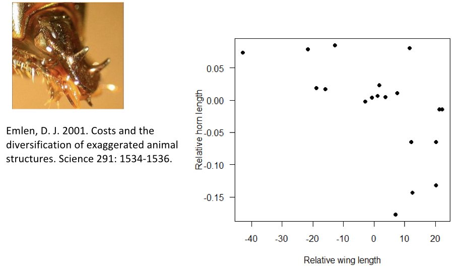{alt="Emlen 2001 beetle horn vs wing length data" fig-align="center" width="90%"}

Data from Emlen, D.J. 2001. *Costs and the diversification of exaggerated animal structures.* Science 291: 1534-1536.

## DRAFT: Beetle Horn Allometry Data

```{r}
#| echo: false
#| eval: true
#| fig-width: 7
#| fig-height: 5

# Simulate beetle horn vs wing data similar to Emlen 2001
set.seed(2001)
wing <- seq(5, 25, length.out = 50) + rnorm(50, 0, 1)
horn <- ifelse(wing < 15, rnorm(50, 0, 0.5),
               0.8 * (wing - 14)^1.3 + rnorm(50, 0, 1.5))
horn[horn < 0] <- abs(rnorm(sum(horn < 0), 0.2, 0.1))
beetle <- data.frame(wing = wing, horn = horn)

plot(beetle$wing, beetle$horn, pch = 16, cex = 1.3,
     xlab = "Wing length (mm)", ylab = "Horn length (mm)",
     main = "Emlen 2001: Beetle horn vs wing length", las = 1)
```

## Linear Regression Fit

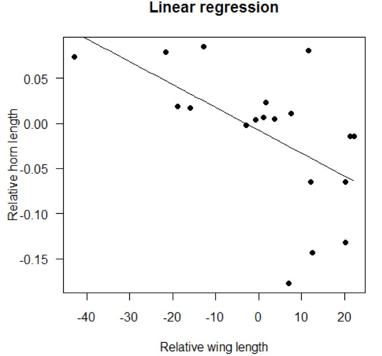{alt="Linear regression on beetle data" fig-align="center" width="90%"}

## DRAFT: Linear Fit

```{r}
#| echo: false
#| eval: true
#| fig-width: 7
#| fig-height: 5

plot(beetle$wing, beetle$horn, pch = 16, cex = 1.3,
     xlab = "Wing length (mm)", ylab = "Horn length (mm)",
     main = "Linear: y = β₀ + β₁x", las = 1)
fit1 <- lm(horn ~ wing, data = beetle)
abline(fit1, lwd = 2, col = "red")
```

## Quadratic Regression Fit

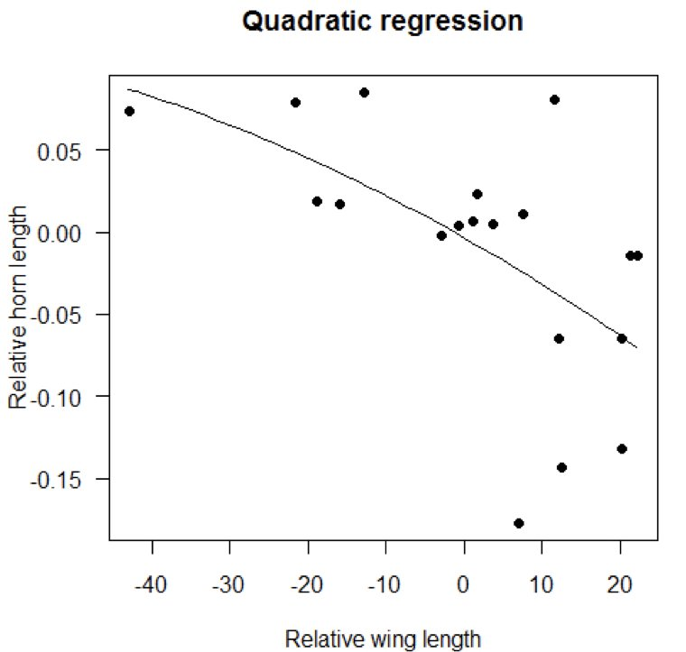{alt="Quadratic (polynomial degree 2) regression" fig-align="center" width="90%"}

## DRAFT: Quadratic Fit

```{r}
#| echo: false
#| eval: true
#| fig-width: 7
#| fig-height: 5

plot(beetle$wing, beetle$horn, pch = 16, cex = 1.3,
     xlab = "Wing length (mm)", ylab = "Horn length (mm)",
     main = "Quadratic: y = β₀ + β₁x + β₂x²", las = 1)
fit2 <- lm(horn ~ poly(wing, 2, raw = TRUE), data = beetle)
xseq <- seq(min(beetle$wing), max(beetle$wing), length.out = 200)
lines(xseq, predict(fit2, newdata = data.frame(wing = xseq)),
      lwd = 2, col = "red")
```

## Cubic Regression Fit

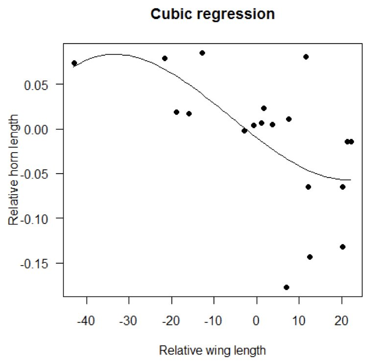{alt="Cubic (polynomial degree 3) regression" fig-align="center" width="90%"}

## DRAFT: Cubic Fit

```{r}
#| echo: false
#| eval: true
#| fig-width: 7
#| fig-height: 5

plot(beetle$wing, beetle$horn, pch = 16, cex = 1.3,
     xlab = "Wing length (mm)", ylab = "Horn length (mm)",
     main = "Cubic: y = β₀ + β₁x + β₂x² + β₃x³", las = 1)
fit3 <- lm(horn ~ poly(wing, 3, raw = TRUE), data = beetle)
lines(xseq, predict(fit3, newdata = data.frame(wing = xseq)),
      lwd = 2, col = "red")
```

## Higher-Order Polynomials

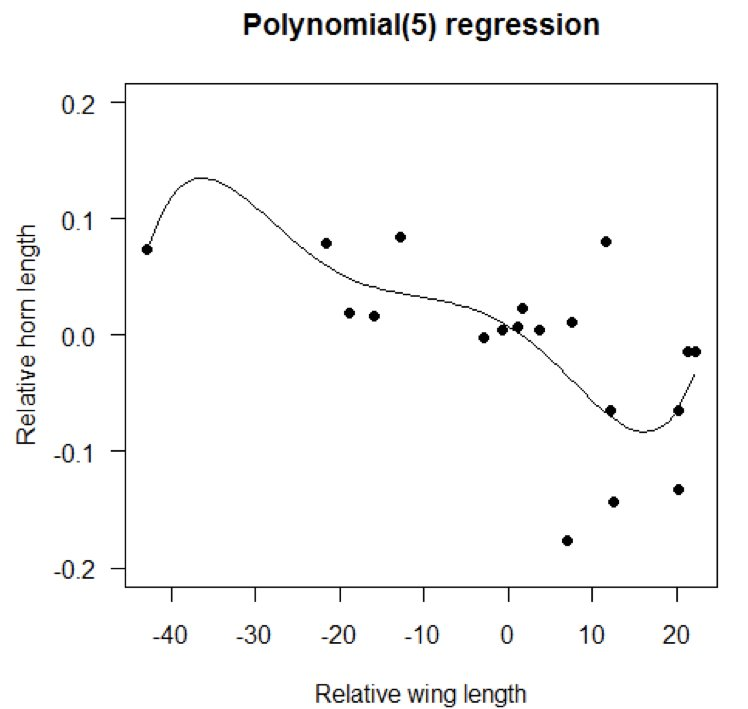{alt="Polynomial degree 5 regression" fig-align="center" width="90%"}

## DRAFT: Degree 5 Polynomial

```{r}
#| echo: false
#| eval: true
#| fig-width: 7
#| fig-height: 5

plot(beetle$wing, beetle$horn, pch = 16, cex = 1.3,
     xlab = "Wing length (mm)", ylab = "Horn length (mm)",
     main = "Polynomial degree 5", las = 1)
fit5 <- lm(horn ~ poly(wing, 5, raw = TRUE), data = beetle)
lines(xseq, predict(fit5, newdata = data.frame(wing = xseq)),
      lwd = 2, col = "red")
```

##

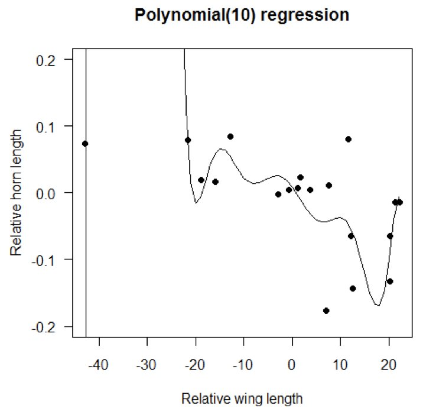{alt="Polynomial degree 10 regression - overfitting!" fig-align="center" width="90%"}

## DRAFT: Degree 10 Polynomial - Overfitting!

```{r}
#| echo: false
#| eval: true
#| fig-width: 7
#| fig-height: 5

plot(beetle$wing, beetle$horn, pch = 16, cex = 1.3,
     xlab = "Wing length (mm)", ylab = "Horn length (mm)",
     main = "Polynomial degree 10 — OVERFITTING", las = 1)
fit10 <- lm(horn ~ poly(wing, 10, raw = TRUE), data = beetle)
lines(xseq, predict(fit10, newdata = data.frame(wing = xseq)),
      lwd = 2, col = "red")
```

## Model Selection Visualization

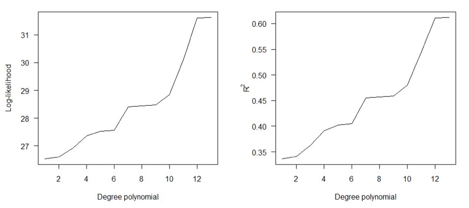{alt="Log-likelihood and R² vs polynomial degree" fig-align="center" width="90%"}

## DRAFT: Model Selection - Log-Likelihood and R²

```{r}
#| echo: false
#| eval: true
#| fig-width: 10
#| fig-height: 5

degrees <- 1:10
loglik <- sapply(degrees, function(d) {
  fit <- lm(horn ~ poly(wing, d, raw = TRUE), data = beetle)
  logLik(fit)
})
r2 <- sapply(degrees, function(d) {
  fit <- lm(horn ~ poly(wing, d, raw = TRUE), data = beetle)
  summary(fit)$r.squared
})

par(mfrow = c(1, 2), mar = c(5, 4, 3, 1))
plot(degrees, loglik, type = "b", pch = 16, cex = 1.5,
     xlab = "Polynomial degree", ylab = "Log-likelihood",
     main = "Log-likelihood vs. Degree", las = 1)
plot(degrees, r2, type = "b", pch = 16, cex = 1.5,
     xlab = "Polynomial degree", ylab = expression(R^2),
     main = expression(R^2 * " vs. Degree"), las = 1)
```

## Mallow's Cp Statistic

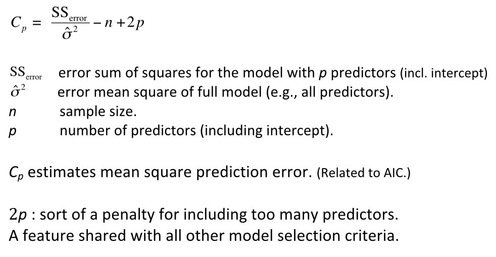{alt="Cp statistic for model selection" fig-align="center" width="90%"}

## DRAFT: Mallow's Cp Statistic

$$C_p = \frac{SS_{res,p}}{MS_{res,full}} - n + 2p$$

where:

- $SS_{res,p}$ = residual sum of squares for model with $p$ parameters
- $MS_{res,full}$ = residual mean square from the full model
- $n$ = sample size
- $p$ = number of parameters in the candidate model

A model with $C_p \approx p$ fits well without overfitting. Models with $C_p \gg p$ underfit; those with minimum $C_p$ are preferred.

::: callout-tip
## Summary

1.  **Always plot residuals** after fitting a model. The summary statistics ($R^2$, p-values) alone are not sufficient.

2.  A poor residual pattern does not mean your data are bad — it means **your model needs improvement**. Consider transformations, polynomial terms, or different model families.

3.  The BMP2 cream model shows a clear linear relationship with well-behaved residuals.

4.  The exercise model shows that forcing a linear fit on a potentially nonlinear relationship produces misleading residuals. Adding a quadratic term can resolve this.

5.  **Model selection is iterative**: fit, diagnose, improve, repeat.
:::

------------------------------------------------------------------------

# Model I vs Model II Regression {background-color="#2c3e50"}

## When to Use Model II Regression

**Model I (OLS) Regression:**

-   Assumes predictor X is measured **without error**
-   Y contains all the measurement error
-   Standard `lm()` in R

**Model II Regression:**

-   Both X and Y have **measurement error**
-   Neither variable is controlled/fixed
-   Use when both variables are random measurements

::: callout-note
Use Model II when both X and Y are biological measurements (e.g., body size vs organ size, two gene expression levels).
:::

## Model II Regression Methods

| Method | Abbreviation | Description |
|:-----------------------|:-----------------------|:-----------------------|
| **Major Axis** | MA | Minimizes perpendicular distances |
| **Standard Major Axis** | SMA | Geometric mean regression |
| **Ranged Major Axis** | RMA | Accounts for range differences |
| **Ordinary Least Squares** | OLS | Standard regression (for comparison) |

## Types of Linear Regression

Not all regression is created equal! The choice depends on **measurement error**:

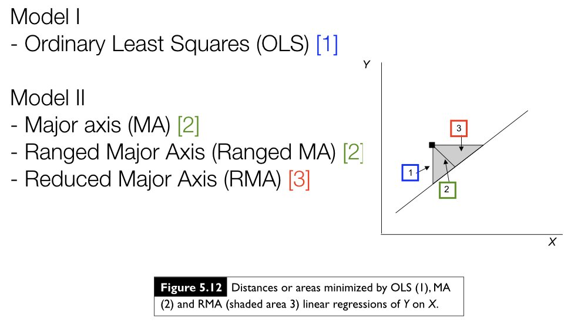{fig-align="center" width="80%"}

## DRAFT: Model I vs Model II Regression

```{r}
#| echo: false
#| eval: true
#| fig-width: 6
#| fig-height: 6

set.seed(42)
x <- rnorm(2, c(3, 8), c(0.5, 0.5))
y <- rnorm(2, c(3, 8), c(0.5, 0.5))

plot(x, y, pch = 15, cex = 2, xlim = c(0, 10), ylim = c(0, 10),
     xlab = "X", ylab = "Y", las = 1, main = "")
# OLS: vertical distance [1]
abline(a = 0.5, b = 0.9, lwd = 2)
segments(x[2], y[2], x[2], 0.5 + 0.9 * x[2], lwd = 2, lty = 1)
text(x[2] - 0.5, (y[2] + 0.5 + 0.9 * x[2]) / 2, "1", cex = 1.5, col = "blue")

# MA: perpendicular distance [2]
text(x[2] + 1, y[2] + 0.5, "3", cex = 1.5, col = "darkgreen")

# RMA: area [3]
text(x[2] + 0.3, y[2] - 1.5, "2", cex = 1.5, col = "red")
```

**Model I** — Ordinary Least Squares (OLS) [1]: minimizes vertical distances

**Model II** — Major axis (MA) [2]: minimizes perpendicular distances; Reduced Major Axis (RMA) [3]: minimizes area of triangles

## Regression Type Examples

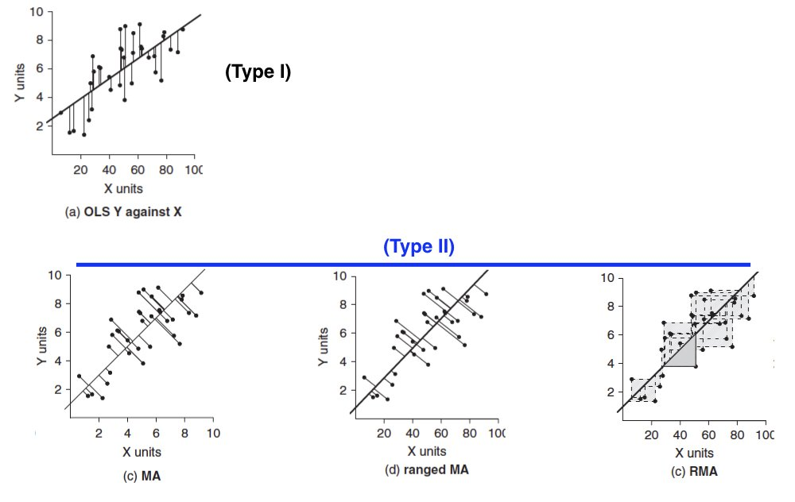{fig-align="center" width="90%"}

## DRAFT: OLS, MA, and RMA Comparison

```{r}
#| echo: false
#| eval: true
#| fig-width: 10
#| fig-height: 4

set.seed(42)
n <- 20
x <- runif(n, 10, 90)
y <- 0.1 * x + rnorm(n, 0, 1)

par(mfrow = c(1, 4), mar = c(4, 4, 3, 1))

# (a) OLS Y on X
plot(x, y, pch = 16, cex = 1.2, xlab = "X units", ylab = "Y units",
     main = "(a) OLS Y against X", cex.main = 0.9, las = 1, xlim = c(0, 100), ylim = c(-2, 12))
fit_ols <- lm(y ~ x)
abline(fit_ols, lwd = 2)
segments(x, fitted(fit_ols), x, y, lwd = 0.5)

# (b) MA
plot(x, y, pch = 16, cex = 1.2, xlab = "X units", ylab = "Y units",
     main = "(b) MA", cex.main = 0.9, las = 1, xlim = c(0, 100), ylim = c(-2, 12))
# MA: perpendicular projection
sx <- sd(x); sy <- sd(y)
slope_ma <- (sy^2 - sx^2 + sqrt((sy^2 - sx^2)^2 + 4 * cov(x,y)^2)) / (2 * cov(x,y))
int_ma <- mean(y) - slope_ma * mean(x)
abline(a = int_ma, b = slope_ma, lwd = 2)

# (c) Ranged MA
plot(x, y, pch = 16, cex = 1.2, xlab = "X units", ylab = "Y units",
     main = "(c) Ranged MA", cex.main = 0.9, las = 1, xlim = c(0, 100), ylim = c(-2, 12))
abline(a = int_ma, b = slope_ma, lwd = 2)

# (d) RMA
plot(x, y, pch = 16, cex = 1.2, xlab = "X units", ylab = "Y units",
     main = "(d) RMA", cex.main = 0.9, las = 1, xlim = c(0, 100), ylim = c(-2, 12))
slope_rma <- sign(cor(x, y)) * sy / sx
int_rma <- mean(y) - slope_rma * mean(x)
abline(a = int_rma, b = slope_rma, lwd = 2)
```

## When to Use Each Model Type

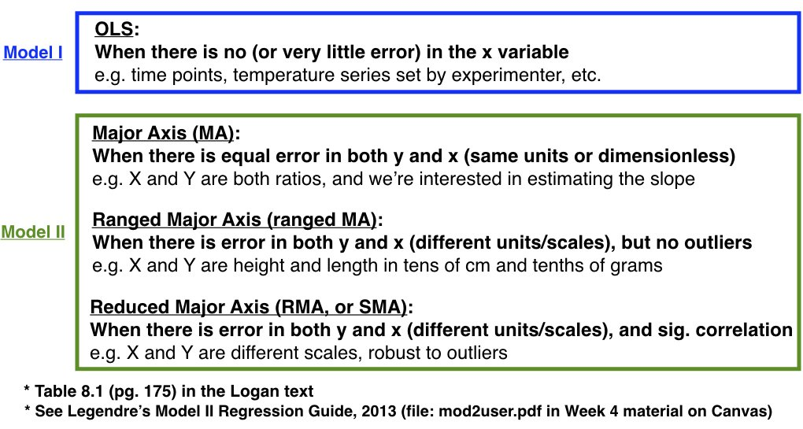{fig-align="center" width="90%"}

## DRAFT: When to Use Each Regression Type

| | **Method** | **When to use** | **Example** |
|:---|:---|:---|:---|
| **Model I** | **OLS** | No (or very little) error in x variable | Time points, temperature set by experimenter |
| **Model II** | **Major Axis (MA)** | Equal error in both y and x (same units or dimensionless) | X and Y are both ratios; interested in estimating slope |
| | **Ranged MA** | Error in both y and x (different units/scales), no outliers | Height in cm and length in tenths of grams |
| | **Reduced MA (RMA, SMA)** | Error in both y and x (different scales), significant correlation | X and Y are different scales, robust to outliers |

*Table 8.1 (pg. 175) in the Logan text. See also Legendre's Model II Regression Guide, 2013.*

## Model II Regression with lmodel2

```{r}
#| eval: false
#| echo: true

library(lmodel2)

# Model II regression when both X and Y have measurement error
# Example: comparing two measurement methods
mod2 <- lmodel2(Y ~ X, data = mydata, range.y = "relative", range.x = "relative")

# Returns OLS, MA, SMA (RMA), and ranged major axis results
summary(mod2)
plot(mod2)
```

::: callout-note
Use Model II regression when: - Both variables have measurement error - Neither variable is experimentally controlled - You're comparing methods or studying allometry
:::

## Model II Regression in R

```{r}
#| label: model2-regression
#| eval: false
#| echo: true

# Install and load lmodel2 package
# install.packages("lmodel2")
library(lmodel2)

# Fit Model II regression
model2_result <- lmodel2(y ~ x, data = mydata)

# View results - provides OLS, MA, and SMA estimates
model2_result

# Plot with different regression lines
plot(mydata$x, mydata$y, pch = 19)
abline(model2_result$regression.results[2, 2],  # MA intercept
       model2_result$regression.results[2, 3],  # MA slope
       col = "blue", lty = 2)
abline(model2_result$regression.results[3, 2],  # SMA intercept
       model2_result$regression.results[3, 3],  # SMA slope
       col = "red", lty = 3)
```

## Choosing Between Model I and II

::: callout-tip
## Decision Guide

Use **Model I (OLS)** when:

-   X is controlled/manipulated experimentally
-   X is measured with negligible error
-   Goal is prediction of Y from X

Use **Model II (SMA/MA)** when:

-   Both variables are random biological measurements
-   Both have comparable measurement error
-   Goal is to describe the functional relationship
:::
