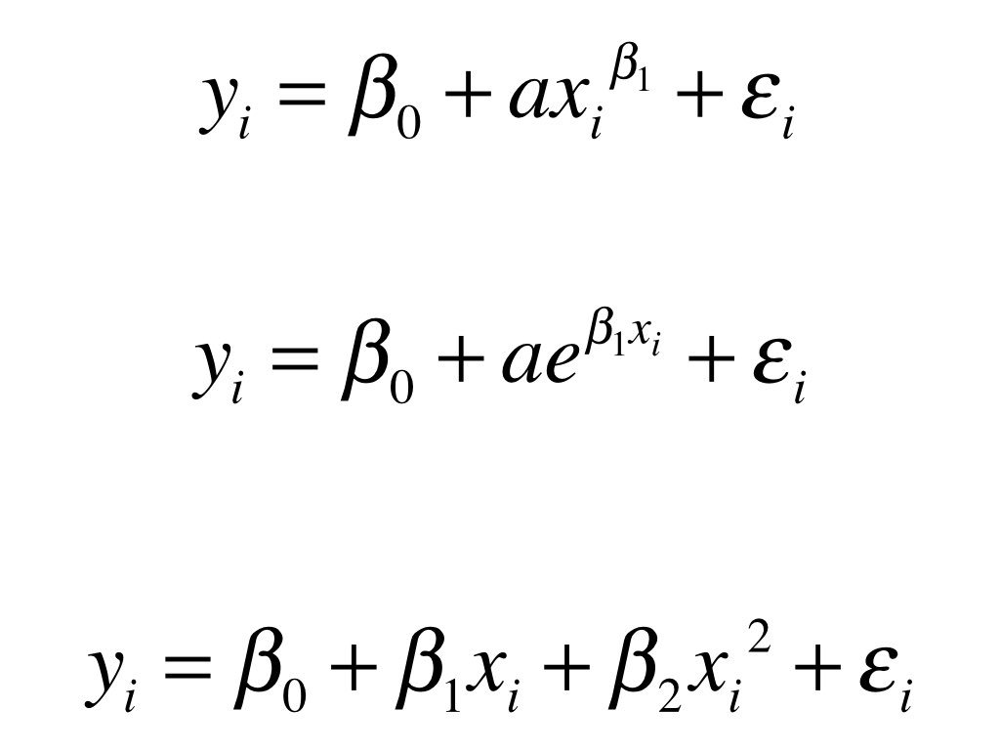
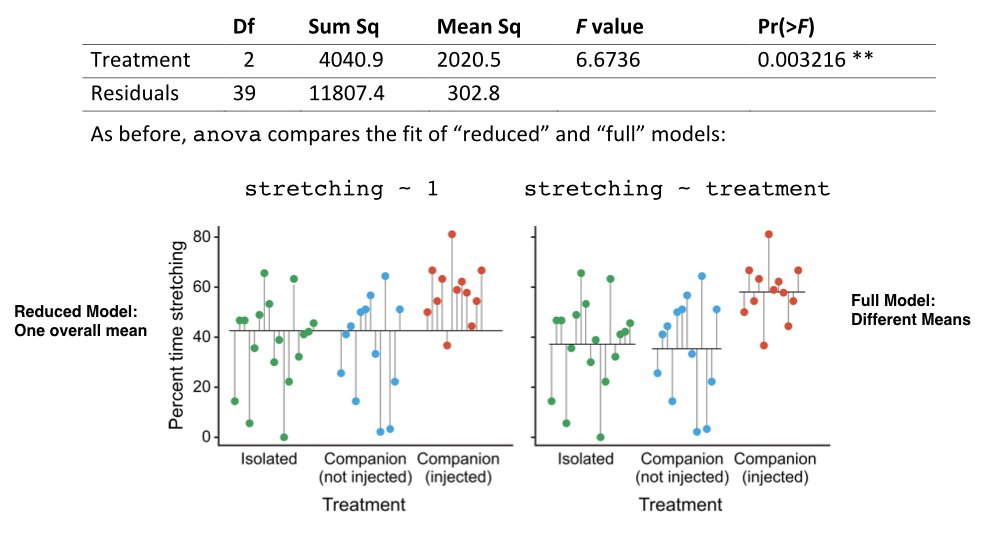
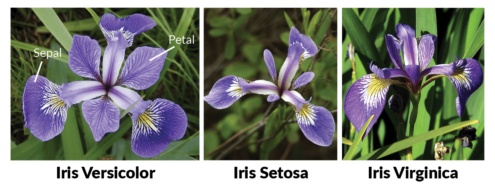
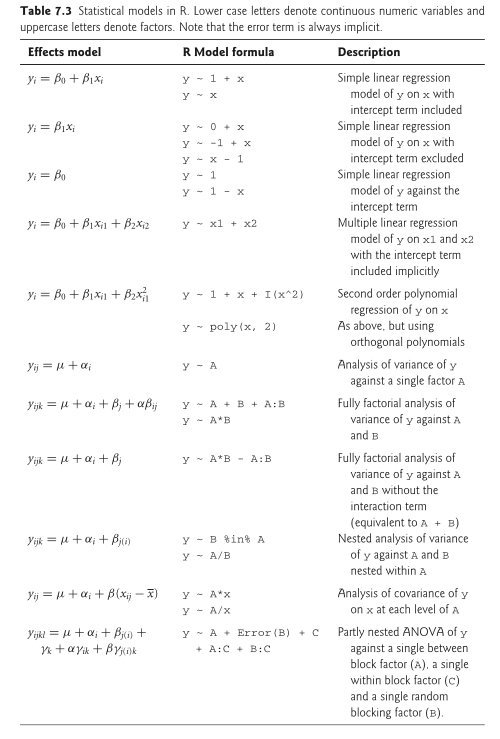

```{r}
#| label: setup
#| include: false

# Core data manipulation and visualization
library(tidyverse)
library(knitr)
library(readxl)

# Statistical analysis packages
library(MASS)        # LDA, robust regression
library(pwr)         # Power analysis
library(boot)        # Bootstrap methods
library(car)         # Companion to Applied Regression
library(survival)    # Survival analysis
library(nlme)        # Mixed effects models
library(broom)       # Tidy model output
library(emmeans)     # Estimated marginal means
library(lmodel2)     # Model II regression
library(patchwork)   # Combine multiple plots
library(ggfortify)   # Diagnostic plots for lm objects

# Set consistent theme for all plots
theme_set(theme_minimal(base_size = 14))

# Set seed for reproducibility
set.seed(2026)
```

# Finish Linear Models and Analysis of Variance (ANOVA) {background-color="#d4edda"}

## Week 6 Topics

::: incremental
-   Eugenics history of statistical analysis
-   Polynomial Regression
-   Type 1 and Type 2 Regression
-   Analysis of Variance (ANOVA)
-   Single factor ANOVA
-   Planned & post hoc comparisons
-   Analysis of Covariance (ANCOVA)
:::

**Readings:** Chapters 25-27

## Packages for This Week

```{r}
#| eval: false
#| echo: true

# Install new packages (run once)
install.packages("car")
install.packages("lmodel2")
install.packages("patchwork")
install.packages("ggfortify")

# Load packages
library(tidyverse)    # Data manipulation & visualization
library(knitr)        # Formatted tables with kable()
library(broom)        # Tidy model output (tidy, glance)
library(car)          # Companion to Applied Regression (Type II/III SS, Levene's test)
library(pwr)          # Power analysis (from Week 4)
library(emmeans)      # Estimated marginal means & pairwise comparisons
library(lmodel2)      # Model II regression
library(patchwork)    # Combine multiple plots side by side
library(ggfortify)    # Diagnostic plots for lm objects (autoplot)
```

**Built-in datasets used this week:** `iris` (Iris plant data), `PlantGrowth` (plant weight by treatment)

**Other datasets used this week:** `grip_strength_data.csv`, `cell_culture_expression.csv`

<!-- ================================================================ -->

<!--  EUGENICS SECTION                                                -->

<!-- ================================================================ -->

# The Eugenics History of Statistics {background-color="#d4edda"}

## Galton's parent-offspring regression

-   Last week we discussed how Galton developed the concept of regression to the mean using height data from parents and their children.
-   This week we need to confront the darker side of that history — the statistical methods we use daily were developed in the service of eugenics.

{fig-align="center" width="100%"}

## Galton as the Father of Eugenics

{fig-align="center"}

-   Francis Galton: Darwin's half cousin
-   Studied human variation and genetic inheritance
    -   Human height, fingerprints, intelligence
    -   Correlation, regression toward the mean, and "nature versus nurture"
    -   Pioneered twin studies

## Galton as the Father of Eugenics

-   Believed that intelligence was hereditary based on surveying prominent academics in Europe
-   Used the ideas of **correlation** and **regression towards the mean** to argue that the upper class should breed amongst themselves to keep those "good genes" pure
-   Wanted to provide monetary incentives for "good" couples to marry and reproduce as a way to avoid the upper class being genetically 'muddied' by the lower classes

## RA Fisher and Eugenics in London

-   Developer of Fishers exact test, analysis of variance (ANOVA), null hypothesis, p values, maximum likelihood, probability density functions
-   Founding Chairman of the University of Cambridge Eugenics Society

{fig-align="center" width="20%"}

## RA Fisher and Eugenics

-   1/3rd of his work "The Genetical Theory of Natural Selection" discussed eugenics and his theory that the fall of civilizations was due to the fertility of their upper classes being diminished
-   Used these statistical methods to test data on human variation to prove biological differences between human races
-   Eugenics and racism were the primary motivators for many of these statistical tests that we use today

## Eugenics in the U.S.

{fig-align="center" width="50%"}

-   Galton's ideas were brought to the United States by Charles Davenport, a biologist who established the Eugenics Record Office at Cold Spring Harbor in 1910.
-   G. Stanley Hall, a prominent psychologist who promoted the "child study" movement and was the first president of Clark University.

## 

{fig-align="center" width="80%"}

## Eugenics societies in the U.S.

-   Advocated for state laws to ban interracial marriages and promote sterilization of "unfit" individuals (negative eugenics) - especially black, Latinx, and Native American women
-   30 states passed laws to force mental institution patients to be sterilized
-   Between 1907 and 1963, over 64,000 individuals were forcibly sterilized under eugenic legislation in the United States

## A common sight at state fairs around the U.S. in the 1930s

-   Competitions for the "perfect family" to encourage public consciousness and support for eugenics

{fig-align="center" width="50%"}

## A direct line to Hitler and Nazism

-   Eugenics existed in America (and England) before it became popular in Germany.
-   By 1933, California had subjected more people to forceful sterilization than all other U.S. states combined.
-   The forced sterilization program engineered by the Nazis was partly inspired by California's.

{fig-align="center" width="70%"}

## Sterilizations continued in America

-   It wasn't until 1978 that the US passed regulations on sterilization procedures
-   California only passed a bill to outlaw sterilization of inmates in 2014
-   Certain members of the genetic engineering community threaten to bring back eugenics ideas
-   Our current President repeats eugenics talking points

## So, what do we do from here?

-   The statistical methods that Galton, Fisher, and others developed are useful science tools
-   Important to use these tools for good - improving our planet, human health, and technological advances
-   Important to acknowledge and not forget the history of science - educate others to avoid repeating history

## Interested in learning more?

{fig-align="center" width="20%"}

-   See also
    -   "The Gene" by Siddhartha Mukherjee
    -   "Control" by Adam Rutherford

<!-- ================================================================ -->

<!--  POLYNOMIAL REGRESSION                                           -->

<!-- ================================================================ -->

# Polynomial Regression {background-color="#d4edda"}

## Motivation for Polynomial Regression

-   We now return to the grip strength dataset from last week.
-   When we fit a simple linear regression of grip strength on exercise hours, the residual plots suggested curvature — the loess smoother deviated from zero in a systematic way.
-   This is a signal that the true relationship between exercise hours and grip strength may be **nonlinear**.
-   A polynomial regression extends the linear model by adding powers of $x$ as additional predictors. For a quadratic (degree 2) polynomial:

$$y_i = \beta_0 + \beta_1 x_i + \beta_2 x_i^2 + \epsilon_i$$

-   This is still a **linear model** in the statistical sense (the parameters $\beta$ enter linearly), but the relationship between $y$ and $x$ is now curved.
-   A quadratic term can capture a U-shape or inverted-U pattern that a straight line would miss.

## Import the Data and Fit Linear Model

```{r}
#| label: grip-import-code
#| echo: true
#| eval: true

grip <- read_csv("grip_strength_data.csv")

# Fit linear model for later comparison
lm_exercise <- lm(grip_strength_kg ~ exercise_hrs_week, data = grip)
```

## Fitting a Polynomial Model

::: panel-tabset
### Output

```{r}
#| label: poly-exercise-output
#| echo: false

lm_exercise_poly <- lm(grip_strength_kg ~ poly(exercise_hrs_week, 2, raw = TRUE), data = grip)
summary(lm_exercise_poly)
```

### Code

```{r}
#| label: poly-exercise-code
#| echo: true
#| eval: false

# Fit linear model for comparison
lm_exercise <- lm(grip_strength_kg ~ exercise_hrs_week, data = grip)

# Fit quadratic polynomial: grip_strength ~ exercise + exercise^2
lm_exercise_poly <- lm(grip_strength_kg ~ poly(exercise_hrs_week, 2, raw = TRUE), 
                        data = grip)
summary(lm_exercise_poly)
```

The `raw = TRUE` argument means R uses the raw polynomial terms ($x$ and $x^2$) rather than orthogonal polynomials, making the coefficients directly interpretable.
:::

## Interpreting the Polynomial Model

-   The `tidy()` output shows three coefficients: the intercept ($\beta_0$), the linear term ($\beta_1$), and the quadratic term ($\beta_2$).
-   If the p-value for the quadratic term is significant, it confirms that the curved relationship is real and not just noise.
-   The `glance()` output gives the overall model fit. Compare this $R^2$ with the linear model — does adding the quadratic term meaningfully improve the fit?

::: panel-tabset
### Output

```{r}
#| label: poly-exercise-tidy-output
#| echo: false

tidy(lm_exercise_poly) |> kable(digits = 4)
```

```{r}
#| label: poly-exercise-glance-output
#| echo: false

glance(lm_exercise_poly) |> kable(digits = 4)
```

### Code

```{r}
#| label: poly-exercise-tidy-code
#| echo: true
#| eval: false

tidy(lm_exercise_poly) |> kable(digits = 4)
glance(lm_exercise_poly) |> kable(digits = 4)
```
:::

## Comparing Linear vs. Polynomial Fit

-   We can formally compare the linear and polynomial models using `anova()`, which performs an **F-test** of nested models.
-   Because the linear model is a special case of the polynomial model (with $\beta_2 = 0$), we can test whether the additional quadratic term significantly improves the fit.
-   A significant p-value means the quadratic term explains additional variance beyond the linear term alone.
-   This is conceptually similar to the model comparison approach we will use in ANOVA later today.

::: panel-tabset
### Output

```{r}
#| label: anova-compare-output
#| echo: false

anova(lm_exercise, lm_exercise_poly)
```

### Code

```{r}
#| label: anova-compare-code
#| echo: true
#| eval: false

# Compare nested models: linear vs. quadratic
anova(lm_exercise, lm_exercise_poly)
```
:::

## Visualizing the Polynomial Fit

::: panel-tabset
### Output

```{r}
#| label: ggplot-poly-output
#| echo: false
#| fig-width: 8
#| fig-height: 5

ggplot(grip, aes(x = exercise_hrs_week, y = grip_strength_kg)) +
  geom_point(color = "darkorange", alpha = 0.6, size = 2) +
  geom_smooth(method = "lm", formula = y ~ poly(x, 2), 
              se = TRUE, color = "darkgreen", fill = "darkgreen", alpha = 0.2) +
  labs(x = "Exercise (hours/week)", y = "Grip Strength (kg)",
       title = "Grip Strength vs. Exercise Hours — Polynomial Fit",
       subtitle = paste0("Quadratic fit: R-sq = ", round(summary(lm_exercise_poly)$r.squared, 3)))
```

### Code

```{r}
#| label: ggplot-poly-code
#| echo: true
#| eval: false

ggplot(grip, aes(x = exercise_hrs_week, y = grip_strength_kg)) +
  geom_point(color = "darkorange", alpha = 0.6, size = 2) +
  geom_smooth(method = "lm", formula = y ~ poly(x, 2), 
              se = TRUE, color = "darkgreen", fill = "darkgreen", alpha = 0.2) +
  labs(x = "Exercise (hours/week)", y = "Grip Strength (kg)",
       title = "Grip Strength vs. Exercise Hours — Polynomial Fit",
       subtitle = paste0("Quadratic fit: R-sq = ", 
                         round(summary(lm_exercise_poly)$r.squared, 3)))
```
:::

## Linear vs. Polynomial: Side by Side

::: panel-tabset
### Output

```{r}
#| label: ggplot-compare-fits-output
#| echo: false
#| fig-width: 12
#| fig-height: 5

p_lin <- ggplot(grip, aes(x = exercise_hrs_week, y = grip_strength_kg)) +
  geom_point(color = "darkorange", alpha = 0.6, size = 2) +
  geom_smooth(method = "lm", se = TRUE, color = "firebrick", fill = "firebrick", alpha = 0.2) +
  labs(x = "Exercise (hours/week)", y = "Grip Strength (kg)",
       title = "Linear Fit",
       subtitle = paste0("R-sq = ", round(summary(lm_exercise)$r.squared, 3)))

p_poly <- ggplot(grip, aes(x = exercise_hrs_week, y = grip_strength_kg)) +
  geom_point(color = "darkorange", alpha = 0.6, size = 2) +
  geom_smooth(method = "lm", formula = y ~ poly(x, 2), 
              se = TRUE, color = "darkgreen", fill = "darkgreen", alpha = 0.2) +
  labs(x = "Exercise (hours/week)", y = "Grip Strength (kg)",
       title = "Quadratic Fit",
       subtitle = paste0("R-sq = ", round(summary(lm_exercise_poly)$r.squared, 3)))

p_lin + p_poly
```

### Code

```{r}
#| label: ggplot-compare-fits-code
#| echo: true
#| eval: false

p_lin <- ggplot(grip, aes(x = exercise_hrs_week, y = grip_strength_kg)) +
  geom_point(color = "darkorange", alpha = 0.6, size = 2) +
  geom_smooth(method = "lm", se = TRUE, color = "firebrick", 
              fill = "firebrick", alpha = 0.2) +
  labs(x = "Exercise (hours/week)", y = "Grip Strength (kg)",
       title = "Linear Fit",
       subtitle = paste0("R-sq = ", round(summary(lm_exercise)$r.squared, 3)))

p_poly <- ggplot(grip, aes(x = exercise_hrs_week, y = grip_strength_kg)) +
  geom_point(color = "darkorange", alpha = 0.6, size = 2) +
  geom_smooth(method = "lm", formula = y ~ poly(x, 2), 
              se = TRUE, color = "darkgreen", fill = "darkgreen", alpha = 0.2) +
  labs(x = "Exercise (hours/week)", y = "Grip Strength (kg)",
       title = "Quadratic Fit",
       subtitle = paste0("R-sq = ", round(summary(lm_exercise_poly)$r.squared, 3)))

p_lin + p_poly
```
:::

## Residuals: Linear vs. Polynomial

::: panel-tabset
### Output

```{r}
#| label: resid-compare-output
#| echo: false
#| fig-width: 12
#| fig-height: 5

lin_diag <- data.frame(fitted = fitted(lm_exercise), residuals = residuals(lm_exercise), model = "Linear")
poly_diag <- data.frame(fitted = fitted(lm_exercise_poly), residuals = residuals(lm_exercise_poly), model = "Quadratic")
both_diag <- rbind(lin_diag, poly_diag)

ggplot(both_diag, aes(x = fitted, y = residuals)) +
  geom_point(alpha = 0.5, size = 2) +
  geom_hline(yintercept = 0, linetype = "dashed", color = "red", linewidth = 0.8) +
  geom_smooth(method = "loess", se = FALSE, color = "darkorange", linewidth = 1) +
  facet_wrap(~ model, scales = "free_x") +
  labs(x = "Fitted Values", y = "Residuals",
       title = "Residuals vs. Fitted — Linear vs. Quadratic Exercise Model")
```

### Code

```{r}
#| label: resid-compare-code
#| echo: true
#| eval: false

lin_diag <- data.frame(fitted = fitted(lm_exercise), 
                       residuals = residuals(lm_exercise), model = "Linear")
poly_diag <- data.frame(fitted = fitted(lm_exercise_poly), 
                        residuals = residuals(lm_exercise_poly), model = "Quadratic")
both_diag <- rbind(lin_diag, poly_diag)

ggplot(both_diag, aes(x = fitted, y = residuals)) +
  geom_point(alpha = 0.5, size = 2) +
  geom_hline(yintercept = 0, linetype = "dashed", color = "red", linewidth = 0.8) +
  geom_smooth(method = "loess", se = FALSE, color = "darkorange", linewidth = 1) +
  facet_wrap(~ model, scales = "free_x") +
  labs(x = "Fitted Values", y = "Residuals",
       title = "Residuals vs. Fitted — Linear vs. Quadratic Exercise Model")
```
:::

## Full Diagnostics: Polynomial Model

-   The `autoplot()` function from `ggfortify` produces four standard diagnostic plots: Residuals vs. Fitted, Normal Q-Q, Scale-Location, and Cook's Distance.
-   Together these help assess whether the model assumptions of linearity, normality, and constant variance are met.

::: panel-tabset
### Output

```{r}
#| label: ggfortify-poly-output
#| echo: false
#| fig-width: 10
#| fig-height: 7

autoplot(lm_exercise_poly, which = 1:4, ncol = 2) +
  theme_minimal(base_size = 12)
```

### Code

```{r}
#| label: ggfortify-poly-code
#| echo: true
#| eval: false

autoplot(lm_exercise_poly, which = 1:4, ncol = 2) +
  theme_minimal(base_size = 12)
```
:::

## Nonlinear vs. Nonlinear in the Parameters

-   Polynomial regression is still a **linear model** — the parameters enter linearly
-   True **nonlinear models** have parameters that enter nonlinearly (e.g., exponential growth, power functions):

$$y_i = \beta_0 + a x_i^{\beta_1} + \varepsilon_i \qquad \qquad y_i = \beta_0 + a e^{\beta_1 x_i} + \varepsilon_i$$

{fig-align="center" width="80%"}

-   All regression models are only valid **within the range of the observed data** — polynomial models are especially dangerous to extrapolate

<!-- ================================================================ -->

<!--  MODEL I VS MODEL II REGRESSION                                  -->

<!-- ================================================================ -->

# Model I vs Model II Regression {background-color="#d4edda"}

## When to Use Model II Regression

-   So far all of our regression models have been **Model I (OLS)**, which assumes the predictor X is measured without error and only Y contains random variation.
-   This is appropriate when X is experimentally controlled — like when we set BMP2 cream concentrations or record exercise hours from a questionnaire.
-   But what happens when **both variables are random biological measurements** with their own measurement error?
-   Standard OLS regression will **underestimate** the true slope because it ignores error in X.
-   **Model II Regression** addresses this by accounting for measurement error in both variables. Use it when neither variable is experimentally controlled — for example, comparing two gene expression levels, body size vs. organ size, or two measurement instruments.

## Types of Linear Regression

{fig-align="center" width="80%"}

## Model II Regression Methods

| Method | Abbreviation | Description |
|:---|:---|:---|
| **Major Axis** | MA | Minimizes perpendicular distances to the line |
| **Standard Major Axis** | SMA | Geometric mean regression; scales both axes equally |
| **Ranged Major Axis** | RMA | Accounts for range differences between X and Y |
| **Ordinary Least Squares** | OLS | Standard regression (for comparison only) |

The key insight is that OLS minimizes vertical distances (residuals in Y only), while Model II methods minimize distances in **both dimensions**. This matters whenever X and Y have comparable measurement error.

## When to Use Each Model Type

{fig-align="center" width="90%"}

## Example: BMP4 vs. SOX9 Expression

-   To illustrate the difference between Model I and Model II regression, we will use the gene expression data from the cell culture experiment we analyzed last week.
-   Recall that this dataset contains BMP4 and SOX9 expression from 80 stem cell cultures measured by qPCR.
-   Because both measurements come from the same assay and neither variable was experimentally controlled, both have comparable measurement error — making this a natural candidate for Model II regression.
-   But first, we need to deal with the outliers we identified last week.

```{r}
#| label: cell-import
#| echo: true
#| eval: true

cell_raw <- read_csv("cell_culture_expression.csv")
```

## Recall: Outliers in the Cell Culture Data

::: panel-tabset
### Output

```{r}
#| label: cell-raw-scatter-output
#| echo: false
#| fig-width: 8
#| fig-height: 5

ggplot(cell_raw, aes(x = bmp4_expression, y = sox9_expression)) +
  geom_point(color = "steelblue", alpha = 0.7, size = 2.5) +
  geom_text(aes(label = sample_id), size = 2.2, nudge_y = 0.5, color = "gray40",
            check_overlap = TRUE) +
  labs(x = "BMP4 Expression", y = "SOX9 Expression",
       title = "BMP4 vs. SOX9 Expression — Raw Data with Sample IDs")
```

### Code

```{r}
#| label: cell-raw-scatter-code
#| echo: true
#| eval: false

ggplot(cell_raw, aes(x = bmp4_expression, y = sox9_expression)) +
  geom_point(color = "steelblue", alpha = 0.7, size = 2.5) +
  geom_text(aes(label = sample_id), size = 2.2, nudge_y = 0.5, color = "gray40",
            check_overlap = TRUE) +
  labs(x = "BMP4 Expression", y = "SOX9 Expression",
       title = "BMP4 vs. SOX9 Expression — Raw Data with Sample IDs")
```
:::

## Remove Outliers Identified Last Week

From our Week 5 analysis, we identified four problematic observations using Cook's distance:

-   **SC012** and **SC055**: BMP4 values of \~100-165 when the bulk of the data is 0-50 — likely data entry errors (misplaced decimal)
-   **SC037**: SOX9 value of \~28 when the rest is 0.5-8 — another likely data entry error
-   **SC060**: High leverage *and* high residual — a high influence point pulling the regression line

::: panel-tabset
### Output

```{r}
#| label: cell-remove-output
#| echo: false

remove_ids <- c("SC012", "SC037", "SC055", "SC060")

cell <- cell_raw |>
  filter(!sample_id %in% remove_ids)

cat("Original observations:", nrow(cell_raw), "\n")
cat("Removed:", length(remove_ids), "observations:", paste(remove_ids, collapse = ", "), "\n")
cat("Remaining observations:", nrow(cell), "\n")
```

### Code

```{r}
#| label: cell-remove-code
#| echo: true
#| eval: false

# Remove data entry errors and the high influence point identified in Week 5
remove_ids <- c("SC012", "SC037", "SC055", "SC060")

cell <- cell_raw |>
  filter(!sample_id %in% remove_ids)

cat("Original observations:", nrow(cell_raw), "\n")
cat("Removed:", length(remove_ids), "observations:", paste(remove_ids, collapse = ", "), "\n")
cat("Remaining observations:", nrow(cell), "\n")
```
:::

::: callout-important
Always clean your data before fitting models. Outliers — especially data entry errors — can distort both OLS and Model II regression estimates. We documented our reasoning for these removals last week.
:::

## Visualizing the Cleaned Data

::: panel-tabset
### Output

```{r}
#| label: cell-scatter-output
#| echo: false
#| fig-width: 7
#| fig-height: 5

ggplot(cell, aes(x = bmp4_expression, y = sox9_expression)) +
  geom_point(color = "steelblue", alpha = 0.7, size = 2) +
  labs(x = "BMP4 Expression", y = "SOX9 Expression",
       title = "BMP4 vs. SOX9 Expression — Cleaned Data")
```

### Code

```{r}
#| label: cell-scatter-code
#| echo: true
#| eval: false

ggplot(cell, aes(x = bmp4_expression, y = sox9_expression)) +
  geom_point(color = "steelblue", alpha = 0.7, size = 2) +
  labs(x = "BMP4 Expression", y = "SOX9 Expression",
       title = "BMP4 vs. SOX9 Expression — Cleaned Data")
```
:::

## Model I (OLS) Fit for Comparison

-   First, let's fit the standard OLS regression on the cleaned data.
-   Remember that this approach assumes all measurement error is in Y (SOX9) and none in X (BMP4) — an assumption we know is incorrect here.

::: panel-tabset
### Output

```{r}
#| label: cell-ols-output
#| echo: false

lm_cell <- lm(sox9_expression ~ bmp4_expression, data = cell)
tidy(lm_cell) |> kable(digits = 4)
```

```{r}
#| label: cell-ols-glance
#| echo: false

glance(lm_cell) |> kable(digits = 4)
```

### Code

```{r}
#| label: cell-ols-code
#| echo: true
#| eval: false

lm_cell <- lm(sox9_expression ~ bmp4_expression, data = cell)
tidy(lm_cell) |> kable(digits = 4)
glance(lm_cell) |> kable(digits = 4)
```
:::

## Model II Regression with lmodel2

Now let's fit the Model II regression using the `lmodel2` package. This function returns results for OLS, MA, SMA, and RMA all at once, so we can directly compare how each method estimates the slope.

::: panel-tabset
### Output

```{r}
#| label: cell-model2-output
#| echo: false

mod2_cell <- lmodel2(sox9_expression ~ bmp4_expression, data = cell, 
                      range.y = "relative", range.x = "relative", nperm = 999)
mod2_cell
```

### Code

```{r}
#| label: cell-model2-code
#| echo: true
#| eval: false

library(lmodel2)

# Model II regression: both variables have measurement error
mod2_cell <- lmodel2(sox9_expression ~ bmp4_expression, data = cell, 
                      range.y = "relative", range.x = "relative", nperm = 999)
mod2_cell
```

-   `range.y = "relative"` and `range.x = "relative"` tell `lmodel2` to use the relative ranges of X and Y when computing the RMA regression
-   `nperm = 999` runs a permutation test for the slope
:::

## Comparing OLS vs. Model II

-   The plot below overlays the OLS (Model I) line with the Major Axis and SMA (Model II) lines.
-   Notice how the Model II slopes are **steeper** than OLS — this is expected because OLS underestimates the true slope when X has measurement error.

::: panel-tabset
### Output

```{r}
#| label: cell-compare-plot-output
#| echo: false
#| fig-width: 8
#| fig-height: 5

reg_results <- mod2_cell$regression.results

ggplot(cell, aes(x = bmp4_expression, y = sox9_expression)) +
  geom_point(color = "gray40", alpha = 0.6, size = 2) +
  geom_abline(intercept = reg_results[1, 2], slope = reg_results[1, 3],
              color = "firebrick", linewidth = 1, linetype = "solid") +
  geom_abline(intercept = reg_results[2, 2], slope = reg_results[2, 3],
              color = "blue", linewidth = 1, linetype = "dashed") +
  geom_abline(intercept = reg_results[3, 2], slope = reg_results[3, 3],
              color = "darkgreen", linewidth = 1, linetype = "dotdash") +
  labs(x = "BMP4 Expression", y = "SOX9 Expression",
       title = "Comparing Regression Methods: OLS vs. Model II (Cleaned Data)",
       subtitle = "Red = OLS, Blue = Major Axis, Green = SMA")
```

### Code

```{r}
#| label: cell-compare-plot-code
#| echo: true
#| eval: false

# Extract regression coefficients from lmodel2 results
reg_results <- mod2_cell$regression.results

ggplot(cell, aes(x = bmp4_expression, y = sox9_expression)) +
  geom_point(color = "gray40", alpha = 0.6, size = 2) +
  geom_abline(intercept = reg_results[1, 2], slope = reg_results[1, 3],
              color = "firebrick", linewidth = 1, linetype = "solid") +
  geom_abline(intercept = reg_results[2, 2], slope = reg_results[2, 3],
              color = "blue", linewidth = 1, linetype = "dashed") +
  geom_abline(intercept = reg_results[3, 2], slope = reg_results[3, 3],
              color = "darkgreen", linewidth = 1, linetype = "dotdash") +
  labs(x = "BMP4 Expression", y = "SOX9 Expression",
       title = "Comparing Regression Methods: OLS vs. Model II (Cleaned Data)",
       subtitle = "Red = OLS, Blue = Major Axis, Green = SMA")
```
:::

## Choosing Between Model I and II

::: callout-tip
## Decision Guide

Use **Model I (OLS)** when:

-   X is controlled/manipulated experimentally
-   X is measured with negligible error
-   Goal is prediction of Y from X

Use **Model II (SMA/MA)** when:

-   Both variables are random biological measurements
-   Both have comparable measurement error
-   Goal is to describe the functional relationship
:::

-   In our grip strength data, exercise hours were self-reported (not controlled), but we treated them as a predictor, so Model I was reasonable.
-   For the BMP4/SOX9 expression data, both come from the same assay with comparable error, so Model II is the better choice.

## Key Takeaways: Regression Models

::: callout-tip
## Summary

1.  **Always plot residuals** after fitting a model. The summary statistics ($R^2$, p-values) alone are not sufficient.

2.  A poor residual pattern does not mean your data are bad — it means **your model needs improvement**. Consider transformations, polynomial terms, or different model families.

3.  **Polynomial regression** adds curved terms while remaining a linear model in the parameters. Use `anova()` to formally test whether the extra complexity is justified.

4.  **Model I vs. Model II** regression is about measurement error: use OLS when X is controlled or error-free, and Model II (SMA/MA) when both variables are random biological measurements.

5.  **Model selection is iterative**: fit, diagnose, improve, repeat.
:::

-   Up to this point, all of our models have used **continuous predictors**.
-   What happens when the predictor is **categorical** — like species, treatment group, or genotype?
-   That is the domain of ANOVA.

<!-- ================================================================ -->

<!--  ANOVA FUNDAMENTALS                                              -->

<!-- ================================================================ -->

# ANOVA Fundamentals {background-color="#d4edda"}

## What is ANOVA?

-   **AN**alysis **o**f **VA**riance
-   Core statistical procedure in biology
-   Developed by R.A. Fisher in the early 20th Century
-   Asks how much variation exists within vs. among groups
-   Linear models with **categorical predictor** and **continuous response**
-   Categorical predictors called **factors** with **levels**

## ANOVA is Really Just Regression

-   ANOVA and regression are both special cases of the **general linear model**
-   In regression, the predictor $x$ is continuous; in ANOVA, the predictor is categorical (encoded with dummy variables)
-   The math is identical — we are still minimizing the sum of squared residuals

## ANOVA vs. Regression

{fig-align="center" width="80%"}

## ANOVA vs. Regression — Equations

**Regression** (continuous predictor):

$$y_i = \beta_0 + \beta_1 x_i + \beta_2 x_i^2 + \varepsilon_i$$

**ANOVA** (categorical predictor with $p$ groups):

$$y_{ij} = \mu + \alpha_i x_{ij} + \varepsilon_{ij}$$

Or equivalently, with separate indicator variables for each group:

$$y_{ij} = \mu + \alpha_1 x_{1j} + \alpha_2 x_{2j} + \alpha_3 x_{3j} + \varepsilon_{ij}$$

-   $\mu$ is the overall mean (analogous to the intercept)
-   $\alpha_i$ is the effect of treatment group $i$ (analogous to the slope)
-   $\varepsilon_{ij}$ is the residual error for observation $j$ in group $i$

## Full vs. Reduced Model

{fig-align="center" width="100%"}

## Full vs. Reduced Model — Equations

ANOVA works by comparing two models:

**Full model** ($H_A$) — each group has its own mean:

$$y_{ij} = \mu + \alpha_i + \varepsilon_{ij}$$

-   $\mu$ = overall mean (similar to intercept)
-   $\alpha_i$ = effect of treatment $i$ (similar to slope)

**Reduced model** ($H_0$) — all groups share the same mean:

$$y_{ij} = \mu + \varepsilon_{ij}$$

-   If the full model fits significantly better than the reduced model, we reject $H_0$ and conclude that at least one group differs

## ANOVA Table

{fig-align="center" width="100%"}

## F-Ratio Calculation

{fig-align="center" width="100%"}

## ANOVA Table — Equations

| Source | SS | df | MS |
|:---|:---|:---|:---|
| Between groups | $\displaystyle\sum_{i=1}^{p} n_i(\bar{y}_i - \bar{y})^2$ | $p - 1$ | $\dfrac{SS_{between}}{p - 1}$ |
| Residual (within) | $\displaystyle\sum_{i=1}^{p}\sum_{j=1}^{n_i} (y_{ij} - \bar{y}_i)^2$ | $\displaystyle\sum_{i=1}^{p} n_i - p$ | $\dfrac{SS_{within}}{\sum n_i - p}$ |
| Total | $\displaystyle\sum_{i=1}^{p}\sum_{j=1}^{n_i} (y_{ij} - \bar{y})^2$ | $\displaystyle\sum_{i=1}^{p} n_i - 1$ |  |

$$F = \frac{MS_{groups}}{MS_{residuals}}$$

-   $MS_{groups}$ = variance **explained** by groupings
-   $MS_{residuals}$ = variance **unexplained** by groupings
-   Large F means groups explain much more variance than random noise

## Variance Partitioning

{fig-align="center" width="90%"}

## Variance Partitioning — Key Concepts

-   $SS_{groups}$: sum of squared distances from each **group mean** to the **overall mean**, weighted by group size — the variance your factor explains
-   $SS_{residual}$: sum of squared distances from each **observation** to its **group mean** — the leftover variance within groups
-   $SS_{total} = SS_{groups} + SS_{residual}$ — total variance is always partitioned into these two pieces
-   The F-ratio asks: is the between-group variance larger than we would expect from within-group noise alone?
-   Under $H_0$ (no group differences), $F \approx 1$; large values of $F$ provide evidence against $H_0$

## An Example — Irises

{fig-align="center" width="70%"}

-   3 Different species: *Iris versicolor*, *Iris setosa*, and *Iris virginica*
-   Length of sepal as a continuous variable
-   Question: do the species differ in the length of sepals?

## Iris Stripchart

::: panel-tabset
### Output

```{r}
#| label: iris-stripchart-output
#| echo: false
#| fig-width: 8
#| fig-height: 4

stripchart(iris$Sepal.Length ~ iris$Species, vertical=T, method="jitter",
           ylab="sepal length", xlab="species", pch=19, cex=0.5)
```

### Code

```{r}
#| label: iris-stripchart-code
#| echo: true
#| eval: false

stripchart(iris$Sepal.Length ~ iris$Species, vertical=T, method="jitter",
           ylab="sepal length", xlab="species", pch=19, cex=0.5)
```
:::

## ANOVA Hypotheses

$$H_0: \mu_1 = \mu_2 = \mu_3 = ... = \mu_k$$

$$H_A: \text{At least one group mean differs}$$

-   Note that $H_A$ does **not** say "all means differ" — it only says at least one is different
-   A significant ANOVA result tells us the groups are not all the same, but it does not tell us **which** groups differ — we need post-hoc tests for that

## Assumptions of ANOVA

1.  **Normality**: Response variable approximately normal in each group
    -   ANOVA is robust to moderate departures from normality, especially with large or equal sample sizes
2.  **Homogeneity of variance**: Variances approximately equal across groups
    -   Test with Levene's test (`car::leveneTest()`) or Bartlett's test
    -   Violated when the largest group variance is more than \~4x the smallest
3.  **Independence**: Observations within and between groups are independent
    -   This is a design issue, not something you can test statistically

::: callout-warning
If normality is severely violated, use the nonparametric **Kruskal-Wallis test**. If variances are unequal, use **Welch's ANOVA** (`oneway.test()`).
:::

## Checking Assumptions

::: panel-tabset
### Output

```{r}
#| label: anova-assumptions-output
#| echo: false
#| fig-width: 10
#| fig-height: 3

set <- subset(iris, Species =="setosa")
vers <- subset(iris, Species =="versicolor")
vir <- subset(iris, Species=="virginica")

par(mfrow = c(1, 3))
hist(set$Sepal.Length, main = "I. setosa")
hist(vers$Sepal.Length, main = "I. versicolor")
hist(vir$Sepal.Length, main="I. virginica")
```

### Code

```{r}
#| label: anova-assumptions-code
#| echo: true
#| eval: false

set <- subset(iris, Species =="setosa")
vers <- subset(iris, Species =="versicolor")
vir <- subset(iris, Species=="virginica")

par(mfrow = c(1, 3))
hist(set$Sepal.Length, main = "I. setosa")
hist(vers$Sepal.Length, main = "I. versicolor")
hist(vir$Sepal.Length, main="I. virginica")
```
:::

## Testing Homogeneity of Variance

-   Levene's test formally tests whether group variances are equal
-   A non-significant result (p \> 0.05) means we can proceed with standard ANOVA

```{r}
#| label: levene-test
#| echo: true
#| eval: true

# Levene's test from the car package
car::leveneTest(Sepal.Length ~ Species, data = iris)
```

-   Here, p = 0.0021 suggests unequal variances — but ANOVA is robust to this with equal sample sizes (n = 50 per species), so we proceed

## ANOVA in R

-   R provides two equivalent ways to run a one-way ANOVA: `aov()` and `lm()` followed by `anova()`
-   The `aov()` function is needed for `TukeyHSD()`, while `lm()` works better with `emmeans` and `broom`

```{r}
#| label: iris-anova
#| echo: true

iris_aov <- aov(Sepal.Length ~ Species, iris)
anova(iris_aov)
```

Would report as: $F_{2, 147} = 119.26; p < 2.2 \times 10^{-16}$

-   This tells us the species differ significantly in sepal length, but not **which** species differ from which — for that we need post-hoc tests

## Visualizing ANOVA Results

::: panel-tabset
### Output

```{r}
#| label: anova-plot-output
#| echo: false
#| fig-width: 8
#| fig-height: 4

ggplot(iris, aes(x = Species, y = Sepal.Length, fill = Species)) +
  geom_boxplot(alpha = 0.7) +
  geom_jitter(width = 0.2, alpha = 0.5) +
  stat_summary(fun = mean, geom = "point", shape = 20, size = 3, color = "red") +
  theme(legend.position = "none")
```

### Code

```{r}
#| label: anova-plot-code
#| echo: true
#| eval: false

ggplot(iris, aes(x = Species, y = Sepal.Length, fill = Species)) +
  geom_boxplot(alpha = 0.7) +
  geom_jitter(width = 0.2, alpha = 0.5) +
  stat_summary(fun = mean, geom = "point", shape = 20, size = 3, color = "red") +
  theme(legend.position = "none")
```
:::

## ANOVA as Linear Model

-   When we fit ANOVA with `lm()`, R creates **dummy variables** automatically
-   The intercept is the mean of the **reference group** (first factor level, alphabetically)
-   Each coefficient is the **difference** between that group's mean and the reference group mean

::: panel-tabset
### Output

```{r}
#| label: anova-lm-output
#| echo: false

iris_lm <- lm(Sepal.Length ~ Species, data = iris)
tidy(iris_lm) |>
  kable(digits = 4, caption = "ANOVA as Linear Model: Coefficients")
```

-   `(Intercept)` = mean sepal length for *I. setosa*
-   `Speciesversicolor` = how much longer *I. versicolor* sepals are vs. *I. setosa*
-   `Speciesvirginica` = how much longer *I. virginica* sepals are vs. *I. setosa*

### Code

```{r}
#| label: anova-lm-code
#| echo: true
#| eval: false

# Fit linear model
iris_lm <- lm(Sepal.Length ~ Species, data = iris)

# Tidy output with broom
tidy(iris_lm) |>
  kable(digits = 4, caption = "ANOVA as Linear Model: Coefficients")

# ANOVA table
anova(iris_lm) |>
  tidy() |>
  kable(digits = 4, caption = "ANOVA Table")
```

### ANOVA Table

```{r}
#| label: anova-table-output
#| echo: false

anova(iris_lm) |>
  tidy() |>
  kable(digits = 4, caption = "ANOVA Table")
```
:::

<!-- ================================================================ -->

<!--  POST-HOC COMPARISONS                                            -->

<!-- ================================================================ -->

# Post-Hoc Comparisons {background-color="#d4edda"}

## The Multiple Comparison Problem

-   ANOVA tells us that at least one group mean differs — but with $k$ groups, there are $\binom{k}{2} = \frac{k(k-1)}{2}$ possible pairwise comparisons
-   With 3 species, that's 3 comparisons; with 5 groups, it's 10; with 10 groups, it's 45
-   Each test at $\alpha = 0.05$ has a 5% false positive rate. Running many tests inflates the **family-wise error rate** — the probability of at least one false positive across all tests
-   For 10 independent tests: $1 - (1 - 0.05)^{10} = 0.40$, so a 40% chance of at least one false positive!
-   Post-hoc methods control for this by adjusting p-values or confidence intervals

## Post-Hoc Comparisons

-   **Post hoc** = "after the fact" — comparisons carried out after ANOVA is significant
-   Used to identify which specific group means differ
-   Several methods available, each with different trade-offs:

| Method | Description | When to Use |
|:---|:---|:---|
| **Tukey HSD** | All pairwise comparisons, controls family-wise error | Default choice for balanced designs |
| **Bonferroni** | Divides $\alpha$ by number of tests | Conservative; few planned comparisons |
| **Dunnett** | Compares each group to a control | Treatment vs. control designs |
| **Scheffe** | Most conservative; allows any contrast | Exploratory; complex contrasts |

## Tukey's Honestly Significant Difference (HSD)

-   Tukey's HSD compares **all pairs** of group means while controlling the family-wise Type I error rate at $\alpha$
-   It computes a critical difference: if the observed difference between two means exceeds this value, the difference is significant
-   The critical value depends on the **studentized range distribution** $q$:

$$\text{HSD} = q_{\alpha, k, N-k} \cdot \sqrt{\frac{MS_{within}}{n}}$$

-   $k$ = number of groups, $N$ = total sample size, $n$ = observations per group
-   Assumes balanced designs (equal $n$ per group) — for unbalanced designs, use the Tukey-Kramer modification or `emmeans`

## Tukey's HSD in R

```{r}
#| label: tukey-hsd
#| echo: true

TukeyHSD(iris_aov)
```

## Interpreting Tukey's HSD Output

-   `diff` = difference between group means
-   `lwr` and `upr` = 95% confidence interval for the difference
-   `p adj` = adjusted p-value controlling family-wise error rate
-   If the confidence interval does not include zero, the difference is significant
-   All three pairwise comparisons are significant here — every species differs from every other species in sepal length

::: panel-tabset
### Output

```{r}
#| label: tukey-hsd-plot-output
#| echo: false
#| fig-width: 8
#| fig-height: 4

plot(TukeyHSD(iris_aov), las = 1, cex.axis = 0.8)
```

### Code

```{r}
#| label: tukey-hsd-plot-code
#| echo: true
#| eval: false

# Base R plot of Tukey HSD confidence intervals
# Intervals that don't cross zero are significant
plot(TukeyHSD(iris_aov))
```
:::

## Planned Contrasts

**A priori comparisons** — decided before seeing the data:

-   Specified when the experiment was designed, based on scientific hypotheses
-   Must be few in number (typically $\leq k-1$ orthogonal contrasts)
-   More powerful than post-hoc tests because they don't require correction for all possible comparisons
-   Each contrast is a linear combination of group means that sums to zero

| Null Hypothesis | Group_1 | Group_2 | Group_3 | Group_4 |
|:----------------|:-------:|:-------:|:-------:|:-------:|
| $\mu_1 = \mu_2$ |    1    |   -1    |    0    |    0    |
| $\mu_1 = \mu_3$ |    1    |    0    |   -1    |    0    |
| $\mu_3 = \mu_4$ |    0    |    0    |   -1    |    1    |

## Planned Contrasts in R

```{r}
#| eval: false
#| echo: true

RNAseq_Data <- read.table("Stickle_RNAseq.tsv", header=T, sep='')
RNAseq_Data$Geno.Micro <- factor(RNAseq_Data$Geno.Micro)

contrast_matrix <- matrix(c(
  -1, 1, 0, 0,
  -1, 0, 1, 0
), ncol = 2)

colnames(contrast_matrix) <- c("level1_vs_level2", "level1_vs_level3")
rownames(contrast_matrix) <- levels(RNAseq_Data$Geno.Micro)

contrasts(RNAseq_Data$Geno.Micro) <- contrast_matrix

RNA_model <- aov(Gene10 ~ Geno.Micro, data = RNAseq_Data)
summary.lm(RNA_model)
```

## The emmeans Package

-   `TukeyHSD()` works well for simple one-way ANOVA, but it only accepts `aov()` objects and struggles with unbalanced designs
-   The **emmeans** (Estimated Marginal Means) package provides a modern, flexible approach that works with virtually any model type

**Why use emmeans?**

-   Works with `lm()`, `glm()`, `lmer()`, `glmer()`, and many other model types
-   Handles unbalanced designs properly
-   Provides back-transformed estimates for GLMs
-   Consistent syntax across different analyses
-   Better support for complex factorial designs

## Estimated Marginal Means

-   Marginal means are model-predicted means averaged over other factors
-   For a one-way ANOVA these are identical to the group means, but for factorial designs they account for the imbalance across factor levels

::: panel-tabset
### Output

```{r}
#| label: emmeans-basic-output
#| echo: false

iris_lm <- lm(Sepal.Length ~ Species, data = iris)
iris_emm <- emmeans(iris_lm, ~ Species)
iris_emm
```

### Code

```{r}
#| label: emmeans-basic-code
#| echo: true
#| eval: false

# Fit ANOVA model
iris_lm <- lm(Sepal.Length ~ Species, data = iris)

# Get estimated marginal means
iris_emm <- emmeans(iris_lm, ~ Species)
iris_emm
```
:::

## Pairwise Comparisons with emmeans

-   `pairs()` performs all pairwise comparisons, with Tukey adjustment by default — equivalent to `TukeyHSD()` but works with any model

::: panel-tabset
### Output

```{r}
#| label: emmeans-pairs-output
#| echo: false

pairs(iris_emm)
```

### Code

```{r}
#| label: emmeans-pairs-code
#| echo: true
#| eval: false

# All pairwise comparisons with Tukey adjustment (default)
pairs(iris_emm)

# Alternative adjustment methods
pairs(iris_emm, adjust = "bonferroni")  # Bonferroni correction
pairs(iris_emm, adjust = "fdr")         # Benjamini-Hochberg (less conservative)
pairs(iris_emm, adjust = "none")        # No adjustment (use with caution)
```

-   The `adjust` argument controls how p-values are corrected for multiple comparisons
-   Tukey is the standard default; Bonferroni is more conservative; FDR controls the false discovery rate rather than family-wise error
:::

## Custom Contrasts with emmeans

Define specific comparisons of scientific interest:

```{r}
#| label: emmeans-contrast
#| echo: true
#| eval: true

# Compare setosa vs. average of versicolor and virginica
contrast(iris_emm, method = list(
  "setosa vs others" = c(1, -0.5, -0.5)
))
```

## emmeans with Factorial Designs

-   For multi-factor experiments, emmeans handles interactions elegantly
-   The `ToothGrowth` dataset measures tooth length in guinea pigs given vitamin C by two delivery methods (OJ or VC) at three doses

```{r}
#| label: emmeans-factorial
#| echo: true
#| eval: true

# Two-factor example with ToothGrowth data
ToothGrowth$dose <- factor(ToothGrowth$dose)
tooth_lm <- lm(len ~ supp * dose, data = ToothGrowth)

# Marginal means for supplement type
emmeans(tooth_lm, ~ supp)
```

## Simple Effects Analysis

-   Simple effects test one factor **within** each level of another factor
-   This answers: "Does the supplement type matter at each dose level?"

```{r}
#| label: emmeans-simple-effects
#| echo: true
#| eval: true

# Effect of supplement at each dose level
tooth_emm <- emmeans(tooth_lm, ~ supp | dose)
pairs(tooth_emm)
```

-   At low doses, OJ may outperform VC; at high doses the difference may disappear — this is an interaction

## Visualizing emmeans Results

::: panel-tabset
### Output

```{r}
#| label: emmeans-plot-output
#| echo: false
#| fig-width: 9
#| fig-height: 4

plot(iris_emm, comparisons = TRUE) +
  labs(title = "Estimated Marginal Means with 95% CIs",
       subtitle = "Non-overlapping arrows indicate significant differences")
```

### Code

```{r}
#| label: emmeans-plot-code
#| echo: true
#| eval: false

# Plot with confidence intervals
plot(iris_emm, comparisons = TRUE) +
  labs(title = "Estimated Marginal Means with 95% CIs",
       subtitle = "Non-overlapping arrows indicate significant differences")
```
:::

## emmeans vs. TukeyHSD

| Feature            | TukeyHSD()   | emmeans                        |
|:-------------------|:-------------|:-------------------------------|
| Model types        | Only `aov()` | Any model                      |
| Unbalanced designs | Problematic  | Handles correctly              |
| GLMs               | No           | Yes (with back-transformation) |
| Custom contrasts   | No           | Yes                            |
| Mixed models       | No           | Yes                            |
| Visualization      | Basic        | Publication-ready              |

::: callout-tip
## Recommendation

Use **emmeans** as your default for post-hoc comparisons. It's more flexible, works with more model types, and produces cleaner output.
:::

## Effect Sizes in ANOVA

-   A significant p-value tells you that groups differ, but not **how much** they differ
-   Effect sizes quantify the magnitude of the difference, independent of sample size

**Eta-squared:** Proportion of total variance explained by the factor

$$\eta^2 = \frac{SS_{between}}{SS_{total}}$$

**Omega-squared:** Less biased estimate (preferred, especially for small samples)

$$\omega^2 = \frac{SS_{between} - df_{between} \cdot MS_{within}}{SS_{total} + MS_{within}}$$

| Effect Size            | Small | Medium | Large |
|------------------------|-------|--------|-------|
| $\eta^2$ or $\omega^2$ | 0.01  | 0.06   | 0.14  |

## Calculating ANOVA Effect Sizes in R

```{r}
#| label: effect-sizes
#| echo: true

# Using iris ANOVA from earlier
iris_aov <- aov(Sepal.Length ~ Species, iris)
anova_table <- anova(iris_aov)

# Extract sum of squares
SS_between <- anova_table$`Sum Sq`[1]
SS_within <- anova_table$`Sum Sq`[2]
SS_total <- SS_between + SS_within
df_between <- anova_table$Df[1]
MS_within <- anova_table$`Mean Sq`[2]

# Calculate effect sizes
eta_sq <- SS_between / SS_total
omega_sq <- (SS_between - df_between * MS_within) / (SS_total + MS_within)

cat("Eta-squared:", round(eta_sq, 3), "\n")
cat("Omega-squared:", round(omega_sq, 3), "\n")
cat("Interpretation: Large effect - Species explains",
    round(eta_sq * 100, 1), "% of variance in sepal length")
```

## R Exercise: ANOVA with Effect Sizes

::: callout-tip
## Exercise

Using the `PlantGrowth` dataset:

1.  Perform one-way ANOVA comparing weight across treatment groups
2.  Run Tukey HSD post-hoc test
3.  Calculate eta-squared and omega-squared
4.  Interpret the results including effect size

```{r}
#| eval: false
#| echo: true

# Starter code
data(PlantGrowth)
str(PlantGrowth)
boxplot(weight ~ group, data = PlantGrowth)

# Your analysis here...
```
:::

<!-- ================================================================ -->

<!--  ANCOVA                                                          -->

<!-- ================================================================ -->

# ANCOVA: Combining Regression and ANOVA {background-color="#d4edda"}

## Including Categorical Variables in Regression

-   So far we've treated regression (continuous predictor) and ANOVA (categorical predictor) as separate tools
-   But many biological questions involve **both** kinds of predictors simultaneously
-   **Analysis of Covariance (ANCOVA)** combines:
    -   **Continuous predictor** (covariate) — like temperature or body size
    -   **Categorical predictor** (factor) — like species or treatment

Use **dummy variables** to encode categorical information:

$$x_{species} = \begin{cases} 0 & \text{for Species A} \\ 1 & \text{for Species B} \end{cases}$$

## Statistical Models in R

{fig-align="center" width="75%"}

## Parallel Slopes (Additive) Model

When there's no interaction, each group has the **same slope** but **different intercepts**:

$$y = \beta_0 + \beta_1 x_{continuous} + \beta_2 x_{categorical}$$

```{r}
#| eval: false
#| echo: true

# Parallel slopes model (additive)
lm(response ~ continuous_var + factor_var, data = mydata)
```

-   The `+` in the formula means "additive" — the effect of the covariate is the same in every group
-   This produces parallel regression lines for each group

## Interaction Model

When the relationship **differs between groups**, add an **interaction term**:

$$y = \beta_0 + \beta_1 x_1 + \beta_2 x_2 + \beta_3 (x_1 \times x_2)$$

```{r}
#| eval: false
#| echo: true

# Model with interaction (different slopes)
lm(response ~ continuous_var * factor_var, data = mydata)

# Equivalent to:
lm(response ~ continuous_var + factor_var + continuous_var:factor_var,
   data = mydata)
```

-   The `*` in the formula expands to main effects plus interaction
-   The interaction term allows **different slopes** for each group

## Parallel vs Interaction: When to Use

| Model | Use When | R Formula |
|:---|:---|:---|
| **Parallel Slopes** | Effect of covariate is same across groups | `y ~ x + group` |
| **Interaction** | Effect of covariate differs by group | `y ~ x * group` |

::: callout-tip
Test whether the interaction term is significant. If not, use the simpler parallel slopes model (parsimony principle).
:::

## ANCOVA Example: Iris Sepal Length

-   We can use the iris dataset to ask: **Do species differ in sepal length after controlling for petal length?**
-   Petal length is our continuous covariate, Species is the factor
-   This is a more powerful test than one-way ANOVA because accounting for the covariate reduces residual variance

```{r}
#| label: ancova-iris-explore
#| echo: true
#| eval: true

# Quick look at the relationship
iris |> 
  group_by(Species) |> 
  summarise(mean_sepal = mean(Sepal.Length), 
            mean_petal = mean(Petal.Length),
            n = n()) |> 
  kable(digits = 2)
```

## Visualizing the ANCOVA Setup

::: panel-tabset
### Output

```{r}
#| label: ancova-iris-scatter-output
#| echo: false
#| fig-width: 8
#| fig-height: 5

ggplot(iris, aes(x = Petal.Length, y = Sepal.Length, color = Species)) +
  geom_point(alpha = 0.7, size = 2) +
  labs(x = "Petal Length (cm)", y = "Sepal Length (cm)",
       title = "Sepal Length vs. Petal Length by Species") +
  scale_color_brewer(palette = "Set1")
```

### Code

```{r}
#| label: ancova-iris-scatter-code
#| echo: true
#| eval: false

ggplot(iris, aes(x = Petal.Length, y = Sepal.Length, color = Species)) +
  geom_point(alpha = 0.7, size = 2) +
  labs(x = "Petal Length (cm)", y = "Sepal Length (cm)",
       title = "Sepal Length vs. Petal Length by Species") +
  scale_color_brewer(palette = "Set1")
```
:::

## Fitting the Parallel Slopes Model

::: panel-tabset
### Output

```{r}
#| label: ancova-iris-additive-output
#| echo: false

# Parallel slopes model: same slope, different intercepts
ancova_add <- lm(Sepal.Length ~ Petal.Length + Species, data = iris)
tidy(ancova_add) |> kable(digits = 4)
```

```{r}
#| label: ancova-iris-additive-glance
#| echo: false

glance(ancova_add) |> kable(digits = 4)
```

-   The coefficient for `Petal.Length` is the shared slope across all species
-   The Species coefficients are intercept offsets from the reference level (*I. setosa*)
-   $R^2$ is much higher than the one-way ANOVA because petal length explains additional variance

### Code

```{r}
#| label: ancova-iris-additive-code
#| echo: true
#| eval: false

# Parallel slopes model: same slope, different intercepts
ancova_add <- lm(Sepal.Length ~ Petal.Length + Species, data = iris)
tidy(ancova_add) |> kable(digits = 4)
glance(ancova_add) |> kable(digits = 4)
```
:::

## Fitting the Interaction Model

::: panel-tabset
### Output

```{r}
#| label: ancova-iris-interact-output
#| echo: false

# Interaction model: different slopes for each species
ancova_int <- lm(Sepal.Length ~ Petal.Length * Species, data = iris)
tidy(ancova_int) |> kable(digits = 4)
```

-   The interaction terms (`Petal.Length:Species...`) tell us how each species' slope **differs** from the reference species
-   If these are significant, the relationship between petal length and sepal length is different across species

### Code

```{r}
#| label: ancova-iris-interact-code
#| echo: true
#| eval: false

# Interaction model: different slopes for each species
ancova_int <- lm(Sepal.Length ~ Petal.Length * Species, data = iris)
tidy(ancova_int) |> kable(digits = 4)
```
:::

## Comparing Models: Is the Interaction Needed?

::: panel-tabset
### Output

```{r}
#| label: ancova-iris-compare-output
#| echo: false

anova(ancova_add, ancova_int)
```

-   If the p-value is not significant, the simpler parallel slopes model is preferred (parsimony)
-   If it is significant, the slopes truly differ across species and we should use the interaction model

### Code

```{r}
#| label: ancova-iris-compare-code
#| echo: true
#| eval: false

# Compare additive vs. interaction model
anova(ancova_add, ancova_int)
```
:::

## Visualizing the ANCOVA Fit

::: panel-tabset
### Parallel Slopes

```{r}
#| label: ancova-iris-parallel-plot
#| echo: false
#| fig-width: 8
#| fig-height: 5

ggplot(iris, aes(x = Petal.Length, y = Sepal.Length, color = Species)) +
  geom_point(alpha = 0.5, size = 2) +
  geom_smooth(method = "lm", se = FALSE, linewidth = 1.2) +
  labs(x = "Petal Length (cm)", y = "Sepal Length (cm)",
       title = "Parallel Slopes Model: Sepal.Length ~ Petal.Length + Species") +
  scale_color_brewer(palette = "Set1")
```

### Interaction

```{r}
#| label: ancova-iris-interact-plot
#| echo: false
#| fig-width: 8
#| fig-height: 5

ggplot(iris, aes(x = Petal.Length, y = Sepal.Length, color = Species)) +
  geom_point(alpha = 0.5, size = 2) +
  geom_smooth(method = "lm", se = TRUE, alpha = 0.15, linewidth = 1.2) +
  labs(x = "Petal Length (cm)", y = "Sepal Length (cm)",
       title = "Interaction Model: Sepal.Length ~ Petal.Length * Species") +
  scale_color_brewer(palette = "Set1")
```

### Code

```{r}
#| label: ancova-iris-viz-code
#| echo: true
#| eval: false

# Parallel slopes — same slope for each species
ggplot(iris, aes(x = Petal.Length, y = Sepal.Length, color = Species)) +
  geom_point(alpha = 0.5, size = 2) +
  geom_smooth(method = "lm", se = FALSE, linewidth = 1.2) +
  labs(x = "Petal Length (cm)", y = "Sepal Length (cm)",
       title = "Parallel Slopes Model") +
  scale_color_brewer(palette = "Set1")

# Interaction — each species gets its own slope
ggplot(iris, aes(x = Petal.Length, y = Sepal.Length, color = Species)) +
  geom_point(alpha = 0.5, size = 2) +
  geom_smooth(method = "lm", se = TRUE, alpha = 0.15, linewidth = 1.2) +
  labs(x = "Petal Length (cm)", y = "Sepal Length (cm)",
       title = "Interaction Model") +
  scale_color_brewer(palette = "Set1")
```
:::

## ANOVA Table for the ANCOVA Model

-   Use `Anova()` from the `car` package (capital A) for **Type II** sums of squares
-   Type II SS tests each term after accounting for the other terms — preferred for ANCOVA when interactions are absent

::: panel-tabset
### Output

```{r}
#| label: ancova-iris-type2-output
#| echo: false

car::Anova(ancova_add, type = "II")
```

-   Both Petal.Length and Species are highly significant after controlling for each other
-   This means species differ in sepal length *even after accounting for differences in petal length*

### Code

```{r}
#| label: ancova-iris-type2-code
#| echo: true
#| eval: false

# Type II ANOVA — tests each term after the other
car::Anova(ancova_add, type = "II")
```
:::

## Post-Hoc Comparisons for ANCOVA

-   Use `emmeans` to compare species means **adjusted for the covariate** (evaluated at the mean petal length across all species)

::: panel-tabset
### Output

```{r}
#| label: ancova-iris-emmeans-output
#| echo: false

ancova_emm <- emmeans(ancova_add, ~ Species)
ancova_emm
```

```{r}
#| label: ancova-iris-emmeans-pairs
#| echo: false

pairs(ancova_emm)
```

### Code

```{r}
#| label: ancova-iris-emmeans-code
#| echo: true
#| eval: false

# Estimated marginal means — adjusted for petal length
ancova_emm <- emmeans(ancova_add, ~ Species)
ancova_emm

# Pairwise comparisons with Tukey adjustment
pairs(ancova_emm)
```

### Interpretation

-   The emmeans are the predicted sepal lengths for each species **at the average petal length**
-   These adjusted means may differ from the raw group means because the covariate has been accounted for
-   Compare these to the unadjusted means from our one-way ANOVA — the adjustment can change which comparisons are significant
:::

## Diagnostics for ANCOVA

::: panel-tabset
### Output

```{r}
#| label: ancova-iris-diag-output
#| echo: false
#| fig-width: 10
#| fig-height: 7

autoplot(ancova_add, which = 1:4, ncol = 2) +
  theme_minimal(base_size = 12)
```

### Code

```{r}
#| label: ancova-iris-diag-code
#| echo: true
#| eval: false

autoplot(ancova_add, which = 1:4, ncol = 2) +
  theme_minimal(base_size = 12)
```
:::

## Key Takeaways: ANCOVA

::: callout-tip
## Summary

1.  ANCOVA combines a **continuous covariate** with a **categorical factor** in a single linear model
2.  The **additive model** (`y ~ x + group`) fits parallel lines; the **interaction model** (`y ~ x * group`) allows different slopes
3.  Use `anova()` to compare nested models and decide whether the interaction is needed
4.  Use **Type II SS** (`car::Anova()`) to test each term after accounting for the others
5.  Use **emmeans** for post-hoc comparisons — the adjusted means account for the covariate
6.  Always check diagnostics — the assumptions are the same as linear regression (linearity, normality, constant variance) plus **homogeneity of regression slopes** for the additive model
:::

#  {background-color="#d4edda"}
