```{r}
#| label: setup
#| include: false

# Core data manipulation and visualization
library(tidyverse)
library(knitr)
library(readxl)

# Statistical analysis packages
library(MASS)        # LDA, robust regression
library(pwr)         # Power analysis
library(boot)        # Bootstrap methods
library(car)         # Companion to Applied Regression
library(survival)    # Survival analysis
library(nlme)        # Mixed effects models
library(broom)       # Tidy model output
library(emmeans)     # Estimated marginal means

# Set consistent theme for all plots
theme_set(theme_minimal(base_size = 14))

# Set seed for reproducibility
set.seed(2026)
```

# Week 7: Multiple Regression and Multifactor ANOVA {background-color="#2c3e50"}

## Week 7 Topics

::: incremental
-   Finish ANCOVA
-   Multiple linear regression
-   Model selection (AIC, BIC, Mallow's Cp)
-   Statistical power
-   Multifactor ANOVA
-   Factorial & nested designs
-   Random effects & repeated measures
:::

**Readings:** Chapter 28

**HW3 Due this week**

## Packages for This Week

::: panel-tabset
### Install

```{r}
#| eval: false
#| echo: true

# Install new packages (run once)
install.packages(c("nlme", "car", "pwr", "leaps"))
```

### Load

```{r}
#| eval: false
#| echo: true

# Load packages
library(tidyverse)    # Data manipulation & visualization
library(car)          # Type II/III SS, VIF, assumption testing
library(nlme)         # Linear mixed-effects models
library(pwr)          # Power analysis
library(leaps)        # All-subsets regression
library(broom)        # Tidy model output
library(emmeans)      # Estimated marginal means
```
:::

**Built-in datasets used this week:** `ToothGrowth` (vitamin C effects on tooth growth)

------------------------------------------------------------------------

# Finish ANCOVA: Combining Regression and ANOVA {background-color="#2c3e50"}

## ANCOVA Review

Last week we introduced **Analysis of Covariance (ANCOVA)**, which combines:

-   **Continuous predictor** (covariate) — like body mass or temperature
-   **Categorical predictor** (factor) — like species or treatment

This week we continue with the biological motivations, interpretation, and assumptions.

## ANCOVA: Brain Size and Body Mass

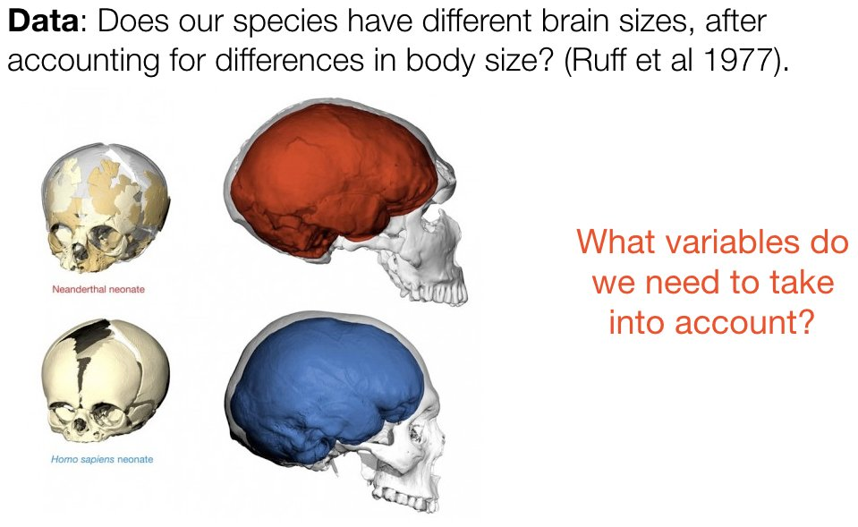{fig-align="center" width="90%"}

## ANCOVA: Neanderthal vs. Modern Human

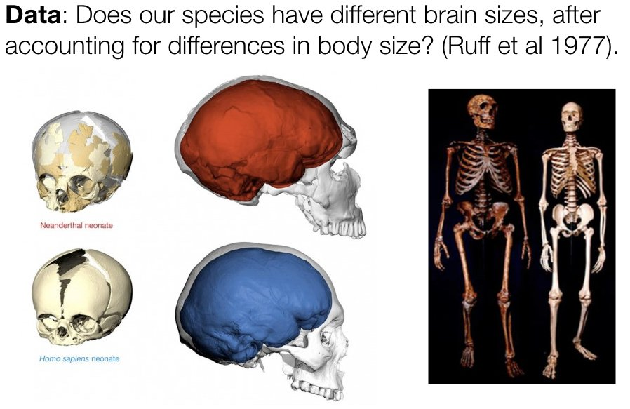{fig-align="center" width="90%"}

## ANCOVA: Brain-Body Mass Regression

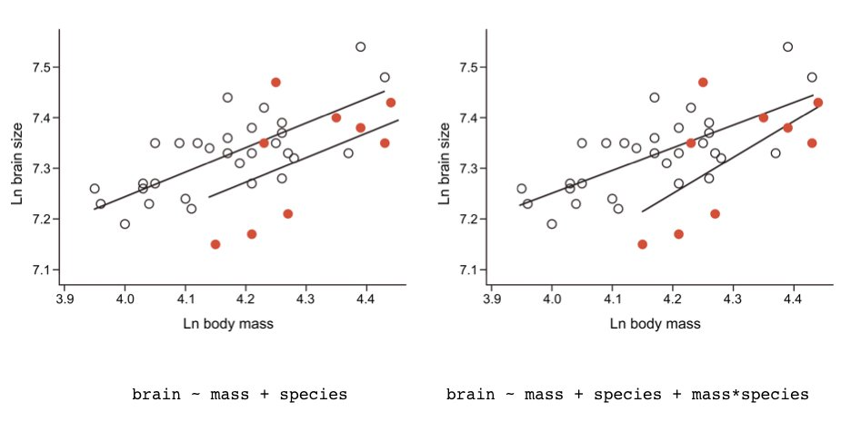{fig-align="center" width="90%"}

## DRAFT: Brain-Body Mass Regression

```{r}
#| echo: false
#| eval: true
#| fig-width: 10
#| fig-height: 5

set.seed(42)
n <- 30
body_h <- rnorm(n, 70, 10)
brain_h <- 900 + 8 * body_h + rnorm(n, 0, 50)
body_n <- rnorm(n, 80, 12)
brain_n <- 850 + 8 * body_n + rnorm(n, 0, 50)

par(mfrow = c(1, 2), mar = c(5, 4, 3, 1))

# Parallel slopes
plot(body_h, brain_h, pch = 16, col = "blue", cex = 1.2,
     xlim = range(c(body_h, body_n)), ylim = range(c(brain_h, brain_n)),
     xlab = "Body mass (kg)", ylab = "Brain size (cc)",
     main = "brain ~ mass + species")
points(body_n, brain_n, pch = 17, col = "red", cex = 1.2)
abline(lm(brain_h ~ body_h), col = "blue", lwd = 2)
abline(lm(brain_n ~ body_n), col = "red", lwd = 2)
legend("topleft", c("H. sapiens", "Neanderthal"),
       pch = c(16, 17), col = c("blue", "red"))

# With interaction
plot(body_h, brain_h, pch = 16, col = "blue", cex = 1.2,
     xlim = range(c(body_h, body_n)), ylim = range(c(brain_h, brain_n)),
     xlab = "Body mass (kg)", ylab = "Brain size (cc)",
     main = "brain ~ mass * species")
points(body_n, brain_n, pch = 17, col = "red", cex = 1.2)
abline(lm(brain_h ~ body_h), col = "blue", lwd = 2)
abline(lm(brain_n ~ body_n), col = "red", lwd = 2, lty = 2)
legend("topleft", c("H. sapiens", "Neanderthal"),
       pch = c(16, 17), col = c("blue", "red"))
```

## ANCOVA: ANOVA vs. Covariate Adjustment

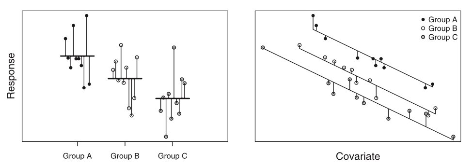{fig-align="center" width="90%"}

## DRAFT: ANOVA vs ANCOVA Comparison

```{r}
#| echo: false
#| eval: true
#| fig-width: 10
#| fig-height: 5

par(mfrow = c(1, 2), mar = c(5, 4, 3, 1))

set.seed(42)
n <- 20
resp_a <- rnorm(n, 10, 2)
resp_b <- rnorm(n, 12, 2)

# Left: simple group comparison
stripchart(list("Group A" = resp_a, "Group B" = resp_b),
           vertical = TRUE, pch = 16, col = c("blue", "red"),
           main = "ANOVA: response ~ group", ylab = "Response",
           method = "jitter", jitter = 0.1)
segments(0.8, mean(resp_a), 1.2, mean(resp_a), lwd = 3, col = "blue")
segments(1.8, mean(resp_b), 2.2, mean(resp_b), lwd = 3, col = "red")

# Right: with covariate
cov_a <- rnorm(n, 5, 1)
cov_b <- rnorm(n, 7, 1)
resp_a2 <- 5 + 1 * cov_a + rnorm(n, 0, 0.8)
resp_b2 <- 5 + 1 * cov_b + rnorm(n, 0, 0.8)

plot(c(cov_a, cov_b), c(resp_a2, resp_b2),
     pch = 16, col = rep(c("blue", "red"), each = n),
     xlab = "Covariate", ylab = "Response",
     main = "ANCOVA: response ~ covariate + group")
abline(lm(resp_a2 ~ cov_a), col = "blue", lwd = 2)
abline(lm(resp_b2 ~ cov_b), col = "red", lwd = 2)
legend("topleft", c("Group A", "Group B"),
       pch = 16, col = c("blue", "red"))
```

## ANCOVA: Adjusted Means

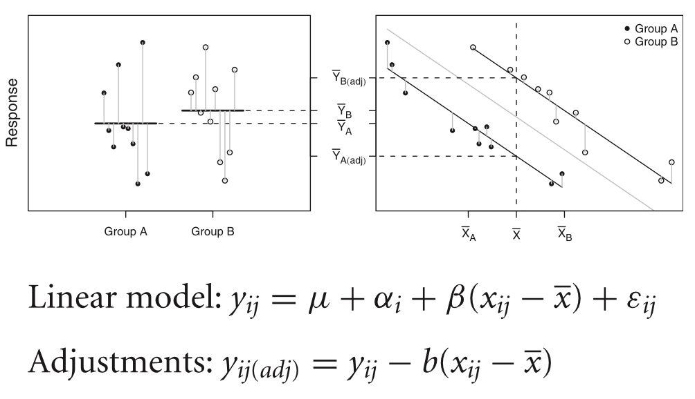{fig-align="center" width="90%"}

## DRAFT: ANCOVA Adjusted Means

The ANCOVA model:

$$y_{ij} = \mu + \alpha_i + \beta(x_{ij} - \bar{x}) + \varepsilon_{ij}$$

Adjusted means are computed at the overall mean of the covariate:

$$\bar{y}_{i(adj)} = \bar{y}_i - \hat{\beta}(\bar{x}_i - \bar{x})$$

```{r}
#| echo: false
#| eval: true
#| fig-width: 7
#| fig-height: 5

set.seed(42)
n <- 20
x_a <- rnorm(n, 4, 1); y_a <- 2 + 1.5 * x_a + rnorm(n, 0, 0.8)
x_b <- rnorm(n, 6, 1); y_b <- 4 + 1.5 * x_b + rnorm(n, 0, 0.8)
x_all <- mean(c(x_a, x_b))

plot(c(x_a, x_b), c(y_a, y_b), pch = 16,
     col = rep(c("blue", "red"), each = n),
     xlab = "Covariate (x)", ylab = "Response (y)", las = 1)
abline(lm(y_a ~ x_a), col = "blue", lwd = 2)
abline(lm(y_b ~ x_b), col = "red", lwd = 2)
abline(v = x_all, lty = 2, lwd = 1)
text(x_all + 0.1, max(c(y_a, y_b)), expression(bar(x)[..]), cex = 1.2)
legend("topleft", c("Group A", "Group B"), pch = 16, col = c("blue", "red"))
```

The key insight: by **adjusting for the covariate**, we can compare groups at the same value of the continuous predictor, removing confounding variation.

## ANCOVA: Multiple Covariates

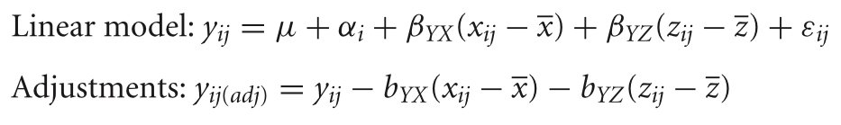{fig-align="center" width="90%"}

## DRAFT: ANCOVA with Multiple Covariates

**Linear model:**

$$y_{ij} = \mu + \alpha_i + \beta_1(x_{1ij} - \bar{x}_1) + \beta_2(x_{2ij} - \bar{x}_2) + \varepsilon_{ij}$$

**Adjusted mean:**

$$\bar{y}_{i(adj)} = \bar{y}_i - \hat{\beta}_1(\bar{x}_{1i} - \bar{x}_1) - \hat{\beta}_2(\bar{x}_{2i} - \bar{x}_2)$$

## ANCOVA: Null Hypotheses

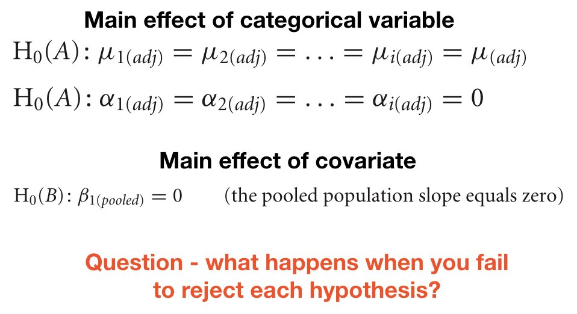{fig-align="center" width="90%"}

## DRAFT: ANCOVA Null Hypotheses

**For the categorical factor (e.g., species):**

$$H_0: \mu_{1(adj)} = \mu_{2(adj)} = \ldots = \mu_{p(adj)}$$

All adjusted group means are equal (after accounting for the covariate).

**For the covariate (e.g., body mass):**

$$H_0: \beta = 0$$

The covariate has no linear relationship with the response.

## ANCOVA: F-Ratio Table and Collinearity

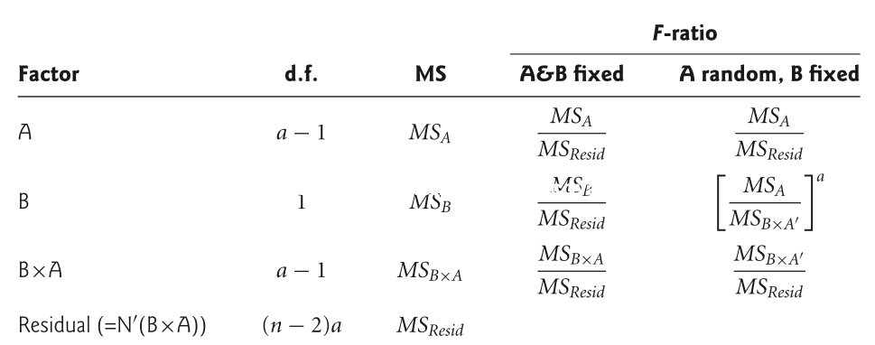{fig-align="center" width="90%"}

## DRAFT: ANCOVA F-Ratio Table

| Source    | df          | MS               | F-ratio                    |
|:----------|:------------|:-----------------|:---------------------------|
| Factor A  | $p - 1$     | $MS_A$           | $MS_A / MS_{Residual}$     |
| Covariate | 1           | $MS_{Covariate}$ | $MS_{Cov} / MS_{Residual}$ |
| Residual  | $N - p - 1$ | $MS_{Residual}$  |                            |

::: callout-warning
## Collinearity in ANCOVA

If the covariate and the factor are correlated (e.g., body mass differs between species), the order in which terms enter the model matters. Use **Type II or Type III sums of squares** from the `car` package to handle this properly.
:::

## ANCOVA: Heterogeneous Slopes

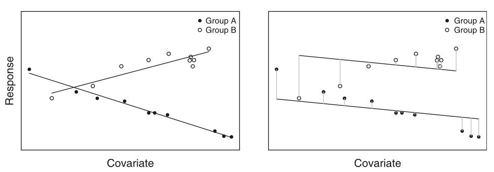{fig-align="center" width="90%"}

## DRAFT: Heterogeneous Slopes

```{r}
#| echo: false
#| eval: true
#| fig-width: 10
#| fig-height: 5

set.seed(42)
n <- 25
par(mfrow = c(1, 2), mar = c(5, 4, 3, 1))

# Homogeneous slopes (assumption met)
x1 <- rnorm(n, 5, 2); y1 <- 2 + 1.5 * x1 + rnorm(n, 0, 1)
x2 <- rnorm(n, 5, 2); y2 <- 5 + 1.5 * x2 + rnorm(n, 0, 1)
plot(c(x1, x2), c(y1, y2), pch = 16,
     col = rep(c("blue", "red"), each = n),
     xlab = "Covariate", ylab = "Response",
     main = "Homogeneous slopes (OK)")
abline(lm(y1 ~ x1), col = "blue", lwd = 2)
abline(lm(y2 ~ x2), col = "red", lwd = 2)

# Heterogeneous slopes (violation)
x3 <- rnorm(n, 5, 2); y3 <- 2 + 0.5 * x3 + rnorm(n, 0, 1)
x4 <- rnorm(n, 5, 2); y4 <- 1 + 2.5 * x4 + rnorm(n, 0, 1)
plot(c(x3, x4), c(y3, y4), pch = 16,
     col = rep(c("blue", "red"), each = n),
     xlab = "Covariate", ylab = "Response",
     main = "Heterogeneous slopes (VIOLATION)")
abline(lm(y3 ~ x3), col = "blue", lwd = 2)
abline(lm(y4 ~ x4), col = "red", lwd = 2)
```

When slopes differ between groups, the interaction between the covariate and the factor is significant — this is a violation of the **parallel slopes assumption**.

## Parallel Slopes (Additive) Model

When there is no interaction, each group has the **same slope** but **different intercepts**:

::: panel-tabset
### Equation

$$y = \beta_0 + \beta_1 x_{continuous} + \beta_2 x_{categorical} + \epsilon_i$$

### LaTeX

``` text
y = \beta_0 + \beta_1 x_{continuous} + \beta_2 x_{categorical} + \epsilon_i
```
:::

```{r}
#| eval: false
#| echo: true

# Parallel slopes model (additive)
lm(response ~ continuous_var + factor_var, data = mydata)
```

-   The `+` means "additive" — the effect of the covariate is the same in every group
-   This produces parallel regression lines

## Interaction Model

When the relationship **differs between groups**, add an **interaction term**:

::: panel-tabset
### Equation

$$y = \beta_0 + \beta_1 x_1 + \beta_2 x_2 + \beta_3 (x_1 \times x_2) + \epsilon_i$$

### LaTeX

``` text
y = \beta_0 + \beta_1 x_1 + \beta_2 x_2 + \beta_3 (x_1 \times x_2) + \epsilon_i
```
:::

```{r}
#| eval: false
#| echo: true

# Model with interaction (different slopes)
lm(response ~ continuous_var * factor_var, data = mydata)

# Equivalent to:
lm(response ~ continuous_var + factor_var + continuous_var:factor_var,
   data = mydata)
```

## Interpreting ANCOVA Output

::: panel-tabset
### Code

```{r}
#| eval: false
#| echo: true

# Example with crickets data
lm(rate ~ temp + species, data = crickets)

# Output interpretation:
# (Intercept)      - baseline intercept for reference level
# temp             - slope (same for all groups)
# speciesO.niveus  - difference in intercept from reference
```

### Interpretation

-   The categorical variable coefficient represents the **offset from the reference group**
-   This is the same dummy variable encoding that `lm()` uses for ANOVA
-   The only difference from pure ANOVA is the inclusion of a continuous predictor
:::

## Parallel vs. Interaction: When to Use

| Model | Use When | R Formula |
|:---|:---|:---|
| **Parallel Slopes** | Effect of covariate is same across groups | `y ~ x + group` |
| **Interaction** | Effect of covariate differs by group | `y ~ x * group` |

::: callout-tip
Always start with the interaction model. Test whether the interaction term is significant. If not, drop it and use the simpler parallel slopes model (parsimony principle).
:::

## ANCOVA: Type II/III Sums of Squares

::: panel-tabset
### Code

```{r}
#| echo: true
#| eval: false

library(car)

# Type II SS — tests each term after adjusting for all others
# (appropriate when no significant interaction)
Anova(lm(y ~ covariate + factor, data = mydata), type = "II")

# Type III SS — tests each term after adjusting for all others
# including interaction (appropriate when interaction is present)
Anova(lm(y ~ covariate * factor, data = mydata), type = "III")
```

### When to Use

| SS Type      | Use When                        | Notes                       |
|:-------------|:--------------------------------|:----------------------------|
| **Type I**   | Balanced designs, order matters | Default in `anova()`        |
| **Type II**  | Unbalanced, no interaction      | Default in `car::Anova()`   |
| **Type III** | Unbalanced, interaction present | Requires `contr.sum` coding |
:::

## Visualizing ANCOVA Models

::: panel-tabset
### Output

```{r}
#| label: ancova-viz-output
#| echo: false
#| eval: true
#| fig-width: 10
#| fig-height: 4

# Simulated data for two groups
set.seed(42)
x <- rep(seq(1, 10, length.out = 20), 2)
group <- rep(c("A", "B"), each = 20)
y <- ifelse(group == "A", 2 + 0.8*x, 5 + 0.8*x) + rnorm(40, 0, 0.8)
df <- data.frame(x, y, group)

par(mfrow = c(1, 2))

# Parallel slopes
plot(x, y, col = ifelse(group == "A", "steelblue", "coral"), pch = 19,
     main = "Parallel Slopes Model")
abline(2, 0.8, col = "steelblue", lwd = 2)
abline(5, 0.8, col = "coral", lwd = 2)
legend("bottomright", c("Group A", "Group B"), col = c("steelblue", "coral"), pch = 19)

# Interaction model
set.seed(43)
y2 <- ifelse(group == "A", 2 + 0.5*x, 5 + 1.2*x) + rnorm(40, 0, 0.8)
plot(x, y2, col = ifelse(group == "A", "steelblue", "coral"), pch = 19,
     main = "Interaction Model (Different Slopes)")
abline(2, 0.5, col = "steelblue", lwd = 2)
abline(5, 1.2, col = "coral", lwd = 2)
legend("bottomright", c("Group A", "Group B"), col = c("steelblue", "coral"), pch = 19)
```

### Code

```{r}
#| label: ancova-viz-code
#| echo: true
#| eval: false

par(mfrow = c(1, 2))

# Parallel slopes
plot(x, y, col = ifelse(group == "A", "steelblue", "coral"), pch = 19,
     main = "Parallel Slopes Model")
abline(2, 0.8, col = "steelblue", lwd = 2)
abline(5, 0.8, col = "coral", lwd = 2)
legend("bottomright", c("Group A", "Group B"),
       col = c("steelblue", "coral"), pch = 19)

# Interaction model (different slopes)
plot(x, y2, col = ifelse(group == "A", "steelblue", "coral"), pch = 19,
     main = "Interaction Model (Different Slopes)")
abline(2, 0.5, col = "steelblue", lwd = 2)
abline(5, 1.2, col = "coral", lwd = 2)
```
:::

## Dangers of Extrapolation

All regression models (including ANCOVA) are only valid **within the range of the observed data**:

-   Polynomial models are especially dangerous to extrapolate — they can produce wildly unrealistic predictions outside the data range
-   Even linear ANCOVA predictions become unreliable far from the observed covariate values
-   Always report the range of your covariates alongside your model

::: callout-warning
## Rule of Thumb

Never predict beyond the range of your observed data unless you have strong theoretical justification for the extrapolation.
:::

------------------------------------------------------------------------

# Multiple Linear Regression {background-color="#2c3e50"}

## Why Multiple Regression?

Multiple linear regression extends simple regression to include **two or more predictor variables**. The goals are:

-   Develop a better **predictive model** than possible from models based on single independent variables
-   Investigate the **relative individual effects** of each predictor variable above and beyond the effects of the other variables
-   The individual effects of each predictor on the response can be depicted by **partial regression lines**
-   The slope of any partial regression line represents the rate of change of that predictor on the response, **holding all other predictors constant** at their means

## Additive and Multiplicative Models

**Additive model** — each predictor contributes independently:

::: panel-tabset
### Equation

$$y_i = \beta_0 + \beta_1 x_{i1} + \beta_2 x_{i2} + \ldots + \beta_j x_{ij} + \epsilon_i$$

### LaTeX

``` text
y_i = \beta_0 + \beta_1 x_{i1} + \beta_2 x_{i2} + \ldots + \beta_j x_{ij} + \epsilon_i
```
:::

**Multiplicative model** — includes an interaction between two predictors:

::: panel-tabset
### Equation

$$y_i = \beta_0 + \beta_1 x_{i1} + \beta_2 x_{i2} + \beta_3 x_{i1} x_{i2} + \epsilon_i$$

### LaTeX

``` text
y_i = \beta_0 + \beta_1 x_{i1} + \beta_2 x_{i2} + \beta_3 x_{i1} x_{i2} + \epsilon_i
```
:::

## Additive vs. Multiplicative Models

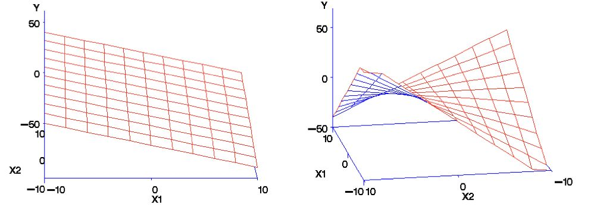{fig-align="center" width="100%"}

## DRAFT: Additive vs. Multiplicative Response Surfaces

```{r}
#| echo: false
#| eval: true
#| fig-width: 10
#| fig-height: 5

par(mfrow = c(1, 2), mar = c(1, 1, 3, 1))

# Create grid
x1 <- seq(-10, 10, length.out = 30)
x2 <- seq(-10, 10, length.out = 30)

# Additive model: y = 2*x1 + 3*x2 (flat plane)
z_add <- outer(x1, x2, function(a, b) 2*a + 3*b)
persp(x1, x2, z_add, theta = 30, phi = 20,
      xlab = "X1", ylab = "X2", zlab = "Y",
      main = "Additive Model", col = "indianred1",
      border = "darkred", shade = 0.1, cex.main = 1.3)

# Multiplicative model: y = 2*x1 + 3*x2 + 0.5*x1*x2 (twisted plane)
z_mult <- outer(x1, x2, function(a, b) 2*a + 3*b + 0.5*a*b)
persp(x1, x2, z_mult, theta = 30, phi = 20,
      xlab = "X1", ylab = "X2", zlab = "Y",
      main = "Multiplicative Model (with interaction)", col = "indianred1",
      border = "darkred", shade = 0.1, cex.main = 1.3)
```

## R Example: Multiple Regression with 2 Predictors

Read in the RNAseq_lip.tsv and examine whether Gene01 and/or Gene02 expression levels influence lipid content.

::: panel-tabset
### Code

```{r}
#| echo: true
#| eval: false

RNAseq_Data <- read.table('data/RNAseq_lip.tsv', header = TRUE, sep = '\t')

y  <- RNAseq_Data$Lipid_Conc
g1 <- RNAseq_Data$Gene01
g2 <- RNAseq_Data$Gene02

# Multiplicative model (with interaction)
Mult_lm <- lm(y ~ g1 * g2)
summary(Mult_lm)
```

### Questions

-   What are the parameter estimates of interest?
-   What are the outcomes from the hypothesis tests?
-   What happens when you remove the interaction term?
:::

## Additive Model Comparison

::: panel-tabset
### Code

```{r}
#| echo: true
#| eval: false

# Additive model (no interaction)
Add_lm <- lm(y ~ g1 + g2)
summary(Add_lm)
```

### Questions

-   Did any of the coefficient estimates change? Why?
-   Did the degrees of freedom change? Why?
-   Try different combinations of genes as predictors
:::

## Multiple Regression Assumptions

Multiple regression carries all the assumptions of simple regression plus an additional one:

1.  **Linearity** — the relationship between predictors and response is linear
2.  **Normality** — residuals are normally distributed
3.  **Homogeneity of variance** — constant variance of residuals
4.  **Independence** — observations are independent
5.  **No multicollinearity** — a predictor variable must not be strongly correlated with the combination of other predictor variables

::: callout-warning
## Multicollinearity

When predictors are highly correlated, coefficient estimates become unstable, standard errors inflate, and interpretation becomes unreliable. Always check for collinearity before interpreting a multiple regression model.
:::

## Checking for Multicollinearity

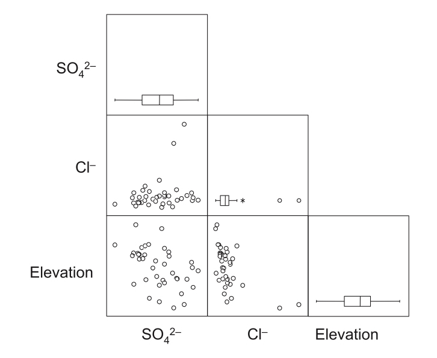{fig-align="center" width="70%"}

## DRAFT: Scatterplot Matrix for Collinearity

```{r}
#| echo: false
#| eval: true
#| fig-width: 7
#| fig-height: 7

# Simulated environmental data with collinearity
set.seed(42)
n <- 50
elevation <- rnorm(n, 500, 200)
SO4 <- rnorm(n, 50, 20) + 0.02 * elevation  # weakly correlated with elevation
Cl <- rexp(n, rate = 0.1) + 2               # right-skewed, some outliers

env_data <- data.frame(SO4 = SO4, Cl = Cl, Elevation = elevation)

# Scatterplot matrix with boxplots on diagonal
pairs(env_data,
      panel = function(x, y, ...) points(x, y, pch = 1, cex = 0.9),
      diag.panel = function(x, ...) {
        usr <- par("usr")
        bp <- boxplot(x, plot = FALSE)
        rect(usr[1] + 0.2*(usr[2]-usr[1]), bp$stats[2],
             usr[2] - 0.2*(usr[2]-usr[1]), bp$stats[4],
             border = "black")
        segments(usr[1] + 0.35*(usr[2]-usr[1]), bp$stats[3],
                 usr[2] - 0.35*(usr[2]-usr[1]), bp$stats[3], lwd = 2)
        segments(mean(c(usr[1], usr[2])), bp$stats[1],
                 mean(c(usr[1], usr[2])), bp$stats[2])
        segments(mean(c(usr[1], usr[2])), bp$stats[4],
                 mean(c(usr[1], usr[2])), bp$stats[5])
      },
      cex.labels = 1.5, gap = 0.5)
```

::: panel-tabset
### Code

```{r}
#| echo: true
#| eval: false

library(car)

# Visual check with scatterplot matrix
scatterplotMatrix(~ var1 + var2 + var3, diag = "boxplot")

# Variance Inflation Factor (VIF)
model <- lm(y ~ g1 + g2 + g3)
vif(model)

# Tolerance = 1/VIF (values < 0.1 indicate severe collinearity)
1 / vif(model)
```

### Interpretation

| VIF Value | Interpretation                  |
|:----------|:--------------------------------|
| 1         | No collinearity                 |
| 1–5       | Moderate (usually acceptable)   |
| 5–10      | High (investigate further)      |
| \> 10     | Severe (remedial action needed) |
:::

## R Example: Three-Variable Regression

::: panel-tabset
### Code

```{r}
#| echo: true
#| eval: false

RNAseq_Data <- read.table('data/RNAseq_lip.tsv', header = TRUE, sep = '\t')
y  <- RNAseq_Data$Lipid_Conc
g1 <- RNAseq_Data$Gene01
g2 <- RNAseq_Data$Gene02
g3 <- RNAseq_Data$Gene03

# Three-predictor model
RNAseq3_lm <- lm(y ~ g1 + g2 + g3)
summary(RNAseq3_lm)
plot(RNAseq3_lm)

# Scatterplot matrices
library(car)
scatterplotMatrix(~ g1 + g2 + g3, diag = "boxplot")
scatterplotMatrix(~ y + g1 + g2 + g3, diag = "boxplot")

# Tolerance calculations (1 - R²)
1 / vif(lm(y ~ g1 + g2 + g3))
```

### Questions

-   Is there any evidence for multicollinearity?
-   Try running a simple regression of `y ~ g3` alone — how does the slope estimate for Gene03 compare to the partial slope estimate from the full model?
-   What does a change in slope estimate tell you about confounding?
:::

## Bioengineering Example: Scaffold Properties and Tissue Growth

::: panel-tabset
### Code

```{r}
#| echo: true
#| eval: false

# Simulated bioengineering data: predicting tissue growth
# from scaffold porosity, stiffness, and cell seeding density
set.seed(42)
n <- 60

scaffold_data <- data.frame(
  porosity     = runif(n, 40, 90),         # percent porosity
  stiffness    = runif(n, 5, 50),          # kPa
  seeding_dens = runif(n, 1e4, 1e6)        # cells/mL
)
scaffold_data$tissue_growth <- with(scaffold_data,
  0.8 * porosity + 0.3 * stiffness - 0.00001 * seeding_dens +
  0.005 * porosity * stiffness + rnorm(n, 0, 8)
)

# Fit multiple regression
scaffold_lm <- lm(tissue_growth ~ porosity + stiffness + seeding_dens,
                   data = scaffold_data)
summary(scaffold_lm)
```

### Questions

-   Which scaffold properties significantly predict tissue growth?
-   Does adding the interaction `porosity:stiffness` improve the model?
-   What happens to the seeding density coefficient when you remove it?
:::

## Diagnostic Plots for Multiple Regression

::: panel-tabset
### Output

```{r}
#| label: diag-plots-output
#| echo: false
#| eval: true
#| fig-width: 10
#| fig-height: 8

set.seed(42)
n <- 60
scaffold_data <- data.frame(
  porosity     = runif(n, 40, 90),
  stiffness    = runif(n, 5, 50),
  seeding_dens = runif(n, 1e4, 1e6)
)
scaffold_data$tissue_growth <- with(scaffold_data,
  0.8 * porosity + 0.3 * stiffness - 0.00001 * seeding_dens +
  0.005 * porosity * stiffness + rnorm(n, 0, 8))

scaffold_lm <- lm(tissue_growth ~ porosity + stiffness + seeding_dens,
                   data = scaffold_data)
par(mfrow = c(2, 2))
plot(scaffold_lm)
```

### Code

```{r}
#| label: diag-plots-code
#| echo: true
#| eval: false

# Standard diagnostic plots
par(mfrow = c(2, 2))
plot(scaffold_lm)

# Using ggfortify for prettier diagnostics
library(ggfortify)
autoplot(scaffold_lm, which = 1:4) + theme_minimal()

# Cook's distance — identify influential observations
cooks_d <- cooks.distance(scaffold_lm)
plot(cooks_d, type = "h", main = "Cook's Distance",
     ylab = "Cook's Distance", xlab = "Observation")
abline(h = 4 / n, col = "red", lty = 2)
```

### Interpretation

-   **Residuals vs Fitted**: look for non-linearity (curved pattern) or heteroscedasticity (funnel shape)
-   **Q-Q Plot**: points should follow the diagonal line; deviations indicate non-normality
-   **Scale-Location**: check for constant variance (flat trend line)
-   **Residuals vs Leverage**: Cook's distance \> 4/n flags influential points
:::

## Partial Regression Plots

Partial regression (added-variable) plots show the effect of each predictor **after adjusting for all others**:

::: panel-tabset
### Output

```{r}
#| label: avplots-output
#| echo: false
#| eval: true
#| fig-width: 10
#| fig-height: 4

library(car)
avPlots(scaffold_lm, main = "Added-Variable Plots")
```

### Code

```{r}
#| label: avplots-code
#| echo: true
#| eval: false

library(car)

# Added-variable plots (partial regression plots)
avPlots(scaffold_lm)

# Each plot shows the relationship between one predictor
# and the response, holding all other predictors constant.
# The slope of each line equals the partial regression coefficient.
```
:::

------------------------------------------------------------------------

# Model Selection {background-color="#2c3e50"}

## The Problem of Model Complexity

-   How do we decide the complexity of a polynomial: straight line, quadratic, cubic, …?
-   Which variables should we keep or discard when building a multiple regression model?
-   How do we select from candidate models representing different biological processes?

::: callout-important
## Principle of Parsimony

"Models should be pared down until they are minimal and adequate" — Crawley 2007

If two or more models fit the data almost equally well, prefer the simpler model.
:::

## Overfitting with Polynomials

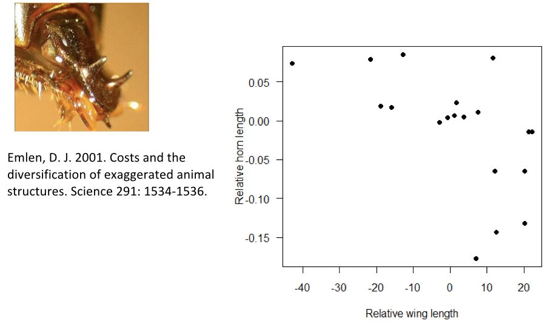{fig-align="center" width="80%"}

The log-likelihood and $R^2$ always increase with more parameters — but this does not mean the model is better!

## DRAFT: Beetle Wing vs Horn Data

```{r}
#| echo: false
#| eval: true
#| fig-width: 8
#| fig-height: 5

# Simulated beetle wing vs horn data (Emlen 2001 style)
set.seed(2001)
wing <- runif(20, -45, 25)
horn <- -0.002 * wing + rnorm(20, 0, 0.05)

par(mar = c(5, 5, 2, 2))
plot(wing, horn, pch = 16, cex = 1.3,
     xlab = "Relative wing length", ylab = "Relative horn length",
     cex.lab = 1.3, cex.axis = 1.1,
     main = "Beetle wing length vs horn length")
```

## The Progression of Polynomial Fits

::::: columns
::: {.column width="50%"}
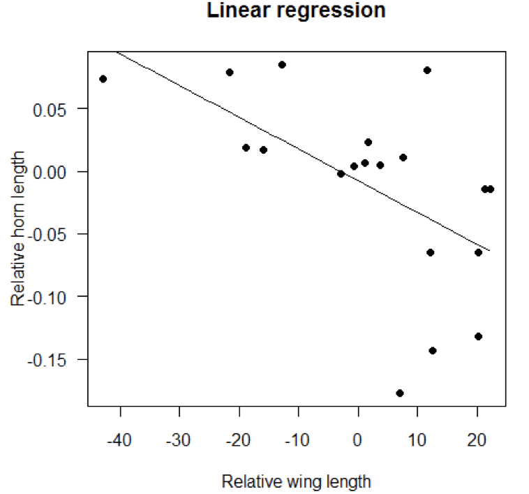{fig-align="center" width="100%"}
:::

::: {.column width="50%"}
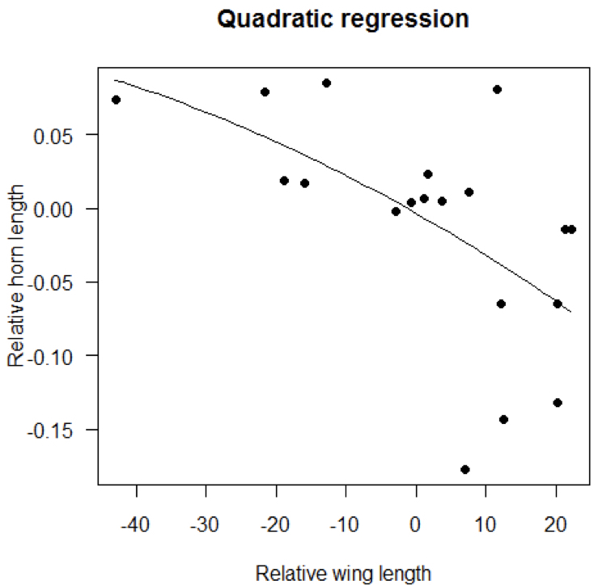{fig-align="center" width="100%"}
:::
:::::

## DRAFT: Linear and Quadratic Fits

```{r}
#| echo: false
#| eval: true
#| fig-width: 10
#| fig-height: 5

set.seed(2001)
wing <- runif(20, -45, 25)
horn <- -0.002 * wing + rnorm(20, 0, 0.05)

par(mfrow = c(1, 2), mar = c(5, 5, 3, 2))

# Linear fit
plot(wing, horn, pch = 16, cex = 1.2,
     xlab = "Relative wing length", ylab = "Relative horn length",
     main = "Linear regression", cex.lab = 1.2, cex.main = 1.3)
fit1 <- lm(horn ~ wing)
abline(fit1, lwd = 2)

# Quadratic fit
plot(wing, horn, pch = 16, cex = 1.2,
     xlab = "Relative wing length", ylab = "Relative horn length",
     main = "Quadratic fit", cex.lab = 1.2, cex.main = 1.3)
fit2 <- lm(horn ~ poly(wing, 2, raw = TRUE))
x_seq <- seq(min(wing), max(wing), length.out = 200)
lines(x_seq, predict(fit2, newdata = data.frame(wing = x_seq)), lwd = 2)
```

## Higher-Order Polynomials and Overfitting

::::: columns
::: {.column width="50%"}
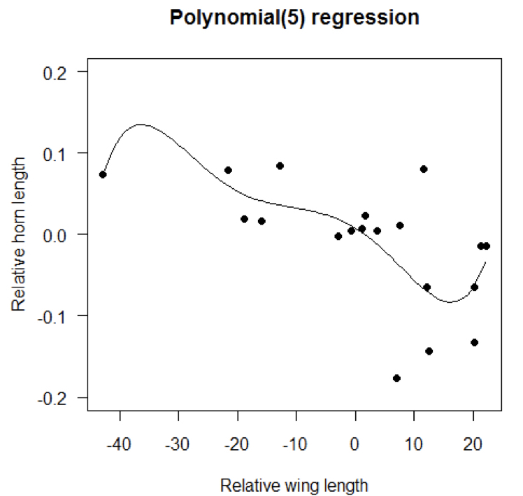{fig-align="center" width="100%"}
:::

::: {.column width="50%"}
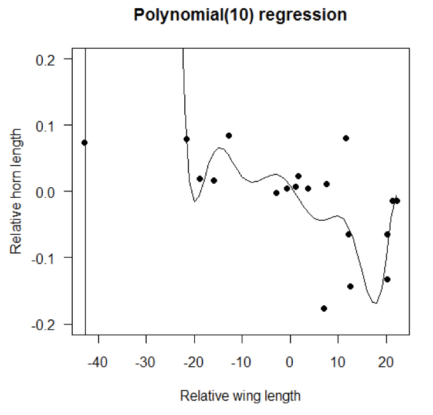{fig-align="center" width="100%"}
:::
:::::

As polynomial degree increases, the model fits the training data ever more closely — but becomes useless for prediction on new data.

## DRAFT: Higher-Order Polynomial Fits

```{r}
#| echo: false
#| eval: true
#| fig-width: 10
#| fig-height: 5

set.seed(2001)
wing <- runif(20, -45, 25)
horn <- -0.002 * wing + rnorm(20, 0, 0.05)

par(mfrow = c(1, 2), mar = c(5, 5, 3, 2))

# Degree 5
plot(wing, horn, pch = 16, cex = 1.2,
     xlab = "Relative wing length", ylab = "Relative horn length",
     main = "Degree 5 polynomial", cex.lab = 1.2, cex.main = 1.3)
fit5 <- lm(horn ~ poly(wing, 5, raw = TRUE))
x_seq <- seq(min(wing), max(wing), length.out = 200)
lines(x_seq, predict(fit5, newdata = data.frame(wing = x_seq)), lwd = 2)

# Degree 10
plot(wing, horn, pch = 16, cex = 1.2,
     xlab = "Relative wing length", ylab = "Relative horn length",
     main = "Degree 10 polynomial", cex.lab = 1.2, cex.main = 1.3)
fit10 <- lm(horn ~ poly(wing, 10, raw = TRUE))
x_seq2 <- seq(min(wing), max(wing), length.out = 500)
pred10 <- predict(fit10, newdata = data.frame(wing = x_seq2))
lines(x_seq2, pred10, lwd = 2)
```

## Model Selection Criteria

| Criterion | Description | Selection Rule |
|:---|:---|:---|
| **MS~residuals~** | Mean unexplained variation | Lowest value = best fit |
| **Adjusted R²** | Proportion of variance explained, penalized for \# terms | Larger = better fit |
| **Mallow's Cp** | Comparison to full model | Lowest value, or closest to p |
| **AIC** | Likelihood penalized by number of parameters | Smaller = more parsimonious |
| **BIC** | Like AIC but heavier penalty for complexity | Smaller = more parsimonious |

::: callout-tip
As a rule of thumb, if the difference between two AIC values (ΔAIC) is greater than 2, the lower AIC represents a meaningfully better model.
:::

## Mallow's Cp and All-Subsets Regression

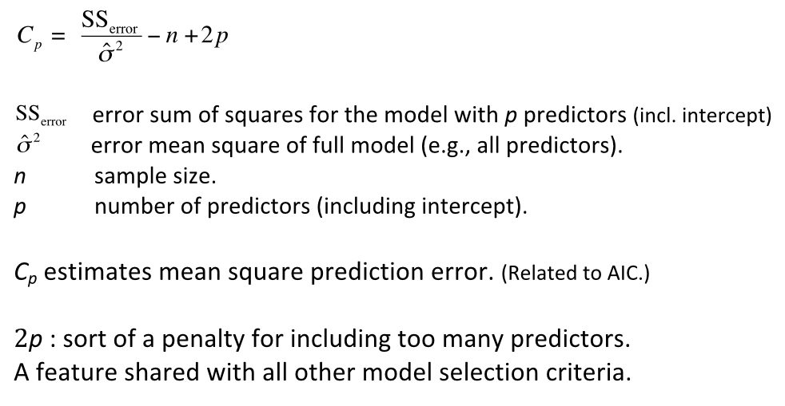{fig-align="center" width="90%"}

## DRAFT: Mallow's Cp Formula

::: panel-tabset
### Equation

$$C_p = \frac{SS_{\text{error}}}{\hat{\sigma}^2} - n + 2p$$

where:

| Symbol | Meaning |
|:---|:---|
| $SS_{\text{error}}$ | Error sum of squares for the model with $p$ predictors (incl. intercept) |
| $\hat{\sigma}^2$ | Error mean square of full model (e.g., all predictors) |
| $n$ | Sample size |
| $p$ | Number of predictors (including intercept) |

-   $C_p$ estimates **mean square prediction error** (related to AIC)
-   $2p$: a penalty for including too many predictors — a feature shared with all other model selection criteria

### LaTeX

``` text
C_p = \frac{SS_{\text{error}}}{\hat{\sigma}^2} - n + 2p
```
:::

::: panel-tabset
### Code

```{r}
#| echo: true
#| eval: false

library(leaps)

# All subsets regression
all_subsets <- regsubsets(y ~ g1 + g2 + g3 + g4, data = RNAseq_Data)
summary(all_subsets)

# Plot Cp, BIC, adjusted R²
par(mfrow = c(1, 3))
plot(all_subsets, scale = "Cp")
plot(all_subsets, scale = "bic")
plot(all_subsets, scale = "adjr2")
```

### Key Points

-   **For prediction**: All models with Cp \< p predict about equally well
-   **For explanation**: If numerous models fit equally well, it is difficult to deduce which predictor "explains" the response
-   **General caveat**: "Regression is not causation" — an experiment is needed for causal explanation
:::

## Nested vs. Non-Nested Models

-   **Nested (reduced vs. full)**: One model is a special case of the other — can compare with F-test or likelihood ratio test
-   **Non-nested**: Models contain different sets of variables — compare with AIC or BIC

::: panel-tabset
### Code

```{r}
#| echo: true
#| eval: false

# Compare nested models with F-test
model_reduced <- lm(y ~ g1 + g2)
model_full    <- lm(y ~ g1 + g2 + g3)
anova(model_reduced, model_full)

# Compare non-nested models with AIC
AIC(model_a, model_b, model_c)
BIC(model_a, model_b, model_c)
```

### Interpretation

-   F-test p \< 0.05 → the fuller model is significantly better
-   Lower AIC/BIC → more parsimonious model
-   BIC penalizes complexity more heavily than AIC
:::

## Stepwise Model Selection in R

::: panel-tabset
### Code

```{r}
#| echo: true
#| eval: false

# Start with a full model
full_model <- lm(tissue_growth ~ porosity * stiffness * seeding_dens,
                 data = scaffold_data)

# Forward stepwise selection (start from intercept-only)
null_model <- lm(tissue_growth ~ 1, data = scaffold_data)
forward_model <- step(null_model,
                      scope = list(lower = null_model, upper = full_model),
                      direction = "forward", trace = 1)

# Backward elimination (start from full model)
backward_model <- step(full_model, direction = "backward", trace = 1)

# Both directions
both_model <- step(null_model,
                   scope = list(lower = null_model, upper = full_model),
                   direction = "both", trace = 1)

# Compare final models
AIC(forward_model, backward_model, both_model)
BIC(forward_model, backward_model, both_model)
```

### Key Points

-   `step()` uses AIC by default; add `k = log(n)` for BIC-based selection
-   Forward selection can miss important combinations
-   Backward elimination can fail when p \> n
-   "Both" direction is generally most robust
-   Stepwise methods can overfit — always validate with cross-validation
:::

# BREAK {background-color="#e74c3c"}

# Statistical Power {background-color="#2c3e50"}

## What is Power?

Power is the probability of correctly rejecting a **false** null hypothesis (i.e., detecting a real effect when one exists).

::: panel-tabset
### Equation

$$\text{Power} \propto \frac{(\text{Effect Size})(\alpha)(\sqrt{n})}{\sigma}$$

### LaTeX

``` text
\text{Power} \propto \frac{(\text{Effect Size})(\alpha)(\sqrt{n})}{\sigma}
```
:::

-   Helps interpret failure to reject the null — was the test underpowered?
-   Target: typically **80% power** (β = 0.20)

## Power Overview

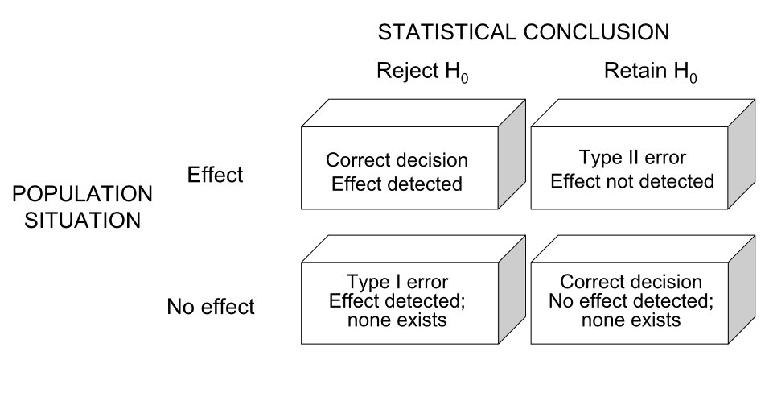{fig-align="center" width="90%"}

## DRAFT: Statistical Power and Type II Error

|   | **Reject** $H_0$ | **Retain** $H_0$ |
|:---|:---|:---|
| **Effect exists** | Correct decision — Effect detected (Power = $1-\beta$) | **Type II error** — Effect not detected ($\beta$) |
| **No effect** | **Type I error** — Effect detected; none exists ($\alpha$) | Correct decision — No effect detected |

::: callout-note
-   **Power** = probability of correctly rejecting $H_0$ when the effect is real
-   We want Power $\geq 0.80$ (i.e., $\beta \leq 0.20$)
-   Increasing sample size, effect size, or $\alpha$ increases power
:::

## Key Components of Power

| Component                  | Description                       |
|:---------------------------|:----------------------------------|
| **Effect Size (ES)**       | Magnitude of difference to detect |
| **Standard Deviation (σ)** | Variability within groups         |
| **Sample Size (n)**        | Number of observations            |
| **Significance Level (α)** | Usually 0.05                      |
| **Power (1 − β)**          | Usually 0.80                      |

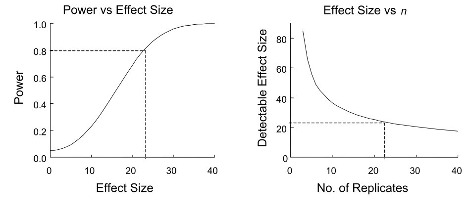{fig-align="center" width="70%"}

## DRAFT: Power vs Effect Size and Sample Size

```{r}
#| echo: false
#| eval: true
#| fig-width: 10
#| fig-height: 5

par(mfrow = c(1, 2), mar = c(5, 5, 3, 2))

# Left panel: Power vs Effect Size
es <- seq(0.5, 40, length.out = 200)
# Approximate power curve using a sigmoid
power_vals <- pnorm(es / 10 * qnorm(0.975) - qnorm(0.975) + es/10 * sqrt(20))
power_vals <- pmin(power_vals, 1)
# Simpler: use a logistic-like curve
power_vals <- 1 / (1 + exp(-0.25 * (es - 15)))

plot(es, power_vals, type = "l", lwd = 2,
     xlab = "Effect Size", ylab = "Power",
     main = "Power vs Effect Size",
     xlim = c(0, 40), ylim = c(0, 1),
     cex.lab = 1.3, cex.main = 1.3, cex.axis = 1.1)
abline(h = 0.80, lty = 2, col = "gray40")
abline(v = 25, lty = 2, col = "gray40")

# Right panel: Detectable Effect Size vs n
n_vals <- seq(1, 40, length.out = 200)
# Effect size detectable decreases with n (hyperbolic)
det_es <- 80 / sqrt(n_vals)

plot(n_vals, det_es, type = "l", lwd = 2,
     xlab = "No. of Replicates", ylab = "Detectable Effect Size",
     main = "Effect Size vs n",
     xlim = c(0, 40), ylim = c(0, 90),
     cex.lab = 1.3, cex.main = 1.3, cex.axis = 1.1)
abline(h = 25, lty = 2, col = "gray40")
abline(v = 22, lty = 2, col = "gray40")
```

## Cohen's d

Effect size between two group means expressed in standard deviation units:

::: panel-tabset
### Equation

$$d = \frac{\bar{x}_1 - \bar{x}_2}{s_{pooled}}$$

### LaTeX

``` text
d = \frac{\bar{x}_1 - \bar{x}_2}{s_{pooled}}
```
:::

| d   | Interpretation |
|:----|:---------------|
| 0.2 | Small effect   |
| 0.5 | Medium effect  |
| 0.8 | Large effect   |

## Power Analysis in R

::: panel-tabset
### Output

```{r}
#| label: power-analysis
#| echo: false
#| eval: true

library(pwr)

# Calculate required sample size for 80% power
sample_size <- pwr.t.test(
  d = 0.5,
  sig.level = 0.05,
  power = 0.80,
  type = "two.sample"
)

cat("Required n per group:", ceiling(sample_size$n))
```

### Code

```{r}
#| echo: true
#| eval: false

library(pwr)

# Calculate required sample size for 80% power
sample_size <- pwr.t.test(
  d = 0.5,
  sig.level = 0.05,
  power = 0.80,
  type = "two.sample"
)

cat("Required n per group:", ceiling(sample_size$n))
```
:::

## Power Curve

::: panel-tabset
### Output

```{r}
#| label: power-curve-output
#| echo: false
#| eval: true
#| fig-width: 8
#| fig-height: 4

effect_sizes <- seq(0.2, 1.0, by = 0.1)
power_values <- sapply(effect_sizes, function(d) {
  pwr.t.test(d = d, n = 50, sig.level = 0.05, type = "two.sample")$power
})

plot(effect_sizes, power_values, type = "b", pch = 19, col = "steelblue",
     xlab = "Effect Size (Cohen's d)", ylab = "Power", ylim = c(0, 1))
abline(h = 0.8, lty = 2, col = "red")
```

### Code

```{r}
#| label: power-curve-code
#| echo: true
#| eval: false

effect_sizes <- seq(0.2, 1.0, by = 0.1)
power_values <- sapply(effect_sizes, function(d) {
  pwr.t.test(d = d, n = 50, sig.level = 0.05, type = "two.sample")$power
})

plot(effect_sizes, power_values, type = "b", pch = 19, col = "steelblue",
     xlab = "Effect Size (Cohen's d)", ylab = "Power", ylim = c(0, 1))
abline(h = 0.8, lty = 2, col = "red")
```
:::

## Sample Size Curve

::: panel-tabset
### Output

```{r}
#| label: sample-curve-output
#| echo: false
#| eval: true
#| fig-width: 8
#| fig-height: 4

sample_sizes <- seq(10, 200, by = 10)
power_by_n <- sapply(sample_sizes, function(n) {
  pwr.t.test(d = 0.5, n = n, sig.level = 0.05, type = "two.sample")$power
})

plot(sample_sizes, power_by_n, type = "b", pch = 19, col = "darkgreen",
     xlab = "Sample Size per Group", ylab = "Power", ylim = c(0, 1))
abline(h = 0.8, lty = 2, col = "red")
```

### Code

```{r}
#| label: sample-curve-code
#| echo: true
#| eval: false

sample_sizes <- seq(10, 200, by = 10)
power_by_n <- sapply(sample_sizes, function(n) {
  pwr.t.test(d = 0.5, n = n, sig.level = 0.05, type = "two.sample")$power
})

plot(sample_sizes, power_by_n, type = "b", pch = 19, col = "darkgreen",
     xlab = "Sample Size per Group", ylab = "Power", ylim = c(0, 1))
abline(h = 0.8, lty = 2, col = "red")
```
:::

## Bootstrap Power Analysis

When parametric assumptions may not hold, use simulation-based power analysis:

::: panel-tabset
### Code

```{r}
#| eval: false
#| echo: true

# Step 1: Simulate true populations
senior <- rpois(5000, lambda = 10)
fresh  <- rpois(5000, lambda = 12)

# Step 2: Draw samples and test
sample_s <- sample(senior, size = 10, replace = FALSE)
sample_f <- sample(fresh, size = 10, replace = FALSE)
t.test(sample_f, sample_s)

# Step 3: Replicate many times
samps_s <- replicate(n = 100, sample(senior, size = 10))
samps_f <- replicate(n = 100, sample(fresh, size = 10))

# Calculate power
tests <- data.frame(result = numeric(100))
for (i in 1:100) {
  tests$result[i] <- t.test(samps_s[, i], samps_f[, i])$p.value
}
power <- sum(tests$result < 0.05) / 100
cat("Estimated power:", power)
```

### Key Points

-   This approach works for any distribution (Poisson, skewed, etc.)
-   Increase the number of replicates (e.g., 1000+) for stable estimates
-   Can modify sample sizes, effect sizes, or distributions to explore scenarios
:::

## Power Analysis for ANOVA

::: panel-tabset
### Code

```{r}
#| eval: false
#| echo: true

library(pwr)

# Parameters for one-way ANOVA
effect_size_anova <- 0.25  # Cohen's f (medium)
alpha_anova <- 0.05
power_anova <- 0.8

# Calculate required sample size per group
sample_size_anova <- pwr.anova.test(
  k = 3,                    # Number of groups
  f = effect_size_anova,
  sig.level = alpha_anova,
  power = power_anova
)$n

cat("Sample Size per group for ANOVA:", ceiling(sample_size_anova))
```

### Cohen's f

Cohen's f measures effect size in ANOVA:

| f    | Interpretation |
|:-----|:---------------|
| 0.10 | Small effect   |
| 0.25 | Medium effect  |
| 0.40 | Large effect   |

Cohen's f = √(variance between groups / variance within groups)
:::

## Power Example: Bone Scaffold Experiment

A bioengineering lab needs to determine how many bone scaffolds to test to detect a 15% difference in compressive strength between two scaffold designs.

::: panel-tabset
### Code

```{r}
#| echo: true
#| eval: false

# Known from pilot data:
# Mean compressive strength: 50 MPa
# Standard deviation: 8 MPa
# Desired detectable difference: 15% = 7.5 MPa

effect_size_d <- 7.5 / 8  # Cohen's d = 0.94

scaffold_power <- pwr.t.test(
  d = effect_size_d,
  sig.level = 0.05,
  power = 0.80,
  type = "two.sample"
)

cat("Required scaffolds per group:", ceiling(scaffold_power$n))
cat("\nEffect size (Cohen's d):", round(effect_size_d, 2))
```

### Key Takeaway

-   With a large effect size (d ≈ 0.94), we need relatively few samples
-   If the expected difference were only 5% (3.75 MPa, d ≈ 0.47), sample size would roughly quadruple
-   Always conduct a power analysis **before** running your experiment
:::

## Power for Factorial ANOVA

::: panel-tabset
### Code

```{r}
#| echo: true
#| eval: false

library(pwr)

# Power for a 2×3 factorial design
# (e.g., 2 scaffold materials × 3 growth factor concentrations)
pwr.anova.test(
  k = 6,           # Total number of cells (2 × 3)
  f = 0.30,        # Medium-large effect
  sig.level = 0.05,
  power = 0.80
)

# For interaction effects specifically:
# Interactions are typically harder to detect
# Use a smaller f value or plan for more samples
pwr.anova.test(
  k = 6,
  f = 0.20,        # Small-medium for interaction
  sig.level = 0.05,
  power = 0.80
)
```

### Tip

Interactions typically have **smaller effect sizes** than main effects. Budget extra samples if detecting interactions is important to your study.
:::

------------------------------------------------------------------------

# Multifactor ANOVA {background-color="#2c3e50"}

## Multifactor Designs Introduction

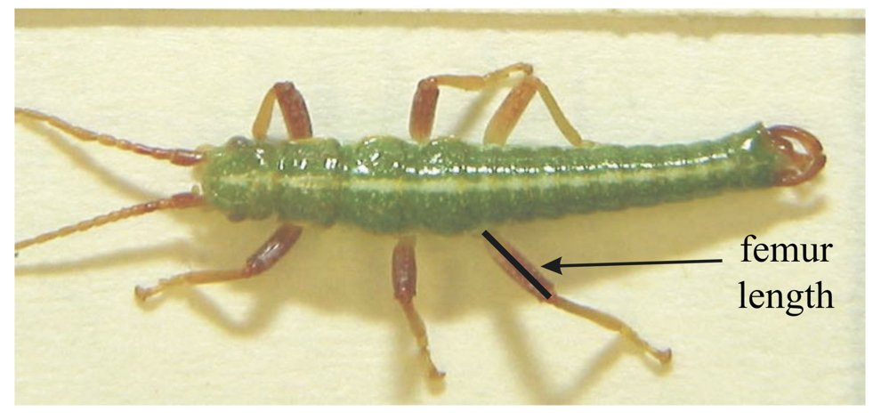{fig-align="center" width="90%"}

## Types of Factors

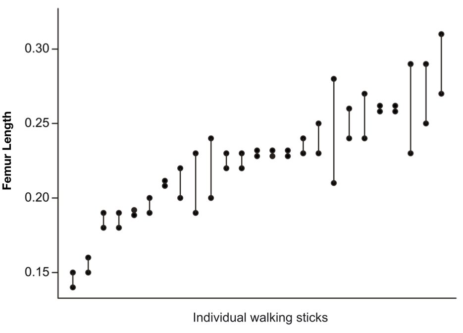{fig-align="center" width="90%"}

## DRAFT: Femur Length Variation Within Individuals

```{r}
#| echo: false
#| eval: true
#| fig-width: 8
#| fig-height: 6

# Simulated walking stick femur length data (2 measurements per individual)
set.seed(123)
n_individuals <- 25
ind_means <- sort(runif(n_individuals, 0.14, 0.28))

# Two measurements per individual with small within-individual variation
m1 <- ind_means + rnorm(n_individuals, 0, 0.008)
m2 <- ind_means + rnorm(n_individuals, 0, 0.008)

par(mar = c(5, 5, 2, 2))
plot(1:n_individuals, m1, pch = 16, cex = 1.2,
     ylim = range(c(m1, m2)) * c(0.95, 1.05),
     xlab = "Individual walking sticks", ylab = "Femur Length",
     xaxt = "n", cex.lab = 1.3, cex.axis = 1.1)
points(1:n_individuals, m2, pch = 16, cex = 1.2)
segments(1:n_individuals, m1, 1:n_individuals, m2, lwd = 1.5)
```

## Factor Levels

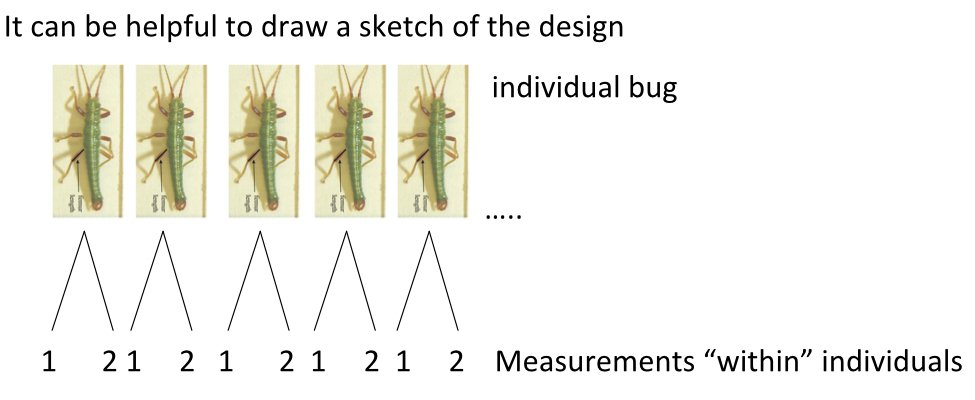{fig-align="center" width="90%"}

## Multifactor ANOVA Model

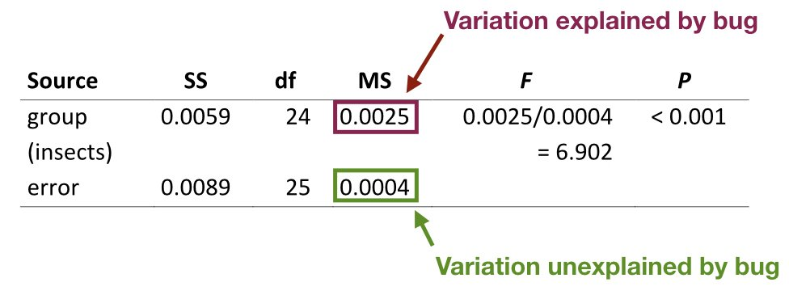{fig-align="center" width="90%"}

## DRAFT: Nested ANOVA Table

| Source | SS | df | MS | F |
|:---|:---|:---|:---|:---|
| Among groups (A) | $SS_A$ | $p - 1$ | $MS_A$ | $MS_A / MS_{B(A)}$ |
| Among subgroups B(A) | $SS_{B(A)}$ | $p(q - 1)$ | $MS_{B(A)}$ | $MS_{B(A)} / MS_{Residual}$ |
| Residual | $SS_{Residual}$ | $pq(n - 1)$ | $MS_{Residual}$ |  |
| **Total** | $SS_{Total}$ | $pqn - 1$ |  |  |

## Sum of Squares Decomposition

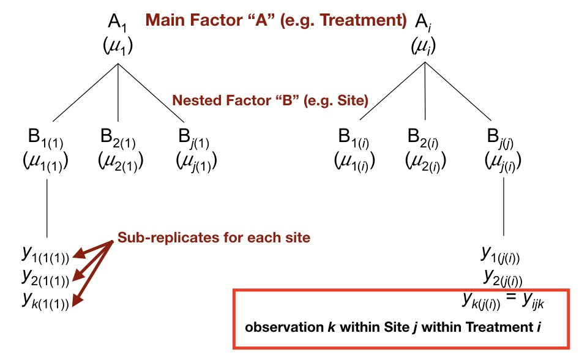{fig-align="center" width="90%"}

## DRAFT: Nested Design Hierarchy

```         
                    Main Factor "A" (e.g. Treatment)
                 ┌──────────────┴──────────────┐
                A₁ (μ₁)                       Aᵢ (μᵢ)
         ┌──────┼──────┐              ┌──────┼──────┐
      B₁₍₁₎  B₂₍₁₎  Bⱼ₍₁₎       B₁₍ᵢ₎  B₂₍ᵢ₎  Bⱼ₍ᵢ₎
      (μ₁₍₁₎)(μ₂₍₁₎)(μⱼ₍₁₎)     (μ₁₍ᵢ₎)(μ₂₍ᵢ₎)(μⱼ₍ᵢ₎)
       │                                            │
    y₁₍₁₍₁₎₎                                   y₁₍ⱼ₍ᵢ₎₎
    y₂₍₁₍₁₎₎     Sub-replicates               y₂₍ⱼ₍ᵢ₎₎
    yₖ₍₁₍₁₎₎     for each site                 yₖ₍ⱼ₍ᵢ₎₎
```

$$y_{k(j(i))} = y_{ijk}$$

**observation** $k$ **within Site** $j$ **within Treatment** $i$

Nested Factor "B" (e.g. Site) — levels of B are **unique** to each level of A

## Multifactor ANOVA Table

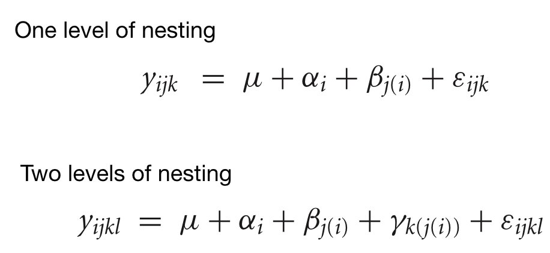{fig-align="center" width="90%"}

## DRAFT: Nested Model Equations

**One level of nesting:**

$$y_{ijk} = \mu + \alpha_i + \beta_{j(i)} + \varepsilon_{ijk}$$

where $\alpha_i$ is the effect of group $i$ and $\beta_{j(i)}$ is the effect of subgroup $j$ nested within group $i$.

**Two levels of nesting:**

$$y_{ijkl} = \mu + \alpha_i + \beta_{j(i)} + \gamma_{k(ij)} + \varepsilon_{ijkl}$$

## Understanding Degrees of Freedom

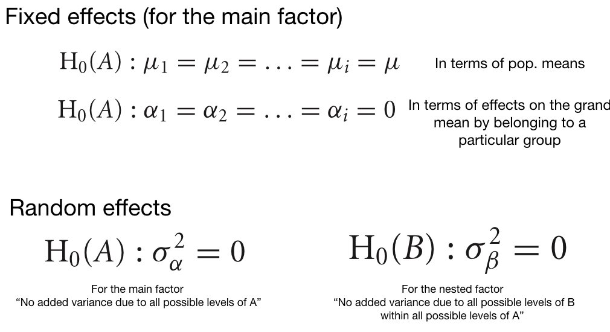{fig-align="center" width="90%"}

## DRAFT: Hypotheses in Nested Designs

::: panel-tabset
### Fixed Effects (Main Factor)

$$H_0(A): \mu_1 = \mu_2 = \ldots = \mu_i = \mu \quad \text{(in terms of pop. means)}$$

$$H_0(A): \alpha_1 = \alpha_2 = \ldots = \alpha_i = 0 \quad \text{(in terms of effects on the grand mean)}$$

### Random Effects

$$H_0(A): \sigma^2_\alpha = 0$$

*"No added variance due to all possible levels of A"*

$$H_0(B): \sigma^2_\beta = 0$$

*"No added variance due to all possible levels of B within all possible levels of A"*

### LaTeX

``` text
% Fixed effects
H_0(A): \mu_1 = \mu_2 = \ldots = \mu_i = \mu
H_0(A): \alpha_1 = \alpha_2 = \ldots = \alpha_i = 0

% Random effects
H_0(A): \sigma^2_\alpha = 0
H_0(B): \sigma^2_\beta = 0
```
:::

{fig-align="center" width="80%"}

## Calculating F-Ratios

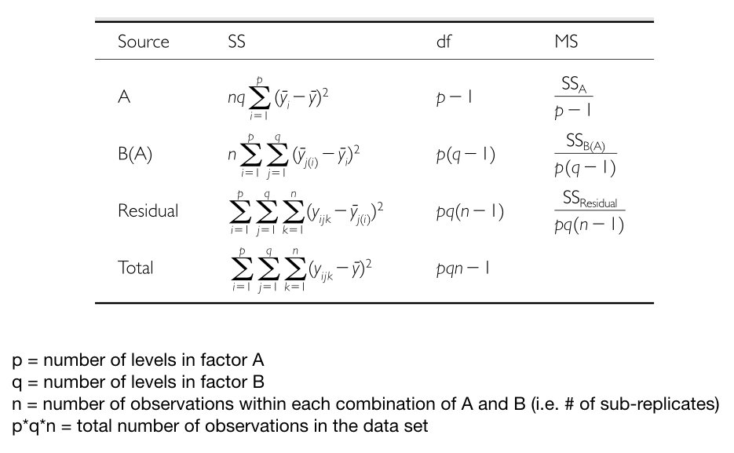{fig-align="center" width="90%"}

## DRAFT: Nested ANOVA F-Ratio Formulas

| Source | SS formula | df | MS | F |
|:---|:---|:---|:---|:---|
| A | $qn\sum(\bar{y}_{i..} - \bar{y}_{...})^2$ | $p - 1$ | $SS_A / (p-1)$ | $MS_A / MS_{B(A)}$ |
| B(A) | $n\sum\sum(\bar{y}_{ij.} - \bar{y}_{i..})^2$ | $p(q - 1)$ | $SS_{B(A)} / [p(q-1)]$ | $MS_{B(A)} / MS_{Res}$ |
| Residual | $\sum\sum\sum(y_{ijk} - \bar{y}_{ij.})^2$ | $pq(n - 1)$ | $SS_{Res} / [pq(n-1)]$ |  |

## Multifactor Example

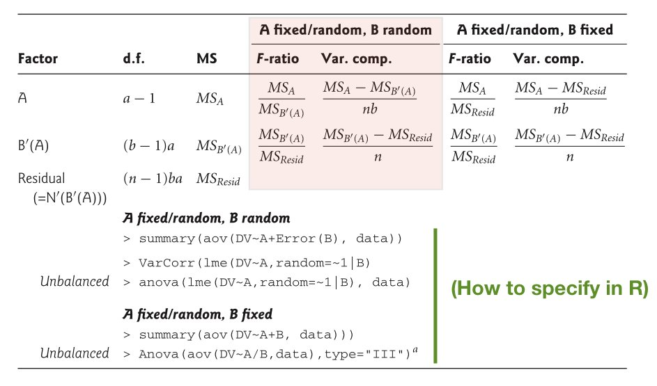{fig-align="center" width="90%"}

## DRAFT: Nested ANOVA in R

| Design | R syntax |
|:---|:---|
| A fixed, B nested in A | `aov(y ~ A + B %in% A)` or `aov(y ~ A/B)` |
| A fixed, B random nested in A | `aov(y ~ A + Error(B %in% A))` |
| Unbalanced nested design | Use `lmer()` from `lme4`: `lmer(y ~ A + (1|A:B))` |

## Multifactor ANOVA Results

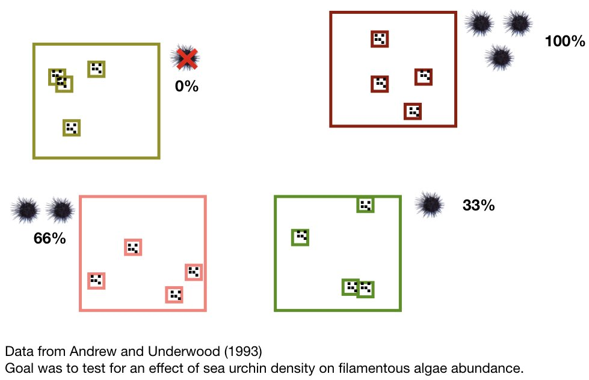{fig-align="center" width="90%"}

## Interactions

An **interaction** means the effect of one variable on the response depends on the state of another variable.

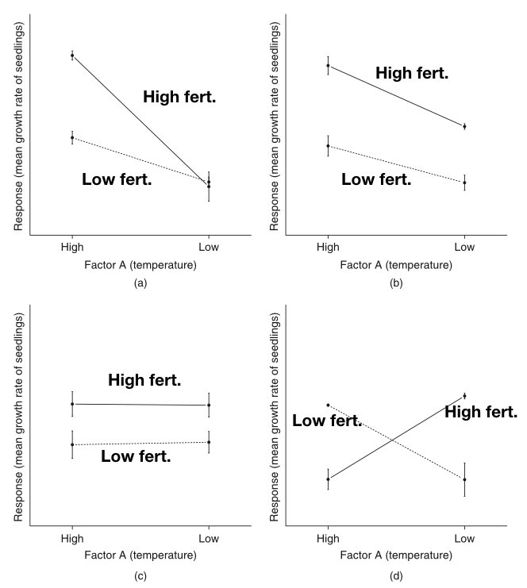{fig-align="center" width="75%"}

## DRAFT: Interaction Plot Patterns

```{r}
#| echo: false
#| eval: true
#| fig-width: 10
#| fig-height: 8

par(mfrow = c(2, 2), mar = c(4, 4, 3, 1))

# (a) No interaction, both significant
temp <- c("Cold", "Hot"); fert <- c("No", "Yes")
plot(1:2, c(4, 6), type = "b", pch = 16, col = "blue", lwd = 2,
     xlim = c(0.8, 2.2), ylim = c(0, 12), axes = FALSE,
     xlab = "Temperature", ylab = "Growth", main = "(a) No interaction")
lines(1:2, c(6, 8), type = "b", pch = 17, col = "red", lwd = 2)
axis(1, at = 1:2, labels = temp); axis(2, las = 1)
legend("topleft", fert, pch = c(16, 17), col = c("blue", "red"), title = "Fertilizer", cex = 0.9)

# (b) Interaction (crossing)
plot(1:2, c(3, 9), type = "b", pch = 16, col = "blue", lwd = 2,
     xlim = c(0.8, 2.2), ylim = c(0, 12), axes = FALSE,
     xlab = "Temperature", ylab = "Growth", main = "(b) Interaction (crossing)")
lines(1:2, c(8, 4), type = "b", pch = 17, col = "red", lwd = 2)
axis(1, at = 1:2, labels = temp); axis(2, las = 1)

# (c) Interaction (fan shape)
plot(1:2, c(4, 5), type = "b", pch = 16, col = "blue", lwd = 2,
     xlim = c(0.8, 2.2), ylim = c(0, 12), axes = FALSE,
     xlab = "Temperature", ylab = "Growth", main = "(c) Interaction (fan)")
lines(1:2, c(4, 10), type = "b", pch = 17, col = "red", lwd = 2)
axis(1, at = 1:2, labels = temp); axis(2, las = 1)

# (d) No effect
plot(1:2, c(5, 5), type = "b", pch = 16, col = "blue", lwd = 2,
     xlim = c(0.8, 2.2), ylim = c(0, 12), axes = FALSE,
     xlab = "Temperature", ylab = "Growth", main = "(d) No effects")
lines(1:2, c(5, 5), type = "b", pch = 17, col = "red", lwd = 2)
axis(1, at = 1:2, labels = temp); axis(2, las = 1)
```

## Visualizing Interactions

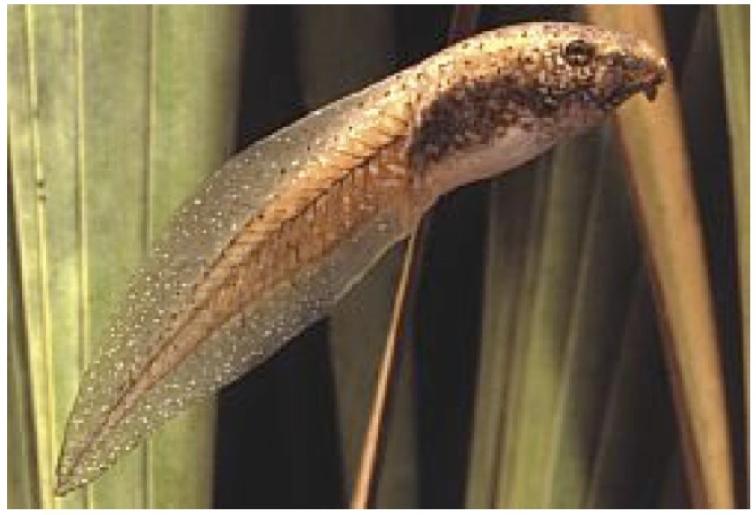{fig-align="center" width="90%"}

## Interaction Interpretation

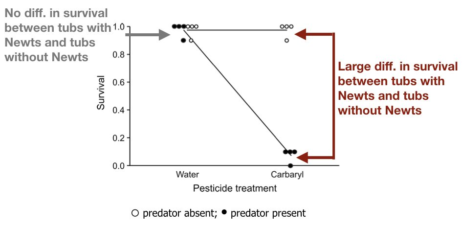{fig-align="center" width="90%"}

## DRAFT: Pesticide × Predator Interaction

```{r}
#| echo: false
#| eval: true
#| fig-width: 7
#| fig-height: 5

# Simulated interaction: pesticide effect depends on predator presence
plot(1:2, c(70, 30), type = "b", pch = 16, col = "blue", lwd = 2,
     xlim = c(0.8, 2.2), ylim = c(0, 100), axes = FALSE,
     xlab = "Pesticide", ylab = "% Survival")
lines(1:2, c(75, 65), type = "b", pch = 17, col = "red", lwd = 2)
axis(1, at = 1:2, labels = c("No pesticide", "Pesticide"))
axis(2, las = 1)
legend("topright", c("With predator", "No predator"),
       pch = c(16, 17), col = c("blue", "red"), cex = 1.0)
title("Interaction: Pesticide effect depends on predator presence")
```

## Factorial vs. Nested Designs

**Factorial designs:**

-   All pairwise combinations of factor levels are present
-   Can assess interactions between factors
-   Example: Drug dose × Exercise regimen

**Nested designs:**

-   Hierarchical structure — levels of one factor occur within levels of another
-   No interaction terms (levels are unique to each group)
-   Often contain random effects
-   Example: Cells within wells within plates

## Two-Factor Factorial Design

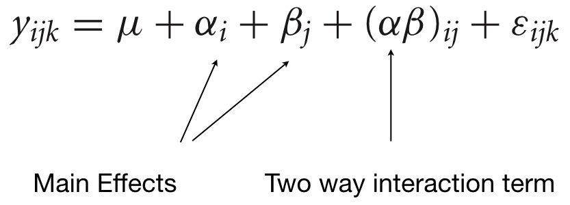{fig-align="center" width="100%"}

## DRAFT: Two-Factor Factorial Model

::: panel-tabset
### Equation

$$\huge y_{ijk} = \mu + \underbrace{\alpha_i + \beta_j}_{\text{Main Effects}} + \underbrace{(\alpha\beta)_{ij}}_{\text{Two-way interaction}} + \varepsilon_{ijk}$$

where:

-   $\mu$ = grand mean
-   $\alpha_i$ = effect of level $i$ of factor A
-   $\beta_j$ = effect of level $j$ of factor B
-   $(\alpha\beta)_{ij}$ = interaction effect of A level $i$ and B level $j$
-   $\varepsilon_{ijk}$ = random error for replicate $k$

### LaTeX

``` text
y_{ijk} = \mu + \alpha_i + \beta_j + (\alpha\beta)_{ij} + \varepsilon_{ijk}
```
:::

## Three-Factor Factorial Design

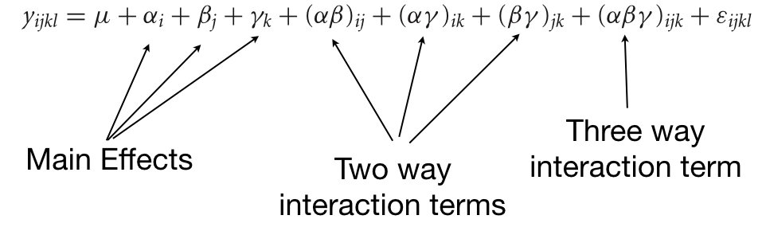{fig-align="center" width="100%"}

## DRAFT: Three-Factor Factorial Model

::: panel-tabset
### Equation

$$y_{ijkl} = \mu + \underbrace{\alpha_i + \beta_j + \gamma_k}_{\text{Main Effects}} + \underbrace{(\alpha\beta)_{ij} + (\alpha\gamma)_{ik} + (\beta\gamma)_{jk}}_{\text{Two-way interactions}} + \underbrace{(\alpha\beta\gamma)_{ijk}}_{\text{Three-way interaction}} + \varepsilon_{ijkl}$$

### Components

| Term | Meaning |
|:---|:---|
| $\alpha_i, \beta_j, \gamma_k$ | Main effects of factors A, B, C |
| $(\alpha\beta)_{ij}, (\alpha\gamma)_{ik}, (\beta\gamma)_{jk}$ | Two-way interaction effects |
| $(\alpha\beta\gamma)_{ijk}$ | Three-way interaction effect |
| $\varepsilon_{ijkl}$ | Random error for replicate $l$ |

### LaTeX

``` text
y_{ijkl} = \mu + \alpha_i + \beta_j + \gamma_k + (\alpha\beta)_{ij} + (\alpha\gamma)_{ik} + (\beta\gamma)_{jk} + (\alpha\beta\gamma)_{ijk} + \varepsilon_{ijkl}
```
:::

## Higher-Order Interactions

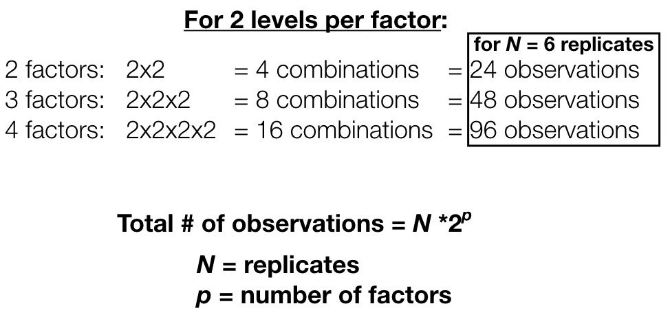{fig-align="center" width="90%"}

## DRAFT: Factorial Design Sizes

**For 2 levels per factor:**

| Factors | Design  | Combinations | Observations (*N* = 6 replicates) |
|:--------|:--------|:-------------|:----------------------------------|
| 2       | 2×2     | 4            | 24                                |
| 3       | 2×2×2   | 8            | 48                                |
| 4       | 2×2×2×2 | 16           | 96                                |

::: panel-tabset
### Formula

$$\text{Total \# of observations} = N \cdot 2^p$$

where $N$ = replicates per cell, $p$ = number of factors

### LaTeX

``` text
\text{Total \# of observations} = N \cdot 2^p
```
:::

## Complete Factorial Model

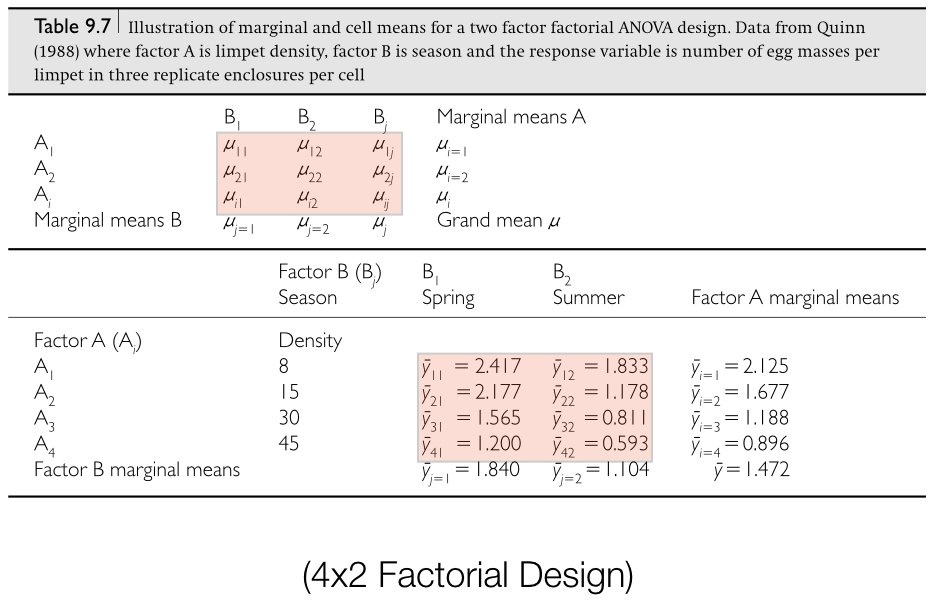{fig-align="center" width="90%"}

## DRAFT: Two-Factor Cell and Marginal Means (Table 9.7)

**General notation** — population means $\mu_{ij}$ for a two-factor design:

|            | $B_1$       | $B_2$       | $\ldots$ | $B_j$      | Marginal means A |
|:-----------|:------------|:------------|:---------|:-----------|:-----------------|
| $A_1$      | $\mu_{11}$  | $\mu_{12}$  | $\ldots$ | $\mu_{1j}$ | $\mu_{i=1}$      |
| $A_2$      | $\mu_{21}$  | $\mu_{22}$  | $\ldots$ | $\mu_{2j}$ | $\mu_{i=2}$      |
| $A_i$      | $\mu_{i1}$  | $\mu_{i2}$  | $\ldots$ | $\mu_{ij}$ | $\mu_{i}$        |
| Marginal B | $\mu_{j=1}$ | $\mu_{j=2}$ | $\ldots$ | $\mu_{j}$  | Grand mean $\mu$ |

**Example: Limpet density (A) × Season (B) — 4×2 Factorial** (Quinn 1988)

| Factor A (Density) | $B_1$ Spring | $B_2$ Summer | Marginal A |
|:---|:---|:---|:---|
| $A_1$ (8) | $\bar{y}_{11}$ = 2.417 | $\bar{y}_{12}$ = 1.833 | $\bar{y}_{i=1}$ = 2.125 |
| $A_2$ (15) | $\bar{y}_{21}$ = 2.177 | $\bar{y}_{22}$ = 1.178 | $\bar{y}_{i=2}$ = 1.677 |
| $A_3$ (30) | $\bar{y}_{31}$ = 1.565 | $\bar{y}_{32}$ = 0.811 | $\bar{y}_{i=3}$ = 1.188 |
| $A_4$ (45) | $\bar{y}_{41}$ = 1.200 | $\bar{y}_{42}$ = 0.593 | $\bar{y}_{i=4}$ = 0.896 |
| **Marginal B** | $\bar{y}_{j=1}$ = 1.840 | $\bar{y}_{j=2}$ = 1.104 | $\bar{y}$ = 1.472 |

## Factorial ANOVA — Fixed Effects

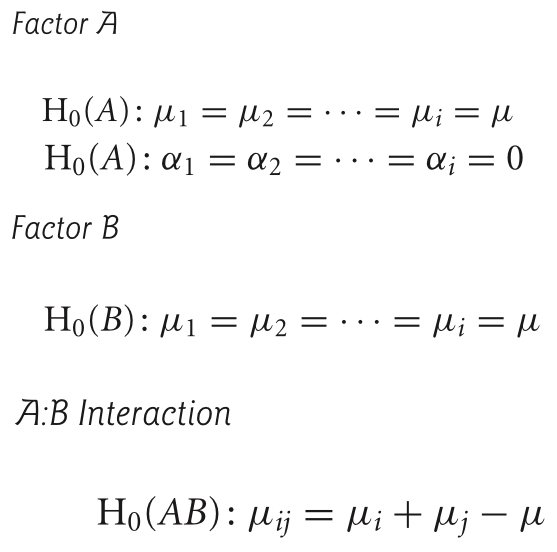{fig-align="center" width="80%"}

## DRAFT: Factorial ANOVA Null Hypotheses — Fixed Effects

::: panel-tabset
### Equations

**Factor A:**

$$H_0(A): \mu_1 = \mu_2 = \cdots = \mu_i = \mu$$

$$H_0(A): \alpha_1 = \alpha_2 = \cdots = \alpha_i = 0$$

**Factor B:**

$$H_0(B): \mu_1 = \mu_2 = \cdots = \mu_j = \mu$$

**A:B Interaction:**

$$H_0(AB): \mu_{ij} = \mu_i + \mu_j - \mu$$

(i.e., the cell mean equals what we'd expect from the marginal means alone — no interaction)

### LaTeX

``` text
H_0(A): \mu_1 = \mu_2 = \cdots = \mu_i = \mu
H_0(A): \alpha_1 = \alpha_2 = \cdots = \alpha_i = 0
H_0(B): \mu_1 = \mu_2 = \cdots = \mu_j = \mu
H_0(AB): \mu_{ij} = \mu_i + \mu_j - \mu
```
:::

## Factorial ANOVA — Random Effects

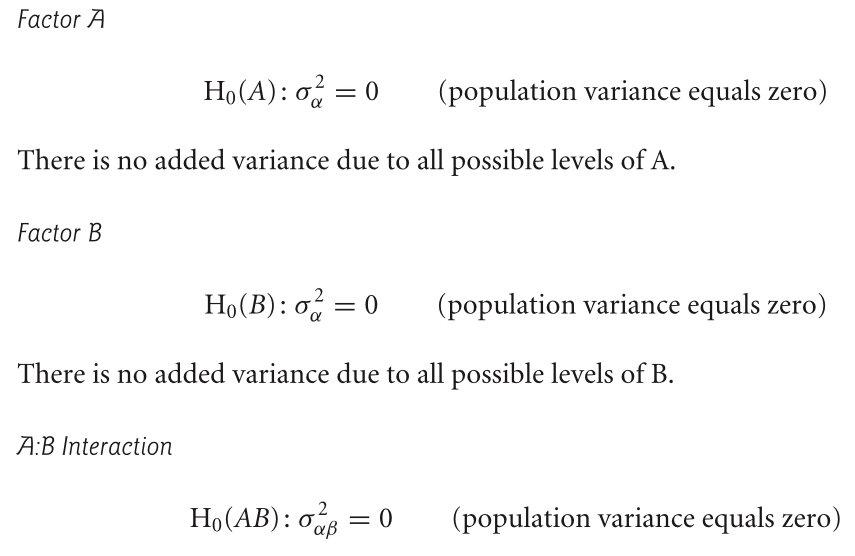{fig-align="center" width="100%"}

## DRAFT: Factorial ANOVA Null Hypotheses — Random Effects

::: panel-tabset
### Equations

**Factor A:**

$$H_0(A): \sigma^2_\alpha = 0 \quad \text{(population variance equals zero)}$$

There is no added variance due to all possible levels of A.

**Factor B:**

$$H_0(B): \sigma^2_\beta = 0 \quad \text{(population variance equals zero)}$$

There is no added variance due to all possible levels of B.

**A:B Interaction:**

$$H_0(AB): \sigma^2_{\alpha\beta} = 0 \quad \text{(population variance equals zero)}$$

### LaTeX

``` text
H_0(A): \sigma^2_\alpha = 0
H_0(B): \sigma^2_\beta = 0
H_0(AB): \sigma^2_{\alpha\beta} = 0
```
:::

## Mean Squares for Factorial Model

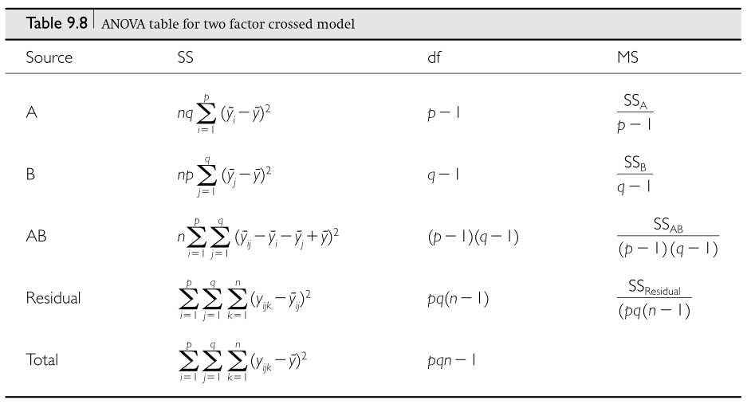{fig-align="center" width="100%"}

## DRAFT: ANOVA Table for Two-Factor Crossed Model (Table 9.8)

| Source | SS | df | MS |
|:---|:---|:---|:---|
| A | $nq \displaystyle\sum_{i=1}^{p}(\bar{y}_{i} - \bar{y})^2$ | $p - 1$ | $\dfrac{SS_A}{p - 1}$ |
| B | $np \displaystyle\sum_{j=1}^{q}(\bar{y}_{j} - \bar{y})^2$ | $q - 1$ | $\dfrac{SS_B}{q - 1}$ |
| AB | $n \displaystyle\sum_{i=1}^{p}\sum_{j=1}^{q}(\bar{y}_{ij} - \bar{y}_{i} - \bar{y}_{j} + \bar{y})^2$ | $(p-1)(q-1)$ | $\dfrac{SS_{AB}}{(p-1)(q-1)}$ |
| Residual | $\displaystyle\sum_{i=1}^{p}\sum_{j=1}^{q}\sum_{k=1}^{n}(y_{ijk} - \bar{y}_{ij})^2$ | $pq(n-1)$ | $\dfrac{SS_{Residual}}{pq(n-1)}$ |
| Total | $\displaystyle\sum_{i=1}^{p}\sum_{j=1}^{q}\sum_{k=1}^{n}(y_{ijk} - \bar{y})^2$ | $pqn - 1$ |  |

## F-Ratios for Factorial Model

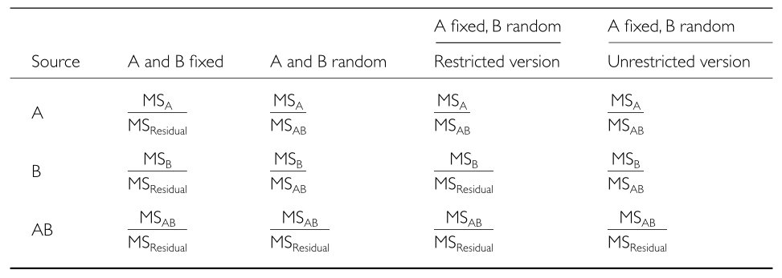{fig-align="center" width="100%"}

## DRAFT: F-Ratios for Fixed, Random, and Mixed Models

| Source | A and B fixed | A and B random | A fixed, B random (Restricted) | A fixed, B random (Unrestricted) |
|:---|:---|:---|:---|:---|
| A | $\dfrac{MS_A}{MS_{Residual}}$ | $\dfrac{MS_A}{MS_{AB}}$ | $\dfrac{MS_A}{MS_{AB}}$ | $\dfrac{MS_A}{MS_{AB}}$ |
| B | $\dfrac{MS_B}{MS_{Residual}}$ | $\dfrac{MS_B}{MS_{AB}}$ | $\dfrac{MS_B}{MS_{Residual}}$ | $\dfrac{MS_B}{MS_{AB}}$ |
| AB | $\dfrac{MS_{AB}}{MS_{Residual}}$ | $\dfrac{MS_{AB}}{MS_{Residual}}$ | $\dfrac{MS_{AB}}{MS_{Residual}}$ | $\dfrac{MS_{AB}}{MS_{Residual}}$ |

::: callout-note
The choice of denominator for the F-ratio depends on whether each factor is fixed or random. When a factor is random, its interaction with the other factor must be used as the error term for testing the other factor's main effect.
:::

## Interpretation of Results

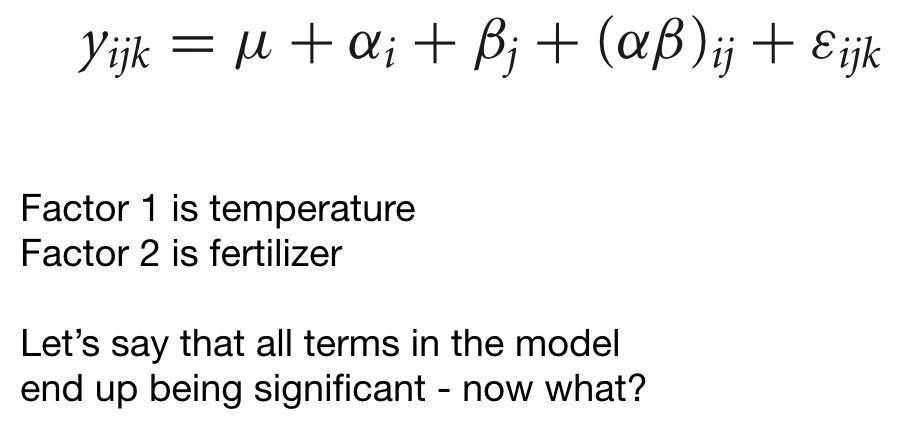{fig-align="center" width="100%"}

## DRAFT: Interpreting Significant Terms

::: panel-tabset
### Model

$$y_{ijk} = \mu + \alpha_i + \beta_j + (\alpha\beta)_{ij} + \varepsilon_{ijk}$$

-   Factor 1 is **temperature**
-   Factor 2 is **fertilizer**

### When All Terms Are Significant

If all terms in the model are significant — now what?

1.  **Start with the interaction** — if $(\alpha\beta)_{ij}$ is significant, the effect of one factor depends on the level of the other
2.  **Main effects are hard to interpret alone** when interaction is present
3.  Examine **simple effects** — the effect of one factor at each level of the other
4.  Use **interaction plots** to visualize patterns
5.  Perform **post-hoc comparisons** within each level of the other factor

### LaTeX

``` text
y_{ijk} = \mu + \alpha_i + \beta_j + (\alpha\beta)_{ij} + \varepsilon_{ijk}
```
:::

## Factorial ANOVA in R

::: panel-tabset
### Code

```{r}
#| eval: false
#| echo: true

rna_data <- read.table("data/Stickle_RNAseq.tsv", header = TRUE, sep = "\t")

gene       <- rna_data$Gene100
microbiota <- rna_data$Microbiota
genotype   <- rna_data$Genotype

# Multiplicative model (with interaction)
model_interaction <- aov(gene ~ microbiota * genotype)

# Additive model (no interaction)
model_additive <- aov(gene ~ microbiota + genotype)

summary(model_interaction)
summary(model_additive)
```

### Interpretation

-   If the interaction term is significant, the effect of one factor depends on the level of the other
-   If the interaction is not significant, interpret the main effects directly
-   Always check the interaction first before interpreting main effects
:::

# BREAK {background-color="#e74c3c"}

# Random Effects {background-color="#2c3e50"}

## Fixed vs. Random Effects

**Fixed effects:**

-   Groups are predetermined, of direct interest, repeatable
-   Examples: medical treatments, predetermined doses, habitat types
-   We want to estimate specific group means

**Random effects:**

-   Groups randomly sampled from a larger population
-   Examples: families, subjects measured repeatedly, blocks, batches
-   **Variance among groups** is of interest, not specific group means

## When to Use Random Effects

-   Nested sampling designs (individuals within populations)
-   Subplots within plots
-   Replicates grouped spatially or temporally (blocks, batches)
-   Related individuals (families, litters)
-   Repeated measures on the same subjects

## Random Effects Hypothesis

::: panel-tabset
### Equation

$$H_0: \sigma^2_\alpha = 0$$ $$H_A: \sigma^2_\alpha \neq 0$$

### LaTeX

``` text
H_0: \sigma^2_\alpha = 0
H_A: \sigma^2_\alpha \neq 0
```
:::

We are testing whether the **variance component** for the random effect is zero — i.e., whether there is meaningful variation among the randomly sampled groups.

## Random Effects in R

::: panel-tabset
### Code

```{r}
#| eval: false
#| echo: true

library(nlme)

# Random effect model
micro_model_random_effect <- lme(
  fixed  = Gene202 ~ 1,
  random = ~1 | Geno.Micro,
  data   = stickle_micro
)

summary(micro_model_random_effect)
```

### Key Points

-   In R, `lm()` assumes all effects are **fixed**
-   For random effects, use `lme()` from the **nlme** package or `lmer()` from **lme4**
-   The `~1 | group` syntax specifies a random intercept for each level of `group`
:::

## Random Effects: Bioengineering Example

Measuring cell viability across multiple wells within multiple plates within multiple experiments:

::: panel-tabset
### Code

```{r}
#| echo: true
#| eval: false

# Simulated hierarchical data: cells → wells → plates → experiments
set.seed(42)
n_exp <- 3; n_plate <- 4; n_well <- 6
experiment <- rep(1:n_exp, each = n_plate * n_well)
plate      <- rep(rep(1:n_plate, each = n_well), n_exp)
well       <- rep(1:n_well, n_exp * n_plate)

# Generate data with variance at each level
exp_effect   <- rnorm(n_exp, 0, 5)[experiment]
plate_effect <- rnorm(n_exp * n_plate, 0, 3)[interaction(experiment, plate)]
viability    <- 75 + exp_effect + plate_effect + rnorm(n_exp * n_plate * n_well, 0, 2)

cell_data <- data.frame(
  viability, experiment = factor(experiment),
  plate = factor(plate), well = factor(well)
)

# Fit nested random effects model
library(nlme)
nested_model <- lme(viability ~ 1,
                    random = ~1 | experiment/plate,
                    data = cell_data)
summary(nested_model)

# Extract variance components
VarCorr(nested_model)
```

### Interpreting Variance Components

The output from `VarCorr()` shows:

-   **Experiment variance**: variation between experimental runs
-   **Plate-within-experiment variance**: variation between plates within a run
-   **Residual variance**: well-to-well variation within plates
-   ICC (Intraclass Correlation) = group variance / total variance
:::

------------------------------------------------------------------------

# Nested ANOVA {background-color="#2c3e50"}

## Nested Design

-   Factors are hierarchical within one another
-   Sources of variance are hierarchical
-   No interaction terms (in completely nested designs)

**Example:** Students within classrooms within schools

::: panel-tabset
### Code

```{r}
#| eval: false
#| echo: true

# Nested ANOVA using aov
model_nested <- aov(y ~ A + B %in% A, data = mydata)

# Using lme for random nested effects
model_nested_random <- lme(y ~ A, random = ~1 | A/B, data = mydata)

summary(model_nested_random)
```

### Interpretation

-   The `%in%` notation means "B is nested within A"
-   The `~1 | A/B` random effects specification means "random intercepts for B nested within A"
-   Nested designs arise when the levels of one factor are unique to each level of another (e.g., specific cell lines unique to each lab)
:::

------------------------------------------------------------------------

# Repeated Measures Analysis {background-color="#2c3e50"}

## What are Repeated Measures?

Measurements taken on the **same subjects** at multiple:

-   **Time points** (longitudinal studies)
-   **Conditions** (within-subjects design)
-   **Locations** (spatial sampling)

**Advantages:** Controls for individual differences, requires fewer subjects, more statistical power

**Challenge:** Observations are **not independent** — standard ANOVA assumes independence

## Repeated Measures ANOVA

**Sphericity Assumption:**

-   Variances of differences between all pairs of conditions must be equal
-   Often violated in practice

**Mauchly's Test:** Tests the sphericity assumption

-   p \< 0.05 → sphericity is violated → apply correction (Greenhouse-Geisser or Huynh-Feldt)

## Repeated Measures in R

::: panel-tabset
### Output

```{r}
#| label: rm-anova-output
#| echo: false
#| eval: true

# Create repeated measures data
set.seed(42)
subject <- factor(rep(1:10, each = 3))
time <- factor(rep(c("Pre", "Mid", "Post"), 10))
score <- c(
  rnorm(10, 50, 5),   # Pre
  rnorm(10, 55, 5),   # Mid
  rnorm(10, 62, 5)    # Post
) + rep(rnorm(10, 0, 8), each = 3)  # Subject random effect

rm_data <- data.frame(subject, time, score)

# Repeated measures ANOVA
rm_aov <- aov(score ~ time + Error(subject/time), data = rm_data)
summary(rm_aov)
```

### Code

```{r}
#| label: rm-anova-code
#| echo: true
#| eval: false

# Create repeated measures data
set.seed(42)
subject <- factor(rep(1:10, each = 3))
time <- factor(rep(c("Pre", "Mid", "Post"), 10))
score <- c(
  rnorm(10, 50, 5),   # Pre
  rnorm(10, 55, 5),   # Mid
  rnorm(10, 62, 5)    # Post
) + rep(rnorm(10, 0, 8), each = 3)  # Subject random effect

rm_data <- data.frame(subject, time, score)

# Repeated measures ANOVA
rm_aov <- aov(score ~ time + Error(subject/time), data = rm_data)
summary(rm_aov)
```
:::

## Mixed Models for Repeated Measures

The modern approach uses **linear mixed models**, which are more flexible and handle missing data gracefully:

::: panel-tabset
### Output

```{r}
#| echo: false
#| eval: true
#| message: false

library(nlme)

# Mixed model with random intercept for subject
rm_mixed <- lme(score ~ time, random = ~1 | subject, data = rm_data)
summary(rm_mixed)
```

### Code

```{r}
#| echo: true
#| eval: false

library(nlme)

# Mixed model with random intercept for subject
rm_mixed <- lme(score ~ time, random = ~1 | subject, data = rm_data)
summary(rm_mixed)
```
:::

## Visualizing Repeated Measures

::: panel-tabset
### Output

```{r}
#| label: repeated-measures-output
#| echo: false
#| eval: true
#| fig-width: 10
#| fig-height: 4

par(mfrow = c(1, 2))

# Spaghetti plot (individual trajectories)
interaction.plot(rm_data$time, rm_data$subject, rm_data$score,
                 xlab = "Time", ylab = "Score", legend = FALSE,
                 main = "Individual Trajectories", col = "gray")

# Group means with error bars
means <- tapply(rm_data$score, rm_data$time, mean)
sds <- tapply(rm_data$score, rm_data$time, sd)
n <- 10
ses <- sds / sqrt(n)

barplot(means, ylim = c(0, max(means) + max(ses) * 2),
        main = "Group Means ± SE", ylab = "Score")
arrows(x0 = c(0.7, 1.9, 3.1), y0 = means - ses,
       y1 = means + ses, angle = 90, code = 3, length = 0.1)
```

### Code

```{r}
#| label: repeated-measures-code
#| echo: true
#| eval: false

par(mfrow = c(1, 2))

# Spaghetti plot (individual trajectories)
interaction.plot(rm_data$time, rm_data$subject, rm_data$score,
                 xlab = "Time", ylab = "Score", legend = FALSE,
                 main = "Individual Trajectories", col = "gray")

# Group means with error bars
means <- tapply(rm_data$score, rm_data$time, mean)
sds <- tapply(rm_data$score, rm_data$time, sd)
n <- 10
ses <- sds / sqrt(n)

barplot(means, ylim = c(0, max(means) + max(ses) * 2),
        main = "Group Means ± SE", ylab = "Score")
arrows(x0 = c(0.7, 1.9, 3.1), y0 = means - ses,
       y1 = means + ses, angle = 90, code = 3, length = 0.1)
```
:::

## Repeated Measures: ggplot Visualization

::: panel-tabset
### Output

```{r}
#| label: rm-ggplot-output
#| echo: false
#| eval: true
#| fig-width: 10
#| fig-height: 4

library(ggplot2)

rm_summary <- rm_data %>%
  group_by(time) %>%
  summarize(mean_score = mean(score), se = sd(score)/sqrt(n()), .groups = "drop")

p1 <- ggplot(rm_data, aes(x = time, y = score, group = subject)) +
  geom_line(alpha = 0.3, color = "gray50") +
  geom_point(alpha = 0.3) +
  geom_line(data = rm_summary, aes(x = time, y = mean_score, group = 1),
            color = "steelblue", linewidth = 1.5) +
  geom_point(data = rm_summary, aes(x = time, y = mean_score, group = 1),
             color = "steelblue", size = 3) +
  geom_errorbar(data = rm_summary,
                aes(x = time, y = mean_score, ymin = mean_score - se, ymax = mean_score + se, group = 1),
                width = 0.1, color = "steelblue", linewidth = 0.8) +
  labs(title = "Spaghetti Plot with Group Mean ± SE",
       x = "Time Point", y = "Score") +
  theme_minimal(base_size = 14)
print(p1)
```

### Code

```{r}
#| label: rm-ggplot-code
#| echo: true
#| eval: false

library(ggplot2)

rm_summary <- rm_data %>%
  group_by(time) %>%
  summarize(mean_score = mean(score), se = sd(score)/sqrt(n()))

ggplot(rm_data, aes(x = time, y = score, group = subject)) +
  geom_line(alpha = 0.3, color = "gray50") +
  geom_point(alpha = 0.3) +
  geom_line(data = rm_summary,
            aes(x = time, y = mean_score, group = 1),
            color = "steelblue", linewidth = 1.5) +
  geom_point(data = rm_summary,
             aes(x = time, y = mean_score, group = 1),
             color = "steelblue", size = 3) +
  geom_errorbar(data = rm_summary,
                aes(x = time, y = mean_score,
                    ymin = mean_score - se,
                    ymax = mean_score + se, group = 1),
                width = 0.1, color = "steelblue") +
  labs(title = "Spaghetti Plot with Group Mean ± SE",
       x = "Time Point", y = "Score") +
  theme_minimal()
```
:::

## R Exercise: Factorial ANOVA

::: callout-tip
## Exercise

Using the `ToothGrowth` dataset (tooth growth in guinea pigs):

1.  Examine the structure: `supp` (supplement type) × `dose` (dose level)
2.  Create an interaction plot
3.  Perform two-way ANOVA
4.  Test for interaction effect
5.  If significant interaction, perform simple effects analysis

```{r}
#| eval: false
#| echo: true

# Starter code
data(ToothGrowth)
ToothGrowth$dose <- factor(ToothGrowth$dose)

# Interaction plot
interaction.plot(ToothGrowth$dose, ToothGrowth$supp, ToothGrowth$len)

# Two-way ANOVA
tooth_aov <- aov(len ~ supp * dose, data = ToothGrowth)

# Your analysis here...
```
:::

------------------------------------------------------------------------
