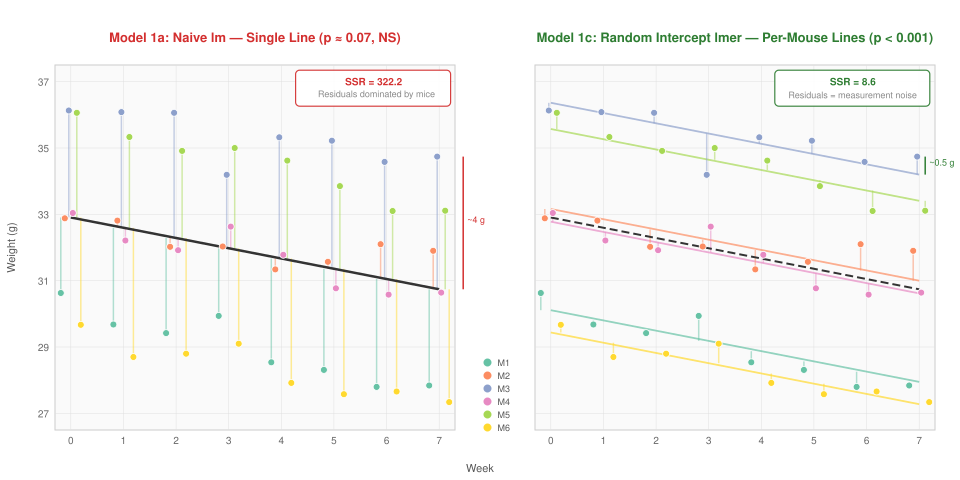
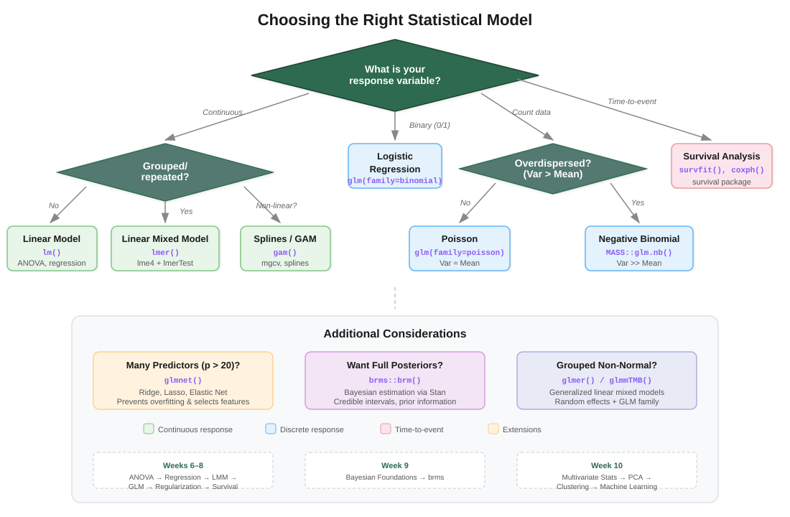
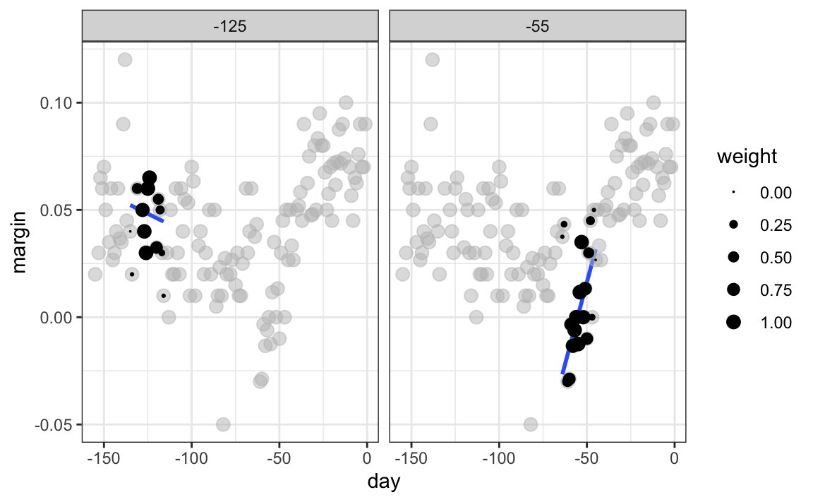

```{r}
#| label: setup
#| include: false

# Core data manipulation and visualization
library(tidyverse)
library(knitr)
library(readxl)

# Mixed models
library(lme4)
library(lmerTest)
library(emmeans)
library(broom.mixed)
library(performance)
library(patchwork)

# Statistical analysis packages
library(MASS)        # LDA, robust regression
library(pwr)         # Power analysis
library(boot)        # Bootstrap methods
library(car)         # Companion to Applied Regression
library(survival)    # Survival analysis
library(broom)       # Tidy model output
library(splines)     # Natural splines

# Set consistent theme for all plots
theme_set(theme_minimal(base_size = 14))

# Set seed for reproducibility
set.seed(2026)
```

# Week 8: GLMs, Regularization, and Survival Analysis {background-color="#d4edda"}

## Week 8 Topics

::: incremental
-   Finish Linear Mixed Models
-   Generalized Linear Models (Logistic and Poisson regression)
-   Regularization methods (Ridge, Lasso, Elastic Net)
-   Splines and LOESS smoothing
-   Survival analysis
:::

::: callout-note
**Readings:** Chapter 29

**HW4 Due next week**
:::

## Packages for This Week

::: panel-tabset
### Install

```{r}
#| eval: false
#| echo: true

# Install new packages (run once)
install.packages(c("lme4", "lmerTest", "emmeans", "broom.mixed",
                    "performance", "patchwork", "survival", 
                    "glmnet", "mgcv", "splines"))
```

### Load

```{r}
#| eval: false
#| echo: true

# Mixed models (replacing nlme with lme4 ecosystem)
library(lme4)         # lmer() — fits linear mixed models
library(lmerTest)     # Adds p-values via Satterthwaite df
library(emmeans)      # Estimated marginal means & contrasts
library(broom.mixed)  # Tidy output for mixed models
library(performance)  # check_model() diagnostics

# Other analysis packages
library(survival)     # Survival analysis (Kaplan-Meier, Cox)
library(glmnet)       # Regularized regression (LASSO, ridge)
library(mgcv)         # Generalized additive models (GAMs)
library(splines)      # Spline basis functions
```
:::

**Datasets for This Week:**

-   `glp1_simple.csv`
-   `glp1_diet.csv`
-   `scaffold_degradation_data.csv`

**Additional datasets from packages**:

-   `lung` (survival package)

# Finish Linear Mixed Models {background-color="#d4edda"}

## Where We Left Off

Last week we introduced the concept of linear mixed models — models that partition variability into

-   **fixed effects** (treatments you manipulate) and
-   **random effects** (nuisance grouping variables like subjects, batches, or labs).

Today we'll build intuition for *why* mixed models work by starting with a simple example and progressively adding complexity.

::: callout-tip
### Key Insight

The core idea: subjects (mice, batches, patients) differ from each other in systematic ways. If we ignore this, we either

-   waste degrees of freedom (treating each subject as a fixed effect) or
-   inflate Type I error (ignoring the grouping entirely).

Mixed models solve both problems.
:::

## Fixed vs. Random Effects — A Quick Review

::::: columns
::: {.column width="48%"}
**Fixed Effects**

-   Specific, repeatable levels
-   You care about *these* levels
-   Treatment conditions, drug doses, scaffold coatings
-   Estimated as regression coefficients (β)
:::

::: {.column width="48%"}
**Random Effects**

-   Levels are a *sample* from a larger population
-   You care about the *variability*, not specific levels
-   Batches, labs, technicians, patients
-   Estimated as variance components (σ²)
:::
:::::

::: callout-tip
### Rule of Thumb

Ask: "If I repeated this experiment, would I use *these exact same* levels?" If yes → fixed. If you'd get a new random sample → random.
:::

## The Mixed Model Equation

$$\mathbf{y} = \mathbf{X}\boldsymbol{\beta} + \mathbf{Z}\mathbf{u} + \boldsymbol{\varepsilon}$$

Where:

::: incremental
-   $\mathbf{y}$ — vector of observed responses (degradation rates)
-   $\mathbf{X}\boldsymbol{\beta}$ — fixed effects (treatment, temperature, their interaction)
-   $\mathbf{Z}\mathbf{u}$ — random effects, where $\mathbf{u} \sim N(\mathbf{0}, \mathbf{G})$
-   $\boldsymbol{\varepsilon}$ — residual error, where $\boldsymbol{\varepsilon} \sim N(\mathbf{0}, \mathbf{R})$
-   Random effects **shrink** estimates toward the grand mean — partial pooling
:::

# Starting simple - putting mice on a diet drug

## GLP-1 Weight Loss Study in Mice

We'll work through two versions of a GLP-1 receptor agonist weight loss experiment.

-   **Simple version:**

    -   6 mice, all on GLP-1
    -   weighed weekly for 7 weeks
    -   introduces random intercepts

-   **Extended version:**

    -   12 mice on GLP-1
    -   half on high-protein diet and half on low-protein diet
    -   weighed weekly for 7 weeks
    -   introduces random slopes and treatment interactions

For each, we'll fit three models of increasing sophistication and compare how well they capture the data structure.

## The Experiment - random intercepts

-   Six mice are placed on a GLP-1 receptor agonist (semaglutide).
-   Each mouse is weighed weekly for 7 weeks.
-   All mice lose weight over time, but they start at different baseline weights and lose weight at slightly different rates.

**The statistical question:** Is there a significant decline in weight over the 7-week treatment period?

**The complication:** Repeated measurements on the same mouse are not independent — each mouse has its own baseline weight, creating within-subject correlation.

## Read in the Dataset

::: panel-tabset
### Output

```{r}
#| label: glp1-data-output
#| echo: false

glp1_simple <- read.csv("data/glp1_simple.csv")
glp1_simple$mouse_id <- factor(glp1_simple$mouse_id)

cat("Dimensions:", nrow(glp1_simple), "rows ×", ncol(glp1_simple), "columns\n\n")
head(glp1_simple, 12) %>% kable(digits = 1)
```

### Code

```{r}
#| label: glp1-data-code
#| echo: true
#| eval: false

# Read the GLP-1 simple dataset
glp1_simple <- read.csv("data/glp1_simple.csv")
glp1_simple$mouse_id <- factor(glp1_simple$mouse_id)

str(glp1_simple)
head(glp1_simple)
```

### Explanation

-   6 mice (M1–M6), each weighed weekly for 7 weeks (weeks 0–7), yielding 48 observations
-   Each mouse starts at a different baseline weight (\~29–37 g)
-   All mice lose weight at approximately 0.31 g/week, with small individual variation
-   Residual measurement noise is roughly 0.5 g
-   This creates the classic repeated-measures structure: observations nested within subjects, with both between-subject and within-subject variability
:::

## Visualize the Data

::: panel-tabset
### Output

```{r}
#| label: glp1-viz-output
#| echo: false
#| fig-width: 9
#| fig-height: 5

ggplot(glp1_simple, aes(x = week, y = weight, color = mouse_id, group = mouse_id)) +
  geom_line(alpha = 0.6, linewidth = 0.8) +
  geom_point(size = 2, alpha = 0.7) +
  scale_color_brewer(palette = "Set2") +
  labs(
    title = "GLP-1 Weight Loss Study: 6 Mice Over 7 Weeks",
    subtitle = "Each line represents one mouse — note different starting weights",
    x = "Week", y = "Weight (g)", color = "Mouse"
  )
```

### Code

```{r}
#| label: glp1-viz-code
#| echo: true
#| eval: false

ggplot(glp1_simple, aes(x = week, y = weight, 
                         color = mouse_id, group = mouse_id)) +
  geom_line(alpha = 0.6, linewidth = 0.8) +
  geom_point(size = 2, alpha = 0.7) +
  scale_color_brewer(palette = "Set2") +
  labs(title = "GLP-1 Weight Loss Study: 6 Mice Over 7 Weeks",
       x = "Week", y = "Weight (g)", color = "Mouse")
```

### Explanation

-   All mice show a clear downward trend — the GLP-1 drug is working
-   But the lines are separated vertically — mice start at different weights (M1 may be heavier than M6)
-   The lines are roughly parallel, suggesting similar rates of weight loss
-   A standard `lm()` that ignores mouse identity would treat all 48 points as independent, which they clearly aren't
:::

## Model 1a: Ignoring the Mouse Effect (Naive linear model)

::: panel-tabset
### Output

```{r}
#| label: glp1-naive-output
#| echo: false

mod_naive <- lm(weight ~ week, data = glp1_simple)
summary(mod_naive)
```

### Code

```{r}
#| label: glp1-naive-code
#| echo: true
#| eval: false

# Naive approach: ignore that mice are different
mod_naive <- lm(weight ~ week, data = glp1_simple)
summary(mod_naive)
```

### Explanation

-   This model treats all 48 observations as independent — it ignores the mouse grouping entirely
-   The slope estimate for `week` captures the average weight loss, but the residual variance is inflated because it includes **both** measurement noise **and** between-mouse variability
-   The $R^2$ is lower than it should be because the model can't explain why some points are consistently high (heavy mice) and others consistently low (light mice)
-   The standard error for the slope is so inflated that the effect of week is **not statistically significant** (p ≈ 0.07) — even though the drug is clearly working when you look at the plot!
:::

## Model 1b: Mouse as a Fixed Effect (naive factorial)

::: panel-tabset
### Output

```{r}
#| label: glp1-fixed-output
#| echo: false

mod_fixed <- lm(weight ~ week + mouse_id, data = glp1_simple)
summary(mod_fixed)
```

### Code

```{r}
#| label: glp1-fixed-code
#| echo: true
#| eval: false

# Fixed effect for each mouse — separate intercept per mouse
mod_fixed <- lm(weight ~ week + mouse_id, data = glp1_simple)
summary(mod_fixed)
```

### Explanation

-   Adding `mouse_id` as a fixed effect gives each mouse its own intercept — this is the "parallel slopes" model
-   The $R^2$ jumps dramatically because we can now explain the between-mouse differences
-   The residual standard error drops because we've removed the between-mouse variance from the residuals
-   **The problem:** this uses 5 extra degrees of freedom (one per additional mouse) just for a nuisance variable. With 6 mice this is manageable, but imagine 100 subjects — you'd burn 99 df on intercepts you don't care about. And you can't generalize: these specific intercepts only apply to *these* 6 mice.
:::

## Model 1c: Random Intercept Model Using `lmer`

::: panel-tabset
### Output

```{r}
#| label: glp1-lmer-output
#| echo: false

mod_ri <- lmer(weight ~ week + (1 | mouse_id), data = glp1_simple)
summary(mod_ri)
```

### Code

```{r}
#| label: glp1-lmer-code
#| echo: true
#| eval: false

# Random intercept model — mouse as random effect
mod_ri <- lmer(weight ~ week + (1 | mouse_id), data = glp1_simple)
summary(mod_ri)
```

### Explanation

-   `(1 | mouse_id)` tells the model that each mouse has its own random baseline, drawn from a normal distribution
-   Instead of estimating 6 separate intercepts, we estimate **one variance parameter** ($\sigma^2_{mouse}$) — far more efficient
-   The fixed effect of `week` is the population-average slope — it applies to any mouse from this population, not just these 6
-   The random effects table shows how much variance is attributable to between-mouse differences vs. within-mouse residual noise
-   The **Intraclass Correlation (ICC)** = $\frac{\sigma^2_{mouse}}{\sigma^2_{mouse} + \sigma^2_{resid}}$ tells you what proportion of the total variance is between mice
:::

## The Core Insight: Where Do the Residuals Come From?

::: panel-tabset

### Residual comparison

{fig-align="center" width="95%"}

### Interpretation
- On the left, the naive model fits **one line** so the residuals are larger. 
- On the right, the mixed model gives **each mouse its own line** and the residuals shrink to tiny measurement noise.
- The naive model's residuals are dominated by **between-mouse differences**. 
- The mixed model removes this systematic component, leaving only random measurement noise. 
- That 37-fold reduction in SSR is what transforms the standard error from 0.17 to 0.03 and flips the p-value from **0.07 (NS) to < 0.001**.

:::


## Comparing Residuals Across the Three Models

::: panel-tabset
### Output

```{r}
#| label: glp1-resid-compare-output
#| echo: false
#| fig-width: 10
#| fig-height: 7

# Compute residuals for each model
glp1_simple$resid_naive <- resid(mod_naive)
glp1_simple$resid_fixed <- resid(mod_fixed)
glp1_simple$resid_lmer  <- resid(mod_ri)

# Compute SSR for each
ssr_naive <- sum(glp1_simple$resid_naive^2)
ssr_fixed <- sum(glp1_simple$resid_fixed^2)
ssr_lmer  <- sum(glp1_simple$resid_lmer^2)

p1 <- ggplot(glp1_simple, aes(x = week, y = resid_naive, color = mouse_id)) +
  geom_point(size = 2) + geom_hline(yintercept = 0, lty = 2) +
  scale_color_brewer(palette = "Set2") +
  labs(title = paste0("Naive lm — SSR = ", round(ssr_naive, 1)),
       x = "Week", y = "Residual") +
  theme(legend.position = "none") +
  ylim(-8, 8)

p2 <- ggplot(glp1_simple, aes(x = week, y = resid_fixed, color = mouse_id)) +
  geom_point(size = 2) + geom_hline(yintercept = 0, lty = 2) +
  scale_color_brewer(palette = "Set2") +
  labs(title = paste0("Fixed Mouse Effect — SSR = ", round(ssr_fixed, 1)),
       x = "Week", y = "Residual") +
  theme(legend.position = "none") +
  ylim(-8, 8)

p3 <- ggplot(glp1_simple, aes(x = week, y = resid_lmer, color = mouse_id)) +
  geom_point(size = 2) + geom_hline(yintercept = 0, lty = 2) +
  scale_color_brewer(palette = "Set2") +
  labs(title = paste0("Random Intercept (lmer) — SSR = ", round(ssr_lmer, 1)),
       x = "Week", y = "Residual") +
  theme(legend.position = "none") +
  ylim(-8, 8)

p1 / p2 / p3
```

### Code

```{r}
#| label: glp1-resid-compare-code
#| echo: true
#| eval: false

# Compute residuals
glp1_simple$resid_naive <- resid(mod_naive)
glp1_simple$resid_fixed <- resid(mod_fixed)
glp1_simple$resid_lmer  <- resid(mod_ri)

# Sum of squared residuals
cat("SSR (naive):", sum(glp1_simple$resid_naive^2), "\n")
cat("SSR (fixed):", sum(glp1_simple$resid_fixed^2), "\n")
cat("SSR (lmer): ", sum(glp1_simple$resid_lmer^2), "\n")
```

### Explanation

-   **Top panel (naive):** Residuals are large and show clear color clustering — heavy mice have positive residuals, light mice have negative. The model is confusing between-mouse variation with treatment effects.
-   **Middle panel (fixed):** Adding mouse as a fixed effect removes the clustering. Residuals are now centered around zero for each mouse. SSR drops dramatically.
-   **Bottom panel (lmer):** The random intercept model achieves nearly identical residuals to the fixed-effect model, but uses far fewer parameters. The SSR values are very similar because both approaches account for the between-mouse variation.
-   The key insight: the random intercept model is just as good at explaining the data, but it's more **parsimonious** and allows **generalization** to new mice.
:::


## Summary: Example 1 Model Comparison

::: panel-tabset
### Output

```{r}
#| label: glp1-summary-output
#| echo: false

# Extract key statistics
naive_coefs <- summary(mod_naive)$coefficients
fixed_coefs <- summary(mod_fixed)$coefficients
lmer_coefs  <- summary(mod_ri)$coefficients

# Build comparison table
comparison_df <- data.frame(
  Model = c("Naive lm", "Fixed Mouse Effect", "Random Intercept (lmer)"),
  Week_Estimate = c(naive_coefs["week", "Estimate"],
                     fixed_coefs["week", "Estimate"],
                     lmer_coefs["week", "Estimate"]),
  Week_SE = c(naive_coefs["week", "Std. Error"],
               fixed_coefs["week", "Std. Error"],
               lmer_coefs["week", "Std. Error"]),
  Week_p = c(naive_coefs["week", "Pr(>|t|)"],
              fixed_coefs["week", "Pr(>|t|)"],
              lmer_coefs["week", "Pr(>|t|)"]),
  Residual_df = c(mod_naive$df.residual,
                   mod_fixed$df.residual,
                   NA),
  SSR = c(sum(resid(mod_naive)^2),
          sum(resid(mod_fixed)^2),
          sum(resid(mod_ri)^2))
)

comparison_df %>%
  mutate(across(c(Week_Estimate, Week_SE, SSR), ~round(., 2)),
         Week_p = format.pval(Week_p, digits = 3)) %>%
  kable(col.names = c("Model", "β(week)", "SE", "p-value", "Resid. df", "SSR"))
```

### Explanation

-   All three models agree on the direction and approximate magnitude of the weekly weight loss
-   The **naive model** has a dramatically inflated SE because between-mouse variance is lumped into the residual — this makes the slope *non-significant* (p ≈ 0.07) even though the drug is clearly working
-   The **fixed mouse model** removes between-mouse variance, producing a much smaller SE and a significant result — but it burns df on nuisance parameters and can't generalize
-   The **lmer model** achieves the same SE reduction more efficiently: by modeling mouse as a random effect it partitions out the between-mouse variance, correctly identifies the significant weight loss trend, and generalizes to the population of mice
-   **This is the key lesson:** when between-subject variance is large relative to the treatment effect, ignoring the grouping structure can cause you to *miss* a real effect. The mixed model recovers the power you lose by properly accounting for the data structure.
:::

# Example 2: GLP-1 with Two Diet Groups {background-color="#d4edda"}

## Extending the Design

Now suppose we have

- 12 mice, all on GLP-1
- but randomized into two diet groups: 
    - 6 on a **high-protein diet** 
    - 6 on a **low-protein diet**
- We measure weight weekly for 7 weeks

**The statistical question:** Does diet type affect the rate of GLP-1-induced weight loss?

**Why this matters:** Each mouse has its own starting weight (random intercept) and may respond differently to the diet (random slope). We need to account for both sources of individual variation to correctly test the diet effect.

## Generate the Two-Diet Dataset

::: panel-tabset
### Output

```{r}
#| label: glp1-diet-data-output
#| echo: false

glp1_diet <- read.csv("data/glp1_diet.csv")
glp1_diet$mouse_id <- factor(glp1_diet$mouse_id)
glp1_diet$diet <- factor(glp1_diet$diet)

cat("Dimensions:", nrow(glp1_diet), "rows ×", ncol(glp1_diet), "columns\n\n")
head(glp1_diet, 12) %>% kable(digits = 1)
```

### Code

```{r}
#| label: glp1-diet-data-code
#| echo: true
#| eval: false

# Read the GLP-1 diet dataset
glp1_diet <- read.csv("data/glp1_diet.csv")
glp1_diet$mouse_id <- factor(glp1_diet$mouse_id)
glp1_diet$diet <- factor(glp1_diet$diet)

str(glp1_diet)
head(glp1_diet)
```

### Explanation

-   12 mice total: 6 per diet group, each weighed weekly for 7 weeks (96 observations)
-   High-protein mice lose \~0.30 g/week; low-protein mice lose \~0.55 g/week
-   Individual mice vary around their group mean slope — this is the random slope variability
-   Starting weights vary between mice — the random intercept
-   Both individual intercept and slope variation need to be modeled to get correct inference about the diet effect
:::

## Visualize the Two-Diet Data

::: panel-tabset
### Output

```{r}
#| label: glp1-diet-viz-output
#| echo: false
#| fig-width: 10
#| fig-height: 5

ggplot(glp1_diet, aes(x = week, y = weight, color = mouse_id, 
                       linetype = diet, group = mouse_id)) +
  geom_line(alpha = 0.6, linewidth = 0.8) +
  geom_point(size = 1.5, alpha = 0.7) +
  facet_wrap(~diet) +
  labs(
    title = "GLP-1 + Diet Study: 12 Mice Over 7 Weeks",
    subtitle = "Low-protein mice show steeper weight loss trajectories",
    x = "Week", y = "Weight (g)", color = "Mouse"
  ) +
  theme(legend.position = "none")
```

### Code

```{r}
#| label: glp1-diet-viz-code
#| echo: true
#| eval: false

ggplot(glp1_diet, aes(x = week, y = weight, color = mouse_id,
                       group = mouse_id)) +
  geom_line(alpha = 0.6, linewidth = 0.8) +
  geom_point(size = 1.5, alpha = 0.7) +
  facet_wrap(~diet) +
  labs(title = "GLP-1 + Diet Study",
       x = "Week", y = "Weight (g)")
```

### Explanation

-   Both groups lose weight, but the **low-protein group** shows steeper decline
-   Within each group, mice start at different weights (random intercepts) and the lines aren't perfectly parallel (random slopes)
-   The difference in slopes between groups is the **diet × week interaction** — the key scientific question
:::

## Model 2a: Naive lm (Ignoring Mice)

::: panel-tabset
### Output

```{r}
#| label: diet-naive-output
#| echo: false

mod2_naive <- lm(weight ~ week * diet, data = glp1_diet)
summary(mod2_naive)
```

### Code

```{r}
#| label: diet-naive-code
#| echo: true
#| eval: false

mod2_naive <- lm(weight ~ week * diet, data = glp1_diet)
summary(mod2_naive)
```

### Explanation

-   The `week:diet` interaction tests whether the slopes differ between diet groups
-   But this model treats all 96 observations as independent — it doesn't know that the 8 measurements on mouse M1 are correlated
-   This inflates the effective sample size and can produce **spuriously significant** results
-   The standard error for the interaction term is artificially small
:::

## Model 2b: Parallel Slopes with Mouse as Fixed Effect

::: panel-tabset
### Output

```{r}
#| label: diet-fixed-output
#| echo: false

mod2_fixed <- lm(weight ~ week * diet + mouse_id, data = glp1_diet)
summary(mod2_fixed)
```

### Code

```{r}
#| label: diet-fixed-code
#| echo: true
#| eval: false

# Fixed intercept per mouse + diet interaction with week
mod2_fixed <- lm(weight ~ week * diet + mouse_id, data = glp1_diet)
summary(mod2_fixed)
```

### Explanation

-   Each mouse gets its own intercept, accounting for different starting weights
-   The `week:diet` interaction still tests slope differences between diets
-   **Problem 1:** We use 11 extra df for mouse intercepts — a nuisance variable
-   **Problem 2:** This model assumes all mice within a diet group have the *same* slope. If mice actually differ in their response rate, this model underestimates uncertainty
-   **Problem 3:** We can't generalize — these intercepts apply only to these 12 mice
:::

## Model 2c: Random Intercept and Random Slope

::: panel-tabset
### Output

```{r}
#| label: diet-lmer-output
#| echo: false

mod2_ri  <- lmer(weight ~ week * diet + (1 | mouse_id), data = glp1_diet)
mod2_ris <- lmer(weight ~ week * diet + (1 + week | mouse_id), data = glp1_diet)
summary(mod2_ris)
```

### Code

```{r}
#| label: diet-lmer-code
#| echo: true
#| eval: false

# Random intercept only
mod2_ri  <- lmer(weight ~ week * diet + (1 | mouse_id), 
                  data = glp1_diet)

# Random intercept AND random slope for week
mod2_ris <- lmer(weight ~ week * diet + (1 + week | mouse_id), 
                  data = glp1_diet)
summary(mod2_ris)
```

### Explanation

-   `(1 + week | mouse_id)` gives each mouse its own intercept *and* its own rate of weight change
-   The model estimates the variance of the random intercepts, the variance of the random slopes, and their correlation
-   A negative intercept-slope correlation would mean heavier mice lose weight faster — this is a biologically interpretable parameter
-   The fixed effect `week:dietLow_Protein` tests the population-level diet difference in slopes, properly accounting for individual variation
-   This is the **most appropriate model** because it respects the full data structure
:::

## Comparing Residuals: Two-Diet Models

::: panel-tabset
### Output

```{r}
#| label: diet-resid-compare-output
#| echo: false
#| fig-width: 10
#| fig-height: 7

glp1_diet$resid_naive <- resid(mod2_naive)
glp1_diet$resid_fixed <- resid(mod2_fixed)
glp1_diet$resid_lmer  <- resid(mod2_ris)

ssr2_naive <- sum(glp1_diet$resid_naive^2)
ssr2_fixed <- sum(glp1_diet$resid_fixed^2)
ssr2_lmer  <- sum(glp1_diet$resid_lmer^2)

p1 <- ggplot(glp1_diet, aes(x = week, y = resid_naive, color = diet)) +
  geom_point(size = 1.5, alpha = 0.6) + geom_hline(yintercept = 0, lty = 2) +
  scale_color_manual(values = c("High_Protein" = "#4393c3", "Low_Protein" = "#d6604d")) +
  labs(title = paste0("Naive lm — SSR = ", round(ssr2_naive, 1)),
       x = "Week", y = "Residual") +
  theme(legend.position = "none") + ylim(-8, 8)

p2 <- ggplot(glp1_diet, aes(x = week, y = resid_fixed, color = diet)) +
  geom_point(size = 1.5, alpha = 0.6) + geom_hline(yintercept = 0, lty = 2) +
  scale_color_manual(values = c("High_Protein" = "#4393c3", "Low_Protein" = "#d6604d")) +
  labs(title = paste0("Fixed Mouse Effect — SSR = ", round(ssr2_fixed, 1)),
       x = "Week", y = "Residual") +
  theme(legend.position = "none") + ylim(-8, 8)

p3 <- ggplot(glp1_diet, aes(x = week, y = resid_lmer, color = diet)) +
  geom_point(size = 1.5, alpha = 0.6) + geom_hline(yintercept = 0, lty = 2) +
  scale_color_manual(values = c("High_Protein" = "#4393c3", "Low_Protein" = "#d6604d")) +
  labs(title = paste0("Random Intercept + Slope (lmer) — SSR = ", round(ssr2_lmer, 1)),
       x = "Week", y = "Residual") +
  theme(legend.position = "none") + ylim(-8, 8)

p1 / p2 / p3
```

### Explanation

-   **Naive model:** Residuals are large because between-mouse variation is treated as noise
-   **Fixed mouse model:** Residuals shrink but still show some patterning because the parallel-slopes assumption forces all mice within a group to share one slope
-   **Random slope model (lmer):** The smallest residuals — each mouse gets its own trajectory, and the model properly separates individual variation from the diet effect
-   The progressive SSR reduction shows that each model captures more of the systematic variation in the data
:::

## Summary: Example 2 Model Comparison

::: panel-tabset
### Output

```{r}
#| label: diet-summary-output
#| echo: false

# Extract interaction coefficients
naive_int  <- summary(mod2_naive)$coefficients
fixed_int  <- summary(mod2_fixed)$coefficients
lmer_int   <- summary(mod2_ris)$coefficients

# Diet × week interaction row
comp2 <- data.frame(
  Model = c("Naive lm", "Fixed Mouse", "Random Int+Slope (lmer)"),
  Interaction_Est = c(
    naive_int["week:dietLow_Protein", "Estimate"],
    fixed_int["week:dietLow_Protein", "Estimate"],
    lmer_int["week:dietLow_Protein", "Estimate"]
  ),
  Interaction_SE = c(
    naive_int["week:dietLow_Protein", "Std. Error"],
    fixed_int["week:dietLow_Protein", "Std. Error"],
    lmer_int["week:dietLow_Protein", "Std. Error"]
  ),
  Interaction_p = c(
    naive_int["week:dietLow_Protein", "Pr(>|t|)"],
    fixed_int["week:dietLow_Protein", "Pr(>|t|)"],
    lmer_int["week:dietLow_Protein", "Pr(>|t|)"]
  ),
  SSR = c(
    sum(resid(mod2_naive)^2),
    sum(resid(mod2_fixed)^2),
    sum(resid(mod2_ris)^2)
  )
)

comp2 %>%
  mutate(across(c(Interaction_Est, Interaction_SE, SSR), ~round(., 2)),
         Interaction_p = format.pval(Interaction_p, digits = 3)) %>%
  kable(col.names = c("Model", "β(week×diet)", "SE", "p-value", "SSR"))
```

### Explanation

-   All models estimate a similar interaction effect (the difference in slopes between diets)
-   The **naive model** has the smallest SE — but this is misleadingly small because it treats all 96 observations as independent
-   The **lmer model** has a larger (and more honest) SE that accounts for within-mouse correlation
-   The lmer p-value is the one you should report — it properly accounts for the fact that you have 12 independent experimental units (mice), not 96
-   If the naive model gives p \< 0.001 and the lmer gives p = 0.04, both are "significant," but the naive model gives you false confidence in the precision of the estimate
:::

## The Big Picture: Why Mixed Models Matter

::: callout-important
### Three Models, Three Philosophies

1.  **Naive `lm()`**: Pretend all observations are independent. Fast, simple, wrong. Can inflate Type I error *or* reduce power depending on the design — as we saw, the simple GLP-1 model *missed* a real effect because between-mouse variance swamped the signal.
2.  **Fixed effects `lm()` + subject**: Give each subject its own intercept. Correct residuals, but wastes df and can't generalize.
3.  **Mixed model `lmer()`**: Treat subjects as random draws from a population. Efficient, generalizable, and honest about uncertainty.

The mixed model is the right tool whenever your data has a grouping structure — which in bioengineering, it almost always does.
:::

## Post-Hoc: Comparing Diet Slopes with emmeans

::: panel-tabset
### Output

```{r}
#| label: glp1-diet-emmeans-output
#| echo: false
#| fig-width: 9
#| fig-height: 5

library(emmeans)

# Compare the weekly weight-loss slopes between diet groups
diet_trends <- emtrends(mod2_ris, pairwise ~ diet, var = "week")

cat("=== Estimated Slopes by Diet ===\n")
summary(diet_trends$emtrends)

cat("\n=== Pairwise Comparison of Slopes ===\n")
summary(diet_trends$contrasts)

# Plot
trend_df <- as.data.frame(diet_trends$emtrends)
ggplot(trend_df, aes(x = diet, y = week.trend, color = diet)) +
  geom_point(size = 4) +
  geom_errorbar(aes(ymin = lower.CL, ymax = upper.CL),
                width = 0.15, linewidth = 1) +
  geom_hline(yintercept = 0, lty = 2, color = "gray50") +
  scale_color_manual(values = c("High_Protein" = "#4393c3", "Low_Protein" = "#d6604d")) +
  labs(title = "Weight Loss Rate by Diet Group",
       subtitle = "Estimated slope (g/week) from mixed model with 95% CI",
       x = "Diet Group", y = "Weight Change (g/week)") +
  theme(legend.position = "none")
```

### Code

```{r}
#| label: glp1-diet-emmeans-code
#| echo: true
#| eval: false

library(emmeans)

# Compare the weekly weight-loss slopes between diet groups
diet_trends <- emtrends(mod2_ris, pairwise ~ diet, var = "week")

# View slopes
diet_trends$emtrends

# Pairwise comparison
diet_trends$contrasts
```

### Explanation

-   `emtrends()` estimates the slope (rate of weight change per week) for each diet group from the mixed model
-   The pairwise contrast tests whether the slopes differ significantly between high-protein and low-protein groups
-   Both slopes are negative (weight loss), but low-protein mice have a steeper decline
-   The confidence intervals come from the mixed model, so they properly account for within-mouse correlation
-   This is the mixed-model equivalent of testing the `week × diet` interaction, but expressed as a comparison of estimated rates
:::


# Applying lme4 to a Complex Bioengineering Design {background-color="#d4edda"}

## From Simple to Complex

The mouse GLP-1 examples had one random grouping factor (mouse). Real bioengineering experiments often have **multiple** sources of random variation:

-   **Batches** of manufactured scaffolds
-   **Labs** where experiments are conducted\
-   **Technicians** nested within labs

We'll now work through a realistic scaffold degradation experiment that demonstrates nested and crossed random effects, model comparison, and the full lme4/lmerTest workflow.


## The Scaffold Degradation Dataset {background-color="#d4edda"}

## Study Design

**Research Question:** How do scaffold coating type and incubation temperature affect scaffold degradation rate (percent mass loss over 28 days)?

| Factor | Type | Levels |
|----|----|----|
| `treatment` | Fixed | A_collagen, B_fibronectin, C_uncoated |
| `temperature` | Fixed | 37°C, 42°C |
| `batch` | Random | 6 manufacturing batches (crossed with lab) |
| `lab` | Random | 4 testing laboratories |
| `technician` | Random (nested in lab) | 10 technicians (2–3 per lab) |

**Replication:** 3 scaffolds per treatment × temperature × technician × batch = **1,080 observations**

## Load and Inspect the Data

::: panel-tabset
### Output

```{r}
#| label: load-data-output
#| echo: false

scaffold_data <- read.csv("data/scaffold_degradation_data.csv")
scaffold_data <- scaffold_data %>%
  mutate(
    treatment   = factor(treatment),
    temperature = factor(temperature),
    batch       = factor(batch),
    lab         = factor(lab),
    technician  = factor(technician)
  )

str(scaffold_data)
```

### Code

```{r}
#| label: load-data-code
#| echo: true
#| eval: false
#| code-line-numbers: "|1-2|4-11|13"

# Read the CSV
scaffold_data <- read.csv("data/scaffold_degradation_data.csv")

# Convert grouping variables to factors
scaffold_data <- scaffold_data %>%
  mutate(
    treatment   = factor(treatment),
    temperature = factor(temperature),
    batch       = factor(batch),
    lab         = factor(lab),
    technician  = factor(technician)
  )

str(scaffold_data)
```

### Explanation

-   All grouping variables must be converted to **factors** for `lmer()` to recognize them as categorical
-   `treatment` and `temperature` are fixed factors with specific, meaningful levels
-   `batch`, `lab`, and `technician` are random grouping factors
-   The `str()` output confirms 1,080 observations and proper factor encoding
:::

## Summary Statistics by Treatment and Temperature

::: panel-tabset
### Output

```{r}
#| label: summary-stats-output
#| echo: false

scaffold_data %>%
  group_by(treatment, temperature) %>%
  summarise(
    n    = n(),
    mean = round(mean(degradation), 1),
    sd   = round(sd(degradation), 1),
    .groups = "drop"
  ) %>%
  kable()
```

### Code

```{r}
#| label: summary-stats-code
#| echo: true
#| eval: false

scaffold_data %>%
  group_by(treatment, temperature) %>%
  summarise(
    n    = n(),
    mean = round(mean(degradation), 1),
    sd   = round(sd(degradation), 1),
    .groups = "drop"
  ) %>%
  kable()
```

### Explanation

-   Uncoated scaffolds at 42°C show the highest degradation — consistent with expectations
-   Collagen-coated scaffolds at 37°C show the lowest degradation
-   The standard deviations include **both** residual and random effect variability
-   We need mixed models to separate these variance sources
:::

## Visualize the Data

::: panel-tabset
### Output

```{r}
#| label: data-viz-output
#| echo: false

ggplot(scaffold_data, aes(x = treatment, y = degradation, fill = temperature)) +
  geom_boxplot(alpha = 0.7, outlier.size = 1) +
  scale_fill_manual(values = c("37C" = "#4393c3", "42C" = "#d6604d")) +
  labs(
    x = "Scaffold Coating",
    y = "Degradation (% mass loss)",
    fill = "Temperature",
    title = "Scaffold Degradation by Treatment and Temperature"
  ) +
  theme(axis.text.x = element_text(angle = 15, hjust = 1))
```

### Code

```{r}
#| label: data-viz-code
#| echo: true
#| eval: false
#| code-line-numbers: "|1|2|3|4-9"

ggplot(scaffold_data, aes(x = treatment, y = degradation, fill = temperature)) +
  geom_boxplot(alpha = 0.7, outlier.size = 1) +
  scale_fill_manual(values = c("37C" = "#4393c3", "42C" = "#d6604d")) +
  labs(
    x = "Scaffold Coating",
    y = "Degradation (% mass loss)",
    fill = "Temperature",
    title = "Scaffold Degradation by Treatment and Temperature"
  ) +
  theme(axis.text.x = element_text(angle = 15, hjust = 1))
```

### Explanation

-   The boxplots show a clear **treatment × temperature interaction** pattern
-   Uncoated scaffolds show a much larger temperature effect than collagen-coated
-   Notice the spread within each group — some of this is batch-to-batch and lab-to-lab variability
-   The mixed model will help us separate true treatment effects from random variation
:::

## Variability Across Random Groups

::: panel-tabset
### Output

```{r}
#| label: random-viz-output
#| echo: false

p1 <- ggplot(scaffold_data, aes(x = batch, y = degradation)) +
  geom_boxplot(fill = "#a6dba0", alpha = 0.7) +
  labs(x = "Batch", y = "Degradation", title = "Batch-to-Batch Variability") +
  theme(axis.text.x = element_text(angle = 45, hjust = 1))

p2 <- ggplot(scaffold_data, aes(x = lab, y = degradation)) +
  geom_boxplot(fill = "#c2a5cf", alpha = 0.7) +
  labs(x = "Lab", y = "Degradation", title = "Lab-to-Lab Variability")

p3 <- ggplot(scaffold_data, aes(x = technician, y = degradation)) +
  geom_boxplot(fill = "#fdcdac", alpha = 0.7) +
  labs(x = "Technician", y = "Degradation", title = "Technician Variability") +
  theme(axis.text.x = element_text(angle = 45, hjust = 1))

p1 + p2 + p3
```

### Code

```{r}
#| label: random-viz-code
#| echo: true
#| eval: false

p1 <- ggplot(scaffold_data, aes(x = batch, y = degradation)) +
  geom_boxplot(fill = "#a6dba0", alpha = 0.7) +
  labs(x = "Batch", y = "Degradation", title = "Batch-to-Batch Variability") +
  theme(axis.text.x = element_text(angle = 45, hjust = 1))

p2 <- ggplot(scaffold_data, aes(x = lab, y = degradation)) +
  geom_boxplot(fill = "#c2a5cf", alpha = 0.7) +
  labs(x = "Lab", y = "Degradation", title = "Lab-to-Lab Variability")

p3 <- ggplot(scaffold_data, aes(x = technician, y = degradation)) +
  geom_boxplot(fill = "#fdcdac", alpha = 0.7) +
  labs(x = "Technician", y = "Degradation", title = "Technician Variability") +
  theme(axis.text.x = element_text(angle = 45, hjust = 1))

p1 + p2 + p3  # patchwork combines plots
```

### Explanation

-   **Batch:** systematic shifts in degradation across manufacturing runs
-   **Lab:** some labs produce consistently higher or lower readings
-   **Technician:** individual variation within labs
-   These are exactly the sources of non-independence that mixed models capture
-   Using `lm()` would lump all this variability into the residual, inflating the error term and potentially missing real treatment effects
:::

# Model 1: Random Intercept Model {background-color="#d4edda"}

## Random Intercept — Accounting for Batch Variability

::: panel-tabset
### Output

```{r}
#| label: mod-ri-output
#| echo: false

mod_ri <- lmer(degradation ~ treatment * temperature + (1 | batch),
               data = scaffold_data)
summary(mod_ri)
```

### Code

```{r}
#| label: mod-ri-code
#| echo: true
#| eval: false

mod_ri <- lmer(degradation ~ treatment * temperature + (1 | batch),
               data = scaffold_data)
summary(mod_ri)
```

### Explanation

-   `degradation ~ treatment * temperature` — the fixed effects: main effects + interaction
-   `(1 | batch)` — a **random intercept** for batch
-   Each batch gets its own baseline offset from the grand mean
-   These offsets are assumed to follow $N(0, \sigma^2_{batch})$
-   The `Random effects` table shows the estimated $\sigma_{batch}$ and $\sigma_{residual}$
-   **Intraclass Correlation (ICC):** $\frac{\sigma^2_{batch}}{\sigma^2_{batch} + \sigma^2_{resid}}$ tells you what proportion of total variance is attributable to batch
:::

## Interpreting the Random Effects Table

::: panel-tabset
### Output

```{r}
#| label: ri-varcomp-output
#| echo: false

VarCorr(mod_ri)
```

### Code

```{r}
#| label: ri-varcomp-code
#| echo: true
#| eval: false

VarCorr(mod_ri)
```

### Explanation

-   `VarCorr()` extracts the variance component estimates
-   **Batch variance** ($\sigma^2_{batch}$): how much the average degradation shifts from batch to batch
-   **Residual variance** ($\sigma^2_{resid}$): leftover variability after accounting for fixed effects and batch
-   If batch variance is large relative to residual, batch is an important source of non-independence
-   These are REML (Restricted Maximum Likelihood) estimates — the default and usually preferred
:::

## ANOVA Table for Fixed Effects

::: panel-tabset
### Output

```{r}
#| label: ri-anova-output
#| echo: false

anova(mod_ri, type = 3)
```

### Code

```{r}
#| label: ri-anova-code
#| echo: true
#| eval: false

anova(mod_ri, type = 3)
```

### Explanation

-   `lmerTest` automatically provides F-tests with **Satterthwaite** degrees of freedom
-   Satterthwaite approximation adjusts the denominator df to account for the random effects structure
-   The `treatment:temperature` row tests the interaction — whether the temperature effect differs across coating types
-   Type 3 SS tests each effect adjusted for all others, appropriate when you have an interaction
-   Compare these p-values to what you would get from a standard `lm()` — the mixed model often has different (usually more conservative) conclusions
:::

# Model 2: Random Intercept and Random Slope {background-color="#d4edda"}

## Does the Temperature Effect Vary Across Batches?

::: panel-tabset
### Output

```{r}
#| label: mod-ris-output
#| echo: false

mod_ris <- lmer(degradation ~ treatment * temperature + 
                  (1 + temperature | batch),
                data = scaffold_data)
summary(mod_ris)
```

### Code

```{r}
#| label: mod-ris-code
#| echo: true
#| eval: false

mod_ris <- lmer(degradation ~ treatment * temperature + 
                  (1 + temperature | batch),
                data = scaffold_data)
summary(mod_ris)
```

### Explanation

-   `(1 + temperature | batch)` — **random intercept AND random slope** for temperature, grouped by batch
-   Each batch now gets its own baseline *and* its own temperature effect
-   The model estimates three variance parameters: $\sigma^2_{intercept}$, $\sigma^2_{slope}$, and the **correlation** between them
-   A positive correlation would mean batches with higher baseline degradation also show a bigger temperature effect
-   This is a more complex model — check whether it improves fit before adopting it
:::

## Removing the Intercept-Slope Correlation

::: panel-tabset
### Output

```{r}
#| label: mod-ris-nocorr-output
#| echo: false

mod_ris_nocorr <- lmer(degradation ~ treatment * temperature + 
                         (1 + temperature || batch),
                       data = scaffold_data)
VarCorr(mod_ris_nocorr)
```

### Code

```{r}
#| label: mod-ris-nocorr-code
#| echo: true
#| eval: false

# Use || instead of | to remove the correlation
mod_ris_nocorr <- lmer(degradation ~ treatment * temperature + 
                         (1 + temperature || batch),
                       data = scaffold_data)
VarCorr(mod_ris_nocorr)
```

### Explanation

-   `||` (double pipe) forces the random intercept and slope to be **uncorrelated**
-   This estimates a diagonal covariance matrix instead of a full matrix
-   Use this when you have few groups and the correlation is poorly estimated, or when the correlated model fails to converge
-   Compare AIC/BIC of the correlated vs. uncorrelated models to decide
:::

## Comparing Random Intercept vs. Random Slope Models

::: panel-tabset
### Output

```{r}
#| label: ri-vs-ris-output
#| echo: false

anova(mod_ri, mod_ris, refit = FALSE)
```

### Code

```{r}
#| label: ri-vs-ris-code
#| echo: true
#| eval: false

anova(mod_ri, mod_ris, refit = FALSE)
```

### Explanation

-   `anova()` on two `lmer` models performs a **likelihood ratio test** comparing nested models
-   `refit = FALSE` keeps the REML estimates — use this when comparing models that differ only in random effects
-   A significant p-value means the random slope significantly improves fit — the temperature effect truly varies across batches
-   Also compare **AIC** and **BIC**: lower values = better model (BIC penalizes complexity more)
-   If the random slope model fails to converge or has a near-zero slope variance, stick with the simpler random intercept model
:::

# Model 3: Nested Random Effects {background-color="#d4edda"}

## Technicians Nested Within Labs

::: panel-tabset
### Output

```{r}
#| label: mod-nested-output
#| echo: false

mod_nested <- lmer(degradation ~ treatment * temperature + 
                     (1 | lab) + (1 | lab:technician),
                   data = scaffold_data)
summary(mod_nested)
```

### Code

```{r}
#| label: mod-nested-code
#| echo: true
#| eval: false

mod_nested <- lmer(degradation ~ treatment * temperature + 
                     (1 | lab) + (1 | lab:technician),
                   data = scaffold_data)
summary(mod_nested)
```

### Explanation

-   `(1 | lab)` — random intercept for lab
-   `(1 | lab:technician)` — random intercept for technician **nested within** lab
-   The `lab:technician` interaction creates unique IDs: "Lab_1:Tech_1A" is distinct from "Lab_2:Tech_2A"
-   This is essential when technician IDs repeat across labs (Tech_1A in Lab 1 ≠ Tech_1A in Lab 2)
-   The random effects table will show three variance components: lab, technician-within-lab, and residual
:::

## Understanding Nesting Syntax

In `lme4`, nesting is specified via two terms:

$$\texttt{(1 | lab) + (1 | lab:technician)}$$

::: callout-important
### Common Mistake

If technician IDs are unique across labs (e.g., "Tech_1A", "Tech_2A"), then `(1 | lab) + (1 | technician)` works. But if technician is just coded as "1", "2", "3" in each lab, you **must** use `lab:technician` or the model treats all "Technician 1" entries as the same person!
:::

**Always check your data coding.** A safe practice is to always use `lab:technician` for nested designs, regardless of how the variable is coded.

# Model 4: Crossed Random Effects {background-color="#d4edda"}

## Batches Crossed with Labs

::: panel-tabset
### Output

```{r}
#| label: mod-crossed-output
#| echo: false

mod_crossed <- lmer(degradation ~ treatment * temperature + 
                      (1 | batch) + (1 | lab),
                    data = scaffold_data)
summary(mod_crossed)
```

### Code

```{r}
#| label: mod-crossed-code
#| echo: true
#| eval: false

mod_crossed <- lmer(degradation ~ treatment * temperature + 
                      (1 | batch) + (1 | lab),
                    data = scaffold_data)
summary(mod_crossed)
```

### Explanation

-   `(1 | batch) + (1 | lab)` — two **separate** random intercepts with no nesting relationship
-   This means every batch was tested in every lab (fully crossed)
-   `lme4` handles crossed random effects natively and efficiently
-   The model estimates independent variance components for batch and lab
-   **Crossed vs. Nested:** if every combination of batch × lab exists in your data, the design is crossed. If batches only appear within specific labs, it's nested.
:::

## Crossed vs. Nested — Visualizing the Difference

::::: columns
::: {.column width="48%"}
**Crossed Design**

|         | Lab 1 | Lab 2 | Lab 3 |
|---------|-------|-------|-------|
| Batch 1 | ✓     | ✓     | ✓     |
| Batch 2 | ✓     | ✓     | ✓     |
| Batch 3 | ✓     | ✓     | ✓     |

Every batch appears in every lab.

`(1 | batch) + (1 | lab)`
:::

::: {.column width="48%"}
**Nested Design**

|        | Lab 1 | Lab 2 | Lab 3 |
|--------|-------|-------|-------|
| Tech A | ✓     |       |       |
| Tech B | ✓     |       |       |
| Tech C |       | ✓     |       |
| Tech D |       | ✓     |       |
| Tech E |       |       | ✓     |

Each technician belongs to exactly one lab.

`(1 | lab) + (1 | lab:technician)`
:::
:::::

# Model 5: Full Mixed Model {background-color="#d4edda"}

## Combining Crossed and Nested Random Effects

::: panel-tabset
### Output

```{r}
#| label: mod-full-output
#| echo: false

mod_full <- lmer(degradation ~ treatment * temperature + 
                   (1 | batch) + 
                   (1 | lab) + 
                   (1 | lab:technician),
                 data = scaffold_data)
summary(mod_full)
```

### Code

```{r}
#| label: mod-full-code
#| echo: true
#| eval: false
#| code-line-numbers: "|1|2|3|4"

mod_full <- lmer(degradation ~ treatment * temperature + 
                   (1 | batch) +         # crossed with lab
                   (1 | lab) +           # lab-level variability
                   (1 | lab:technician), # technician nested in lab
                 data = scaffold_data)
summary(mod_full)
```

### Explanation

-   This is the **most appropriate model** for our experimental design
-   Three random variance components are estimated simultaneously: batch, lab, and technician-within-lab
-   Batch is **crossed** with lab (every batch tested in every lab)
-   Technician is **nested** within lab (each tech works in only one lab)
-   The fixed effects (treatment, temperature, interaction) are now tested against the correct error structure
:::

## Variance Components of the Full Model

::: panel-tabset
### Output

```{r}
#| label: full-varcomp-output
#| echo: false

vc <- as.data.frame(VarCorr(mod_full))

# Build clean table using base R (avoids MASS::select masking dplyr::select)
vc_clean <- data.frame(
  Group    = vc$grp,
  Variance = round(vc$vcov, 2),
  SD       = round(vc$sdcor, 2)
)
vc_clean$`% of Total` <- round(100 * vc_clean$Variance / sum(vc_clean$Variance), 1)
kable(vc_clean)
```

### Code

```{r}
#| label: full-varcomp-code
#| echo: true
#| eval: false

vc <- as.data.frame(VarCorr(mod_full))

# Build a clean variance component table
vc_clean <- data.frame(
  Group    = vc$grp,
  Variance = round(vc$vcov, 2),
  SD       = round(vc$sdcor, 2)
)
vc_clean$`% of Total` <- round(100 * vc_clean$Variance / 
                                  sum(vc_clean$Variance), 1)
kable(vc_clean)
```

### Explanation

-   The `% of Total` column shows each source's share of the total random variability
-   Large lab variance → substantial differences in how labs measure degradation
-   Moderate batch variance → manufacturing consistency matters
-   Small technician variance → good reproducibility within labs
-   The residual captures scaffold-to-scaffold variability after all grouping is accounted for
:::

## Fixed Effects — ANOVA Table

::: panel-tabset
### Output

```{r}
#| label: full-anova-output
#| echo: false

anova(mod_full, type = 3)
```

### Code

```{r}
#| label: full-anova-code
#| echo: true
#| eval: false

anova(mod_full, type = 3)
```

### Explanation

-   Satterthwaite degrees of freedom account for the complex random effects structure
-   Note the denominator df are often **non-integer** — this is expected and correct for mixed models
-   The treatment × temperature interaction tells us whether coating effectiveness depends on incubation temperature
-   Compare these results to the simpler models — the conclusions about fixed effects may change when the random structure is properly specified
:::

# Post-Hoc Analysis with emmeans {background-color="#d4edda"}

## Estimated Marginal Means

::: panel-tabset
### Output

```{r}
#| label: emmeans-output
#| echo: false

emm <- emmeans(mod_full, ~ treatment | temperature)
emm
```

### Code

```{r}
#| label: emmeans-code
#| echo: true
#| eval: false

emm <- emmeans(mod_full, ~ treatment | temperature)
emm
```

### Explanation

-   `emmeans()` computes **estimated marginal means** — the predicted mean for each treatment at each temperature, averaged over the random effects
-   `~ treatment | temperature` reads as "treatment means, separately at each temperature"
-   The standard errors account for the full random effects structure
-   These are more appropriate than raw group means for inference because they properly weight the data given the variance structure
:::

## Pairwise Comparisons

::: panel-tabset
### Output

```{r}
#| label: pairwise-output
#| echo: false

pairs(emm, adjust = "tukey")
```

### Code

```{r}
#| label: pairwise-code
#| echo: true
#| eval: false

pairs(emm, adjust = "tukey")
```

### Explanation

-   `pairs()` performs **pairwise contrasts** between treatments at each temperature level
-   Tukey adjustment controls the family-wise error rate across all comparisons
-   The `estimate` column shows the mean difference between coatings
-   A significant difference at 42°C but not 37°C would confirm the interaction — coating type matters more under heat stress
-   These contrasts use the Satterthwaite degrees of freedom from `lmerTest`
:::

## Visualizing Estimated Marginal Means

::: panel-tabset
### Output

```{r}
#| label: emmeans-plot-output
#| echo: false

emm_df <- as.data.frame(emm)

ggplot(emm_df, aes(x = treatment, y = emmean, color = temperature, group = temperature)) +
  geom_point(size = 3, position = position_dodge(width = 0.3)) +
  geom_errorbar(aes(ymin = lower.CL, ymax = upper.CL), 
                width = 0.15, position = position_dodge(width = 0.3)) +
  scale_color_manual(values = c("37C" = "#4393c3", "42C" = "#d6604d")) +
  labs(
    x = "Scaffold Coating",
    y = "Estimated Marginal Mean Degradation",
    color = "Temperature",
    title = "Treatment Effects with 95% Confidence Intervals"
  ) +
  theme(axis.text.x = element_text(angle = 15, hjust = 1))
```

### Code

```{r}
#| label: emmeans-plot-code
#| echo: true
#| eval: false

emm_df <- as.data.frame(emm)

ggplot(emm_df, aes(x = treatment, y = emmean, color = temperature, 
                    group = temperature)) +
  geom_point(size = 3, position = position_dodge(width = 0.3)) +
  geom_errorbar(aes(ymin = lower.CL, ymax = upper.CL), 
                width = 0.15, position = position_dodge(width = 0.3)) +
  scale_color_manual(values = c("37C" = "#4393c3", "42C" = "#d6604d")) +
  labs(
    x = "Scaffold Coating",
    y = "Estimated Marginal Mean Degradation",
    color = "Temperature",
    title = "Treatment Effects with 95% Confidence Intervals"
  )
```

### Explanation

-   Non-overlapping confidence intervals suggest significant differences
-   The gap between temperatures for uncoated scaffolds is visibly larger than for collagen-coated — that's the interaction
-   These intervals are based on the mixed model, so they account for the clustering in the data
-   This is the most informative plot for communicating your results
:::

# Model Diagnostics {background-color="#d4edda"}

## Residual Diagnostics

::: panel-tabset
### Output

```{r}
#| label: diagnostics-output
#| echo: false

par(mfrow = c(2, 2))

# Residuals vs fitted
plot(fitted(mod_full), resid(mod_full), 
     xlab = "Fitted Values", ylab = "Residuals",
     main = "Residuals vs Fitted", pch = 16, col = "#00000040")
abline(h = 0, col = "red", lty = 2)

# QQ plot of residuals
qqnorm(resid(mod_full), main = "Normal Q-Q: Residuals", pch = 16, col = "#00000040")
qqline(resid(mod_full), col = "red")

# QQ plot of random effects - batch
re_batch <- ranef(mod_full)$batch[,1]
qqnorm(re_batch, main = "Normal Q-Q: Batch RE", pch = 16, col = "#5ab4ac")
qqline(re_batch, col = "red")

# QQ plot of random effects - lab
re_lab <- ranef(mod_full)$lab[,1]
qqnorm(re_lab, main = "Normal Q-Q: Lab RE", pch = 16, col = "#af8dc3")
qqline(re_lab, col = "red")

par(mfrow = c(1, 1))
```

### Code

```{r}
#| label: diagnostics-code
#| echo: true
#| eval: false
#| code-line-numbers: "|1|3-6|8-10|12-14|16-18"

par(mfrow = c(2, 2))

# Residuals vs fitted
plot(fitted(mod_full), resid(mod_full), 
     xlab = "Fitted Values", ylab = "Residuals",
     main = "Residuals vs Fitted", pch = 16, col = "#00000040")
abline(h = 0, col = "red", lty = 2)

# QQ plot of residuals
qqnorm(resid(mod_full), main = "Normal Q-Q: Residuals", pch = 16, col = "#00000040")
qqline(resid(mod_full), col = "red")

# QQ plot of random effects - batch
re_batch <- ranef(mod_full)$batch[,1]
qqnorm(re_batch, main = "Normal Q-Q: Batch RE", pch = 16, col = "#5ab4ac")
qqline(re_batch, col = "red")

# QQ plot of random effects - lab
re_lab <- ranef(mod_full)$lab[,1]
qqnorm(re_lab, main = "Normal Q-Q: Lab RE", pch = 16, col = "#af8dc3")
qqline(re_lab, col = "red")

par(mfrow = c(1, 1))
```

### Explanation

-   **Residuals vs Fitted:** check for homoscedasticity (constant spread) and no systematic pattern
-   **QQ of Residuals:** check that residuals are approximately normally distributed
-   **QQ of Random Effects:** the random effects should also be normally distributed — with few groups (6 batches, 4 labs), some deviation is expected
-   These diagnostics are analogous to what you do for `lm()`, with the addition of checking random effect distributions
:::

## Random Effects Estimates (BLUPs)

::: panel-tabset
### Output

```{r}
#| label: ranef-output
#| echo: false

lattice::dotplot(ranef(mod_full, condVar = TRUE))
```

### Code

```{r}
#| label: ranef-code
#| echo: true
#| eval: false

# Caterpillar plots of random effects (BLUPs)
lattice::dotplot(ranef(mod_full, condVar = TRUE))
```

### Explanation

-   `ranef()` extracts the **Best Linear Unbiased Predictors** (BLUPs) for each random effect level
-   `condVar = TRUE` adds conditional variances, displayed as confidence intervals
-   `dotplot()` from `lattice` (loaded by lme4) produces caterpillar plots
-   Intervals that don't overlap zero indicate groups that are notably above or below the grand mean
-   These are **shrunken** estimates — pulled toward zero more when group sample sizes are small or group variance is small relative to residual variance
:::

# Model Selection and Comparison {background-color="#d4edda"}

## REML vs. ML: Why It Matters for Model Comparison

When fitting mixed models, `lmer()` uses **REML** (Restricted Maximum Likelihood) by default. Understanding the difference between REML and ML is critical for model comparison:

::::: columns
::: {.column width="48%"}
**REML (default)**

-   Adjusts for the number of fixed effects when estimating variance components
-   Produces **unbiased** estimates of variance — analogous to dividing by $n-1$ instead of $n$
-   The "restricted" likelihood is calculated after projecting out the fixed effects
:::

::: {.column width="48%"}
**ML** (`REML = FALSE`)

-   Estimates everything jointly — fixed effects and variance components together
-   Variance estimates are slightly biased downward (like dividing by $n$)
-   But the likelihood is a **true** likelihood that can be compared across models with different fixed effects
:::
:::::

## When to Use Which

::: callout-important
### The Comparison Rule

Because REML projects out the fixed effects before computing the likelihood, two models with **different fixed effects** have projected away *different things*. Their REML likelihoods are on different scales and **cannot be meaningfully compared**.

-   **Same fixed effects, different random** → compare with **REML** (default) — the projection is the same, so the likelihoods are comparable
-   **Different fixed effects, same random** → compare with **ML** (`REML = FALSE`) — you need a true likelihood
-   For final parameter estimates after model selection, refit the chosen model with **REML** for unbiased variance estimates
:::

```{r}
#| eval: false
#| echo: true

# Comparing random structures (REML is fine — same fixed effects)
mod_a <- lmer(y ~ treatment * time + (1 | subject), data = d)
mod_b <- lmer(y ~ treatment * time + (1 + time | subject), data = d)
anova(mod_a, mod_b, refit = FALSE)  # keeps REML

# Comparing fixed structures (must use ML)
mod_c <- lmer(y ~ treatment * time + (1 | subject), data = d, REML = FALSE)
mod_d <- lmer(y ~ treatment + time + (1 | subject), data = d, REML = FALSE)
anova(mod_d, mod_c)  # ML likelihoods are comparable
```

## Comparing Models with Different Random Structures

::: panel-tabset
### Output

```{r}
#| label: model-compare-output
#| echo: false

mod_batch_only <- lmer(degradation ~ treatment * temperature + (1 | batch),
                       data = scaffold_data)
mod_lab_only   <- lmer(degradation ~ treatment * temperature + (1 | lab),
                       data = scaffold_data)
mod_both       <- lmer(degradation ~ treatment * temperature + (1 | batch) + (1 | lab),
                       data = scaffold_data)

AIC(mod_batch_only, mod_lab_only, mod_both, mod_full)
```

### Code

```{r}
#| label: model-compare-code
#| echo: true
#| eval: false

mod_batch_only <- lmer(degradation ~ treatment * temperature + (1 | batch),
                       data = scaffold_data)
mod_lab_only   <- lmer(degradation ~ treatment * temperature + (1 | lab),
                       data = scaffold_data)
mod_both       <- lmer(degradation ~ treatment * temperature + 
                         (1 | batch) + (1 | lab),
                       data = scaffold_data)

AIC(mod_batch_only, mod_lab_only, mod_both, mod_full)
```

### Explanation

-   **AIC** (Akaike Information Criterion) balances fit and complexity — lower is better
-   Comparing models with different random structures helps you determine which variance sources matter
-   The full model includes all three random terms; simpler models omit some
-   Large AIC differences (\> 10) indicate strong evidence for the better model
-   Use `refit = FALSE` with `anova()` for formal tests when models are nested in their random effects
:::

## Model Selection: Fixed Effects

::: panel-tabset
### Output

```{r}
#| label: fixed-compare-output
#| echo: false

mod_full_ml     <- lmer(degradation ~ treatment * temperature + 
                          (1 | batch) + (1 | lab) + (1 | lab:technician),
                        data = scaffold_data, REML = FALSE)
mod_noint_ml    <- lmer(degradation ~ treatment + temperature + 
                          (1 | batch) + (1 | lab) + (1 | lab:technician),
                        data = scaffold_data, REML = FALSE)

anova(mod_noint_ml, mod_full_ml)
```

### Code

```{r}
#| label: fixed-compare-code
#| echo: true
#| eval: false

# Refit with ML (not REML) for comparing fixed effects
mod_full_ml  <- lmer(degradation ~ treatment * temperature + 
                       (1 | batch) + (1 | lab) + (1 | lab:technician),
                     data = scaffold_data, REML = FALSE)
mod_noint_ml <- lmer(degradation ~ treatment + temperature + 
                       (1 | batch) + (1 | lab) + (1 | lab:technician),
                     data = scaffold_data, REML = FALSE)

anova(mod_noint_ml, mod_full_ml)
```

### Explanation

-   **Critical:** When comparing models with different **fixed** effects, you must use **ML** not REML (`REML = FALSE`)
-   REML estimates depend on the fixed effects, so REML likelihoods are not comparable across models with different fixed structures
-   When comparing models with different **random** effects but the same fixed effects, use REML (the default)
-   This test asks: does the treatment × temperature interaction significantly improve the model?
:::

# Summary and Key Takeaways {background-color="#d4edda"}

## lme4 Formula Syntax Quick Reference

| Random Effect | Syntax | Meaning |
|------------------------|------------------------|------------------------|
| Random intercept | `(1 | group)` | Each group has its own baseline |
| Random slope | `(1 + x | group)` | Each group has its own baseline AND slope for x |
| No correlation | `(1 + x || group)` | Independent random intercept and slope |
| Nested | `(1 | A) + (1 | A:B)` | B nested within A |
| Crossed | `(1 | A) + (1 | B)` | A and B fully crossed |

::: callout-tip
### The Comparison Rule

-   Different **random** effects, same fixed → compare with **REML** (default)
-   Different **fixed** effects, same random → compare with **ML** (`REML = FALSE`)
:::

## Workflow for Mixed Model Analysis

::: incremental
1.  **Visualize** your data — look for grouping structure and treatment patterns
2.  **Start simple** — random intercept for the most obvious grouping variable
3.  **Build up** — add random effects that match your experimental design
4.  **Compare models** — use AIC/BIC and likelihood ratio tests
5.  **Check diagnostics** — residual plots AND random effect normality
6.  **Interpret fixed effects** — use `anova()` with Satterthwaite df from `lmerTest`
7.  **Post-hoc comparisons** — use `emmeans()` for pairwise contrasts with proper error structure
8.  **Report** — variance components, fixed effect tests, and estimated marginal means
:::

## Common Convergence Issues

::: callout-warning
### When lmer() Won't Converge

-   **Singular fit warning:** a variance component is estimated at or near zero — consider removing that random effect
-   **Failed to converge:** try a different optimizer with `control = lmerControl(optimizer = "bobyqa")`
-   **Random slope won't converge:** remove the intercept-slope correlation with `||` or drop the random slope entirely
-   **Too many random effects for the data:** you need enough groups (≥ 5–6) to estimate each variance component
:::

When in doubt, start with the simplest defensible random structure and build up only if supported by the data and your design.

------------------------------------------------------------------------

# Generalized Linear Models {background-color="#d4edda"}

## What is a GLM?

GLMs extend linear models to handle response variables that are not normally distributed. Use when standard linear model assumptions are violated:

-   **Binary response** (e.g., survived/died) → logistic regression
-   **Count response** (e.g., number of mutations) → Poisson regression

**Three components of every GLM:**

1.  **Random component**: probability distribution of the response variable (e.g., binomial, Poisson)
2.  **Systematic component**: linear combination of predictors ($\beta_0 + \beta_1 x_1 + \ldots$)
3.  **Link function**: connects the random and systematic components

## GLM Families

| Family   | Link Function | Use For             | Example                  |
|:---------|:--------------|:--------------------|:-------------------------|
| Gaussian | identity      | Continuous response | Standard linear model    |
| Binomial | logit         | Binary outcomes     | Disease presence/absence |
| Poisson  | log           | Count data          | Number of colonies       |
| Gamma    | inverse       | Positive continuous | Reaction times           |

## GLM Assumptions

-   **Independence** of observations
-   No overly **influential observations**
-   **Linearity** between predictors and the link function (not between predictors and raw response)
-   **Appropriate dispersion** (variance matches the assumed distribution)

## Choosing the Right Statistical Model


{fig-align="center" width="90%"}


## GLM in R

::: panel-tabset
### Code

```{r}
#| eval: false
#| echo: true

# General syntax
glm(formula = y ~ x1 + x2, 
    family = gaussian(link = "identity"),
    data = mydata)

# Binomial family for logistic regression
glm(y ~ x1 + x2, family = binomial, data = mydata)

# Poisson family for count data
glm(count ~ x1 + x2, family = poisson, data = mydata)
```

### Deviance

-   **Deviance** measures model fit in GLMs (analogous to RSS in linear regression)
-   **Null Deviance**: from model with only intercept
-   **Residual Deviance**: from fitted model
-   Large drop from null to residual deviance → better model fit
:::

## GLM Diagnostics: Standard Approach

::: panel-tabset
### Code

```{r}
#| echo: true
#| eval: false

# Fit a GLM
model <- glm(y ~ x1 + x2, family = binomial, data = mydata)

# Residual deviance plot
plot(predict(model, type = "link"), residuals(model, type = "deviance"),
     xlab = "Linear Predictor", ylab = "Deviance Residuals",
     main = "GLM Deviance Residuals")
abline(h = 0, col = "red", lty = 2)

# Influential observations
plot(cooks.distance(model), type = "h",
     main = "Cook's Distance", ylab = "Cook's Distance")
```

### Interpretation

-   **Deviance residuals vs. linear predictor**: Should show no systematic pattern — look for fans, curves, or heteroscedasticity
-   **Cook's Distance**: Identifies influential observations — points with Cook's D \> 0.5 warrant investigation
-   Standard residual plots work for Gaussian GLMs, but are harder to interpret for binomial and Poisson families because the expected residual pattern depends on the fitted values
:::

## GLM Diagnostics: DHARMa (Simulation-Based)

The **DHARMa** package solves the residual interpretation problem for non-Gaussian GLMs by simulating residuals that should always be uniformly distributed if the model is correct.

::: panel-tabset
### Output

```{r}
#| label: dharma-output
#| echo: false
#| eval: true
#| fig-width: 10
#| fig-height: 5

# Use our colony count Poisson model as the example
set.seed(2026)
n <- 120
colony_data <- data.frame(
  coating = factor(rep(c("None", "Fibronectin", "Collagen"), each = 40)),
  seeding = rep(seq(1000, 5000, length.out = 40), 3)
)
colony_data$colonies <- rpois(n, exp(
  1.5 + 0.6 * (colony_data$coating == "Fibronectin") +
  0.9 * (colony_data$coating == "Collagen") +
  0.0003 * colony_data$seeding))

pois_model <- glm(colonies ~ coating + seeding, family = poisson,
                   data = colony_data)

library(DHARMa)
sim_res <- simulateResiduals(fittedModel = pois_model, n = 1000)
plot(sim_res)
```

### Code

```{r}
#| label: dharma-code
#| echo: true
#| eval: false

library(DHARMa)

# Simulate residuals from the fitted Poisson model
sim_res <- simulateResiduals(fittedModel = pois_model, n = 1000)

# The default plot shows QQ + residual vs predicted
plot(sim_res)

# Additional targeted tests
testDispersion(sim_res)    # overdispersion?
testZeroInflation(sim_res) # excess zeros?
testOutliers(sim_res)      # outlier detection
```

### Interpretation

-   **Left panel (QQ plot)**: DHARMa transforms residuals to be uniform under the correct model. Points should follow the diagonal — deviations indicate misspecification. The KS test provides a formal check.
-   **Right panel (Residual vs. predicted)**: Quantile lines should be horizontal at 0.25, 0.50, and 0.75. A fan or curve indicates heteroscedasticity or wrong link function.
-   **Dispersion test**: If the dispersion statistic is significantly \> 1, your Poisson model is overdispersed — switch to quasi-Poisson or negative binomial.
-   DHARMa works for any `glm`, `glmer`, `glmmTMB`, or `gam` model — making it the universal diagnostic tool for GLMs.
:::


# Logistic Regression {background-color="#d4edda"}

## What is Logistic Regression?

-   Classification algorithm for **binary outcomes** (0/1, yes/no, survived/died)
-   Uses the **logit** link function to map outputs between 0 and 1

::: panel-tabset
### Equation

$$P(y = 1 \mid x) = \frac{1}{1 + e^{-(\beta_0 + \beta_1 x)}}$$

### LaTeX

``` text
P(y = 1 \mid x) = \frac{1}{1 + e^{-(\beta_0 + \beta_1 x)}}
```
:::

## The Logistic Function

::: panel-tabset
### Output

```{r}
#| label: logistic-function-output
#| echo: false
#| eval: true
#| fig-width: 8
#| fig-height: 4

curve(1 / (1 + exp(-x)), from = -10, to = 10, col = "blue", lwd = 2,
      ylab = "Probability", xlab = "Linear predictor (β₀ + β₁x)")
abline(h = 0.5, lty = 2, col = "gray")
```

### Code

```{r}
#| label: logistic-function-code
#| echo: true
#| eval: false

curve(1 / (1 + exp(-x)), from = -10, to = 10, col = "blue", lwd = 2,
      ylab = "Probability", xlab = "Linear predictor (β₀ + β₁x)")
abline(h = 0.5, lty = 2, col = "gray")
```
:::

## Odds and Log-Odds

::: panel-tabset
### Equations

**Odds:** $$\frac{P}{1 - P}$$

**Log-odds (logit):** $$\log\left(\frac{P}{1 - P}\right)$$

**Model equation:** $$\log\left(\frac{P(y=1)}{1 - P(y=1)}\right) = \beta_0 + \beta_1 x$$

### LaTeX

``` text
\text{Odds} = \frac{P}{1 - P}

\text{Log-odds (logit)} = \log\left(\frac{P}{1 - P}\right)

\text{Model:} \log\left(\frac{P(y=1)}{1 - P(y=1)}\right) = \beta_0 + \beta_1 x
```
:::

## Logistic Regression in R

::: panel-tabset
### Output

```{r}
#| echo: false
#| eval: true

data(mtcars)
mtcars$am <- factor(mtcars$am)
model <- glm(am ~ mpg, data = mtcars, family = binomial)
summary(model)
```

### Code

```{r}
#| echo: true
#| eval: false

data(mtcars)
mtcars$am <- factor(mtcars$am)
model <- glm(am ~ mpg, data = mtcars, family = binomial)
summary(model)
```
:::

## Interpreting Coefficients

Coefficients are in **log-odds** — exponentiate to get odds ratios:

::: panel-tabset
### Output

```{r}
#| echo: false
#| eval: true

exp(coef(model))
```

### Code

```{r}
#| echo: true
#| eval: false

exp(coef(model))
```
:::

- $\exp(\beta_1)$ is the **multiplicative change in odds** for a 1-unit increase in the predictor. 
- For example, if $\exp(\beta_1) = 1.35$, a one-unit increase in mpg multiplies the odds of manual transmission by 1.35 (a 35% increase).

::: callout-tip
### Interpreting Odds Ratios

-   OR = 1 → no effect
-   OR \> 1 → higher odds of the outcome
-   OR \< 1 → lower odds of the outcome
-   An OR of 2.0 means the odds double; an OR of 0.5 means the odds halve
:::

## Bioengineering Example: Predicting Implant Failure

::: panel-tabset
### Output

```{r}
#| label: implant-logistic-output
#| echo: false
#| eval: true

# Simulated implant failure data
set.seed(2026)
n <- 150
implant_data <- data.frame(
  surface_roughness = rnorm(n, 1.5, 0.5),
  coating_thickness = rnorm(n, 50, 15),
  load_cycles       = rnorm(n, 5e6, 1e6)
)
implant_data$failure <- rbinom(n, 1,
  plogis(-3 + 1.5 * implant_data$surface_roughness -
         0.02 * implant_data$coating_thickness +
         0.0000003 * implant_data$load_cycles))

implant_glm <- glm(failure ~ surface_roughness + coating_thickness + load_cycles,
                    family = binomial, data = implant_data)

cat("=== Model Summary ===\n")
summary(implant_glm)

cat("\n=== Odds Ratios with 95% CI ===\n")
or_table <- exp(cbind(OR = coef(implant_glm), confint(implant_glm)))
print(round(or_table, 3))
```

### Code

```{r}
#| label: implant-logistic-code
#| echo: true
#| eval: false

# Simulated implant failure data
set.seed(2026)
n <- 150
implant_data <- data.frame(
  surface_roughness = rnorm(n, 1.5, 0.5),     # micrometers
  coating_thickness = rnorm(n, 50, 15),         # nm
  load_cycles       = rnorm(n, 5e6, 1e6)       # cycles
)
implant_data$failure <- rbinom(n, 1,
  plogis(-3 + 1.5 * implant_data$surface_roughness -
         0.02 * implant_data$coating_thickness +
         0.0000003 * implant_data$load_cycles))

# Fit logistic regression
implant_glm <- glm(failure ~ surface_roughness + coating_thickness + load_cycles,
                    family = binomial, data = implant_data)
summary(implant_glm)

# Odds ratios with confidence intervals
exp(cbind(OR = coef(implant_glm), confint(implant_glm)))
```

### Interpretation

-   **Surface roughness** (OR \> 1): Rougher implant surfaces increase odds of failure — each 1 μm increase in roughness substantially raises failure risk
-   **Coating thickness** (OR \< 1): Thicker protective coatings reduce failure odds — the coating acts as a protective barrier
-   **Load cycles** (OR ≈ 1): The very small OR change per single cycle masks the effect — rescale to millions of cycles for practical interpretation
-   The deviance drop from null to residual (and low AIC) indicate the predictors collectively explain meaningful variation in failure rates
-   Always report odds ratios with 95% CIs, not just p-values — the CI width conveys the precision of your estimate
:::

## ROC Curve and AUC

::: panel-tabset
### Output

```{r}
#| label: roc-output
#| echo: false
#| eval: true
#| fig-width: 8
#| fig-height: 5

set.seed(2026)
n <- 150
implant_data <- data.frame(
  surface_roughness = rnorm(n, 1.5, 0.5),
  coating_thickness = rnorm(n, 50, 15),
  load_cycles       = rnorm(n, 5e6, 1e6)
)
implant_data$failure <- rbinom(n, 1,
  plogis(-3 + 1.5 * implant_data$surface_roughness -
         0.02 * implant_data$coating_thickness +
         0.0000003 * implant_data$load_cycles))

implant_glm <- glm(failure ~ surface_roughness + coating_thickness + load_cycles,
                    family = binomial, data = implant_data)

# Manual ROC curve
pred_probs <- predict(implant_glm, type = "response")
thresholds <- seq(0, 1, by = 0.01)
tpr <- sapply(thresholds, function(t) {
  pred_class <- ifelse(pred_probs >= t, 1, 0)
  sum(pred_class == 1 & implant_data$failure == 1) / sum(implant_data$failure == 1)
})
fpr <- sapply(thresholds, function(t) {
  pred_class <- ifelse(pred_probs >= t, 1, 0)
  sum(pred_class == 1 & implant_data$failure == 0) / sum(implant_data$failure == 0)
})

plot(fpr, tpr, type = "l", col = "steelblue", lwd = 2,
     xlab = "False Positive Rate", ylab = "True Positive Rate",
     main = "ROC Curve — Implant Failure Model")
abline(0, 1, lty = 2, col = "gray")

# Approximate AUC using trapezoidal rule
auc <- abs(sum(diff(fpr) * (tpr[-1] + tpr[-length(tpr)])/2))
legend("bottomright", paste("AUC ≈", round(auc, 3)), bty = "n", cex = 1.2)
```

### Code

```{r}
#| label: roc-code
#| echo: true
#| eval: false

# Using pROC package for ROC curves
library(pROC)

pred_probs <- predict(implant_glm, type = "response")
roc_obj <- roc(implant_data$failure, pred_probs)

# Plot ROC curve
plot(roc_obj, col = "steelblue", lwd = 2,
     main = "ROC Curve — Implant Failure Model")
cat("AUC:", auc(roc_obj))

# Optimal threshold (Youden's J statistic)
coords(roc_obj, "best", ret = c("threshold", "sensitivity", "specificity"))

# Confusion matrix at optimal threshold
optimal_thresh <- coords(roc_obj, "best")$threshold
pred_class <- ifelse(pred_probs >= optimal_thresh, 1, 0)
table(Predicted = pred_class, Actual = implant_data$failure)
```
:::

## Model Evaluation Metrics

| Metric        | Formula                                                     |
|:------------------|:----------------------------------------------------|
| **Accuracy**  | $(TP + TN) / (TP + TN + FP + FN)$                           |
| **Precision** | $TP / (TP + FP)$                                            |
| **Recall**    | $TP / (TP + FN)$                                            |
| **F1 Score**  | $2 \cdot \frac{Precision \cdot Recall}{Precision + Recall}$ |

## Confusion Matrix

|                     | Predicted Positive  | Predicted Negative  |
|---------------------|---------------------|---------------------|
| **Actual Positive** | True Positive (TP)  | False Negative (FN) |
| **Actual Negative** | False Positive (FP) | True Negative (TN)  |

------------------------------------------------------------------------

# Poisson Regression {background-color="#d4edda"}

## What is Poisson Regression?

Models **count data** where the response variable represents the number of times an event occurs:

::: panel-tabset
### Equation

$$\log(\lambda_i) = \beta_0 + \beta_1 x_{i1} + \ldots + \beta_p x_{ip}$$

### LaTeX

``` text
\log(\lambda_i) = \beta_0 + \beta_1 x_{i1} + \ldots + \beta_p x_{ip}
```
:::

Assumes Poisson distribution: **Mean = Variance = λ**

## Poisson Regression in R

::: panel-tabset
### Code

```{r}
#| eval: false
#| echo: true

# Fit Poisson model
model <- glm(count ~ x1 + x2, family = poisson, data = mydata)

# Check for overdispersion
dispersion <- sum(residuals(model, type = "pearson")^2) / model$df.residual
cat("Dispersion parameter:", dispersion)
# If >> 1, overdispersion is present
```

### Overdispersion Solutions

When variance \> mean (overdispersion):

-   **Quasi-Poisson**: Adjusts standard errors but keeps same coefficients
-   **Negative Binomial**: Adds a parameter for extra-Poisson variation

```{r}
#| eval: false
#| echo: true

# Quasi-Poisson
model_qp <- glm(count ~ x1 + x2, family = quasipoisson, data = mydata)

# Negative Binomial
library(MASS)
model_nb <- glm.nb(count ~ x1 + x2, data = mydata)
```
:::

## Poisson Worked Example: Colony Counts

::: panel-tabset
### Output

```{r}
#| label: poisson-example-output
#| echo: false
#| eval: true
#| fig-width: 10
#| fig-height: 4

set.seed(2026)
n <- 120
colony_data <- data.frame(
  coating = factor(rep(c("None", "Fibronectin", "Collagen"), each = 40)),
  seeding = rep(seq(1000, 5000, length.out = 40), 3)
)
colony_data$colonies <- rpois(n, exp(
  1.5 + 0.6 * (colony_data$coating == "Fibronectin") +
  0.9 * (colony_data$coating == "Collagen") +
  0.0003 * colony_data$seeding))

par(mfrow = c(1, 2))
boxplot(colonies ~ coating, data = colony_data, col = c("gray80", "lightblue", "salmon"),
        main = "Colony Counts by Coating", ylab = "Number of Colonies")
plot(colony_data$seeding, colony_data$colonies,
     col = c("gray40", "steelblue", "coral")[colony_data$coating],
     pch = 19, cex = 0.8, xlab = "Seeding Density (cells/mL)",
     ylab = "Colony Count", main = "Colonies vs. Seeding Density")
legend("topleft", levels(colony_data$coating),
       col = c("gray40", "steelblue", "coral"), pch = 19, cex = 0.8)
```

### Code

```{r}
#| label: poisson-example-code
#| echo: true
#| eval: false

# Bioengineering Poisson regression: bacterial colony counts
# on tissue culture plates with different surface coatings
set.seed(2026)
n <- 120
colony_data <- data.frame(
  coating = factor(rep(c("None", "Fibronectin", "Collagen"), each = 40)),
  seeding = rep(seq(1000, 5000, length.out = 40), 3)
)
colony_data$colonies <- rpois(n, exp(
  1.5 + 0.6 * (colony_data$coating == "Fibronectin") +
  0.9 * (colony_data$coating == "Collagen") +
  0.0003 * colony_data$seeding))

# Fit Poisson GLM
pois_model <- glm(colonies ~ coating + seeding, family = poisson,
                   data = colony_data)
summary(pois_model)

# Check overdispersion
disp <- sum(residuals(pois_model, type = "pearson")^2) / pois_model$df.residual
cat("Dispersion:", round(disp, 2), "\n")

# If overdispersed, compare models
if (disp > 1.5) {
  qp_model <- glm(colonies ~ coating + seeding, family = quasipoisson,
                   data = colony_data)
  nb_model <- MASS::glm.nb(colonies ~ coating + seeding, data = colony_data)

  cat("Poisson AIC:", AIC(pois_model), "\n")
  cat("Neg Binom AIC:", AIC(nb_model), "\n")
}

# Exponentiate for rate ratios
exp(coef(pois_model))
exp(confint(pois_model))
```
:::

## Poisson vs. Quasi-Poisson vs. Negative Binomial

| Model | Dispersion | Use When | R Function |
|:-----------------|:-----------------|:-----------------|:-----------------|
| **Poisson** | φ ≈ 1 | Variance ≈ mean | `glm(..., family = poisson)` |
| **Quasi-Poisson** | φ \> 1 | Mild overdispersion | `glm(..., family = quasipoisson)` |
| **Neg. Binomial** | φ \>\> 1 | Severe overdispersion | `MASS::glm.nb()` |

::: callout-tip
Always check overdispersion first. If the dispersion parameter is close to 1, standard Poisson is fine. If it exceeds \~1.5, consider quasi-Poisson (same coefficients, wider CIs) or negative binomial (different model entirely).
:::

------------------------------------------------------------------------

# Regularization Methods {background-color="#d4edda"}

## Why Regularization?

Standard linear regression struggles when:

-   **Multicollinearity**: Correlated predictors lead to unstable coefficient estimates
-   **High dimensionality**: More predictors than observations (p \> n)
-   **Overfitting**: Model fits training data too closely, poor generalization

**Solution**: Add a penalty term that **shrinks coefficients toward zero**, trading a small amount of bias for a large reduction in variance.

## Ridge Regression (L2 Penalty)

::: panel-tabset
### Equation

$$\hat{\beta}_{ridge} = \arg\min_{\beta} \left[ \sum_{i=1}^{n} (y_i - x_i^T\beta)^2 + \lambda \sum_{j=1}^{p} \beta_j^2 \right]$$

### LaTeX

``` text
\hat{\beta}_{ridge} = \arg\min_{\beta} \left[ \sum_{i=1}^{n} (y_i - x_i^T\beta)^2 + \lambda \sum_{j=1}^{p} \beta_j^2 \right]
```

### Properties

-   Penalty: $\sum \beta_j^2$ (L2 norm — sum of squared coefficients)
-   Shrinks coefficients toward zero but **never exactly zero**
-   Handles multicollinearity well
-   Closed-form solution: $\hat{\beta}_{ridge} = (X^TX + \lambda I)^{-1}X^Ty$
-   As λ → 0: approaches OLS; as λ → ∞: coefficients → 0

### When to Interpret

-   Ridge is ideal when you have correlated biomaterial properties (e.g., porosity and pore size are correlated but both matter)
-   All predictors stay in the model — useful when you believe all measured properties contribute, even if slightly
-   The **λ** parameter controls how much you distrust OLS: higher λ = more shrinkage = more bias but less variance
-   Select λ via cross-validation: `cv.glmnet()` finds the λ that minimizes prediction error on held-out data
:::

## Lasso Regression (L1 Penalty)

::: panel-tabset
### Equation

$$\hat{\beta}_{lasso} = \arg\min_{\beta} \left[ \sum_{i=1}^{n} (y_i - x_i^T\beta)^2 + \lambda \sum_{j=1}^{p} |\beta_j| \right]$$

### LaTeX

``` text
\hat{\beta}_{lasso} = \arg\min_{\beta} \left[ \sum_{i=1}^{n} (y_i - x_i^T\beta)^2 + \lambda \sum_{j=1}^{p} |\beta_j| \right]
```

### Properties

-   Penalty: $\sum |\beta_j|$ (L1 norm — sum of absolute values)
-   Can set coefficients **exactly to zero** → performs variable selection
-   No closed-form solution (requires optimization)
-   Produces **sparse models** — useful when you believe many predictors are irrelevant

### When to Interpret

-   Lasso is ideal when you suspect only a subset of your measured properties actually matter (common in high-throughput screening)
-   Example: You measure 50 biomaterial surface properties but only 5 truly predict cell adhesion — Lasso finds those 5
-   **Caution**: Among a group of correlated predictors, Lasso arbitrarily selects one and zeroes out the others. If you need all correlated predictors, use Elastic Net.
-   The selected variables form a sparse, interpretable model — report the non-zero coefficients as the "important" predictors
:::

## Elastic Net

Combines Ridge and Lasso penalties:

::: panel-tabset
### Equation

$$\hat{\beta}_{elastic} = \arg\min_{\beta} \left[ RSS + \lambda \left( \alpha \sum |\beta_j| + (1-\alpha) \sum \beta_j^2 \right) \right]$$

### LaTeX

``` text
\hat{\beta}_{elastic} = \arg\min_{\beta} \left[ RSS + \lambda \left( \alpha \sum |\beta_j| + (1-\alpha) \sum \beta_j^2 \right) \right]
```
:::

-   α = 0: pure Ridge; α = 1: pure Lasso
-   Variable selection like Lasso + handles correlated features like Ridge
-   Often the best default choice

::: callout-tip
### Practical Guidance

In bioengineering high-dimensional data (proteomics, material characterization, gene expression), start with **Elastic Net (α = 0.5)** as a safe default. If you need a minimal predictor set, increase α toward 1 (Lasso). If prediction accuracy matters more than variable selection, decrease α toward 0 (Ridge). Use `cv.glmnet()` to optimize both α and λ simultaneously.
:::

## Regularization in R

::: panel-tabset
### Code

```{r}
#| eval: false
#| echo: true

library(glmnet)

# Ridge regression (alpha = 0)
ridge_cv <- cv.glmnet(X_train, y_train, alpha = 0, nfolds = 10)
ridge_model <- glmnet(X_train, y_train, alpha = 0, lambda = ridge_cv$lambda.min)

# Lasso regression (alpha = 1)
lasso_cv <- cv.glmnet(X_train, y_train, alpha = 1, nfolds = 10)
lasso_model <- glmnet(X_train, y_train, alpha = 1, lambda = lasso_cv$lambda.min)

# Elastic net (alpha between 0 and 1)
elastic_cv <- cv.glmnet(X_train, y_train, alpha = 0.5, nfolds = 10)
```

### When to Use

| Method          | Use When                                                |
|:-------------------|:---------------------------------------------------|
| **Ridge**       | Many predictors, most relevant; multicollinearity       |
| **Lasso**       | Feature selection important; many irrelevant predictors |
| **Elastic Net** | Groups of correlated predictors; best of both worlds    |
:::

## Geometric Interpretation

-   **Ridge** constraint region: circle/sphere (smooth boundary) → coefficients shrink continuously
-   **Lasso** constraint region: diamond/polytope (corners at axes) → coefficients can be exactly zero at the corners
-   The intersection of the elliptical RSS contours with the constraint region determines the solution

## Visualizing Regularization Paths

::: panel-tabset
### Code

```{r}
#| eval: false
#| echo: true

# Fit models across range of lambda values
ridge_path <- glmnet(X_train, y_train, alpha = 0)
lasso_path <- glmnet(X_train, y_train, alpha = 1)

# Plot coefficient paths
par(mfrow = c(1, 2))
plot(ridge_path, xvar = "lambda", main = "Ridge Regression Path")
plot(lasso_path, xvar = "lambda", main = "Lasso Regression Path")
```

### Interpretation

-   Each line represents one coefficient as λ changes
-   Ridge: all coefficients shrink together toward zero
-   Lasso: coefficients drop to exactly zero at different λ values
-   Cross-validation selects the optimal λ
:::

## Regularization Worked Example: Biomaterial Properties

::: panel-tabset
### Output

```{r}
#| label: reg-worked-output
#| echo: false
#| eval: true
#| fig-width: 10
#| fig-height: 5

library(glmnet)

# Simulated biomaterial data: 15 material properties predicting biocompatibility
set.seed(42)
n <- 100; p <- 15
X <- matrix(rnorm(n * p), n, p)
colnames(X) <- paste0("property_", 1:p)
y <- 3 * X[,1] - 2 * X[,3] + 1.5 * X[,7] + 0.8 * X[,12] + rnorm(n, 0, 2)

set.seed(42)
train_idx <- sample(n, 0.7 * n)
X_train <- X[train_idx, ]; y_train <- y[train_idx]
X_test  <- X[-train_idx, ]; y_test  <- y[-train_idx]

lasso_cv <- cv.glmnet(X_train, y_train, alpha = 1, nfolds = 10)
ridge_cv <- cv.glmnet(X_train, y_train, alpha = 0, nfolds = 10)

# Coefficients
cat("=== Lasso Selected Coefficients (non-zero) ===\n")
lasso_coefs <- coef(lasso_cv, s = "lambda.min")
lasso_nz <- lasso_coefs[lasso_coefs[,1] != 0, , drop = FALSE]
print(round(lasso_nz, 3))

# Test RMSE comparison
lasso_pred <- predict(lasso_cv, X_test, s = "lambda.min")
ridge_pred <- predict(ridge_cv, X_test, s = "lambda.min")
ols_model  <- lm(y_train ~ X_train)
ols_pred   <- cbind(1, X_test) %*% coef(ols_model)

cat("\n=== Test Set RMSE ===\n")
cat("Lasso:", round(sqrt(mean((y_test - lasso_pred)^2)), 3), "\n")
cat("Ridge:", round(sqrt(mean((y_test - ridge_pred)^2)), 3), "\n")
cat("OLS:  ", round(sqrt(mean((y_test - ols_pred)^2)), 3), "\n")
```

### Visualization

```{r}
#| label: reg-worked-viz
#| echo: false
#| eval: true
#| fig-width: 10
#| fig-height: 4

par(mfrow = c(1, 3), mar = c(4, 4, 3, 1))
plot(lasso_cv, main = "Lasso CV")
plot(ridge_cv, main = "Ridge CV")
plot(glmnet(X_train, y_train, alpha = 1), xvar = "lambda",
     main = "Lasso Coefficient Path")
abline(v = log(lasso_cv$lambda.min), lty = 2, col = "red")
legend("topright", "lambda.min", lty = 2, col = "red", cex = 0.8)
```

### Code

```{r}
#| label: reg-worked-code
#| echo: true
#| eval: false

library(glmnet)

# Simulated: 15 material properties, only 4 truly matter
set.seed(42)
n <- 100; p <- 15
X <- matrix(rnorm(n * p), n, p)
colnames(X) <- paste0("property_", 1:p)
y <- 3 * X[,1] - 2 * X[,3] + 1.5 * X[,7] + 0.8 * X[,12] + rnorm(n, 0, 2)

# Train/test split
train_idx <- sample(n, 0.7 * n)
X_train <- X[train_idx, ]; y_train <- y[train_idx]
X_test  <- X[-train_idx, ]; y_test  <- y[-train_idx]

# Cross-validated Lasso and Ridge
lasso_cv <- cv.glmnet(X_train, y_train, alpha = 1, nfolds = 10)
ridge_cv <- cv.glmnet(X_train, y_train, alpha = 0, nfolds = 10)

# Extract Lasso coefficients — which properties survived?
coef(lasso_cv, s = "lambda.min")
```

### Interpretation

-   **Lasso selects the correct predictors** — properties 1, 3, 7, and 12 have non-zero coefficients, matching the true data-generating process. The remaining 11 are zeroed out.
-   **Ridge keeps all 15 predictors** — none are exactly zero, but the irrelevant ones are shrunk close to zero. This costs a little prediction accuracy but retains all variables.
-   **Test RMSE**: Lasso and Ridge both outperform OLS on new data because regularization prevents overfitting. Lasso often edges ahead when the true model is sparse.
-   **The CV curves** show MSE vs. log(λ). The vertical dashed lines mark lambda.min (best prediction) and lambda.1se (most regularized model within 1 SE of the minimum — a more conservative choice).
:::

------------------------------------------------------------------------

# LOESS: Exploratory Smoothing {background-color="#d4edda"}

## When Linear Isn't Enough

Before fitting formal non-linear models, you often need to **explore** whether a non-linear relationship exists. LOESS (Locally Estimated Scatterplot Smoothing) is the go-to tool for this — it's built into `ggplot2` as `geom_smooth()` and requires no assumptions about functional form.

LOESS answers the question: "Is there a trend in these data, and what does it look like?" It's exploratory, not inferential — use it to guide model selection, not to report final results.

## LOESS: How It Works

LOESS fits local polynomial regressions at each point, weighting nearby observations more heavily:

{fig-align="center" width="80%"}

::: panel-tabset
### Code

```{r}
#| eval: false
#| echo: true

# Natural splines
library(splines)
model_ns <- lm(y ~ ns(x, df = 4), data = mydata)

# Smoothing splines
smooth_fit <- smooth.spline(x, y, cv = TRUE)

# Generalized Additive Models (GAMs)
library(mgcv)
gam_model <- gam(y ~ s(x), data = mydata)

# Thin plate spline for 2D spatial data
model_tp <- gam(z ~ s(x, y, bs = "tp"), data = spatial_data)
```

### Key Points

-   Natural splines constrain the tails to be linear (less extrapolation danger)
-   GAMs use `s()` to automatically select the amount of smoothing
-   Cross-validation (`cv = TRUE`) selects the optimal smoothing parameter
:::

## LOESS Concept — Local Weighted Regression

```{r}
#| echo: false
#| eval: true
#| fig-width: 10
#| fig-height: 5

# Simulated data with non-linear trend
set.seed(42)
n <- 150
day <- runif(n, -155, 0)
margin <- 0.05 * sin(day / 25) + 0.02 + rnorm(n, 0, 0.025)

par(mfrow = c(1, 2), mar = c(5, 5, 3, 2))

# Two focal points
focal_pts <- c(-125, -55)

for (x0 in focal_pts) {
  # Compute tri-cube weights
  span <- 0.3
  dists <- abs(day - x0)
  h <- sort(dists)[ceiling(span * n)]
  u <- dists / h
  w <- ifelse(u < 1, (1 - u^3)^3, 0)
  w <- w / max(w)

  # Plot with weighted points
  plot(day, margin, pch = 16, cex = 0.6 + 1.5 * w,
       col = rgb(0, 0, 0, 0.15 + 0.85 * w),
       xlab = "day", ylab = "margin",
       main = paste("Focal point:", x0),
       cex.lab = 1.3, cex.main = 1.3, cex.axis = 1.1,
       xlim = c(-155, 0))

  # Local weighted regression
  local_fit <- lm(margin ~ day, weights = w)
  x_range <- seq(x0 - h * 0.5, x0 + h * 0.5, length.out = 50)
  x_range <- x_range[x_range >= min(day) & x_range <= max(day)]
  lines(x_range, predict(local_fit, newdata = data.frame(day = x_range)),
        col = "blue", lwd = 3)
}
```

## LOESS Animation

{fig-align="center" width="80%"}

## LOESS with Different Spans

The span parameter controls the smoothness — smaller values create more flexible fits:

{fig-align="center" width="80%"}

# Splines for Model Building {background-color="#d4edda"}

## From Exploration to Inference

Once LOESS reveals a non-linear relationship, you need formal tools to model it. Splines are **piecewise polynomials** that create smooth curves by fitting different segments between data points (knots).

**Types of Spline Fitting:**

-   **Regression Splines** (`ns()`): Fit using least squares with specified knots — you choose the complexity
-   **Smoothing Splines** (`smooth.spline()`): Balance data fidelity and smoothness automatically via cross-validation
-   **GAMs** (`gam()` from mgcv): Generalized Additive Models — splines embedded in a regression framework, with automatic smoothness selection
-   **Thin Plate Splines**: Extend to multiple dimensions for spatial data (e.g., scaffold thickness maps)

## Splines in R

::: panel-tabset
### Code

```{r}
#| eval: false
#| echo: true

# Natural splines — you choose degrees of freedom
library(splines)
model_ns <- lm(y ~ ns(x, df = 4), data = mydata)

# Smoothing splines — CV selects smoothness
smooth_fit <- smooth.spline(x, y, cv = TRUE)

# GAMs — automatic smoothness selection
library(mgcv)
gam_model <- gam(y ~ s(x), data = mydata)

# Thin plate spline for 2D spatial data
model_tp <- gam(z ~ s(x, y, bs = "tp"), data = spatial_data)
```

### Key Points

-   **Natural splines** constrain the tails to be linear — prevents dangerous extrapolation
-   **GAMs** use `s()` with automatic smoothness selection via generalized cross-validation
-   The **degrees of freedom** (df) control flexibility: df = 1 is linear, higher df = more wiggly
-   For bioengineering dose-response curves, natural splines with 3–5 df are a good starting point
:::

## Comparing Fitting Approaches

::: panel-tabset
### Output

```{r}
#| label: spline-comparison-output
#| echo: false
#| eval: true
#| fig-width: 10
#| fig-height: 8

library(splines)
set.seed(42)
x <- seq(0, 10, length.out = 100)
y <- sin(x) + 0.3 * x + rnorm(100, 0, 0.5)
df <- data.frame(x, y)

par(mfrow = c(2, 2), mar = c(4, 4, 3, 1))

# Linear
plot(x, y, pch = 16, cex = 0.6, col = "gray60", main = "Linear Regression")
m1 <- lm(y ~ x, data = df)
lines(x, predict(m1), col = "steelblue", lwd = 2)

# Polynomial (degree 5)
plot(x, y, pch = 16, cex = 0.6, col = "gray60", main = "Polynomial (degree 5)")
m2 <- lm(y ~ poly(x, 5), data = df)
lines(x, predict(m2), col = "coral", lwd = 2)

# Natural splines (df = 5)
plot(x, y, pch = 16, cex = 0.6, col = "gray60", main = "Natural Splines (df = 5)")
m3 <- lm(y ~ ns(x, df = 5), data = df)
lines(x, predict(m3), col = "forestgreen", lwd = 2)

# GAM with smoothing spline
plot(x, y, pch = 16, cex = 0.6, col = "gray60", main = "GAM (Smoothing Spline)")
m4 <- smooth.spline(x, y, cv = TRUE)
lines(m4, col = "purple", lwd = 2)
```

### Code

```{r}
#| label: spline-comparison-code
#| echo: true
#| eval: false

library(splines)
par(mfrow = c(2, 2))

# Linear
m1 <- lm(y ~ x)
plot(x, y, pch = 16, col = "gray60", main = "Linear")
lines(x, predict(m1), col = "steelblue", lwd = 2)

# Polynomial
m2 <- lm(y ~ poly(x, 5))
plot(x, y, pch = 16, col = "gray60", main = "Polynomial (deg 5)")
lines(x, predict(m2), col = "coral", lwd = 2)

# Natural splines
m3 <- lm(y ~ ns(x, df = 5))
plot(x, y, pch = 16, col = "gray60", main = "Natural Splines (df=5)")
lines(x, predict(m3), col = "forestgreen", lwd = 2)

# GAM
m4 <- smooth.spline(x, y, cv = TRUE)
plot(x, y, pch = 16, col = "gray60", main = "GAM")
lines(m4, col = "purple", lwd = 2)
```

### Tradeoffs

| Method          | Flexibility | Extrapolation | Interpretability |
|:----------------|:------------|:--------------|:-----------------|
| Linear          | Low         | Reasonable    | High             |
| Polynomial      | Medium      | Dangerous     | Medium           |
| Natural splines | High        | Linear tails  | Medium           |
| GAM             | High        | Auto-tuned    | Lower            |
:::

------------------------------------------------------------------------

# Survival Analysis {background-color="#d4edda"}

## What is Survival Analysis?

**Time-to-event analysis** — studying the time until an event occurs:

-   Time until death (clinical trials)
-   Time until device failure (bioengineering)
-   Time until cell division or apoptosis
-   Time until disease recurrence

**Key Features:**

-   **Censoring**: Some subjects haven't experienced the event yet
-   **Non-normal data**: Time data is typically right-skewed
-   **Hazard rates**: Instantaneous risk of the event at any given time

## Censoring in Survival Data

::: panel-tabset
### Output

```{r}
#| label: censoring-output
#| echo: false
#| eval: true
#| fig-width: 9
#| fig-height: 3

# Visualize censoring concept
par(mar = c(4, 4, 2, 1))
plot(NULL, xlim = c(0, 12), ylim = c(0.5, 5.5), xlab = "Time (months)",
     ylab = "Subject", main = "Survival Data with Censoring", yaxt = "n")
axis(2, at = 1:5, labels = paste("Subject", 1:5), las = 1)

# Subject timelines
segments(0, 5, 3, 5, lwd = 3, col = "steelblue")
points(3, 5, pch = 4, cex = 2, col = "red", lwd = 2)  # Event
segments(0, 4, 8, 4, lwd = 3, col = "steelblue")
points(8, 4, pch = 1, cex = 2, col = "darkgreen", lwd = 2)  # Censored
segments(0, 3, 5, 3, lwd = 3, col = "steelblue")
points(5, 3, pch = 4, cex = 2, col = "red", lwd = 2)  # Event
segments(0, 2, 10, 2, lwd = 3, col = "steelblue")
points(10, 2, pch = 1, cex = 2, col = "darkgreen", lwd = 2)  # Censored
segments(0, 1, 7, 1, lwd = 3, col = "steelblue")
points(7, 1, pch = 4, cex = 2, col = "red", lwd = 2)  # Event

legend("topright", c("Event (X)", "Censored (O)"),
       pch = c(4, 1), col = c("red", "darkgreen"), pt.lwd = 2)
```

### Code

```{r}
#| label: censoring-code
#| echo: true
#| eval: false

par(mar = c(4, 4, 2, 1))
plot(NULL, xlim = c(0, 12), ylim = c(0.5, 5.5), xlab = "Time (months)",
     ylab = "Subject", main = "Survival Data with Censoring", yaxt = "n")
axis(2, at = 1:5, labels = paste("Subject", 1:5), las = 1)

segments(0, 5, 3, 5, lwd = 3, col = "steelblue")
points(3, 5, pch = 4, cex = 2, col = "red", lwd = 2)
segments(0, 4, 8, 4, lwd = 3, col = "steelblue")
points(8, 4, pch = 1, cex = 2, col = "darkgreen", lwd = 2)
# ... (additional subjects)

legend("topright", c("Event (X)", "Censored (O)"),
       pch = c(4, 1), col = c("red", "darkgreen"), pt.lwd = 2)
```
:::

## The Survival and Hazard Functions

::: panel-tabset
### Equations

**Survival function:** $$S(t) = P(T > t) = \text{Probability of surviving past time } t$$

-   $S(0) = 1$ (everyone alive at start)
-   $S(t)$ decreases over time
-   $S(\infty) = 0$ (eventually everyone experiences the event)

**Hazard function:** $$h(t) = \lim_{\Delta t \to 0} \frac{P(t \leq T < t + \Delta t \mid T \geq t)}{\Delta t}$$

### LaTeX

``` text
S(t) = P(T > t)

h(t) = \lim_{\Delta t \to 0} \frac{P(t \leq T < t + \Delta t \mid T \geq t)}{\Delta t}
```
:::

## Kaplan-Meier Estimator

The **product-limit estimator** for the survival function:

::: panel-tabset
### Equation

$$\hat{S}(t) = \prod_{t_i \leq t} \left(1 - \frac{d_i}{n_i}\right)$$

Where $d_i$ = events at time $t_i$ and $n_i$ = number at risk before $t_i$

### Code

```{r}
#| echo: true
#| eval: false

library(survival)
data(lung)

# Fit Kaplan-Meier model
km_fit <- survfit(Surv(time, status) ~ 1, data = lung)

# Extract into data frame for ggplot2
km_df <- data.frame(time = km_fit$time, surv = km_fit$surv,
                     upper = km_fit$upper, lower = km_fit$lower)

# Plot with ggplot2
ggplot(km_df, aes(x = time, y = surv)) +
  geom_step(color = "steelblue", linewidth = 1.2) +
  geom_ribbon(aes(ymin = lower, ymax = upper),
              alpha = 0.2, fill = "steelblue") +
  geom_hline(yintercept = 0.5, lty = 2, color = "red") +
  labs(x = "Time (days)", y = "Survival Probability",
       title = "Kaplan-Meier Survival Curve")
```
:::

## Kaplan-Meier Curves

::: panel-tabset
### Output

```{r}
#| label: km-curves-output
#| echo: false
#| eval: true
#| fig-width: 9
#| fig-height: 5

library(survival)
data(lung)
km_fit <- survfit(Surv(time, status) ~ 1, data = lung)

# ggplot2-based KM curve
km_df <- data.frame(
  time = km_fit$time,
  surv = km_fit$surv,
  upper = km_fit$upper,
  lower = km_fit$lower
)

ggplot(km_df, aes(x = time, y = surv)) +
  geom_step(color = "steelblue", linewidth = 1.2) +
  geom_ribbon(aes(ymin = lower, ymax = upper), 
              alpha = 0.2, fill = "steelblue") +
  geom_hline(yintercept = 0.5, lty = 2, color = "red", alpha = 0.6) +
  labs(x = "Time (days)", y = "Survival Probability",
       title = "Kaplan-Meier Survival Curve — Lung Cancer",
       subtitle = "Shaded region = 95% confidence interval") +
  scale_y_continuous(limits = c(0, 1)) +
  annotate("text", x = max(km_df$time) * 0.7, y = 0.53, 
           label = "Median survival", color = "red", size = 3.5)
```

### Code

```{r}
#| label: km-curves-code
#| echo: true
#| eval: false

library(survival)
data(lung)
km_fit <- survfit(Surv(time, status) ~ 1, data = lung)

# Extract into data frame for ggplot2
km_df <- data.frame(
  time = km_fit$time, surv = km_fit$surv,
  upper = km_fit$upper, lower = km_fit$lower
)

ggplot(km_df, aes(x = time, y = surv)) +
  geom_step(color = "steelblue", linewidth = 1.2) +
  geom_ribbon(aes(ymin = lower, ymax = upper),
              alpha = 0.2, fill = "steelblue") +
  geom_hline(yintercept = 0.5, lty = 2, color = "red") +
  labs(x = "Time (days)", y = "Survival Probability",
       title = "Kaplan-Meier Survival Curve")
```

### Explanation

-   The **step function** reflects the discrete nature of survival estimation — the curve drops at each observed event time
-   The **shaded ribbon** shows the 95% CI — wider at later times when fewer subjects remain at risk
-   The **red dashed line** marks 50% survival — where it intersects the curve gives the median survival time
-   Using ggplot2 instead of base R `plot.survfit()` gives you full control over aesthetics and makes it easy to add annotations
:::

## Comparing Survival Curves

::: panel-tabset
### Output

```{r}
#| label: survival-comparison-output
#| echo: false
#| eval: true
#| fig-width: 9
#| fig-height: 5

km_sex <- survfit(Surv(time, status) ~ sex, data = lung)

# Build ggplot2 version
km_sex_df <- data.frame(
  time  = rep(km_sex$time, 1),
  surv  = km_sex$surv,
  upper = km_sex$upper,
  lower = km_sex$lower,
  group = rep(c("Male", "Female"), km_sex$strata)
)

ggplot(km_sex_df, aes(x = time, y = surv, color = group, fill = group)) +
  geom_step(linewidth = 1.2) +
  geom_ribbon(aes(ymin = lower, ymax = upper), alpha = 0.15) +
  scale_color_manual(values = c("Male" = "steelblue", "Female" = "coral")) +
  scale_fill_manual(values = c("Male" = "steelblue", "Female" = "coral")) +
  labs(x = "Time (days)", y = "Survival Probability",
       title = "Survival by Sex — Lung Cancer",
       color = "Sex", fill = "Sex") +
  scale_y_continuous(limits = c(0, 1))
```

### Code

```{r}
#| label: survival-comparison-code
#| echo: true
#| eval: false

km_sex <- survfit(Surv(time, status) ~ sex, data = lung)

# Extract and reshape for ggplot2
km_sex_df <- data.frame(
  time  = km_sex$time,
  surv  = km_sex$surv,
  upper = km_sex$upper,
  lower = km_sex$lower,
  group = rep(c("Male", "Female"), km_sex$strata)
)

ggplot(km_sex_df, aes(x = time, y = surv, color = group, fill = group)) +
  geom_step(linewidth = 1.2) +
  geom_ribbon(aes(ymin = lower, ymax = upper), alpha = 0.15) +
  scale_color_manual(values = c("Male" = "steelblue", "Female" = "coral")) +
  scale_fill_manual(values = c("Male" = "steelblue", "Female" = "coral")) +
  labs(x = "Time (days)", y = "Survival Probability",
       title = "Survival by Sex")
```

### Explanation

-   Females show consistently higher survival probabilities — the coral curve stays above the blue curve
-   The separation between curves suggests a sex effect, but we need a formal test (log-rank) to confirm
-   Overlapping confidence ribbons in the early time period suggest the difference may not emerge immediately
:::

## Log-Rank Test

Tests whether survival curves differ significantly between groups:

::: panel-tabset
### Output

```{r}
#| echo: false
#| eval: true

survdiff(Surv(time, status) ~ sex, data = lung)
```

### Code

```{r}
#| echo: true
#| eval: false

# Log-rank test comparing survival by sex
survdiff(Surv(time, status) ~ sex, data = lung)
```
:::

## Cox Proportional Hazards Model

**Semi-parametric model** relating covariates to hazard:

::: panel-tabset
### Equation

$$h(t \mid X) = h_0(t) \cdot \exp(\beta_1 X_1 + \beta_2 X_2 + \ldots)$$

Where $h_0(t)$ is the baseline hazard and $\exp(\beta)$ is the **hazard ratio** for a 1-unit increase.

### Code

```{r}
#| echo: true
#| eval: true

cox_model <- coxph(Surv(time, status) ~ age + sex + ph.ecog, data = lung)
summary(cox_model)
```
:::

## Interpreting Hazard Ratios

::: panel-tabset
### Output

```{r}
#| echo: false
#| eval: true

exp(cbind(HR = coef(cox_model), confint(cox_model)))
```

### Code

```{r}
#| echo: true
#| eval: false

# Extract hazard ratios with confidence intervals
exp(cbind(HR = coef(cox_model), confint(cox_model)))
```

### Interpretation

-   HR = 1: No effect on survival
-   HR \> 1: Increased hazard (worse survival)
-   HR \< 1: Decreased hazard (better survival)
-   Example: HR for sex = 0.59 means females have 41% lower hazard than males
:::

## Checking Proportional Hazards Assumption

::: panel-tabset
### Output

```{r}
#| label: ph-assumption-output
#| echo: false
#| eval: true
#| fig-width: 9
#| fig-height: 5

ph_test <- cox.zph(cox_model)
print(ph_test)

# ggplot2 version of Schoenfeld residuals
ph_df <- data.frame(
  time = ph_test$time,
  beta = ph_test$y[, "sex"]
)

ggplot(ph_df, aes(x = time, y = beta)) +
  geom_point(alpha = 0.4, size = 1.5, color = "gray40") +
  geom_smooth(method = "loess", se = TRUE, color = "steelblue", linewidth = 1) +
  geom_hline(yintercept = 0, lty = 2, color = "red") +
  labs(x = "Time (days)", y = "Beta(t) for Sex",
       title = "Schoenfeld Residuals — Sex",
       subtitle = "A flat LOESS line suggests the proportional hazards assumption holds")
```

### Code

```{r}
#| label: ph-assumption-code
#| echo: true
#| eval: false

# Test proportional hazards assumption
ph_test <- cox.zph(cox_model)
print(ph_test)  # p > 0.05 = assumption holds

# ggplot2 visualization of Schoenfeld residuals
ph_df <- data.frame(time = ph_test$time, beta = ph_test$y[, "sex"])
ggplot(ph_df, aes(x = time, y = beta)) +
  geom_point(alpha = 0.4) +
  geom_smooth(method = "loess", se = TRUE, color = "steelblue") +
  geom_hline(yintercept = 0, lty = 2, color = "red") +
  labs(x = "Time", y = "Beta(t) for Sex",
       title = "Schoenfeld Residuals — PH Check")
```

### Explanation

-   The **Schoenfeld residual test** checks whether each covariate's effect changes over time
-   A non-significant p-value (\> 0.05) means the proportional hazards assumption is reasonable
-   In the plot, the LOESS smooth should be approximately flat and centered on zero — a trend indicates the hazard ratio changes over time
-   If violated, consider: stratified Cox model, time-varying coefficients, or a different model entirely
:::

## Bioengineering Example: Scaffold Degradation Survival

This example connects back to the scaffold degradation data from our mixed models analysis. Earlier we modeled degradation *rate* as a continuous outcome. Here we treat it as a time-to-event question: **how long until each scaffold loses 50% of its structural integrity?**

::: panel-tabset
### Output

```{r}
#| label: scaffold-survival-output
#| echo: false
#| eval: true
#| fig-width: 9
#| fig-height: 5

library(survival)
set.seed(2026)

# Scaffold degradation as time-to-event
# Using same treatment structure as our LMM scaffold dataset
scaffold_surv <- data.frame(
  treatment = factor(rep(c("A_collagen", "B_fibronectin", "C_uncoated"), each = 60)),
  temperature = factor(rep(rep(c("37C", "42C"), each = 30), 3))
)

# Time to 50% mass loss (in days) — depends on coating and temperature
scaffold_surv$time_to_50 <- with(scaffold_surv, {
  base_time <- ifelse(treatment == "A_collagen", 24,
               ifelse(treatment == "B_fibronectin", 18, 12))
  temp_effect <- ifelse(temperature == "42C", -4, 0)
  interaction <- ifelse(treatment == "C_uncoated" & temperature == "42C", -3, 0)
  pmax(rweibull(180, 3, base_time + temp_effect + interaction), 1)
})

# ~15% right-censored (still intact at study end)
scaffold_surv$event <- rbinom(180, 1, 0.85)

# Kaplan-Meier by treatment
km_scaffold <- survfit(Surv(time_to_50, event) ~ treatment, data = scaffold_surv)

km_scaf_df <- data.frame(
  time  = km_scaffold$time,
  surv  = km_scaffold$surv,
  upper = km_scaffold$upper,
  lower = km_scaffold$lower,
  group = rep(c("A_collagen", "B_fibronectin", "C_uncoated"), km_scaffold$strata)
)

ggplot(km_scaf_df, aes(x = time, y = surv, color = group, fill = group)) +
  geom_step(linewidth = 1.2) +
  geom_ribbon(aes(ymin = lower, ymax = upper), alpha = 0.12) +
  scale_color_brewer(palette = "Set1") +
  scale_fill_brewer(palette = "Set1") +
  labs(x = "Time to 50% Mass Loss (days)", y = "Proportion Still Intact",
       title = "Scaffold Degradation Survival by Coating Type",
       subtitle = "Same experimental design as our mixed model analysis",
       color = "Coating", fill = "Coating") +
  scale_y_continuous(limits = c(0, 1))
```

### Code

```{r}
#| label: scaffold-survival-code
#| echo: true
#| eval: false

# Using same treatment structure as our LMM scaffold dataset
# Now the outcome is time-to-50%-mass-loss (days)

km_scaffold <- survfit(Surv(time_to_50, event) ~ treatment, 
                        data = scaffold_surv)

# Log-rank test: do coatings differ in degradation time?
survdiff(Surv(time_to_50, event) ~ treatment, data = scaffold_surv)

# Cox model: hazard ratios for coating types
cox_scaffold <- coxph(Surv(time_to_50, event) ~ treatment + temperature,
                       data = scaffold_surv)
summary(cox_scaffold)
exp(cbind(HR = coef(cox_scaffold), confint(cox_scaffold)))
```

### Interpretation

-   **Same experiment, different perspective**: The LMM modeled continuous degradation rate; survival analysis models the *time* until a critical threshold is crossed
-   **Collagen** scaffolds survive longest (curve stays highest) — consistent with lower degradation rates from the LMM
-   **Uncoated** scaffolds degrade fastest, especially at 42°C
-   The **hazard ratio** from the Cox model tells you how much faster one coating degrades relative to the reference — e.g., HR = 2.0 means twice the rate of reaching 50% mass loss
-   **Censored scaffolds** (still intact at study end) are properly handled — survival analysis doesn't treat them as missing data
:::

## R Exercise: Logistic Regression

::: callout-tip
## Exercise

A medical researcher wants to predict diabetes using blood glucose and BMI:

```{r}
#| eval: false
#| echo: true

# Simulated diabetes data
set.seed(123)
n <- 200
glucose <- rnorm(n, 100, 20)
bmi <- rnorm(n, 27, 5)
prob <- 1 / (1 + exp(-(-8 + 0.05 * glucose + 0.1 * bmi)))
diabetes <- rbinom(n, 1, prob)
diabetes_data <- data.frame(diabetes, glucose, bmi)
```

Tasks:

1.  Fit logistic regression: `diabetes ~ glucose + bmi`
2.  Interpret the odds ratios (exponentiated coefficients)
3.  Predict probability of diabetes for glucose = 120, BMI = 30
4.  Create a confusion matrix and calculate accuracy
5.  What glucose level gives 50% probability (at mean BMI)?
:::

------------------------------------------------------------------------
