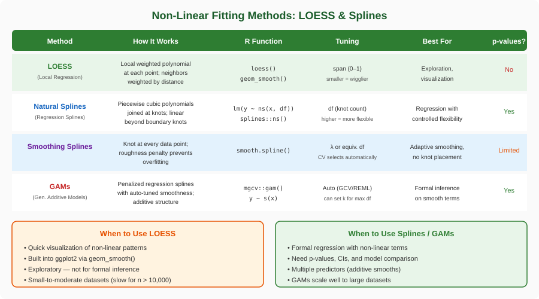
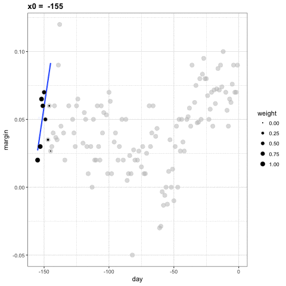
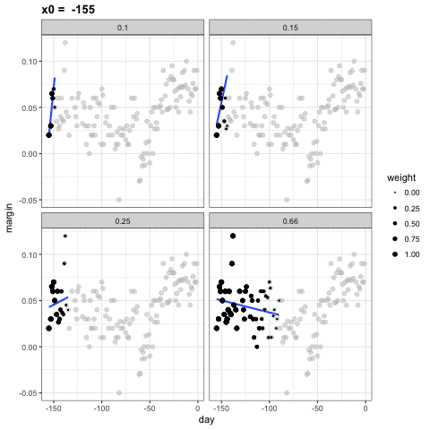
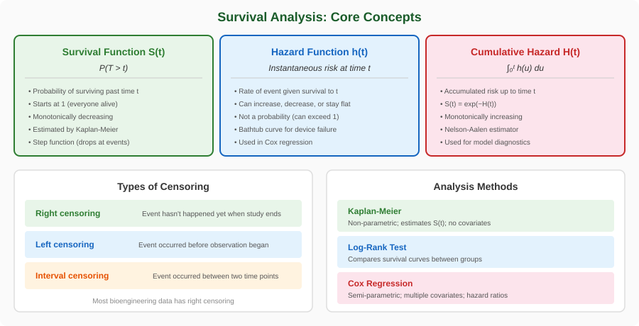
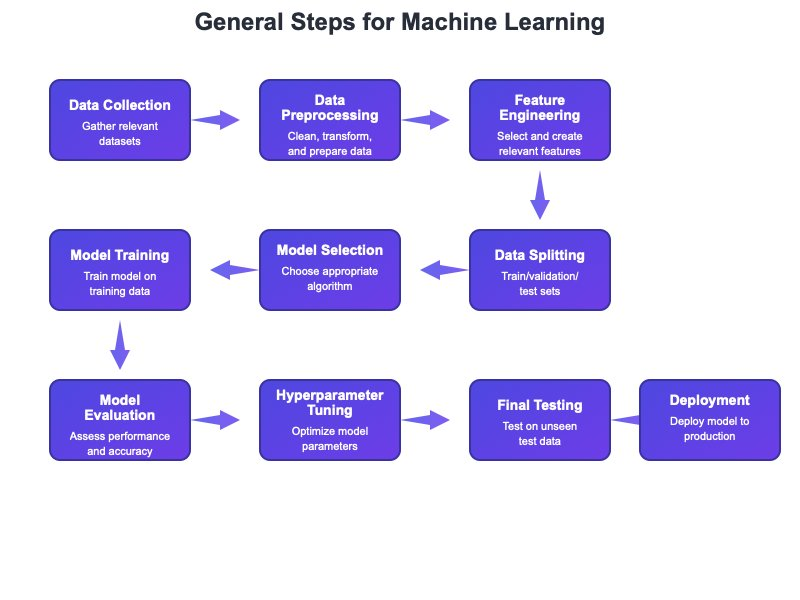
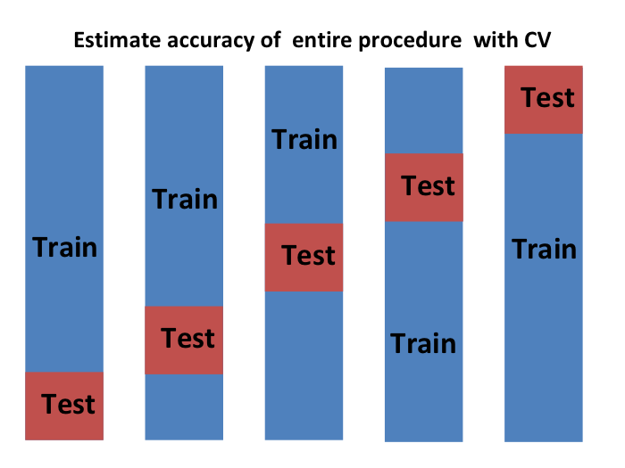
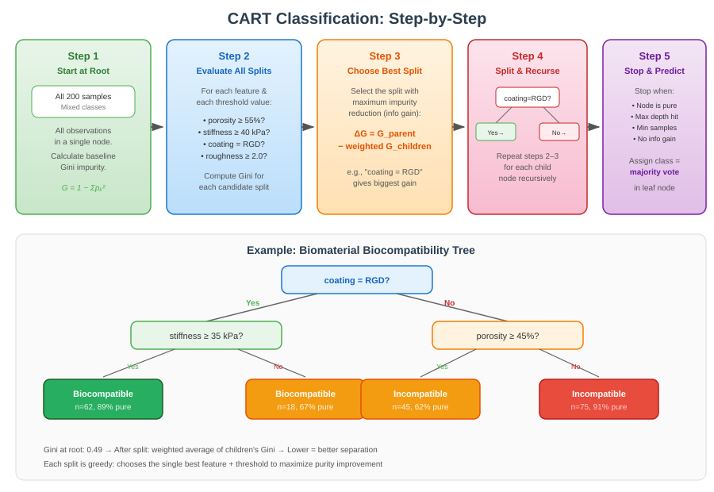
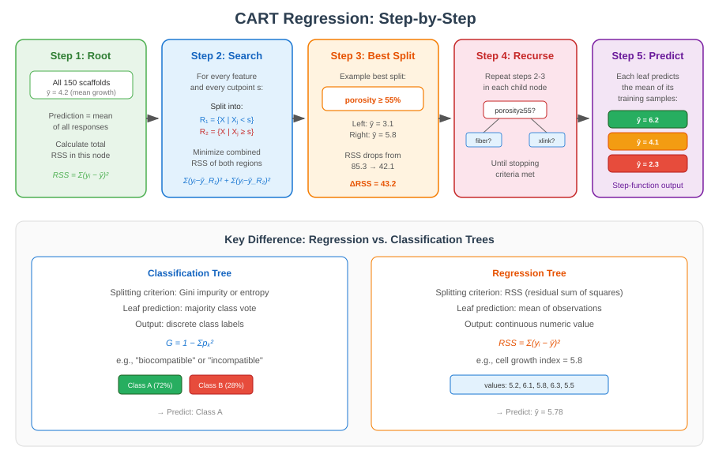
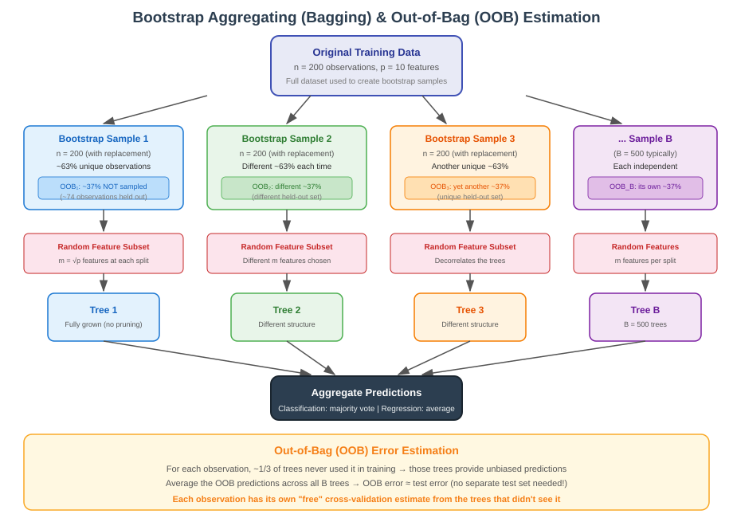

```{r}
#| label: setup
#| include: false

# Core data manipulation and visualization
library(tidyverse)
library(knitr)
library(readxl)

# Smoothing and splines
library(splines)
library(mgcv)

# Statistical analysis packages
library(MASS)         # LDA, robust regression
library(boot)         # Bootstrap methods
library(car)          # Companion to Applied Regression
library(broom)        # Tidy model output
library(emmeans)      # Estimated marginal means
library(survival)     # Survival analysis
library(rpart)        # Decision trees
library(rpart.plot)   # Tree visualization
library(randomForest) # Random forests
library(brms)         # Bayesian regression models

# Set consistent theme for all plots
theme_set(theme_minimal(base_size = 14))

# Set seed for reproducibility
set.seed(2026)
```

# Week 9: From Modeling to Machine Learning {background-color="#2c3e50"}

## Week 9 Topics

::: incremental
-   LOESS and splines for non-linear smoothing
-   Survival analysis for time-to-event data
-   Introduction to statistical learning
-   The bias-variance tradeoff and cross-validation
-   Decision trees (CART) and random forests
-   Odds, log odds, and odds ratios
-   Introduction to Bayesian statistics
:::

::: callout-note
**Readings:** Chapters 30--35

**HW4 Assigned**
:::

## Packages for This Week

::: panel-tabset
### Install

```{r}
#| eval: false
#| echo: true

# Install new packages (run once)
install.packages(c("splines", "mgcv", "survival", "survminer",
                    "rpart", "rpart.plot", "randomForest", "brms"))
```

### Load

```{r}
#| eval: false
#| echo: true

library(tidyverse)    # Data manipulation & visualization
library(splines)      # Natural and B-splines
library(mgcv)         # GAMs with automatic smoothness
library(survival)     # Survival analysis
library(survminer)    # Survival curve visualization
library(boot)         # Bootstrap and cross-validation
library(rpart)        # Decision trees (CART)
library(rpart.plot)   # Tree visualization
library(randomForest) # Random forest ensemble
library(brms)         # Bayesian regression with Stan
```
:::

------------------------------------------------------------------------

# Non-Linear Smoothing: LOESS and Splines {background-color="#d4edda"}

## When Linear Isn't Enough

- In bioengineering and biology, many relationships are fundamentally non-linear
    - cell proliferation peaks at an optimal scaffold porosity, 
    - drug release follows saturation kinetics, and 
    - tissue mechanical properties change non-monotonically with composition. 
    
- We need tools that can both **explore** and **model** these curved relationships.

- This section covers two complementary approaches: **LOESS** for flexible exploration and **splines** for formal inference. Together they form a powerful toolkit for non-linear modeling.

## LOESS and Splines: Choosing the Right Tool

{fig-align="center" width="95%"}

## LOESS: How It Works

- LOESS (Locally Estimated Scatterplot Smoothing) fits local polynomial regressions at each point, weighting nearby observations more heavily. 
- It is exploratory — use it to discover the shape of a relationship before fitting a formal model.


**The algorithm:**

1.  Choose a focal point $x_0$
2.  Find the nearest neighbors (controlled by the **span** parameter)
3.  Weight nearby points using a tri-cube kernel: $w_i = (1 - |d_i|^3)^3$
4.  Fit a weighted polynomial regression (degree 1 or 2)
5.  Record the fitted value at $x_0$
6.  Move to the next point and repeat

## LOESS Concept — Local Weighted Regression

```{r}
#| echo: false
#| eval: true
#| fig-width: 10
#| fig-height: 5

# Simulated data with non-linear trend
set.seed(42)
n <- 150
day <- runif(n, -155, 0)
margin <- 0.05 * sin(day / 25) + 0.02 + rnorm(n, 0, 0.025)

par(mfrow = c(1, 2), mar = c(5, 5, 3, 2))

# Two focal points
focal_pts <- c(-125, -55)

for (x0 in focal_pts) {
  # Compute tri-cube weights
  span <- 0.3
  dists <- abs(day - x0)
  h <- sort(dists)[ceiling(span * n)]
  u <- dists / h
  w <- ifelse(u < 1, (1 - u^3)^3, 0)
  w <- w / max(w)

  # Plot with weighted points
  plot(day, margin, pch = 16, cex = 0.6 + 1.5 * w,
       col = rgb(0, 0, 0, 0.15 + 0.85 * w),
       xlab = "day", ylab = "margin",
       main = paste("Focal point:", x0),
       cex.lab = 1.3, cex.main = 1.3, cex.axis = 1.1,
       xlim = c(-155, 0))

  # Local weighted regression
  local_fit <- lm(margin ~ day, weights = w)
  x_range <- seq(x0 - h * 0.5, x0 + h * 0.5, length.out = 50)
  x_range <- x_range[x_range >= min(day) & x_range <= max(day)]
  lines(x_range, predict(local_fit, newdata = data.frame(day = x_range)),
        col = "blue", lwd = 3)
}
```

## LOESS Animation

{fig-align="center" width="80%"}

## LOESS with Different Spans

The span parameter controls the smoothness — smaller values create more flexible fits:

{fig-align="center" width="80%"}

## The Span Parameter

::: callout-important
### Controlling Smoothness

-   **Span = 0.2**: Very flexible, follows local fluctuations — risk of overfitting
-   **Span = 0.5**: Moderate smoothing — often a good default
-   **Span = 0.75**: Smooth, captures broad trends — ggplot2 default
-   **Span = 1.0**: Very smooth — approaches global polynomial fit

The span controls the fraction of data used in each local regression. Smaller span = more local = more wiggly.
:::

```{r}
#| eval: false
#| echo: true

# ggplot2 LOESS with different spans
ggplot(data, aes(x, y)) +
  geom_point() +
  geom_smooth(method = "loess", span = 0.3, color = "red") +
  geom_smooth(method = "loess", span = 0.75, color = "blue")
```

## From Exploration to Inference: Splines

- Once LOESS reveals a non-linear relationship, you need formal tools to model it. 
- **Splines** are piecewise polynomials that create smooth curves by fitting different segments between data points (knots). 
- Unlike LOESS, splines produce models you can use for inference — coefficients, p-values, and predictions.

**Types of Spline Fitting:**

-   **Regression Splines** (`ns()`): Fit using least squares with specified knots — you choose the complexity
-   **Smoothing Splines** (`smooth.spline()`): Balance data fidelity and smoothness automatically via cross-validation
-   **GAMs** (`gam()` from mgcv): Generalized Additive Models — splines in a regression framework, with automatic smoothness selection
-   **Thin Plate Splines**: Extend to multiple dimensions for spatial data (e.g., scaffold thickness maps)

## Splines in R

::: panel-tabset
### Code

```{r}
#| eval: false
#| echo: true

# Natural splines — you choose degrees of freedom
library(splines)
model_ns <- lm(y ~ ns(x, df = 4), data = mydata)

# Smoothing splines — CV selects smoothness
smooth_fit <- smooth.spline(x, y, cv = TRUE)

# GAMs — automatic smoothness selection
library(mgcv)
gam_model <- gam(y ~ s(x), data = mydata)

# Thin plate spline for 2D spatial data
model_tp <- gam(z ~ s(x, y, bs = "tp"), data = spatial_data)
```

### Explanation

-   **Natural splines** constrain the tails to be linear — prevents dangerous extrapolation
-   **GAMs** use `s()` with automatic smoothness selection via generalized cross-validation
-   The **degrees of freedom** (df) control flexibility: df = 1 is linear, higher df = more wiggly
-   For bioengineering dose-response curves, natural splines with 3–5 df are a good starting point
:::

## Scaffold Porosity Dataset

::: callout-note
### Study Description

A tissue engineering lab manufactured 120 PLGA scaffolds with varying porosity levels (20--90%) using salt leaching. After seeding with mesenchymal stem cells (MSCs), they measured a cell proliferation index at 7 days to determine the optimal porosity range for bone tissue engineering.
:::

| Variable        | Type       | Description                       | Units |
|:----------------|:-----------|:----------------------------------|:------|
| `porosity`      | Continuous | Scaffold porosity percentage      | \%    |
| `proliferation` | Continuous | Cell proliferation index at day 7 | AU    |

```{r}
#| label: porosity-load
#| eval: false
#| echo: true

# Load the scaffold porosity dataset
porosity_data <- read_csv("data/scaffold_porosity.csv")
glimpse(porosity_data)
```

## Exploring the Data: Porosity and Proliferation

Let's explore a non-linear relationship between scaffold porosity and cell proliferation:

::: panel-tabset
### Output

```{r}
#| label: porosity-data-output
#| echo: false
#| eval: true
#| fig-width: 9
#| fig-height: 5

set.seed(2026)
n <- 120
porosity_data <- data.frame(
  porosity = runif(n, 20, 90)
)
# Non-linear relationship: cell growth peaks at ~60% porosity
porosity_data$proliferation <- with(porosity_data, {
  -0.003 * (porosity - 58)^2 + 8 + rnorm(n, 0, 0.8)
})

ggplot(porosity_data, aes(x = porosity, y = proliferation)) +
  geom_point(alpha = 0.5, size = 2) +
  geom_smooth(method = "loess", span = 0.5, color = "#2e7d32", linewidth = 1.2, se = TRUE) +
  geom_smooth(method = "lm", color = "red", linewidth = 1, linetype = "dashed", se = FALSE) +
  labs(x = "Scaffold Porosity (%)", y = "Cell Proliferation Index",
       title = "Scaffold Porosity vs. Cell Proliferation",
       subtitle = "Red dashed = linear fit (poor); green = LOESS (captures non-linearity)")
```

### Code

```{r}
#| label: porosity-data-code
#| echo: true
#| eval: false

# Load from CSV
porosity_data <- read_csv("data/scaffold_porosity.csv")

# Overlay linear and LOESS fits
ggplot(porosity_data, aes(x = porosity, y = proliferation)) +
  geom_point(alpha = 0.5) +
  geom_smooth(method = "loess", span = 0.5, color = "green4") +
  geom_smooth(method = "lm", color = "red", linetype = "dashed", se = FALSE) +
  labs(x = "Porosity (%)", y = "Proliferation Index")
```

### Explanation

-   This is a classic **inverted-U** relationship — proliferation peaks at intermediate porosity (\~58%)
-   The linear model (red dashed) completely misses this — it sees essentially zero correlation
-   LOESS (green) captures the peak and the decline at both extremes
-   This is exactly the situation where splines shine for formal inference
:::

## Comparing Fitting Approaches

::: panel-tabset
### Output

```{r}
#| label: spline-comparison-output
#| echo: false
#| eval: true
#| fig-width: 10
#| fig-height: 8

library(splines)
library(mgcv)

par(mfrow = c(2, 2), mar = c(4, 4, 3, 1))

x <- porosity_data$porosity
y <- porosity_data$proliferation

# Linear
plot(x, y, pch = 16, cex = 0.6, col = "gray60", main = "Linear Regression",
     xlab = "Porosity (%)", ylab = "Proliferation")
m1 <- lm(y ~ x)
lines(sort(x), predict(m1, newdata = data.frame(x = sort(x))), col = "steelblue", lwd = 2)

# Polynomial (degree 4)
plot(x, y, pch = 16, cex = 0.6, col = "gray60", main = "Polynomial (degree 4)",
     xlab = "Porosity (%)", ylab = "Proliferation")
m2 <- lm(y ~ poly(x, 4))
x_seq <- seq(min(x), max(x), length.out = 200)
lines(x_seq, predict(m2, newdata = data.frame(x = x_seq)), col = "coral", lwd = 2)

# Natural splines (df = 4)
plot(x, y, pch = 16, cex = 0.6, col = "gray60", main = "Natural Splines (df = 4)",
     xlab = "Porosity (%)", ylab = "Proliferation")
m3 <- lm(y ~ ns(x, df = 4))
lines(x_seq, predict(m3, newdata = data.frame(x = x_seq)), col = "forestgreen", lwd = 2)

# GAM with smoothing spline
plot(x, y, pch = 16, cex = 0.6, col = "gray60", main = "GAM (Smoothing Spline)",
     xlab = "Porosity (%)", ylab = "Proliferation")
m4 <- gam(y ~ s(x))
lines(x_seq, predict(m4, newdata = data.frame(x = x_seq)), col = "purple", lwd = 2)
```

### Code

```{r}
#| label: spline-comparison-code
#| echo: true
#| eval: false

library(splines)
library(mgcv)

# Linear — misses the curvature
m1 <- lm(proliferation ~ porosity, data = porosity_data)

# Polynomial (degree 4) — captures curvature, dangerous at edges
m2 <- lm(proliferation ~ poly(porosity, 4), data = porosity_data)

# Natural splines (df = 4) — captures curvature, safe at edges
m3 <- lm(proliferation ~ ns(porosity, df = 4), data = porosity_data)

# GAM — automatic smoothness selection
m4 <- gam(proliferation ~ s(porosity), data = porosity_data)

# Compare with AIC
AIC(m1, m2, m3)
summary(m4)  # includes significance test for smooth term
```

### Tradeoffs

| Method          | Flexibility | Extrapolation | Interpretability | Inference |
|:----------------|:------------|:--------------|:-----------------|:----------|
| Linear          | Low         | Reasonable    | High             | Yes       |
| Polynomial      | Medium      | Dangerous     | Medium           | Yes       |
| Natural splines | High        | Linear tails  | Medium           | Yes       |
| GAM             | High        | Auto-tuned    | Lower            | Yes (edf) |
:::

## R Exercise: Scaffold Porosity Smoothing

::: callout-tip
## Exercise

Load the scaffold porosity dataset (`data/scaffold_porosity.csv`) and explore different smoothing approaches:

```{r}
#| eval: false
#| echo: true

# Starter code
porosity_data <- read_csv("data/scaffold_porosity.csv")
```

Tasks:

1.  Plot the raw data and overlay a LOESS smooth with `span = 0.3`, `0.5`, and `0.75`. Which captures the trend best without overfitting?
2.  Fit a natural spline model with `df = 3, 4, 5, 6` and compare using AIC. Which df is optimal?
3.  Fit a GAM with `gam(proliferation ~ s(porosity))`. How many effective degrees of freedom does it choose?
4.  Compare predictions from your best spline model and the GAM — how similar are they?
5.  Based on your best model, what porosity level maximizes cell proliferation? Use `predict()` on a fine grid of porosity values.
:::


# Survival Analysis {background-color="#d4edda"}

## From Curves to Time: What Comes Next?

- We have seen how **LOESS and splines** let us model non-linear relationships between a predictor and a continuous outcome. 
- But what happens when our outcome is not a number --- it is an **event that may or may not happen**, and **when** it happens matters?

In bioengineering, we frequently ask:

-   How long until a scaffold degrades past a critical threshold?
-   When does an implant fail?
-   How long do drug-eluting coatings maintain therapeutic levels?

**Survival analysis** gives us the statistical framework for these time-to-event questions --- including the challenge of **censoring**, where some subjects have not experienced the event yet.


## What is Survival Analysis?

- Survival analysis is a family of statistical methods for analyzing **time-to-event** data — the time elapsed until a specific event occurs. 
- Unlike standard regression, survival analysis handles a unique feature of biomedical and engineering data: **censoring**.

{fig-align="center" width="95%"}

## Why Can't We Just Use Standard Regression?

If we could observe every subject until the event occurred, we could simply model time as a continuous outcome with `lm()`. But in practice:

-   Patients drop out of clinical trials
-   The study ends before all devices have failed
-   Some subjects are lost to follow-up

**Censored observations** contain partial information — we know the event *hadn't occurred yet* at the last observation time. Ignoring them wastes data; treating them as events creates bias. Survival analysis is specifically designed to handle this.

::: callout-important
### The Core Problem Survival Analysis Solves

If an implant has survived 500 days when the study ends, we know its true failure time is *at least* 500 days. This is valuable information that standard regression can't incorporate — survival analysis can.
:::

## The Survival Function: S(t)

The survival function is the probability of surviving (not experiencing the event) beyond time $t$:

$$S(t) = P(T > t)$$

::: panel-tabset
### Properties

-   $S(0) = 1$ — everyone starts alive/intact
-   $S(t)$ is monotonically **non-increasing** — you can't "un-fail"
-   $S(\infty) \to 0$ — eventually everyone experiences the event
-   The **median survival time** is the time $t$ where $S(t) = 0.5$

### Bioengineering Examples

| Application          | Event              | Time Scale  | Typical S(t) shape    |
|:------------------|:----------------|:----------------|:-------------------|
| Implant testing      | Structural failure | Days/Months | Gradual decline       |
| Drug delivery        | Drug depletion     | Hours/Days  | Steep initial decline |
| Cell culture         | Cell death         | Hours       | Varies by condition   |
| Scaffold degradation | 50% mass loss      | Weeks       | Depends on coating    |
:::

## The Hazard Function: h(t)

The hazard function is the **instantaneous rate** of the event, given survival to time $t$:

$$h(t) = \lim_{\Delta t \to 0} \frac{P(t \leq T < t + \Delta t \mid T \geq t)}{\Delta t}$$

::: panel-tabset
### Intuition

-   Think of it as the "risk per unit time" at any given moment
-   It is **not a probability** — it can exceed 1 (it's a rate)
-   It's conditional: given you've survived to time $t$, what's your instantaneous risk?
-   The relationship: $h(t) = -\frac{d}{dt}\log S(t)$, so $S(t) = \exp\left(-\int_0^t h(u)\,du\right)$

### Common Hazard Shapes

-   **Constant**: Exponential distribution (random failure, like radioactive decay)
-   **Increasing**: Aging/wear (devices that degrade over time)
-   **Decreasing**: Early failures (burn-in period for electronics)
-   **Bathtub**: Early failures + stable period + wear-out (classic engineering)
-   **Unimodal**: Peak risk at a specific time (some diseases)

### LaTeX

``` text
h(t) = \lim_{\Delta t \to 0} \frac{P(t \leq T < t + \Delta t \mid T \geq t)}{\Delta t}

S(t) = \exp\left(-\int_0^t h(u)\,du\right)
```
:::

## Understanding Censoring

::: panel-tabset
### Output

```{r}
#| label: censoring-output
#| echo: false
#| eval: true
#| fig-width: 9
#| fig-height: 3.5

par(mar = c(4, 8, 2, 1))
plot(NULL, xlim = c(0, 14), ylim = c(0.5, 6.5), xlab = "Time (months)",
     ylab = "", main = "Survival Data with Right Censoring", yaxt = "n")
axis(2, at = 1:6, labels = rev(c("Implant A", "Implant B", "Implant C", 
                                   "Implant D", "Implant E", "Implant F")), las = 1, cex.axis = 0.9)

# Study end line
abline(v = 12, lty = 2, col = "gray70", lwd = 1.5)
text(12.5, 6.3, "Study ends", col = "gray50", cex = 0.8)

# Subject timelines
segments(0, 6, 4, 6, lwd = 4, col = "#4393c3")
points(4, 6, pch = 4, cex = 2.5, col = "#c62828", lwd = 3)
text(4.8, 6, "Failed\n(t=4)", cex = 0.7, col = "#c62828")

segments(0, 5, 7, 5, lwd = 4, col = "#4393c3")
points(7, 5, pch = 4, cex = 2.5, col = "#c62828", lwd = 3)
text(7.8, 5, "Failed\n(t=7)", cex = 0.7, col = "#c62828")

segments(0, 4, 9, 4, lwd = 4, col = "#4393c3")
points(9, 4, pch = 1, cex = 2.5, col = "#2e7d32", lwd = 3)
text(9.8, 4, "Lost\n(t=9+)", cex = 0.7, col = "#2e7d32")

segments(0, 3, 10, 3, lwd = 4, col = "#4393c3")
points(10, 3, pch = 4, cex = 2.5, col = "#c62828", lwd = 3)
text(10.8, 3, "Failed\n(t=10)", cex = 0.7, col = "#c62828")

segments(0, 2, 12, 2, lwd = 4, col = "#4393c3")
points(12, 2, pch = 1, cex = 2.5, col = "#2e7d32", lwd = 3)
text(12.8, 2, "Intact\n(t=12+)", cex = 0.7, col = "#2e7d32")

segments(0, 1, 12, 1, lwd = 4, col = "#4393c3")
points(12, 1, pch = 1, cex = 2.5, col = "#2e7d32", lwd = 3)
text(12.8, 1, "Intact\n(t=12+)", cex = 0.7, col = "#2e7d32")

legend("bottomleft", c("Event (X) — failure observed", "Censored (O) — still intact or lost"),
       pch = c(4, 1), col = c("#c62828", "#2e7d32"), pt.lwd = 3, pt.cex = 1.5, cex = 0.8)
```

### Explanation

-   **Events** (red X): We observe the exact failure time — Implants A, B, and D
-   **Right-censored** (green O): We know the implant survived *at least* this long, but not the actual failure time
    -   Implant C was lost to follow-up at month 9
    -   Implants E and F were still intact when the study ended at month 12
-   Survival analysis uses *all six* observations — censored data is not discarded, it contributes information about survival probabilities at earlier time points
:::

## Orthopedic Implant Failure Dataset

::: callout-note
### Study Description

A multicenter orthopedic registry tracked 200 joint replacement implants over a 10-year period. Each implant was characterized by material type (titanium, cobalt-chrome, or PEEK), surface coating (hydroxyapatite or none), and patient factors (age, activity level, BMI). The primary outcome is time to implant failure (revision surgery required). Some implants were still functioning at study end (**right-censored**) or patients were lost to follow-up.
:::

| Variable | Type | Description | Units / Levels |
|:-----------------|:-----------------|:-----------------|:-----------------|
| `implant_id` | Character | Unique implant identifier | --- |
| `time_years` | Continuous | Time to failure or censoring | years |
| `event` | Binary | Event indicator | 1 = failure, 0 = censored |
| `material` | Categorical | Implant material | titanium, cobalt_chrome, PEEK |
| `coating` | Categorical | Surface coating | hydroxyapatite, none |
| `patient_age` | Continuous | Patient age at implantation | years |
| `activity_level` | Continuous | Patient activity score | 1 (sedentary) -- 10 (very active) |
| `bmi` | Continuous | Body mass index | kg/m² |

```{r}
#| label: implant-load
#| eval: false
#| echo: true

# Load the implant failure dataset
implant <- read_csv("data/implant_failure.csv")
implant$material <- factor(implant$material)
implant$coating <- factor(implant$coating)
glimpse(implant)
```

## Load and Inspect the Data

::: panel-tabset
### Output

```{r}
#| label: implant-inspect-output
#| echo: false
#| eval: true

library(survival)
set.seed(2026)

# Simulate the implant data for rendering
materials <- rep(c("titanium", "cobalt_chrome", "PEEK"), c(70, 65, 65))
coatings <- sample(c("hydroxyapatite", "none"), 200, replace = TRUE)
patient_age <- pmax(30, pmin(90, round(rnorm(200, 62, 12))))
activity_level <- round(runif(200, 1, 10), 1)
bmi <- pmax(18, pmin(45, round(rnorm(200, 28, 5), 1)))

base_time <- ifelse(materials == "titanium", 8,
             ifelse(materials == "cobalt_chrome", 6, 5))
coat_eff <- ifelse(coatings == "hydroxyapatite", 2, 0)
scale_param <- pmax(2, base_time + coat_eff - 0.03*(patient_age-60) - 
                    0.15*activity_level - 0.05*(bmi-25))
time_years <- pmax(0.1, rweibull(200, 2.5, scale_param))

event <- rep(1, 200)
censor_idx <- which(time_years > 10)
time_years[censor_idx] <- runif(length(censor_idx), 5, 10)
event[censor_idx] <- 0
random_censor <- sample(which(event == 1), size = round(0.15 * sum(event == 1)))
time_years[random_censor] <- time_years[random_censor] * runif(length(random_censor), 0.3, 0.9)
event[random_censor] <- 0
time_years <- round(time_years, 1)

implant <- data.frame(
  implant_id = paste0("IMP_", sprintf("%03d", 1:200)),
  time_years = time_years,
  event = event,
  material = factor(materials),
  coating = factor(coatings),
  patient_age = patient_age,
  activity_level = activity_level,
  bmi = bmi
)

cat("Dimensions:", nrow(implant), "rows x", ncol(implant), "columns\n\n")
cat("Event status:\n")
table(Event = implant$event)
cat("\n\nMaterial distribution:\n")
table(Material = implant$material)
cat("\n\nFirst 8 rows:\n")
head(implant, 8) |> knitr::kable()
```

### Code

```{r}
#| label: implant-inspect-code
#| echo: true
#| eval: false

# Load and inspect
implant <- read_csv("data/implant_failure.csv")
implant$material <- factor(implant$material)
implant$coating <- factor(implant$coating)

dim(implant)
str(implant)
table(implant$event)     # 0 = censored, 1 = failure
table(implant$material)  # material distribution
head(implant)
```

### Explanation

-   **200 implants** tracked over 10 years, with a mix of failures (event = 1) and censored observations (event = 0)
-   The `Surv()` function combines `time_years` and `event` into a survival object
-   **Censoring** occurs when implants were still functioning at study end or patients were lost to follow-up
-   Three implant materials and two coating types allow us to compare survival across groups
:::

## Kaplan-Meier Estimator

The **product-limit estimator** for the survival function — the most common non-parametric approach:

$$\hat{S}(t) = \prod_{t_i \leq t} \left(1 - \frac{d_i}{n_i}\right)$$

Where $d_i$ = events at time $t_i$ and $n_i$ = number at risk just before $t_i$.

::: callout-tip
### How It Works Step by Step

1.  At each observed event time, count how many subjects are still "at risk" ($n_i$) and how many experience the event ($d_i$)
2.  Calculate the conditional survival probability at that time: $1 - d_i/n_i$
3.  Multiply all these conditional probabilities together up to time $t$
4.  Censored subjects contribute to $n_i$ until they drop out, but they don't count as events
:::

## Kaplan-Meier Survival Curve

::: panel-tabset
### Output

```{r}
#| label: km-curve-output
#| echo: false
#| eval: true
#| fig-width: 9
#| fig-height: 5

km_fit <- survfit(Surv(time_years, event) ~ 1, data = implant)

km_df <- data.frame(
  time = km_fit$time,
  surv = km_fit$surv,
  upper = km_fit$upper,
  lower = km_fit$lower,
  n.event = km_fit$n.event,
  n.censor = km_fit$n.censor
)

ggplot(km_df, aes(x = time, y = surv)) +
  geom_step(linewidth = 1.2, color = "#2c3e50") +
  geom_ribbon(aes(ymin = lower, ymax = upper), alpha = 0.15, fill = "#2c3e50") +
  geom_point(data = km_df[km_df$n.censor > 0, ], aes(x = time, y = surv),
             shape = 3, size = 2, color = "red") +
  labs(x = "Time (years)", y = "Survival Probability",
       title = "Kaplan-Meier Curve: Overall Implant Survival",
       subtitle = "Shaded band = 95% CI; red crosses = censored observations") +
  scale_y_continuous(limits = c(0, 1)) +
  scale_x_continuous(breaks = 0:10)
```

### Code

```{r}
#| label: km-curve-code
#| echo: true
#| eval: false

library(survival)

# Create survival object and fit KM curve
surv_obj <- Surv(time = implant$time_years, event = implant$event)
km_fit <- survfit(surv_obj ~ 1)  # Overall survival (no grouping)

# Summary at specific time points
summary(km_fit, times = c(1, 2, 5, 8, 10))

# Plot with ggplot
km_df <- data.frame(
  time = km_fit$time,
  surv = km_fit$surv,
  upper = km_fit$upper,
  lower = km_fit$lower
)

ggplot(km_df, aes(x = time, y = surv)) +
  geom_step(linewidth = 1.2, color = "#2c3e50") +
  geom_ribbon(aes(ymin = lower, ymax = upper), alpha = 0.15) +
  labs(x = "Time (years)", y = "Survival Probability",
       title = "Kaplan-Meier Curve: Overall Implant Survival")
```

### Interpretation

-   The **step-down** pattern shows the decreasing proportion of implants still functioning over time
-   The **95% confidence band** widens as fewer implants remain at risk
-   **Red crosses** mark censored observations --- implants still functioning when last observed
-   The **median survival time** is where the curve crosses 0.5 on the y-axis
:::

## Comparing Survival Curves by Group

::: panel-tabset
### Output

```{r}
#| label: km-group-output
#| echo: false
#| eval: true
#| fig-width: 10
#| fig-height: 5

km_material <- survfit(Surv(time_years, event) ~ material, data = implant)

km_mat_df <- data.frame(
  time = km_material$time,
  surv = km_material$surv,
  upper = km_material$upper,
  lower = km_material$lower,
  group = rep(names(km_material$strata), km_material$strata)
)
km_mat_df$group <- gsub("material=", "", km_mat_df$group)

ggplot(km_mat_df, aes(x = time, y = surv, color = group, fill = group)) +
  geom_step(linewidth = 1.2) +
  geom_ribbon(aes(ymin = lower, ymax = upper), alpha = 0.1, linetype = 0) +
  scale_color_brewer(palette = "Set1") +
  scale_fill_brewer(palette = "Set1") +
  labs(x = "Time (years)", y = "Survival Probability",
       title = "Implant Survival by Material Type",
       color = "Material", fill = "Material") +
  scale_y_continuous(limits = c(0, 1)) +
  scale_x_continuous(breaks = 0:10)
```

### Code

```{r}
#| label: km-group-code
#| echo: true
#| eval: false

# KM curves stratified by material
km_material <- survfit(Surv(time_years, event) ~ material, data = implant)
summary(km_material)

# Quick plot with base R
plot(km_material, col = 1:3, lwd = 2,
     xlab = "Time (years)", ylab = "Survival Probability",
     main = "Implant Survival by Material")
legend("bottomleft", levels(implant$material), col = 1:3, lwd = 2)
```

### Interpretation

-   **Titanium** implants show the best survival (curve stays highest)
-   **PEEK** implants show the earliest failures
-   The separation between curves suggests material choice significantly affects implant longevity
-   Overlapping confidence bands indicate where differences may not be statistically significant
:::

## The Log-Rank Test: Comparing Survival Curves

The **log-rank test** is the standard non-parametric test for comparing survival distributions between two or more groups. It is analogous to a chi-squared test applied to survival data.

**How the log-rank test works:**

At each event time, the test compares the **observed** number of events in each group to the **expected** number (what you'd expect if there were no group difference). The test statistic sums these observed-minus-expected differences across all event times:

$$\chi^2 = \frac{\left(\sum_i (O_{1i} - E_{1i})\right)^2}{\sum_i V_i}$$

Where $O_{1i}$ and $E_{1i}$ are the observed and expected events in group 1 at time $t_i$, and $V_i$ is the variance at that time point. The test has $k - 1$ degrees of freedom for $k$ groups.

::: callout-note
The log-rank test gives **equal weight to all time points**. If you expect differences mainly at early or late times, the Wilcoxon (Gehan-Breslow) test may be more appropriate.
:::

## Log-Rank Test: Implant Materials

::: panel-tabset
### Output

```{r}
#| label: logrank-output
#| echo: false
#| eval: true

# Log-rank test: are the survival curves different?
lr_test <- survdiff(Surv(time_years, event) ~ material, data = implant)
print(lr_test)
```

### Code

```{r}
#| label: logrank-code
#| echo: true
#| eval: false

# Log-rank test: are the survival curves significantly different?
survdiff(Surv(time_years, event) ~ material, data = implant)

# Pairwise log-rank tests (if >2 groups)
pairwise_survdiff(Surv(time_years, event) ~ material,
                  data = implant, p.adjust.method = "BH")
```

### Interpretation

-   The **log-rank test** tests $H_0$: all groups have the same survival function
-   A significant p-value means at least one material has a different failure pattern
-   Pairwise comparisons with Benjamini-Hochberg correction identify which specific materials differ
-   The "Observed" vs "Expected" columns show whether each group had more or fewer events than expected under the null
:::

## The Cox Proportional Hazards Model

- The **Cox proportional hazards model** is the workhorse of survival regression. 
- It models how covariates affect the hazard rate **without specifying the baseline hazard shape** — a semi-parametric approach that provides remarkable flexibility.

The model assumes:

$$h(t \mid X) = h_0(t) \cdot \exp(\beta_1 X_1 + \beta_2 X_2 + \cdots + \beta_p X_p)$$

- Where $h_0(t)$ is an unspecified baseline hazard and $\exp(\beta_j)$ is the **hazard ratio** for a one-unit increase in $X_j$.

- **The key assumption** is **proportional hazards**: the ratio of hazards between any two groups remains constant over time. 
- If PEEK implants fail at 1.5× the rate of titanium implants at 1 year, they should also fail at 1.5× the rate at 5 years.

## Cox Model: Implant Failure Risk Factors

::: panel-tabset
### Output

```{r}
#| label: cox-output
#| echo: false
#| eval: true

cox_model <- coxph(Surv(time_years, event) ~ material + coating + 
                     patient_age + activity_level + bmi, data = implant)
summary(cox_model)
```

### Code

```{r}
#| label: cox-code
#| echo: true
#| eval: false

# Cox proportional hazards model
cox_model <- coxph(Surv(time_years, event) ~ material + coating +
                     patient_age + activity_level + bmi,
                   data = implant)
summary(cox_model)

# Hazard ratios with 95% CI
exp(cbind(HR = coef(cox_model), confint(cox_model)))
```

### Interpretation

-   **Hazard Ratio (HR)**: the ratio of failure rates between groups
    -   HR \> 1: higher failure risk (worse survival)
    -   HR \< 1: lower failure risk (better survival)
    -   HR = 1: no difference
-   **Example**: HR = 1.5 for PEEK vs. titanium means PEEK implants fail at 1.5x the rate of titanium
-   **Patient factors**: older age, higher activity, and higher BMI may increase failure risk
-   The Cox model adjusts for all covariates simultaneously --- important when patient characteristics differ across material groups
:::

## Interpreting Hazard Ratios

::: panel-tabset
### Visual

```{r}
#| label: hr-forest-output
#| echo: false
#| eval: true
#| fig-width: 9
#| fig-height: 5

hr_df <- data.frame(
  term = names(coef(cox_model)),
  hr = exp(coef(cox_model)),
  lower = exp(confint(cox_model)[, 1]),
  upper = exp(confint(cox_model)[, 2])
)

ggplot(hr_df, aes(x = hr, y = reorder(term, hr))) +
  geom_point(size = 3) +
  geom_errorbarh(aes(xmin = lower, xmax = upper), height = 0.2) +
  geom_vline(xintercept = 1, linetype = "dashed", color = "red") +
  labs(x = "Hazard Ratio (95% CI)", y = "",
       title = "Forest Plot: Implant Failure Risk Factors",
       subtitle = "HR > 1 = higher failure risk; dashed line = no effect") +
  scale_x_log10()
```

### Code

```{r}
#| label: hr-forest-code
#| echo: true
#| eval: false

# Extract hazard ratios and CIs
hr_df <- data.frame(
  term = names(coef(cox_model)),
  hr = exp(coef(cox_model)),
  lower = exp(confint(cox_model)[, 1]),
  upper = exp(confint(cox_model)[, 2])
)

# Forest plot
ggplot(hr_df, aes(x = hr, y = reorder(term, hr))) +
  geom_point(size = 3) +
  geom_errorbarh(aes(xmin = lower, xmax = upper), height = 0.2) +
  geom_vline(xintercept = 1, linetype = "dashed", color = "red") +
  labs(x = "Hazard Ratio (95% CI)", y = "") +
  scale_x_log10()
```

### Key Points

-   Points **left of the dashed line** (HR \< 1) indicate protective factors
-   Points **right of the dashed line** (HR \> 1) indicate risk factors
-   **Confidence intervals crossing 1** indicate non-significant effects
-   This is the standard visualization for reporting Cox model results in biomedical literature
:::

## Checking the Proportional Hazards Assumption

::: panel-tabset
### Output

```{r}
#| label: ph-check-output
#| echo: false
#| eval: true
#| fig-width: 10
#| fig-height: 6

ph_test <- cox.zph(cox_model)
print(ph_test)
par(mfrow = c(2, 3), mar = c(4, 4, 3, 1))
plot(ph_test)
```

### Code

```{r}
#| label: ph-check-code
#| echo: true
#| eval: false

# Test proportional hazards assumption
ph_test <- cox.zph(cox_model)
print(ph_test)  # p > 0.05 = assumption OK

# Visual check: Schoenfeld residuals vs time
plot(ph_test)
# Horizontal lines = assumption met; trends = violation
```

### Interpretation

-   The **proportional hazards assumption** means the hazard ratio between groups stays constant over time
-   The **Schoenfeld residual test** checks this: p \> 0.05 suggests the assumption holds
-   **Visual check**: residual plots should show a roughly horizontal trend
-   If violated: consider stratified Cox models, time-varying coefficients, or parametric alternatives
:::

## Bioengineering Example: Scaffold Degradation Survival

This example connects back to the scaffold degradation data from our mixed models analysis. Earlier we modeled degradation *rate* as a continuous outcome. Here we treat it as a time-to-event question: **how long until each scaffold loses 50% of its structural integrity?**

::: panel-tabset
### Output

```{r}
#| label: scaffold-survival-output
#| echo: false
#| eval: true
#| fig-width: 9
#| fig-height: 5

library(survival)
set.seed(2026)

scaffold_surv <- data.frame(
  treatment = factor(rep(c("A_collagen", "B_fibronectin", "C_uncoated"), each = 60)),
  temperature = factor(rep(rep(c("37C", "42C"), each = 30), 3))
)

scaffold_surv$time_to_50 <- with(scaffold_surv, {
  base_time <- ifelse(treatment == "A_collagen", 24,
               ifelse(treatment == "B_fibronectin", 18, 12))
  temp_effect <- ifelse(temperature == "42C", -4, 0)
  interaction <- ifelse(treatment == "C_uncoated" & temperature == "42C", -3, 0)
  pmax(rweibull(180, 3, base_time + temp_effect + interaction), 1)
})

scaffold_surv$event <- rbinom(180, 1, 0.85)

km_scaffold <- survfit(Surv(time_to_50, event) ~ treatment, data = scaffold_surv)

km_scaf_df <- data.frame(
  time  = km_scaffold$time,
  surv  = km_scaffold$surv,
  upper = km_scaffold$upper,
  lower = km_scaffold$lower,
  group = rep(c("A_collagen", "B_fibronectin", "C_uncoated"), km_scaffold$strata)
)

ggplot(km_scaf_df, aes(x = time, y = surv, color = group, fill = group)) +
  geom_step(linewidth = 1.2) +
  geom_ribbon(aes(ymin = lower, ymax = upper), alpha = 0.12) +
  scale_color_brewer(palette = "Set1") +
  scale_fill_brewer(palette = "Set1") +
  labs(x = "Time to 50% Mass Loss (days)", y = "Proportion Still Intact",
       title = "Scaffold Degradation Survival by Coating Type",
       subtitle = "Same experimental design as our mixed model analysis",
       color = "Coating", fill = "Coating") +
  scale_y_continuous(limits = c(0, 1))
```

### Code

```{r}
#| label: scaffold-survival-code
#| echo: true
#| eval: false

# Kaplan-Meier by treatment
km_scaffold <- survfit(Surv(time_to_50, event) ~ treatment, 
                        data = scaffold_surv)

# Log-rank test: do coatings differ in degradation time?
survdiff(Surv(time_to_50, event) ~ treatment, data = scaffold_surv)

# Cox model: hazard ratios for coating types
cox_scaffold <- coxph(Surv(time_to_50, event) ~ treatment + temperature,
                       data = scaffold_surv)
summary(cox_scaffold)
exp(cbind(HR = coef(cox_scaffold), confint(cox_scaffold)))
```

### Interpretation

-   **Same experiment, different perspective**: The LMM modeled continuous degradation rate; survival analysis models the *time* until a critical threshold is crossed
-   **Collagen** scaffolds survive longest (curve stays highest) — consistent with lower degradation rates from the LMM
-   **Uncoated** scaffolds degrade fastest, especially at 42°C
-   The **hazard ratio** from the Cox model tells you how much faster one coating degrades relative to the reference
-   **Censored scaffolds** (still intact at study end) are properly handled
:::

------------------------------------------------------------------------


# Introduction to Statistical Learning {background-color="#2c3e50"}

## Transitioning to Statistical Learning

- So far in this course, we have focused on **inference** --- estimating parameters, testing hypotheses, and building models grounded in probability theory. Now we shift toward **prediction** and **pattern recognition**.

- **Statistical learning** (also called machine learning) asks a different question: given data, can we build a model that **accurately predicts** outcomes for new, unseen observations?

- This shift requires new concepts --- 

    - **overfitting**
    - **bias-variance tradeoff**
    - **cross-validation** 
    
- before we dive into specific algorithms.

## What is Statistical Learning?

-   A set of tools for **understanding data** through models
-   **Supervised learning**: predict an outcome from predictors (requires labeled data)
-   **Unsupervised learning**: find patterns without a predefined outcome variable

| Type         | Goal                | Examples                   |
|:-------------|:--------------------|:---------------------------|
| Supervised   | Predict Y from X    | Regression, classification |
| Unsupervised | Find structure in X | Clustering, PCA            |

## Overview of Machine Learning Methods

::::::: columns
:::: {.column width="50%"}
::: callout-note
### Classical ML Methods

-   **Linear/Logistic Regression** — interpretable, parametric baseline
-   **Decision Trees (CART)** — non-parametric, interpretable rules
-   **Random Forests** — ensemble of trees, excellent accuracy
-   **Support Vector Machines** — optimal separating boundaries
-   **K-Nearest Neighbors** — instance-based, no training phase
-   **Regularized Regression** — Lasso/Ridge for high-dimensional data
:::
::::

:::: {.column width="50%"}
::: callout-tip
### Deep Learning Methods

-   **Neural Networks** — flexible function approximators
-   **Convolutional NNs (CNNs)** — image recognition, microscopy
-   **Recurrent NNs (RNNs/LSTMs)** — sequential/time-series data
-   **Transformers** — attention-based, NLP and protein structure
-   **Autoencoders** — dimensionality reduction, anomaly detection
-   **GANs** — synthetic data generation, image augmentation

:::
::::
:::::::


## General Steps for Machine Learning

{fig-align="center" width="90%"}


## What's Coming: Bias-Variance and Cross-Validation

- Before we dive into specific ML algorithms, we need two foundational concepts that apply to **every** predictive model:

- **Bias-Variance Tradeoff** — Every model makes two types of errors. 
    - **Bias** comes from oversimplifying (e.g., fitting a line to curved data). 
    - **Variance** comes from being too sensitive to the particular training sample (e.g., a very wiggly fit that changes dramatically with different data). 

- Finding the sweet spot between these is the central challenge of machine learning.

- **Cross-Validation** — How do we know if our model will work on new data? We can't just test on the training data (that rewards memorization). Cross-validation provides honest estimates of predictive performance by systematically holding out portions of the data for testing.

These tools will guide every modeling decision we make from here forward.


# The Overfitting Problem {background-color="#2c3e50"}

## Overfitting vs. Underfitting

::::::: columns
:::: {.column width="50%"}
::: callout-caution
## Underfitting

-   Model too simple
-   High bias
-   Misses important patterns
-   Poor performance everywhere
:::
::::

:::: {.column width="50%"}
::: callout-warning
## Overfitting

-   Model too complex
-   High variance
-   Memorizes noise
-   Great on training, poor on testing
:::
::::
:::::::

## What Are Bias and Variance?

Understanding these two sources of error is fundamental to all machine learning:

- **Bias** is the error from incorrect assumptions in the model. 
    - A model with high bias "underfits" — it misses relevant relationships. 
    - Think of fitting a straight line through clearly curved data. 
    - No matter how much data you collect, the line will always be wrong because the model structure itself is too simple.

- **Variance** is the error from sensitivity to fluctuations in the training data. 
    - A model with high variance "overfits" — it captures noise as if it were signal. 
    - Think of fitting a 20th-degree polynomial to 25 data points. 
    - It hits every point perfectly, but a different random sample would produce a completely different wiggly curve.

The **irreducible error** (noise) represents the fundamental randomness in the data that no model can capture — biological variability, measurement error, unmeasured confounders.

## Bias-Variance Tradeoff

::: panel-tabset
### Equation

$$\text{Test Error} = \text{Bias}^2 + \text{Variance} + \text{Irreducible Error}$$

### LaTeX

``` text
\text{Test Error} = \text{Bias}^2 + \text{Variance} + \text{Irreducible Error}
```
:::

-   **Bias**: error from incorrect model assumptions (too simple)
-   **Variance**: error from sensitivity to training data (too complex)
-   Goal: balance flexibility with stability


## Bias-Variance Tradeoff — Visualized

```{r}
#| echo: false
#| eval: true
#| fig-width: 9
#| fig-height: 6

par(mar = c(5, 5, 3, 2))

# Model complexity axis
x <- seq(0.5, 10, length.out = 200)

# Bias decreases with complexity
bias <- 3 * exp(-0.5 * x) + 0.1

# Variance increases with complexity
variance <- 0.05 * x^2

# Total error = bias^2 + variance + irreducible
irreducible <- 0.3
total <- bias^2 + variance + irreducible

# Scale for visualization
bias_plot <- bias * 1.5
var_plot <- variance * 0.8
total_plot <- (bias_plot + var_plot) * 0.7

plot(x, total_plot, type = "l", lwd = 3, col = "gray30",
     xlab = "Model Complexity", ylab = "Error",
     main = "Bias-Variance Tradeoff",
     ylim = c(0, max(total_plot) * 1.1),
     xaxt = "n", yaxt = "n",
     cex.lab = 1.4, cex.main = 1.5)

lines(x, bias_plot, lwd = 3, col = "darkred")
lines(x, var_plot, lwd = 3, col = "steelblue")

# Find optimal
opt_idx <- which.min(total_plot)
abline(v = x[opt_idx], lty = 3, col = "gray50", lwd = 1.5)

# Labels
text(1.5, max(bias_plot) * 0.85, "Bias", col = "darkred", cex = 1.4, font = 2)
text(8.5, max(var_plot) * 0.85, "Variance", col = "steelblue", cex = 1.4, font = 2)
text(8, max(total_plot) * 0.95, "Total Error", col = "gray30", cex = 1.4, font = 2)
text(x[opt_idx], -max(total_plot) * 0.02, "Optimal\nComplexity",
     cex = 1.0, srt = 0, adj = 0.5)

# Arrows for underfitting / overfitting
mtext("← Underfitting", side = 1, line = 2, adj = 0.1, cex = 1.1)
mtext("Overfitting →", side = 1, line = 2, adj = 0.9, cex = 1.1)
```

## In-Class Demo: Overfitting in Action

::: panel-tabset
### Output

```{r}
#| label: overfit-demo-output
#| echo: false
#| eval: true
#| fig-width: 10
#| fig-height: 4

set.seed(1)
x_pop <- runif(1000, 0, 10)
y_pop <- 6 - 0.5 * x_pop + rnorm(1000, sd = 2)

set.seed(0)
idx <- sample(1000, 25)
x_samp <- x_pop[idx]; y_samp <- y_pop[idx]

par(mfrow = c(1, 2))

plot(x_pop, y_pop, col = "lightblue", pch = 19, cex = 0.5,
     main = "Linear Model (Appropriate)", xlab = "x", ylab = "y")
points(x_samp, y_samp, col = "black", pch = 19)
abline(lm(y_samp ~ x_samp), col = "red", lwd = 2)
abline(a = 6, b = -0.5, col = "blue", lwd = 2, lty = 2)
legend("topright", c("True line", "Sample fit"), col = c("blue", "red"), lty = c(2, 1), lwd = 2)

plot(x_pop, y_pop, col = "lightblue", pch = 19, cex = 0.5,
     main = "LOESS Model (Overfit)", xlab = "x", ylab = "y")
points(x_samp, y_samp, col = "black", pch = 19)
lines(sort(x_samp), predict(loess(y_samp ~ x_samp))[order(x_samp)], col = "red", lwd = 2)
abline(a = 6, b = -0.5, col = "blue", lwd = 2, lty = 2)
```

### Code

```{r}
#| label: overfit-demo-code
#| echo: true
#| eval: false

set.seed(1)
x_pop <- runif(1000, 0, 10)
y_pop <- 6 - 0.5 * x_pop + rnorm(1000, sd = 2)

set.seed(0)
idx <- sample(1000, 25)
x_samp <- x_pop[idx]; y_samp <- y_pop[idx]

par(mfrow = c(1, 2))

# Linear model: appropriate fit
plot(x_pop, y_pop, col = "lightblue", pch = 19, cex = 0.5,
     main = "Linear Model (Appropriate)")
points(x_samp, y_samp, col = "black", pch = 19)
abline(lm(y_samp ~ x_samp), col = "red", lwd = 2)

# LOESS: overfitting the sample noise
plot(x_pop, y_pop, col = "lightblue", pch = 19, cex = 0.5,
     main = "LOESS Model (Overfit)")
points(x_samp, y_samp, col = "black", pch = 19)
lines(sort(x_samp), predict(loess(y_samp ~ x_samp))[order(x_samp)],
      col = "red", lwd = 2)
```
:::


# Cross-Validation {background-color="#2c3e50"}

## What is Cross-Validation?

- Cross-validation is our primary tool for estimating how well a model will perform on **new, unseen data**. 
- The core idea is simple: repeatedly split your data into training and testing portions, fit the model on the training portion, and evaluate on the testing portion.

{fig-align="center" width="70%"}

**Why we need it:** 

- Training error (how well the model fits its own data) is always optimistic — it rewards memorization. 
- Test error (how well it predicts new data) is what actually matters. 
- Cross-validation gives an honest estimate of test error without requiring a separate dataset.

## K-Fold Cross-Validation

The most common approach splits data into **K equally-sized folds** and cycles through them:

{fig-align="center" width="80%"}

**Process:**

1.  Split data into K folds (typically K = 5 or 10)
2.  For each fold: train on the other K − 1 folds, test on the held-out fold
3.  Record the test error for each fold
4.  Average across all K folds to get the **CV error estimate**

This ensures every observation gets used for both training and testing exactly once.

## Using CV to Select Models

Cross-validation is most powerful when used to **compare models** of different complexity. The model with the lowest CV error achieves the best bias-variance tradeoff.

{fig-align="center" width="80%"}

| K      | Description           | Properties                       |
|:-------|:----------------------|:---------------------------------|
| K = 5  | 5-fold CV             | Good balance, common choice      |
| K = 10 | 10-fold CV            | Most popular default             |
| K = n  | Leave-one-out (LOOCV) | Maximum training data, expensive |

## CV for Polynomial Degree Selection

::: panel-tabset
### Output

```{r}
#| label: cv-poly-output
#| echo: false
#| eval: true
#| fig-width: 9
#| fig-height: 5

set.seed(42)
n <- 80
x <- runif(n, 0, 6)
y <- 2 + 3*x - 0.5*x^2 + rnorm(n, 0, 1.5)
df <- data.frame(x, y)

cv_errors <- numeric(10)
for (d in 1:10) {
  cv_err <- 0
  for (i in 1:n) {
    fit <- lm(y ~ poly(x, d), data = df[-i, ])
    pred <- predict(fit, df[i, , drop = FALSE])
    cv_err <- cv_err + (df$y[i] - pred)^2
  }
  cv_errors[d] <- cv_err / n
}

plot(1:10, cv_errors, type = "b", pch = 19, col = "steelblue", lwd = 2,
     xlab = "Polynomial Degree", ylab = "LOOCV Error (MSE)",
     main = "Cross-Validation for Model Selection")
abline(v = which.min(cv_errors), lty = 2, col = "red")
legend("topright", paste("Optimal degree =", which.min(cv_errors)),
       col = "red", lty = 2, bty = "n")
```

### Code

```{r}
#| label: cv-poly-code
#| echo: true
#| eval: false

# LOOCV to select optimal polynomial degree
set.seed(42)
n <- 80
x <- runif(n, 0, 6)
y <- 2 + 3*x - 0.5*x^2 + rnorm(n, 0, 1.5)
df <- data.frame(x, y)

cv_errors <- numeric(10)
for (d in 1:10) {
  cv_err <- 0
  for (i in 1:n) {
    fit <- lm(y ~ poly(x, d), data = df[-i, ])
    pred <- predict(fit, df[i, , drop = FALSE])
    cv_err <- cv_err + (df$y[i] - pred)^2
  }
  cv_errors[d] <- cv_err / n
}

# The "elbow" shows where adding complexity stops helping
plot(1:10, cv_errors, type = "b", pch = 19, col = "steelblue",
     xlab = "Polynomial Degree", ylab = "LOOCV MSE",
     main = "Cross-Validation for Model Selection")
abline(v = which.min(cv_errors), lty = 2, col = "red")
```

### Key Insight

-   CV error initially decreases as the model becomes more flexible
-   After the optimal point, overfitting causes CV error to **increase**
-   This "elbow" identifies the best bias-variance tradeoff
-   Connects directly to model selection from Week 7
:::


# Decision Trees - ClAssification and Regression Trees (CART) {background-color="#2c3e50"}

## From Theory to Practice: Tree-Based Methods

Now that we understand **overfitting**, **bias-variance tradeoff**, and **cross-validation**, we can apply these concepts to our first machine learning algorithms.

**Decision trees** are an excellent starting point because they are intuitive, visually interpretable, and directly applicable to bioengineering classification and regression problems. They also serve as building blocks for powerful ensemble methods like **random forests**.

We will use two bioengineering datasets: one for classification (biomaterial screening) and one for regression (scaffold cell growth).

## Biomaterial Screening Dataset

::: callout-note
### Study Description

A biomaterials research group screened 200 scaffold formulations for biocompatibility. Each scaffold varied in porosity, mechanical stiffness, surface coating (none, collagen, or RGD peptide), and surface roughness. After 14 days of cell culture, each scaffold was classified as biocompatible or incompatible based on cell viability thresholds.
:::

| Variable | Type | Description | Units / Levels |
|:-----------------|:-----------------|:-----------------|:-----------------|
| `porosity` | Continuous | Scaffold porosity | \% (20--85) |
| `stiffness` | Continuous | Compressive modulus | kPa |
| `coating` | Categorical | Surface coating type | none, collagen, RGD |
| `roughness` | Continuous | Average surface roughness (Ra) | μm |
| `compat_score` | Binary | Biocompatibility classification | biocompatible / incompatible |

```{r}
#| label: biocompat-load
#| eval: false
#| echo: true

# Load the biomaterial screening dataset
biomat <- read_csv("data/biomaterial_screening.csv")
biomat$coating <- factor(biomat$coating)
biomat$compat_score <- factor(biomat$compat_score)
glimpse(biomat)
```

## What are Decision Trees?

Decision trees are **supervised learning** models that recursively partition the feature space using simple if-then rules. They are among the most interpretable machine learning methods.

**Key properties:**

-   Handle both classification and regression
-   No assumptions about data distribution
-   Naturally handle interactions between predictors
-   Easy to visualize and explain to collaborators

::: callout-note
### CART = Classification And Regression Trees

The most common algorithm is CART (Breiman, 1984), which uses **greedy binary splitting** — at each step, it finds the single best split that minimizes impurity.
:::

## How CART Works

::: panel-tabset
### Algorithm

1.  Start with all observations at the **root node**
2.  For each feature, evaluate all possible split points
3.  Choose the split that maximizes **purity** in the resulting child nodes
4.  Repeat recursively until a stopping criterion is met
5.  Assign predictions: majority class (classification) or mean (regression)

### Splitting Criteria

**Classification — Gini Impurity:** $$G = 1 - \sum_{k=1}^{K} p_k^2$$

**Classification — Entropy (Information Gain):** $$H = -\sum_{k=1}^{K} p_k \log_2(p_k)$$

**Regression — Mean Squared Error:** $$MSE = \frac{1}{n} \sum_{i=1}^{n} (y_i - \bar{y})^2$$

where $p_k$ is the proportion of class $k$ in the node.

### LaTeX

``` text
G = 1 - \sum_{k=1}^{K} p_k^2

H = -\sum_{k=1}^{K} p_k \log_2(p_k)

MSE = \frac{1}{n} \sum_{i=1}^{n} (y_i - \bar{y})^2
```
:::

## CART Classification: Step-by-Step

{fig-align="center" width="95%"}

## Decision Tree: Biomaterial Biocompatibility

::: panel-tabset
### Output

```{r}
#| label: cart-biocompat-output
#| echo: false
#| eval: true
#| fig-width: 10
#| fig-height: 6

library(rpart)
library(rpart.plot)

# Simulate biomaterial screening data
set.seed(2026)
n <- 200
biomat <- data.frame(
  porosity = runif(n, 20, 85),
  stiffness = rnorm(n, 50, 15),
  coating = sample(c("none", "collagen", "RGD"), n, replace = TRUE),
  roughness = runif(n, 0.5, 5)
)

biomat$compat_score <- with(biomat, {
  base <- -0.002 * (porosity - 55)^2 + 0.01 * stiffness +
    ifelse(coating == "RGD", 1.5, ifelse(coating == "collagen", 0.8, 0)) +
    0.2 * roughness + rnorm(n, 0, 1)
  factor(ifelse(base > 1.5, "biocompatible", "incompatible"))
})

# Fit classification tree
tree_model <- rpart(compat_score ~ porosity + stiffness + coating + roughness,
                    data = biomat, method = "class",
                    control = rpart.control(cp = 0.02, maxdepth = 4))

rpart.plot(tree_model, type = 4, extra = 104,
           box.palette = c("#e74c3c", "#27ae60"),
           main = "Biomaterial Biocompatibility Classification Tree",
           cex = 0.85)
```

### Code

```{r}
#| label: cart-biocompat-code
#| echo: true
#| eval: false

library(rpart)
library(rpart.plot)

# Fit classification tree
tree_model <- rpart(compat_score ~ porosity + stiffness + coating + roughness,
                    data = biomat, method = "class",
                    control = rpart.control(cp = 0.02, maxdepth = 4))

rpart.plot(tree_model, type = 4, extra = 104,
           box.palette = c("#e74c3c", "#27ae60"),
           main = "Biomaterial Biocompatibility Classification Tree")
```

### Interpretation

-   The tree **automatically discovers** which material properties matter most for biocompatibility
-   Each **leaf node** shows the predicted class and the proportion of training samples
-   The tree captures that RGD coating dramatically improves biocompatibility
-   Stiffness and porosity interact — the tree finds non-linear thresholds automatically
-   This is interpretable enough to share directly with materials science collaborators
:::

## Overfitting and Pruning

A fully grown tree memorizes the training data. **Pruning** removes branches that don't improve generalization.

::: panel-tabset
### Output

```{r}
#| label: cart-pruning-output
#| echo: false
#| eval: true
#| fig-width: 10
#| fig-height: 5

# Grow a complex tree
big_tree <- rpart(compat_score ~ porosity + stiffness + coating + roughness,
                  data = biomat, method = "class",
                  control = rpart.control(cp = 0.001, minsplit = 5))

# Plot CP table
par(mfrow = c(1, 2))
plotcp(big_tree, main = "Cross-Validation Error vs. Complexity")

# Prune to optimal cp (1-SE rule)
optimal_cp <- big_tree$cptable[which.min(big_tree$cptable[, "xerror"]), "CP"]
pruned_tree <- prune(big_tree, cp = optimal_cp)
rpart.plot(pruned_tree, type = 4, extra = 104,
           box.palette = c("#e74c3c", "#27ae60"),
           main = "Pruned Tree (Optimal CP)", cex = 0.8)
```

### Code

```{r}
#| label: cart-pruning-code
#| echo: true
#| eval: false

# Step 1: Grow a complex tree (low cp allows many splits)
big_tree <- rpart(compat_score ~ porosity + stiffness + coating + roughness,
                  data = biomat, method = "class",
                  control = rpart.control(cp = 0.001, minsplit = 5))

# Step 2: Examine the CP table (cross-validated error)
printcp(big_tree)
plotcp(big_tree)

# Step 3: Find optimal cp using 1-SE rule
optimal_cp <- big_tree$cptable[which.min(big_tree$cptable[, "xerror"]), "CP"]

# Step 4: Prune to optimal complexity
pruned_tree <- prune(big_tree, cp = optimal_cp)

# Step 5: Visualize the pruned tree
rpart.plot(pruned_tree, type = 4, extra = 104)
```

### Interpretation

-   The **CP plot** shows cross-validated error at each tree size
-   The **1-SE rule**: choose the simplest tree within 1 standard error of the minimum — more conservative, better generalization
-   Pruning reduces overfitting while keeping the important splits
-   A simpler tree is easier to interpret and often predicts better on new data
:::

## Scaffold Cell Growth Dataset

::: callout-note
### Study Description

Researchers fabricated 150 electrospun scaffolds with varying porosity, fiber diameter, and crosslink density. After 7 days of culture with osteoblasts, they measured a cell growth index to determine which scaffold properties most influence cell proliferation.
:::

| Variable            | Type       | Description                | Units           |
|:----------------|:---------------|:----------------------|:---------------|
| `porosity`          | Continuous | Scaffold porosity          | \% (20--85)     |
| `fiber_diameter`    | Continuous | Average fiber diameter     | nm              |
| `crosslink_density` | Continuous | Degree of crosslinking     | fraction (0--1) |
| `cell_growth`       | Continuous | Cell growth index at day 7 | AU              |

## Regression Trees

Decision trees also work for continuous outcomes. Instead of Gini impurity, the splitting criterion is **residual sum of squares (RSS)** — at each split, the algorithm minimizes the combined variance within the two child nodes.

## CART Regression: Step-by-Step

{fig-align="center" width="95%"}

## Regression Tree: Scaffold Cell Growth

::: panel-tabset
### Output

```{r}
#| label: cart-regression-output
#| echo: false
#| eval: true
#| fig-width: 10
#| fig-height: 5

# Regression tree: predict cell growth from scaffold properties
set.seed(42)
scaffold_reg <- data.frame(
  porosity = runif(150, 20, 85),
  fiber_diameter = rnorm(150, 500, 100),
  crosslink_density = runif(150, 0.1, 0.9)
)
scaffold_reg$cell_growth <- with(scaffold_reg, {
  2 + 0.05 * porosity - 0.002 * (porosity - 55)^2 +
    0.003 * fiber_diameter + 1.5 * crosslink_density +
    rnorm(150, 0, 0.5)
})

reg_tree <- rpart(cell_growth ~ porosity + fiber_diameter + crosslink_density,
                  data = scaffold_reg, method = "anova",
                  control = rpart.control(cp = 0.02))

par(mfrow = c(1, 2))
rpart.plot(reg_tree, type = 4, digits = 3,
           main = "Regression Tree: Cell Growth", cex = 0.8)

# Predicted vs actual
pred_vals <- predict(reg_tree, scaffold_reg)
plot(scaffold_reg$cell_growth, pred_vals, pch = 16, col = "#3498db80",
     xlab = "Actual Cell Growth", ylab = "Predicted",
     main = "Predicted vs. Actual")
abline(0, 1, col = "red", lwd = 2, lty = 2)
```

### Code

```{r}
#| label: cart-regression-code
#| echo: true
#| eval: false

# Regression tree uses method = "anova"
reg_tree <- rpart(cell_growth ~ porosity + fiber_diameter + crosslink_density,
                  data = scaffold_reg, method = "anova",
                  control = rpart.control(cp = 0.02))

# Visualize
rpart.plot(reg_tree, type = 4, digits = 3)

# Check predictions
pred_vals <- predict(reg_tree, scaffold_reg)
cor(scaffold_reg$cell_growth, pred_vals)^2  # R-squared
```

### Interpretation

-   Regression trees predict the **mean** of training observations in each leaf node
-   The step-function nature of predictions is a limitation — predictions are discrete, not smooth
-   Useful for discovering non-linear thresholds (e.g., "porosity above 60% is the key cutoff")
-   R² for a single tree is often modest — this motivates **ensemble methods** like Random Forests
:::

## Handling Missing Data in CART

Decision trees have a built-in approach to missing data called **surrogate splits**:

When a splitting variable is missing for an observation, CART identifies **surrogate variables** — other predictors that produce nearly the same split. The observation is then routed using the best available surrogate.

**How it works:**

1.  At each node, CART records the **primary split** (e.g., porosity ≥ 55%)
2.  It also ranks all other variables by how well they **mimic** this split
3.  If porosity is missing for an observation, the best surrogate (e.g., stiffness ≥ 42 kPa, which agrees with the porosity split 85% of the time) is used instead
4.  If all surrogates are also missing, the observation goes to the **majority child node**

::: callout-tip
This is a major practical advantage of tree-based methods. Unlike most regression approaches, CART can handle missing values without imputation. Random Forests inherit this capability from their constituent trees.
:::

## CART Summary: Strengths and Weaknesses

::: callout-important
### Strengths

-   **Highly interpretable** — easy to explain to non-statisticians and collaborators
-   **No assumptions** about data distribution, linearity, or homoscedasticity
-   **Automatic feature selection** — unimportant variables are simply not used for splits
-   **Handles interactions** naturally without specifying them in advance
-   **Built-in missing data handling** via surrogate splits
-   Works for both classification and regression
:::

::: callout-warning
### Weaknesses

-   **High variance** — small changes in data can produce very different trees
-   **Prone to overfitting** — fully grown trees memorize noise (pruning helps, but doesn't fully solve this)
-   **Greedy algorithm** — each split is locally optimal, not globally optimal
-   **Step-function predictions** — regression trees produce discontinuous predictions
-   **Biased toward variables with many levels** — categorical variables with many categories get more split opportunities

These weaknesses — especially the high variance and overfitting tendency — are precisely what **random forests** were designed to address.
:::

------------------------------------------------------------------------

# Random Forests {background-color="#2c3e50"}

## Bootstrap Aggregating (Bagging) and Out-of-Bag Estimation

Before diving into random forests, we need to understand the two key ideas they build on: **bagging** and **OOB estimation**. Bagging creates diverse training sets by sampling with replacement, and OOB estimation provides free validation without a separate test set.

{fig-align="center" width="95%"}

## From One Tree to Many: The Random Forest Algorithm

A single decision tree is interpretable but often has high variance — small changes in data can produce very different trees. **Random Forests** solve this by averaging many decorrelated trees.

**The Random Forest algorithm:**

1.  Draw a **bootstrap sample** (sample with replacement) from the training data (\~63% unique observations)
2.  Grow a decision tree, but at each split, consider only a **random subset** of features ($m \approx \sqrt{p}$ for classification, $m \approx p/3$ for regression)
3.  Repeat steps 1-2 for $B$ trees (typically 500+)
4.  **Aggregate** predictions: majority vote (classification) or average (regression)

::: callout-note
### Why randomize features?

If one predictor is very strong, every tree in a simple bagging ensemble would split on it first, making the trees correlated. Random feature selection **decorrelates** the trees, reducing variance of the ensemble. This is the key innovation of random forests over basic bagging.
:::

## Random Forest: Classification Example

We return to the **biomaterial screening dataset** (200 scaffolds, 4 properties, biocompatible/incompatible). Earlier, a single CART tree identified coating type and stiffness as important predictors. Now we fit a forest of 500 trees. The key difference: each tree sees a different bootstrap sample and considers only a random subset of features at each split, producing a diverse ensemble that is far more stable than any single tree.

::: panel-tabset
### Output

```{r}
#| label: rf-class-output
#| echo: false
#| eval: true
#| fig-width: 10
#| fig-height: 5

library(randomForest)

set.seed(2026)
rf_model <- randomForest(compat_score ~ porosity + stiffness + coating + roughness,
                         data = biomat, ntree = 500, mtry = 2, importance = TRUE)

par(mfrow = c(1, 2))
# OOB error convergence
plot(rf_model, main = "OOB Error vs. Number of Trees")
legend("topright", colnames(rf_model$err.rate), col = 1:3, lty = 1:3, cex = 0.8)

# Variable importance
varImpPlot(rf_model, main = "Variable Importance", pch = 19)
```

### Code

```{r}
#| label: rf-class-code
#| echo: true
#| eval: false

library(randomForest)

# Fit random forest — 500 trees, mtry = 2 features per split
set.seed(2026)
rf_model <- randomForest(compat_score ~ porosity + stiffness + coating + roughness,
                         data = biomat, ntree = 500, mtry = 2, importance = TRUE)

# Out-of-bag error and confusion matrix
print(rf_model)

# OOB error convergence plot — does error stabilize?
plot(rf_model)

# Variable importance — which features matter most?
varImpPlot(rf_model)
importance(rf_model)

# OOB confusion matrix
rf_model$confusion
```

### Interpretation

-   **OOB error**: Each tree is trained on \~63% of data; the remaining \~37% (out-of-bag) provides a free validation estimate — no separate test set needed!
-   **Variable importance** (two measures):
    -   **MeanDecreaseAccuracy**: How much OOB accuracy drops when a variable is randomly permuted — most reliable
    -   **MeanDecreaseGini**: Total decrease in Gini impurity across all splits on that variable — faster but biased toward continuous variables
-   Coating type and stiffness emerge as the strongest predictors of biocompatibility
-   Compare to the single CART tree: the forest gives more **stable** importance rankings
:::

## Random Forest: Regression Example

For the **scaffold cell growth dataset** (150 scaffolds, 3 properties, continuous cell growth index), we saw that a single regression tree produced step-function predictions with modest R². The random forest averages 500 such trees, each trained on a different bootstrap sample with random feature subsets. This smooths out the staircase effect and dramatically improves prediction accuracy.

::: panel-tabset
### Output

```{r}
#| label: rf-reg-output
#| echo: false
#| eval: true
#| fig-width: 10
#| fig-height: 5

set.seed(42)
rf_reg <- randomForest(cell_growth ~ porosity + fiber_diameter + crosslink_density,
                       data = scaffold_reg, ntree = 500, importance = TRUE)

par(mfrow = c(1, 2))
# Predicted vs actual
rf_pred <- predict(rf_reg, scaffold_reg)
plot(scaffold_reg$cell_growth, rf_pred, pch = 16, col = "#3498db80",
     xlab = "Actual Cell Growth", ylab = "RF Predicted",
     main = sprintf("Random Forest (R² = %.3f)", cor(scaffold_reg$cell_growth, rf_pred)^2))
abline(0, 1, col = "red", lwd = 2, lty = 2)

# Compare with single tree
tree_pred <- predict(reg_tree, scaffold_reg)
plot(scaffold_reg$cell_growth, tree_pred, pch = 16, col = "#e67e2280",
     xlab = "Actual Cell Growth", ylab = "Tree Predicted",
     main = sprintf("Single Tree (R² = %.3f)", cor(scaffold_reg$cell_growth, tree_pred)^2))
abline(0, 1, col = "red", lwd = 2, lty = 2)
```

### Code

```{r}
#| label: rf-reg-code
#| echo: true
#| eval: false

# Random forest regression
rf_reg <- randomForest(cell_growth ~ porosity + fiber_diameter + crosslink_density,
                       data = scaffold_reg, ntree = 500, importance = TRUE)

# Compare with single tree
cat("Single Tree R²:", cor(predict(reg_tree), scaffold_reg$cell_growth)^2, "\n")
cat("Random Forest R²:", cor(predict(rf_reg), scaffold_reg$cell_growth)^2, "\n")
```

### Interpretation

-   The random forest dramatically outperforms the single tree — smoother predictions, higher R²
-   Averaging 500 trees reduces the "staircase" effect of individual trees
-   The OOB R² (not shown here) is the honest estimate; training R² is optimistic
:::

## Decision Trees vs. Random Forests

| Feature | Decision Tree | Random Forest |
|:-----------------------|:-----------------------|:-----------------------|
| **Interpretability** | High (visualize the tree) | Lower (500 trees) |
| **Variance** | High (unstable) | Low (averaging) |
| **Bias** | Low (flexible) | Slightly higher |
| **Overfitting risk** | High | Low (OOB validation) |
| **Variable importance** | Implicit (top splits) | Explicit (permutation-based) |
| **Speed** | Fast | Slower (but parallelizable) |

::: callout-tip
### Practical Guidance

Use **decision trees** when interpretability is paramount (explaining results to clinicians, regulators). Use **random forests** when prediction accuracy matters most. You can always fit both — the single tree tells you *what matters*, the forest tells you *how well you can predict*.
:::

## ROC Curves and AUC

**ROC** (Receiver Operating Characteristic) curves summarize classifier performance across all thresholds:

-   Plots True Positive Rate vs. False Positive Rate
-   **AUC** (Area Under Curve) is a single-number summary
-   0.5 = random guessing, 1.0 = perfect classification

| AUC     | Interpretation |
|:--------|:---------------|
| 0.5–0.7 | Poor           |
| 0.7–0.8 | Fair           |
| 0.8–0.9 | Good           |
| \> 0.9  | Excellent      |

------------------------------------------------------------------------

## From Prediction to Interpretation: Understanding Odds

Our random forest classifier produces predictions and a **confusion matrix** — a table of correct and incorrect classifications. But when we need to **quantify the strength of an effect** (how much does a treatment increase or decrease the probability of an outcome?), we need the language of **odds and odds ratios**.

Let's use the confusion matrix from our biomaterial classification to motivate this:

```{r}
#| echo: false
#| eval: true

cat("=== Random Forest OOB Confusion Matrix ===\n")
print(rf_model$confusion)
cat("\nFrom this matrix we can compute:\n")
cat("- Sensitivity (true biocompatible rate)\n")
cat("- Specificity (true incompatible rate)\n")
cat("- And the ODDS of correct classification for each group\n")
```

This bridges directly to **logistic regression**, where the model coefficients are log odds ratios.

------------------------------------------------------------------------

# Understanding Odds, Log Odds, and Odds Ratios {background-color="#d4edda"}

## Why Do We Need Odds?

In bioengineering, we often work with **binary outcomes**: implant success/failure, cell adhesion yes/no, biocompatible/incompatible. While probabilities (0 to 1) are intuitive, they have mathematical limitations for modeling.

**The conversion:**

| Probability | Odds       | Log Odds | Interpretation |
|:------------|:-----------|:---------|:---------------|
| 0.10        | 0.11 (1:9) | −2.20    | Very unlikely  |
| 0.25        | 0.33 (1:3) | −1.10    | Unlikely       |
| 0.50        | 1.00 (1:1) | 0.00     | Even chance    |
| 0.75        | 3.00 (3:1) | +1.10    | Likely         |
| 0.90        | 9.00 (9:1) | +2.20    | Very likely    |

$$\text{Odds} = \frac{p}{1-p} \qquad \text{Log Odds} = \ln\left(\frac{p}{1-p}\right)$$

## The Asymmetry Problem

{fig-align="center" width="95%"}

::: callout-important
### Key Insight

On the probability scale, 0.25 and 0.75 are equally far from 0.50. On the odds scale, 0.33 and 3.0 are **not** equally far from 1.0 — the scale is asymmetric, compressed below 1 and stretched above 1. The **log transformation** restores symmetry: log(0.33) = −1.10 and log(3.0) = +1.10 are equidistant from 0.
:::

## Visualizing the Odds Transformation

::: panel-tabset
### Output

```{r}
#| label: odds-curves-output
#| echo: false
#| eval: true
#| fig-width: 10
#| fig-height: 5

par(mfrow = c(1, 2), mar = c(5, 5, 3, 2))

p <- seq(0.01, 0.99, by = 0.01)
odds <- p / (1 - p)
log_odds <- log(odds)

# Probability vs Odds
plot(p, odds, type = "l", lwd = 2, col = "#2980b9",
     xlab = "Probability", ylab = "Odds",
     main = "Odds grow exponentially near p = 1",
     cex.lab = 1.2, cex.main = 1.1)
abline(h = 1, lty = 2, col = "gray50")
abline(v = 0.5, lty = 2, col = "gray50")
text(0.3, 15, "Compressed\nbelow 1", col = "#e74c3c", cex = 0.9)
text(0.8, 60, "Explodes\nto infinity", col = "#e74c3c", cex = 0.9)

# Probability vs Log Odds
plot(p, log_odds, type = "l", lwd = 2, col = "#27ae60",
     xlab = "Probability", ylab = "Log Odds (logit)",
     main = "Log odds: symmetric S-curve",
     cex.lab = 1.2, cex.main = 1.1)
abline(h = 0, lty = 2, col = "gray50")
abline(v = 0.5, lty = 2, col = "gray50")
points(c(0.25, 0.75), log(c(0.25, 0.75) / c(0.75, 0.25)),
       pch = 19, col = c("#3498db", "#e67e22"), cex = 1.5)
text(0.25, -2.5, "−1.10", col = "#3498db", font = 2, cex = 0.9)
text(0.75, 2.5, "+1.10", col = "#e67e22", font = 2, cex = 0.9)
```

### Code

```{r}
#| label: odds-curves-code
#| echo: true
#| eval: false

p <- seq(0.01, 0.99, by = 0.01)
odds <- p / (1 - p)
log_odds <- log(odds)

par(mfrow = c(1, 2))

# Probability vs Odds — asymmetric!
plot(p, odds, type = "l", lwd = 2, col = "#2980b9",
     xlab = "Probability", ylab = "Odds",
     main = "Odds grow exponentially")
abline(h = 1, v = 0.5, lty = 2, col = "gray50")

# Probability vs Log Odds — symmetric!
plot(p, log_odds, type = "l", lwd = 2, col = "#27ae60",
     xlab = "Probability", ylab = "Log Odds (logit)",
     main = "Log odds are symmetric")
abline(h = 0, v = 0.5, lty = 2, col = "gray50")
```

### Interpretation

-   The **odds** curve shows why raw odds are problematic: values below 1 are compressed (0 to 1), while values above 1 explode toward infinity
-   The **log odds** (logit) transformation creates a symmetric, unbounded scale — this is why logistic regression models log odds, not probabilities
-   Equal changes in log odds correspond to equal changes in effect strength, regardless of the baseline probability
:::

## Odds Ratios for Comparing Groups

{fig-align="center" width="95%"}

## Odds Ratio: Bioengineering Example

::: panel-tabset
### Output

```{r}
#| label: odds-ratio-output
#| echo: false
#| eval: true

# Scaffold coating experiment
set.seed(2026)
coating_data <- data.frame(
  coating = rep(c("uncoated", "RGD-coated"), each = 100),
  adhesion = c(
    rbinom(100, 1, 0.35),  # 35% adhesion rate without coating
    rbinom(100, 1, 0.70)   # 70% adhesion rate with coating
  )
)

# 2x2 table
tab <- table(coating_data$coating, coating_data$adhesion)
colnames(tab) <- c("No Adhesion", "Adhesion")
cat("=== Scaffold Coating vs. Cell Adhesion ===\n")
print(tab)

# Calculate odds ratio
odds_uncoated <- tab["uncoated", "Adhesion"] / tab["uncoated", "No Adhesion"]
odds_coated   <- tab["RGD-coated", "Adhesion"] / tab["RGD-coated", "No Adhesion"]
OR <- odds_coated / odds_uncoated

cat("\nOdds (uncoated):", round(odds_uncoated, 3))
cat("\nOdds (RGD-coated):", round(odds_coated, 3))
cat("\nOdds Ratio:", round(OR, 3))
cat("\nLog Odds Ratio:", round(log(OR), 3))
cat("\n\nInterpretation: RGD coating increases the odds of")
cat("\ncell adhesion by", round(OR, 1), "times compared to uncoated scaffolds")
```

### Code

```{r}
#| label: odds-ratio-code
#| echo: true
#| eval: false

# 2x2 contingency table
tab <- table(coating_data$coating, coating_data$adhesion)

# Manual odds ratio calculation
odds_uncoated <- tab["uncoated", "Adhesion"] / tab["uncoated", "No Adhesion"]
odds_coated   <- tab["RGD-coated", "Adhesion"] / tab["RGD-coated", "No Adhesion"]
OR <- odds_coated / odds_uncoated

cat("Odds Ratio:", OR)
cat("Log Odds Ratio:", log(OR))

# Or use Fisher's exact test
fisher.test(tab)  # gives OR with confidence interval
```

### Interpretation

-   **Odds ratio \> 1**: The treatment group has higher odds of the outcome
-   **Odds ratio \< 1**: The treatment group has lower odds
-   **Odds ratio = 1**: No difference between groups
-   The **log odds ratio** is symmetric: log(OR) and log(1/OR) are equidistant from zero
-   Fisher's exact test provides a confidence interval for the odds ratio
:::

## Connection to Logistic Regression

::: callout-important
### The Key Link

In logistic regression, the coefficients **are** log odds ratios!

$$\ln\left(\frac{p}{1-p}\right) = \beta_0 + \beta_1 x_1 + \beta_2 x_2 + \cdots$$

-   $e^{\beta_1}$ = odds ratio for a one-unit increase in $x_1$
-   This is why logistic regression is the natural extension of what we've been doing with odds
-   The logit link function transforms the bounded probability (0,1) to the unbounded log-odds scale (−∞, +∞), making linear modeling appropriate
:::

------------------------------------------------------------------------

## R Exercise: Logistic Regression

::: callout-tip
## Exercise

Using the biomaterial screening dataset, predict scaffold biocompatibility from material properties:

```{r}
#| eval: false
#| echo: true

# Load the biomaterial screening data
biomat <- read_csv("data/biomaterial_screening.csv")
biomat$coating <- factor(biomat$coating)
biomat$compat_binary <- ifelse(biomat$compat_score == "biocompatible", 1, 0)
```

Tasks:

1.  Fit logistic regression: `compat_binary ~ porosity + stiffness + coating + roughness`
2.  Interpret the odds ratios (exponentiated coefficients) --- which properties most affect biocompatibility?
3.  Predict probability of biocompatibility for: porosity = 60%, stiffness = 50 kPa, collagen coating, roughness = 2.0 µm
4.  Create a confusion matrix and calculate accuracy
5.  Does adding an interaction term (`porosity:coating`) improve the model? Compare with AIC.
:::

------------------------------------------------------------------------

# BREAK {background-color="#e74c3c"}

------------------------------------------------------------------------

# Introduction to Bayesian Statistics {background-color="#2c3e50"}

## An Alternative Framework: Bayesian Statistics

So far we have used **frequentist** methods — parameters are fixed unknowns, and we use data to estimate them with confidence intervals and p-values. There is an elegant alternative: **Bayesian statistics**, where parameters have **probability distributions** that are updated as we observe data.

This approach naturally incorporates prior knowledge and provides intuitive probability statements about parameters — "there is a 95% probability the effect is between 0.3 and 1.2" rather than the frequentist version which refers to hypothetical repeated samples.

## Frequentist vs. Bayesian

**Frequentist (what we've learned so far):**

-   Parameters are fixed, unknown constants
-   Probability = long-run frequency of events
-   Confidence intervals: "95% of such intervals contain the true parameter"
-   Focus on p-values and hypothesis tests

**Bayesian:**

-   Parameters have **probability distributions**
-   Probability = degree of belief
-   Credible intervals: "95% probability the parameter is in this range"
-   Focus on **posterior distributions**

## Bayes' Theorem Review

::: panel-tabset
### Equation

$$P(\theta \mid data) = \frac{P(data \mid \theta) \cdot P(\theta)}{P(data)}$$

Or more simply: $$\text{Posterior} \propto \text{Likelihood} \times \text{Prior}$$

### LaTeX

``` text
P(\theta \mid data) = \frac{P(data \mid \theta) \cdot P(\theta)}{P(data)}
```

### Components

-   **Prior** $P(\theta)$: What we believe before seeing data
-   **Likelihood** $P(data \mid \theta)$: How probable the data is given a parameter value
-   **Posterior** $P(\theta \mid data)$: Updated belief after seeing data
-   The posterior is a compromise between the prior and the data
:::

## Bayesian Estimation: Coin Flip Example

::: panel-tabset
### Output

```{r}
#| label: bayes-coin-output
#| echo: false
#| eval: true
#| fig-width: 10
#| fig-height: 4

par(mfrow = c(1, 3))
theta <- seq(0, 1, length.out = 100)

plot(theta, dbeta(theta, 2, 2), type = "l", lwd = 2, col = "steelblue",
     main = "Prior: Beta(2,2)", xlab = "θ (prob of heads)", ylab = "Density")

plot(theta, dbinom(7, 10, theta), type = "l", lwd = 2, col = "coral",
     main = "Likelihood: 7/10 heads", xlab = "θ", ylab = "Likelihood")

plot(theta, dbeta(theta, 9, 5), type = "l", lwd = 2, col = "darkgreen",
     main = "Posterior: Beta(9,5)", xlab = "θ", ylab = "Density")
abline(v = qbeta(c(0.025, 0.975), 9, 5), lty = 2, col = "red")
```

### Code

```{r}
#| label: bayes-coin-code
#| echo: true
#| eval: false

par(mfrow = c(1, 3))
theta <- seq(0, 1, length.out = 100)

# Prior: Beta(2, 2) — slight belief coin is fair
plot(theta, dbeta(theta, 2, 2), type = "l", lwd = 2, col = "steelblue",
     main = "Prior: Beta(2,2)", xlab = "θ (prob of heads)", ylab = "Density")

# Likelihood (binomial): 7 heads out of 10 flips
plot(theta, dbinom(7, 10, theta), type = "l", lwd = 2, col = "coral",
     main = "Likelihood: 7/10 heads", xlab = "θ", ylab = "Likelihood")

# Posterior: Beta(2+7, 2+3) = Beta(9, 5)
plot(theta, dbeta(theta, 9, 5), type = "l", lwd = 2, col = "darkgreen",
     main = "Posterior: Beta(9,5)", xlab = "θ", ylab = "Density")
abline(v = qbeta(c(0.025, 0.975), 9, 5), lty = 2, col = "red")
```
:::

## Credible Intervals

::: panel-tabset
### Output

```{r}
#| echo: false
#| eval: true

posterior_mean <- 9 / (9 + 5)
credible_interval <- qbeta(c(0.025, 0.975), 9, 5)

cat("Posterior mean:", round(posterior_mean, 3), "\n")
cat("95% Credible Interval:", round(credible_interval, 3), "\n")
cat("\nInterpretation: There's a 95% probability the true\n")
cat("probability of heads is between", round(credible_interval[1], 2),
    "and", round(credible_interval[2], 2))
```

### Code

```{r}
#| echo: true
#| eval: false

# Posterior: Beta(9, 5)
posterior_mean <- 9 / (9 + 5)
credible_interval <- qbeta(c(0.025, 0.975), 9, 5)

cat("Posterior mean:", round(posterior_mean, 3), "\n")
cat("95% Credible Interval:", round(credible_interval, 3))
```
:::

## Bayesian Linear Regression Concept

::: panel-tabset
### Output

```{r}
#| label: bayes-lm-output
#| echo: false
#| eval: true
#| fig-width: 9
#| fig-height: 4

set.seed(42)
beta1_samples <- rnorm(10000, mean = 2.3, sd = 0.4)

hist(beta1_samples, breaks = 50, col = "lightblue", border = "white",
     main = "Posterior Distribution of Slope",
     xlab = expression(beta[1]), probability = TRUE)
abline(v = quantile(beta1_samples, c(0.025, 0.975)), col = "red", lwd = 2, lty = 2)
abline(v = mean(beta1_samples), col = "darkblue", lwd = 2)
legend("topright", c("Posterior mean", "95% CI"),
       col = c("darkblue", "red"), lwd = 2, lty = c(1, 2))
```

### Code

```{r}
#| label: bayes-lm-code
#| echo: true
#| eval: false

set.seed(42)
beta1_samples <- rnorm(10000, mean = 2.3, sd = 0.4)

hist(beta1_samples, breaks = 50, col = "lightblue", border = "white",
     main = "Posterior Distribution of Slope",
     xlab = expression(beta[1]), probability = TRUE)
abline(v = quantile(beta1_samples, c(0.025, 0.975)), col = "red", lwd = 2, lty = 2)
abline(v = mean(beta1_samples), col = "darkblue", lwd = 2)
```
:::

## When to Use Bayesian Methods

::: callout-tip
## Consider Bayesian When:

1.  **Prior information exists** — previous studies, expert knowledge
2.  **Small sample sizes** — priors stabilize estimates
3.  **Complex models** — hierarchical models, missing data
4.  **Direct probability statements** — "90% chance effect is positive"
5.  **Sequential updating** — accumulating evidence over time
:::

**R Packages for Bayesian Analysis:**

-   **brms**: Flexible Bayesian models with formula syntax similar to lm/glm (recommended)
-   **rstanarm**: Easy Bayesian regression with Stan backend
-   **BayesFactor**: Bayesian hypothesis testing

## Bayesian Regression with brms

::: panel-tabset
### Code

```{r}
#| echo: true
#| eval: false

# Install: install.packages("brms")
library(brms)

# Frequentist linear regression (for comparison)
freq_model <- lm(cell_growth ~ porosity + fiber_diameter + crosslink_density,
                 data = scaffold_reg)
summary(freq_model)

# Bayesian equivalent with brms — formula syntax is nearly identical!
bayes_model <- brm(cell_growth ~ porosity + fiber_diameter + crosslink_density,
                   data = scaffold_reg,
                   family = gaussian(),
                   prior = c(
                     prior(normal(0, 5), class = "b"),        # weakly informative for slopes
                     prior(normal(5, 10), class = "Intercept"),
                     prior(cauchy(0, 2), class = "sigma")
                   ),
                   chains = 4, iter = 2000, warmup = 1000,
                   seed = 42)

# Posterior summary — note: 95% credible intervals, not confidence intervals
summary(bayes_model)

# 95% credible intervals
posterior_summary(bayes_model)
```

### Posterior Visualization

```{r}
#| echo: true
#| eval: false

# Plot posterior distributions of all coefficients
plot(bayes_model)

# Posterior predictive check: does the model generate
# data that looks like the real data?
pp_check(bayes_model, ndraws = 50)

# Extract posterior draws for custom analysis
draws <- as_draws_df(bayes_model)

# Probability that porosity effect is positive
cat("P(porosity effect > 0) =", mean(draws$b_porosity > 0))

# Probability that crosslink_density is the strongest predictor
cat("P(|crosslink| > |porosity|) =",
    mean(abs(draws$b_crosslink_density) > abs(draws$b_porosity)))
```

### Key Differences from Frequentist

-   **Credible intervals** have a direct probability interpretation (unlike CIs)
-   **Posterior predictive checks** tell you if the model is adequate
-   With weak priors and enough data, Bayesian and frequentist results converge
-   brms supports the same formula syntax as lm/glm, plus mixed models, GAMs, and more
-   **brms** compiles Stan models behind the scenes — first run is slow, subsequent runs are fast
:::

------------------------------------------------------------------------

## R Exercise: Comparing Classification Methods

::: callout-tip
## Exercise: Nanoparticle Delivery Optimization

Using the nanoparticle dataset (`data/nanoparticle_delivery.csv`), compare **two classification methods** for predicting cellular uptake class (low/medium/high):

1.  Load and explore the dataset; check for class balance
2.  Split into training (70%) and test (30%) sets
3.  Train and evaluate:
    a.  **Decision Tree** (rpart, with pruning)
    b.  **Random Forest** (500 trees)
4.  Compare test-set accuracy and confusion matrices
5.  Which method performs best? Examine variable importance from the random forest --- which nanoparticle properties matter most for uptake?

```{r}
#| eval: false
#| echo: true

# Starter code
np_data <- read_csv("data/nanoparticle_delivery.csv")
np_data$uptake_class <- factor(np_data$uptake_class,
                                levels = c("low", "medium", "high"))

set.seed(2026)
train_idx <- sample(nrow(np_data), 0.7 * nrow(np_data))
train <- np_data[train_idx, ]
test  <- np_data[-train_idx, ]

# Your analysis here: fit both models, compare on test set
```
:::

## R Exercise: Wisconsin Breast Cancer Classification

::: callout-tip
## Exercise: Classic Benchmark Dataset

The Wisconsin Breast Cancer dataset is one of the most widely-used classification benchmarks in machine learning. It contains 699 observations of fine-needle aspirate (FNA) measurements from breast masses, classified as malignant or benign.

1.  Load the data with `data(BreastCancer, package = "mlbench")` and clean missing values
2.  Explore the class distribution --- how balanced are the classes?
3.  Split into training (70%) and test (30%) sets
4.  Train and compare:
    a.  **Decision Tree** (rpart with pruning via `cp`)
    b.  **Random Forest** (500 trees; examine variable importance)
5.  Create confusion matrices for each method --- which has the best sensitivity (true positive rate for malignant)?
6.  Why is sensitivity particularly important in cancer diagnosis?

```{r}
#| eval: false
#| echo: true

# Starter code
library(mlbench)
data(BreastCancer)
bc <- BreastCancer |>
  select(-Id) |>
  drop_na() |>
  mutate(across(-Class, as.numeric))

set.seed(2026)
train_idx <- sample(nrow(bc), 0.7 * nrow(bc))
train <- bc[train_idx, ]
test  <- bc[-train_idx, ]

# Your analysis here: fit 2 models, compare on test set
# Pay special attention to sensitivity for malignant detection
```
:::

------------------------------------------------------------------------
