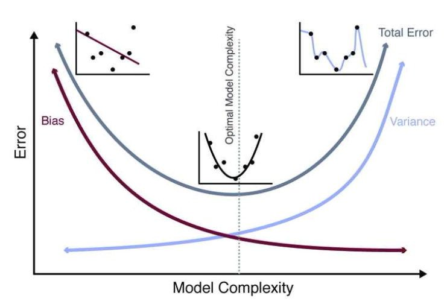
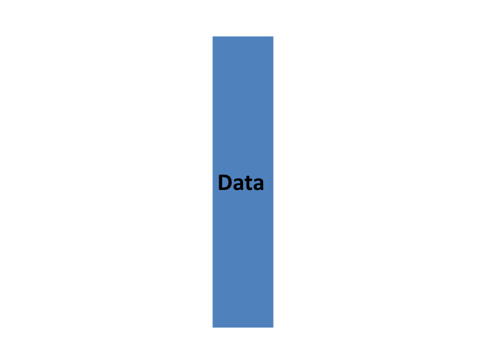
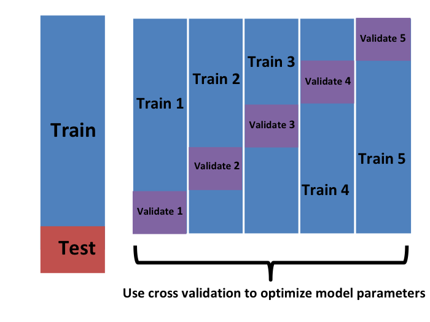
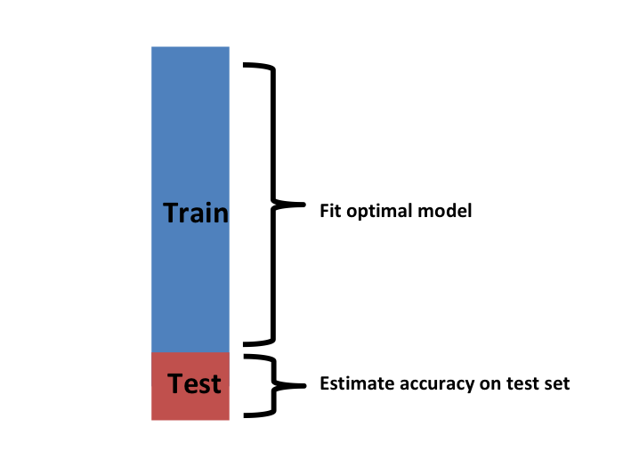
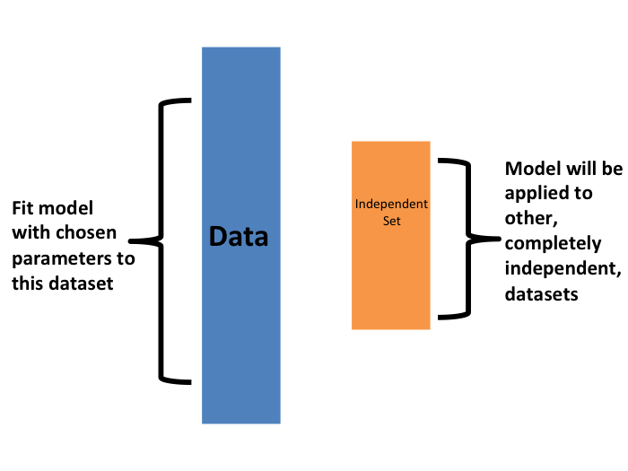
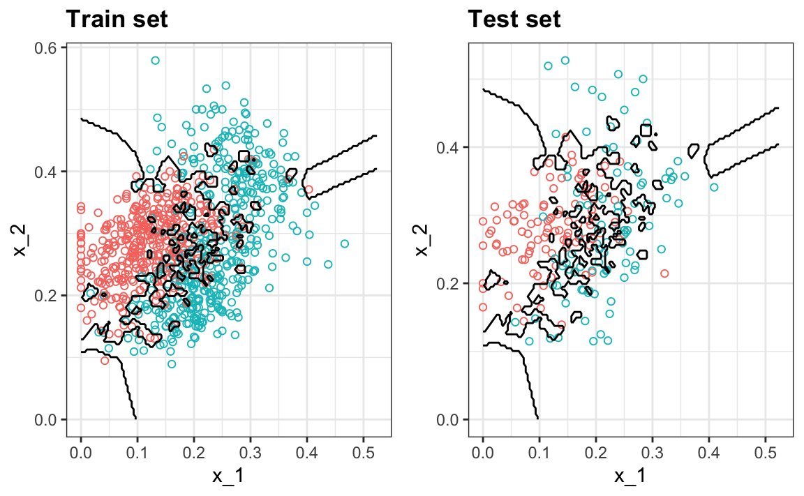
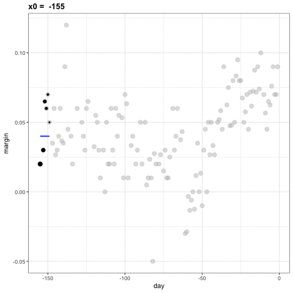
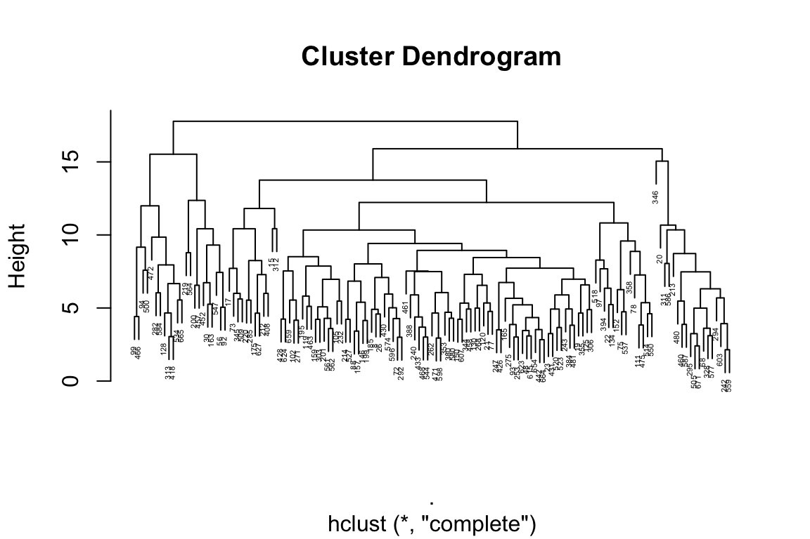

```{r}
#| label: setup
#| include: false

# Core data manipulation and visualization
library(tidyverse)
library(knitr)
library(readxl)

# Statistical analysis packages
library(MASS)        # LDA, robust regression
library(pwr)         # Power analysis
library(boot)        # Bootstrap methods
library(car)         # Companion to Applied Regression
library(nlme)        # Mixed effects models
library(broom)       # Tidy model output
library(emmeans)     # Estimated marginal means
library(e1071)       # SVM

# Set consistent theme for all plots
theme_set(theme_minimal(base_size = 14))

# Set seed for reproducibility
set.seed(2026)
```

# Week 9: Statistical Learning and Classification {background-color="#2c3e50"}

## Week 9 Topics

::: incremental
-   Introduction to statistical learning
-   Overfitting and the bias-variance tradeoff
-   Cross-validation
-   Bayesian statistics
-   K-nearest neighbors (KNN)
-   Support vector machines (SVM)
-   Hierarchical clustering
:::

::: callout-note
**Readings:** Chapters 30–35

**HW4 Due this week**
:::

## Packages for This Week {.smaller}

::: panel-tabset
### Install

```{r}
#| eval: false
#| echo: true

# Install new packages (run once)
install.packages(c("class", "caret", "cluster", "dendextend", "e1071"))
```

### Load

```{r}
#| eval: false
#| echo: true

library(tidyverse)    # Data manipulation & visualization
library(boot)         # Bootstrap and cross-validation
library(class)        # K-nearest neighbors (knn)
library(caret)        # Classification And REgression Training
library(cluster)      # Clustering algorithms
library(dendextend)   # Dendrogram visualization
library(e1071)        # Support vector machines (SVM)
library(pwr)          # Power analysis
```
:::

**Built-in datasets used this week:** `iris` (classification example)

------------------------------------------------------------------------

# Statistical Learning Overview {background-color="#2c3e50"}

## General Steps for Machine Learning {.smaller}

{fig-align="center" width="90%"}

## What is Statistical Learning? {.smaller}

-   A set of tools for **understanding data** through models
-   **Supervised learning**: predict an outcome from predictors (requires labeled data)
-   **Unsupervised learning**: find patterns without a predefined outcome variable

| Type         | Goal                | Examples                   |
|:-------------|:--------------------|:---------------------------|
| Supervised   | Predict Y from X    | Regression, classification |
| Unsupervised | Find structure in X | Clustering, PCA            |

## Machine Learning Steps {.smaller}

{fig-align="center" width="90%"}

------------------------------------------------------------------------

# The Overfitting Problem {background-color="#2c3e50"}

## Overfitting vs. Underfitting {.smaller}

::::::: columns
:::: {.column width="50%"}
::: callout-caution
## Underfitting

-   Model too simple
-   High bias
-   Misses important patterns
-   Poor performance everywhere
:::
::::

:::: {.column width="50%"}
::: callout-warning
## Overfitting

-   Model too complex
-   High variance
-   Memorizes noise
-   Great on training, poor on testing
:::
::::
:::::::

## Bias-Variance Tradeoff {.smaller}

::: panel-tabset
### Equation

$$\text{Test Error} = \text{Bias}^2 + \text{Variance} + \text{Irreducible Error}$$

### LaTeX

``` text
\text{Test Error} = \text{Bias}^2 + \text{Variance} + \text{Irreducible Error}
```
:::

-   **Bias**: error from incorrect model assumptions (too simple)
-   **Variance**: error from sensitivity to training data (too complex)
-   Goal: balance flexibility with stability

{fig-align="center" width="70%"}

## DRAFT: Bias-Variance Tradeoff {.smaller}

```{r}
#| echo: false
#| eval: true
#| fig-width: 9
#| fig-height: 6

par(mar = c(5, 5, 3, 2))

# Model complexity axis
x <- seq(0.5, 10, length.out = 200)

# Bias decreases with complexity
bias <- 3 * exp(-0.5 * x) + 0.1

# Variance increases with complexity
variance <- 0.05 * x^2

# Total error = bias^2 + variance + irreducible
irreducible <- 0.3
total <- bias^2 + variance + irreducible

# Scale for visualization
bias_plot <- bias * 1.5
var_plot <- variance * 0.8
total_plot <- (bias_plot + var_plot) * 0.7

plot(x, total_plot, type = "l", lwd = 3, col = "gray30",
     xlab = "Model Complexity", ylab = "Error",
     main = "Bias-Variance Tradeoff",
     ylim = c(0, max(total_plot) * 1.1),
     xaxt = "n", yaxt = "n",
     cex.lab = 1.4, cex.main = 1.5)

lines(x, bias_plot, lwd = 3, col = "darkred")
lines(x, var_plot, lwd = 3, col = "steelblue")

# Find optimal
opt_idx <- which.min(total_plot)
abline(v = x[opt_idx], lty = 3, col = "gray50", lwd = 1.5)

# Labels
text(1.5, max(bias_plot) * 0.85, "Bias", col = "darkred", cex = 1.4, font = 2)
text(8.5, max(var_plot) * 0.85, "Variance", col = "steelblue", cex = 1.4, font = 2)
text(8, max(total_plot) * 0.95, "Total Error", col = "gray30", cex = 1.4, font = 2)
text(x[opt_idx], -max(total_plot) * 0.02, "Optimal\nComplexity",
     cex = 1.0, srt = 0, adj = 0.5)

# Arrows for underfitting / overfitting
mtext("← Underfitting", side = 1, line = 2, adj = 0.1, cex = 1.1)
mtext("Overfitting →", side = 1, line = 2, adj = 0.9, cex = 1.1)
```

## In-Class Demo: Overfitting in Action {.smaller}

::: panel-tabset
### Output

```{r}
#| label: overfit-demo-output
#| echo: false
#| eval: true
#| fig-width: 10
#| fig-height: 4

set.seed(1)
x_pop <- runif(1000, 0, 10)
y_pop <- 6 - 0.5 * x_pop + rnorm(1000, sd = 2)

set.seed(0)
idx <- sample(1000, 25)
x_samp <- x_pop[idx]; y_samp <- y_pop[idx]

par(mfrow = c(1, 2))

plot(x_pop, y_pop, col = "lightblue", pch = 19, cex = 0.5,
     main = "Linear Model (Appropriate)", xlab = "x", ylab = "y")
points(x_samp, y_samp, col = "black", pch = 19)
abline(lm(y_samp ~ x_samp), col = "red", lwd = 2)
abline(a = 6, b = -0.5, col = "blue", lwd = 2, lty = 2)
legend("topright", c("True line", "Sample fit"), col = c("blue", "red"), lty = c(2, 1), lwd = 2)

plot(x_pop, y_pop, col = "lightblue", pch = 19, cex = 0.5,
     main = "LOESS Model (Overfit)", xlab = "x", ylab = "y")
points(x_samp, y_samp, col = "black", pch = 19)
lines(sort(x_samp), predict(loess(y_samp ~ x_samp))[order(x_samp)], col = "red", lwd = 2)
abline(a = 6, b = -0.5, col = "blue", lwd = 2, lty = 2)
```

### Code

```{r}
#| label: overfit-demo-code
#| echo: true
#| eval: false

set.seed(1)
x_pop <- runif(1000, 0, 10)
y_pop <- 6 - 0.5 * x_pop + rnorm(1000, sd = 2)

set.seed(0)
idx <- sample(1000, 25)
x_samp <- x_pop[idx]; y_samp <- y_pop[idx]

par(mfrow = c(1, 2))

# Linear model: appropriate fit
plot(x_pop, y_pop, col = "lightblue", pch = 19, cex = 0.5,
     main = "Linear Model (Appropriate)", xlab = "x", ylab = "y")
points(x_samp, y_samp, col = "black", pch = 19)
abline(lm(y_samp ~ x_samp), col = "red", lwd = 2)
abline(a = 6, b = -0.5, col = "blue", lwd = 2, lty = 2)

# LOESS: overfitting
plot(x_pop, y_pop, col = "lightblue", pch = 19, cex = 0.5,
     main = "LOESS Model (Overfit)", xlab = "x", ylab = "y")
points(x_samp, y_samp, col = "black", pch = 19)
lines(sort(x_samp), predict(loess(y_samp ~ x_samp))[order(x_samp)],
      col = "red", lwd = 2)
abline(a = 6, b = -0.5, col = "blue", lwd = 2, lty = 2)
```
:::

# BREAK {background-color="#e74c3c"}

# Cross-Validation {background-color="#2c3e50"}

## What is Cross-Validation? {.smaller}

-   Assess model performance on **unseen data**
-   Reduce overfitting by testing generalization
-   Compare different models objectively

{fig-align="center" width="70%"}

## Training vs Testing Data {.smaller}

{fig-align="center" width="80%"}

## Overfitting Problem {.smaller}

{fig-align="center" width="80%"}

## K-Fold CV Concept {.smaller}

**Process:**

1.  Split data into k folds
2.  Train on k − 1 folds
3.  Test on remaining fold
4.  Repeat k times
5.  Average results

{fig-align="center" width="80%"}

## K-Fold Cross-Validation Illustration {.smaller}

{fig-align="center" width="80%"}

## CV Results Comparison {.smaller}

{fig-align="center" width="80%"}

## Model Selection with CV {.smaller}

{fig-align="center" width="80%"}

## CV Summary {.smaller}

{fig-align="center" width="80%"}

## K-Fold Cross-Validation in R {.smaller}

::: panel-tabset
### Output

```{r}
#| label: cv-example
#| echo: false
#| eval: true

library(boot)

set.seed(123)
n <- 100
x <- runif(n, 0, 2 * pi)
y <- sin(x) + rnorm(n, 0, 0.3)
data <- data.frame(x = x, y = y)

model <- glm(y ~ poly(x, 3), data = data)
cv_result <- cv.glm(data, model, K = 10)
cat("10-fold CV MSE:", round(cv_result$delta[1], 4))
```

### Code

```{r}
#| echo: true
#| eval: false

library(boot)

set.seed(123)
n <- 100
x <- runif(n, 0, 2 * pi)
y <- sin(x) + rnorm(n, 0, 0.3)
data <- data.frame(x = x, y = y)

model <- glm(y ~ poly(x, 3), data = data)
cv_result <- cv.glm(data, model, K = 10)
cat("10-fold CV MSE:", round(cv_result$delta[1], 4))
```
:::

## Choosing K {.smaller}

| K      | Description           | Properties                       |
|:-------|:----------------------|:---------------------------------|
| K = 5  | 5-fold CV             | Good balance, common choice      |
| K = 10 | 10-fold CV            | Most popular default             |
| K = n  | Leave-one-out (LOOCV) | Maximum training data, expensive |

## CV for Polynomial Degree Selection {.smaller}

::: panel-tabset
### Output

```{r}
#| label: cv-poly-output
#| echo: false
#| eval: true
#| fig-width: 9
#| fig-height: 5

set.seed(42)
n <- 80
x <- runif(n, 0, 6)
y <- 2 + 3*x - 0.5*x^2 + rnorm(n, 0, 1.5)
df <- data.frame(x, y)

cv_errors <- numeric(10)
for (d in 1:10) {
  cv_err <- 0
  for (i in 1:n) {
    fit <- lm(y ~ poly(x, d), data = df[-i, ])
    pred <- predict(fit, df[i, , drop = FALSE])
    cv_err <- cv_err + (df$y[i] - pred)^2
  }
  cv_errors[d] <- cv_err / n
}

plot(1:10, cv_errors, type = "b", pch = 19, col = "steelblue", lwd = 2,
     xlab = "Polynomial Degree", ylab = "LOOCV Error (MSE)",
     main = "Cross-Validation for Model Selection")
abline(v = which.min(cv_errors), lty = 2, col = "red")
legend("topright", paste("Optimal degree =", which.min(cv_errors)),
       col = "red", lty = 2, bty = "n")
```

### Code

```{r}
#| label: cv-poly-code
#| echo: true
#| eval: false

# LOOCV to select optimal polynomial degree
set.seed(42)
n <- 80
x <- runif(n, 0, 6)
y <- 2 + 3*x - 0.5*x^2 + rnorm(n, 0, 1.5)
df <- data.frame(x, y)

cv_errors <- numeric(10)
for (d in 1:10) {
  cv_err <- 0
  for (i in 1:n) {
    fit <- lm(y ~ poly(x, d), data = df[-i, ])
    pred <- predict(fit, df[i, , drop = FALSE])
    cv_err <- cv_err + (df$y[i] - pred)^2
  }
  cv_errors[d] <- cv_err / n
}

# Plot CV error vs. complexity
plot(1:10, cv_errors, type = "b", pch = 19, col = "steelblue",
     xlab = "Polynomial Degree", ylab = "LOOCV MSE",
     main = "Cross-Validation for Model Selection")
abline(v = which.min(cv_errors), lty = 2, col = "red")

# The "elbow" shows where adding complexity stops helping
cat("Optimal degree:", which.min(cv_errors))
```

### Key Insight

-   CV error initially decreases as model becomes more flexible
-   After the optimal point, overfitting causes CV error to **increase**
-   This "elbow" identifies the best bias-variance tradeoff
-   Connects directly to model selection from Week 7
:::

------------------------------------------------------------------------

# Introduction to Bayesian Statistics {background-color="#2c3e50"}

## Frequentist vs. Bayesian {.smaller}

**Frequentist (what we've learned so far):**

-   Parameters are fixed, unknown constants
-   Probability = long-run frequency of events
-   Confidence intervals: "95% of such intervals contain the true parameter"
-   Focus on p-values and hypothesis tests

**Bayesian:**

-   Parameters have **probability distributions**
-   Probability = degree of belief
-   Credible intervals: "95% probability the parameter is in this range"
-   Focus on **posterior distributions**

## Bayes' Theorem Review {.smaller}

::: panel-tabset
### Equation

$$P(\theta \mid data) = \frac{P(data \mid \theta) \cdot P(\theta)}{P(data)}$$

Or more simply: $$\text{Posterior} \propto \text{Likelihood} \times \text{Prior}$$

### LaTeX

``` text
P(\theta \mid data) = \frac{P(data \mid \theta) \cdot P(\theta)}{P(data)}
```

### Components

-   **Prior** $P(\theta)$: What we believe before seeing data
-   **Likelihood** $P(data \mid \theta)$: How probable the data is given a parameter value
-   **Posterior** $P(\theta \mid data)$: Updated belief after seeing data
-   The posterior is a compromise between the prior and the data
:::

## Bayesian Estimation: Coin Flip Example {.smaller}

::: panel-tabset
### Output

```{r}
#| label: bayes-coin-output
#| echo: false
#| eval: true
#| fig-width: 10
#| fig-height: 4

par(mfrow = c(1, 3))
theta <- seq(0, 1, length.out = 100)

plot(theta, dbeta(theta, 2, 2), type = "l", lwd = 2, col = "steelblue",
     main = "Prior: Beta(2,2)", xlab = "θ (prob of heads)", ylab = "Density")

plot(theta, dbinom(7, 10, theta), type = "l", lwd = 2, col = "coral",
     main = "Likelihood: 7/10 heads", xlab = "θ", ylab = "Likelihood")

plot(theta, dbeta(theta, 9, 5), type = "l", lwd = 2, col = "darkgreen",
     main = "Posterior: Beta(9,5)", xlab = "θ", ylab = "Density")
abline(v = qbeta(c(0.025, 0.975), 9, 5), lty = 2, col = "red")
```

### Code

```{r}
#| label: bayes-coin-code
#| echo: true
#| eval: false

par(mfrow = c(1, 3))
theta <- seq(0, 1, length.out = 100)

# Prior: Beta(2, 2) — slight belief coin is fair
plot(theta, dbeta(theta, 2, 2), type = "l", lwd = 2, col = "steelblue",
     main = "Prior: Beta(2,2)", xlab = "θ (prob of heads)", ylab = "Density")

# Likelihood (binomial): 7 heads out of 10 flips
plot(theta, dbinom(7, 10, theta), type = "l", lwd = 2, col = "coral",
     main = "Likelihood: 7/10 heads", xlab = "θ", ylab = "Likelihood")

# Posterior: Beta(2+7, 2+3) = Beta(9, 5)
plot(theta, dbeta(theta, 9, 5), type = "l", lwd = 2, col = "darkgreen",
     main = "Posterior: Beta(9,5)", xlab = "θ", ylab = "Density")
abline(v = qbeta(c(0.025, 0.975), 9, 5), lty = 2, col = "red")
```
:::

## Credible Intervals {.smaller}

::: panel-tabset
### Output

```{r}
#| echo: false
#| eval: true

posterior_mean <- 9 / (9 + 5)
credible_interval <- qbeta(c(0.025, 0.975), 9, 5)

cat("Posterior mean:", round(posterior_mean, 3), "\n")
cat("95% Credible Interval:", round(credible_interval, 3), "\n")
cat("\nInterpretation: There's a 95% probability the true\n")
cat("probability of heads is between", round(credible_interval[1], 2),
    "and", round(credible_interval[2], 2))
```

### Code

```{r}
#| echo: true
#| eval: false

# Posterior: Beta(9, 5)
posterior_mean <- 9 / (9 + 5)
credible_interval <- qbeta(c(0.025, 0.975), 9, 5)

cat("Posterior mean:", round(posterior_mean, 3), "\n")
cat("95% Credible Interval:", round(credible_interval, 3))
```
:::

## Bayesian Linear Regression Concept {.smaller}

::: panel-tabset
### Output

```{r}
#| label: bayes-lm-output
#| echo: false
#| eval: true
#| fig-width: 9
#| fig-height: 4

set.seed(42)
beta1_samples <- rnorm(10000, mean = 2.3, sd = 0.4)

hist(beta1_samples, breaks = 50, col = "lightblue", border = "white",
     main = "Posterior Distribution of Slope",
     xlab = expression(beta[1]), probability = TRUE)
abline(v = quantile(beta1_samples, c(0.025, 0.975)), col = "red", lwd = 2, lty = 2)
abline(v = mean(beta1_samples), col = "darkblue", lwd = 2)
legend("topright", c("Posterior mean", "95% CI"),
       col = c("darkblue", "red"), lwd = 2, lty = c(1, 2))
```

### Code

```{r}
#| label: bayes-lm-code
#| echo: true
#| eval: false

set.seed(42)
beta1_samples <- rnorm(10000, mean = 2.3, sd = 0.4)

hist(beta1_samples, breaks = 50, col = "lightblue", border = "white",
     main = "Posterior Distribution of Slope",
     xlab = expression(beta[1]), probability = TRUE)
abline(v = quantile(beta1_samples, c(0.025, 0.975)), col = "red", lwd = 2, lty = 2)
abline(v = mean(beta1_samples), col = "darkblue", lwd = 2)
```
:::

## When to Use Bayesian Methods {.smaller}

::: callout-tip
## Consider Bayesian When:

1.  **Prior information exists** — previous studies, expert knowledge
2.  **Small sample sizes** — priors stabilize estimates
3.  **Complex models** — hierarchical models, missing data
4.  **Direct probability statements** — "90% chance effect is positive"
5.  **Sequential updating** — accumulating evidence over time
:::

**R Packages for Bayesian Analysis:**

-   **rstanarm**: Easy Bayesian regression (similar syntax to lm/glm)
-   **brms**: Flexible Bayesian models
-   **BayesFactor**: Bayesian hypothesis testing

## Bayesian Regression in Practice {.smaller}

::: panel-tabset
### Code

```{r}
#| echo: true
#| eval: false

# Install: install.packages("rstanarm")
library(rstanarm)

# Frequentist linear regression
freq_model <- lm(Petal.Length ~ Sepal.Length + Sepal.Width,
                 data = iris)
summary(freq_model)

# Bayesian equivalent — nearly identical syntax!
bayes_model <- stan_glm(Petal.Length ~ Sepal.Length + Sepal.Width,
                        data = iris,
                        family = gaussian(),
                        prior = normal(0, 5),         # weakly informative
                        prior_intercept = normal(0, 10),
                        chains = 4, iter = 2000, seed = 42)

# Posterior summary
print(bayes_model, digits = 3)

# 95% credible intervals
posterior_interval(bayes_model, prob = 0.95)

# Compare to frequentist CIs
confint(freq_model)
```

### Posterior Visualization

```{r}
#| echo: true
#| eval: false

# Plot posterior distributions of coefficients
plot(bayes_model, plotfun = "areas", prob = 0.95,
     pars = c("Sepal.Length", "Sepal.Width"))

# Posterior predictive check: does the model generate
# data that looks like the real data?
pp_check(bayes_model, plotfun = "dens_overlay", nreps = 50)

# Probability that Sepal.Length effect is positive
posterior_draws <- as.data.frame(bayes_model)
cat("P(Sepal.Length > 0) =",
    mean(posterior_draws$Sepal.Length > 0))
```

### Key Differences from Frequentist

-   **Credible intervals** have a direct probability interpretation (unlike CIs)
-   **Posterior predictive checks** tell you if the model is adequate
-   With weak priors and enough data, Bayesian and frequentist results converge
-   Bayesian approach naturally handles small samples and complex models
:::

------------------------------------------------------------------------

# K-Nearest Neighbors (KNN) {background-color="#2c3e50"}

## What is KNN? {.smaller}

KNN is a **lazy learning** algorithm that makes predictions based on the k nearest neighbors in the feature space.

-   Non-parametric method
-   Instance-based learning (no explicit training phase)
-   Used for both classification and regression
-   "Tell me who your neighbors are, and I'll tell you who you are"

## KNN and Overfitting {.smaller}

{fig-align="center" width="80%"}

## DRAFT: KNN Overfitting — Train vs Test {.smaller}

```{r}
#| echo: false
#| eval: true
#| fig-width: 10
#| fig-height: 5

library(class)

set.seed(42)
n_train <- 500
n_test <- 200

# Generate 2-class data with overlap
x1_train <- c(rnorm(n_train/2, 0.15, 0.08), rnorm(n_train/2, 0.25, 0.10))
x2_train <- c(rnorm(n_train/2, 0.25, 0.08), rnorm(n_train/2, 0.35, 0.10))
y_train <- factor(rep(c("A", "B"), each = n_train/2))

x1_test <- c(rnorm(n_test/2, 0.15, 0.08), rnorm(n_test/2, 0.25, 0.10))
x2_test <- c(rnorm(n_test/2, 0.25, 0.08), rnorm(n_test/2, 0.35, 0.10))
y_test <- factor(rep(c("A", "B"), each = n_test/2))

# KNN with k=1 (overfitting)
train_data <- data.frame(x1 = x1_train, x2 = x2_train)
test_data <- data.frame(x1 = x1_test, x2 = x2_test)

# Create grid for decision boundary
grid_x1 <- seq(min(c(x1_train, x1_test)) - 0.05, max(c(x1_train, x1_test)) + 0.05, length.out = 100)
grid_x2 <- seq(min(c(x2_train, x2_test)) - 0.05, max(c(x2_train, x2_test)) + 0.05, length.out = 100)
grid <- expand.grid(x1 = grid_x1, x2 = grid_x2)

pred_grid <- knn(train_data, grid, y_train, k = 1)

par(mfrow = c(1, 2), mar = c(5, 4, 3, 1))

# Train set
plot(x1_train, x2_train, col = ifelse(y_train == "A", "salmon", "cyan3"),
     pch = 1, cex = 0.7, xlab = "x_1", ylab = "x_2",
     main = "Train set", cex.main = 1.4, cex.lab = 1.2)
contour(grid_x1, grid_x2, matrix(as.numeric(pred_grid), 100, 100),
        levels = 1.5, add = TRUE, drawlabels = FALSE, lwd = 1.5)

# Test set
plot(x1_test, x2_test, col = ifelse(y_test == "A", "salmon", "cyan3"),
     pch = 1, cex = 0.7, xlab = "x_1", ylab = "x_2",
     main = "Test set", cex.main = 1.4, cex.lab = 1.2)
contour(grid_x1, grid_x2, matrix(as.numeric(pred_grid), 100, 100),
        levels = 1.5, add = TRUE, drawlabels = FALSE, lwd = 1.5)
```

Choosing the right value of k is crucial: k too small → overfitting; k too large → underfitting.

## KNN Algorithm Steps {.smaller}

1.  **Choose** the number of neighbors (k)
2.  **Calculate** distance between the query point and all training points
3.  **Sort** distances and identify k nearest neighbors
4.  **Classify** based on majority vote (classification) or average (regression)

## Distance Metrics for KNN {.smaller}

::: panel-tabset
### Equations

**Euclidean Distance:** $$d(x_i, x_j) = \sqrt{\sum_{l=1}^{p}(x_{il} - x_{jl})^2}$$

**Manhattan Distance:** $$d(x_i, x_j) = \sum_{l=1}^{p}|x_{il} - x_{jl}|$$

**Minkowski Distance (generalized):** $$d(x_i, x_j) = \left(\sum_{l=1}^{p}|x_{il} - x_{jl}|^q\right)^{1/q}$$

### LaTeX

``` text
d_{Euclidean} = \sqrt{\sum_{l=1}^{p}(x_{il} - x_{jl})^2}

d_{Manhattan} = \sum_{l=1}^{p}|x_{il} - x_{jl}|

d_{Minkowski} = \left(\sum_{l=1}^{p}|x_{il} - x_{jl}|^q\right)^{1/q}
```
:::

## KNN Classification in R {.smaller}

::: panel-tabset
### Code

```{r}
#| eval: false
#| echo: true

library(class)

# Prepare data
train_features <- train_data[, c("x1", "x2")]
train_labels   <- train_data$class
test_features  <- test_data[, c("x1", "x2")]

# Apply KNN
k <- 5
knn_pred <- knn(train = train_features,
                test  = test_features,
                cl    = train_labels,
                k     = k)

# Calculate accuracy
accuracy <- mean(knn_pred == test_labels)
cat("Accuracy:", accuracy)
```

### Choosing Optimal K

```{r}
#| eval: false
#| echo: true

library(caret)

# Cross-validation for optimal k
ctrl <- trainControl(method = "cv", number = 10)

knn_model <- train(class ~ x1 + x2,
                   data = train_data,
                   method = "knn",
                   trControl = ctrl,
                   tuneGrid = data.frame(k = 1:20))

plot(knn_model)
```
:::

## KNN Pros and Cons {.smaller}

**Advantages:** Simple to understand, no assumptions about data distribution, works well with small datasets, naturally handles multi-class problems

**Disadvantages:** Computationally expensive for large datasets, sensitive to irrelevant features and scale, performance degrades in high dimensions (curse of dimensionality)

::: callout-tip
Always **standardize features** before applying KNN — otherwise variables measured on larger scales will dominate the distance calculations.
:::

## Complete KNN Workflow {.smaller}

::: panel-tabset
### Code

```{r}
#| echo: true
#| eval: false

# Step 1: Prepare and normalize data
data(iris)
iris_sub <- iris[iris$Species != "setosa", ]  # 2-class problem
iris_sub$Species <- droplevels(iris_sub$Species)

# Step 2: Normalize features (critical for KNN!)
normalize <- function(x) (x - min(x)) / (max(x) - min(x))
iris_norm <- as.data.frame(lapply(iris_sub[, 1:4], normalize))
iris_norm$Species <- iris_sub$Species

# Step 3: Train/test split
set.seed(42)
train_idx <- sample(nrow(iris_norm), 0.7 * nrow(iris_norm))
train <- iris_norm[train_idx, ]
test  <- iris_norm[-train_idx, ]

# Step 4: Fit and evaluate across k values
library(class)
k_values <- seq(1, 25, by = 2)
accuracies <- sapply(k_values, function(k) {
  pred <- knn(train[, 1:4], test[, 1:4], train$Species, k = k)
  mean(pred == test$Species)
})
best_k <- k_values[which.max(accuracies)]
cat("Best k:", best_k, "with accuracy:", max(accuracies))

# Step 5: Final model and confusion matrix
final_pred <- knn(train[, 1:4], test[, 1:4], train$Species, k = best_k)
table(Predicted = final_pred, Actual = test$Species)
```

### Decision Boundaries

```{r}
#| echo: true
#| eval: false

# Visualize decision boundaries for different k values
library(class)

# Use 2 features for visualization
x1_range <- seq(0, 1, length.out = 100)
x2_range <- seq(0, 1, length.out = 100)
grid <- expand.grid(x1 = x1_range, x2 = x2_range)

par(mfrow = c(1, 3))
for (k in c(1, 7, 25)) {
  pred_grid <- knn(train[, 3:4], grid, train$Species, k = k)
  plot(grid$x1, grid$x2, col = ifelse(pred_grid == "versicolor",
       rgb(0.7, 0.7, 1, 0.3), rgb(1, 0.7, 0.7, 0.3)),
       pch = 15, cex = 0.5, main = paste("k =", k),
       xlab = "Petal.Length", ylab = "Petal.Width")
  points(train[, 3], train[, 4],
         col = ifelse(train$Species == "versicolor", "blue", "red"),
         pch = 19)
}
```
:::

# BREAK {background-color="#e74c3c"}

# Support Vector Machines (SVM) {background-color="#2c3e50"}

## What are Support Vector Machines? {.smaller}

SVMs find the optimal **hyperplane** (decision boundary) that separates classes with the **maximum margin**.

-   **Hyperplane**: Decision boundary that separates classes
-   **Support Vectors**: Data points closest to the hyperplane (the critical observations)
-   **Margin**: Distance between the hyperplane and the nearest points
-   **Maximum Margin**: SVM finds the hyperplane with the largest margin

## Mathematical Foundation {.smaller}

::: panel-tabset
### Equation

Minimize: $$\frac{1}{2}||w||^2 + C\sum_{i=1}^{n}\xi_i$$

Subject to: $y_i(w^T x_i + b) \geq 1 - \xi_i$ and $\xi_i \geq 0$

### LaTeX

``` text
\min \frac{1}{2}||w||^2 + C\sum_{i=1}^{n}\xi_i

\text{s.t. } y_i(w^T x_i + b) \geq 1 - \xi_i, \quad \xi_i \geq 0
```

### Parameters

-   $w$: weight vector (defines hyperplane orientation)
-   $b$: bias term
-   $C$: regularization parameter (tradeoff between margin width and misclassification)
-   $\xi_i$: slack variables (allow some misclassification for soft-margin SVM)
:::

## The Kernel Trick {.smaller}

**Problem**: What if data is not linearly separable?

**Solution**: Map data to a higher-dimensional space using **kernel functions** where it becomes linearly separable.

**Popular Kernels:**

-   **Linear**: $K(x_i, x_j) = x_i^T x_j$
-   **Polynomial**: $K(x_i, x_j) = (x_i^T x_j + 1)^d$
-   **RBF (Radial Basis Function)**: $K(x_i, x_j) = \exp(-\gamma ||x_i - x_j||^2)$

## Kernel Trick Visualization {.smaller}

{fig-align="center" width="80%"}

The kernel trick maps data to a higher-dimensional space where it becomes linearly separable.

## SVM in R {.smaller}

::: panel-tabset
### Code

```{r}
#| eval: false
#| echo: true

library(e1071)

# Build linear SVM
svm_linear <- svm(y ~ x1 + x2,
                  data = train_data,
                  kernel = "linear",
                  cost = 1)

# Build RBF SVM
svm_rbf <- svm(y ~ x1 + x2,
               data = train_data,
               kernel = "radial",
               cost = 1,
               gamma = 1)

# Make predictions
predictions <- predict(svm_rbf, test_data)
```

### Hyperparameter Tuning

```{r}
#| eval: false
#| echo: true

# Grid search for optimal parameters
tune_result <- tune(svm,
                    y ~ x1 + x2,
                    data = train_data,
                    kernel = "radial",
                    ranges = list(
                      cost = c(0.1, 1, 10, 100),
                      gamma = c(0.01, 0.1, 1, 10)
                    ))

print(tune_result$best.parameters)
```
:::

## SVM vs Other Algorithms {.smaller}

| Algorithm | Best For | Pros | Cons |
|:---|:---|:---|:---|
| **SVM** | High-dim, small-medium data | Robust, versatile kernels | Slow on large data |
| **Random Forest** | General purpose, large data | Fast, interpretable | Can overfit |
| **KNN** | Small datasets | Simple, no training | Slow at prediction |

## SVM Decision Boundaries by Kernel {.smaller}

::: panel-tabset
### Output

```{r}
#| label: svm-boundaries-output
#| echo: false
#| eval: true
#| fig-width: 10
#| fig-height: 4

library(e1071)
set.seed(42)
# Generate non-linearly separable data
n <- 200
r1 <- rnorm(n/2, 1.5, 0.5); t1 <- runif(n/2, 0, 2*pi)
r2 <- rnorm(n/2, 3, 0.5); t2 <- runif(n/2, 0, 2*pi)
svm_data <- data.frame(
  x1 = c(r1 * cos(t1), r2 * cos(t2)),
  x2 = c(r1 * sin(t1), r2 * sin(t2)),
  class = factor(rep(c("A", "B"), each = n/2))
)

grid <- expand.grid(
  x1 = seq(-5, 5, length.out = 100),
  x2 = seq(-5, 5, length.out = 100)
)

par(mfrow = c(1, 3), mar = c(4, 4, 3, 1))
for (kern in c("linear", "polynomial", "radial")) {
  fit <- svm(class ~ x1 + x2, data = svm_data, kernel = kern, cost = 10, gamma = 0.5)
  pred <- predict(fit, grid)
  plot(grid$x1, grid$x2, col = ifelse(pred == "A",
       rgb(0.7, 0.7, 1, 0.2), rgb(1, 0.7, 0.7, 0.2)),
       pch = 15, cex = 0.3, main = paste("Kernel:", kern),
       xlab = "x1", ylab = "x2")
  points(svm_data$x1, svm_data$x2,
         col = ifelse(svm_data$class == "A", "blue", "red"),
         pch = 19, cex = 0.6)
}
```

### Code

```{r}
#| label: svm-boundaries-code
#| echo: true
#| eval: false

library(e1071)

# Create grid for visualization
grid <- expand.grid(
  x1 = seq(-5, 5, length.out = 100),
  x2 = seq(-5, 5, length.out = 100)
)

par(mfrow = c(1, 3))
for (kern in c("linear", "polynomial", "radial")) {
  fit <- svm(class ~ x1 + x2, data = svm_data,
             kernel = kern, cost = 10, gamma = 0.5)
  pred <- predict(fit, grid)

  plot(grid$x1, grid$x2,
       col = ifelse(pred == "A",
             rgb(0.7, 0.7, 1, 0.2), rgb(1, 0.7, 0.7, 0.2)),
       pch = 15, cex = 0.3, main = paste("Kernel:", kern),
       xlab = "x1", ylab = "x2")
  points(svm_data$x1, svm_data$x2,
         col = ifelse(svm_data$class == "A", "blue", "red"),
         pch = 19, cex = 0.6)
}
```

### Takeaway

-   **Linear**: Straight boundary — fails on non-linearly separable data
-   **Polynomial**: Curved boundary — captures moderate non-linearity
-   **RBF (Radial)**: Flexible boundary — captures complex shapes; most versatile
:::

------------------------------------------------------------------------

# Hierarchical Clustering {background-color="#2c3e50"}

## What is Hierarchical Clustering? {.smaller}

Creates a tree-like structure (**dendrogram**) of nested clusters.

**Two main types:**

1.  **Agglomerative (Bottom-up):** Start with each point as its own cluster, merge closest clusters iteratively
2.  **Divisive (Top-down):** Start with all points in one cluster, split iteratively

## Dendrogram Example {.smaller}

{fig-align="center" width="80%"}

## DRAFT: Hierarchical Clustering Dendrogram {.smaller}

```{r}
#| echo: false
#| eval: true
#| fig-width: 10
#| fig-height: 6

# Generate clustered data
set.seed(123)
n <- 100
x <- rbind(
  matrix(rnorm(n * 2, mean = 0, sd = 1), ncol = 2),
  matrix(rnorm(n * 2, mean = 4, sd = 1.2), ncol = 2),
  matrix(rnorm(n/2 * 2, mean = c(8, 0), sd = 1), ncol = 2)
)

# Hierarchical clustering with complete linkage
d <- dist(x)
hc <- hclust(d, method = "complete")

par(mar = c(2, 5, 3, 1))
plot(hc, main = "Cluster Dendrogram", xlab = "", sub = "",
     cex = 0.5, cex.main = 1.5, cex.lab = 1.2)
```

Cut the tree at different heights to get different numbers of clusters.

## Linkage Methods {.smaller}

::: panel-tabset
### Equations

**Single Linkage (Minimum):** $$d(C_i, C_j) = \min_{x \in C_i, y \in C_j} d(x, y)$$

**Complete Linkage (Maximum):** $$d(C_i, C_j) = \max_{x \in C_i, y \in C_j} d(x, y)$$

**Average Linkage:** $$d(C_i, C_j) = \frac{1}{|C_i||C_j|} \sum_{x \in C_i} \sum_{y \in C_j} d(x, y)$$

**Ward's Method:** Minimizes within-cluster sum of squares

### LaTeX

``` text
d_{single}(C_i, C_j) = \min_{x \in C_i, y \in C_j} d(x, y)

d_{complete}(C_i, C_j) = \max_{x \in C_i, y \in C_j} d(x, y)

d_{average}(C_i, C_j) = \frac{1}{|C_i||C_j|} \sum \sum d(x, y)
```
:::

## Hierarchical Clustering in R {.smaller}

::: panel-tabset
### Code

```{r}
#| eval: false
#| echo: true

# Calculate distance matrix
dist_matrix <- dist(data, method = "euclidean")

# Perform hierarchical clustering
hclust_ward <- hclust(dist_matrix, method = "ward.D2")

# Plot dendrogram
plot(hclust_ward, main = "Dendrogram (Ward's Method)")

# Cut tree to get clusters
clusters <- cutree(hclust_ward, k = 3)
```

### Enhanced Dendrograms

```{r}
#| eval: false
#| echo: true

library(dendextend)

dend <- as.dendrogram(hclust_ward)

dend %>%
  color_branches(k = 3) %>%
  color_labels(k = 3) %>%
  plot(main = "Colored Dendrogram")

rect.dendrogram(dend, k = 3, border = "red")
```
:::

## Silhouette Analysis and Cophenetic Correlation {.smaller}

::: panel-tabset
### Silhouette

```{r}
#| eval: false
#| echo: true

library(cluster)

# Silhouette scores for different k
silhouette_scores <- numeric(9)
for (k in 2:10) {
  clusters <- cutree(hclust_ward, k = k)
  sil <- silhouette(clusters, dist_matrix)
  silhouette_scores[k - 1] <- mean(sil[, "sil_width"])
}

plot(2:10, silhouette_scores, type = "b",
     xlab = "Number of Clusters",
     ylab = "Average Silhouette Score")
```

### Cophenetic Correlation

```{r}
#| eval: false
#| echo: true

# Cophenetic correlation: how well does the dendrogram
# preserve original pairwise distances?
cophenetic_dist <- cophenetic(hclust_ward)
coph_corr <- cor(dist_matrix, cophenetic_dist)
cat("Cophenetic correlation:", round(coph_corr, 3))
# Values closer to 1 = better preservation
```
:::

## Clustered Heatmap {.smaller}

Clustered heatmaps are ubiquitous in genomics and bioengineering — they show both the data and the hierarchical clustering simultaneously.

::: panel-tabset
### Output

```{r}
#| label: heatmap-output
#| echo: false
#| eval: true
#| fig-width: 8
#| fig-height: 6

# Heatmap of iris data
iris_mat <- as.matrix(iris[, 1:4])
rownames(iris_mat) <- paste0(substr(iris$Species, 1, 2), 1:150)
heatmap(iris_mat, scale = "column",
        col = hcl.colors(50, "RdYlBu"),
        main = "Clustered Heatmap: Iris Data",
        labRow = NA)
```

### Code

```{r}
#| label: heatmap-code
#| echo: true
#| eval: false

# Base R heatmap (rows and columns clustered automatically)
iris_mat <- as.matrix(iris[, 1:4])
heatmap(iris_mat, scale = "column",
        col = hcl.colors(50, "RdYlBu"),
        main = "Clustered Heatmap: Iris Data")

# Using pheatmap for more control
# install.packages("pheatmap")
library(pheatmap)
annotation_row <- data.frame(Species = iris$Species)
rownames(annotation_row) <- rownames(iris_mat)

pheatmap(iris_mat,
         scale = "column",
         clustering_method = "ward.D2",
         annotation_row = annotation_row,
         show_rownames = FALSE,
         color = hcl.colors(50, "RdYlBu"),
         main = "Iris Features Clustered Heatmap")
```

### When to Use

-   **Gene expression** across samples and conditions
-   **Biomaterial properties** across formulations
-   **Multi-analyte assays** (cytokine panels, metabolomics)
-   Any matrix where you want to see patterns in both rows and columns
:::

------------------------------------------------------------------------

# K-Means Clustering {background-color="#2c3e50"}

## What is K-Means? {.smaller}

K-means partitions data into **k clusters** by minimizing within-cluster variance:

::: panel-tabset
### Algorithm

1.  **Initialize** k cluster centers (randomly or with k-means++)
2.  **Assign** each point to its nearest center
3.  **Update** each center to the mean of its assigned points
4.  **Repeat** steps 2–3 until convergence

### Equation

$$\min_{C_1, \ldots, C_k} \sum_{j=1}^{k} \sum_{x_i \in C_j} ||x_i - \mu_j||^2$$

Where $\mu_j$ is the centroid of cluster $C_j$.

### LaTeX

``` text
\min_{C_1, \ldots, C_k} \sum_{j=1}^{k} \sum_{x_i \in C_j} ||x_i - \mu_j||^2
```
:::

## K-Means in R {.smaller}

::: panel-tabset
### Output

```{r}
#| label: kmeans-output
#| echo: false
#| eval: true
#| fig-width: 10
#| fig-height: 4

iris_scaled <- scale(iris[, 1:4])
par(mfrow = c(1, 2))

# Elbow method
wss <- sapply(1:10, function(k) {
  kmeans(iris_scaled, k, nstart = 25)$tot.withinss
})
plot(1:10, wss, type = "b", pch = 19, col = "steelblue",
     xlab = "Number of Clusters (k)", ylab = "Total Within-Cluster SS",
     main = "Elbow Method")

# K-means with k = 3
km_fit <- kmeans(iris_scaled, 3, nstart = 25)
plot(iris$Petal.Length, iris$Petal.Width,
     col = c("steelblue", "coral", "forestgreen")[km_fit$cluster],
     pch = 19, xlab = "Petal Length", ylab = "Petal Width",
     main = "K-Means Clusters (k = 3)")
points(km_fit$centers[, 3:4] * attr(iris_scaled, "scaled:scale")[3:4] +
       attr(iris_scaled, "scaled:center")[3:4],
       pch = 8, cex = 2, lwd = 3)
```

### Code

```{r}
#| label: kmeans-code
#| echo: true
#| eval: false

# Scale data first
iris_scaled <- scale(iris[, 1:4])

# Elbow method: find optimal k
wss <- sapply(1:10, function(k) {
  kmeans(iris_scaled, k, nstart = 25)$tot.withinss
})
plot(1:10, wss, type = "b", pch = 19,
     xlab = "k", ylab = "Total Within-SS",
     main = "Elbow Method")

# Fit k-means with chosen k
set.seed(42)
km_fit <- kmeans(iris_scaled, centers = 3, nstart = 25)

# Visualize clusters
plot(iris$Petal.Length, iris$Petal.Width,
     col = km_fit$cluster, pch = 19,
     xlab = "Petal Length", ylab = "Petal Width")

# Compare k-means to true labels
table(Cluster = km_fit$cluster, True = iris$Species)
```
:::

## K-Means vs. Hierarchical Clustering {.smaller}

| Feature             | K-Means               | Hierarchical          |
|:--------------------|:----------------------|:----------------------|
| **Must specify k?** | Yes (in advance)      | No (cut tree later)   |
| **Cluster shape**   | Spherical             | Any shape             |
| **Scalability**     | Fast (large datasets) | Slow (O(n²) or O(n³)) |
| **Deterministic?**  | No (random init)      | Yes                   |
| **Visualization**   | Scatter plots         | Dendrograms           |

::: callout-tip
Use the **elbow method** or **silhouette scores** to choose k for k-means. Consider running both methods and comparing results for robustness.
:::

## R Exercise: Statistical Learning {.smaller}

::: callout-tip
## Exercise

Using the `iris` dataset for classification:

1.  Split data into training (80%) and test (20%) sets
2.  Train a KNN classifier with k = 5 to predict Species
3.  Evaluate accuracy on the test set
4.  Use cross-validation to find optimal k (1 to 20)
5.  Compare to an SVM classifier with RBF kernel

```{r}
#| eval: false
#| echo: true

# Starter code
library(class)
set.seed(123)
n <- nrow(iris)
train_idx <- sample(n, 0.8 * n)
train <- iris[train_idx, ]
test  <- iris[-train_idx, ]

# Your analysis here...
```
:::

------------------------------------------------------------------------

